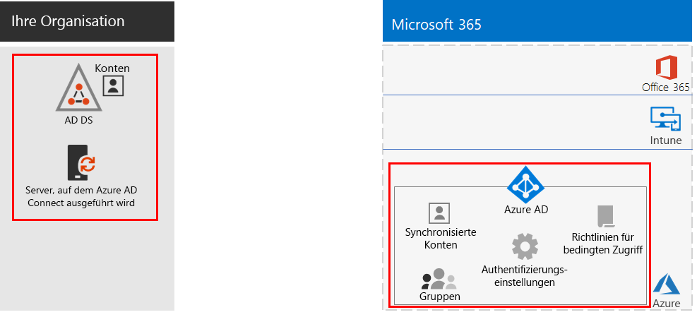
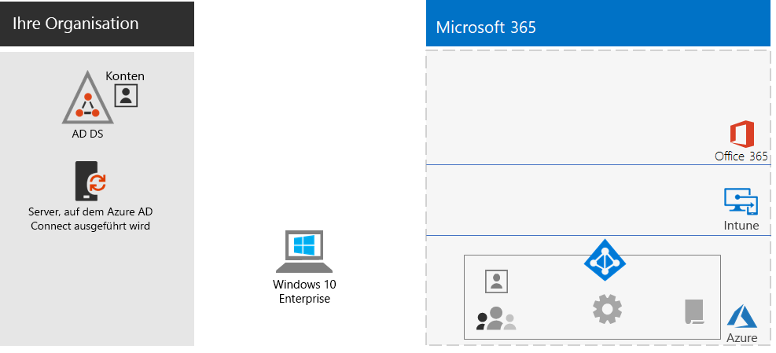
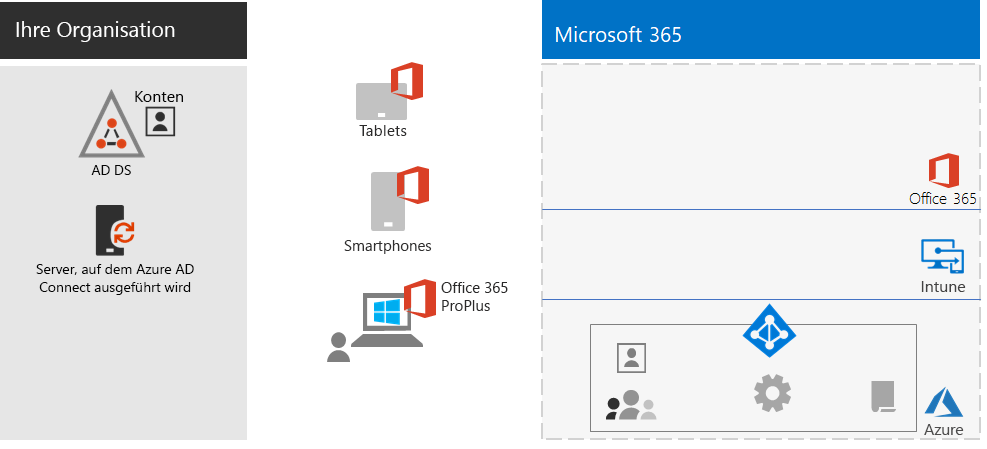
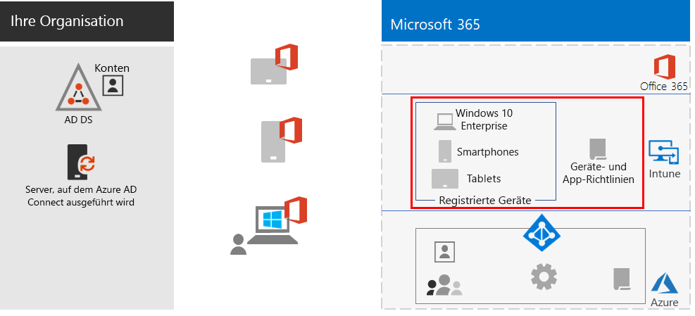
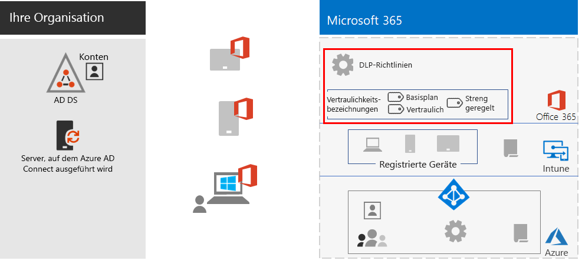
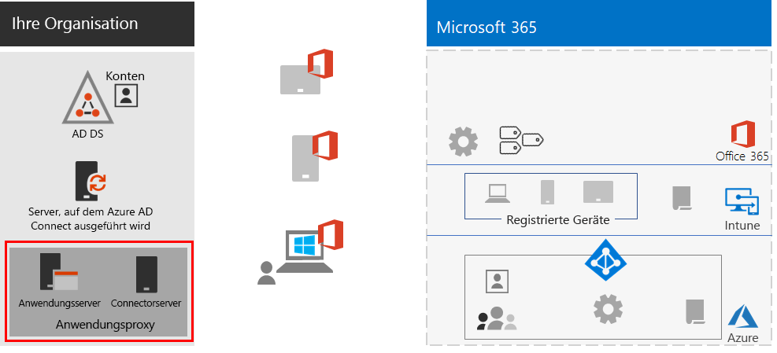
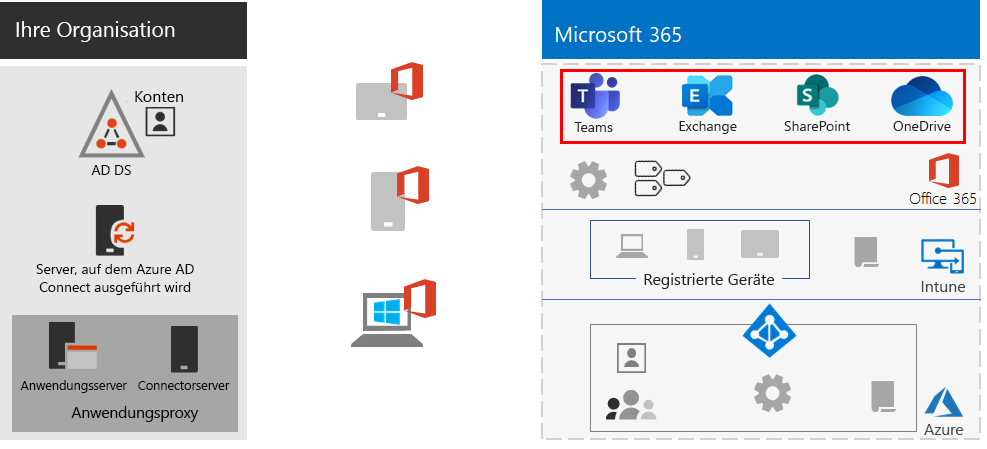
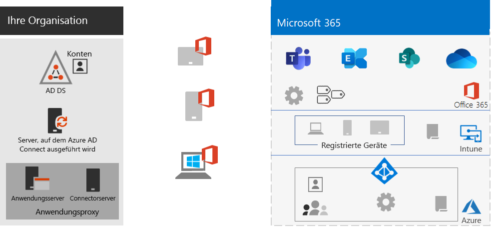
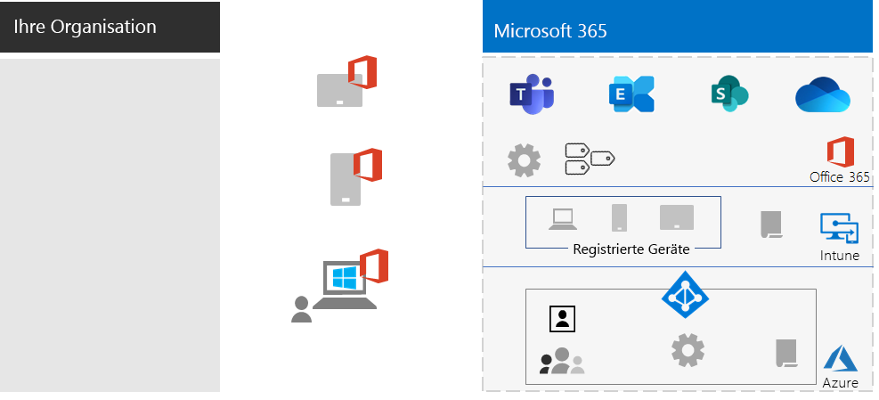

# Fördern von RemotemitarbeiternEmpower remote workers

*Dieses Szenario gilt für die Versionen E3 und E5 von Microsoft 365 Enterprise.**This scenario applies to both the E3 and E5 versions of Microsoft 365 Enterprise*

Für viele Organisationen ist es wichtig, dass die Mitarbeiter auch außerhalb des Büros nahtlos und sicher arbeiten können. Auf diese Weise können die Organisationen Arbeitsplätze einsparen, Mitarbeiter einzustellen oder behalten, die nicht bereit sind, umzuziehen, und das Pendeln der Mitarbeiter reduzieren, damit diese ihre Zeit produktiver nutzen und durch Aktivitäten außerhalb des Arbeitsplatzes Stressfaktoren abbauen können.Allowing employees to work away from the office seamlessly and securely is important for many organizations to save on office space, hire and retain employees who are unwilling to relocate, and reduce employee commuting, leaving them with more time to be productive and for stress-reducing activities outside of work.

Remotearbeit, auch als "Telearbeit" oder "Heimarbeit" bezeichnet, kann ein breites Spektrum umfassen:Remote working, also known as teleworking, can span a spectrum that includes:

- Mitarbeiter, die sich gelegentlich für Konferenzen oder Kundenbesprechungen außerhalb des Büros befinden.Employees that are occasionally away from the office for conferences or client meetings.
- Einige Mitarbeiter, die Telearbeit in Vollzeit ausüben.Some employees that work remotely full-time.
- Eine Komplette Remoteorganisation, die kein eigenes Büro unterhält und deren Mitarbeiter alle remote arbeiten.A fully remote organization in which there is no office and all employees are remote.

Zur Unterstützung Ihrer Remotemitarbeiter bietet Microsoft 365 Enterprise eine umfassende Kombination aus Features für die Zusammenarbeit, z. B.:To support remote workers, a combination of features in Microsoft 365 Enterprise enables your remote workers in a highly collaborative way, such as:

- Onlinebesprechungen und Chatsitzungen.Online meetings and chat sessions.
- Freigegebene Arbeitsbereiche für cloudbasierte Dateispeicherung mit globalem Zugriff und Zusammenarbeit in Echtzeit.Shared workspaces for cloud-based file storage with global accessibility and real-time collaboration.
- Gemeinsame Aufgaben und Workflows, um die Arbeit aufzuteilen und Dinge zu erledigen.Shared tasks and workflows to divide up the work and get things done.

Für eine starke Sicherheit bietet Microsoft 365 Enterprise Folgendes:For strong security, Microsoft 365 Enterprise includes:

- Anforderungen für eine erzwungene Authentifizierung, Erkennen von und Reagieren auf Anmeldungen mit hohem Risiko und Blockieren ausgewählter Apps und nicht kompatibler Geräte.Enforced authentication requirements, detecting and responding to high-risk sign-ins, and blocking selected apps and non-compliant devices.
- Verschlüsselte Verbindungen und digitale Objekte in der Cloud.Encrypted connections and digital assets in the cloud.
- Berechtigungen, mit denen definiert werden kann, wer mit Dateien wie umgehen kann.Permissions to define who can do what with files.
- Verhinderung von Datenverlust (DLP), um die Offenlegung von stark regulierten Daten zu verhindern.Data loss prevention (DLP) to prevent leakage of highly regulated data.

Damit Remotemitarbeiter diese Kriterien erfüllen, verwenden Sie die folgenden Microsoft 365 Enterprise-Features:To meet these criteria for remote workers, use the following Microsoft 365 Enterprise features:

- Benutzeridentität und AnmeldesicherheitUser identity and sign-in security
  - Azure Active Directory-Benutzerkonten (Azure AD) mit mehrstufiger Authentifizierung (MFA)Azure Active Directory (Azure AD) user accounts with multi-factor authentication (MFA)
  - Richtlinien für den bedingten Zugriff, die MFA für riskante Anmeldungen erfordernConditional Access policies to require MFA for risky sign-ins
- Plattformen für die ZusammenarbeitCollaboration platforms
  - Microsoft Teams, SharePoint und OneDrive, mit denen Remotemitarbeiter videobasierte Onlinebesprechungen planen und daran teilnehmen sowie gemeinsam an den gleichen Dokumenten arbeiten könnenMicrosoft Teams, SharePoint, and OneDrive, with which remote workers can schedule and attend online video-based meetings and work on the same documents at the same time
- Absichern des Zugriffs auf RessourcenSecure access to resources
  - Mit Gruppen und Berechtigungen für Teams, SharePoint-Websites und OneDrive können Sie festlegen, dass nur authentifizierte und berechtigte Benutzer Zugriff haben.Groups and permissions for Teams, SharePoint sites, and OneDrive so that only authenticated and permitted users have access
- Schutz für offengelegte DateienProtection for leaked files
  - Office 365-DLP-RichtlinienOffice 365 DLP policies
  - Vertraulichkeitsbezeichnungen für Verschlüsselung und Berechtigungen, die mit den Dateien verknüpft sindSensitivity labels for encryption and permissions that travel with files
- Geräteverwaltung mit und -sicherheit mit Microsoft IntuneDevice management and security with Microsoft Intune
  - Registrierung für verwaltete GeräteEnrollment for managed devices
  - App-Einstellungen für persönliche GeräteApp settings for personal devices
  - Geräte- und App-RichtlinienDevice and app policies
- Produktivitäts-Apps für GeräteProductivity apps for devices
  - Office 365 ProPlus-Apps für die Zusammenarbeit mit Microsoft Teams, SharePoint und OneDriveOffice 365 ProPlus apps for collaborative experiences with Teams, SharePoint, and OneDrive 
- Windows 10 EnterpriseWindows 10 Enterprise
  - Umfassende Sicherheitsfeatures zum Schutz vor Cyberattacken und zum Verhindern von DatenverlustComprehensive security features to protect against cyberattacks and prevent data leakage
- Zugriff auf lokale AppsAccess to on-premises apps
  - Organisationen, die Hybrididentitäten verwenden, können Azure AD-Anwendungsproxy- anstelle von VPN-Verbindungen verwenden.Organizations that have hybrid identity can use Azure AD Application Proxy instead of virtual private network (VPN) connections

In den folgenden Phasen werden Sie schrittweise durch die Bereitstellung des Microsoft 365 Enterprise-Features für den Remotezugriff und die Förderung der Akzeptanz bei Remotemitarbeitern geführt.The following phases step you through deploying the feature of Microsoft 365 Enterprise for remote access and driving adoption for remote workers. Wenn Sie bereits Elemente dieser Phasen bereitgestellt haben, stellen Sie sicher, dass sie die aufgeführten Voraussetzungen erfüllen, bevor Sie zum nächsten Element wechseln.If you have already deployed elements of these phases, ensure that they meet the stated requirements before moving on to the next element.

 Eine einseitige Zusammenfassung dieses Szenarios finden Sie auf dem [Poster "Fördern von Remotemitarbeitern"](../media/empower-people-to-work-remotely/empower-remote-workers-scenario.pdf).For a 1-page summary of this scenario, see the [Empower remote workers poster](../media/empower-people-to-work-remotely/empower-remote-workers-scenario.pdf).

Sie können dieses Poster auch im [PDF](https://github.com/MicrosoftDocs/microsoft-365-docs/raw/public/microsoft-365/media/empower-people-to-work-remotely/empower-remote-workers-scenario.pdf)- oder [PowerPoint](https://github.com/MicrosoftDocs/microsoft-365-docs/raw/public/microsoft-365/media/empower-people-to-work-remotely/Empower-Remote-Workers-Poster.pptx)-Format herunterladen und in den Formaten "Brief", "Legal" oder "Tabloid" (27,94 x 43,18 cm) ausdrucken.You can also download this poster in [PDF](https://github.com/MicrosoftDocs/microsoft-365-docs/raw/public/microsoft-365/media/empower-people-to-work-remotely/empower-remote-workers-scenario.pdf) or [PowerPoint](https://github.com/MicrosoftDocs/microsoft-365-docs/raw/public/microsoft-365/media/empower-people-to-work-remotely/Empower-Remote-Workers-Poster.pptx) formats and print it on letter, legal, or tabloid (11 x 17)-sized paper.

## Phase 1: Bereitstellen von Microsoft 365-Features und -Funktionen für RemotemitarbeiterPhase 1: Deploy Microsoft 365 features and capabilities for remote workers

Aufgrund der für dieses Szenario erforderlichen Auswahl und Anzahl von Features und Funktionen führen wir Sie schrittweise durch die erforderlichen Elemente der Abschnitte "Foundation-Infrastruktur und -Workloads" des [Microsoft 365 Enterprise-Bereitstellungshandbuchs](deploy-microsoft-365-enterprise.md).Because of the breadth and number of features and capabilities required for this scenario, we’ll step you through the required elements of the foundation infrastructure and workloads sections of the [Microsoft 365 Enterprise Deployment Guide](deploy-microsoft-365-enterprise.md).

### Schritt 1: Foundation- Infrastrukturanforderungen für RemotemitarbeiterStep 1: Foundation infrastructure requirements for remote workers

In diesem Schritt werden die Phasen der [Foundation-Infrastruktur](deploy-foundation-infrastructure.md) beschrieben und die erforderlichen Elemente aufgelistet, um Remotearbeit zu ermöglichen.In this step, we’ll visit the phases of the [foundation infrastructure](deploy-foundation-infrastructure.md) and list the required elements to enable remote workers.

Für [Phase 2: Identität](identity-infrastructure.md) stellen Sie Folgendes für Benutzeridentitäts- und Anmeldesicherheit bereit:For [Phase 2: Identity](identity-infrastructure.md), deploy the following for user identity and sign-in security:

- Für die Hybrididentität: Benutzerkonten und Gruppen, die mit lokalen Active Directory Domain Services (AD DS) synchronisiert werden.For hybrid identity, user accounts and groups synchronized from on-premises Active Directory Domain Services (AD DS).
- Zum Zuweisen von Berechtigungen: Synchronisierte oder Azure AD-Gruppen mit den entsprechenden Mitgliedern.For assigning permissions, synchronized or Azure AD groups with the appropriate members.
- Authentifizierungseinstellungen, z. B. "MFA erforderlich".Authentication settings, such as requiring MFA.
- Richtlinien für den bedingten Zugriff, die MFA für riskante Anmeldungen erfordern und Sperren von Clients, die moderne Authentifizierung nicht unterstützen.Conditional Access policies to require MFA for risky sign-ins and block clients that don’t support modern authentication.

Hier sehen Sie die resultierende Konfiguration, wobei die Identitätselemente hervorgehoben sind.Here's the resulting configuration with the identity elements highlighted.

 
Für [Phase 3: Windows 10 Enterprise](windows10-infrastructure.md) stellen Sie Folgendes bereit:For [Phase 3: Windows 10 Enterprise](windows10-infrastructure.md), deploy:

- Die Infrastruktur zur Bereitstellung neuer Geräte mit Windows 10 Enterprise und zum Upgrade von Windows 7 oder Windows 8.1-Geräten auf Windows 10 EnterpriseThe infrastructure to deploy new devices with Windows 10 Enterprise and to upgrade of your Windows 7 or Windows 8.1 devices to Windows 10 Enterprise
- Bereitstellung umfassender Sicherheitsfeatures für Identitäts-, Bedrohungs- und InformationsschutzEnabling comprehensive security features for identity, threat, and information protection

Hier sehen Sie die resultierende Konfiguration mit Windows 10 Enterprise-Geräten.Here's the resulting configuration with Windows 10 Enterprise devices.

 
Für [Phase 4: Office 365 ProPlus](office365proplus-infrastructure.md) stellen Sie die Infrastruktur bereit, um Office 365 ProPlus zu installieren oder die aktuell installierte Office-Suite (z. B. Office 2010 oder Office 2013) auf den Geräten Ihrer Organisation auf Office 365 ProPlus zu aktualisieren.For [Phase 4: Office 365 ProPlus](office365proplus-infrastructure.md), deploy the infrastructure to install Office 365 ProPlus or upgrade your currently installed Office suite, such as Office 2010 or Office 2013, to Office 365 ProPlus on your organization devices. Auf diese Weise schaffen Sie für Ihre Benutzer die beste Umgebung für Sicherheit und Zusammenarbeit.This will give your users the best security and collaborative experiences.

Hier sehen Sie die resultierende Konfiguration, in der Office 365 ProPlus auf den Geräten installiert ist.Here's the resulting configuration with Office 365 ProPlus installed on devices.

 
Für [Phase 5: Verwaltung mobiler Geräte](mobility-infrastructure.md) stellen Sie Intune-Geräte- und -App-Verwaltung bereit für:For [Phase 5: Mobile device management](mobility-infrastructure.md), deploy Intune device and app management for:

- Registrierung Ihrer Windows 10 Enterprise-, iOS-, macOS-, Android- und Android Enterprise-Geräte, damit sie von Ihrer Organisation definierte Features und Sicherheitseinstellungen erhalten.Enrollment of your Windows 10 Enterprise, iOS, macOS, Android, and Android Enterprise devices so they receive features and security settings defined by your organization.
- App-Einstellungen für zusätzliche Sicherheit und zum Zulassen oder Blockieren von Apps, sogar auf persönlichen Geräten de Mitarbeiter.App settings for extra security and to allow or block apps, even on employee-owned personal devices.
- Compliancerichtlinien mit bedingtem Zugriff, um zu verhindern, dass nicht konforme Geräte eine Verbindung herstellen.Compliance policies with Conditional Access to prevent non-compliant devices from connecting.

Hier sehen Sie die resultierende Konfiguration, wobei die bei Intune registrierten Geräte und Richtlinien hervorgehoben sind.Here's the resulting configuration with Intune enrolled devices and policies highlighted.

 
Für [Phase 6: Informationsschutz](infoprotect-infrastructure.md) entwerfen und konfigurieren Sie den Schutz für Ihre digitalen Objekte mit:For [Phase 6: Information protection](infoprotect-infrastructure.md), design and configure protection for your digital assets with:

- Office 365-DLP-Richtlinien.Office 365 DLP policies.
- Office 365-Vertraulichkeitsbezeichnungen für Verschlüsselung und Berechtigungen, die mit den Dateien verknüpft sind.Office 365 sensitivity labels for encryption and permissions that travel with files.

Hier sehen Sie die resultierende Konfiguration, wobei die DLP-Richtlinien und Vertraulichkeitsbezeichnungen hervorgehoben sind.Here's the resulting configuration with DLP policies and sensitivity labels highlighted.

 
Für den Zugriff auf lokale Apps können Sie den [Azure AD-Anwendungsproxy](https://docs.microsoft.com/azure/active-directory/manage-apps/application-proxy) verwenden, der eine Hybrididentitätsumgebung erfordert.For access to on-premises apps, you can use [Azure AD Application Proxy](https://docs.microsoft.com/azure/active-directory/manage-apps/application-proxy), which requires a hybrid identity environment.

Hier sehen Sie die resultierende Konfiguration, wobei die Anwendungsproxykonfiguration hervorgehoben ist.Here's the resulting configuration with the application proxy components highlighted.

 
### Schritt 2: Workloads für RemotemitarbeiterStep 2: Workloads for remote workers

Für [Exchange Online](exchangeonline-workload.md) stellen Sie Exchange Online-Postfächer für alle Benutzer bereit.For [Exchange Online](exchangeonline-workload.md), deploy Exchange Online mailboxes to each of your users.

Für [Teams](teams-workload.md) stellen Sie Microsoft Teams für Ihre Benutzer und Gruppen bereit.For [Teams](teams-workload.md), deploy Teams to your users and groups.

Für [SharePoint und OneDrive](sharepoint-online-onedrive-workload.md) stellen Sie SharePoint-Team- oder -Kommunikationswebsites und OneDrive-Ordner bereit.For [SharePoint and OneDrive](sharepoint-online-onedrive-workload.md), deploy SharePoint team or communication sites and OneDrive folders.

Hier sehen Sie die resultierende Konfiguration, wobei die Workloads hervorgehoben sind.Here's the resulting configuration with the workloads highlighted.

 
### BereitstellungsergebnisseDeployment results

Nach der Bereitstellung der Foundation-Infrastruktur und -Workloads sowie dem Rollout von Windows 10 Enterprise und Office 365 ProPlus gilt für Remotemitarbeiter:After deploying the foundation infrastructure and workloads and rolling out Windows 10 Enterprise and Office 365 ProPlus, remote workers:

- Sie unterliegen einer starken Authentifizierung und einem Identitätsschutz.Are subject to strong authentication and identity protection.
- Sie verfügen über die neueste und sicherste Version von Windows auf Ihren Windows-Geräten.Have the latest and most secure version of Windows on their Windows devices.
- Sie verfügen über die neueste und produktivste Version der Office-Suite auf den Geräten.Have the latest and most productive version of the Office suite on their devices.
- Sie unterliegen App-Verwaltungs- und Gerätecompliancerichtlinien.Are subject to app management and device compliance policies.
- Sie unterliegen DLP-Richtlinien und Einschränkungen.Are subject to DLP policies and restrictions.
- Sie können Vertraulichkeitsbezeichnungen für Verschlüsselung und Berechtigungen zuweisen, die mit Dateien und E-Mails verknüpft sind.Can assign sensitivity labels for encryption and permissions that travel with files and email.
- Sie können auf lokale Apps ohne VPN-Verbindung zugreifen.Can access on-premises apps without a VPN connection.
- Sie können Ihre eigene Arbeit ausführen und in Echtzeit mit Kollegen zusammenarbeiten, an Chats und Besprechungen teilnehmen sowie Dateien in Teams, SharePoint und OneDrive teilen.Can perform their own work and participate in real-time collaboration with co-workers with chats, meetings, and files in Teams and files in SharePoint and OneDrive.

Wenn sie offline (nicht mit dem Internet verbunden) sind, können Ihre Remotemitarbeiter lokale Kopien von Dateien ändern.When offline (not connected to the Internet), your remote workers can change local copies of files. Wenn sie wieder eine Verbindung mit dem Internet herstellen, synchronisiert OneDrive die lokale Kopien mit den in Ihrem Microsoft 365-Abonnement gespeicherten Dateien.When they reconnect to the Internet, OneDrive synchronizes local copies with the files stored in your Microsoft 365 subscription. 

Hier sehen Sie die resultierende Konfiguration für Remotemitarbeiter Ihrer Organisation bei Verwendung von Hybrididentität.Here's the resulting configuration for remote workers of your organization if you use hybrid identity.

 
 
Hier sehen Sie die resultierende Konfiguration für Remotemitarbeiter Ihrer Organisation bei Verwendung reiner Cloudidentität.Here's the resulting configuration for remote workers your organization if you use cloud-only identity.

## Phase 2: Fördern der Benutzerakzeptanz für RemotemitarbeiterPhase 2: Drive user adoption for remote workers

Jetzt, da die Foundation-Infrastruktur und Workloads vorhanden sind, ist es an der Zeit, die fortlaufende Nutzung dieser Funktionen durch Ihre Remotemitarbeiter zu fördern, damit sie überall und jederzeit produktiv sein können.Now that the foundation infrastructure and workloads are in place, it’s time to drive the ongoing usage of these capabilities to your remote workers so they can be productive anywhere and at any time.

### Schritt 1: Schulen der BenutzerStep 1: Train your users

Schulen Sie Ihre Remotemitarbeiter in folgenden Bereichen:Train your remote workers on:

- Korrekte Anmeldeverfahren, einschließlich MFA-Registrierung und Umgang mit Anmeldungen bei Entdeckung eines Risikos.Proper sign-in procedures, including MFA registration, and how sign ins can be challenged when risk is detected.
- Verwendung von Geräten und Anwenden von Richtlinien, um den Zugriff für nicht konforme Geräte zu blockieren.The use of devices and how policies can be used to block access for non-compliant devices.
- Verwendung von zulässigen Apps und Anwenden von Intune-App-Richtlinien, um Apps zu blockieren.The use of allowed apps and how Intune app polices can be used to block apps.
- Sicherheitsfeatures von Windows 10 Enterprise.Windows 10 Enterprise security features.
- Verwenden von Outlook für E-Mails und Kalender.How to use Outlook for email and calendaring.
- Verwenden von [Teams](https://docs.microsoft.com/microsoftteams/training-microsoft-teams-landing-page) für Chats, videobasierte Konferenzen, Dokumentfreigabe und Thread-Unterhaltungen.How to use [Teams](https://docs.microsoft.com/microsoftteams/training-microsoft-teams-landing-page) for chat, video-based conferencing, document sharing, and threaded conversations.
- Verwenden von SharePoint-Team- oder -Kommunikationswebsites und OneDrive-Ordnern, um Dateien zu durchsuchen die sich in einer Benutzerbibliothek befinden oder die einer Gruppe gehören.How to use SharePoint team or communication sites and OneDrive folders to browse files in a user's library and those belonging to a group.
- Verwenden und Anwenden von Vertraulichkeitsbezeichnungen für Dateien, die sensible oder stark regulierte Daten enthalten (sowohl lokale als auch Onlineversionen der Dateien).How to use and apply sensitivity labels for files containing sensitive or highly regulated data, for both local and online versions of files.

Diese Schulung sollte praktische Übungen umfassen, damit die Kursteilnehmer diese Funktionen und deren Ergebnisse ausprobieren können.This training should include hands-on exercises so that your students can experience these capabilities and their results.

### Schritt 2: Durchführen regelmäßiger Verwendungsprüfungen und Behandeln von MitarbeiterfeedbackStep 2: Conduct periodic reviews of usage and address worker feedback

In den Wochen nach der Schulung:In the weeks after training:

- Reagieren Sie umgehend auf Feedback von Remotemitarbeitern, und optimieren Sie die Richtlinien und Konfigurationen.Quickly address remote worker feedback and fine tune polices and configurations.
- Analysieren Sie die Verwendung für Teams, SharePoint-Websites und OneDrive-Ordner, und vergleichen Sie diese mit den Nutzungserwartungen.Analyze usage for teams, SharePoint sites, and OneDrive folders and compare it with usage expectations.
- Vergewissern Sie sich, dass vertrauliche oder stark regulierte Dateien ordnungsgemäß mit der entsprechenden Vertraulichkeitsbezeichnung gekennzeichnet wurden.Verify that sensitive or highly regulated files have been properly labeled with the appropriate sensitivity label.

Ihre Benutzer bei Bedarf erneut schulen.Retrain your users as needed.

### Ergebnisse der BenutzerakzeptanzUser adoption results

Remotemitarbeiter können ihre Windows 10 Enterprise- oder andere Geräte sowie Office 365 ProPlus verwenden, um in einer sicheren Umgebung auf freigegebene Microsoft 365 Enterprise-Clouddienste und -Ressourcen zuzugreifen und daran zu arbeiten, und sie nutzen Besprechungen, Erstellungen und Zusammenarbeit in Echtzeit.Your remote workers can use their Windows 10 Enterprise or other devices and Office 365 ProPlus to access and work on shared Microsoft 365 Enterprise cloud services and resources in a secure environment, and they’re meeting, creating, and collaborating in real time.

## Siehe auchSee also

[Workloads und SzenarienWorkloads and scenarios](deploy-workloads.md)

[Microsoft 365-Produktivitätsbibliothek](https://aka.ms/productivitylibrary) (https://aka.ms/productivitylibrary)[Microsoft 365 Productivity Library](https://aka.ms/productivitylibrary) (https://aka.ms/productivitylibrary)

[BereitstellungshandbuchDeployment guide](deploy-microsoft-365-enterprise.md)
