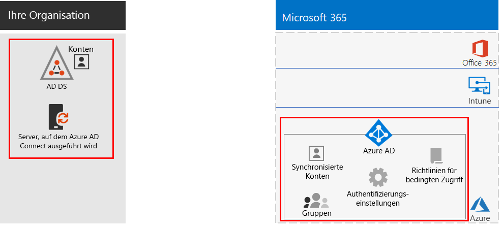
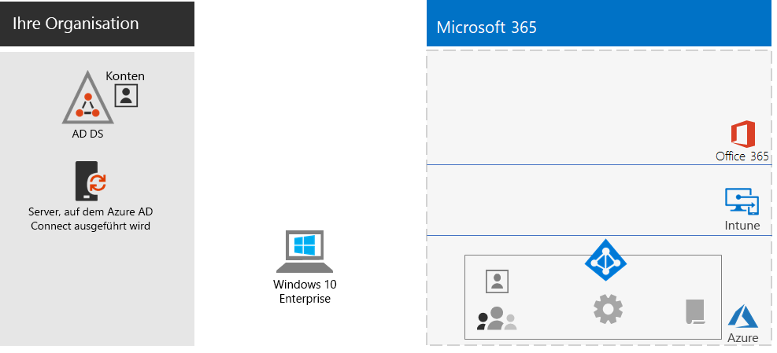
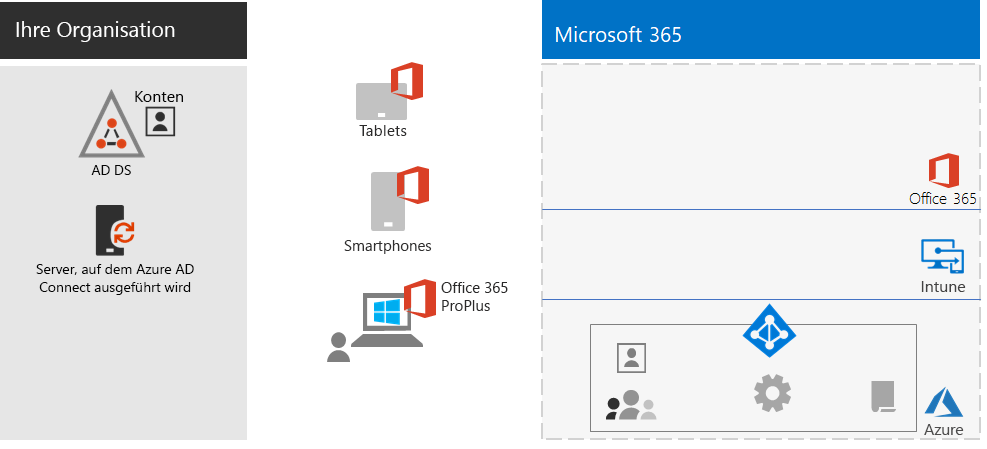
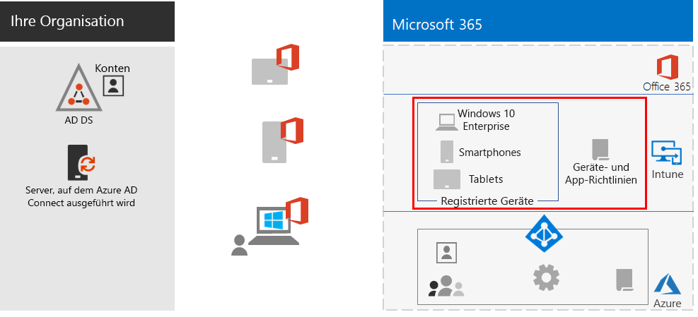
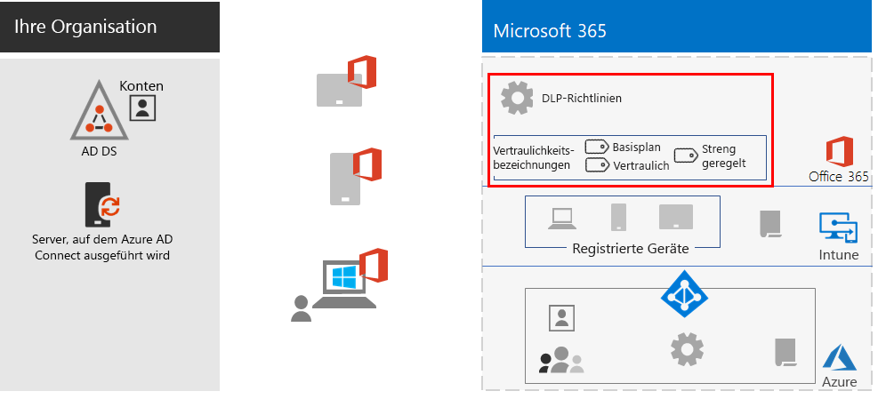
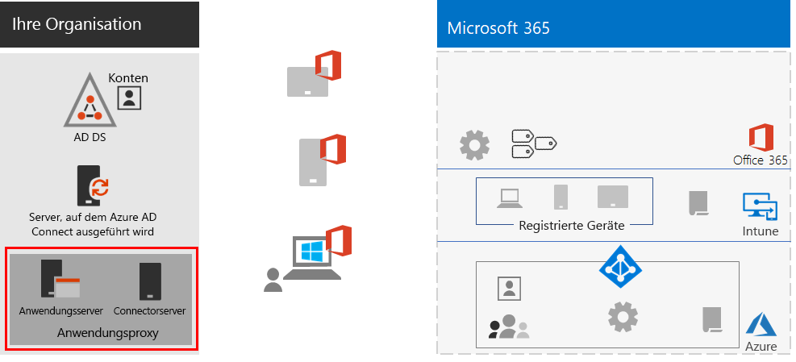
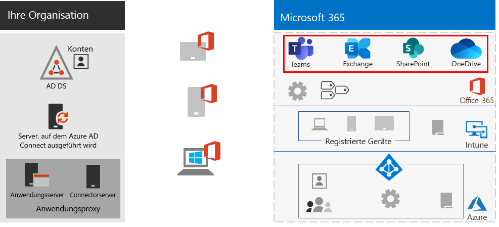
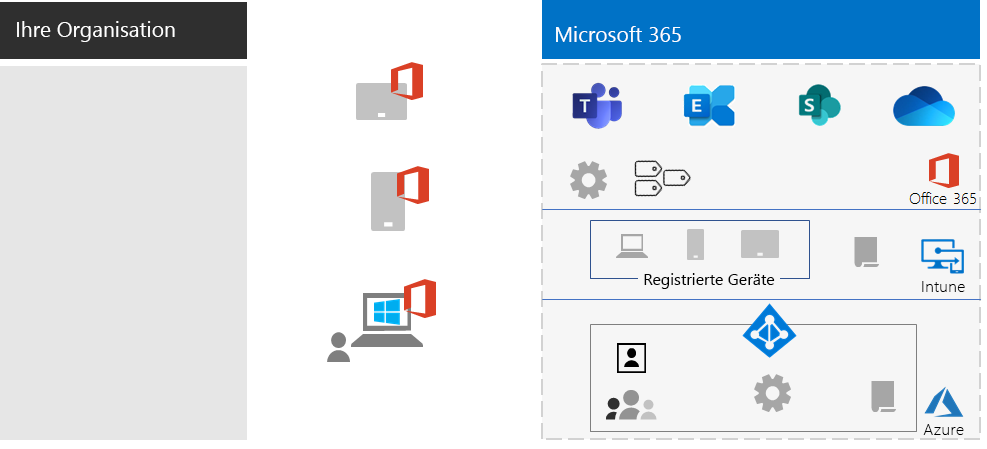

# Fördern von Remotemitarbeitern

*Dieses Szenario gilt für die Versionen E3 und E5 von Microsoft 365 Enterprise.*

Für viele Organisationen ist es wichtig, dass die Mitarbeiter auch außerhalb des Büros nahtlos und sicher arbeiten können. Auf diese Weise können die Organisationen Arbeitsplätze einsparen, Mitarbeiter einzustellen oder behalten, die nicht bereit sind, umzuziehen, und das Pendeln der Mitarbeiter reduzieren, damit diese ihre Zeit produktiver nutzen und durch Aktivitäten außerhalb des Arbeitsplatzes Stressfaktoren abbauen können.

Remotearbeit, auch als "Telearbeit" oder "Heimarbeit" bezeichnet, kann ein breites Spektrum umfassen:

- Mitarbeiter, die sich gelegentlich für Konferenzen oder Kundenbesprechungen außerhalb des Büros befinden.
- Einige Mitarbeiter, die Telearbeit in Vollzeit ausüben.
- Eine Komplette Remoteorganisation, die kein eigenes Büro unterhält und deren Mitarbeiter alle remote arbeiten.

Zur Unterstützung Ihrer Remotemitarbeiter bietet Microsoft 365 Enterprise eine umfassende Kombination aus Features für die Zusammenarbeit, z. B.:

- Onlinebesprechungen und Chatsitzungen.
- Freigegebene Arbeitsbereiche für cloudbasierte Dateispeicherung mit globalem Zugriff und Zusammenarbeit in Echtzeit.
- Gemeinsame Aufgaben und Workflows, um die Arbeit aufzuteilen und Dinge zu erledigen.

Für eine starke Sicherheit bietet Microsoft 365 Enterprise Folgendes:

- Anforderungen für eine erzwungene Authentifizierung, Erkennen von und Reagieren auf Anmeldungen mit hohem Risiko und Blockieren ausgewählter Apps und nicht kompatibler Geräte.
- Verschlüsselte Verbindungen und digitale Objekte in der Cloud.
- Berechtigungen, mit denen definiert werden kann, wer mit Dateien wie umgehen kann.
- Verhinderung von Datenverlust (DLP), um die Offenlegung von stark regulierten Daten zu verhindern.

Damit Remotemitarbeiter diese Kriterien erfüllen, verwenden Sie die folgenden Microsoft 365 Enterprise-Features:

- Benutzeridentität und Anmeldesicherheit
  - Azure Active Directory-Benutzerkonten (Azure AD) mit mehrstufiger Authentifizierung (MFA)
  - Richtlinien für den bedingten Zugriff, die MFA für riskante Anmeldungen erfordern
- Plattformen für die Zusammenarbeit
  - Microsoft Teams, SharePoint und OneDrive, mit denen Remotemitarbeiter videobasierte Onlinebesprechungen planen und daran teilnehmen sowie gemeinsam an den gleichen Dokumenten arbeiten können
- Absichern des Zugriffs auf Ressourcen
  - Mit Gruppen und Berechtigungen für Teams, SharePoint-Websites und OneDrive können Sie festlegen, dass nur authentifizierte und berechtigte Benutzer Zugriff haben.
- Schutz für offengelegte Dateien
  - Office 365-DLP-Richtlinien
  - Vertraulichkeitsbezeichnungen für Verschlüsselung und Berechtigungen, die mit den Dateien verknüpft sind
- Geräteverwaltung mit und -sicherheit mit Microsoft Intune
  - Registrierung für verwaltete Geräte
  - App-Einstellungen für persönliche Geräte
  - Geräte- und App-Richtlinien
- Produktivitäts-Apps für Geräte
  - Office 365 ProPlus-Apps für die Zusammenarbeit mit Microsoft Teams, SharePoint und OneDrive 
- Windows 10 Enterprise
  - Umfassende Sicherheitsfeatures zum Schutz vor Cyberattacken und zum Verhindern von Datenverlust
- Zugriff auf lokale Apps
  - Organisationen, die Hybrididentitäten verwenden, können Azure AD-Anwendungsproxy- anstelle von VPN-Verbindungen verwenden.

In den folgenden Phasen werden Sie schrittweise durch die Bereitstellung des Microsoft 365 Enterprise-Features für den Remotezugriff und die Förderung der Akzeptanz bei Remotemitarbeitern geführt. Wenn Sie bereits Elemente dieser Phasen bereitgestellt haben, stellen Sie sicher, dass sie die aufgeführten Voraussetzungen erfüllen, bevor Sie zum nächsten Element wechseln.

## Phase 1: Bereitstellen von Microsoft 365-Features und -Funktionen für Remotemitarbeiter

Aufgrund der für dieses Szenario erforderlichen Auswahl und Anzahl von Features und Funktionen führen wir Sie schrittweise durch die erforderlichen Elemente der Abschnitte "Foundation-Infrastruktur und -Workloads" des [Microsoft 365 Enterprise-Bereitstellungshandbuchs](deploy-microsoft-365-enterprise.md).

### Schritt 1: Foundation- Infrastrukturanforderungen für Remotemitarbeiter

In diesem Schritt werden die Phasen der [Foundation-Infrastruktur](deploy-foundation-infrastructure.md) beschrieben und die erforderlichen Elemente aufgelistet, um Remotearbeit zu ermöglichen.

Für [Phase 2: Identität](identity-infrastructure.md) stellen Sie Folgendes für Benutzeridentitäts- und Anmeldesicherheit bereit:

- Für die Hybrididentität: Benutzerkonten und Gruppen, die mit lokalen Active Directory Domain Services (AD DS) synchronisiert werden.
- Zum Zuweisen von Berechtigungen: Synchronisierte oder Azure AD-Gruppen mit den entsprechenden Mitgliedern.
- Authentifizierungseinstellungen, z. B. "MFA erforderlich".
- Richtlinien für den bedingten Zugriff, die MFA für riskante Anmeldungen erfordern und Sperren von Clients, die moderne Authentifizierung nicht unterstützen.

Hier sehen Sie die resultierende Konfiguration, wobei die Identitätselemente hervorgehoben sind.

 
Für [Phase 3: Windows 10 Enterprise](windows10-infrastructure.md) stellen Sie Folgendes bereit:

- Die Infrastruktur zur Bereitstellung neuer Geräte mit Windows 10 Enterprise und zum Upgrade von Windows 7 oder Windows 8.1-Geräten auf Windows 10 Enterprise
- Bereitstellung umfassender Sicherheitsfeatures für Identitäts-, Bedrohungs- und Informationsschutz

Hier sehen Sie die resultierende Konfiguration mit Windows 10 Enterprise-Geräten.

 
Für [Phase 4: Office 365 ProPlus](office365proplus-infrastructure.md) stellen Sie die Infrastruktur bereit, um Office 365 ProPlus zu installieren oder die aktuell installierte Office-Suite (z. B. Office 2010 oder Office 2013) auf den Geräten Ihrer Organisation auf Office 365 ProPlus zu aktualisieren. Auf diese Weise schaffen Sie für Ihre Benutzer die beste Umgebung für Sicherheit und Zusammenarbeit.

Hier sehen Sie die resultierende Konfiguration, in der Office 365 ProPlus auf den Geräten installiert ist.

 
Für [Phase 5: Verwaltung mobiler Geräte](mobility-infrastructure.md) stellen Sie Intune-Geräte- und -App-Verwaltung bereit für:

- Registrierung Ihrer Windows 10 Enterprise-, iOS-, macOS-, Android- und Android Enterprise-Geräte, damit sie von Ihrer Organisation definierte Features und Sicherheitseinstellungen erhalten.
- App-Einstellungen für zusätzliche Sicherheit und zum Zulassen oder Blockieren von Apps, sogar auf persönlichen Geräten de Mitarbeiter.
- Compliancerichtlinien mit bedingtem Zugriff, um zu verhindern, dass nicht konforme Geräte eine Verbindung herstellen.

Hier sehen Sie die resultierende Konfiguration, wobei die bei Intune registrierten Geräte und Richtlinien hervorgehoben sind.

 
Für [Phase 6: Informationsschutz](infoprotect-infrastructure.md) entwerfen und konfigurieren Sie den Schutz für Ihre digitalen Objekte mit:

- Office 365-DLP-Richtlinien.
- Office 365-Vertraulichkeitsbezeichnungen für Verschlüsselung und Berechtigungen, die mit den Dateien verknüpft sind.

Hier sehen Sie die resultierende Konfiguration, wobei die DLP-Richtlinien und Vertraulichkeitsbezeichnungen hervorgehoben sind.

 
Für den Zugriff auf lokale Apps können Sie den [Azure AD-Anwendungsproxy](https://docs.microsoft.com/azure/active-directory/manage-apps/application-proxy) verwenden, der eine Hybrididentitätsumgebung erfordert.

Hier sehen Sie die resultierende Konfiguration, wobei die Anwendungsproxykonfiguration hervorgehoben ist.

 
### Schritt 2: Workloads für Remotemitarbeiter

Für [Exchange Online](exchangeonline-workload.md) stellen Sie Exchange Online-Postfächer für alle Benutzer bereit.

Für [Teams](teams-workload.md) stellen Sie Microsoft Teams für Ihre Benutzer und Gruppen bereit.

Für [SharePoint und OneDrive](sharepoint-online-onedrive-workload.md) stellen Sie SharePoint-Team- oder -Kommunikationswebsites und OneDrive-Ordner bereit.

Hier sehen Sie die resultierende Konfiguration, wobei die Workloads hervorgehoben sind.

 
### Bereitstellungsergebnisse

Nach der Bereitstellung der Foundation-Infrastruktur und -Workloads sowie dem Rollout von Windows 10 Enterprise und Office 365 ProPlus gilt für Remotemitarbeiter:

- Sie unterliegen einer starken Authentifizierung und einem Identitätsschutz.
- Sie verfügen über die neueste und sicherste Version von Windows auf Ihren Windows-Geräten.
- Sie verfügen über die neueste und produktivste Version der Office-Suite auf den Geräten.
- Sie unterliegen App-Verwaltungs- und Gerätecompliancerichtlinien.
- Sie unterliegen DLP-Richtlinien und Einschränkungen.
- Sie können Vertraulichkeitsbezeichnungen für Verschlüsselung und Berechtigungen zuweisen, die mit Dateien und E-Mails verknüpft sind.
- Sie können auf lokale Apps ohne VPN-Verbindung zugreifen.
- Sie können Ihre eigene Arbeit ausführen und in Echtzeit mit Kollegen zusammenarbeiten, an Chats und Besprechungen teilnehmen sowie Dateien in Teams, SharePoint und OneDrive teilen.

Wenn sie offline (nicht mit dem Internet verbunden) sind, können Ihre Remotemitarbeiter lokale Kopien von Dateien ändern. Wenn sie wieder eine Verbindung mit dem Internet herstellen, synchronisiert OneDrive die lokale Kopien mit den in Ihrem Microsoft 365-Abonnement gespeicherten Dateien. 

Hier sehen Sie die resultierende Konfiguration für Remotemitarbeiter Ihrer Organisation bei Verwendung von Hybrididentität.

 
 
Hier sehen Sie die resultierende Konfiguration für Remotemitarbeiter Ihrer Organisation bei Verwendung reiner Cloudidentität.

## Phase 2: Fördern der Benutzerakzeptanz für Remotemitarbeiter

Jetzt, da die Foundation-Infrastruktur und Workloads vorhanden sind, ist es an der Zeit, die fortlaufende Nutzung dieser Funktionen durch Ihre Remotemitarbeiter zu fördern, damit sie überall und jederzeit produktiv sein können.

### Schritt 1: Schulen der Benutzer

Schulen Sie Ihre Remotemitarbeiter in folgenden Bereichen:

- Korrekte Anmeldeverfahren, einschließlich MFA-Registrierung und Umgang mit Anmeldungen bei Entdeckung eines Risikos.
- Verwendung von Geräten und Anwenden von Richtlinien, um den Zugriff für nicht konforme Geräte zu blockieren.
- Verwendung von zulässigen Apps und Anwenden von Intune-App-Richtlinien, um Apps zu blockieren.
- Sicherheitsfeatures von Windows 10 Enterprise.
- Verwenden von Outlook für E-Mails und Kalender.
- Verwenden von [Teams](https://docs.microsoft.com/microsoftteams/training-microsoft-teams-landing-page) für Chats, videobasierte Konferenzen, Dokumentfreigabe und Thread-Unterhaltungen.
- Verwenden von SharePoint-Team- oder -Kommunikationswebsites und OneDrive-Ordnern, um Dateien zu durchsuchen die sich in einer Benutzerbibliothek befinden oder die einer Gruppe gehören.
- Verwenden und Anwenden von Vertraulichkeitsbezeichnungen für Dateien, die sensible oder stark regulierte Daten enthalten (sowohl lokale als auch Onlineversionen der Dateien).

Diese Schulung sollte praktische Übungen umfassen, damit die Kursteilnehmer diese Funktionen und deren Ergebnisse ausprobieren können.

### Schritt 2: Durchführen regelmäßiger Verwendungsprüfungen und Behandeln von Mitarbeiterfeedback

In den Wochen nach der Schulung:

- Reagieren Sie umgehend auf Feedback von Remotemitarbeitern, und optimieren Sie die Richtlinien und Konfigurationen.
- Analysieren Sie die Verwendung für Teams, SharePoint-Websites und OneDrive-Ordner, und vergleichen Sie diese mit den Nutzungserwartungen.
- Vergewissern Sie sich, dass vertrauliche oder stark regulierte Dateien ordnungsgemäß mit der entsprechenden Vertraulichkeitsbezeichnung gekennzeichnet wurden.

Ihre Benutzer bei Bedarf erneut schulen.

### Ergebnisse der Benutzerakzeptanz

Remotemitarbeiter können ihre Windows 10 Enterprise- oder andere Geräte sowie Office 365 ProPlus verwenden, um in einer sicheren Umgebung auf freigegebene Microsoft 365 Enterprise-Clouddienste und -Ressourcen zuzugreifen und daran zu arbeiten, und sie nutzen Besprechungen, Erstellungen und Zusammenarbeit in Echtzeit.

## Siehe auch

[Workloads und Szenarien](deploy-workloads.md)

[Microsoft 365-Produktivitätsbibliothek](https://aka.ms/productivitylibrary) (https://aka.ms/productivitylibrary)

[Bereitstellungshandbuch](deploy-microsoft-365-enterprise.md)
