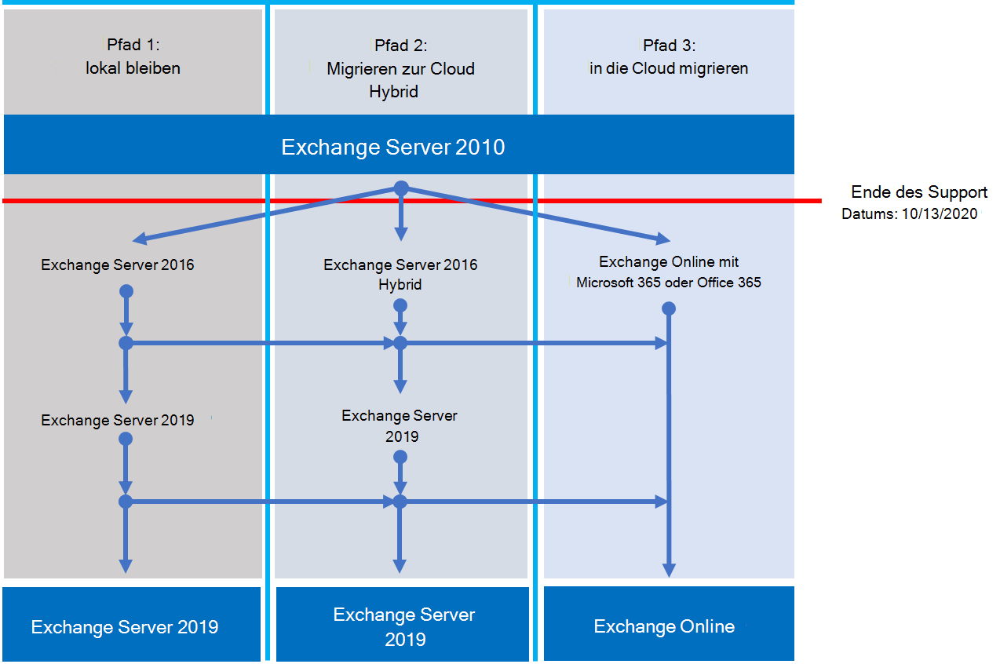

# Exchange 2010 – Roadmap zum SupportendeExchange 2010 end of support roadmap

*Dieser Artikel gilt sowohl für Microsoft 365 Enterprise als auch für Office 365 Enterprise.**This article applies to both Microsoft 365 Enterprise and Office 365 Enterprise.*

Exchange Server 2010 hat sein Ende der Unterstützung am **13. Oktober 2020 erreicht.**Exchange Server 2010 reached its end of support on **October 13, 2020**. Wenn Sie noch nicht mit der Migration von Exchange 2010 zu Microsoft 365, Office 365 oder Exchange 2016 begonnen haben, können Sie jetzt mit der Planung beginnen.If you haven't already begun your migration from Exchange 2010 to Microsoft 365, Office 365, or Exchange 2016, now's the time to start planning.

## Was bedeutet *das Ende der Unterstützung?*What does *end of support* mean?

Die meisten #A0 verfügen über einen Supportlebenszyklus, in dem sie neue Features, Fehlerbehebungen, Sicherheitskorrekturen und so weiter erhalten.Most Microsoft products have a support lifecycle during which they get new features, bug fixes, security fixes, and so on. Dieser Lebenszyklus dauert in der Regel 10 Jahre nach der ersten Produktversion.This lifecycle typically lasts for 10 years from the product's initial release. Das Ende dieses Lebenszyklus wird als Ende der Unterstützung des Produkts bezeichnet.The end of this lifecycle is known as the product's end of support. Da Exchange 2010 sein Ende des Support am 13. Oktober 2020 erreicht hat, bietet Microsoft nicht mehr:Because Exchange 2010 reached its end of support on October 13, 2020, Microsoft no longer provides:

- Technischer Support für Probleme, die auftreten können.Technical support for problems that may occur.
- Fehlerbehebungen für Probleme, die sich auf die Stabilität und Benutzerfreundlichkeit des Servers auswirken können.Bug fixes for issues that may impact the stability and usability of the server.
- Sicherheitsbehebungen für Sicherheitsrisiken, die den Server anfällig für Sicherheitsverletzungen machen können.Security fixes for vulnerabilities that may make the server vulnerable to security breaches.
- Zeitzonenupdates.Time zone updates.

Ihre Installation von Exchange 2010 wird nach diesem Datum fortgesetzt.Your installation of Exchange 2010 will continue to run after this date. Aufgrund der oben aufgeführten Änderungen wird jedoch dringend empfohlen, so bald wie möglich von Exchange 2010 zu migrieren.But because of the changes listed above, we strongly recommend that you migrate from Exchange 2010 as soon as possible.

Weitere Informationen zum Ende des Supportendes finden Sie unter [Resources to help you upgrade from Office 2010 servers and clients](upgrade-from-office-2010-servers-and-products.md).For more information about nearing the end of support, see [Resources to help you upgrade from Office 2010 servers and clients](upgrade-from-office-2010-servers-and-products.md).

## Was sind meine Optionen?What are my options?

Es ist eine großartige Zeit, Ihre Optionen zu erkunden und einen Migrationsplan vorzubereiten.It's a great time to explore your options and prepare a migration plan. Sie können:You can:

- Migrieren Sie vollständig zu Microsoft 365.Migrate fully to Microsoft 365. Migrieren von Postfächern mithilfe der Umschalt-, Minimalhybrid- oder vollständigen Hybridmigration.Migrate mailboxes using cutover, minimal hybrid, or full hybrid migration. Entfernen Sie dann lokale Exchange server und Active Directory.Then remove on-premises Exchange servers and Active Directory.
- Migrieren Sie Exchange 2010-Server zu Exchange 2016 auf Ihren lokalen Servern.Migrate your Exchange 2010 servers to Exchange 2016 on your on-premises servers.

> [!IMPORTANT]
> Wenn Sich Ihre Organisation für die Migration von Postfächern zu Microsoft 365 entscheidet, aber plant, DirSync oder Azure AD Verbinden weiterhin zu verwalten, um Benutzerkonten aus lokalem Active Directory weiter zu verwalten, müssen Sie mindestens einen Microsoft Exchange-Server lokal halten.If your organization chooses to migrate mailboxes to Microsoft 365 but plans to keep DirSync or Azure AD Connect in place to continue managing user accounts from on-premises Active Directory, you need to keep at least one Microsoft Exchange server on-premises. Wenn Sie alle Exchange entfernen, können Sie keine Änderungen an Exchange Empfängern in Exchange Online vornehmen, da die Autoritätsquelle in Ihrem lokalen Active Directory verbleibt.If you remove all Exchange servers, you won't be able to make changes to Exchange recipients in Exchange Online because the source of authority remains in your on-premises Active Directory. Dort müssen Änderungen vorgenommen werden.Changes need to be made there. In diesem Szenario haben Sie die folgenden Optionen:In this scenario, you have the following options:
>
>- *Empfohlen:* Wenn Sie Ihre Postfächer zu Microsoft 365 migriert und Ihre Server bis zum 13. Oktober 2020 aktualisiert haben, verwenden Sie Exchange 2010, um eine Verbindung mit Microsoft 365 herzustellen und Postfächer zu migrieren.*Recommended:* If you migrated your mailboxes to Microsoft 365 and upgraded your servers by October 13, 2020, use Exchange 2010 to connect to Microsoft 365 and migrate mailboxes. Migrieren Sie als Nächstes Exchange 2010 zu Exchange 2016, und außer Betrieb alle verbleibenden Exchange 2010-Server.Next, migrate Exchange 2010 to Exchange 2016, and decommission any remaining Exchange 2010 servers.
>- Wenn Sie die Postfachmigration und das lokale Serverupgrade bis zum 13. Oktober 2020 nicht abgeschlossen haben, aktualisieren Sie zuerst Ihre lokalen Exchange 2010-Server auf Exchange 2016.If you didn't complete the mailbox migration and on-premises server upgrade by October 13, 2020, upgrade your on-premises Exchange 2010 servers to Exchange 2016 first. Verwenden Sie dann Exchange 2016, um eine Verbindung zu Microsoft 365 und Postfächer zu migrieren.Then use Exchange 2016 to connect to Microsoft 365 and migrate mailboxes.

> [!NOTE]
> Es ist etwas komplizierter, aber Sie können Postfächer auch zu Microsoft 365 migrieren, während Sie Ihre lokalen Exchange 2010-Server zu Exchange 2016 migrieren.It's little more complicated, but you can also migrate mailboxes to Microsoft 365 while migrating your on-premises Exchange 2010 servers to Exchange 2016.

Hier sind die drei Pfade, die Sie gehen können, um das Ende der Unterstützung für Exchange Server 2010 zu vermeiden.Here are the three paths you can take to avoid the end of support for Exchange Server 2010.

In den folgenden Abschnitten werden die einzelnen Optionen ausführlicher behandelt.The following sections explore each option in more detail.

## Migrieren zu Microsoft 365Migrate to Microsoft 365

Das Migrieren Ihrer E-Mails zu Microsoft 365 ist die beste und einfachste Option, um Ihre Exchange 2010-Bereitstellung zurückzuziehen.Migrating your email to Microsoft 365 is the best and simplest option to help you retire your Exchange 2010 deployment. Mit einer Migration zu Microsoft 365 können Sie einen einzelnen Hop von alter Technologie zu aktuellen Features erstellen, einschließlich:With a migration to Microsoft 365, you can make a single hop from old technology to current features, including:

- Compliancefunktionen wie Aufbewahrungsrichtlinien, In-Place und Rechtsstreitigkeiten, in-place eDiscovery und vieles mehr.Compliance capabilities such as Retention Policies, In-Place and Litigation Hold, in-place eDiscovery, and more.
- Microsoft Teams.Microsoft Teams.
- Power BI.Power BI.
- Posteingang mit Fokus.Focused Inbox.
- MyAnalytics.MyAnalytics.

Microsoft 365 erhalten außerdem zuerst neue Features und Erfahrungen, damit Ihre Organisation sofort damit beginnen kann, sie zu verwenden.Microsoft 365 also gets new features and experiences first, so your organization can start using them right away. Darüber hinaus müssen Sie sich keine Sorgen machen:Also, you won't have to worry about:

- Kaufen und Verwalten von Hardware.Purchasing and maintaining hardware.
- Bezahlen, um Ihre Server zu erhitze und zu coolen.Paying to heat and cool your servers.
- Halten Sie die Sicherheits-, Produkt- und Zeitzonenkorrekturen auf dem neuesten Stand.Keeping up to date on security, product, and time-zone fixes.
- Verwalten von Speicher und Software zur Unterstützung von Complianceanforderungen.Maintaining storage and software to support compliance requirements.
- Upgrade auf eine neue Version von Exchange.Upgrading to a new version of Exchange. Sie sind immer auf der neuesten Version von Exchange in Microsoft 365.You're always on the latest version of Exchange in Microsoft 365.

### Wie sollte ich zu Microsoft 365?How should I migrate to Microsoft 365?

Je nach Organisation stehen Ihnen einige Optionen zur Verfügung, um Microsoft 365.Depending on your organization, you have a few options to get to Microsoft 365. Zunächst müssen Sie einige Dinge berücksichtigen, z. B.:First, you need to consider a few things, such as:
- Die Anzahl der Zu verschiebende Sitze oder Postfächer.The number of seats or mailboxes you need to move.
- Wie lange die Migration dauern soll.How long you want the migration to last.
- Gibt an, ob Sie während der Migration eine nahtlose Integration zwischen ihrer lokalen Installation und Microsoft 365 benötigen.Whether you need a seamless integration between your on-premises installation and Microsoft 365 during the migration.
 
In dieser Tabelle sind die Migrationsoptionen und die wichtigsten Faktoren aufgeführt, die bestimmen, welche Methode verwendet werden soll.This table shows your migration options and the most important factors that determine which method to use.

|MigrationsoptionMigration option|OrganisationsgrößeOrganization size|DauerDuration|
|---|---|---|
|ÜbernahmemigrationCutover migration|Weniger als 150 PlätzeFewer than 150 seats|Eine Woche oder wenigerA week or less|
|Minimale HybridmigrationMinimal hybrid migration|Weniger als 150 PlätzeFewer than 150 seats|Ein paar Wochen oder wenigerA few weeks or less|
|Vollständige HybridmigrationFull hybrid migration|Mehr als 150 PlätzeMore than 150 seats|Ein paar Wochen oder mehrA few weeks or more|

In den folgenden Abschnitten erhalten Sie eine Übersicht über diese Methoden.The following sections give you an overview of these methods. Weitere Informationen finden Sie unter [Decide on a migration path](https://support.office.com/article/Decide-on-a-migration-path-0d4f2396-9cef-43b8-9bd6-306d01df1e27).For more information, see [Decide on a migration path](https://support.office.com/article/Decide-on-a-migration-path-0d4f2396-9cef-43b8-9bd6-306d01df1e27).

### ÜbernahmemigrationCutover migration

Bei einer Cutovermigration migrieren Sie alle Postfächer, Verteilergruppen, Kontakte und so weiter, um Office 365 datums- und uhrzeitgemäß zu löschen.In a cutover migration, you migrate all your mailboxes, distribution groups, contacts, and so on, to Office 365 at a set date and time. Wenn Sie fertig sind, fahren Sie Ihre lokalen Server Exchange herunter und beginnen mit der verwendung von Microsoft 365.When you're done, you shut down your on-premises Exchange servers and start using Microsoft 365 exclusively.

Die Umstiegsmigration ist ideal für kleine Organisationen, die nicht über viele Postfächer verfügen, schnell zu Microsoft 365 und nicht mit der Komplexität der anderen Methoden umgehen möchten.Cutover migration is great for small organizations that don't have many mailboxes, want to get to Microsoft 365 quickly, and don't want to deal with the complexity of the other methods. Sie sollte jedoch in einer woche oder weniger abgeschlossen sein.But it should be completed in a week or less. Außerdem müssen Benutzer ihre Outlook neu konfigurieren.And it requires users to reconfigure their Outlook profiles. Bei der Umstiegsmigration können bis zu 2.000 Postfächer migriert werden, es wird jedoch empfohlen, sie für maximal 150 Postfächer zu verwenden.Cutover migration can migrate up to 2,000 mailboxes, but we recommend you use it for a maximum of 150. Wenn Sie versuchen, mehr zu migrieren, könnte ihnen die Zeit zum Übertragen aller Postfächer vor Ablauf des Stichtermins nicht mehr zur Verfügung sein, und Ihre IT-Supportmitarbeiter sind möglicherweise überlastet mit Anforderungen, die Benutzern beim Neukonfigurieren von Postfächern Outlook.If you try to migrate more, you could run out of time to transfer all the mailboxes before your deadline, and your IT support staff may get overwhelmed with requests to help users reconfigure Outlook.

Hier sind einige Dinge, die Sie zur Umstellungsmigration berücksichtigen sollten:Here are things to consider about cutover migration:

- Microsoft 365 müssen eine Verbindung mit Ihren Exchange 2010-Servern mithilfe von Outlook Anywhere über TCP-Port 443 herstellen.Microsoft 365 will need to connect to your Exchange 2010 servers by using Outlook Anywhere over TCP port 443.
- Alle lokalen Postfächer werden in die Microsoft 365.All on-premises mailboxes will be moved to Microsoft 365.
- Sie benötigen ein lokales Administratorkonto mit Lesezugriff auf die Postfächer Ihrer Benutzer.You'll need an on-premises administrator account that has read access to your users' mailboxes.
- Die Exchange 2010 akzeptierte Domänen, die Sie in Microsoft 365 verwenden möchten, müssen als überprüfte Domänen im Dienst hinzugefügt werden.The Exchange 2010 accepted domains that you want to use in Microsoft 365 need to be added as verified domains in the service.
- Zwischen dem Start der Migration und dem Beginn der Abschlussphase synchronisiert Microsoft 365 regelmäßig die Microsoft 365 und lokale Postfächer.Between when you start the migration and when you begin the completion phase, Microsoft 365 will periodically synchronize the Microsoft 365 and on-premises mailboxes. Auf diese Weise können Sie die Migration abschließen, ohne sich Gedanken darüber zu machen, dass E-Mails in Ihren lokalen Postfächern zurückgelassen werden.This lets you complete the migration without worrying about email being left behind in your on-premises mailboxes.
- Benutzer erhalten neue temporäre Kennwörter für ihr Microsoft 365 Konto.Users will receive new temporary passwords for their Microsoft 365 account. Sie müssen diese ändern, wenn sie sich zum ersten Mal bei ihren Postfächern anmelden.They'll need to change those when they sign in to their mailboxes for the first time.
- Sie benötigen eine Microsoft 365, die Exchange Online benutzerpostfach enthält, das Sie migrieren.You'll need a Microsoft 365 license that includes Exchange Online for each user mailbox you migrate.
- Benutzer müssen auf jedem Gerät ein neues Outlook einrichten und ihre E-Mails erneut herunterladen.Users will need to set up a new Outlook profile on each of their devices and download their email again. Die Menge der E-Mails, die Outlook herunterladen, kann variieren.The amount of email that Outlook will download can vary. Weitere Informationen finden Sie unter [Offline arbeiten in Outlook](https://support.microsoft.com/office/f3a1251c-6dd5-4208-aef9-7c8c9522d633).For more information, see [Work offline in Outlook](https://support.microsoft.com/office/f3a1251c-6dd5-4208-aef9-7c8c9522d633).

Weitere Informationen zur Umstellung finden Sie unter:To learn more about cutover migration, see:

- [Was Sie über eine E-Mail-Migration für die Umstellung wissen müssenWhat you need to know about a cutover email migration](/Exchange/mailbox-migration/what-to-know-about-a-cutover-migration)
- [Durchführen einer Umstiegsmigration von E-Mails zu Office 365Perform a cutover migration of email to Office 365](/Exchange/mailbox-migration/cutover-migration-to-office-365)

### Minimale HybridmigrationMinimal hybrid migration

Bei einer minimalen Hybridmigration oder einer express-Migration verschieben Sie innerhalb weniger Wochen ein paar hundert Postfächer Microsoft 365 Zu- und Abspeichern.In a minimal hybrid, or express, migration you move a few hundred mailboxes to Microsoft 365 within a few weeks. Diese Methode unterstützt keine erweiterten Hybridmigrationsfeatures wie freigegebene Frei/Gebucht-Kalenderinformationen.This method doesn't support advanced hybrid-migration features like shared free/busy calendar information.

Die minimale Hybridmigration ist ideal für Organisationen, die mehr Zeit für die Migration ihrer Postfächer zu Microsoft 365 benötigen, aber dennoch planen, die Migration innerhalb weniger Wochen zu abschließen.Minimal hybrid migration is great for organizations that need to take more time to migrate their mailboxes to Microsoft 365, but still plan to complete the migration within a few weeks. Sie erhalten einige der Vorteile der fortgeschritteneren *Vollständighybridmigration* ohne einen großen Teil der Komplexität.You get some of the benefits of the more advanced *full-hybrid migration* without much of the complexity. Sie können steuern, wie viele und welche Postfächer zu einem bestimmten Zeitpunkt migriert werden sollen.You can control how many and which mailboxes to migrate at a given time. Microsoft 365 Postfächer werden mit den Benutzernamen und Kennwörtern der lokalen Konten erstellt.Microsoft 365 mailboxes will be created with the user names and passwords of the on-premises accounts. Und im Gegensatz zu Umstiegsmigrationen müssen Ihre Benutzer ihre Outlook neu erstellen.And, unlike cutover migrations, your users don't have to recreate their Outlook profiles.

Hier sind einige Dinge, die Sie zur minimalen Hybridmigration berücksichtigen sollten:Here are things to consider about minimal hybrid migration:

- Sie müssen eine einmal durchgeführte Verzeichnissynchronisierung zwischen ihren lokalen Active Directory-Servern und Microsoft 365.You'll need to do a one-time directory synchronization between your on-premises Active Directory servers and Microsoft 365.
- Benutzer können sich bei ihrem Postfach Microsoft 365 Benutzernamen und Kennwort wie vor ihrem Postfach anmelden.Users will be able to sign in to their Microsoft 365 mailbox with the same user name and password as before their mailbox.
- Sie benötigen eine Microsoft 365, die Exchange Online benutzerpostfach enthält, das Sie migrieren.You'll need a Microsoft 365 license that includes Exchange Online for each user mailbox that you migrate.
- Benutzer müssen auf den meisten Geräten kein neues Outlook einrichten, obwohl einige ältere Android-Smartphones möglicherweise ein neues Profil benötigen.Users won't need to set up a new Outlook profile on most of their devices, though some older Android phones might need a new profile. Benutzer müssen ihre E-Mails nicht erneut laden.Users won't need to redownload their email.

Weitere Informationen finden Sie unter [Use Minimal Hybrid to quickly migrate Exchange mailboxes to Office 365](/Exchange/mailbox-migration/use-minimal-hybrid-to-quickly-migrate).For more information, see [Use Minimal Hybrid to quickly migrate Exchange mailboxes to Office 365](/Exchange/mailbox-migration/use-minimal-hybrid-to-quickly-migrate).

### Vollständige HybridbereitstellungFull hybrid

Bei einer vollständigen Hybridmigration verfügen Sie über viele Hunderte, bis zu Zehntausende von Postfächern, und Sie verschieben einige oder alle zu Microsoft 365.In a full hybrid migration, you have many hundreds, up to tens of thousands, of mailboxes, and you move some or all to Microsoft 365. Da es sich bei diesen Migrationen in der Regel um langfristige Migrationen handelt, ermöglichen Hybridmigrationen:Because these migrations are typically longer-term, hybrid migrations make it possible to:

- Zeigen Sie lokalen Benutzern die Frei/Gebucht-Kalenderinformationen für Benutzer in Microsoft 365 und umgekehrt.Show on-premises users the free/busy calendar information for users in Microsoft 365, and vice versa.
- Sehen Sie sich eine einheitliche globale Adressliste an, die Empfänger in lokalen und lokalen Microsoft 365.See a unified global address list that contains recipients in both on-premises and Microsoft 365.
- Zeigen Sie Outlook Empfängereigenschaften für alle Benutzer an, unabhängig davon, ob sie lokal oder in Microsoft 365.View full Outlook recipient properties for all users, regardless of whether they're on-premises or in Microsoft 365.
- Sichere E-Mail-Kommunikation zwischen lokalen Exchange und Office 365 TLS und Zertifikaten.Secure email communication between on-premises Exchange servers and Office 365 using TLS and certificates.
- Behandeln Sie Nachrichten, die zwischen lokalen servern Exchange und Microsoft 365 gesendet werden, als intern, sodass sie:Treat messages sent between on-premises Exchange servers and Microsoft 365 as internal, enabling them to:
  - Sollten Sie von Transport- und Compliance-Agents, die auf interne Nachrichten zielen, ordnungsgemäß ausgewertet und verarbeitet werden.Be properly evaluated and processed by transport and compliance agents targeting internal messages.
  - Umgehen von Antispamfiltern.Bypass anti-spam filters.

Vollständige Hybridmigrationen sind am besten für Organisationen, die erwarten, dass sie viele Monate oder länger in einer Hybridkonfiguration bleiben.Full hybrid migrations are best for organizations that expect to stay in a hybrid configuration for many months or more. Sie erhalten die oben in diesem Abschnitt aufgeführten Features sowie Verzeichnissynchronisierung, bessere integrierte Kompatibilitätsfeatures und die Möglichkeit, Postfächer mithilfe von Onlinepostfachbewegungen Microsoft 365 zu verschieben.You get the features listed earlier in this section, plus directory synchronization, better integrated compliance features, and the ability to move mailboxes to and from Microsoft 365 using online mailbox moves. Microsoft 365 wird zu einer Erweiterung Ihrer lokalen Organisation.Microsoft 365 becomes an extension of your on-premises organization.

Zu berücksichtigende Dinge zur Vollständighybridmigration:Things to consider about full-hybrid migration:

- Sie sind nicht für alle Organisationen geeignet.They aren't suited to all organizations. Aufgrund der Komplexität vollständiger Hybridmigrationen sehen Organisationen mit weniger als ein paar hundert Postfächern in der Regel keine Vorteile, die den Aufwand und die damit verbunden Kosten rechtfertigen.Due to the complexity of full hybrid migrations, organizations with less than a few hundred mailboxes don't typically see benefits that justify the effort and cost involved. In solchen Fällen wird empfohlen, stattdessen die Umstellung oder minimale Hybridmigration in Betracht zu ziehen.In such cases, we recommend that you consider cutover or minimal hybrid migration instead.
- Sie müssen die Verzeichnissynchronisierung mithilfe von Azure Active Directory (Azure AD) Verbinden lokalen Active Directory-Servern und Microsoft 365.You need to set up directory synchronization using Azure Active Directory (Azure AD) Connect between your on-premises Active Directory servers and Microsoft 365.
- Benutzer können sich bei ihrem Postfach Microsoft 365 Benutzernamen und Kennwort anmelden, das sie bei der Anmeldung beim lokalen Netzwerk verwenden.Users will be able to sign in to their Microsoft 365 mailbox with same user name and password they use when they sign in to the local network. (Für diese Funktionalität ist Azure AD Verbinden Kennwortsynchronisierung und/oder Active Directory Federation Services erforderlich).(This functionality requires Azure AD Connect with password synchronization and/or Active Directory Federation Services).
- Sie benötigen eine Microsoft 365, die Exchange Online benutzerpostfach enthält, das Sie migrieren.You need a Microsoft 365 license that includes Exchange Online for each user mailbox you migrate.
- Benutzer müssen auf den meisten Geräten kein neues Outlook einrichten, auch wenn einige ältere Android-Smartphones möglicherweise ein neues Profil benötigen.Users don't need to set up a new Outlook profile on most of their devices, although some older Android phones might need a new profile. Benutzer müssen ihre E-Mails nicht erneut laden.Users won't need to redownload their email.

> [!IMPORTANT]
> Wenn Ihre Organisation postfächer zu Microsoft 365 migrieren will, aber plant, DirSync oder Azure AD Verbinden zu verwalten, um weiterhin Benutzerkonten aus lokalem Active Directory zu verwalten, müssen Sie mindestens einen Exchange-Server lokal halten.If your organization chooses to migrate mailboxes to Microsoft 365 but plans to keep DirSync or Azure AD Connect in place to continue managing user accounts from on-premises Active Directory, you need to keep at least one Exchange server on-premises. Wenn alle Exchange entfernt werden, können Sie keine Änderungen an Exchange Empfängern in Exchange Online.If all Exchange servers are removed, you won't be able to make changes to Exchange recipients in Exchange Online. Dies liegt daran, dass die Autoritätsquelle in Ihrem lokalen Active Directory verbleibt und dort Änderungen vorgenommen werden müssen.This is because the source of authority remains in your on-premises Active Directory and changes need to be made there.

Wenn eine vollständige Hybridmigration für Sie richtig klingt, sehen Sie sich die folgenden hilfreichen Ressourcen an:If a full hybrid migration sounds right for you, see the following helpful resources:

- [Exchange Bereitstellungs-AssistentExchange Deployment Assistant](/exchange/exchange-deployment-assistant)
- [Hybridbereitstellungen in Exchange ServerExchange Server Hybrid Deployments](/exchange/exchange-hybrid)
- [Assistent für die HybridkonfigurationHybrid Configuration wizard](/exchange/hybrid-configuration-wizard)
- [FAQs zum Assistenten für die HybridkonfigurationHybrid Configuration wizard FAQs](/exchange/hybrid-configuration-wizard-faqs)
- [Voraussetzungen für die HybridbereitstellungHybrid deployment prerequisites](/exchange/hybrid-deployment-prerequisites)

## Upgrade auf eine neuere Version Exchange Server lokalen VersionenUpgrade to a newer version of Exchange Server on-premises

Wir sind fest davon überzeugt, dass Sie den bestmöglichen Nutzen und eine optimale Benutzererfahrung erhalten, indem Sie vollständig zu Microsoft 365.We strongly believe that you get the best value and user experience by migrating fully to Microsoft 365. Wir wissen jedoch, dass einige Organisationen einige serverlokale Exchange müssen.But we understand that some organizations need to keep some Exchange Servers on-premises. Dies liegt möglicherweise an behördlichen Anforderungen, um zu gewährleisten, dass Daten nicht in einem fremden Rechenzentrum gespeichert werden, weil Sie über eindeutige Einstellungen oder Anforderungen verfügen, die in der Cloud nicht erfüllt werden können, oder weil Sie Exchange zum Verwalten von Cloudpostfächern benötigen, da Sie Active Directory weiterhin lokal verwenden.This might be because of regulatory requirements, to guarantee data isn't stored in a foreign datacenter, because you have unique settings or requirements that can't be met in the cloud, or because you need Exchange to manage cloud mailboxes because you still use Active Directory on-premises. Wenn Sie die Exchange lokal verwenden, sollten Sie auf jeden Fall sicherstellen, dass Ihre Exchange 2010-Umgebung auf mindestens Exchange 2013 oder Exchange 2016 aktualisiert wird.In any case, if you keep Exchange on-premises, you should ensure your Exchange 2010 environment is upgraded to at least Exchange 2013 or Exchange 2016.

Für eine optimale Erfahrung empfehlen wir, die verbleibende lokale Umgebung auf Exchange 2016 zu aktualisieren.For the best experience, we recommend that you upgrade your remaining on-premises environment to Exchange 2016. Sie müssen Exchange Server 2013 nicht installieren, wenn Sie direkt von Exchange Server 2010 bis Exchange Server 2016 wechseln möchten.You don't need to install Exchange Server 2013 if you want to go straight from Exchange Server 2010 to Exchange Server 2016.

Exchange 2016 enthält alle Features früherer Versionen von Exchange.Exchange 2016 includes all the features of previous releases of Exchange. Sie entspricht am besten der mit den Microsoft 365, obwohl einige Features nur in der Microsoft 365.It most closely matches the experience available with Microsoft 365, although some features are available only in Microsoft 365. Sehen Sie sich nur einige der Dinge an, die Ihnen fehlten:Check out just a few of the things you've been missing:

|Exchange ReleaseExchange release|FeaturesFeatures|
|---|---|
|**Exchange 2013****Exchange 2013**|Die vereinfachte Architektur reduziert die Anzahl der Serverrollen auf drei (Postfach, Clientzugriff, Edge-Transport)Simplified architecture reduces the number of server roles to three (Mailbox, Client Access, Edge Transport)|
||Richtlinien zur Verhinderung von Datenverlust (Data Loss Prevention, DLP), die dazu beitragen, vertrauliche Informationen vor Lecks zu bewahrenData loss prevention policies (DLP) that help keep sensitive information from leaking|
||Verbesserte Outlook Web App-ErfahrungImproved Outlook Web App experience|
|**Exchange 2016****Exchange 2016**|*Features aus Exchange 2013 und ...**Features from Exchange 2013 and …*|
||Weitere vereinfachte Serverrollen für nur Postfach- und Edge-TransportFurther simplified server roles to just Mailbox and Edge Transport|
||Verbesserte DLP und Integration in SharePointImproved DLP along with integration with SharePoint|
||Verbesserte Ausfallsicherheit von DatenbankenImproved database resilience|
||Online-DokumentzusammenarbeitOnline document collaboration|

|ÜberlegungenConsideration|Weitere InformationenMore information|
|---|---|
|Ende der SupporttermineEnd of support dates|Wie Exchange 2010 verfügt jede Version von Exchange über ein eigenes End-of-Support-Datum:Like Exchange 2010, each version of Exchange has its own end-of-support date:  Exchange 2013 – April 2023Exchange 2013 - April 2023 Exchange 2016 – Oktober 2025Exchange 2016 - October 2025  Mit dem früheren Enddatum des Supportdatums müssen Sie früher eine weitere Migration durchführen.The earlier the end-of-support date, the sooner you'll need to perform another migration. April 2023 ist viel näher, als Sie denken!April 2023 is a lot closer than you think!|
|Migrationspfad zu Exchange 2013 oder 2016Migration path to Exchange 2013 or 2016|Der Migrationspfad von Exchange 2010 zu einer neueren Version ist identisch, unabhängig davon, ob Sie Exchange 2013 oder Exchange 2016 auswählen:The migration path from Exchange 2010 to a newer version is the same whether you choose Exchange 2013 or Exchange 2016:  Installieren Exchange 2013 oder 2016 in Ihrer Exchange 2010-Organisation.Install Exchange 2013 or 2016 into your existing Exchange 2010 organization. Verschieben sie Dienste und andere Infrastruktur Exchange 2013 oder 2016.Move services and other infrastructure to Exchange 2013 or 2016. Verschieben von Postfächern und öffentlichen Ordnern in Exchange 2013 oder 2016 Außerbetriebnahme der verbleibenden Exchange 2010-Servern.Move mailboxes and public folders to Exchange 2013 or 2016 Decommission remaining Exchange 2010 servers.|
|VersionskoexistenzVersion coexistence|Bei der Migration zu Exchange 2013 oder Exchange 2016 können Sie eine version in einer vorhandenen Exchange 2010-Organisation installieren.When migrating to Exchange 2013 or Exchange 2016, you can install either version into an existing Exchange 2010 organization. Auf diese Weise können Sie einen oder mehrere Exchange 2013- oder Exchange 2016-Server installieren und Die Migrationen ausgeführt werden.This enables you to install one or more Exchange 2013 or Exchange 2016 servers and do your migration.|
|ServerhardwareServer hardware|Die Serverhardwareanforderungen haben sich von Exchange 2010 geändert.Server hardware requirements have changed from Exchange 2010. Stellen Sie sicher, dass Ihre Hardware kompatibel ist.Make sure your hardware is compatible. Weitere Informationen zu den Hardwareanforderungen für jede Version finden Sie hier:Find out more about hardware requirements for each version here:  [Exchange 2016 – SystemanforderungenExchange 2016 system requirements](/Exchange/plan-and-deploy/system-requirements?view=exchserver-2016) [Exchange 2013 – SystemanforderungenExchange 2013 system requirements](/Exchange/exchange-2013-system-requirements-exchange-2013-help)  Mit der erheblichen Verbesserung der Exchange leistung und der erhöhten Rechenleistung und Speicherkapazität auf neueren Servern benötigen Sie wahrscheinlich weniger Server, um dieselbe Anzahl von Postfächern zu unterstützen.With the significant improvements in Exchange performance and the increased computing power and storage capacity in newer servers, you'll likely need fewer servers to support the same number of mailboxes.|
|BetriebssystemversionOperating system version|Die mindestens unterstützten Betriebssystemversionen für jede Version sind:The minimum supported operating system versions for each version are:  Exchange 2016 – Windows Server 2012Exchange 2016 - Windows Server 2012 Exchange 2013 – Windows Server 2008 R2 SP1Exchange 2013 - Windows Server 2008 R2 SP1  Weitere Informationen zur Betriebssystemunterstützung finden Sie unter [Exchange Supportability Matrix](/exchange/plan-and-deploy/supportability-matrix).You can find more information about operating system support at [Exchange Supportability Matrix](/exchange/plan-and-deploy/supportability-matrix).|
|Active Directory-GesamtstrukturfunktionsebeneActive Directory forest functional level|Die mindestens unterstützten Active Directory-Gesamtstrukturfunktionsebenen für jede Version sind:The minimum supported Active Directory forest functional levels for each version are:  Exchange 2016 – Windows Server 2008 R2 SP1Exchange 2016 - Windows Server 2008 R2 SP1 Exchange 2013 – Windows Server 2003Exchange 2013 - Windows Server 2003  Weitere Informationen zur Unterstützung der Gesamtstrukturfunktionsebene finden Sie unter [Exchange Supportability Matrix](/exchange/plan-and-deploy/supportability-matrix).You can find more information about forest functional level support at [Exchange Supportability Matrix](/exchange/plan-and-deploy/supportability-matrix).|
|Office ClientversionenOffice client versions|Die mindestens unterstützten Office Clientversionen für jede Version sind:The minimum supported Office client versions for each version are:  Exchange 2016 – Office 2010 (mit den neuesten Updates)Exchange 2016 - Office 2010 (with the latest updates) Exchange 2013 – Office 2007 SP3Exchange 2013 - Office 2007 SP3  Weitere Informationen zur Office finden Sie unter [Exchange Supportability Matrix](/exchange/plan-and-deploy/supportability-matrix).Find more information about Office client support at [Exchange Supportability Matrix](/exchange/plan-and-deploy/supportability-matrix).||| 

Verwenden Sie die folgenden Ressourcen, um Bei der Migration zu helfen:Use the following resources to help with your migration:

- [Exchange Bereitstellungs-AssistentExchange Deployment Assistant](/exchange/exchange-deployment-assistant)
- Active Directory-Schemaänderungen für Exchange [2016](/exchange/plan-and-deploy/active-directory/ad-schema-changes?view=exchserver-2016), [2013](/Exchange/exchange-2013-active-directory-schema-changes-exchange-2013-help)Active Directory schema changes for Exchange [2016](/exchange/plan-and-deploy/active-directory/ad-schema-changes?view=exchserver-2016), [2013](/Exchange/exchange-2013-active-directory-schema-changes-exchange-2013-help)
- Systemanforderungen für Exchange [2016](/exchange/plan-and-deploy/system-requirements?view=exchserver-2016), [2013](/Exchange/exchange-2013-system-requirements-exchange-2013-help)System requirements for Exchange [2016](/exchange/plan-and-deploy/system-requirements?view=exchserver-2016), [2013](/Exchange/exchange-2013-system-requirements-exchange-2013-help)
- Voraussetzungen für Exchange [2016](/exchange/plan-and-deploy/prerequisites?view=exchserver-2016), [2013](/Exchange/exchange-2013-prerequisites-exchange-2013-help)Prerequisites for Exchange [2016](/exchange/plan-and-deploy/prerequisites?view=exchserver-2016), [2013](/Exchange/exchange-2013-prerequisites-exchange-2013-help)

## Zusammenfassung der Optionen für Office 2010-Client und -Server und Windows 7Summary of options for Office 2010 client and servers and Windows 7

Eine visuelle Zusammenfassung der Optionen für Upgrades, Migration und die Cloud für Office 2010-Clients und -Server sowie für Windows 7 finden Sie auf unter dem [Poster zum Supportende](../downloads/Office2010Windows7EndOfSupport.pdf).For a visual summary of the upgrade, migrate, and move-to-the-cloud options for Office 2010 clients and servers and Windows 7, see the [end of support poster](../downloads/Office2010Windows7EndOfSupport.pdf).

Dieses einseitige Poster veranschaulicht die verschiedenen Pfade, die Sie für die Reaktion auf Office 2010-Client- und Serverprodukte und Windows 7 zum Erreichen des Endes der Unterstützung verwenden können, mit bevorzugten Pfaden und Optionsunterstützung in Microsoft 365 Enterprise hervorgehoben.This one-page poster illustrates the various paths you can take to respond to Office 2010 client and server products and Windows 7 reaching end of support, with preferred paths and option support in Microsoft 365 Enterprise highlighted.

Sie können dieses [Poster auch](https://github.com/MicrosoftDocs/microsoft-365-docs/raw/public/microsoft-365/downloads/Office2010Windows7EndOfSupport.pdf) herunterladen und im Letter-, Legal- oder Tabloidformat (11 x 17) drucken.You can also [download](https://github.com/MicrosoftDocs/microsoft-365-docs/raw/public/microsoft-365/downloads/Office2010Windows7EndOfSupport.pdf) this poster and print it in letter, legal, or tabloid (11 x 17) format.

## Was passiert, wenn ich Hilfe brauche?What if I need help?

Wenn Sie zu einer Microsoft 365, sind Sie möglicherweise berechtigt, unseren Microsoft FastTrack-Dienst zu verwenden.If you're migrating to Microsoft 365, you might be eligible to use our Microsoft FastTrack service. FastTrack bietet bewährte Methoden, Tools und Ressourcen, um Ihre Migration zu Microsoft 365 so nahtlos wie möglich zu gestalten.FastTrack provides best practices, tools, and resources to make your migration to Microsoft 365 as seamless as possible. Das Beste ist, dass Sie von einem Supporttechniker von der Planung und dem Entwurf bis hin zur Migration Ihres letzten Postfachs durch einen Supporttechniker gehen.Best of all, you'll have a support engineer walk you through from planning and design to migrating your last mailbox. Weitere Informationen zu FastTrack finden Sie unter [Microsoft FastTrack](https://fasttrack.microsoft.com/).For more about FastTrack, see [Microsoft FastTrack](https://fasttrack.microsoft.com/).

Wenn während der Migration zu Microsoft 365 Probleme auftreten und Sie FastTrack nicht verwenden oder sie zu einer neueren Version von Exchange Server migrieren, sind hier einige Ressourcen, die Sie verwenden können:If you run into problems during your migration to Microsoft 365 and you aren't using FastTrack, or you're migrating to a newer version of Exchange Server, here are some resources you can use:

- [Technische CommunityTechnical community](https://social.technet.microsoft.com/Forums/office/home?category=exchangeserver)
- [Support für KundenCustomer support](https://support.microsoft.com/gp/support-options-for-business)

## Verwandte ArtikelRelated articles

[Ressourcen, die Ihnen beim Upgrade von Office 2010-Servern und -Clients helfenResources to help you upgrade from Office 2010 servers and clients](upgrade-from-office-2010-servers-and-products.md)