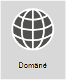

# <a name="external-domain-name-system-records-for-office-365"></a><span data-ttu-id="219bc-103">Externe DNS-Einträge für Office 365</span><span class="sxs-lookup"><span data-stu-id="219bc-103">External Domain Name System records for Office 365</span></span>

|||
|:-----|:-----|
||<span data-ttu-id="219bc-p101">**Möchten Sie eine angepasste Liste der DNS-Einträge für Ihre Office 365-Organisation anzeigen?** Dann führen Sie eine [Suche nach den erforderlichen Informationen zum Erstellen von Office 365 DNS-Einträgen](https://support.office.microsoft.com/article/Gather-the-information-you-need-to-create-Office-365-DNS-records-77f90d4a-dc7f-4f09-8972-c1b03ea85a67) für Ihre Domäne in Office 365 aus. </span><span class="sxs-lookup"><span data-stu-id="219bc-p101">**Want to see a customized list of DNS records for your Office 365 organization?** You can [find the info you need to create Office 365 DNS records](https://support.office.microsoft.com/article/Gather-the-information-you-need-to-create-Office-365-DNS-records-77f90d4a-dc7f-4f09-8972-c1b03ea85a67) for your domain in Office 365.  </span></span><br/> <span data-ttu-id="219bc-p102">**Benötigen Sie schrittweise Hilfe zum Hinzufügen dieser Einträge auf dem DNS-Host Ihrer Domäne, etwa auf GoDaddy oder eNom?** [Suchen von Links zu schrittweisen Anweisungen für viele beliebte DNS-Hosts](../admin/get-help-with-domains/create-dns-records-at-any-dns-hosting-provider.md). </span><span class="sxs-lookup"><span data-stu-id="219bc-p102">**Need step-by-step help to add these records at your domain's DNS host, such as GoDaddy or eNom?** [Find links to step-by-step instructions for many popular DNS hosts](../admin/get-help-with-domains/create-dns-records-at-any-dns-hosting-provider.md). </span></span><br/>  <span data-ttu-id="219bc-p103">**Sie möchten die Referenzliste für Ihre eigene benutzerdefinierte Bereitstellung verwenden?** Die Liste unten sollte als Referenz für die benutzerdefinierte Office 365-Bereitstellung verwendet werden. Sie müssen auswählen, welche Einträge für Ihre Organisation gelten, und die entsprechenden Werte eintragen. </span><span class="sxs-lookup"><span data-stu-id="219bc-p103">**Sticking around to use the reference list for your own custom deployment?** The below list should be used as a reference for your custom Office 365 deployment. You will need to select which records apply to your organization and fill in the appropriate values. </span></span><br/> <span data-ttu-id="219bc-112">**Zurück zu** [Netzwerkplanung und Leistungsoptimierung für Office 365](./network-planning-and-performance.md).</span><span class="sxs-lookup"><span data-stu-id="219bc-112">**Go back to** [Network planning and performance tuning for Office 365](./network-planning-and-performance.md).</span></span>  <br/> |

<span data-ttu-id="219bc-p104">Die SPF- und MX-Einträge sind oft am schwierigsten zu ermitteln. Wir haben unsere SPF-Eintragsanweisungen am Ende dieses Artikels aktualisiert. Beachten Sie, dass Sie _nur über einen einzigen SPF-Eintrag für Ihre Domäne verfügen können_. Mehrere MX-Einträge sind zwar möglich, dies kann jedoch zu Problemen bei der Nachrichtenübermittlung führen. Mit einem einzigen MX-Eintrag, der E-Mails an ein E-Mail-System weiterleitet, werden viele potenzielle Probleme ausgeschlossen.</span><span class="sxs-lookup"><span data-stu-id="219bc-p104">Often the SPF and MX records are the hardest to figure out. We've updated our SPF records guidance at the end of this article. The important thing to remember is that _you can only have a single SPF record for your domain_. You can have multiple MX records; however, that can cause problems for mail delivery. Having a single MX record that directs email to one mail system removes many potential problems.</span></span>
  
<span data-ttu-id="219bc-p105">Die Abschnitte unten sind nach Diensten in Office 365 geordnet. Um eine angepasste Liste der Office 365 DNS-Einträge für Ihre Domäne anzuzeigen, melden Sie sich bei Office 365 an, und [sammeln Sie die erforderlichen Informationen zum Erstellen von Office 365 DNS-Einträgen](https://support.office.com/article/77f90d4a-dc7f-4f09-8972-c1b03ea85a67).</span><span class="sxs-lookup"><span data-stu-id="219bc-p105">The sections below are organized by service in Office 365. To see a customized list of the Office 365 DNS records for your domain, sign in to Office 365 and [Gather the information you need to create Office 365 DNS records](https://support.office.com/article/77f90d4a-dc7f-4f09-8972-c1b03ea85a67).</span></span>
  
## <a name="external-dns-records-required-for-office-365-core-services"></a><span data-ttu-id="219bc-119">Für Office 365 erforderliche externe DNS-Einträge (Hauptdienste):</span><span class="sxs-lookup"><span data-stu-id="219bc-119">External DNS records required for Office 365 (core services)</span></span>
<span data-ttu-id="219bc-120"><a name="BKMK_ReqdCore"> </a></span><span class="sxs-lookup"><span data-stu-id="219bc-120"><a name="BKMK_ReqdCore"> </a></span></span>

<span data-ttu-id="219bc-p106">Jeder Office 365-Kunde muss zwei Einträge zu seinem externen DNS hinzufügen. Der erste CNAME-Eintrag stellt sicher, dass Office 365 Arbeitsstationen anweisen kann, sich bei der passenden Identitätsplattform zu authentifizieren. Der zweite erforderliche Eintrag dient zum Nachweis, dass Sie der Besitzer des Domänennamens sind.</span><span class="sxs-lookup"><span data-stu-id="219bc-p106">Every Office 365 customer needs to add two records to their external DNS. The first CNAME record ensures that Office 365 can direct workstations to authenticate with the appropriate identity platform. The second required record is to prove you own your domain name.</span></span>
  
||||
|:-----|:-----|:-----|
|<span data-ttu-id="219bc-124">**DNS-Eintrag**</span><span class="sxs-lookup"><span data-stu-id="219bc-124">**DNS record**</span></span> <br/> |<span data-ttu-id="219bc-125">**Zweck**</span><span class="sxs-lookup"><span data-stu-id="219bc-125">**Purpose**</span></span> <br/> |<span data-ttu-id="219bc-126">**Zu verwendender Wert**</span><span class="sxs-lookup"><span data-stu-id="219bc-126">**Value to use**</span></span> <br/> |
|<span data-ttu-id="219bc-127">**CNAME**</span><span class="sxs-lookup"><span data-stu-id="219bc-127">**CNAME**</span></span> <br/> <span data-ttu-id="219bc-128">**(Suite)**</span><span class="sxs-lookup"><span data-stu-id="219bc-128">**(Suite)**</span></span> <br/> |<span data-ttu-id="219bc-p107">Von Office 365 zum Weiterleiten der Authentifizierung an die richtige Identitätsplattform verwendet. [Weitere Informationen](../admin/services-in-china/purpose-of-cname.md?viewFallbackFrom=o365-worldwide)</span><span class="sxs-lookup"><span data-stu-id="219bc-p107">Used by Office 365 to direct authentication to the correct identity platform. [More information](../admin/services-in-china/purpose-of-cname.md?viewFallbackFrom=o365-worldwide)</span></span> <br/> <span data-ttu-id="219bc-131">**Hinweis:** Dieser CNAME gilt nur für Office 365, betrieben von 21Vianet.</span><span class="sxs-lookup"><span data-stu-id="219bc-131">**Note:** This CNAME only applies to Office 365 operated by 21Vianet.</span></span> [<span data-ttu-id="219bc-132">Weitere Informationen</span><span class="sxs-lookup"><span data-stu-id="219bc-132">More information</span></span>](/office365/servicedescriptions/office-365-platform-service-description/office-365-operated-by-21vianet)  |<span data-ttu-id="219bc-133">**Alias:** msoID</span><span class="sxs-lookup"><span data-stu-id="219bc-133">**Alias:** msoid</span></span>  <br/> <span data-ttu-id="219bc-134">**Ziel:** clientconfig.partner.microsoftonline-p.net.cn</span><span class="sxs-lookup"><span data-stu-id="219bc-134">**Target:** clientconfig.partner.microsoftonline-p.net.cn</span></span>  <br/> |
|<span data-ttu-id="219bc-135">**TXT**</span><span class="sxs-lookup"><span data-stu-id="219bc-135">**TXT**</span></span> <br/> <span data-ttu-id="219bc-136">**(Domänenüberprüfung)**</span><span class="sxs-lookup"><span data-stu-id="219bc-136">**(Domain verification)**</span></span> <br/> |<span data-ttu-id="219bc-p109">Von Office 365 ausschließlich zur Überprüfung verwendet, ob Sie der Besitzer Ihrer Domäne sind. Dieser Wert hat keine weiteren Auswirkungen.</span><span class="sxs-lookup"><span data-stu-id="219bc-p109">Used by Office 365 to verify only that you own your domain. It doesn't affect anything else.</span></span>  <br/> |<span data-ttu-id="219bc-139">**Host:** @ (oder, bei einigen DNS-Hostinganbietern, Ihr Domänenname)</span><span class="sxs-lookup"><span data-stu-id="219bc-139">**Host:** @ (or, for some DNS hosting providers, your domain name)</span></span>  <br/> <span data-ttu-id="219bc-140">**TXT Value (TXT-Wert):** _Eine von_ Office 365 bereitgestellte Textzeichenfolge</span><span class="sxs-lookup"><span data-stu-id="219bc-140">**TXT Value:** _A text string provided by_ Office 365</span></span>  <br/> <span data-ttu-id="219bc-141">Der Office 365-Assistent zur **Domäneneinrichtung** stellt die Werte zur Verfügung, die Sie zum Erstellen dieses Eintrags verwenden.</span><span class="sxs-lookup"><span data-stu-id="219bc-141">The Office 365 **domain setup wizard** provides the values that you use to create this record.</span></span>  <br/> |


## <a name="external-dns-records-required-for-email-in-office-365-exchange-online"></a><span data-ttu-id="219bc-142">Für E-Mail in Office 365 (Exchange Online) erforderliche externe DNS-Einträge</span><span class="sxs-lookup"><span data-stu-id="219bc-142">External DNS records required for email in Office 365 (Exchange Online)</span></span>
<span data-ttu-id="219bc-143"><a name="BKMK_ReqdCore"> </a></span><span class="sxs-lookup"><span data-stu-id="219bc-143"><a name="BKMK_ReqdCore"> </a></span></span>

<span data-ttu-id="219bc-p110">E-Mail in Office 365 erfordert mehrere unterschiedliche Einträge. Die drei primären Einträge, die alle Kunden verwenden sollten, sind der AutoErmittlungs-, MX- und SPF-Eintrag.</span><span class="sxs-lookup"><span data-stu-id="219bc-p110">Email in Office 365 requires several different records. The three primary records that all customers should use are the Autodiscover, MX, and SPF records.</span></span>
  
- <span data-ttu-id="219bc-146">Der **AutoErmittlungseintrag** ermöglicht es Clientcomputern, Exchange automatisch zu finden und den Client ordnungsgemäß zu konfigurieren.</span><span class="sxs-lookup"><span data-stu-id="219bc-146">**The Autodiscover record** allows client computers to automatically find Exchange and configure the client properly.</span></span>

- <span data-ttu-id="219bc-p111">**Der MX-Eintrag** teilt anderen Mailsystemen mit, wohin E-Mails für Ihre Domäne gesendet werden sollen. **Hinweis:** Wenn Sie Ihr E-Mail-System auf Office 365 ändern, indem Sie den MX-Eintrag der Domäne ändern, werden von nun an alle an diese Domäne gesendeten E-Mails an Office 365 gesendet.</span><span class="sxs-lookup"><span data-stu-id="219bc-p111">**The MX record** tells other mail systems where to send email for your domain. **Note:** When you change your email to Office 365, by updating your domain's MX record, ALL email sent to that domain will start coming to Office 365.</span></span>  
<span data-ttu-id="219bc-149">Möchten Sie nur einige wenige E-Mail-Adressen auf Office 365 umstellen?</span><span class="sxs-lookup"><span data-stu-id="219bc-149">Do you just want to switch a few email addresses to Office 365?</span></span> <span data-ttu-id="219bc-150">Sie können [Office 365 mit ein paar E-Mail-Adressen in der eigenen benutzerdefinierten Domäne einführen](https://support.office.com/article/39cee536-6a03-40cf-b9c1-f301bb6001d7).</span><span class="sxs-lookup"><span data-stu-id="219bc-150">You can [Pilot Office 365 with a few email addresses on your custom domain](https://support.office.com/article/39cee536-6a03-40cf-b9c1-f301bb6001d7).</span></span>

- <span data-ttu-id="219bc-151">**Anhand des TXT-Eintrags für SPF** überprüfen E-Mail-Systeme der Empfänger, ob es sich bei dem Server, der Ihre E-Mail sendet, um einen von Ihnen genehmigten Server handelt.</span><span class="sxs-lookup"><span data-stu-id="219bc-151">**The TXT record for SPF** is used by recipient email systems to validate that the server sending your email is one that you approve.</span></span> <span data-ttu-id="219bc-152">Dies hilft, Probleme wie E-Mail-Spoofing und -Phishing zu verhindern.</span><span class="sxs-lookup"><span data-stu-id="219bc-152">This helps prevent problems like email spoofing and phishing.</span></span> <span data-ttu-id="219bc-153">Lesen Sie [Für SPF erforderliche externe DNS-Einträge](external-domain-name-system-records.md#BKMK_SPFrecords) im vorliegenden Artikel, um besser zu verstehen, was Sie zu ihrem Datensatz hinzufügen sollten.</span><span class="sxs-lookup"><span data-stu-id="219bc-153">See the [External DNS records required for SPF](external-domain-name-system-records.md#BKMK_SPFrecords) in this article to help you understand what to include in your record.</span></span>

<span data-ttu-id="219bc-154">E-Mail-Benutzer, die Exchange-Partnerverbund verwenden, benötigen außerdem einen zusätzlichen CNAME- und TXT-Eintrag, der am unteren Rand der Tabelle aufgeführt ist.</span><span class="sxs-lookup"><span data-stu-id="219bc-154">Email customers who are using Exchange Federation will also need the additional CNAME and TXT record listed at the bottom of the table.</span></span>
  
||||
|:-----|:-----|:-----|
|<span data-ttu-id="219bc-155">**DNS-Eintrag**</span><span class="sxs-lookup"><span data-stu-id="219bc-155">**DNS record**</span></span> <br/> |<span data-ttu-id="219bc-156">**Zweck**</span><span class="sxs-lookup"><span data-stu-id="219bc-156">**Purpose**</span></span> <br/> |<span data-ttu-id="219bc-157">**Zu verwendender Wert**</span><span class="sxs-lookup"><span data-stu-id="219bc-157">**Value to use**</span></span> <br/> |
|<span data-ttu-id="219bc-158">**CNAME**</span><span class="sxs-lookup"><span data-stu-id="219bc-158">**CNAME**</span></span> <br/> <span data-ttu-id="219bc-159">**(Exchange Online)**</span><span class="sxs-lookup"><span data-stu-id="219bc-159">**(Exchange Online)**</span></span> <br/> |<span data-ttu-id="219bc-p114">Unterstützt Outlook-Clients bei der einfachen Verbindung mit dem Exchange-Online-Dienst mithilfe des AutoErmittlungs-Diensts. Die AutoErmittlung sucht automatisch den korrekten Exchange Server-Host und konfiguriert Outlook für Benutzer.</span><span class="sxs-lookup"><span data-stu-id="219bc-p114">Helps Outlook clients to easily connect to the Exchange Online service by using the Autodiscover service. Autodiscover automatically finds the correct Exchange Server host and configures Outlook for users.</span></span>  <br/> |<span data-ttu-id="219bc-162">**Alias:** Autodiscover</span><span class="sxs-lookup"><span data-stu-id="219bc-162">**Alias:** Autodiscover</span></span>  <br/> <span data-ttu-id="219bc-163">**Target (Ziel):** autodiscover.outlook.com</span><span class="sxs-lookup"><span data-stu-id="219bc-163">**Target:** autodiscover.outlook.com</span></span>  <br/> |
|<span data-ttu-id="219bc-164">**MX**</span><span class="sxs-lookup"><span data-stu-id="219bc-164">**MX**</span></span> <br/> <span data-ttu-id="219bc-165">**(Exchange Online)**</span><span class="sxs-lookup"><span data-stu-id="219bc-165">**(Exchange Online)**</span></span> <br/> |<span data-ttu-id="219bc-166">Sendet eingehende Mails für Ihre Domäne an den Exchange Online-Dienst in Office 365.</span><span class="sxs-lookup"><span data-stu-id="219bc-166">Sends incoming mail for your domain to the Exchange Online service in Office 365.</span></span>  <br/> [!NOTE] <span data-ttu-id="219bc-167">Sobald E-Mails an Exchange Online übertragen werden, sollten Sie die MX-Einträge entfernen, die auf Ihr altes System verweisen.</span><span class="sxs-lookup"><span data-stu-id="219bc-167">Once email is flowing to Exchange Online, you should remove the MX records that are pointing to your old system.</span></span>   |<span data-ttu-id="219bc-168">**Domain (Domäne):** Beispielsweise contoso.com</span><span class="sxs-lookup"><span data-stu-id="219bc-168">**Domain:** For example, contoso.com</span></span>  <br/> <span data-ttu-id="219bc-169">**Target email server (E-Mail-Zielserver):**\<MX token\>.mail.protection.outlook.com</span><span class="sxs-lookup"><span data-stu-id="219bc-169">**Target email server:**\<MX token\>.mail.protection.outlook.com</span></span>  <br/> <span data-ttu-id="219bc-170">**Preference/Priority (Präferenz/Priorität):** Niedriger als alle anderen MX-Einträge (dies stellt sicher, dass E-Mail an Exchange Online übermittelt wird) – z. B. 1 oder "low" (niedrig)</span><span class="sxs-lookup"><span data-stu-id="219bc-170">**Preference/Priority:** Lower than any other MX records (this ensures mail is delivered to Exchange Online) - for example 1 or 'low'</span></span>  <br/>  <span data-ttu-id="219bc-171">Suchen Sie den \<MX token\>, indem Sie diesen Schritten folgen:</span><span class="sxs-lookup"><span data-stu-id="219bc-171">Find your \<MX token\> by following these steps:</span></span>  <br/>  <span data-ttu-id="219bc-172">Melden Sie sich bei Office 365 an, und wechseln Sie zu "Office 365-Administrator" \> "Domänen".</span><span class="sxs-lookup"><span data-stu-id="219bc-172">Sign in to Office 365, go to Office 365 admin \> Domains.</span></span>  <br/>  <span data-ttu-id="219bc-173">Wählen Sie in der Spalte "Aktion" für Ihre Domäne "Probleme beheben" aus.</span><span class="sxs-lookup"><span data-stu-id="219bc-173">In the Action column for your domain, choose Fix issues.</span></span>  <br/>  <span data-ttu-id="219bc-174">Wählen Sie im Abschnitt für MX-Einträge die Option "Was korrigiere ich?" aus.</span><span class="sxs-lookup"><span data-stu-id="219bc-174">In the MX records section, choose What do I fix?</span></span>  <br/>  <span data-ttu-id="219bc-175">Folgen Sie den Anweisungen auf dieser Seite, um den MX-Eintrag zu aktualisieren.</span><span class="sxs-lookup"><span data-stu-id="219bc-175">Follow the directions on this page to update your MX record.</span></span>  <br/> [<span data-ttu-id="219bc-176">Was ist MX-Priorität?</span><span class="sxs-lookup"><span data-stu-id="219bc-176">What is MX priority?</span></span>](../admin/setup/domains-faq.yml) <br/> |
|<span data-ttu-id="219bc-177">**SPF (TXT)**</span><span class="sxs-lookup"><span data-stu-id="219bc-177">**SPF (TXT)**</span></span> <br/> <span data-ttu-id="219bc-178">**(Exchange Online)**</span><span class="sxs-lookup"><span data-stu-id="219bc-178">**(Exchange Online)**</span></span>  <br/> |<span data-ttu-id="219bc-p115">Dadurch kann verhindert werden, dass Dritte Ihre Domäne verwenden, um Spam oder andere schädliche E-Mails zu senden. SPF-Einträge (Sender Policy Framework) identifizieren die Server, die autorisiert sind, um E-Mails Ihrer Domäne zu senden.</span><span class="sxs-lookup"><span data-stu-id="219bc-p115">Helps to prevent other people from using your domain to send spam or other malicious email. Sender policy framework (SPF) records work by identifying the servers that are authorized to send email from your domain.</span></span>  <br/> |[<span data-ttu-id="219bc-181">Für SPF erforderliche externe DNS-Einträge</span><span class="sxs-lookup"><span data-stu-id="219bc-181">External DNS records required for SPF</span></span>](external-domain-name-system-records.md#BKMK_SPFrecords) <br/> |
|<span data-ttu-id="219bc-182">**TXT**</span><span class="sxs-lookup"><span data-stu-id="219bc-182">**TXT**</span></span> <br/> <span data-ttu-id="219bc-183">**(Exchange-Partnerverbund)**</span><span class="sxs-lookup"><span data-stu-id="219bc-183">**(Exchange federation)**</span></span> <br/> |<span data-ttu-id="219bc-184">Für Exchange-Partnerverbund für Hybridbereitstellungen verwendet.</span><span class="sxs-lookup"><span data-stu-id="219bc-184">Used for Exchange federation for hybrid deployment.</span></span>  <br/> |<span data-ttu-id="219bc-185">**TXT-Eintrag 1:** Beispiel: contoso.com und zugeordneter, benutzergenerierter Hash-Text zum Nachweis für die Domäne (Beispiel: Y96nu89138789315669824)</span><span class="sxs-lookup"><span data-stu-id="219bc-185">**TXT record 1:** For example, contoso.com and associated custom-generated, domain-proof hash text (for example, Y96nu89138789315669824)</span></span>  <br/> <span data-ttu-id="219bc-186">**TXT-Eintrag 2:** Beispiel: exchangedelegation.contoso.com und zugeordneter, kundengenerierter Hash-Text zum Nachweis für die Domäne (Beispiel: Y3259071352452626169)</span><span class="sxs-lookup"><span data-stu-id="219bc-186">**TXT record 2:** For example, exchangedelegation.contoso.com and associated custom-generated, domain-proof hash text (for example, Y3259071352452626169)</span></span>  <br/> |
|<span data-ttu-id="219bc-187">**CNAME**</span><span class="sxs-lookup"><span data-stu-id="219bc-187">**CNAME**</span></span> <br/> <span data-ttu-id="219bc-188">**(Exchange-Partnerverbund)**</span><span class="sxs-lookup"><span data-stu-id="219bc-188">**(Exchange federation)**</span></span> <br/> |<span data-ttu-id="219bc-p116">Unterstützt Outlook-Clients bei der einfachen Verbindung mit dem Exchange Online-Dienst mithilfe des AutoErmittlungs-Diensts für den Fall, dass Ihr Unternehmen Exchange-Partnerverbund einsetzt. Die AutoErmittlung sucht automatisch den korrekten Exchange Server-Host und konfiguriert Outlook für Ihre Benutzer.</span><span class="sxs-lookup"><span data-stu-id="219bc-p116">Helps Outlook clients to easily connect to the Exchange Online service by using the Autodiscover service when your company is using Exchange federation. Autodiscover automatically finds the correct Exchange Server host and configures Outlook for your users.</span></span>  <br/> |<span data-ttu-id="219bc-191">**Alias:** Beispiel: Autodiscover.service.contoso.com</span><span class="sxs-lookup"><span data-stu-id="219bc-191">**Alias:** For example, Autodiscover.service.contoso.com</span></span>  <br/> <span data-ttu-id="219bc-192">**Target (Ziel):** autodiscover.outlook.com</span><span class="sxs-lookup"><span data-stu-id="219bc-192">**Target:** autodiscover.outlook.com</span></span>  <br/> |


## <a name="external-dns-records-required-for-skype-for-business-online"></a><span data-ttu-id="219bc-193">Für Skype for Business Online erforderliche externe DNS-Einträge</span><span class="sxs-lookup"><span data-stu-id="219bc-193">External DNS records required for Skype for Business Online</span></span>
<span data-ttu-id="219bc-194"><a name="BKMK_ReqdCore"> </a></span><span class="sxs-lookup"><span data-stu-id="219bc-194"><a name="BKMK_ReqdCore"> </a></span></span>

<span data-ttu-id="219bc-195">Wenn Sie [Office 365-URLs und IP-Adressbereiche](https://support.office.com/article/8548a211-3fe7-47cb-abb1-355ea5aa88a2#BKMK_LYO) verwenden, müssen bestimmte Schritte ausgeführt werden, um sicherzustellen, dass Ihr Netzwerk ordnungsgemäß konfiguriert ist.</span><span class="sxs-lookup"><span data-stu-id="219bc-195">There are specific steps to take when you use  [Office 365 URLs and IP address ranges](https://support.office.com/article/8548a211-3fe7-47cb-abb1-355ea5aa88a2#BKMK_LYO) to make sure your network is configured correctly.</span></span>

> [!NOTE]
> <span data-ttu-id="219bc-196">Diese DNS-Einträge gelten auch für Teams – insbesondere in einem Hybridszenario mit Teams und Skype for Business, bei dem bestimmte Verbundprobleme auftreten könnten.</span><span class="sxs-lookup"><span data-stu-id="219bc-196">These DNS records also apply to Teams, especially in a hybrid Teams and Skype for Business scenario, where certain federation issues could arise.</span></span>
  
||||
|:-----|:-----|:-----|
|<span data-ttu-id="219bc-197">**DNS-Eintrag**</span><span class="sxs-lookup"><span data-stu-id="219bc-197">**DNS record**</span></span> <br/> |<span data-ttu-id="219bc-198">**Zweck**</span><span class="sxs-lookup"><span data-stu-id="219bc-198">**Purpose**</span></span> <br/> |<span data-ttu-id="219bc-199">**Zu verwendender Wert**</span><span class="sxs-lookup"><span data-stu-id="219bc-199">**Value to use**</span></span> <br/> |
|<span data-ttu-id="219bc-200">**SRV**</span><span class="sxs-lookup"><span data-stu-id="219bc-200">**SRV**</span></span> <br/> <span data-ttu-id="219bc-201">**(Skype for Business Online)**</span><span class="sxs-lookup"><span data-stu-id="219bc-201">**(Skype for Business Online)**</span></span> <br/> |<span data-ttu-id="219bc-p117">Ermöglicht Ihrer Office 365-Domäne die gemeinsame Verwendung von Chatfunktionen mit externen Clients durch Aktivieren von SIP-Partnerverbund. Weitere Informationen über [Office 365-URLs und IP-Adressbereiche](https://support.office.com/article/8548a211-3fe7-47cb-abb1-355ea5aa88a2#BKMK_LYO). </span><span class="sxs-lookup"><span data-stu-id="219bc-p117">Allows your Office 365 domain to share instant messaging (IM) features with external clients by enabling SIP federation. Read more about [Office 365 URLs and IP address ranges](https://support.office.com/article/8548a211-3fe7-47cb-abb1-355ea5aa88a2#BKMK_LYO).  </span></span><br/> |<span data-ttu-id="219bc-204">**Service (Dienst):** sipfederationtls</span><span class="sxs-lookup"><span data-stu-id="219bc-204">**Service:** sipfederationtls</span></span>  <br/> <span data-ttu-id="219bc-205">**Protocol (Protokoll):** TCP</span><span class="sxs-lookup"><span data-stu-id="219bc-205">**Protocol:** TCP</span></span>  <br/> <span data-ttu-id="219bc-206">**Priority (Priorität):** 100</span><span class="sxs-lookup"><span data-stu-id="219bc-206">**Priority:** 100</span></span>  <br/> <span data-ttu-id="219bc-207">**Weight (Gewichtung):** 1</span><span class="sxs-lookup"><span data-stu-id="219bc-207">**Weight:** 1</span></span>  <br/> <span data-ttu-id="219bc-208">**Port:** 5061</span><span class="sxs-lookup"><span data-stu-id="219bc-208">**Port:** 5061</span></span>  <br/> <span data-ttu-id="219bc-209">**Target (Ziel):** sipfed.online.lync.com</span><span class="sxs-lookup"><span data-stu-id="219bc-209">**Target:** sipfed.online.lync.com</span></span>  <br/> <span data-ttu-id="219bc-210">**Hinweis:** Wenn die Firewall oder der Proxy-Server SRV-Lookups auf einem externen DNS blockiert, sollten Sie diesen Eintrag außerdem dem internen DNS-Eintrag hinzufügen.</span><span class="sxs-lookup"><span data-stu-id="219bc-210">**Note:** If the firewall or proxy server blocks SRV lookups on an external DNS, you should add this record to the internal DNS record.</span></span>   |
|<span data-ttu-id="219bc-211">**SRV**</span><span class="sxs-lookup"><span data-stu-id="219bc-211">**SRV**</span></span> <br/> <span data-ttu-id="219bc-212">**(Skype for Business Online)**</span><span class="sxs-lookup"><span data-stu-id="219bc-212">**(Skype for Business Online)**</span></span> <br/> |<span data-ttu-id="219bc-213">Von Skype for Business zur Koordinierung des Informationsflusses zwischen Lync-Clients verwendet.</span><span class="sxs-lookup"><span data-stu-id="219bc-213">Used by Skype for Business to coordinate the flow of information between Lync clients.</span></span>  <br/> |<span data-ttu-id="219bc-214">**Service (Dienst):** sip</span><span class="sxs-lookup"><span data-stu-id="219bc-214">**Service:** sip</span></span>  <br/> <span data-ttu-id="219bc-215">**Protocol (Protokoll):** TLS</span><span class="sxs-lookup"><span data-stu-id="219bc-215">**Protocol:** TLS</span></span>  <br/> <span data-ttu-id="219bc-216">**Priority (Priorität):** 100</span><span class="sxs-lookup"><span data-stu-id="219bc-216">**Priority:** 100</span></span>  <br/> <span data-ttu-id="219bc-217">**Weight (Gewichtung):** 1</span><span class="sxs-lookup"><span data-stu-id="219bc-217">**Weight:** 1</span></span>  <br/> <span data-ttu-id="219bc-218">**Port:** 443</span><span class="sxs-lookup"><span data-stu-id="219bc-218">**Port:** 443</span></span>  <br/> <span data-ttu-id="219bc-219">**Target (Ziel):** sipdir.online.lync.com</span><span class="sxs-lookup"><span data-stu-id="219bc-219">**Target:** sipdir.online.lync.com</span></span>  <br/> |
|<span data-ttu-id="219bc-220">**CNAME**</span><span class="sxs-lookup"><span data-stu-id="219bc-220">**CNAME**</span></span> <br/> <span data-ttu-id="219bc-221">**(Skype for Business Online)**</span><span class="sxs-lookup"><span data-stu-id="219bc-221">**(Skype for Business Online)**</span></span> <br/> |<span data-ttu-id="219bc-222">Vom Lync-Client zur Unterstützung der Suche nach dem Skype for Business Online-Dienst und der Anmeldung verwendet.</span><span class="sxs-lookup"><span data-stu-id="219bc-222">Used by the Lync client to help find the Skype for Business Online service and sign in.</span></span>  <br/> |<span data-ttu-id="219bc-223">**Alias:** sip</span><span class="sxs-lookup"><span data-stu-id="219bc-223">**Alias:** sip</span></span>  <br/> <span data-ttu-id="219bc-224">**Target (Ziel):** sipdir.online.lync.com</span><span class="sxs-lookup"><span data-stu-id="219bc-224">**Target:** sipdir.online.lync.com</span></span>  <br/> <span data-ttu-id="219bc-225">Weitere Informationen finden Sie unter [Office 365-URLs und -IP-Adressbereiche](https://support.office.com/article/8548a211-3fe7-47cb-abb1-355ea5aa88a2#BKMK_LYO).</span><span class="sxs-lookup"><span data-stu-id="219bc-225">For more information, see [Office 365 URLs and IP address ranges](https://support.office.com/article/8548a211-3fe7-47cb-abb1-355ea5aa88a2#BKMK_LYO).</span></span>  <br/> |
|<span data-ttu-id="219bc-226">**CNAME**</span><span class="sxs-lookup"><span data-stu-id="219bc-226">**CNAME**</span></span> <br/> <span data-ttu-id="219bc-227">**(Skype for Business Online)**</span><span class="sxs-lookup"><span data-stu-id="219bc-227">**(Skype for Business Online)**</span></span> <br/> |<span data-ttu-id="219bc-228">Vom mobilen Lync-Client zur Unterstützung der Suche nach dem Skype for Business Online-Dienst und der Anmeldung verwendet.</span><span class="sxs-lookup"><span data-stu-id="219bc-228">Used by the Lync mobile client to help find the Skype for Business Online service and sign in.</span></span>  <br/> |<span data-ttu-id="219bc-229">**Alias:** lyncdiscover</span><span class="sxs-lookup"><span data-stu-id="219bc-229">**Alias:** lyncdiscover</span></span>  <br/> <span data-ttu-id="219bc-230">**Target (Ziel):** webdir.online.lync.com</span><span class="sxs-lookup"><span data-stu-id="219bc-230">**Target:** webdir.online.lync.com</span></span>  <br/> |

## <a name="external-dns-records-required-for-office-365-single-sign-on"></a><span data-ttu-id="219bc-231">Für das einmalige Anmelden bei Office 365 erforderliche externe DNS-Einträge</span><span class="sxs-lookup"><span data-stu-id="219bc-231">External DNS records required for Office 365 Single Sign-On</span></span>
<span data-ttu-id="219bc-232"><a name="BKMK_ReqdCore"> </a></span><span class="sxs-lookup"><span data-stu-id="219bc-232"><a name="BKMK_ReqdCore"> </a></span></span>

||||
|:-----|:-----|:-----|
|<span data-ttu-id="219bc-233">**DNS-Eintrag**</span><span class="sxs-lookup"><span data-stu-id="219bc-233">**DNS record**</span></span> <br/> |<span data-ttu-id="219bc-234">**Zweck**</span><span class="sxs-lookup"><span data-stu-id="219bc-234">**Purpose**</span></span> <br/> |<span data-ttu-id="219bc-235">**Zu verwendender Wert**</span><span class="sxs-lookup"><span data-stu-id="219bc-235">**Value to use**</span></span> <br/> |
|<span data-ttu-id="219bc-236">**Host (A)**</span><span class="sxs-lookup"><span data-stu-id="219bc-236">**Host (A)**</span></span> <br/> |<span data-ttu-id="219bc-p118">Für einmaliges Anmelden (SSO) verwendet. Stellt den Endpunkt für Ihre externen Benutzer (sowie, falls gewünscht, auch für Ihre lokalen Benutzer) bereit, um eine Verbindung mit den Proxyservern Ihrer Active Directory-Verbunddienste (AD FS) oder einer virtuellen IP (VIP) zum Lastenausgleich herzustellen.</span><span class="sxs-lookup"><span data-stu-id="219bc-p118">Used for single sign-on (SSO). It provides the endpoint for your off-premises users (and on-premises users, if you like) to connect to your Active Directory Federation Services (AD FS) federation server proxies or load-balanced virtual IP (VIP).</span></span>  <br/> |<span data-ttu-id="219bc-239">**Target (Zielwert):** Beispielsweise sts.contoso.com</span><span class="sxs-lookup"><span data-stu-id="219bc-239">**Target:** For example, sts.contoso.com</span></span>  <br/> |

## <a name="external-dns-records-required-for-spf"></a><span data-ttu-id="219bc-240">Für SPF erforderliche externe DNS-Einträge</span><span class="sxs-lookup"><span data-stu-id="219bc-240">External DNS records required for SPF</span></span>
<span data-ttu-id="219bc-241"><a name="BKMK_SPFrecords"> </a></span><span class="sxs-lookup"><span data-stu-id="219bc-241"><a name="BKMK_SPFrecords"> </a></span></span>

> [!IMPORTANT]
> <span data-ttu-id="219bc-p119">Zwar soll SPF Spoofing verhindern, jedoch gibt es Spoofingtechniken, vor denen SPF keinen Schutz bietet. Zum Einrichten eines entsprechenden Schutzes sollten Sie nach dem Einrichten von SPF auch DKIM und DMARC für Office 365 konfigurieren. Die ersten Schritte finden Sie unter [Use DKIM to validate outbound email sent from your domain in Office 365](../security/office-365-security/use-dkim-to-validate-outbound-email.md). Lesen Sie anschließend [Use DMARC to validate email in Office 365](../security/office-365-security/use-dmarc-to-validate-email.md).</span><span class="sxs-lookup"><span data-stu-id="219bc-p119">SPF is designed to help prevent spoofing, but there are spoofing techniques that SPF cannot protect against. In order to protect against these, once you have set up SPF, you should also configure DKIM and DMARC for Office 365. To get started, see [Use DKIM to validate outbound email sent from your domain in Office 365](../security/office-365-security/use-dkim-to-validate-outbound-email.md). Next, see [Use DMARC to validate email in Office 365](../security/office-365-security/use-dmarc-to-validate-email.md).</span></span>
  
<span data-ttu-id="219bc-p120">SPF-Einträge und TXT-Einträge helfen zu verhindern, dass Dritte Ihre Domäne verwenden, um Spam oder andere schädliche E-Mails zu senden. SPF-Einträge (Sender Policy Framework) identifizieren die Server, die autorisiert sind, um E-Mails Ihrer Domäne zu senden.</span><span class="sxs-lookup"><span data-stu-id="219bc-p120">SPF records are TXT records that help to prevent other people from using your domain to send spam or other malicious email. Sender policy framework (SPF) records work by identifying the servers that are authorized to send email from your domain.</span></span>
  
<span data-ttu-id="219bc-p121">Sie können pro Domäne nur einen SPF-Eintrag (also einen TXT-Eintrag mit der Definition von SPF) verwenden. Dieser einzelne Eintrag darf eine Reihe verschiedener Einschlüsse aufweisen, die Gesamtzahl der resultierenden DNS-Lookups darf 10 jedoch nicht übersteigen (dies unterstützt die Verhinderung von Denial-of-Service-Angriffen). Informationen zum Erstellen oder Aktualisieren der richtigen Werte für den SPF-Eintrag für Ihre Umgebung finden Sie in der Tabelle und den weiteren Beispielen unten.</span><span class="sxs-lookup"><span data-stu-id="219bc-p121">You can only have one SPF record (that is, a TXT record that defines SPF) for your domain. That single record can have a few different inclusions but the total DNS lookups that result can't be more than 10 (this helps prevent denial of service attacks). See the table and other examples below to help you create or update the right SPF record values for your environment.</span></span>
  
### <a name="structure-of-an-spf-record"></a><span data-ttu-id="219bc-251">Struktur eines SPF-Eintrags</span><span class="sxs-lookup"><span data-stu-id="219bc-251">Structure of an SPF record</span></span>

<span data-ttu-id="219bc-p122">Alle SPF-Einträge enthalten drei Teile: die Deklaration, dass es sich um einen SPF-Eintrag handelt, die Domänen und IP-Adressen, die E-Mails senden sollen, sowie eine Regel für die Durchsetzung. In einem gültigen SPF-Eintrag benötigen Sie alle drei. Dies ist ein Beispiel für einen häufig verwendeten SPF-Eintrag für Office 365, wenn Sie ausschließlich Exchange Online-E-Mail verwenden:</span><span class="sxs-lookup"><span data-stu-id="219bc-p122">All SPF records contain three parts: the declaration that it is an SPF record, the domains, and IP addresses that should be sending email, and an enforcement rule. You need all three in a valid SPF record. Here's an example of a common SPF record for Office 365 when you use only Exchange Online email:</span></span>
  
``` dns
TXT Name @
Values: v=spf1 include:spf.protection.outlook.com -all
```

<span data-ttu-id="219bc-255">Ein E-Mail-System, das eine E-Mail über Ihre Domäne empfängt, prüft den SPF-Eintrag, und wenn es sich bei dem E-Mail-Server, der die Nachricht gesendet hat, um einen Office 365-Server handelte, wird die Nachricht akzeptiert.</span><span class="sxs-lookup"><span data-stu-id="219bc-255">An email system that receives an email from your domain looks at the SPF record, and if the email server that sent the message was an Office 365 server, the message is accepted.</span></span> <span data-ttu-id="219bc-256">Wenn es sich bei dem Server, der die Nachricht gesendet hat, beispielsweise um Ihr altes Mailsystem oder ein bösartiges System im Internet handelt, kann die SPF-Prüfung fehlschlagen, und die Nachricht wird nicht zugestellt.</span><span class="sxs-lookup"><span data-stu-id="219bc-256">If the server that sent the message was your old mail system or a malicious system on the Internet, for example, the SPF check might fail and the message wouldn't be delivered.</span></span> <span data-ttu-id="219bc-257">Überprüfungen wie diese helfen, Spoofing- und Phishingnachrichten zu verhindern.</span><span class="sxs-lookup"><span data-stu-id="219bc-257">Checks like this help to prevent spoofing and phishing messages.</span></span>
  
### <a name="choose-the-spf-record-structure-you-need"></a><span data-ttu-id="219bc-258">Auswählen der benötigten Struktur des SPF-Eintrags</span><span class="sxs-lookup"><span data-stu-id="219bc-258">Choose the SPF record structure you need</span></span>

<span data-ttu-id="219bc-259">In Szenarien, in denen Sie nicht nur Exchange Online-E-Mail für Office 365 verwenden (beispielsweise, wenn Sie außerdem mit E-Mails arbeiten, die von SharePoint Online stammen), verwenden Sie die folgende Tabelle, um zu bestimmen, was in den Wert des Eintrags aufgenommen werden soll.</span><span class="sxs-lookup"><span data-stu-id="219bc-259">For scenarios where you're not just using Exchange Online email for Office 365 (for example, when you use email originating from SharePoint Online as well), use the following table to determine what to include in the value of the record.</span></span>
  
> [!NOTE]
> <span data-ttu-id="219bc-p124">In komplizierten Szenarien, die beispielsweise Edge-E-Mail-Server zum Verwalten des E-Mail-Verkehrs über Ihre Firewall hinweg umfassen, muss ein mit mehr Details versehener SPF-Eintrag eingerichtet werden. Hier erfahren Sie mehr: [Einrichten von SPF-Einträgen in Office 365 zur Unterstützung der Vermeidung von Spoofing](../security/office-365-security/set-up-spf-in-office-365-to-help-prevent-spoofing.md). Darüber hinaus können Sie viel mehr über die Funktionsweise von SPF im Zusammenspiel mit Office 365 aus [Verwenden des Sender Policy Framework (SPF) durch Office 365 zum Verhindern von Spoofing](../security/office-365-security/how-office-365-uses-spf-to-prevent-spoofing.md) erfahren.</span><span class="sxs-lookup"><span data-stu-id="219bc-p124">If you have a complicated scenario that includes, for example, edge email servers for managing email traffic across your firewall, you'll have a more detailed SPF record to set up. Learn how: [Set up SPF records in Office 365 to help prevent spoofing](../security/office-365-security/set-up-spf-in-office-365-to-help-prevent-spoofing.md). You can also learn much more about how SPF works with Office 365 by reading [How Office 365 uses Sender Policy Framework (SPF) to help prevent spoofing](../security/office-365-security/how-office-365-uses-spf-to-prevent-spoofing.md).</span></span>
  
| <span data-ttu-id="219bc-263">Zahl</span><span class="sxs-lookup"><span data-stu-id="219bc-263">Number</span></span>|<span data-ttu-id="219bc-264">Wenn Sie Folgendes verwenden...</span><span class="sxs-lookup"><span data-stu-id="219bc-264">If you're using…</span></span>  <br/> |<span data-ttu-id="219bc-265">Zweck</span><span class="sxs-lookup"><span data-stu-id="219bc-265">Purpose</span></span>  <br/> |<span data-ttu-id="219bc-266">Diese Einschlüsse hinzufügen</span><span class="sxs-lookup"><span data-stu-id="219bc-266">Add these includes</span></span>  <br/> |
|:-----|:-----|:-----|:-----|
|<span data-ttu-id="219bc-267">1</span><span class="sxs-lookup"><span data-stu-id="219bc-267">1</span></span>  <br/> |<span data-ttu-id="219bc-268">Alle E-Mail-Systeme (erforderlich)</span><span class="sxs-lookup"><span data-stu-id="219bc-268">All email systems (required)</span></span>  <br/> |<span data-ttu-id="219bc-269">Alle SPF-Einträge beginnen mit dem folgenden Wert</span><span class="sxs-lookup"><span data-stu-id="219bc-269">All SPF records start with this value</span></span>  <br/> |<span data-ttu-id="219bc-270">v=spf1</span><span class="sxs-lookup"><span data-stu-id="219bc-270">v=spf1</span></span>  <br/> |
|<span data-ttu-id="219bc-271">2</span><span class="sxs-lookup"><span data-stu-id="219bc-271">2</span></span>  <br/> |<span data-ttu-id="219bc-272">Exchange Online (verbreitet)</span><span class="sxs-lookup"><span data-stu-id="219bc-272">Exchange Online (common)</span></span>  <br/> |<span data-ttu-id="219bc-273">Bei ausschließlicher Nutzung von Exchange Online verwenden</span><span class="sxs-lookup"><span data-stu-id="219bc-273">Use with just Exchange Online</span></span>  <br/> |<span data-ttu-id="219bc-274">include:spf.protection.outlook.com</span><span class="sxs-lookup"><span data-stu-id="219bc-274">include:spf.protection.outlook.com</span></span>  <br/> |
|<span data-ttu-id="219bc-275">3</span><span class="sxs-lookup"><span data-stu-id="219bc-275">3</span></span>  <br/> |<span data-ttu-id="219bc-276">Drittanbieter-E-Mail-Systeme (weniger verbreitet)</span><span class="sxs-lookup"><span data-stu-id="219bc-276">Third-party email system (less common)</span></span>  <br/> ||<span data-ttu-id="219bc-277">include:\<email system like mail.contoso.com\></span><span class="sxs-lookup"><span data-stu-id="219bc-277">include:\<email system like mail.contoso.com\></span></span>  <br/> |
|<span data-ttu-id="219bc-278">4</span><span class="sxs-lookup"><span data-stu-id="219bc-278">4</span></span>  <br/> |<span data-ttu-id="219bc-279">Lokales E-Mail-System (weniger verbreitet)</span><span class="sxs-lookup"><span data-stu-id="219bc-279">On-premises mail system (less common)</span></span>  <br/> |<span data-ttu-id="219bc-280">Verwenden Sie dies, wenn Sie Exchange Online Protection oder Exchange Online zusammen mit einem anderen Mailsystem verwenden.</span><span class="sxs-lookup"><span data-stu-id="219bc-280">Use if you're using Exchange Online Protection or Exchange Online plus another mail system</span></span>  <br/> |<span data-ttu-id="219bc-281">ip4:\<0.0.0.0\></span><span class="sxs-lookup"><span data-stu-id="219bc-281">ip4:\<0.0.0.0\></span></span>  <br/> <span data-ttu-id="219bc-282">ip6:\< : : \></span><span class="sxs-lookup"><span data-stu-id="219bc-282">ip6:\< : : \></span></span>  <br/> <span data-ttu-id="219bc-283">enthalten:\<mail.contoso.com\></span><span class="sxs-lookup"><span data-stu-id="219bc-283">include:\<mail.contoso.com\></span></span>  <br/> <span data-ttu-id="219bc-284">Die Werte in spitzen Klammern (\<\>) sollten andere E-Mail-Systeme sein, die E-Mails für Ihre Domäne senden.</span><span class="sxs-lookup"><span data-stu-id="219bc-284">The value in brackets (\<\>) should be other mail systems that will send email for your domain.</span></span>  <br/> |
|<span data-ttu-id="219bc-285">5</span><span class="sxs-lookup"><span data-stu-id="219bc-285">5</span></span>  <br/> |<span data-ttu-id="219bc-286">Alle E-Mail-Systeme (erforderlich)</span><span class="sxs-lookup"><span data-stu-id="219bc-286">All email systems (required)</span></span>  <br/> ||<span data-ttu-id="219bc-287">-all</span><span class="sxs-lookup"><span data-stu-id="219bc-287">-all</span></span>  <br/> |

### <a name="example-adding-to-an-existing-spf-record"></a><span data-ttu-id="219bc-288">Beispiel: Hinzufügen zu einem vorhandenen SPF-Eintrag</span><span class="sxs-lookup"><span data-stu-id="219bc-288">Example: Adding to an existing SPF record</span></span>
<span data-ttu-id="219bc-289"><a name="bkmk_addtospf"> </a></span><span class="sxs-lookup"><span data-stu-id="219bc-289"><a name="bkmk_addtospf"> </a></span></span>

<span data-ttu-id="219bc-p125">Wenn Sie bereits über einen SPF-Eintrag verfügen, müssen Sie Werte für Office 365 hinzufügen oder aktualisieren. Nehmen wir beispielsweise an, dies wäre Ihr vorhandener SPF-Eintrag für contoso.com:</span><span class="sxs-lookup"><span data-stu-id="219bc-p125">If you already have an SPF record, you'll need to add or update values for Office 365. For example, say your existing SPF record for contoso.com is this:</span></span>
  
``` dns
TXT Name @
Values: v=spf1 ip4:60.200.100.30 include:smtp.adatum.com -all
```

<span data-ttu-id="219bc-292">Nun aktualisieren Sie den SPF-Eintrag für Office 365.</span><span class="sxs-lookup"><span data-stu-id="219bc-292">Now you're updating your SPF record for Office 365.</span></span> <span data-ttu-id="219bc-293">Sie bearbeiten Ihren aktuellen Eintrag so, dass Sie über einen SPF-Eintrag verfügen, der die benötigten Werte enthält.</span><span class="sxs-lookup"><span data-stu-id="219bc-293">You'll edit your current record so you have an SPF record that includes the values that you need.</span></span> <span data-ttu-id="219bc-294">Für Office 365: "spf.protection.outlook.com".</span><span class="sxs-lookup"><span data-stu-id="219bc-294">For Office 365, "spf.protection.outlook.com".</span></span>
  
<span data-ttu-id="219bc-295">Richtig:</span><span class="sxs-lookup"><span data-stu-id="219bc-295">Correct:</span></span>
  
``` dns
TXT Name @
Values: v=spf1 ip4:60.200.100.30 include:spf.protection.outlook.com include:smtp.adatum.com -all
```

<span data-ttu-id="219bc-296">Falsch:</span><span class="sxs-lookup"><span data-stu-id="219bc-296">Incorrect:</span></span>
  
``` dns
Record 1:
TXT Name @
Values: v=spf1 ip4:60.200.100.30 include:smtp.adatum.com -all
Record 2:
Values: v=spf1 include:spf.protection.outlook.com -all
```

### <a name="more-examples-of-common-spf-values"></a><span data-ttu-id="219bc-297">Weitere Beispiele für häufig verwendete SPF-Werte</span><span class="sxs-lookup"><span data-stu-id="219bc-297">More examples of common SPF values</span></span>
<span data-ttu-id="219bc-298"><a name="bkmk_addtospf"> </a></span><span class="sxs-lookup"><span data-stu-id="219bc-298"><a name="bkmk_addtospf"> </a></span></span>

<span data-ttu-id="219bc-299">Wenn Sie die gesamte Office 365-Suite verwenden und "MailChimp" zum Versenden von Marketing-E-Mails in Ihrem Auftrag nutzen, kann Ihr SPF-Eintrag bei "contoso.com" dem folgenden ähneln, bei dem die Zeilen 1, 3 und 5 aus der Tabelle oben verwendet werden.</span><span class="sxs-lookup"><span data-stu-id="219bc-299">If you are using the full Office 365 suite and are using MailChimp to send marketing emails on your behalf, your SPF record at contoso.com might look like the following, which uses rows 1, 3, and 5 from the table above.</span></span> <span data-ttu-id="219bc-300">Denken Sie daran, dass die Zeilen 1 und 5 erforderlich sind.</span><span class="sxs-lookup"><span data-stu-id="219bc-300">Remember, rows 1 and 5 are required.</span></span>
  
``` dns
TXT Name @
Values: v=spf1 include:spf.protection.outlook.com include:servers.mcsv.net -all
```

<span data-ttu-id="219bc-301">Alternativ kann bei einer Exchange-Hybridkonfiguration, in der E-Mails sowohl von Office 365 als auch von Ihrem lokalen E-Mail-System gesendet werden, der SPF-Eintrag bei contoso.com wie folgt aussehen:</span><span class="sxs-lookup"><span data-stu-id="219bc-301">Alternatively, if you have an Exchange Hybrid configuration where email will be sent from both Office 365 and your on-premises mail system, your SPF record at contoso.com might look like this:</span></span>
  
``` dns
TXT Name @
Values: v=spf1 include:spf.protection.outlook.com include:mail.contoso.com -all
```

<span data-ttu-id="219bc-p128">Dies sind einige gängige Beispiele, die Ihnen beim Anpassen Ihres vorhandenen SPF-Eintrags beim Hinzufügen Ihrer Domäne zu Office 365 für E-Mail helfen können. In komplizierten Szenarien, die beispielsweise Edge-E-Mail-Server zum Verwalten des E-Mail-Verkehrs über Ihre Firewall hinweg umfassen, muss ein mit mehr Details versehener SPF-Eintrag eingerichtet werden. Hier erfahren Sie mehr: [Einrichten von SPF-Einträgen in Office 365 zur Unterstützung der Vermeidung von Spoofing](../security/office-365-security/set-up-spf-in-office-365-to-help-prevent-spoofing.md).</span><span class="sxs-lookup"><span data-stu-id="219bc-p128">These are some common examples that can help you adapt your existing SPF record when you add your domain to Office 365 for email. If you have a complicated scenario that includes, for example, edge email servers for managing email traffic across your firewall, you'll have a more detailed SPF record to set up. Learn how: [Set up SPF records in Office 365 to help prevent spoofing](../security/office-365-security/set-up-spf-in-office-365-to-help-prevent-spoofing.md).</span></span>
  
<span data-ttu-id="219bc-305">Mit diesem kurzen Link gelangen Sie wieder hierher zurück: [https://aka.ms/o365edns]()</span><span class="sxs-lookup"><span data-stu-id="219bc-305">Here's a short link you can use to come back: [https://aka.ms/o365edns]()</span></span>