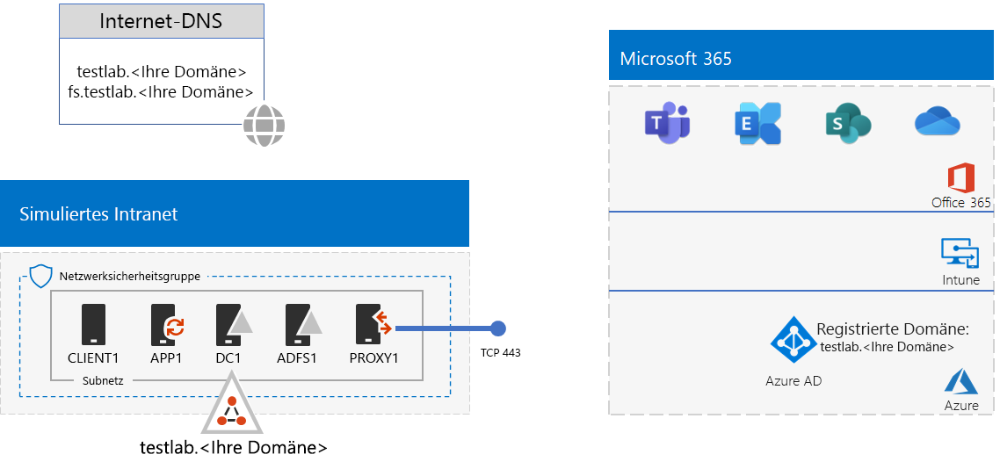
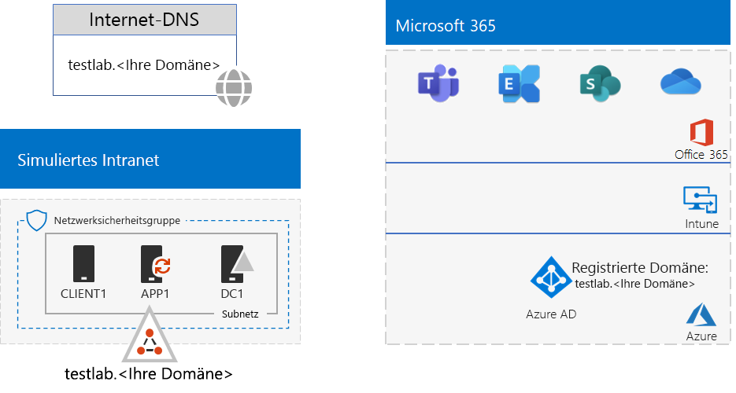
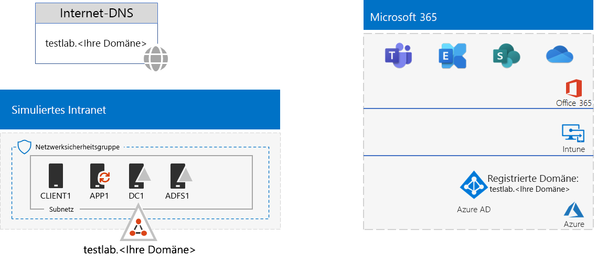

# <a name="federated-identity-for-your-microsoft-365-test-environment"></a>Verbundidentität für Ihre Microsoft 365-Testumgebung

*Diese Testumgebungsanleitung kann für Microsoft 365 Enterprise- und Office 365 Enterprise-Testumgebungen verwendet werden.*

Office 365 unterstützt Verbundidentität. Dies bedeutet, dass Office 365, anstatt die Prüfung von Anmeldeinformationen selbst durchzuführen, den Benutzer, der eine Verbindung herstellt, auf einen Verbundauthentifizierungsserver verweist, der für Office 365 vertrauenswürdig ist. Wenn die Anmeldeinformationen des Benutzers korrekt sind, gibt der Verbundauthentifizierungsserver ein Sicherheitstoken aus, das der Client als Nachweis der Authentifizierung an Office 365 sendet. Verbundidentität ermöglicht das Abladen und zentrale Skalieren der Authentifizierung für ein Office 365-Abonnement sowie erweiterte Authentifizierungs- und Sicherheitsszenarien.
  
In diesem Artikel wird beschrieben, wie Sie die Verbundauthentifizierung für Ihre Microsoft 365- oder Office 365-Testumgebung konfigurieren können, die zu Folgendem führt:


  
Diese Konfiguration besteht aus: 
  
- Eine Testversion oder ein Produktionsabonnement für Microsoft 365 E5 oder Office 365 E5.
    
- Einem vereinfachten Unternehmensintranet, das mit dem Internet verbunden ist, bestehend aus fünf virtuellen Computern in einem Subnetz eines virtuellen Azure-Netzwerks (DC1, APP1, CLIENT1, ADFS1 und PROXY1). Azure AD Connect wird auf APP1 ausgeführt, um die Liste von Konten in der Active Directory Domain Services-Domäne mit Office 365 zu synchronisieren. PROXY1 erhält die eingehenden Authentifizierungsanfragen. ADFS1 überprüft Anmeldeinformationen mit DC1 und gibt Sicherheitstoken aus.
    
Das Einrichten dieser Entwicklungs-/Testumgebung besteht aus fünf Phasen:
  
1. Erstellen Sie die simulierte Testunternehmensumgebung mit Kennworthashsynchronisierung.
    
2. Erstellen des AD FS-Servers (ADFS1).
    
3. Erstellen des Webproxyservers (PROXY1).
    
4. Erstellen eines selbstsignierten Zertifikats und Konfigurieren von ADFS1 und PROXY1.
    
5. Konfigurieren von Office 365 für Verbundidentität.
    
> [!NOTE]
> Sie können diese Testumgebung nicht mit einem Azure-Testabonnement konfigurieren. 
  
## <a name="phase-1-configure-password-hash-synchronization-for-your-microsoft-365-test-environment"></a>Phase 1: Konfigurieren Sie Kennworthashsynchronisierung für Ihre Microsoft 365-Testumgebung

Befolgen Sie die Anweisungen unter [Kennworthashsynchronisierung für Microsoft 365](password-hash-sync-m365-ent-test-environment.md). Hier ist die resultierende Konfiguration.
  

  
Diese Konfiguration besteht aus:  
  
- Eine Testversion oder ein kostenpflichtiges Abonnement für Microsoft 365 E5 oder Office 365 E5.
- Einem vereinfachtem Unternehmensintranet mit Internetzugriff, das aus virtuellen DC1-, APP1- und CLIENT1-Computern in einem Subnetz eines virtuellen Azure-Netzwerks besteht. Azure AD Connect wird auf APP1 ausgeführt, um die AD DS-Domäne "TESTLAB" mit dem Azure AD-Mandanten Ihrer Microsoft 365- oder Office 365 E5-Abonnements regelmäßig zu synchronisieren.

## <a name="phase-2-create-the-ad-fs-server"></a>Phase 2: Erstellen des AD FS-Servers

Ein AD FS-Server bietet Verbundauthentifizierung zwischen Office 365 und den Konten in der Domäne „corp.contoso.com“, die auf DC1 gehostet wird.
  
Um einen virtuellen Azure-Computer für ADFS1 zu erstellen, geben Sie den Namen Ihres Abonnements und der Ressourcengruppe sowie den Azure-Speicherort für Ihre Basiskonfiguration ein, und führen Sie diese Befehle in der Azure PowerShell-Befehlszeile auf Ihrem lokalen Computer aus.
  
```powershell
$subscrName="<your Azure subscription name>"
$rgName="<the resource group name of your Base Configuration>"
$vnetName="TlgBaseConfig-01-VNET"
# NOTE: If you built your simulated intranet with Azure PowerShell, comment the previous line with a "#" and remove the "#" from the next line.
#$vnetName="TestLab"
Connect-AzAccount
Select-AzSubscription -SubscriptionName $subscrName
$staticIP="10.0.0.100"
$locName=(Get-AzResourceGroup -Name $rgName).Location
$vnet=Get-AzVirtualNetwork -Name $vnetName -ResourceGroupName $rgName
$pip = New-AzPublicIpAddress -Name ADFS1-PIP -ResourceGroupName $rgName -Location $locName -AllocationMethod Dynamic
$nic = New-AzNetworkInterface -Name ADFS1-NIC -ResourceGroupName $rgName -Location $locName -SubnetId $vnet.Subnets[0].Id -PublicIpAddressId $pip.Id -PrivateIpAddress $staticIP
$vm=New-AzVMConfig -VMName ADFS1 -VMSize Standard_D2_v2
$cred=Get-Credential -Message "Type the name and password of the local administrator account for ADFS1."
$vm=Set-AzVMOperatingSystem -VM $vm -Windows -ComputerName ADFS1 -Credential $cred -ProvisionVMAgent -EnableAutoUpdate
$vm=Set-AzVMSourceImage -VM $vm -PublisherName MicrosoftWindowsServer -Offer WindowsServer -Skus 2016-Datacenter -Version "latest"
$vm=Add-AzVMNetworkInterface -VM $vm -Id $nic.Id
$vm=Set-AzVMOSDisk -VM $vm -Name "ADFS-OS" -DiskSizeInGB 128 -CreateOption FromImage -StorageAccountType "Standard_LRS"
New-AzVM -ResourceGroupName $rgName -Location $locName -VM $vm
```

Im nächsten Schritt stellen Sie über das [Azure-Portal](https://portal.azure.com) eine Verbindung mit dem virtuellen Computer ADFS1 mit dem Namen und Kennwort des lokalen Administratorkontos von ADFS1 her und öffnen dann eine Windows PowerShell-Eingabeaufforderung.
  
Führen Sie zum Überprüfen der Namensauflösung und der Netzwerkkommunikation zwischen ADFS1 und DC1 den Befehl **ping dc1.corp.contoso.com** aus, und vergewissern Sie sich, dass vier Antworten vorhanden sind.
  
Verknüpfen Sie als Nächstes unter Verwendung der folgenden Befehle an der Windows PowerShell-Eingabeaufforderung auf ADFS1 den virtuellen Computer ADFS1 mit der Domäne CORP.
  
```powershell
$cred=Get-Credential -UserName "CORP\User1" -Message "Type the User1 account password."
Add-Computer -DomainName corp.contoso.com -Credential $cred
Restart-Computer
```

Nachfolgend sehen Sie die daraus resultierende Konfiguration.
  

  
## <a name="phase-3-create-the-web-proxy-server"></a>Phase 3: Erstellen des Webproxyservers

PROXY1 stellt die Proxyfunktion für Authentifizierungsnachrichten zwischen Benutzern, die versuchen, sich zu authentifizieren, und ADFS1 bereit.
  
Um einen virtuellen Azure-Computer für PROXY1 zu erstellen, geben Sie den Namen Ihrer Ressourcengruppe und den Azure-Speicherort ein und führen diese Befehle in der Azure PowerShell-Befehlszeile auf Ihrem lokalen Computer aus.
  
```powershell
$rgName="<the resource group name of your Base Configuration>"
$vnetName="TlgBaseConfig-01-VNET"
# NOTE: If you built your simulated intranet with Azure PowerShell, comment the previous line with a "#" and remove the "#" from the next line.
#$vnetName="TestLab"
$staticIP="10.0.0.101"
$locName=(Get-AzResourceGroup -Name $rgName).Location
$vnet=Get-AzVirtualNetwork -Name $vnetName -ResourceGroupName $rgName
$pip = New-AzPublicIpAddress -Name PROXY1-PIP -ResourceGroupName $rgName -Location $locName -AllocationMethod Static
$nic = New-AzNetworkInterface -Name PROXY1-NIC -ResourceGroupName $rgName -Location $locName -SubnetId $vnet.Subnets[0].Id -PublicIpAddressId $pip.Id -PrivateIpAddress $staticIP
$vm=New-AzVMConfig -VMName PROXY1 -VMSize Standard_D2_v2
$cred=Get-Credential -Message "Type the name and password of the local administrator account for PROXY1."
$vm=Set-AzVMOperatingSystem -VM $vm -Windows -ComputerName PROXY1 -Credential $cred -ProvisionVMAgent -EnableAutoUpdate
$vm=Set-AzVMSourceImage -VM $vm -PublisherName MicrosoftWindowsServer -Offer WindowsServer -Skus 2016-Datacenter -Version "latest"
$vm=Add-AzVMNetworkInterface -VM $vm -Id $nic.Id
$vm=Set-AzVMOSDisk -VM $vm -Name "PROXY1-OS" -DiskSizeInGB 128 -CreateOption FromImage -StorageAccountType "Standard_LRS"
New-AzVM -ResourceGroupName $rgName -Location $locName -VM $vm
```

> [!NOTE]
> PROXY1 wird einer statischen öffentlichen IP-Adresse zugewiesen, da Sie einen öffentlichen DNS-Eintrag erstellen, der darauf verweist, und der nicht geändert werden muss, wenn Sie den virtuellen PROXY1-Computer neu starten. 
  
Fügen Sie als Nächstes eine Regel zu der Netzwerksicherheitsgruppe für das CorpNet-Subnetz hinzu, um unerwünschten eingehenden Verkehr aus dem Internet an die private IP-Adresse von PROXY1 und den TCP-Port 443 zuzulassen. Führen Sie diese Befehle an der Azure PowerShell-Eingabeaufforderung auf dem lokalen Computer aus.
  
```powershell
$rgName="<the resource group name of your Base Configuration>"
Get-AzNetworkSecurityGroup -Name CorpNet -ResourceGroupName $rgName | Add-AzNetworkSecurityRuleConfig -Name "HTTPS-to-PROXY1" -Description "Allow TCP 443 to PROXY1" -Access "Allow" -Protocol "Tcp" -Direction "Inbound" -Priority 101 -SourceAddressPrefix "Internet" -SourcePortRange "*" -DestinationAddressPrefix "10.0.0.101" -DestinationPortRange "443" | Set-AzNetworkSecurityGroup
```

Im nächsten Schritt stellen Sie über das [Azure-Portal](https://portal.azure.com) eine Verbindung mit dem virtuellen Computer PROXY1 mit dem Kontonamen und Kennwort des lokalen Administratorkontos von PROXY1 her und öffnen dann eine Windows PowerShell-Eingabeaufforderung auf PROXY1.
  
Führen Sie zum Überprüfen der Namensauflösung und der Netzwerkkommunikation zwischen PROXY1 und DC1 den Befehl **ping dc1.corp.contoso.com** aus, und vergewissern Sie sich, dass vier Antworten vorhanden sind.
  
Verknüpfen Sie als Nächstes unter Verwendung der folgenden Befehle an der Windows PowerShell-Eingabeaufforderung auf PROXY1 den virtuellen Computer PROXY1 mit der Domäne CORP.
  
```powershell
$cred=Get-Credential -UserName "CORP\User1" -Message "Type the User1 account password."
Add-Computer -DomainName corp.contoso.com -Credential $cred
Restart-Computer
```

Zeigen Sie die öffentliche IP-Adresse von PROXY1 mit den folgenden Azure PowerShell-Befehlen auf dem lokalen Computer an:
  
```powershell
Write-Host (Get-AzPublicIpaddress -Name "PROXY1-PIP" -ResourceGroup $rgName).IPAddress
```

Im nächsten Schritt arbeiten Sie mit Ihrem öffentlichen DNS-Anbieter und erstellen einen neuen öffentlichen DNS A-Eintrag für **fs.testlab.**\<Ihr DNS-Domänenname>, der in die IP-Adresse aufgelöst wird, die vom Befehl **Write-Host** angezeigt wird. Auf **fs.testlab.**\<Ihr DNS-Domänenname> wird nachfolgend als *FQDN des Verbunddiensts* verwiesen.
  
Im nächsten Schritt stellen Sie über das [Azure-Portal](https://portal.azure.com) eine Verbindung mit dem virtuellen Computer DC1 unter Verwendung der Anmeldeinformationen „CORP\\User1“ her und führen dann die folgenden Befehle an einer Windows PowerShell-Eingabeaufforderung auf Administratorebene aus:
  
```powershell
Add-DnsServerPrimaryZone -Name corp.contoso.com -ZoneFile corp.contoso.com.dns
Add-DnsServerResourceRecordA -Name "fs" -ZoneName corp.contoso.com -AllowUpdateAny -IPv4Address "10.0.0.100" -TimeToLive 01:00:00
```
Diese Befehle erstellen einen internen DNS-A-Eintrag, sodass virtuelle Computer im virtuellen Azure-Netzwerk den internen FQDN des Verbunddiensts in die private IP-Adresse von ADFS1 auflösen können.
  
Nachfolgend sehen Sie die daraus resultierende Konfiguration.
  

  
## <a name="phase-4-create-a-self-signed-certificate-and-configure-adfs1-and-proxy1"></a>Phase 4: Erstellen eines selbstsignierten Zertifikats und Konfigurieren von ADFS1 und PROXY1

In dieser Phase erstellen Sie ein selbstsigniertes digitales Zertifikat für den FQDN des Verbunddiensts und konfigurieren ADFS1 und PROXY1 als AD FS-Farm.
  
Im nächsten Schritt stellen Sie über das [Azure-Portal](https://portal.azure.com) eine Verbindung mit dem virtuellen Computer DC1 unter Verwendung der Anmeldeinformationen „CORP\\User1“ her und öffnen dann eine Windows PowerShell-Eingabeaufforderung auf Administratorebene.
  
Im nächsten Schritt erstellen Sie das AD FS-Dienstkonto mit dem folgenden Befehl an der Windows PowerShell-Eingabeaufforderung auf DC1:
  
```powershell
New-ADUser -SamAccountName ADFS-Service -AccountPassword (read-host "Set user password" -assecurestring) -name "ADFS-Service" -enabled $true -PasswordNeverExpires $true -ChangePasswordAtLogon $false
```
Beachten Sie, dass Sie von dem Befehl aufgefordert werden, das Kontokennwort anzugeben. Verwenden Sie ein sicheres Kennwort, und notieren Sie es an einem sicheren Ort. Sie benötigen es für diese Phase und für Phase 5.
  
Verwenden Sie das [Azure-Portal](https://portal.azure.com), um eine Verbindung zu dem virtuellen Computer ADFS1 unter Verwendung der Anmeldeinformationen „CORP\\User1“ herzustellen. Öffnen Sie eine Windows PowerShell-Eingabeaufforderung auf Administratorebene auf ADFS1, geben Sie den FQDN des Verbunddiensts ein, und führen Sie dann die folgenden Befehle aus, um ein selbstsigniertes Zertifikat zu erstellen:
  
```powershell
$fedServiceFQDN="<federation service FQDN>"
New-SelfSignedCertificate -DnsName $fedServiceFQDN -CertStoreLocation "cert:\LocalMachine\My"
New-Item -path c:\Certs -type directory
New-SmbShare -name Certs -path c:\Certs -changeaccess CORP\User1
```

Gehen Sie dann folgendermaßen vor, um das neue selbstsignierte Zertifikat als Datei zu speichern.
  
1. Klicken Sie auf **Start**, geben Sie **mmc.exe** ein, und drücken Sie dann die  **EINGABETASTE**.
    
2. Klicken Sie auf **Datei > Snap-In hinzufügen/entfernen**.
    
3. Doppelklicken Sie unter **Snap-In hinzufügen/entfernen** in der Liste verfügbarer Snap-Ins auf **Zertifikate**, klicken Sie auf **Computerkonto**, und klicken Sie dann auf **Weiter**.
    
4. Klicken Sie unter **Computer auswählen** auf **Fertig stellen**, und klicken Sie dann auf **OK**.
    
5. Öffnen Sie im Strukturbereich **Zertifikate (Lokaler Computer) > Persönlich > Zertifikate**.
    
6. Klicken Sie mit der rechten Maustaste auf das Zertifikat mit dem FQDN des Verbunddiensts, klicken Sie auf **Alle Vorgänge**, und klicken Sie dann auf **Exportieren**.
    
7. Klicken Sie auf der Seite **Willkommen** auf **Weiter**.
    
8. Klicken Sie auf der Seite **Privaten Schlüssel exportieren** auf **Ja** und dann auf **Weiter**.
    
9. Klicken Sie auf der Seite **Dateiformat exportieren** auf **Alle erweiterten Eigenschaften exportieren**, und klicken Sie dann auf **Weiter**.
    
10. Klicken Sie auf der Seite **Sicherheit** auf **Kennwort**, und geben Sie unter **Kennwort** und **Kennwort bestätigen** ein Kennwort ein.
    
11. Klicken Sie auf der Seite **Zu exportierende Datei** auf **Durchsuchen**.
    
12. Navigieren Sie zum Ordner **C:\\Certs**, geben Sie **SSL** unter **Dateiname** ein, und klicken Sie dann auf **Speichern**.
    
13. Klicken Sie auf der Seite **Zu exportierende Datei** auf **Weiter**.
    
14. Klicken Sie auf der Seite **Fertigstellen des Assistenten** auf **Fertig stellen**. Wenn Sie dazu aufgefordert werden, klicken Sie auf **OK**.
    
Im nächsten Schritt erstellen Sie den AD FS-Dienst mit dem folgenden Befehl an der Windows PowerShell-Eingabeaufforderung auf ADFS1:
  
```powershell
Install-WindowsFeature ADFS-Federation -IncludeManagementTools
```

Warten Sie, bis die Installation abgeschlossen ist.
  
Konfigurieren Sie als Nächstes den AD FS-Dienst mit den folgenden Schritten:
  
1. Klicken Sie auf **Start** und dann auf das Symbol **Server-Manager**.
    
2. Klicken Sie im Strukturbereich des Server-Managers auf **Features**.
    
3. Klicken Sie in der Symbolleiste oben auf das orange Warnsymbol, und klicken Sie dann auf **Verbunddienst auf diesem Server konfigurieren**.
    
4. Klicken Sie auf der **Willkommensseite** des Assistenten zum Konfigurieren von Active Directory-Verbunddiensten auf **Weiter**.
    
5. Klicken Sie auf der Seite **Mit AD DS verbinden** auf **Weiter**.
    
6. Auf der Seite **Diensteigenschaften angeben**:
    
  - Klicken Sie für **SSL-Zertifikat** auf den Pfeil nach unten, und klicken Sie dann auf das Zertifikat mit dem Namen des FQDN des Verbunddiensts.
    
  - Geben Sie unter **Anzeigename des Verbunddiensts** den Namen Ihrer fiktiven Organisation ein.
    
  - Klicken Sie auf **Weiter**.
    
7. Klicken Sie auf der Seite **Dienstkonto angeben** auf **Auswählen** für **Kontoname**.
    
8. Geben Sie unter **Benutzer oder Dienstkonto auswählen** den Text **ADFS-Service** ein, klicken Sie auf **Namen überprüfen**, und klicken Sie dann auf **OK**.
    
9. Geben Sie unter **Kontokennwort** das Kennwort für das ADFS-Dienstkonto ein, und klicken Sie dann auf **Weiter**.
    
10. Klicken Sie auf der Seite **Konfigurationsdatenbank angeben** auf **Weiter**.
    
11. Klicken Sie auf der Seite **Optionen prüfen** auf **Weiter**.
    
12. Klicken Sie auf der Seite **Voraussetzungsprüfungen** auf **Konfigurieren**.
    
13. Klicken Sie auf der Seite **Ergebnisse** auf **Schließen**.
    
14. Klicken Sie auf **Start**, klicken Sie auf das Ein-/Ausschaltsymbol, klicken Sie auf **Neu starten**, und klicken Sie dann auf **Weiter**.
    
Melden Sie sich über das [Azure-Portal](https://portal.azure.com) mit dem CORP\\User1-Konto bei PROXY1 an.
  
Gehen Sie dann folgendermaßen vor, um das selbstsignierte Zertifikat zu installieren und PROXY1 zu konfigurieren.
  
1. Klicken Sie auf **Start**, geben Sie **mmc.exe** ein, und drücken Sie dann die  **EINGABETASTE**.
    
2. Klicken Sie auf **Datei > Snap-In hinzufügen/entfernen**.
    
3. Doppelklicken Sie unter **Snap-In hinzufügen/entfernen** in der Liste verfügbarer Snap-Ins auf **Zertifikate**, klicken Sie auf **Computerkonto**, und klicken Sie dann auf **Weiter**.
    
4. Klicken Sie unter **Computer auswählen** auf **Fertig stellen**, und klicken Sie dann auf **OK**.
    
5. Öffnen Sie im Strukturbereich **Zertifikate (Lokaler Computer) > Persönlich > Zertifikate**.
    
6. Klicken Sie mit der rechten Maustaste auf **Persönlich**, wählen Sie **Alle Tasks** aus, und klicken Sie dann auf **Importieren**.
    
7. Klicken Sie auf der Seite **Willkommen** auf **Weiter**.
    
8. Geben Sie auf der Seite **Zu importierende Datei** den Namen **\\\\adfs1\\certs\\ssl.pfx** ein, und klicken Sie dann auf **Weiter**.
    
9. Geben Sie auf der Seite **Schutz durch privaten Schlüssel** das Kennwort des Zertifikats unter **Kennwort** ein, und klicken Sie dann auf **Weiter**.
    
10. Klicken Sie auf der Seite **Zertifikatspeicher** auf **Weiter**.
    
11. Klicken Sie auf der Seite **Fertigstellung** auf **Fertig stellen**.
    
12. Klicken Sie auf der Seite **Zertifikatspeicher** auf **Weiter**.
    
13. Klicken Sie auf **OK**, wenn Sie dazu aufgefordert werden.
    
14. Klicken Sie in der Strukturansicht auf **Zertifikate**.
    
15. Klicken Sie mit der rechten Maustaste auf das Zertifikat, und klicken Sie dann auf **Kopieren**.
    
16. Öffnen Sie im Strukturbereich **Vertrauenswürdige Stammzertifizierungsstellen > Zertifizierungsstellen**.
    
17. Verschieben Sie den Mauszeiger unter die Liste der installierten Zertifikate, klicken Sie mit der rechten Maustaste, und klicken Sie dann auf **Einfügen**.
    
Öffnen Sie eine PowerShell-Eingabeaufforderung auf Administratorebene, und führen Sie den folgenden Befehl aus:
  
```powershell
Install-WindowsFeature Web-Application-Proxy -IncludeManagementTools
```

Warten Sie, bis die Installation abgeschlossen ist.
  
Verwenden Sie die folgenden Schritte, um den Webanwendungs-Proxydienst so zu konfigurieren, dass ADFS1 als Verbundserver verwendet wird:
  
1. Klicken Sie auf **Start** und dann auf **Server-Manager**.
    
2. Klicken Sie in der Strukturansicht auf **Remotezugriff**.
    
3. Klicken Sie in der Symbolleiste oben auf das orange Warnsymbol, und klicken Sie dann auf **Assistent für Webanwendungsproxy öffnen**.
    
4. Klicken Sie auf der **Willkommensseite** des Assistenten zum Konfigurieren des Webanwendungsproxys auf **Weiter**.
    
5. Auf der Seite **Verbundserver**:
    
  - Geben Sie unter **Verbunddienstname** den FQDN des Verbunddiensts ein.
    
  - Geben Sie **CORP\\User1** unter **Benutzername** ein.
    
  - Geben Sie das Kennwort des User1-Kontos unter **Kennwort** ein.
    
  - Klicken Sie auf **Weiter**.
    
6. Klicken Sie auf der Seite **AD FS-Proxyzertifikat** auf den Pfeil nach unten, klicken Sie dann auf das Zertifikat mit dem FQDN des Verbunddiensts, und klicken Sie dann auf **Weiter**.
    
7. Klicken Sie auf der Seite **Bestätigung** auf **Konfigurieren**.
    
8. Klicken Sie auf der Seite **Ergebnisse** auf **Schließen**.

    
## <a name="phase-5-configure-office-365-for-federated-identity"></a>Phase 5: Konfigurieren von Office 365 für Verbundidentität

Verwenden Sie das [Azure-Portal](https://portal.azure.com), um eine Verbindung zu dem virtuellen Computer APP1 unter Verwendung der Kontoanmeldeinformationen „CORP\\User1“ herzustellen.
  
Verwenden Sie diese Schritte, um Azure AD Connect und Ihr Office 365-Abonnement für die Verbundauthentifizierung zu konfigurieren:
  
1. Doppelklicken Sie auf dem Desktop auf **Azure AD Connect**.
    
2. Klicken Sie auf der Seite **Willkommen bei Azure AD Connect** auf **Konfigurieren**.
    
3. Klicken Sie auf der Seite **Weitere Aufgaben** auf **Benutzeranmeldung ändern**, und klicken Sie dann auf **Weiter**.
    
4. Geben Sie auf der Seite **Mit Azure AD verbinden** den Namen und das Kennwort für das globale Office 365-Administratorkonto ein, und klicken Sie dann auf **Weiter**.
    
5. Klicken Sie auf der Seite **Benutzeranmeldung** auf **Verbund mit AD FS**, und klicken Sie dann auf **Weiter**.
    
6. Klicken Sie auf der Seite **AD FS-Farm** auf **Vorhandene AD FS-Farm verwenden**, geben Sie **ADFS1** unter **Servername** ein, und klicken Sie dann auf **Weiter**.
    
7. Wenn Sie aufgefordert werden, Serveranmeldeinformationen einzugeben, geben Sie die Anmeldeinformationen des Kontos „CORP\\User1“ ein, und klicken Sie dann auf **OK**.
    
8. Geben Sie auf der Seite mit den Anmeldeinformationen für den **Domänenadministrator** unter **Benutzername** den Namen **CORP\\User1** und unter **Kennwort** das Kontokennwort ein, und klicken Sie dann auf **Weiter**.
    
9. Geben Sie auf der Seite **AD FS-Dienstkonto** den Namen **CORP\\ADFS-Service** unter **Domänenbenutzername** und das Kontokennwort unter **Domänenbenutzerkennwort** ein, und klicken Sie dann auf **Weiter**.
    
10. Wählen Sie auf der Seite **Azure AD-Domäne** unter **Domäne** den Namen der Domäne aus, die Sie zuvor in Phase 1 erstellt und zu Ihrem Office 365-Abonnement hinzugefügt haben, und klicken Sie dann auf **Weiter**.
    
11. Klicken Sie auf der Seite **Bereit zur Konfiguration** auf **Konfigurieren**.
    
12. Klicken Sie auf der Seite **Installation ist abgeschlossen** auf **Überprüfen**.
    
    Nun sollten Meldungen angezeigt werden, aus denen hervorgeht, dass sowohl die Intranet- als auch die Internetkonfiguration überprüft wurde.
    
13. Klicken Sie auf der Seite **Installation ist abgeschlossen** auf **Beenden**.
    
Gehen Sie folgendermaßen vor, um zu zeigen, dass die Verbundauthentifizierung funktioniert:
  
1. Öffnen Sie eine neue private Instanz Ihres Browsers auf Ihrem lokalen Computer, und wechseln Sie zu [https://admin.microsoft.com](https://admin.microsoft.com).
    
2. Geben Sie als Anmeldeinformationen **user1@**\<die in Phase 1 erstellte Domäne> ein.  
    
    Wenn Ihre Testdomäne beispielsweise **testlab.contoso.com** ist, geben Sie "user1@testlab.contoso.com" ein. Drücken Sie die TAB-TASTE, oder lassen Sie sich von Office 365 automatisch weiterleiten.
    
    Jetzt sollten Sie die Seite **Die Verbindung ist nicht privat** sehen. Dies wird angezeigt, weil Sie ein selbstsigniertes Zertifikat auf ADFS1 installiert haben, das der Desktopcomputer nicht überprüfen kann. In einer Produktionsbereitstellung der Verbundauthentifizierung würden Sie ein Zertifikat von einer vertrauenswürdigen Zertifizierungsstelle verwenden, und Ihre Benutzer würden diese Seite nicht sehen.
    
3. Klicken Sie auf der Seite **Die Verbindung ist nicht privat** auf **Erweitert**, und klicken Sie dann auf **Fortfahren mit \<FQDN des Verbunddiensts>**. 
    
4. Melden Sie sich auf der Seite mit dem Namen Ihrer fiktiven Organisation mit den folgenden Informationen an:
    
  - **CORP\\User1** als Name
    
  - Das Kennwort für das Konto „User1“
    
    Die **Microsoft Office-Homepage** sollte angezeigt werden.
    
In diesem Verfahren wird veranschaulicht, dass Ihr Office 365-Testabonnement im Verbund mit der AD DS-Domäne „corp.contoso.com“ steht, die auf DC1 gehostet wird. Nachfolgend finden Sie die Grundlagen des Authentifizierungsprozesses:
  
1. Wenn Sie die Verbunddomäne verwenden, die Sie in Phase 1 mit dem Anmeldekontonamen erstellt haben, wird Ihr Browser von Office 365 an den FQDN des Verbunddiensts und PROXY1 umgeleitet.
    
2. PROXY1 sendet dem lokalen Computer die Anmeldeseite des fiktiven Unternehmens.
    
3. Wenn Sie „CORP\\User1“ und das Kennwort an PROXY1 senden, werden diese Informationen an ADFS1 weitergeleitet.
    
4. ADFS1 überprüft CORP\\User1 und das Kennwort mit DC1 und sendet dem lokalen Computer ein Sicherheitstoken.
    
5. Der lokale Computer sendet das Sicherheitstoken an Office 365.
    
6. Office 365 überprüft, dass das Sicherheitstoken von ADFS1 erstellt wurde und erlaubt den Zugriff.
    
Ihr Office 365-Testabonnement ist jetzt mit Verbundauthentifizierung konfiguriert. Sie können diese Entwicklungs-/Testumgebung für erweiterte Authentifizierungsszenarien verwenden.
  
## <a name="next-step"></a>Nächster Schritt

Wenn Sie bereit sind, die produktionsbereite, hochverfügbare Verbundauthentifizierung für Microsoft 365 oder Office 365 in Azure bereitzustellen, finden Sie weitere Informationen unter [Bereitstellen der Verbundauthentifizierung mit Hochverfügbarkeit für Office 365 in Azure](https://docs.microsoft.com/office365/enterprise/deploy-high-availability-federated-authentication-for-office-365-in-azure).
  
