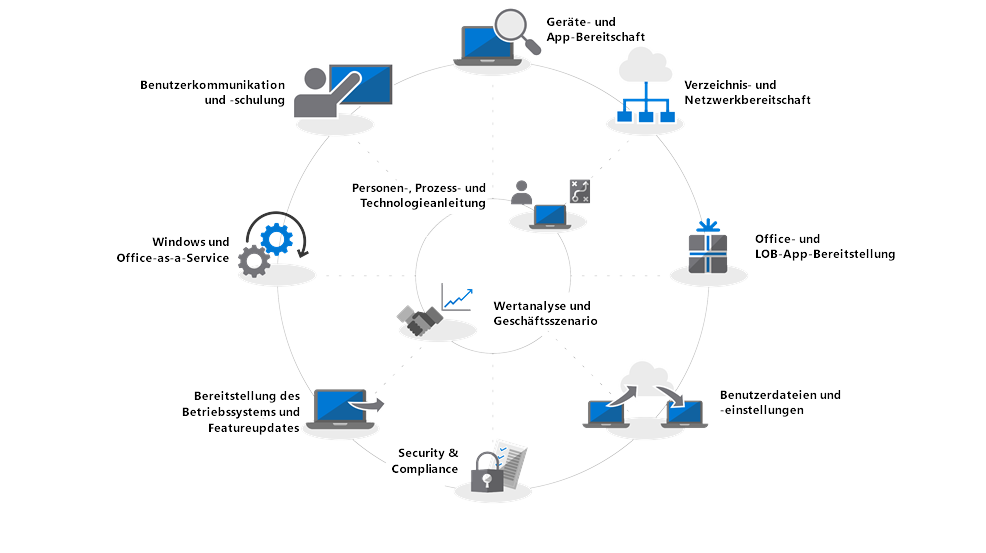

# Erste Schritte – Bereitstellungscenter für modernen Desktop

Durch die Cloud ändert sich die Verwaltung von PCs; denn Microsoft Intelligent Cloud liefert umsetzbare Einblicke, mit deren Hilfe IT-Experten den Umstieg auf einen modernen Desktop leichter bewältigen können. Diese Reihe soll Sie bei der Planung von und beim Umstieg auf einen modernen Desktop basierend auf Windows 10 und Office 365 ProPlus unterstützen.

<table>
<thead>
<td></td>
<td>
<strong>Erste Schritte: Leitfaden zu Personen, Prozessen und Technologien</strong>

Entdecken Sie die Vorteile eines modernen Desktops, von wesentlichen Änderungen und Überlegungen im Vergleich zu früheren Bereitstellungen und von bewährten Methoden, um einen reibungslosen Übergang zu Windows 10 und Office 365 ProPlus sicherzustellen.
</td>
<td></td>
</thead>
</table>

>[!NOTE]
>In dieser Reihe werden die besten Methoden zur Verwendung vorhandener Tools erläutert, und Sie erhalten eine Einführung in neue Technologien, Dienste und Methoden, die durch die Cloud ermöglicht werden. Um den vollständigen Desktopbereitstellungsprozess anzuzeigen, gehen Sie zum [Bereitstellungscenter für modernen Desktop](https://aka.ms/HowToShift).
>

Willkommen beim Bereitstellungscenter für den modernen Desktop, unser zentraler Ort, an dem Sie erfahren, wie Sie den Umstieg auf den modernen Desktop planen und umsetzen können. Hier können Sie einen sicheren Arbeitsbereich mit den neuesten Oberflächen für Produktivität, Teamwork und Zusammenarbeit nutzen.

Wenn Sie schon länger keine neue Desktopumgebung mehr bereitgestellt haben, werden Sie feststellen, dass sich der Bereitstellungsprozess verbessert hat. Die bisherigen Herausforderungen, z. B. Anwendungskompatibilität, sind heute kaum mehr ein Problem und dank neuer Tools und Einblicken aus der Cloud können Sie heute schneller und effizienter als jemals zuvor arbeiten. 

In dieser Einführung wird veranschaulicht, was sich geändert hat, und Sie erhalten eine Demonstration des Rads der Desktopbereitstellung. Sie werden durch die empfohlenen Schritte für Ihren Umstieg auf Windows 10 und Office 365 ProPlus geführt, und Sie erfahren, wie Sie vorhandene Tools und Prozesse nutzen, aber gleichzeitig eine moderne Verwaltungstechnologie und neue Ansätze einführen können.

## Warum Upgrade?

Durch Windows 10 in Kombination mit der Microsoft Intelligence Cloud können Sie Ihren Benutzern einen äußerst leistungsstarken, vielfältigen und sicheren Arbeitsplatz bereitstellen und dabei gleichzeitig Ihre Supportinfrastruktur vereinfachen.

Einer der wichtigsten Grundsätze moderner Verwaltungsprozesse lautet, dass Geräte immer auf dem neusten Stand sein müssen. In dieser Reihe werden Sie neue Funktionen kennenlernen, die Ihnen beim Umstieg auf Windows 10 und Office 365 ProPlus helfen, und Sie erfahren, wie Sie mit den halbjährlichen Versionen auf dem Laufenden bleiben können.

[Windows 10 für IT-Experten](https://www.microsoft.com/de-DE/itpro/windows-10)

## Was wurde geändert?

Sehen wir uns zunächst an, was sich seit Ihrer letzten Desktopbereitstellung geändert und verbessert hat. Wenn Sie Ihre Desktopumgebung schon länger nicht mehr umgestellt haben, verwenden Sie wahrscheinlich Windows 7 und Office 2010 oder Office 2013. In diesem Fall werden Sie feststellen, dass sich seit Ihrem letzten größeren Upgrade einiges verändert hat. Nachfolgend finden Sie einige der wichtigsten Änderungen:

**Identitäts- und Zugriffsverwaltung** Dem modernen Desktop mit seiner Verbindung zu Diensten für Cloudproduktivität, Sicherheit und Verwaltung liegt ein neuer Dienst für die Identitäts- und Zugriffsverwaltung zugrunde: Azure Active Directory. Dadurch wird einmaliges Anmelden und eine sichere Verbindung über Ihre Clouddienste hinweg ermöglicht. Dies bedeutet, dass Sie Azure AD benötigen. Auf diese Weise können Sie die Vorteile von Microsoft 365-Diensten wie Office 365, Intune oder Windows Autopilot nutzen.

[Microsoft 365](https://www.microsoft.com/de-DE/microsoft-365/default.aspx)

**Sichere Pre-Boot-Umgebung** BIOS wurde durch 64-Bit-UEFI-Firmware ersetzt. Dadurch werden nicht nur Bootzeiten beschleunigt, dies ist auch erforderlich, um viele der modernen Sicherheitsfunktionen in Windows 10 zu aktivieren. Windows 10 wird auf BIOS ausgeführt, es wird aber dringend empfohlen, dass Sie UEFI verwenden. Wenn Sie noch nicht von BIOS auf UEFI und 64-Bit umgestiegen sind, sollten Sie es jetzt tun. Es gibt Tools, mit denen Sie diesen Umstieg entweder während eines Windows 10-Upgrades oder danach erledigen können.

[Konvertieren von BIOS in UEFI mit MBR2GPT](https://technet.microsoft.com/de-DE/windows/mt782786.aspx)

**Cloudbasierte Geräteverwaltung** Dienste wie Microsoft Intune verwalten Ihre Windows 10-Geräte so wie andere mobile Geräte, von einer zentralen Stelle aus. Was Microsoft Intune einzigartig macht, ist die Möglichkeit, Ihre Windows 10-Geräte mit System Center Configuration Manager mit zu verwalten. Sie können System Center Configuration Manager als Unterstützung beim Umstieg auf Windows 10 verwenden und dann Microsoft Intune hinzufügen. System Center Configuration Manager wird durch diese Zusammenarbeit das intelligente Edge innerhalb Ihrer Organisation, das mit der intelligenten Cloud von Microsoft verbunden ist. Auf diese Weise können Sie die Geräte Ihrer Benutzer sicher verwalten, unabhängig davon, wo diese sich befinden und ob sie mit der Cloud Ihrer Organisation oder mit der öffentlichen Cloud verbunden sind.

[Mitverwaltung für Windows 10-Geräte](https://docs.microsoft.com/de-DE/sccm/core/clients/manage/co-management-overview)

**Cloudbasierter Bereitstellungsdienst** Für die Anschaffung neuer PCs haben wir einen neuen Clouddienst eingeführt, der Sie bei der Bereitstellung von Microsoft 365-Geräten unterstützt. Dieser Dienst heißt Windows Autopilot-Bereitstellungsdienst. AutoPilot ist in Ihre Hardwareanbieter integriert, und neue Computer sind automatisch bei AutoPilot registriert. Dadurch kann der neue PC direkt an den Endbenutzer ausgeliefert werden. Wenn der PC das erste Mal in Betrieb genommen wird, wird er schnell gemäß der gewünschten Konfiguration Ihrer Organisation konfiguriert und an die speziellen Anforderungen des Benutzers angepasst.

[Windows Autopilot](https://www.microsoft.com/de-DE/windowsforbusiness/windows-autopilot)

**Klick-und-Los-Bereitstellungen** Bei der Bereitstellung von Office-Desktop-Apps ist Office 365 ProPlus die bevorzugte Option. Damit erhalten Sie Zugriff auf die neuesten Innovationen in Office. Sie müssen also nicht jahrelang auf neue Funktionen warten. Sie werden auch eine neue Installation mit dem Namen „Klick-und-Los“ verwenden.

Klick-und-Los unterscheidet sich wesentlich von den MSI-basierten Paketen der Vergangenheit. Klick-und-Los ist schneller und leichter und verwendet ein Programmstreaming, damit Benutzer innerhalb weniger Minuten einsatzbereit sind und im Hintergrund aktualisiert werden können. Machen Sie sich keine Sorgen, es handelt sich um eine lokale Kopie von Office, und Sie können weiterhin Ihre vorhandenen Bereitstellungstools – wie System Center Configuration Manager – zum Bereitstellen und Konfigurieren der Apps verwenden.

[Bereitstellungshandbuch für Office 365 ProPlus](https://docs.microsoft.com/de-DE/DeployOffice/deployment-guide-for-office-365-proplus)

**Halbjährliche Updates** Nach dem Umstieg auf Windows 10 und Office 365 ProPlus werden Updates halbjährlich mit neuen Features bereitgestellt. Da Sie aber von Microsoft Einblicke aus der Cloud erhalten, können Sie diese Updates schnell und sicher auf Hunderten oder Tausenden von Geräten einführen. Wie bei einem direkten Upgrade behält das Featureupdate Apps, Daten und Konfigurationen aus der früheren Version bei.

## Der Bereitstellungsprozess

Bevor Sie beginnen, sollten Sie einen allgemeinen Plan erstellen und die erforderlichen Sponsoren an Bord holen. In unserem Bereitstellungsprozess werden wichtige Schritte aufgeführt, anhand der Sie wichtige Teammitglieder und Ressourcen identifizieren können, die in den folgenden Bereitstellungsbereichen verwaltet werden.

**[Schritt 1: Geräte- und App-Bereitschaft](https://aka.ms/mdd1)** Für eine erfolgreiche Bereitstellung müssen Sie zunächst wissen, was vorhanden ist. Das heißt, Sie nehmen eine Bestandsaufnahme Ihrer Geräte und Apps vor, und überprüfen die Kompatibilität.

Wenn Sie Hilfe bei diesem Vorgang benötigen, können Sie die in unserem cloudbasierten Dienst (Windows Analytics) verfügbaren Tools verwenden. Mit Windows Analytics können Sie die Kompatibilitätsinformationen und Telemetriedaten nutzen, die von mehreren Millionen Computern gesammelt wurden, um die Apps und Treiber auf Ihrem Gerät zu bewerten, damit Sie die Bereitschaft Ihres Desktop einrichten können. Sie können aus Windows Analytics eine Liste von PCs nach System Center Configuration Manager exportieren, die bereit für die Bereitstellung sind, um datengesteuerte Sammlungen von PCs zu erstellen, wenn diese nach und nach bereit werden.

[Erste Schritte mit der Upgradebereitschaft](https://docs.microsoft.com/de-DE/windows/deployment/upgrade/upgrade-readiness-get-started)

**[Schritt 2: Verzeichnis- und Netzwerkbereitschaft](https://aka.ms/mdd2)** Falls noch nicht geschehen, sollten Sie als Nächstes Azure Active Directory für die Identitäts- und Zugriffsverwaltung implementieren. Außerdem sollten Sie Ihr Netzwerk auf die Verschiebung von Systemabbildern, Anwendungspaketen, Benutzerdateien und Updates vorbereiten. Dies umfasst eine große Menge zusätzlicher Daten; Ihr Netzwerk muss über die Kapazität verfügen, um diese zusätzliche Arbeitslast ohne Auswirkungen auf die tägliche Arbeit Ihrer Organisation zu verarbeiten. Wir bieten eine Reihe von Netzwerkoptimierungen an, die von der Bandbreiteneinschränkung und Peer-to-Peer-Optionen bis hin zur Bandbreitenbereinigung und differenziellen Updates reichen.

[Branch-Cache und Peer-Cache](https://blogs.technet.microsoft.com/swisspfe/2018/01/25/branch-cache-vs-peer-cache/)

**[Schritt 3: Bereitstellen von Office- und Branchen-Apps](https://aka.ms/mdd3)** Windows unterstützt zwar weiterhin MSI-basierte Installationen, ab sofort werden aber auch neuere Installationsmechanismen unterstützt, die für eine automatisierte Bereitstellung und fortlaufende Updates optimiert sind. Office 365 ProPlus und Windows 2019-Clients verwenden Klick-und-Los; Sie sollten eine Reihe von UWP-Apps zur Verfügung stellen, und Sie werden feststellen, dass Sie zunehmend Drittanbieter-Apps und intern entwickelte Branchen-Apps bereitstellen, die die neuen MSIX-basierten App-Pakete verwenden. Durch diesen Schritt wird sichergestellt, dass Ihre Apps bereit für automatisierte Bereitstellungen sind, und dass Sie für Erfolg aufgestellt sind, unabhängig davon, ob Ihre Apps für die Bereitstellung Klick-und-Los, MSIX oder herkömmliche MSI-basierte Apps verwenden oder ob es sich um UWP-Apps handelt, die von einem Microsoft Store bereitgestellt werden.

[Einführung in MSIX](https://blogs.msdn.microsoft.com/sgern/2018/06/15/msix-intro/)

**[Schritt 4: Migration von Benutzerdateien und -einstellungen](https://aka.ms/mdd4)** Dies ist bei jedem PC-Austausch oder Aktualisierungszyklus ein entscheidender Schritt: Sie müssen sicherstellen, dass die Dateien, Daten und Einstellungen von Benutzern erfolgreich verschoben und bei der Migration beibehalten werden. Dieser Schritt enthält die verfügbaren Optionen für manuelle oder automatisierte Migrationen, einschließlich bekannter und neuer Optionen.

Wie bei vorherigen Upgrades bleibt das Migrationstool für den Benutzerstatus ein hilfreiches Tools zur Automatisierung dieses Prozesses und ein wichtiger Bestandteil von Migrationen, die mithilfe von System Center Configuration Manager oder dem Microsoft Deployment Toolkit ausgeführt werden. Wenn aber all diese Daten bei der Migration verschoben werden, kann dies aufgrund der physikalischen Umstände der zweimaligen Übertragung Hunderter von Gigabyte pro Computer zu einem Engpass beim PC-Austausch führen – zuerst vom vorhandenen Desktop und dann wieder zurück zum neuen Desktop. Eine neue, von OneDrive aktivierte Option ist „Known Folder Move“, bei der Benutzerdokumente, Bilder und Desktopdateien vor der Bereitstellung in der Cloud synchronisiert werden.

[Umleiten und Verschieben von bekannten Windows-Ordnern in OneDrive](https://docs.microsoft.com/de-DE/onedrive/redirect-known-folders)

**[Schritt 5: Sicherheit und Compliance](https://aka.ms/mdd5)** Sicherheit und Compliance ist ein Bereich, der beim Umstieg auf Windows 10 und Office 365 ProPlus viele Vorteile bietet. Es ist wichtig, dass Sie sich mit den neuen integrierten Funktionen vertraut machen und diese mit den bereits vorhandenen Funktionen vergleichen. Neue Funktionen in Windows 10, die eine virtualisierungsbasierte Sicherheit bieten, können beispielsweise den Diebstahl von Anmeldeinformationen verhindern, Schutz vor browserbasierten Angriffen bieten und das Ausführen von bösartigem Code verhindern, indem Kernprozesse und Geheimnisse vom Betriebssystem isoliert werden. Außerdem erhalten Sie durch Clouddienste wie Advanced Threat Protection eine einheitliche Plattform für die Absicherung, die Erkennung nach einer Sicherheitsverletzung, die Überprüfung und die Reaktion. Advanced Threat Protection bietet auch Schutz vor bösartigen E-Mail-Anlagen, nicht sicheren Hyperlinks usw.

[Microsoft-Sicherheit](https://www.microsoft.com/de-DE/security/default.aspx)

**[Schritt 6: Bereitstellung des Betriebssystems und Featureupdates](https://aka.ms/mdd6)** Wenn alles vorbereitet ist, besteht der nächste Schritt darin, die Betriebssystemabbilder bereitzustellen. Ein Großteil der Arbeit kann mithilfe der Aufgabensequenzen und der Infrastruktur von System Center Configuration Manager erledigt werden. Der empfohlene Ansatz besteht in einer stufenweisen Bereitstellung, bei der Sie sich zuerst auf eine Gruppe von „Early Adoptern“ konzentrieren, die einen repräsentativen Satz von Hardware und Apps verwenden. Sie können dann die Daten von diesen Geräten und Benutzern verwenden, um sich schrittweise immer mehr PCs vorzunehmen.

[Einführung in die Betriebssystembereitstellung in System Center Configuration Manager](https://docs.microsoft.com/de-DE/sccm/osd/understand/introduction-to-operating-system-deployment)

**[Schritt 7: Windows und Office as a Service](https://aka.ms/mdd7)** Dies bedeutet eine wesentliche Veränderung in der Art und Weise, wie Sie den Desktopbestand von Benutzern verwalten. Mit dem Umstieg auf Windows 10 (und Office 365 ProPlus) können Sie Windows (und Office) als Dienst verwalten. Anstatt einer wesentlichen technologischen Veränderung alle paar Jahre stellen Sie Ihren Benutzer fortlaufend neue Funktionen, Oberflächen und Sicherheitsmaßnahmen bereit. Halbjährliche Featureupdates liefern im Frühjahr und Herbst jeden Jahres neue Funktionen, während monatliche kumulative Qualitätsupdates Korrekturen für Sicherheit und Zuverlässigkeit sowie Fehlerkorrekturen beinhalten. Sie können für die Bereitstellung zwar Office 2019-Clients verwenden, wir empfehlen Ihnen aber dringend, dass Sie auf Office ProPlus umsteigen. Dies folgt einem ähnlichen Serviceplan wie Windows, damit Ihre Benutzer auch für die Office-Apps regelmäßig Updates erhalten.

[Übersicht über Windows as a Service](https://docs.microsoft.com/de-DE/windows/deployment/update/waas-overview)

**[Schritt 8: Benutzerkommunikation und Schulung](https://aka.ms/mdd8)** Dieser letzte Schritt ist wichtig, um die Verwendung neuer Funktionen zur Verbesserung der Zusammenarbeit, der Kommunikation, der Sicherheit usw. zu fördern. Bevor eine allgemeine Bereitstellung für Benutzer außerhalb der Gruppe der Early Adopter erfolgt, sollten Sie die Benutzerkommunikation und Schulung einführen. Auf diese Weise können Sie gewünschte Änderungen darin bewirken, wie Personen die neuen Funktionen in Office, Windows oder anderen Branchen-Apps und Diensten verwenden. Als Hilfestellung bieten wir über Microsoft FastTrack kostenlose Onlineschulungen an. Außerdem haben wir kostenlose Pläne und Zeitachsen für Beispielkommunikation zusammen mit E-Mail- und Intranetvorlagen veröffentlicht, um Sie bei der Einführung von Windows 10 zu unterstützen. Als Microsoft 365- oder Office 365-Organisation kann Ihre Organisation möglicherweise auch direkten Support nutzen.

## Nächster Schritt

Sie wissen nun über die neuen Funktionen und Unterschiede Bescheid, und wir haben Sie durch unseren Bereitstellungsprozess geführt. Sie kennen jetzt die End-to-End-Anleitungen und die Tools, die Ihnen für den Umstieg auf einen modernen Desktop zur Verfügung stehen. Jetzt können Sie loslegen.

## [Schritt 1: Geräte- und App-Bereitschaft](https://aka.ms/mdd1)

