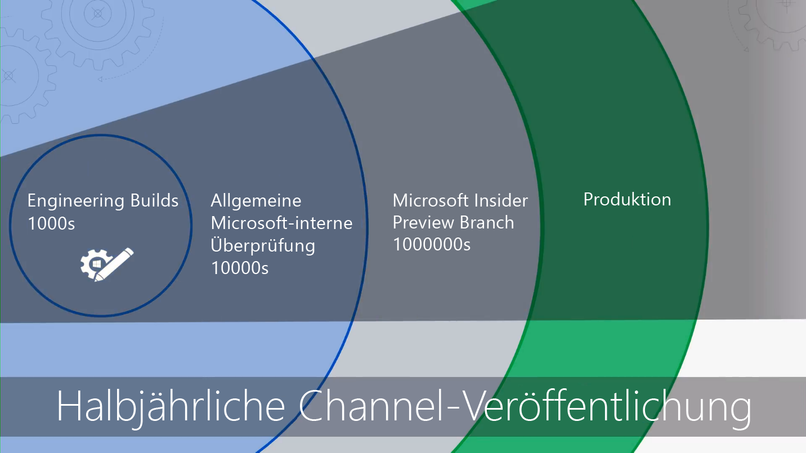

# Erste Schritte – DesktopbereitstellungGetting Started - Modern Desktop Deployment

<table>
<thead>
<td></td>
<td>
<strong>Erste Schritte: Leitfaden zu Personen, Prozessen und Technologien</strong><strong>Getting Started: People, Process and Technology Guidance</strong>

Entdecken Sie die Vorteile von Windows 10 und Office 365 ProPlus, von wesentlichen Änderungen und Überlegungen im Vergleich zu früheren Bereitstellungen und von bewährten Methoden, um einen reibungslosen Übergang zu Windows 10 und Office 365 ProPlus sicherzustellen.Discover the benefits of a modern desktop, major changes and considerations versus previous deployments and best practices to ensure a smooth transition to Windows 10 and Office 365 ProPlus.
</td>
<td></td>
</thead>
</table>

>[!NOTE]
>In dieser Reihe werden die besten Methoden zur Verwendung vorhandener Tools erläutert, und Sie erhalten eine Einführung in neue Technologien, Dienste und Methoden, die durch die Cloud ermöglicht werden.In this series we will explain the best ways to use existing tools, and introduce you to new technologies, services and methods enabled by the Cloud.  To see the full desktop deployment process, visit the Modern Desktop Deployment Center.  Den vollständigen Desktopbereitstellungsprozess finden Sie im [Desktopbereitstellungscenter](https://aka.ms/HowToShift).To see the full desktop deployment process, visit the [Desktop Deployment Center](https://aka.ms/HowToShift).
>

Willkommen beim Desktopbereitstellungscenter, dem zentralen Ort für Informationen zur Planung und zum Übergang zu Windows 10 und Office 365 ProPlus.Welcome to the Desktop Deployment Center, our central place to learn how to help you plan and make the shift to Windows 10 and Office 365 ProPlus. Dadurch können Sie von einem sicheren Arbeitsbereich sowie von der aktuellen Produktivität, Teamarbeit und Zusammenarbeit profitieren.Welcome to the Modern Desktop Deployment Center, our central place to learn how to help you plan and make the shift to the modern desktop. This will allow you take advantage of a secure workspace, powered by the latest productivity, teamwork and collaboration experiences.

Wenn Sie schon länger keine neue Desktopumgebung bereitgestellt haben, können Sie sich über einen verbesserten Bereitstellungsprozess freuen.If you haven’t deployed a new desktop environment for a while, the good news is much about the deployment process has improved. Die Herausforderung aus der Vergangenheit, z. B. Anwendungskompatibilität, sind heute weniger ein Problem.Challenges of the past, such as application compatibility, are much less of an issue today. Neue Tools sowie Informationen aus der Cloud ermöglichen es Ihnen, schneller und effizienter voranzukommen als je zuvor.New tools, as well as insight delivered from the Cloud, enable you to move forward with confidence faster and more efficiently than ever before.

In dieser Einführung wird veranschaulicht, was sich geändert hat, und Sie erhalten eine Demonstration des Rads der Desktopbereitstellung. Sie werden durch die empfohlenen Schritte für Ihren Umstieg auf Windows 10 und Office 365 ProPlus geführt, und Sie erfahren, wie Sie vorhandene Tools und Prozesse nutzen, aber gleichzeitig eine moderne Verwaltungstechnologie und neue Ansätze einführen können.In this introduction we’ll outline what has changed and go on a tour of the Desktop Deployment Wheel. This will guide you through the recommended steps for your shift to Windows 10 and Office 365 ProPlus, detailing how to leverage your existing tools and processes while adopting modern management technology and approaches along the way.

## Warum Upgrade?Why upgrade?

Durch Windows 10 in Kombination mit der Microsoft Intelligence Cloud können Sie Ihren Benutzern einen äußerst leistungsstarken und sicheren Arbeitsplatz bereitstellen und dabei gleichzeitig Ihre Supportinfrastruktur vereinfachen.In combination, Windows 10 and the Microsoft Intelligence Cloud enhance your ability to deliver the most empowering, rich and secure Workspace for your users, and allow you to simplify your supporting infrastructure.

Einer der wichtigsten Mandanten der modernen Verwaltungsmethoden sind Geräte, die immer auf dem neuesten Stand sind.One of the key tenants of modern management practices is devices that are always up-to-date. Diese Reihe enthält Informationen zu neuen Funktionen, die für einen einfacheren Wechsel zu Windows 10 und Office 365 ProPlus bereitgestellt wurden, damit Sie immer die aktuelle halbjährliche Version für beide nutzen können.One of the key tenants of modern management practices is devices that are always up-to-date. Through this series you are going to see new capabilities that are being delivered to help you move to Windows 10 and Office 365 ProPlus and how to stay current with the semi-annual releases of both.

[Windows 10 für IT-ExpertenWindows 10 for the IT Pro](https://www.microsoft.com/de-DE/itpro/windows-10)

[Informationen zu Office 365 ProPlus im UnternehmenAbout Office 365 ProPlus in the enterprise](https://docs.microsoft.com/de-DE/deployoffice/about-office-365-proplus-in-the-enterprise)

## Was wurde geändert?What has Changed

Sehen wir uns zunächst an, was sich seit Ihrer letzten Desktopbereitstellung geändert und verbessert hat. Wenn Sie Ihre Desktopumgebung schon länger nicht mehr umgestellt haben, verwenden Sie wahrscheinlich Windows 7 und Office 2010 oder Office 2013. In diesem Fall werden Sie feststellen, dass sich seit Ihrem letzten größeren Upgrade einiges verändert hat. Nachfolgend finden Sie einige der wichtigsten Änderungen:Let’s start by taking a look at what has changed and improved since your last desktop deployment. If you haven’t shifted your desktop environment in a while you’re likely using Windows 7 and Office 2010 or Office 2013. If you are, you'll notice a few things have evolved since your last major upgrade. Here are some of the core changes:

**Identität und Zugriff:** Windows 10 und Office 365 ProPlus verfügt in Verbindung mit Diensten für Cloudproduktivität, Sicherheit und Verwaltung über einen neuen Dienst für die Identitäts- und Zugriffsverwaltung: Azure Active Directory (Azure AD).**Identity and Access:** Windows 10 and Office 365 ProPlus, with its connectivity to cloud productivity, security, and management services, has a new Identity and Access Management service at its core: Azure Active Directory (Azure AD). Dies ermöglicht einmaliges Anmelden und sichere Verbindung zwischen Ihren Clouddiensten, das bedeutet Sie benötigen Azure AD, um von den Vorteilen von Microsoft 365-Diensten wie Office 365, Intune oder Windows Autopilot zu profitieren.This enables single sign-on and secure connectivity across your cloud services, meaning that you are going to need Azure AD in place to take advantage of Microsoft 365 services such as Office 365, Intune, or Windows Autopilot.

[Microsoft 365Microsoft 365](https://www.microsoft.com/de-DE/microsoft-365/default.aspx)

**Sichere Pre-Boot-Umgebung:** 64-Bit-UEFI-Firmware ersetzt das BIOS.**Secure Pre-Boot Environment:** 64-bit UEFI firmware replaces BIOS. Dies sorgt nicht nur für einen schnelleren Start, sondern ist auch erforderlich, um viele moderne Sicherheitsfunktionen in Windows 10 zu aktivieren.This not only speeds up boot times, it is required to enable many of the modern security capabilities in Windows 10. Obwohl Windows 10 unter BIOS ausgeführt werden kann, wird UEFI dringend empfohlen.While Windows 10 will run on BIOS, UEFI is strongly recommended. Wenn Sie noch nicht vom BIOS zu UEFI gewechselt haben und eine 64-Bit-Version verwenden, ist es nun an der Zeit dies zu tun.If you have not switched from BIOS to UEFI and leveraging 64-bit, now is the time. Es gibt Tools, mit denen dieser Wechsel entweder während eines Upgrades auf Windows 10 oder danach erfolgen kann.There are tools to help you make this switch either during a Windows 10 upgrade, or after it.

**Cloudbasierte Geräteverwaltung:** Dienste wie Microsoft Intune helfen Ihnen dabei, Windows 10-Geräte wie andere Mobilgeräte von einem zentralen Ort zu verwalten.**Cloud-based device Management:** Services like Microsoft Intune help you manage your Windows 10 devices as you do other mobile devices, all from one place. Was Microsoft Intune einzigartig macht, ist die Möglichkeit, Windows 10-Geräte mit System Center Configuration Manager gemeinsam zu verwalten.What makes Microsoft Intune unique is the ability to co-manage your Windows 10 devices with System Center Configuration Manager. Sie können System Center Configuration Manager verwenden, um zu Windows 10 zu wechseln und dann Microsoft Intune hinzuzufügen.You can use System Center Configuration Manager to help you in your shift to Windows 10, and then add Microsoft Intune. Bei der Zusammenarbeit wird System Center Configuration Manager zum intelligenten Edge in Ihrer Organisation, der mit der intelligenten Microsoft Cloud verbunden ist.Working together, System Center Configuration Manager becomes the intelligent edge within your organization, connected to the Microsoft intelligent cloud. Dadurch können Sie die Geräte Ihrer Benutzer sicher verwalten, egal, wo sie sich befinden und ob sie mit der Infrastruktur der Organisation verbunden oder mit der öffentlichen Cloud verbunden sind.This allows you to manage your users’ devices securely wherever they are, whether connected on your organization’s infrastructure or in the public cloud.

[Mitverwaltung für Windows 10-GeräteCo-management for Windows 10 devices](https://docs.microsoft.com/de-DE/sccm/core/clients/manage/co-management-overview)

**Cloudbasierter Bereitstellungsdienst:** Wenn Sie neue PCs kaufen, wurde bei diesen ein neuer Clouddienst namens Windows Autopilot-Bereitstellungsdienst eingeführt, mit dem Sie Microsoft 365-Geräte verwalten können.**Cloud-based Deployment Service:** As you acquire new PCs we’ve introduced a new cloud service to help you deploy Microsoft 365 devices called the Windows Autopilot deployment service. Autopilot ist bei Hardwareanbietern integriert, und neue PCs werden automatisch in Autopilot registriert, sodass sie direkt an den Endbenutzer gesendet werden können.Autopilot is integrated with your hardware providers and new PCs are automatically registered in Autopilot enabling the new PC to be shipped directly to the end-user. Wenn der Computer das erste Mal eingeschaltet wird, ist die gewünschte Konfiguration Ihrer Organisation schnell konfiguriert und an die Bedürfnisse des Benutzers angepasst.When the PC is powered on the first time it is quickly configured to your organizations desired configuration and customized for the specific needs of the user.

[Windows AutopilotWindows Autopilot](https://www.microsoft.com/de-DE/windowsforbusiness/windows-autopilot)

**Klick-und-Los-Bereitstellungen:** Bei der Bereitstellung von Office-Desktop-Apps ist Office 365 ProPlus die bevorzugte Option.**Click-to-Run Deployments:** When provisioning Office desktop apps, Office 365 ProPlus is the preferred option. Mit dieser Option erhalten Sie Zugriff auf die neuesten Innovationen in Office, sobald sie entwickelt sind, und müssen nicht Jahre lang warten, um neue Funktionen zu erhalten.Click-to-Run Deployments When provisioning Office desktop apps, Office 365 ProPlus is the preferred option. This gives you access to the newest innovations in Office as they are developed, so you won’t need to wait years before getting new capabilities. You’ll also use a new installation called Click-to-Run. Sie verwenden auch eine neue Installation, die als Klick-und-Los bezeichnet wird.You’ll also use a new installation called Click-to-Run.

Klick-und-Los unterscheidet sich stark von den MSI-basierten Paketen in der Vergangenheit.Click-to-Run is quite different from the MSI-based packages of the past. Klick-und-Los ist schneller und einfacher und unterstützt die Aktualisierung im Hintergrund ohne Auswirkungen auf die Benutzer.Click-to-Run is faster, lighter, and supports updates in the background to keep your users to be up and running. Es ist weiterhin eine lokale Kopie von Office, und Sie können weiterhin für die Bereitstellung und Konfiguration der Apps Ihre vorhandenen Bereitstellungstools wie System Center Configuration Manager verwenden.It is still a local copy of Office and you can continue to use your existing deployment tools, like System Center Configuration Manager, to provision and configure the apps.

[Bereitstellungshandbuch für Office 365 ProPlusDeployment guide for Office 365 ProPlus](https://docs.microsoft.com/de-DE/DeployOffice/deployment-guide-for-office-365-proplus)

**Halbjährliche Updates:** Nach dem Umstieg auf Windows 10 und Office 365 ProPlus werden Updates mit neuen Funktionen halbjährlich bereitgestellt.**Semi-Annual Updates:** Once you have moved to Windows 10 and Office 365 ProPlus, updates are delivered semi-annually with new features. Dank der Einblicke aus der Cloud von Microsoft können Sie diese Updates schnell und sicher für Hunderte oder Tausende von Geräten bereitstellen.But with Microsoft able to deliver insights from the cloud to help, you can quickly and confidently roll out these updates to hundreds or thousands of devices. Wie bei einem direkten Upgrade werden beim Featureupdate Apps, Daten und Konfigurationen aus der vorherigen Version beibehalten.Like an in-place upgrade, the Feature Update preserves apps, data, and configurations from the previous release.

## Der BereitstellungsprozessThe Deployment Process Wheel

Bevor Sie beginnen, sollten Sie einen allgemeinen Plan erstellen und die erforderlichen Sponsoren ins Boot holen.Before you get started, the you’ll want to create a high-level plan and get the necessary sponsors on board. Our deployment process wheel outlines critical steps to help you to identify core team members and resources to manage in the following deployment areas. Unser Bereitstellungsprozess beschreibt wichtige Schritte, anhand der Sie die wichtigsten Teammitglieder und Ressourcen in den folgenden Bereitstellungsbereichen verwalten können.Before you get started, the you’ll want to create a high-level plan and get the necessary sponsors on board. Our deployment process wheel outlines critical steps to help you to identify core team members and resources to manage in the following deployment areas.

**[Schritt 1: Geräte- und App-Bereitschaft](https://aka.ms/mdd1)** Für eine erfolgreiche Bereitstellung müssen Sie zunächst wissen, was Sie haben.**[Step 1: Device and App readiness](https://aka.ms/mdd1)** For a successful deployment you must first know what you have. That means taking an inventory of your devices and apps and verifying compatibility. Das bedeutet, dass eine Bestandsaufnahme Ihrer Geräte und Apps und eine Überprüfung der Kompatibilität erforderlich ist.Step 1: Device and App readiness For a successful deployment you must first know what you have. That means taking an inventory of your devices and apps and verifying compatibility. Zur Unterstützung können Sie dabei die Tools nutzen, die in unserem cloudbasierten Dienst, Windows Analytics, verfügbar sind.To help with this you can leverage the tools available in our cloud-based service, Windows Analytics. Mit Windows Analytics können Sie auf Kompatibilitätsintelligenz und Diagnosedaten von Hunderten von Millionen Computern zugreifen, um die auf Ihrem Gerät ausgeführten Apps und Treiber zu bewerten, damit Sie die Bereitschaft Ihres Desktops sicherstellen können.Windows Analytics allows you tap into compatibility intelligence and diagnostic data gathered from hundreds of millions of PCs, to assess the apps and drivers running on your device so you can establish the readiness of your desktop estate. Sie können aus Windows Analytics eine Liste der Computer, die für die Bereitstellung bereit sind, in System Center Configuration Manager exportieren, wenn Sie es verwenden, sodass Sie datengesteuerte Sammlungen der entsprechenden Computer erstellen können, sobald diese bereit sind.You can even export a list of “PCs ready for deployment” from Windows Analytics to System Center Configuration Manager if you use it, allowing you to build data-driven collections of targeted PCs as they become ready.

[Erste Schritte mit der UpgradebereitschaftGet started with Upgrade Readiness](https://docs.microsoft.com/de-DE/windows/deployment/upgrade/upgrade-readiness-get-started)

\*\*[Schritt 2: Verzeichnis- und Netzwerkbereitschaft](https://aka.ms/mdd2) \*\* Wenn noch nicht geschehen, müssen Sie als Nächstes Azure Active Directory für die Identitäts- und Zugriffsverwaltung implementieren.**[Step 2: Directory and Network Readiness](https://aka.ms/mdd2)** If you haven’t already, you’ll want to implement Azure Active Directory for identity and access management next. Sie müssen auch das Netzwerk für die Verschiebung der Systemabbilder, Anwendungspakete, Benutzerdateien und Updates vorbereiten.You will also want to prepare your network for the movement of system images, application packages, user files, and updates across it. Das bedeutet eine große Menge an zusätzlichen Daten; Ihr Netzwerk muss über die Kapazität für diese zusätzliche Auslastung verfügen, ohne dass sich dies auf die tägliche Arbeit Ihrer Organisation auswirkt.That means a large amount of additional data; your network must have the capacity to handle this extra load without impact to the day-to-day work of your organization. Es sind zahlreiche Netzwerkoptimierungen verfügbar, von Bandbreitendrosselungs- und Peer-to-Peer-Optionen bis hin zum dynamischen Aufräumen der Bandbreite und differenzieller Aktualisierung.We have a range of networking optimizations available from bandwidth throttling and peer-to-peer options to dynamic bandwidth scavenging and differential updating.

[Branch-Cache und Peer-CacheBranchCache vs. Peer Cache](https://blogs.technet.microsoft.com/swisspfe/2018/01/25/branch-cache-vs-peer-cache/)

**[Schritt 3: Bereitstellung von Office und Branchen-Apps](https://aka.ms/mdd3)** Neben der Unterstützung von MSI-basierten Installationen bietet Windows nun auch Unterstützung für neue Installationsmechanismen, die für die automatisierte Bereitstellung und kontinuierliche Updates optimiert sind.**[Step 3: Office and Line of Business App Delivery](https://aka.ms/mdd3)** While Windows continues to support MSI-based installations it also now supports newer installations mechanisms, optimized for automated deployment and continuous updates. Office 365 ProPlus und Office 2019-Clients verwenden die Klick-und-Los-Installationstechnologie.Office 365 ProPlus and Office 2019 clients use Click-to-Run installation technology. Möglicherweise möchten Sie neben zahlreichen UPW-Apps auch Drittanbieter-Apps und intern entwickelte Branchen-Apps bereitstellen, die die MSIX-basierten Verpackungs-Apps verwenden.You may want to make a range of UWP apps available, and you may increasingly find yourself deploying third-party apps and in-house developed Line of Business Apps that use the new MSIX-based packaging apps. In diesem Schritt wird sichergestellt, dass Ihre Apps für automatisierte Bereitstellungen bereit sind und dass sie erfolgreich bereitgestellt werden können, unabhängig davon, ob Apps mithilfe von Klick-und-Los, MSIX oder MSI-basiert bereitgestellt werden oder ob es sich dabei um UWP-Apps handelt, die über einen von Ihnen eingerichteten Microsoft Store bereitgestellt werden.This step ensures your apps are ready for automated deployments, and that you are set up for success whether your apps deploy using Click-to-Run, MSIX, conventional MSI-based, or are UWP apps deployed from a Microsoft Store from Business you set up.

[Einführung in MSIXMSIX Intro](https://blogs.msdn.microsoft.com/sgern/2018/06/15/msix-intro/)

**[Schritt 4: Migration von Benutzerdateien und -einstellungen](https://aka.ms/mdd4)** Dies ist bei jedem PC-Austausch oder Aktualisierungszyklus ein entscheidender Schritt: Sie müssen sicherstellen, dass die Dateien, Daten und Einstellungen von Benutzern erfolgreich verschoben und bei der Migration beibehalten werden.**[Step 4: User Files and Settings Migration](https://aka.ms/mdd4)** This is a critical step in any PC replacement or refresh cycle: you have to ensure users’ files, data and settings move successfully and are preserved over the migration. This step covers the options available for manual or automated migrations, including well-known and new options. Dieser Schritt enthält die verfügbaren Optionen für manuelle oder automatisierte Migrationen, einschließlich bekannter und neuer Optionen.This step covers the options available for manual or automated migrations, including well-known and new options.

Wie in vorherigen Upgrades ist das Migrtionstool für den Benutzerstatus (USMT) weiterhin hilfreich, um diesen Prozess zu automatisieren, und bleibt ein wesentlicher Bestandteil der Migrationen, die mit System Center Configuration Manager oder dem Microsoft Deployment Toolkit koordiniert werden.As in previous upgrades, the User State Migration Tool continues to be a valuable tool to automate this process and it remains an integral part of migrations orchestrated using System Center Configuration Manager or the Microsoft Deployment Toolkit. Das Verschieben all dieser Daten bei der Migration kann jedoch einen zeitlichen Engpass für den PC-Austausch bedeuten, da Hunderte von Gigabyte pro Computer zwei mal übertragen werden müssen, erst vom vorhandenen Desktop und dann auf den neuen Desktop.But moving all this data at migration can be a timing bottleneck for PC replacement due to the physics involved in transferring sometimes hundreds of gigabytes per PC twice – first from the existing desktop, then back down to the new desktop. Eine neue Option von OneDrive ist die Verschiebung bekannter Ordner, die zum Synchronisieren von Benutzerdokumenten, Bildern und Desktopdateien, in der Cloud und vor der Bereitstellung verwendet wird.A new option enabled by OneDrive is Known Folder Move used to sync user documents, pictures, and desktop files at scale, in the cloud, and ahead of deployment.

[Umleiten und Verschieben von bekannten Windows-Ordnern in OneDriveRedirect and move Windows known folders to OneDrive](https://docs.microsoft.com/de-DE/onedrive/redirect-known-folders)

**[Schritt 5: Sicherheit und Compliance](https://aka.ms/mdd5)** Sicherheit und Compliance ist ein Bereich, der beim Umstieg auf Windows 10 und Office 365 ProPlus viele Vorteile bietet. Es ist wichtig, dass Sie sich mit den neuen integrierten Funktionen vertraut machen und diese mit den bereits vorhandenen Funktionen vergleichen. Neue Funktionen in Windows 10, die eine virtualisierungsbasierte Sicherheit bieten, können beispielsweise den Diebstahl von Anmeldeinformationen verhindern, Schutz vor browserbasierten Angriffen bieten und das Ausführen von bösartigem Code verhindern, indem Kernprozesse und Geheimnisse vom Betriebssystem isoliert werden. Außerdem erhalten Sie durch Clouddienste wie Advanced Threat Protection eine einheitliche Plattform für die Absicherung, die Erkennung nach einer Sicherheitsverletzung, die Überprüfung und die Reaktion. Advanced Threat Protection bietet auch Schutz vor bösartigen E-Mail-Anlagen, nicht sicheren Hyperlinks usw.**[Step 5: Security and Compliance](https://aka.ms/mdd5)** Security and Compliance is an area with a lot upside when moving to Windows 10 and Office 365 ProPlus. It is important you familiarize yourself with the new built-in capabilities and compare that with what you already have. For example, new capabilities in Windows 10 using virtualization-based security can prevent credential theft, protect against browser-based exploits and malicious code execution by isolating core processes and secrets from the operating system. In addition, cloud services like Advanced Threat Protection give you a unified platform for security hardening, post-breach detection, investigation, and response. Advanced Threat Protection can also safeguard you against malicious email attachments, unsafe hyperlinks and more.

[Microsoft-SicherheitMicrosoft Security](https://www.microsoft.com/de-DE/security/default.aspx)

**[Schritt 6: Bereitstellung des Betriebssystems und Featureupdates](https://aka.ms/mdd6)** Wenn alles vorbereitet ist, besteht der nächste Schritt darin, die Betriebssystemabbilder bereitzustellen. Ein Großteil der Arbeit kann mithilfe der Aufgabensequenzen und der Infrastruktur von System Center Configuration Manager erledigt werden. Der empfohlene Ansatz besteht in einer stufenweisen Bereitstellung, bei der Sie sich zuerst auf eine Gruppe von „Early Adoptern“ konzentrieren, die einen repräsentativen Satz von Hardware und Apps verwenden. Sie können dann die Daten von diesen Geräten und Benutzern verwenden, um sich schrittweise immer mehr PCs vorzunehmen.**[Step 6: OS Deployment and Feature Updates](https://aka.ms/mdd6)** With everything prepared, the next step is to deploy the OS images. A lot of the heavy lifting for can be done using System Center Configuration Manage task sequences and infrastructure. The recommended approach is to deploy in phases, first targeting and deploying to an “early adopter group” in your organization using a representative set of hardware and apps. You can then use the data from those devices and users to gradually target more and more PCs.

[Einführung in die Betriebssystembereitstellung in System Center Configuration ManagerIntroduction to operating system deployment in System Center Configuration Manager](https://docs.microsoft.com/de-DE/sccm/osd/understand/introduction-to-operating-system-deployment)

**[Schritt 7: Windows und Office-as-a-Service](https://aka.ms/mdd7)** Dies steht für eine bedeutende Änderung in der Weise, wie Desktops verwaltet werden.**[Step 7: Windows and Office as a Service](https://aka.ms/mdd7)** This represents a major shift in the way you maintain users’ desktop real-estate. Mit diesem Umstieg auf Windows 10 und Office 365 ProPlus können Sie zur Windows und Office-as-a-Service-Verwaltung wechseln.With this move to Windows 10 and Office 365 ProPlus you can move to managing Windows and Office as a service. Anstelle eines großen Technologiewechsel alle paar Jahre können Sie Benutzern kontinuierlich neue Funktionen, Erfahrungen und Schutzfunktionen bereitstellen.In place of a massive shift in technology every few years, you will continually be bringing new capabilities, experiences, and protections to your user. Halbjährliche Featureupdates liefern neue Funktionen im Herbst und Frühling eines jeden Jahres, während monatliche kumulative Updates weiterhin Sicherheit, Zuverlässigkeit und Fehlerbehebungen enthalten.Semi-annual feature updates deliver new capabilities in the Fall and Spring of each year, while monthly cumulative Quality Updates will contain security, reliability, and bug fixes. Sie können zwar den Office 2019-Client bereitstellen, es wird jedoch dringend ein Wechsel zu Office 365 ProPlus empfohlen.While you can opt to deploy the Office 2019 client, we strongly recommend you to move to Office 365 ProPlus. Dies folgt einem ähnlichen Serviceplan wie Windows, sodass Benutzer Updates für die Office-Apps in regelmäßigen Abständen erhalten.This follows a similar service plan to Windows so your users get updates to the Office apps on a regular basis too.

[Übersicht über Windows-as-a-Service](https://docs.microsoft.com/de-DE/windows/deployment/update/waas-overview)
[Übersicht über Office-as-a-Service](https://docs.microsoft.com/de-DE/DeployOffice/overview-of-update-channels-for-office-365-proplus)[Overview of Windows as a service](https://docs.microsoft.com/de-DE/windows/deployment/update/waas-overview)
[Overview of Office as a service](https://docs.microsoft.com/de-DE/DeployOffice/overview-of-update-channels-for-office-365-proplus)

\*\*[Schritt 8: Benutzerkommunikation und Schulung](https://aka.ms/mdd8) \*\* Dieser letzte Schritt ist entscheidend für die Verwendung der neuen Funktionen zur Verbesserung der Zusammenarbeit, Kommunikation, Sicherheit und mehr.**[Step 8: User Communications and Training](https://aka.ms/mdd8)** This last step is critical to driving usage of new capabilities for enhancing teamwork, communications, security, and more. Vor der allgemeinen Bereitstellung für reguläre Benutzer wird ein Rollout der Benutzerkommunikation und Schulung empfohlen.Before broad deployment is targeted to users outside early adopter rings, we recommend you roll out user communication and training. Dadurch können die gewünschten Änderungen bei der Verwendung neuer Funktionen in Office, Windows oder anderen Branchen-Apps und Diensten bewirkt werden.This will help drive desired changes in how people use new capabilities in Office, Windows, or other line of business apps and services. Zur Unterstützung bieten wir kostenlose Schulungen über Microsoft FastTrack an.To assist, we provide free online training via Microsoft FastTrack. Außerdem haben wir kostenlose Beispielkommunikationspläne und Zeitachsen und Vorlagen für E-Mails, soziale Netzwerke und Intranet veröffentlicht, die Sie beim der Einführung von Windows 10 unterstützen sollen.Plus, we’ve published free sample communication plans and timelines together with email, social, and intranet templates to help with your rollout of Windows 10. Als Microsoft 365- oder Office 365-Organisation kann Ihre Organisation auch für direkte Unterstützung berechtigt sein.As a Microsoft 365 or Office 365 organization, your organization may also be eligible for and direct support.

## Nächster SchrittNext Step

Nun kennen Sie die Neuerungen und Änderungen bei Windows 10 und Office 365 ProPlus und sind am Ende des empfohlenen Bereitstellungsprozesses angekommen.Now you know what’s new and different in Windows 10 and Office 365 ProPlus, and we have walked through our recommended deployment process wheel. Mit dieser umfassenden Anleitung und den verfügbaren Tools, können Sie mit dem Umstieg auf Windows 10 und Office 365 ProPlus beginnen.With this taste for the end-to-end guidance and tools available for you to make the shift to Windows 10 and Office 365 ProPlus, let’s get started.

## [Schritt 1: Geräte- und App-BereitschaftStep 1: Device and App Readiness](https://aka.ms/mdd1)

