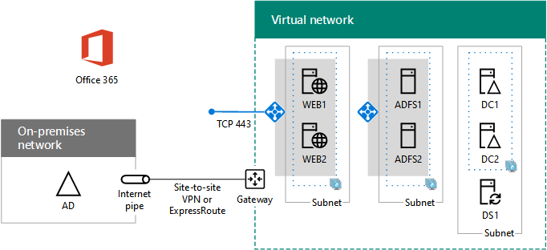

# <a name="high-availability-federated-authentication-phase-4-configure-web-application-proxies"></a><span data-ttu-id="c8d8a-103">Hochverfügbarkeit der Verbundauthentifizierung, Phase 4: Konfigurieren von Webanwendungsproxys</span><span class="sxs-lookup"><span data-stu-id="c8d8a-103">High availability federated authentication Phase 4: Configure web application proxies</span></span>

<span data-ttu-id="c8d8a-104">In dieser Phase der Bereitstellung von hoher Verfügbarkeit für die Verbundauthentifizierung von Microsoft 365 in Azure-Infrastrukturdiensten erstellen Sie einen internen Lastenausgleich und zwei AD FS-Server.</span><span class="sxs-lookup"><span data-stu-id="c8d8a-104">In this phase of deploying high availability for Microsoft 365 federated authentication in Azure infrastructure services, you create an internal load balancer and two AD FS servers.</span></span>
  
<span data-ttu-id="c8d8a-105">Sie müssen diese Phase abschließen, bevor Sie mit [Phase 5: Konfigurieren der Verbundauthentifizierung für Microsoft 365](high-availability-federated-authentication-phase-5-configure-federated-authentic.md)fortfahren.</span><span class="sxs-lookup"><span data-stu-id="c8d8a-105">You must complete this phase before moving on to [Phase 5: Configure federated authentication for Microsoft 365](high-availability-federated-authentication-phase-5-configure-federated-authentic.md).</span></span> <span data-ttu-id="c8d8a-106">Unter [Bereitstellen der Verbundauthentifizierung mit hoher Verfügbarkeit für Microsoft 365 in Azure](deploy-high-availability-federated-authentication-for-microsoft-365-in-azure.md) für alle Phasen.</span><span class="sxs-lookup"><span data-stu-id="c8d8a-106">See [Deploy high availability federated authentication for Microsoft 365 in Azure](deploy-high-availability-federated-authentication-for-microsoft-365-in-azure.md) for all of the phases.</span></span>
  
## <a name="create-the-internet-facing-load-balancer-in-azure"></a><span data-ttu-id="c8d8a-107">Erstellen des Lastenausgleichs mit Internetzugriff in Azure</span><span class="sxs-lookup"><span data-stu-id="c8d8a-107">Create the Internet-facing load balancer in Azure</span></span>

<span data-ttu-id="c8d8a-108">Sie müssen einen Lastenausgleich mit Internetzugriff erstellen, damit Azure den eingehenden Clientauthentifizierungsverkehr aus dem Internet gleichmäßig unter den beiden Webanwendungsproxy-Servern verteilt.</span><span class="sxs-lookup"><span data-stu-id="c8d8a-108">You must create an Internet-facing load balancer so that Azure distributes the incoming client authentication traffic from the Internet evenly among the two web application proxy servers.</span></span>
  
> [!NOTE]
> <span data-ttu-id="c8d8a-109">[!HINWEIS] In den folgenden Befehlssätzen wird die aktuelle Version von Azure PowerShell verwendet.</span><span class="sxs-lookup"><span data-stu-id="c8d8a-109">The following command sets use the latest version of Azure PowerShell.</span></span> <span data-ttu-id="c8d8a-110">Weitere Informationen finden Sie unter [Erste Schritte mit Azure PowerShell](https://docs.microsoft.com/powershell/azure/get-started-azureps).</span><span class="sxs-lookup"><span data-stu-id="c8d8a-110">See [Get started with Azure PowerShell](https://docs.microsoft.com/powershell/azure/get-started-azureps).</span></span> 
  
<span data-ttu-id="c8d8a-111">Sobald Sie die Werte für Speicherort und Ressourcengruppe korrekt festgelegt haben, führen Sie den resultierenden Block über die Azure PowerShell-Eingabeaufforderung oder in PowerShell ISE aus.</span><span class="sxs-lookup"><span data-stu-id="c8d8a-111">When you have supplied location and resource group values, run the resulting block at the Azure PowerShell command prompt or in the PowerShell ISE.</span></span>
  
> [!TIP]
> <span data-ttu-id="c8d8a-112">Verwenden Sie diese [Microsoft Excel Konfigurations Arbeitsmappe](https://github.com/MicrosoftDocs/OfficeDocs-Enterprise/raw/live/Enterprise/downloads/O365FedAuthInAzure_Config.xlsx), um Ready-to-Run PowerShell-Befehlsblöcke basierend auf Ihren benutzerdefinierten Einstellungen zu generieren.</span><span class="sxs-lookup"><span data-stu-id="c8d8a-112">To generate ready-to-run PowerShell command blocks based on your custom settings, use this [Microsoft Excel configuration workbook](https://github.com/MicrosoftDocs/OfficeDocs-Enterprise/raw/live/Enterprise/downloads/O365FedAuthInAzure_Config.xlsx).</span></span> 

```powershell
# Set up key variables
$locName="<your Azure location>"
$rgName="<Table R - Item 4 - Resource group name column>"

$publicIP=New-AzPublicIpAddress -ResourceGroupName $rgName -Name "WebProxyPublicIP" -Location $LocName -AllocationMethod "Static"
$frontendIP=New-AzLoadBalancerFrontendIpConfig -Name "WebAppProxyServers-LBFE" -PublicIpAddress $publicIP
$beAddressPool=New-AzLoadBalancerBackendAddressPoolConfig -Name "WebAppProxyServers-LBBE"
$healthProbe=New-AzLoadBalancerProbeConfig -Name "WebServersProbe" -Protocol "TCP" -Port 443 -IntervalInSeconds 15 -ProbeCount 2
$lbrule=New-AzLoadBalancerRuleConfig -Name "WebTraffic" -FrontendIpConfiguration $frontendIP -BackendAddressPool $beAddressPool -Probe $healthProbe -Protocol "TCP" -FrontendPort 443 -BackendPort 443
New-AzLoadBalancer -ResourceGroupName $rgName -Name "WebAppProxyServers" -Location $locName -LoadBalancingRule $lbrule -BackendAddressPool $beAddressPool -Probe $healthProbe -FrontendIpConfiguration $frontendIP
```

<span data-ttu-id="c8d8a-113">Um die dem Lastenausgleich mit Internetzugriff zugewiesene öffentliche IP-Adresse anzuzeigen, führen Sie die folgenden Azure PowerShell-Eingabeaufforderung auf dem lokalen Computer aus:</span><span class="sxs-lookup"><span data-stu-id="c8d8a-113">To display the public IP address assigned to your Internet-facing load balancer, run these commands at the Azure PowerShell command prompt on your local computer:</span></span>
  
```powershell
Write-Host (Get-AzPublicIpaddress -Name "WebProxyPublicIP" -ResourceGroup $rgName).IPAddress
```

## <a name="determine-your-federation-service-fqdn-and-create-dns-records"></a><span data-ttu-id="c8d8a-114">Ermitteln des FQDN des Verbunddiensts und Erstellen von DNS-Einträgen</span><span class="sxs-lookup"><span data-stu-id="c8d8a-114">Determine your federation service FQDN and create DNS records</span></span>

<span data-ttu-id="c8d8a-115">Sie müssen den DNS-Namen ermitteln, um den Namen des Verbunddiensts im Internet zu identifizieren.</span><span class="sxs-lookup"><span data-stu-id="c8d8a-115">You need to determine the DNS name to identify your federation service name on the Internet.</span></span> <span data-ttu-id="c8d8a-116">Azure AD Connect konfiguriert Microsoft 365 mit diesem Namen in Phase 5, die Teil der URL wird, die von Microsoft 365 an die Verbindung von Clients gesendet wird, um ein Sicherheitstoken abzurufen.</span><span class="sxs-lookup"><span data-stu-id="c8d8a-116">Azure AD Connect will configure Microsoft 365 with this name in Phase 5, which will become part of the URL that Microsoft 365 sends to connecting clients to get a security token.</span></span> <span data-ttu-id="c8d8a-117">Ein Beispiel ist „fs.contoso.com“ („fs“ steht für den Verbunddienst).</span><span class="sxs-lookup"><span data-stu-id="c8d8a-117">An example is fs.contoso.com (fs stands for federation service).</span></span>
  
<span data-ttu-id="c8d8a-118">Nachdem Sie den FQDN des Verbunddiensts ermittelt haben, erstellen Sie einen öffentlichen DNS-Eintrag für Domäne A für den FQDN des Verbunddiensts, der die öffentliche IP-Adresse des Azure-Lastenausgleichs mit Internetzugriff auflöst.</span><span class="sxs-lookup"><span data-stu-id="c8d8a-118">Once you have your federation service FDQN, create a public DNS domain A record for the federation service FDQN that resolves to the public IP address of the Azure Internet-facing load balancer.</span></span>
  
|<span data-ttu-id="c8d8a-119">**Name**</span><span class="sxs-lookup"><span data-stu-id="c8d8a-119">**Name**</span></span>|<span data-ttu-id="c8d8a-120">**Type**</span><span class="sxs-lookup"><span data-stu-id="c8d8a-120">**Type**</span></span>|<span data-ttu-id="c8d8a-121">**TTL**</span><span class="sxs-lookup"><span data-stu-id="c8d8a-121">**TTL**</span></span>|<span data-ttu-id="c8d8a-122">**Wert**</span><span class="sxs-lookup"><span data-stu-id="c8d8a-122">**Value**</span></span>|
|:-----|:-----|:-----|:-----|
|<span data-ttu-id="c8d8a-123">FQDN des Verbunddiensts</span><span class="sxs-lookup"><span data-stu-id="c8d8a-123">federation service FDQN</span></span>  <br/> |<span data-ttu-id="c8d8a-124">A</span><span class="sxs-lookup"><span data-stu-id="c8d8a-124">A</span></span>  <br/> |<span data-ttu-id="c8d8a-125">3600</span><span class="sxs-lookup"><span data-stu-id="c8d8a-125">3600</span></span>  <br/> |<span data-ttu-id="c8d8a-126">Öffentliche IP-Adresse des Azure-Lastenausgleich mit Internetzugriff (angezeigt durch den **Write-Host**-Befehl im vorherigen Abschnitt)</span><span class="sxs-lookup"><span data-stu-id="c8d8a-126">public IP address of the Azure Internet-facing load balancer (displayed by the **Write-Host** command in the previous section)</span></span> <br/> |
   
<span data-ttu-id="c8d8a-127">Hier ein Beispiel:</span><span class="sxs-lookup"><span data-stu-id="c8d8a-127">Here is an example:</span></span>
  
|<span data-ttu-id="c8d8a-128">**Name**</span><span class="sxs-lookup"><span data-stu-id="c8d8a-128">**Name**</span></span>|<span data-ttu-id="c8d8a-129">**Type**</span><span class="sxs-lookup"><span data-stu-id="c8d8a-129">**Type**</span></span>|<span data-ttu-id="c8d8a-130">**TTL**</span><span class="sxs-lookup"><span data-stu-id="c8d8a-130">**TTL**</span></span>|<span data-ttu-id="c8d8a-131">**Wert**</span><span class="sxs-lookup"><span data-stu-id="c8d8a-131">**Value**</span></span>|
|:-----|:-----|:-----|:-----|
|<span data-ttu-id="c8d8a-132">fs.contoso.com</span><span class="sxs-lookup"><span data-stu-id="c8d8a-132">fs.contoso.com</span></span>  <br/> |<span data-ttu-id="c8d8a-133">A</span><span class="sxs-lookup"><span data-stu-id="c8d8a-133">A</span></span>  <br/> |<span data-ttu-id="c8d8a-134">3600</span><span class="sxs-lookup"><span data-stu-id="c8d8a-134">3600</span></span>  <br/> |<span data-ttu-id="c8d8a-135">131.107.249.117</span><span class="sxs-lookup"><span data-stu-id="c8d8a-135">131.107.249.117</span></span>  <br/> |
   
<span data-ttu-id="c8d8a-136">Als Nächstes fügen Sie ein DNS-Adresseintrag zu dem privaten DNS-Namespace Ihrer Organisation hinzu, der den FQDN des Verbunddiensts in die private IP-Adresse auflöst, die dem internen Lastenausgleich für die AD FS-Server (Tabelle I, Element 4, Spalte „Wert“) zugewiesen ist.</span><span class="sxs-lookup"><span data-stu-id="c8d8a-136">Next, add a DNS address record to your organization's private DNS namespace that resolves your federation service FQDN to the private IP address assigned to the internal load balancer for the AD FS servers (Table I, item 4, Value column).</span></span>
  
## <a name="create-the-web-application-proxy-server-virtual-machines-in-azure"></a><span data-ttu-id="c8d8a-137">Erstellen der virtuellen Computer des Webanwendungsproxy-Servers in Azure</span><span class="sxs-lookup"><span data-stu-id="c8d8a-137">Create the web application proxy server virtual machines in Azure</span></span>

<span data-ttu-id="c8d8a-138">Verwenden Sie die folgenden Azure PowerShell-Befehle, um die virtuellen Computer für die beiden Webanwendungsproxy-Server zu erstellen. </span><span class="sxs-lookup"><span data-stu-id="c8d8a-138">Use the following block of Azure PowerShell commands to create the virtual machines for the two web application proxy servers.</span></span> 
  
<span data-ttu-id="c8d8a-139">Beachten Sie, dass die folgenden Azure PowerShell-Befehlssätze Werte aus den folgenden Tabellen verwenden:</span><span class="sxs-lookup"><span data-stu-id="c8d8a-139">Note that the following Azure PowerShell command sets use values from the following tables:</span></span>
  
- <span data-ttu-id="c8d8a-140">Tabelle M (für die virtuellen Computer)</span><span class="sxs-lookup"><span data-stu-id="c8d8a-140">Table M, for your virtual machines</span></span>
    
- <span data-ttu-id="c8d8a-141">Tabelle R (für die Ressourcengruppen)</span><span class="sxs-lookup"><span data-stu-id="c8d8a-141">Table R, for your resource groups</span></span>
    
- <span data-ttu-id="c8d8a-142">Tabelle V (für die Einstellungen des virtuellen Netzwerks)</span><span class="sxs-lookup"><span data-stu-id="c8d8a-142">Table V, for your virtual network settings</span></span>
    
- <span data-ttu-id="c8d8a-143">Tabelle S (für das Subnetz)</span><span class="sxs-lookup"><span data-stu-id="c8d8a-143">Table S, for your subnets</span></span>
    
- <span data-ttu-id="c8d8a-144">Tabelle I (für die statischen IP-Adressen)</span><span class="sxs-lookup"><span data-stu-id="c8d8a-144">Table I, for your static IP addresses</span></span>
    
- <span data-ttu-id="c8d8a-145">Tabelle A (für die Verfügbarkeitsgruppen)</span><span class="sxs-lookup"><span data-stu-id="c8d8a-145">Table A, for your availability sets</span></span>
    
<span data-ttu-id="c8d8a-146">Erinnern Sie sich, dass Sie Tabelle M in Phase [2: Configure Domain Controllers](high-availability-federated-authentication-phase-2-configure-domain-controllers.md) and Tables R, V, S, I und A in [Phase 1: Configure Azure](high-availability-federated-authentication-phase-1-configure-azure.md)definiert haben.</span><span class="sxs-lookup"><span data-stu-id="c8d8a-146">Recall that you defined Table M in [Phase 2: Configure domain controllers](high-availability-federated-authentication-phase-2-configure-domain-controllers.md) and Tables R, V, S, I, and A in [Phase 1: Configure Azure](high-availability-federated-authentication-phase-1-configure-azure.md).</span></span>
  
<span data-ttu-id="c8d8a-147">Sobald Sie alle Werte korrekt festgelegt haben, führen Sie den resultierenden Block über die Azure PowerShell-Eingabeaufforderung oder in PowerShell ISE aus.</span><span class="sxs-lookup"><span data-stu-id="c8d8a-147">When you have supplied all the proper values, run the resulting block at the Azure PowerShell command prompt or in the PowerShell ISE.</span></span>
  
```powershell
# Set up variables common to both virtual machines
$locName="<your Azure location>"
$vnetName="<Table V - Item 1 - Value column>"
$subnetName="<Table R - Item 3 - Subnet name column>"
$avName="<Table A - Item 3 - Availability set name column>"
$rgNameTier="<Table R - Item 3 - Resource group name column>"
$rgNameInfra="<Table R - Item 4 - Resource group name column>"

$rgName=$rgNameInfra
$vnet=Get-AzVirtualNetwork -Name $vnetName -ResourceGroupName $rgName
$subnet=Get-AzVirtualNetworkSubnetConfig -VirtualNetwork $vnet -Name $subnetName
$backendSubnet=Get-AzVirtualNetworkSubnetConfig -Name $subnetName -VirtualNetwork $vnet
$webLB=Get-AzLoadBalancer -ResourceGroupName $rgName -Name "WebAppProxyServers"

$rgName=$rgNameTier
$avSet=Get-AzAvailabilitySet -Name $avName -ResourceGroupName $rgName

# Create the first web application proxy server virtual machine
$vmName="<Table M - Item 6 - Virtual machine name column>"
$vmSize="<Table M - Item 6 - Minimum size column>"
$staticIP="<Table I - Item 7 - Value column>"
$diskStorageType="<Table M - Item 6 - Storage type column>"

$nic=New-AzNetworkInterface -Name ($vmName +"-NIC") -ResourceGroupName $rgName -Location $locName -Subnet $backendSubnet -LoadBalancerBackendAddressPool $webLB.BackendAddressPools[0] -PrivateIpAddress $staticIP
$vm=New-AzVMConfig -VMName $vmName -VMSize $vmSize -AvailabilitySetId $avset.Id

$cred=Get-Credential -Message "Type the name and password of the local administrator account for the first web application proxy server." 
$vm=Set-AzVMOperatingSystem -VM $vm -Windows -ComputerName $vmName -Credential $cred -ProvisionVMAgent -EnableAutoUpdate
$vm=Set-AzVMSourceImage -VM $vm -PublisherName MicrosoftWindowsServer -Offer WindowsServer -Skus 2016-Datacenter -Version "latest"
$vm=Add-AzVMNetworkInterface -VM $vm -Id $nic.Id
$vm=Set-AzVMOSDisk -VM $vm -Name ($vmName +"-OS") -DiskSizeInGB 128 -CreateOption FromImage -StorageAccountType $diskStorageType
New-AzVM -ResourceGroupName $rgName -Location $locName -VM $vm

# Create the second web application proxy virtual machine
$vmName="<Table M - Item 7 - Virtual machine name column>"
$vmSize="<Table M - Item 7 - Minimum size column>"
$staticIP="<Table I - Item 8 - Value column>"
$diskStorageType="<Table M - Item 7 - Storage type column>"

$nic=New-AzNetworkInterface -Name ($vmName +"-NIC") -ResourceGroupName $rgName -Location $locName  -Subnet $backendSubnet -LoadBalancerBackendAddressPool $webLB.BackendAddressPools[0] -PrivateIpAddress $staticIP
$vm=New-AzVMConfig -VMName $vmName -VMSize $vmSize -AvailabilitySetId $avset.Id

$cred=Get-Credential -Message "Type the name and password of the local administrator account for the second web application proxy server." 
$vm=Set-AzVMOperatingSystem -VM $vm -Windows -ComputerName $vmName -Credential $cred -ProvisionVMAgent -EnableAutoUpdate
$vm=Set-AzVMSourceImage -VM $vm -PublisherName MicrosoftWindowsServer -Offer WindowsServer -Skus 2016-Datacenter -Version "latest"
$vm=Add-AzVMNetworkInterface -VM $vm -Id $nic.Id
$vm=Set-AzVMOSDisk -VM $vm -Name ($vmName +"-OS") -DiskSizeInGB 128 -CreateOption FromImage -StorageAccountType $diskStorageType
New-AzVM -ResourceGroupName $rgName -Location $locName -VM $vm
```

> [!NOTE]
> <span data-ttu-id="c8d8a-p104">Da diese virtuellen Computer für eine Intranetanwendung gedacht sind, wird ihnen weder eine öffentliche IP-Adresse noch eine DNS-Domänennamenbezeichnung zugewiesen. Sie sind also nicht über das Internet erreichbar. Das bedeutet allerdings, dass Sie auch nicht über das Azure-Portal auf sie zugreifen können. Wenn Sie die Eigenschaften eines der virtuellen Computer aufrufen, ist die Option **Verbinden** nicht verfügbar. Verwenden Sie eine Remotedesktopverbindung oder ein anderes Remotedesktoptool, um eine Verbindung über die private IP-Adresse des betreffenden virtuellen Computers oder seinen Intranet-DNS-Namen und die Anmeldedaten des lokalen Administratorkontos herzustellen.</span><span class="sxs-lookup"><span data-stu-id="c8d8a-p104">Because these virtual machines are for an intranet application, they are not assigned a public IP address or a DNS domain name label and exposed to the Internet. However, this also means that you cannot connect to them from the Azure portal. The **Connect** option is unavailable when you view the properties of the virtual machine. Use the Remote Desktop Connection accessory or another Remote Desktop tool to connect to the virtual machine using its private IP address or intranet DNS name and the credentials of the local administrator account.</span></span>
  
<span data-ttu-id="c8d8a-152">Wenn Sie diese Phase erfolgreich abgeschlossen haben, sieht Ihre Konfiguration wie folgt aus. Für die Computernamen werden hier Platzhalter verwendet.</span><span class="sxs-lookup"><span data-stu-id="c8d8a-152">Here is the configuration resulting from the successful completion of this phase, with placeholder computer names.</span></span>
  
<span data-ttu-id="c8d8a-153">**Phase 4: Der Lastenausgleich mit Internetzugriff und die Webanwendungsproxy-Server für Verbundauthentifizierungsinfrastruktur mit hoher Verfügbarkeit in Azure**</span><span class="sxs-lookup"><span data-stu-id="c8d8a-153">**Phase 4: The Internet-facing load balancer and web application proxy servers for your high availability federated authentication infrastructure in Azure**</span></span>


  
## <a name="next-step"></a><span data-ttu-id="c8d8a-155">Nächster Schritt</span><span class="sxs-lookup"><span data-stu-id="c8d8a-155">Next step</span></span>

<span data-ttu-id="c8d8a-156">Verwenden Sie [Phase 5: Konfigurieren der Verbundauthentifizierung für Microsoft 365](high-availability-federated-authentication-phase-5-configure-federated-authentic.md) , um die Konfiguration dieser Arbeitsauslastung fortzusetzen.</span><span class="sxs-lookup"><span data-stu-id="c8d8a-156">Use [Phase 5: Configure federated authentication for Microsoft 365](high-availability-federated-authentication-phase-5-configure-federated-authentic.md) to continue configuring this workload.</span></span>
  
## <a name="see-also"></a><span data-ttu-id="c8d8a-157">Siehe auch</span><span class="sxs-lookup"><span data-stu-id="c8d8a-157">See Also</span></span>

[<span data-ttu-id="c8d8a-158">Bereitstellen der Verbundauthentifizierung mit Hochverfügbarkeit für Microsoft 365 in Azure</span><span class="sxs-lookup"><span data-stu-id="c8d8a-158">Deploy high availability federated authentication for Microsoft 365 in Azure</span></span>](deploy-high-availability-federated-authentication-for-microsoft-365-in-azure.md)
  
[<span data-ttu-id="c8d8a-159">Verbundidentität für Ihre Microsoft 365-Entwicklungs-/Testumgebung</span><span class="sxs-lookup"><span data-stu-id="c8d8a-159">Federated identity for your Microsoft 365 dev/test environment</span></span>](federated-identity-for-your-microsoft-365-dev-test-environment.md)
  
[<span data-ttu-id="c8d8a-160">Microsoft 365 Lösungs- und Architektur-Center</span><span class="sxs-lookup"><span data-stu-id="c8d8a-160">Microsoft 365 solution and architecture center</span></span>](../solutions/solution-architecture-center.md)

