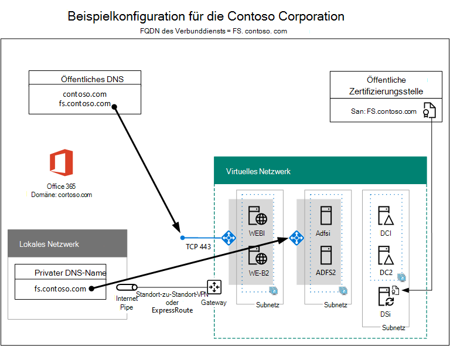

# Hochverfügbarkeit der Verbundauthentifizierung Phase 5: Konfigurieren der Verbundauthentifizierung für Microsoft 365High availability federated authentication Phase 5: Configure federated authentication for Microsoft 365

In dieser letzten Phase der Bereitstellung der Verbundauthentifizierung mit hoher Verfügbarkeit für Microsoft 365 in Azure-Infrastrukturdiensten erhalten und installieren Sie ein von einer öffentlichen Zertifizierungsstelle ausgestelltes Zertifikat, überprüfen Ihre Konfiguration und installieren und führen Dann Azure AD Verbinden auf dem Verzeichnissynchronisierungsserver aus.In this final phase of deploying high availability federated authentication for Microsoft 365 in Azure infrastructure services, you get and install a certificate issued by a public certification authority, verify your configuration, and then install and run Azure AD Connect on the directory synchronization server. Azure AD Verbinden konfiguriert Ihr Microsoft 365-Abonnement und Ihre Active Directory Federation Services (AD FS) und Webanwendungsproxyserver für die Verbundauthentifizierung.Azure AD Connect configures your Microsoft 365 subscription and your Active Directory Federation Services (AD FS) and web application proxy servers for federated authentication.
  
Alle Phasen finden Sie unter Deploy [high availability federated authentication for Microsoft 365 in Azure.](deploy-high-availability-federated-authentication-for-microsoft-365-in-azure.md)See [Deploy high availability federated authentication for Microsoft 365 in Azure](deploy-high-availability-federated-authentication-for-microsoft-365-in-azure.md) for all of the phases.
  
## Ein öffentliches Zertifikat erhalten und auf den Verzeichnissynchronisierungsserver kopierenGet a public certificate and copy it to the directory synchronization server

Rufen Sie ein digitales Zertifikat von einer öffentlichen Zertifizierungsstelle mit den folgenden Eigenschaften ab:Get a digital certificate from a public certification authority with the following properties:
  
- Ein X.509-Zertifikat, das zum Erstellen von SSL-Verbindungen geeignet ist.An X.509 certificate suitable for creating SSL connections.
    
- Die erweiterte Eigenschaft „Alternativer Antragstellername (SAN)“ ist auf den FQDN des Verbunddiensts festgelegt (z. B. „fs.contoso.com“)The Subject Alternative Name (SAN) extended property is set to your federation service FQDN (example: fs.contoso.com).
    
- Das Zertifikat muss über den privaten Schlüssel verfügen und im PFX-Format gespeichert sein.The certificate must have the private key and be stored in PFX format.
    
Außerdem müssen die Computer und Geräte Ihrer Organisation der öffentlichen Zertifizierungsstelle vertrauen, die das digitale Zertifikat ausstellt. Diese Vertrauensstellung wird eingerichtet, indem ein Stammzertifikat von der öffentlichen Zertifizierungsstelle im Speicher der vertrauenswürdigen Stammzertifizierungsstellen auf Ihren Computern und Geräten installiert wird. Computer, auf denen Microsoft Windows ausgeführt wird, verfügen in der Regel über eine Reihe dieser Zertifikattypen, die von häufig verwendeten Zertifizierungsstellen verwendet werden. Wenn das Stammzertifikat von der öffentlichen Zertifizierungsstelle noch nicht installiert ist, müssen Sie dieses auf den Computern und Geräten Ihrer Organisation bereitstellen.Additionally, your organization computers and devices must trust the public certification authority that is issuing the digital certificate. This trust is established by having a root certificate from the public certification authority installed in the trusted root certification authorities store on your computers and devices. Computers running Microsoft Windows typically have a set of these types of certificates installed from commonly-used certification authorities. If the root certificate from your public certification authority is not already installed, you must deploy this to the computers and devices of your organization.
  
Weitere Informationen zu Zertifikatanforderungen für die Verbundauthentifizierung finden Sie unter [Voraussetzungen für die Verbundinstallation und -konfiguration](/azure/active-directory/connect/active-directory-aadconnect-prerequisites#prerequisites-for-federation-installation-and-configuration).For more information about certificate requirements for federated authentication, see [Prerequisites for federation installation and configuration](/azure/active-directory/connect/active-directory-aadconnect-prerequisites#prerequisites-for-federation-installation-and-configuration).
  
Wenn Sie das Zertifikat erhalten, kopieren Sie es in einen Ordner auf dem Laufwerk C: des Verzeichnissynchronisierungsservers.When you receive the certificate, copy it to a folder on the C: drive of the directory synchronization server. Nennen Sie beispielsweise die Datei SSL.pfx, und speichern Sie sie im Ordner C: \\ Certs auf dem Verzeichnissynchronisierungsserver.For example, name the file SSL.pfx and store it in the C:\\Certs folder on the directory synchronization server.
  
## Überprüfen Ihrer KonfigurationVerify your configuration

Sie sollten nun bereit sein, Azure AD-Verbinden und Verbundauthentifizierung für Microsoft 365.You should now be ready to configure Azure AD Connect and federated authentication for Microsoft 365. Um sicherzustellen, dass Sie bereit sind, finden Sie hier eine Checkliste:To ensure that you are, here is a checklist:
  
- Die öffentliche Domäne Ihrer Organisation wird Ihrem Abonnement Microsoft 365 hinzugefügt.Your organization's public domain is added to your Microsoft 365 subscription.
    
- Die benutzerkonten Microsoft 365 Ihrer Organisation sind für den öffentlichen Domänennamen Ihrer Organisation konfiguriert und können sich erfolgreich anmelden.Your organization's Microsoft 365 user accounts are configured to your organization's public domain name and can successfully sign in.
    
- Sie haben einen FQDN des Verbunddiensts basierend auf Ihrem öffentlichen Domänennamen ermittelt.You have determined a federation service FQDN based your public domain name.
    
- Ein öffentlicher DNS-A-Eintrag für den FQDN des Verbunddiensts zeigt auf die öffentliche IP-Adresse des Azure-Lastenausgleichs mit Internetzugriff für die Webanwendungsproxy-Server.A public DNS A record for your federation service FQDN points to the public IP address of the Internet-facing Azure load balancer for the web application proxy servers.
    
- Ein privater DNS-A-Eintrag für den FQDN Ihres Verbunddiensts zeigt auf die private IP-Adresse des internen Azure-Lastenausgleichs für die AD FS-Server.A private DNS A record for your federation service FQDN points to the private IP address of the internal Azure load balancer for the AD FS servers.
    
- Ein von einer öffentlichen Zertifizierungsstelle ausgestelltes digitales Zertifikat, das für SSL-Verbindungen mit dem san festgelegten FQDN ihres Verbunddiensts geeignet ist, ist eine AUF Ihrem Verzeichnissynchronisierungsserver gespeicherte PFX-Datei.A public certification authority-isssued digital certificate suitable for SSL connections with the SAN set to your federation service FQDN is a PFX file stored on your directory synchronization server.
    
- Das Stammzertifikat für die öffentliche Zertifizierungsstelle wird im Speicher der vertrauenswürdigen Stammzertifizierungsstellen auf Ihren Computern und Geräten installiert.The root certificate for the public certification authority is installed in the Trusted Root Certification Authorities store on your computers and devices.
    
Nachfolgend finden Sie ein Beispiel für die Contoso-Organisation:Here is an example for the Contoso organization:
  
**Eine Beispielkonfiguration für die Verbundauthentifizierung mit Hochverfügbarkeit in Azure****An example configuration for a high availability federated authentication infrastructure in Azure**

  
## Ausführen von Azure AD Connect zum Konfigurieren der VerbundauthentifizierungRun Azure AD Connect to configure federated authentication

Das Azure AD Verbinden-Tool konfiguriert die AD FS-Server, die Webanwendungsproxyserver und Microsoft 365 für die Verbundauthentifizierung mit den folgenden Schritten:The Azure AD Connect tool configures the AD FS servers, the web application proxy servers, and Microsoft 365 for federated authentication with these steps:
  
1. Erstellen Sie eine Remotedesktopverbindung mit Ihrem Verzeichnissynchronisierungsserver mit einem Domänenkonto mit lokalen Administratorrechten.Create a remote desktop connection to your directory synchronization server with a domain account that has local administrator privileges.
    
2. Öffnen Sie auf dem Desktop des Verzeichnissynchronisierungsservers Internet Explorer, und wechseln Sie zu [https://aka.ms/aadconnect](https://aka.ms/aadconnect) .From the desktop of the directory synchronization server, open Internet Explorer and go to [https://aka.ms/aadconnect](https://aka.ms/aadconnect).
    
3. Klicken Sie auf der Seite **Microsoft Azure Active Directory Connect** auf **Herunterladen** und dann auf **Ausführen**.On the **Microsoft Azure Active Directory Connect** page, click **Download**, and then click **Run**.
    
4. Klicken Sie auf der Seite **Willkommen bei Azure AD Connect** auf **Ich stimme zu** und dann auf **Weiter**.On the **Welcome to Azure AD Connect** page, click **I agree**, and then click **Continue.**
    
5. Klicken Sie auf der Seite **Express-Einstellungen** auf **Anpassen**.On the **Express Settings** page, click **Customize**.
    
6. Klicken Sie auf der Seite **Erforderliche Komponenten installieren** auf **Installieren**.On the **Install required components** page, click **Install**.
    
7. Klicken Sie auf der Seite **Benutzeranmeldung** auf **Verbund mit AD FS**, und klicken Sie dann auf **Weiter**.On the **User sign-in** page, click **Federation with AD FS**, and then click **Next**.
    
8. Geben Sie **auf Verbinden Azure AD** den Namen und das Kennwort eines globalen Administratorkontos für Ihr Microsoft 365 ein, und klicken Sie dann auf **Weiter**.On the **Connect to Azure AD** page, type the name and password of a global administrator account for your Microsoft 365 subscription, and then click **Next**.
    
9. Stellen Sie auf der Seite **Verbinden** Ihrer Verzeichnisse sicher, dass Ihre lokale Active Directory Domain Services (AD DS)-Gesamtstruktur in **Forest** ausgewählt ist, geben Sie den Namen und das Kennwort eines Domänenadministratorkontos ein, klicken Sie auf **Verzeichnis** hinzufügen, und klicken Sie dann auf **Weiter**.On the **Connect your directories** page, ensure that your on-premises Active Directory Domain Services (AD DS) forest is selected in **Forest**, type the name and password of a domain administrator account, click **Add Directory**, and then click **Next**.
    
10. Klicken Sie auf der Seite **Azure AD-Anmeldungskonfiguration** auf **Weiter**.On the **Azure AD sign-in configuration** page, click **Next**.
    
11. Klicken Sie auf der Seite **Filtern von Domänen und Organisationseinheiten** auf **Weiter**.On the **Domain and OU filtering** page, click **Next**.
    
12. Klicken Sie auf der Seite **Eindeutige Identifizierung der Benutzer** auf **Weiter**.On the **Uniquely identifying your users** page, click **Next**.
    
13. Klicken Sie auf der Seite **Benutzer und Geräte filtern** auf **Weiter**.On the **Filter users and devices** page, click **Next**.
    
14. Klicken Sie auf der Seite **Optionale Features** auf **Weiter**.On the **Optional features** page, click **Next**.
    
15. Klicken Sei auf der Seite **AD FS-Farm** auf **Neue AD FS-Farm konfigurieren**.On the **AD FS farm** page, click **Configure a new AD FS farm**.
    
16. Klicken Sie auf **Durchsuchen**, und geben Sie den Speicherort und Namen des SSL-Zertifikats von der öffentlichen Zertifizierungsstelle an.Click **Browse** and specify the location and name of the SSL certificate from the public certification authority.
    
17. Geben Sie nach Aufforderung das Kennwort des Zertifikats ein, und klicken Sie dann auf **OK**.When prompted, type the certificate password, and then click **OK**.
    
18. Überprüfen Sie, ob der **Betreffname** und der **Verbunddienstname** auf den FQDN des Verbunddiensts festgelegt sind, und klicken Sie dann auf **Weiter**.Verify that the **Subject Name** and **Federation Service Name** are set to your federation service FQDN, and then click **Next**.
    
19. Geben Sie auf der Seite **AD FS-Server** den Namen des ersten AD FS-Servers (Tabelle M - Element 4 - Spalte „Name des virtuellen Computers") ein, und klicken Sie dann auf **Hinzufügen**.On the **AD FS servers** page, type your first AD FS server's name (Table M - Item 4 - Virtual machine name column), and then click **Add**.
    
20. Geben Sie den Namen des zweiten AD FS-Servers ein (Tabelle M - Element 5 - Spalte „Name des virtuellen Computers"), klicken Sie auf **Hinzufügen**, und klicken Sie dann auf **Weiter**.Type your second AD FS server's name (Table M - Item 5 - Virtual machine name column), click **Add**, and then click **Next**.
    
21. Geben Sie auf der Seite **Webanwendungsproxy-Server** den Namen des ersten Webanwendungsproxy-Servers (Tabelle M - Element 6 - Spalte „Name des virtuellen Computers") ein, und klicken Sie dann auf **Hinzufügen**.On the **Web Application Proxy servers** page, type your first web application proxy server's name (Table M - Item 6 - Virtual machine name column), and then click **Add**.
    
22. Geben Sie den Namen des zweiten Webanwendungsproxy-Servers ein (Tabelle M - Element 7 - Spalte „Name des virtuellen Computers"), klicken Sie auf **Hinzufügen**, und klicken Sie dann auf **Weiter**.Type your second web application proxy server's name (Table M - Item 7 - Virtual machine name column), click **Add**, and then click **Next**.
    
23. Geben Sie auf der Seite **Anmeldeinformationen des Domänenadministrators** den Benutzernamen und das Kennwort für eines Domänenadministratorkontos ein, und klicken Sie dann auf **Weiter**.On the **Domain Administrator credentials** page, type the user name and password of a domain administrator account, and then click **Next**.
    
24. Geben Sie auf der Seite **AD FS-Dienstkonto** den Benutzernamen und das Kennwort für eines Unternehmensadministratorkonto ein, und klicken Sie dann auf **Weiter**.On the **AD FS service account** page, type the user name and password of an enterprise administrator account, and then click **Next**.
    
25. Wählen Sie auf der Seite **Azure AD-Domäne** unter **Domäne** den DNS-Domänennamen Ihrer Organisation aus, und klicken Sie dann auf **Weiter**.On the **Azure AD Domain** page, in **Domain**, select your organization's DNS domain name, and then click **Next**.
    
26. Klicken Sie auf der Seite **Bereit zur Konfiguration** auf **Installieren**.On the **Ready to configure** page, click **Install**.
    
27. Klicken Sie auf der Seite **Installation ist abgeschlossen** auf **Überprüfen**. Nun sollten zwei Meldungen angezeigt werden, aus denen hervorgeht, dass sowohl die Intranet- als auch die Internetkonfiguration erfolgreich überprüft wurde.On the **Installation complete** page, click **Verify**. You should see two messages indicating that both the intranet and Internet configuration was successfully verified.
    
  - In der Intranetnachricht sollte die private IP-Adresse des internen Azure-Lastenausgleichs für Ihre AD FS-Server aufgeführt werden.The intranet message should list the private IP address of your Azure internal load balancer for your AD FS servers.
    
  - In der Internetnachricht sollte die öffentliche IP-Adresse des Azure-Lastenausgleichs mit Internetzugriff für Ihre Webanwendungsproxy-Server aufgeführt sein.The Internet message should list the public IP address of your Azure Internet-facing load balancer for your web application proxy servers.
    
28. Klicken Sie auf der Seite **Installation ist abgeschlossen** auf **Beenden**.On the **Installation complete** page, click **Exit**.
    
Nachfolgend sehen Sie die finale Konfiguration mit Platzhalternamen für die Server.Here is the final configuration, with placeholder names for the servers.
  
**Phase 5: Die finale Konfiguration für die Verbundauthentifizierungsinfrastruktur mit hoher Verfügbarkeit in Azure****Phase 5: The final configuration of a high availability federated authentication infrastructure in Azure**

  
Ihre Hochverfügbarkeits-Verbundauthentifizierungsinfrastruktur für Microsoft 365 in Azure ist abgeschlossen.Your high availability federated authentication infrastructure for Microsoft 365 in Azure is complete.
  
## Siehe auchSee Also

[Bereitstellen der Verbundauthentifizierung mit Hochverfügbarkeit für Microsoft 365 in AzureDeploy high availability federated authentication for Microsoft 365 in Azure](deploy-high-availability-federated-authentication-for-microsoft-365-in-azure.md)
  
[Verbundidentität für Ihre Microsoft 365/TestumgebungFederated identity for your Microsoft 365 dev/test environment](federated-identity-for-your-microsoft-365-dev-test-environment.md)
  
[Microsoft 365-Lösungs- und ArchitekturcenterMicrosoft 365 solution and architecture center](../solutions/index.yml)

[Verbundidentität für Microsoft 365Federated identity for Microsoft 365](https://support.office.com/article/Understanding-Office-365-identity-and-Azure-Active-Directory-06a189e7-5ec6-4af2-94bf-a22ea225a7a9#bk_federated)