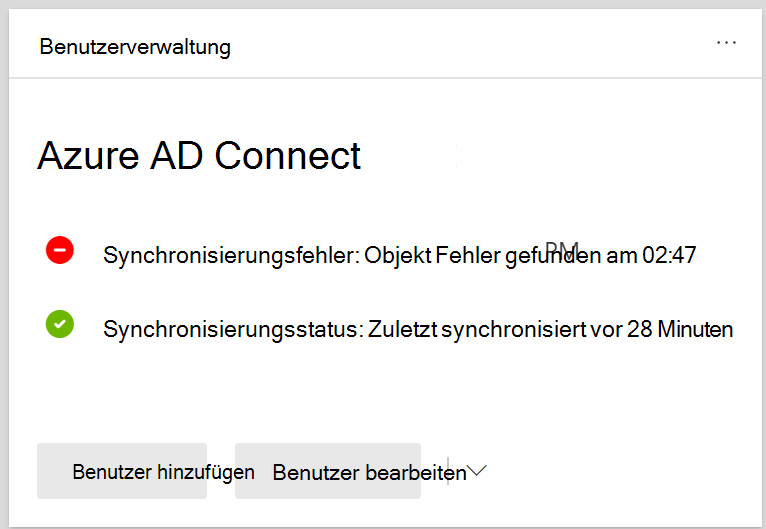

# Anzeigen von Verzeichnissynchronisierungsfehlern in Microsoft 365

Sie können Verzeichnissynchronisierungsfehler im Microsoft 365 Admin Center anzeigen. Es werden nur die Fehler des User-Objekts angezeigt. Informationen zum Anzeigen von Fehlern mit PowerShell finden Sie unter [Identifizieren von Objekten mit DirSyncProvisioningErrors](/azure/active-directory/hybrid/how-to-connect-syncservice-duplicate-attribute-resiliency).

## Anzeigen von Verzeichnissynchronisierungsfehlern im Microsoft 365 Admin Center

So zeigen Sie Fehler im Microsoft 365 Admin Center an:
  
1. Melden Sie sich beim [Microsoft 365 Admin Center](https://admin.microsoft.com) mit einem globalen Administratorkonto an. 
    
2. Auf der **Startseite** wird die **Benutzerverwaltungskarte** angezeigt. 
    
    
  
3. Wählen Sie auf der Karte **Synchronisierungsfehler** unter **Azure AD Connect aus,** um die Fehler auf der Seite **Verzeichnissynchronisierungsfehler zu** sehen.   
    
    

4. Wählen Sie einen der Fehler aus, um den Detailbereich mit Informationen zum Fehler und Tipps zur Behebung anzuzeigen.

   
  
Informationen zum Beheben identifizierter Probleme finden Sie unter Beheben von Problemen mit der [Verzeichnissynchronisierung für Microsoft 365.](fix-problems-with-directory-synchronization.md)