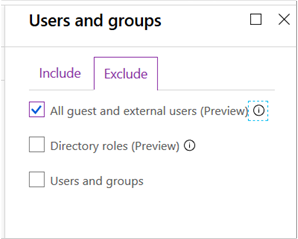

# Richtlinien für das Zulassen von Gast-und externen B2B-ZugriffPolicies for allowing guest and external B2B access
In diesem Artikel wird beschrieben, wie Sie die empfohlenen allgemeinen Richtlinien für Identitäts-und Geräte Zugriff anpassen können, um B2B-Konto Zugriff zu ermöglichen (Gast und externe Benutzer).This article describes how to adjust the recommended common identity and device access policies to allow B2B account access (guest and external users). Dieser Leitfaden basiert auf den [allgemeinen Richtlinien für Identitäts-und Geräte Zugriff](identity-access-policies.md).This guidance builds on the [Common identity and device access policies](identity-access-policies.md).

Diese Empfehlungen sind darauf ausgelegt, auf die **grundlegende** Schutzebene anzuwenden.These recommendations are designed to apply to the **baseline** tier of protection. Sie können die Empfehlungen jedoch auf der Grundlage der Granularität Ihrer Anforderungen für einen **vertraulichen** und **streng reglementierten** Schutz anpassen.However, you can adjust the recommendations based on the granularity of your needs for **sensitive** and **highly regulated** protection. 

Durch die Bereitstellungeines Pfads für B2B-Benutzer zur Authentifizierung bei Ihrem Azure AD Mandanten erhalten diese Benutzer keinen Zugriff auf Ihre gesamte Umgebung.Providing a path for B2B users to authenticate with your Azure AD tenant doesn't give these users access to your entire environment. B2B-Benutzer haben nur Zugriff auf Ressourcen, die für Sie (beispielsweise Dateien) innerhalb der in den Richtlinien für bedingten Zugriff gewährten Dienste freigegeben werden.B2B users only have access to resources that are shared with them (such as files) within the services granted in the conditional access policies.

## Aktualisieren der allgemeinen Richtlinien zum zulassen und schützen von Gast und externem ZugriffUpdating the common policies to allow and protect guest and external access 

Das folgende Diagramm veranschaulicht die allgemeinen Richtlinien für Identitäts-und Geräte Zugriff und gibt (mit einem Bleistiftsymbol) an, welche Richtlinien zum Schutz von Gast und externem Zugriff hinzugefügt oder aktualisiert werden sollen.The following diagram illustrates the common identity and device access policies and indicates (with a pencil icon) which policies to add or update to protect guest and external access. 

In der folgenden Tabelle sind die Richtlinien aufgeführt, die Sie entweder aktualisieren oder neu erstellen müssen.The following table lists the policies you either need to update or create new. Die allgemeinen Richtlinien verweisen auf die zugehörigen Konfigurationsanweisungen im Artikel [Allgemeine Richtlinien für Identitäts-und Geräte Zugriff](identity-access-policies.md) .The common policies link to the associated configuration instructions in the [Common identity and device access policies](identity-access-policies.md) article.

|SchutzebeneProtection level|RichtlinienPolicies|Weitere InformationenMore information|
|:---------------|:-------|:----------------|
|**Basisplan****Baseline**|[MFA immer für Gast und externe Benutzer erforderlichRequire MFA always for guest and external users](identity-access-policies.md#require-mfa-based-on-sign-in-risk)|Erstellen Sie diese neue Regel, und wenden Sie Sie nur auf Gäste und externe Benutzer an.Create this new rule and apply it only to guests and external users. Lassen Sie unter Anmelde Risiko alle Optionen deaktiviert, damit MFA immer erzwungen wird.Under sign-in risk, leave all options unchecked to always enforce MFA.|
|        |[MFA erforderlich, wenn das Anmelde Risiko *Mittel* groß oder *hoch* istRequire MFA when sign-in risk is *medium* or *high*](identity-access-policies.md#require-mfa-based-on-sign-in-risk)|Ändern Sie diese Regel, um Gast-und externe Benutzer auszuschließen.Modify this rule to exclude guest and external users.|
|        |[Kompatible PCs erforderlichRequire compliant PCs](identity-access-policies.md#require-compliant-pcs-but-not-compliant-phones-and-tablets)|Ändern Sie diese Regel, um Gast-und externe Benutzer auszuschließen.Modify this rule to exclude guest and external users.|

Zum einschließen oder Ausschließen von Gästen und externen Benutzern in Regeln für bedingten Zugriff klicken Sie auf die Registerkarte einschließen oder ausschließen, und aktivieren Sie **alle Gäste und externe Benutzer**.To include or exclude guests and external users in conditional access rules, click the include or exclude tab and check **All guests and external users**.

## Weitere InformationenMore information

### Gäste vs. externe BenutzerGuests vs. external users
In Azure AD sind Gast-und externe Benutzer identisch.In Azure AD, guest and external users are the same. Der Benutzertyp für diese beiden Typen ist Gast.The user type for both of these is Guest. Gastbenutzer sind B2B-Benutzer.Guest users are B2B users.

Microsoft Teams unterscheidet zwischen Gastbenutzern und externen Benutzern innerhalb der APP, aber dies sind beide B2B-Benutzer bei der Authentifizierung.Microsoft Teams differentiates between guest users and external users within the app, but these are both B2B users when authenticating. Weitere Informationen zu Microsoft Teams-Gast-und externen Benutzern finden Sie unter [Aktivieren von Gast-und externem Zugriff für Teams](teams-access-policies.md#enabling-guest-and-external-access-for-teams).For more information about Teams guest and external users, see [Enabling guest and external access for Teams](teams-access-policies.md#enabling-guest-and-external-access-for-teams).

### MFA immer für Gast und externe Benutzer erforderlichRequire MFA always for guest and external users
Diese Regel fordert Gäste auf, sich für MFA in Ihrem Mandanten zu registrieren, unabhängig davon, ob Sie für MFA in Ihrem Wohnsitz Mandanten registriert sind.This rule prompts guests to register for MFA in your tenant, regardless of whether they're registered for MFA in their home tenant. Beim Zugriff auf Ressourcen in Ihrem Mandanten müssen Gäste und externe Benutzer MFA für jede Anforderung verwenden.When accessing resources in your tenant, guests and external users are required to use MFA for every request. 

### Ausschließen von Gast-und externen Benutzern aus risikobasierter MFAExcluding guest and external users from risk-based MFA
Während Organisationen risikobasierte Richtlinien für B2B-Benutzer mithilfe des Identitätsschutzes erzwingen können, gibt es Einschränkungen bei der Implementierung des Identitätsschutzes für Benutzer der B2B-Zusammenarbeit in einem Ressourcenverzeichnis aufgrund ihrer vorhandenen Identität in ihrer Heimat. Directory.While organizations can enforce risk-based policies for B2B users using Identity Protection, there are limitations in the implementation of Identity Protection for B2B collaboration users in a resource directory due to their identity existing in their home directory. Aufgrund dieser Einschränkungen empfiehlt Microsoft, Gastbenutzer von risikobasierten MFA-Richtlinien auszuschließen, und diese Benutzer müssen immer MFA verwenden.Due to these limitations, Microsoft recommends you exclude guest users from risk-based MFA policies and require these users to always use MFA. 

Weitere Informationen finden Sie unter [Einschränkungen des Identitätsschutzes für Benutzer in der B2B-Zusammenarbeit](https://docs.microsoft.com/azure/active-directory/identity-protection/concept-identity-protection-b2b#limitations-of-identity-protection-for-b2b-collaboration-users).For more information, see [Limitations of Identity Protection for B2B collaboration users](https://docs.microsoft.com/azure/active-directory/identity-protection/concept-identity-protection-b2b#limitations-of-identity-protection-for-b2b-collaboration-users). 

### Ausschließen von Gast-und externen Benutzern aus der GeräteverwaltungExcluding guest and external users from device management 
Nur eine Organisation kann ein Gerät verwalten.Only one organization can manage a device. Wenn Sie Gast-und externe Benutzer nicht von Richtlinien ausschließen, die die Gerätekompatibilität erfordern, werden diese Benutzer durch diese Richtlinien blockiert.If you don't exclude guest and external users from policies that require device compliance, these policies will block these users. 

## Nächste SchritteNext steps

[Erfahren Sie, wie Sie Teams bedingten Zugriff aktivierenLearn how to enable Teams conditional access](teams-access-policies.md)

