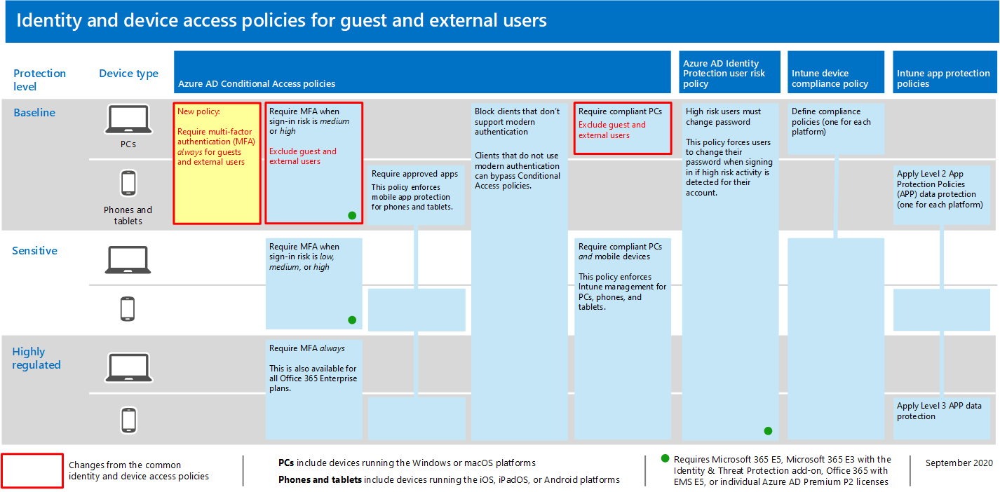

# Richtlinien für das Zulassen von Gast-und externen B2B-Zugriff

In diesem Artikel wird beschrieben, wie Sie die empfohlenen allgemeinen Richtlinien für Identitäts-und Geräte Zugriff anpassen können, um den Zugriff auf B2B-Konten (Business-to-Business) zu ermöglichen (Gast-und externe Benutzer). Dieser Leitfaden basiert auf den [allgemeinen Richtlinien für Identitäts-und Geräte Zugriff](identity-access-policies.md).

Diese Empfehlungen sind darauf ausgelegt, auf die **grundlegende** Schutzebene anzuwenden. Sie können jedoch auch die Empfehlungen basierend auf der Granularität Ihrer Anforderungen für **sensiblen** und **streng reglementierten** Schutz anpassen. 

Durch die Bereitstellungeines Pfads für B2B-Benutzer zur Authentifizierung bei Ihrem Azure-Active Directory (Azure AD)-Mandanten erhalten diese Benutzer keinen Zugriff auf Ihre gesamte Umgebung. B2B-Benutzer haben nur Zugriff auf Ressourcen, die für Sie (beispielsweise Dateien) innerhalb der in den Richtlinien für bedingten Zugriff gewährten Dienste freigegeben werden.

## Aktualisieren der allgemeinen Richtlinien zum zulassen und schützen von Gast und externem Zugriff 

Zum Schutz von Gast und externem Zugriff zeigt das folgende Diagramm, welche Richtlinien hinzugefügt oder aus den allgemeinen Richtlinien für Identitäts-und Geräte Zugriff aktualisiert werden sollen. 

[Anzeigen einer größeren Version dieses Bilds](https://github.com/MicrosoftDocs/microsoft-365-docs/raw/public/microsoft-365/media/microsoft-365-policies-configurations/identity-access-ruleset-guest.png)

In der folgenden Tabelle sind die Richtlinien aufgeführt, die Sie entweder aktualisieren oder neu erstellen müssen. Die allgemeinen Richtlinien verweisen auf die zugehörigen Konfigurationsanweisungen im Artikel [Allgemeine Richtlinien für Identitäts-und Geräte Zugriff](identity-access-policies.md) .

|Schutzebene|Richtlinien|Weitere Informationen|
|:---------------|:-------|:----------------|
|**Basisplan**|[MFA immer für Gast und externe Benutzer erforderlich](identity-access-policies.md#require-mfa-based-on-sign-in-risk)|Erstellen Sie diese neue Richtlinie, und wenden Sie Sie nur auf Gäste und externe Benutzer an. Lassen Sie unter **Anmelde Risiko**alle Optionen deaktiviert, damit die mehrstufige Authentifizierung (MFA) immer erzwungen wird.|
|        |[MFA erforderlich, wenn das Anmelde Risiko *Mittel* groß oder *hoch* ist](identity-access-policies.md#require-mfa-based-on-sign-in-risk)|Ändern Sie diese Richtlinie, um Gast-und externe Benutzer auszuschließen.|
|        |[Kompatible PCs erforderlich](identity-access-policies.md#require-compliant-pcs-but-not-compliant-phones-and-tablets)|Ändern Sie diese Richtlinie, um Gast-und externe Benutzer auszuschließen.|

Wenn Sie Gäste und externe Benutzer in Richtlinien für bedingten Zugriff einschließen oder ausschließen möchten, klicken Sie auf die Registerkarte **einschließen** oder **ausschließen** , und aktivieren Sie **alle Gäste und externe Benutzer**.

## Weitere Informationen

### Gäste vs. externe Benutzer
In Azure AD sind Gast-und externe Benutzer identisch. Der Benutzertyp für diese beiden Typen ist Gast. Gastbenutzer sind B2B-Benutzer.

Microsoft Teams unterscheidet zwischen Gastbenutzern und externen Benutzern in der app. Gastbenutzer haben Azure AD B2B-Konten und können Teams hinzugefügt werden. Externe Benutzer können nur an anrufen, Chats und Besprechungen teilnehmen. Weitere Informationen finden Sie in [diesem Vergleich zwischen Gast und externen Benutzern für Teams](https://docs.microsoft.com/microsoftteams/communicate-with-users-from-other-organizations#compare-external-and-guest-access).

Weitere Informationen zum Sichern von Identitäts-und Geräte Zugriff für Microsoft Teams finden Sie unter [Richtlinien Empfehlungen für das Sichern von teamchats, Gruppen und Dateien](teams-access-policies.md) .

### MFA immer für Gast und externe Benutzer erforderlich
Diese Richtlinie fordert Gäste auf, sich für MFA in Ihrem Mandanten zu registrieren, unabhängig davon, ob Sie für MFA in Ihrem Wohnsitz Mandanten registriert sind. Beim Zugriff auf Ressourcen in Ihrem Mandanten müssen Gäste und externe Benutzer MFA für jede Anforderung verwenden. 

### Ausschließen von Gast-und externen Benutzern aus risikobasierter MFA
Während Organisationen risikobasierte Richtlinien für B2B-Benutzer mithilfe Azure AD Identitätsschutzes erzwingen können, gibt es Einschränkungen bei der Implementierung von Azure AD Identity Protection für Benutzer der B2B-Zusammenarbeit in einem Ressourcenverzeichnis, da ihre Identität in Ihrem Basisverzeichnis vorhanden ist. Aufgrund dieser Einschränkungen empfiehlt Microsoft, Gastbenutzer von risikobasierten MFA-Richtlinien auszuschließen, und diese Benutzer müssen immer MFA verwenden. 

Weitere Informationen finden Sie unter [Einschränkungen des Identitätsschutzes für Benutzer in der B2B-Zusammenarbeit](https://docs.microsoft.com/azure/active-directory/identity-protection/concept-identity-protection-b2b#limitations-of-identity-protection-for-b2b-collaboration-users). 

### Ausschließen von Gast-und externen Benutzern aus der Geräteverwaltung 
Nur eine Organisation kann ein Gerät verwalten. Wenn Sie Gast-und externe Benutzer nicht von Richtlinien ausschließen, die die Gerätekompatibilität erfordern, werden diese Benutzer durch diese Richtlinien blockiert. 

## Nächster Schritt

Konfigurieren von Richtlinien für bedingten Zugriff für:

- [Microsoft Teams](teams-access-policies.md)
- [Exchange Online](secure-email-recommended-policies.md)
- [SharePoint](secure-email-recommended-policies.md)

