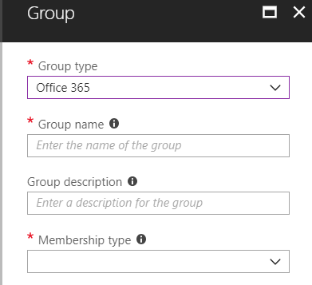

# Allgemeine Identitäts- und GerätezugriffsrichtlinienCommon identity and device access policies
In diesem Artikel werden die allgemeinen empfohlenen Richtlinien für die Sicherung des Zugriffs auf Cloud-Dienste beschrieben, einschließlich lokaler Anwendungen, die mit Azure AD-Anwendungs Proxy veröffentlicht werden.This article describes the common recommended policies for securing access to cloud services, including on-premises applications published with Azure AD Application Proxy. 

In diesem Leitfaden wird erläutert, wie die empfohlenen Richtlinien in einer neu bereitgestellten Umgebung bereitgestellt werden.This guidance discusses how to deploy the recommended policies in a newly-provisioned environment. Durch das Einrichten dieser Richtlinien in einer separaten Lab-Umgebung können Sie die empfohlenen Richtlinien vor dem Staging in ihren Vorprodukt-und Produktionsumgebungen verstehen und auswerten.Setting up these policies in a separate lab environment allows you to understand and evaluate the recommended policies before staging the rollout to your preproduction and production environments. Ihre neu bereitgestellte Umgebung ist möglicherweise nur in der Cloud oder Hybrid.Your newly provisioned environment may be cloud-only or hybrid.  

## RichtliniengruppePolicy set 

Das folgende Diagramm zeigt die empfohlenen Richtlinien.The following diagram illustrates the recommended set of policies. Es wird angezeigt, auf welcher Schutzebene jede Richtlinie angewendet wird und ob die Richtlinien auf PCs oder Telefone und Tablets oder auf beide Gerätekategorien zutreffen.It shows which tier of protections each policy applies to and whether the policies apply to PCs or phones and tablets, or both categories of devices. Außerdem wird angegeben, wo diese Richtlinien konfiguriert sind.It also indicates where these policies are configured.

[Siehe eine größere Version dieses Abbilds](https://github.com/MicrosoftDocs/microsoft-365-docs/raw/public/microsoft-365/media/Identity_device_access_policies_byplan.png)
[See a larger version of this image](https://github.com/MicrosoftDocs/microsoft-365-docs/raw/public/microsoft-365/media/Identity_device_access_policies_byplan.png)

Im Rest dieses Artikels wird beschrieben, wie Sie diese Richtlinien konfigurieren.The rest of this article describes how to configure these policies. 

Die Verwendung der mehrstufigen Authentifizierung wird empfohlen, bevor Geräte in InTune registriert werden, um sicher zu sein, dass das Gerät im Besitz des beabsichtigten Benutzers ist.Using multi-factor authentication is recommended before enrolling devices into Intune for assurance that the device is in the possession of the intended user. Sie müssen auch Geräte in InTune registrieren, bevor Sie Geräte Konformitätsrichtlinien erzwingen.You must also enroll devices into Intune before enforcing device compliance policies.

Um Ihnen Zeit zum Ausführen dieser Aufgaben zu geben, empfehlen wir, die Basisrichtlinien in der in dieser Tabelle aufgeführten Reihenfolge zu implementieren.To give you time to accomplish these tasks, we recommend implementing the baseline policies in the order listed in this table. Die MFA-Richtlinien für vertraulichen und streng reglementierten Schutz können jedoch jederzeit implementiert werden.However, the MFA policies for sensitive and highly regulated protection can be implemented at any time.

|SchutzebeneProtection level|RichtlinienPolicies|Weitere InformationenMore information|
|:---------------|:-------|:----------------|
|**Basisplan****Baseline**|[MFA erforderlich, wenn das Anmelde Risiko *Mittel* groß oder *hoch* istRequire MFA when sign-in risk is *medium* or *high*](#require-mfa-based-on-sign-in-risk)| |
|        |[Sperrt Clients, die moderne Authentifizierung nicht unterstützenBlock clients that don't support modern authentication](#block-clients-that-dont-support-modern-authentication)|Clients, die keine moderne Authentifizierung verwenden, können Regeln für bedingten Zugriff umgehen, daher ist es wichtig, diese zu blockieren.Clients that do not use modern authentication can bypass conditional access rules, so it's important to block these|
|        |[Benutzer mit hohem Risiko müssen das Kennwort ändernHigh risk users must change password](#high-risk-users-must-change-password)|Zwingt Benutzer, Ihr Kennwort zu ändern, wenn Sie sich anmelden, wenn risikoreiche Aktivitäten für Ihr Konto erkannt werdenForces users to change their password when signing in if high-risk activity is detected for their account|
|        |[Anwenden von App-DatenschutzrichtlinienApply APP data protection policies](#apply-app-data-protection-policies)|Eine Richtlinie pro Plattform (Ios, Android, Windows).One policy per platform (iOS, Android, Windows). InTune-App-Schutzrichtlinien (app) sind vordefinierte Schutzgruppen von Ebene 1 bis Ebene 3.Intune App Protection Policies (APP) are predefined sets of protection, from Level 1 to Level 3.|
|        |[Erfordern von genehmigten apps und App-SchutzRequire approved apps and APP protection](#require-approved-apps-and-app-protection)|Erzwingt Mobile App Schutz für Telefone und TabletsEnforces mobile app protection for phones and tablets|
|        |[Definieren von Geräte KonformitätsrichtlinienDefine device compliance policies](#define-device-compliance-policies)|Eine Richtlinie für jede PlattformOne policy for each platform|
|        |[Kompatible PCs erforderlichRequire compliant PCs](#require-compliant-pcs-but-not-compliant-phones-and-tablets)|Erzwingt die Intune-Verwaltung von PCs.Enforces Intune management of PCs|
|**Vertraulich****Sensitive**|[MFA erforderlich, wenn das Anmelde Risiko *niedrig*, *Mittel* oder *hoch* istRequire MFA when sign-in risk is *low*, *medium* or *high*](#require-mfa-based-on-sign-in-risk)| |
|         |[Erfordern von kompatiblen PCs *und* mobilen GerätenRequire compliant PCs *and* mobile devices](#require-compliant-pcs-and-mobile-devices)|Erzwingt die Intune-Verwaltung für PCs und Telefon/Tablets.Enforces Intune management for PCs and phone/tablets|
|**Streng geregelt****Highly regulated**|[*Immer* MFA erforderlich*Always* require MFA](#require-mfa-based-on-sign-in-risk)|
| | |

## Zuweisen von Richtlinien zu BenutzernAssigning policies to users
Identifizieren Sie vor dem Konfigurieren von Richtlinien die Azure Ad Gruppen, die Sie für jede Schutzebene verwenden.Before configuring policies, identify the Azure AD groups you are using for each tier of protection. Normalerweise gilt der Basisplan-Schutz für alle in der Organisation.Typically, baseline protection applies to everybody in the organization. Für einen Benutzer, der sowohl für den grundlegenden als auch für den vertraulichen Schutz enthalten ist, werden alle grundlegenden Richtlinien sowie die vertraulichen Richtlinien angewendet.A user who is included for both baseline and sensitive protection will have all the baseline policies applied plus the sensitive policies. Der Schutz ist kumulativ, und die restriktivste Richtlinie wird erzwungen.Protection is cumulative and the most restrictive policy is enforced. 

Eine empfohlene Vorgehensweise besteht darin, eine Azure Ad Gruppe für bedingten Zugriffs Ausschluss zu erstellen.A recommended practice is to create an Azure AD group for conditional access exclusion. Fügen Sie diese Gruppe zu allen bedingten Zugriffsregeln unter "ausschließen" hinzu.Add this group to all of your conditional access rules under "Exclude". Dadurch erhalten Sie eine Methode zum Bereitstellen des Zugriffs auf einen Benutzer, während Sie Zugriffsprobleme beheben.This gives you a method to provide access to a user while you troubleshoot access issues. Dies wird nur als temporäre Lösung empfohlen.This is recommended as a temporary solution only. Überwachen Sie diese Gruppe auf Änderungen, und stellen Sie sicher, dass die Ausschlussgruppe nur wie beabsichtigt verwendet wird.Monitor this group for changes and be sure the exclusion group is being used only as intended. 

Das folgende Diagramm enthält ein Beispiel für Benutzerzuweisungen und-Ausschlüsse.The following diagram provides an example of user assignment and exclusions.

In der Abbildung wird dem "Top Secret Project X-Team" eine Richtlinie für den bedingten Zugriff zugewiesen, für die *immer*MFA erforderlich ist.In the illustration the "Top secret project X team" is assigned a conditional access policy that requires MFA *always*. Achten Sie bei der Anwendung eines höheren Schutzniveaus auf Benutzer mit Bedacht.Be judicious when applying higher levels of protection to users. Mitglieder dieses Projektteams müssen bei jeder Anmeldung zwei Formen der Authentifizierung bereitstellen, auch wenn Sie nicht hochregulierte Inhalte anzeigen.Members of this project team will be required to provide two forms of authentication every time they log on, even if they are not viewing highly-regulated content.  

Alle Azure Ad Gruppen, die als Teil dieser Empfehlungen erstellt wurden, müssen als Microsoft 365-Gruppen erstellt werden.All Azure AD groups created as part of these recommendations must be created as Microsoft 365 groups. Dies ist insbesondere für die Bereitstellung von AIP (Azure Information Protection) beim Schützen von Dokumenten in SharePoint Online wichtig.This is specifically important for the deployment of Azure Information Protection (AIP) when securing documents in SharePoint Online.

## MFA basierend auf dem Anmelde Risiko erforderlichRequire MFA based on sign-in risk
Bevor Sie MFA benötigen, müssen Sie zunächst eine MFA-Registrierungsrichtlinie für den Identitätsschutz verwenden, um Benutzer für MFA zu registrieren.Before requiring MFA, first use an Identity Protection MFA registration policy to register users for MFA. Nachdem Benutzer registriert wurden, können Sie MFA für die Anmeldung erzwingen.After users are registered you can enforce MFA for sign-in. Die [erforderliche Arbeit](identity-access-prerequisites.md) umfasst das Registrieren aller Benutzer mit MFA.The [prerequisite work](identity-access-prerequisites.md) includes registering all users with MFA.

So erstellen Sie eine neue bedingte Zugriffsrichtlinie:To create a new conditional access policy: 

1. Navigieren Sie zum [Azure-Portal](https://portal.azure.com), und melden Sie sich mit Ihren Anmeldeinformationen an.Go to the [Azure portal](https://portal.azure.com), and sign in with your credentials. Nachdem Sie sich erfolgreich angemeldet haben, wird das Azure-Dashboard angezeigt.After you've successfully signed in, you see the Azure dashboard.

2. Wählen Sie im linken Menü **Azure Active Directory** aus.Choose **Azure Active Directory** from the left menu.

3. Klicken Sie im Bereich **Sicherheit** auf **Bedingter Zugriff**.Under the **Security** section, choose **Conditional access**.

4. Wählen Sie **Neue Richtlinie** aus.Choose **New policy**.

 In den folgenden Tabellen werden die Richtlinieneinstellungen für den bedingten Zugriff beschrieben, die für diese Richtlinie implementiert werden müssen.The following tables describes the conditional access policy settings to implement for this policy.

**Assignments****Assignments**

|TypType|EigenschaftenProperties|WerteValues|HinweiseNotes|
|:---|:---------|:-----|:----|
|Benutzer und GruppenUsers and groups|EinschließenInclude|Wählen Sie Benutzer und Gruppen aus: Wählen Sie eine spezifische Sicherheitsgruppe aus, die Zielbenutzer enthält.Select users and groups – Select specific security group containing targeted users|Beginnen Sie mit der Sicherheitsgruppe einschließlich PilotbenutzerStart with security group including pilot users|
||AusschließenExclude|Ausnahmesicherheitsgruppe, Dienstkonten (App-Identitäten)Exception security group; service accounts (app identities)|Mitgliedschaft auf der Grundlage der erforderlichen temporären Basis geändertMembership modified on an as-needed temporary basis|
|Cloud-AppsCloud apps|EinschließenInclude|Wählen Sie die Apps aus, auf die diese Regel angewendet werden soll.Select the apps you want this rule to apply to. Wählen Sie beispielsweise Exchange OnlineFor example, select Exchange Online||
|BedingungenConditions|KonfigurierteConfigured|JaYes|Konfigurieren Sie speziell für Ihre Umgebung und Anforderungen.Configure specific to your environment and needs|
|AnmelderisikoSign-in risk|RisikostufeRisk level||Lesen Sie den Leitfaden in der folgenden Tabelle.See the guidance in the following table|

**Anmelderisiko****Sign-in risk**

Wenden Sie die Einstellungen basierend auf der Schutzebene an, auf die Sie Zielen.Apply the settings based on the protection level you are targeting.

|EigenschaftProperty|SchutzniveauLevel of protection|WerteValues|HinweiseNotes|
|:---|:---------|:-----|:----|
|RisikostufeRisk level|BasisplanBaseline|Hoch, MmittelHigh, medium|Aktivieren Sie beideCheck both|
| |VertraulichSensitive|Hoch, Mittel, niedrigHigh, medium, low|Alle drei aktivierenCheck all three|
| |Streng geregeltHighly regulated| |Alle Optionen deaktiviert lassen, um MFA immer zu erzwingenLeave all options unchecked to always enforce MFA|

**Zugriffssteuerung****Access controls**

|TypType|EigenschaftenProperties|WerteValues|HinweiseNotes|
|:---|:---------|:-----|:----|
|GewährenGrant|Gewähren von ZugriffGrant access|WahrTrue|AusgewähltSelected|
||MFA erforderlichRequire MFA|TrueTrue|CheckCheck|
||Gerät muss als konform gekennzeichnet werdenRequire device to be marked as compliant|FalschFalse||
||Hybrides Azure AD verbundenes Gerät erforderlichRequire hybrid Azure AD-joined device|FalschFalse||
||Genehmigte Client-App erforderlichRequire approved client app|FalseFalse||
||Alle ausgewählten Steuerelemente erforderlichRequire all the selected controls|TrueTrue|AusgewähltSelected|

> [!NOTE]
> Stellen Sie sicher, dass Sie diese Richtlinie aktivieren, indem Sie **auf**auswählen.Be sure to enable this policy, by choosing **On**. In diesem Fall sollten Sie auch das [What-if](https://docs.microsoft.com/azure/active-directory/active-directory-conditional-access-whatif) -Tool zum Testen der Richtlinie verwenden.Also consider using the [What if](https://docs.microsoft.com/azure/active-directory/active-directory-conditional-access-whatif) tool to test the policy.

## Sperrt Clients, die moderne Authentifizierung nicht unterstützenBlock clients that don't support modern authentication
1. Navigieren Sie zum [Azure-Portal](https://portal.azure.com), und melden Sie sich mit Ihren Anmeldeinformationen an.Go to the [Azure portal](https://portal.azure.com), and sign in with your credentials. Nachdem Sie sich erfolgreich angemeldet haben, wird das Azure-Dashboard angezeigt.After you've successfully signed in, you see the Azure dashboard.

2. Wählen Sie im linken Menü **Azure Active Directory** aus.Choose **Azure Active Directory** from the left menu.

3. Klicken Sie im Bereich **Sicherheit** auf **Bedingter Zugriff**.Under the **Security** section, choose **Conditional access**.

4. Wählen Sie **Neue Richtlinie** aus.Choose **New policy**.

In den folgenden Tabellen werden die Richtlinieneinstellungen für den bedingten Zugriff beschrieben, die für diese Richtlinie implementiert werden müssen.The following tables describes the conditional access policy settings to implement for this policy.

**Assignments****Assignments**

|TypType|EigenschaftenProperties|WerteValues|HinweiseNotes|
|:---|:---------|:-----|:----|
|Benutzer und GruppenUsers and groups|IncludeInclude|Wählen Sie Benutzer und Gruppen aus: Wählen Sie eine spezifische Sicherheitsgruppe aus, die Zielbenutzer enthält.Select users and groups – Select specific security group containing targeted users|Beginnen Sie mit der Sicherheitsgruppe einschließlich PilotbenutzerStart with security group including pilot users|
||AusschließenExclude|Ausnahmesicherheitsgruppe, Dienstkonten (App-Identitäten)Exception security group; service accounts (app identities)|Mitgliedschaft, die auf vorübergehender, bedarfsmäßiger Basis geändert wirdMembership modified on an as needed temporary basis|
|Cloud-AppsCloud apps|IncludeInclude|Wählen Sie die Apps aus, auf die diese Regel angewendet werden soll.Select the apps you want this rule to apply to. Wählen Sie beispielsweise Exchange OnlineFor example, select Exchange Online||
|BedingungenConditions|KonfigurierteConfigured|JaYes|Konfigurieren von Client-appsConfigure Client apps|
|Client-AppsClient apps|KonfigurierteConfigured|JaYes|Mobile Apps und Desktop Clients, andere Clients (Wählen Sie beides aus)Mobile apps and desktop clients, Other clients (select both)|

**Zugriffssteuerung****Access controls**

|TypType|EigenschaftenProperties|WerteValues|HinweiseNotes|
|:---|:---------|:-----|:----|
|GewährenGrant|Zugriff blockierenBlock access|WahrTrue|AusgewähltSelected|
||MFA erforderlichRequire MFA|FalschFalse||
||Gerät muss als konform gekennzeichnet werdenRequire device to be marked as compliant|FalschFalse||
||Hybrides Azure AD verbundenes Gerät erforderlichRequire hybrid Azure AD-joined device|FalschFalse||
||Genehmigte Client-App erforderlichRequire approved client app|FalseFalse||
||Alle ausgewählten Steuerelemente erforderlichRequire all the selected controls|TrueTrue|AusgewähltSelected|

> [!NOTE]
> Stellen Sie sicher, dass Sie diese Richtlinie aktivieren, indem Sie **auf**auswählen.Be sure to enable this policy, by choosing **On**. In diesem Fall sollten Sie auch das [What-if](https://docs.microsoft.com/azure/active-directory/active-directory-conditional-access-whatif) -Tool zum Testen der Richtlinie verwenden.Also consider using the [What if](https://docs.microsoft.com/azure/active-directory/active-directory-conditional-access-whatif) tool to test the policy.

## Benutzer mit hohem Risiko müssen das Kennwort ändernHigh risk users must change password
Um sicherzustellen, dass alle gefährdeten Benutzerkonten mit hohem Risiko gezwungen werden, beim Anmelden eine Kennwortänderung durchzuführen, müssen Sie die folgende Richtlinie anwenden.To ensure that all high-risk users' compromised accounts are forced to perform a password change when signing-in, you must apply the following policy.

Melden Sie sich im [Microsoft Azure-Portal (https://portal.azure.com)](https://portal.azure.com/) mit Ihren Administratoranmeldeinformationen an, und wechseln Sie dann zu **Azure AD Identity Protection > Richtlinie zum Benutzerrisiko**.Log in to the [Microsoft Azure portal (https://portal.azure.com)](https://portal.azure.com/) with your administrator credentials, and then navigate to **Azure AD Identity Protection > User Risk Policy**.

**Assignments****Assignments**

|TypType|EigenschaftenProperties|WerteValues|HinweiseNotes|
|:---|:---------|:-----|:----|
|UsersUsers|EinschließenInclude|Alle BenutzerAll users|AusgewähltSelected|
||AusschließenExclude|KeineNone||
|BedingungenConditions|BenutzerrisikoUser risk|HochHigh|AusgewähltSelected|

**Steuerelemente****Controls**

| TypType | EigenschaftenProperties | WerteValues                  | HinweiseNotes |
|:-----|:-----------|:------------------------|:------|
|      | AccessAccess     | Zugriff zulassenAllow access            | WahrTrue  |
|      | ZugriffAccess     | Kennwortänderung erforderlichRequire password change | TrueTrue  |

**Überprüfung:** nicht zutreffend**Review:** not applicable

> [!NOTE]
> Stellen Sie sicher, dass Sie diese Richtlinie aktivieren, indem Sie **auf**auswählen.Be sure to enable this policy, by choosing **On**. Sie sollten auch das [What-if](https://docs.microsoft.com/azure/active-directory/active-directory-conditional-access-whatif) -Tool zum Testen der Richtlinie verwenden.Also consider using the [What if](https://docs.microsoft.com/azure/active-directory/active-directory-conditional-access-whatif) tool to test the policy

## Anwenden von App-DatenschutzrichtlinienApply APP data protection policies
App-Schutzrichtlinien (app) definieren, welche apps zulässig sind und welche Aktionen Sie mit den Daten Ihrer Organisation durchführen können.App Protection Policies (APP) define which apps are allowed and the actions they can take with your organization's data. Mit den in App verfügbaren Auswahlmöglichkeiten können Organisationen den Schutz ihren spezifischen Anforderungen anpassen.The choices available in APP enable organizations to tailor the protection to their specific needs. Für einige ist es möglicherweise nicht offensichtlich, welche Richtlinieneinstellungen erforderlich sind, um ein vollständiges Szenario zu implementieren.For some, it may not be obvious which policy settings are required to implement a complete scenario. Um Organisationen die Priorisierung mobiler Clientendpunkte zu erleichtern, hat Microsoft die Taxonomie für das App-Datenschutz Framework für IOS-und Android-Mobile App Verwaltung eingeführt.To help organizations prioritize mobile client endpoint hardening, Microsoft has introduced taxonomy for its APP data protection framework for iOS and Android mobile app management. 

Das App Data Protection-Framework ist in drei unterschiedliche Konfigurationsebenen unterteilt, wobei jede Ebene die vorherige Ebene abbaut:The APP data protection framework is organized into three distinct configuration levels, with each level building off the previous level: 

- **Enterprise Basic Data Protection** (Level 1) stellt sicher, dass apps mit einer PIN geschützt und verschlüsselt und selektive Löschvorgänge ausgeführt werden.**Enterprise basic data protection** (Level 1) ensures that apps are protected with a PIN and encrypted and performs selective wipe operations. Für Android-Geräte überprüft diese Stufe die Beglaubigung von Android-Geräten.For Android devices, this level validates Android device attestation. Hierbei handelt es sich um eine Einstiegskonfiguration, die eine ähnliche Datenschutz Steuerung in Exchange Online Postfachrichtlinien bereitstellt und die Benutzerpopulation in die APP einführt.This is an entry level configuration that provides similar data protection control in Exchange Online mailbox policies and introduces IT and the user population to APP. 
- **Unter Enterprise Enhanced Data Protection** (Level 2) werden Präventionsmechanismen für App-Daten Leckagen und Mindestanforderungen für BS eingeführt.**Enterprise enhanced data protection** (Level 2) introduces APP data leakage prevention mechanisms and minimum OS requirements. Dies ist die Konfiguration, die für die meisten mobilen Benutzer gilt, die auf Arbeits-oder Schuldaten zugreifen.This is the configuration that is applicable to most mobile users accessing work or school data. 
- **Unter Enterprise High Data Protection** (Stufe 3) werden erweiterte Datenschutzmechanismen, erweiterte Pin-Konfiguration und Verteidigung der mobilen App-Bedrohungen eingeführt.**Enterprise high data protection** (Level 3) introduces advanced data protection mechanisms, enhanced PIN configuration, and APP Mobile Threat Defense. Diese Konfiguration ist für Benutzer, die auf Daten mit hohem Risiko zugreifen, wünschenswert.This configuration is desirable for users that are accessing high risk data. 

Informationen zu den spezifischen Empfehlungen für jede Konfigurationsebene und zu den minimalen apps, die geschützt werden müssen, finden Sie unter [Data Protection Framework mithilfe von App-Schutzrichtlinien](https://docs.microsoft.com/mem/intune/apps/app-protection-framework).To see the specific recommendations for each configuration level and the minimum apps that must be protected, review [Data protection framework using app protection policies](https://docs.microsoft.com/mem/intune/apps/app-protection-framework). 

Anhand der in den Konfigurationen für den [Identitäts-und Geräte Zugriff](microsoft-365-policies-configurations.md)beschriebenen Prinzipien werden die grundlegenden und sensiblen Schutzebenen eng mit den Einstellungen der Stufe 2 Enterprise Enhanced Data Protection zugeordnet.Using the principles outlined in [Identity and device access configurations](microsoft-365-policies-configurations.md), the Baseline and Sensitive protection tiers map closely with the Level 2 enterprise enhanced data protection settings. Die hochregulierte Schutzebene ordnet sich eng mit den Einstellungen der Stufe 3 Enterprise High Data Protection an.The Highly regulated protection tier maps closely to the Level 3 enterprise high data protection settings.

|SchutzebeneProtection level |App-SchutzrichtlinieApp Protection Policy  |Weitere InformationenMore information  |
|---------|---------|---------|
|BasisplanBaseline     | [Stufe 2 erweiterter DatenschutzLevel 2 enhanced data protection](https://docs.microsoft.com/mem/intune/apps/app-protection-framework#level-2-enterprise-enhanced-data-protection)        | Die Richtlinieneinstellungen in Ebene 2 enthalten alle Richtlinieneinstellungen, die für Stufe 1 empfohlen werden, und die folgenden Richtlinieneinstellungen werden nur hinzugefügt oder aktualisiert, um weitere Steuerelemente und eine anspruchsvollere Konfiguration als Ebene 1 zu implementieren.The policy settings enforced in level 2 include all the policy settings recommended for level 1 and only adds to or updates the below policy settings to implement more controls and a more sophisticated configuration than level 1.         |
|VertraulichSensitive     | [Stufe 2 erweiterter DatenschutzLevel 2 enhanced data protection](https://docs.microsoft.com/mem/intune/apps/app-protection-framework#level-2-enterprise-enhanced-data-protection)        | Die Richtlinieneinstellungen in Ebene 2 enthalten alle Richtlinieneinstellungen, die für Stufe 1 empfohlen werden, und die folgenden Richtlinieneinstellungen werden nur hinzugefügt oder aktualisiert, um weitere Steuerelemente und eine anspruchsvollere Konfiguration als Ebene 1 zu implementieren.The policy settings enforced in level 2 include all the policy settings recommended for level 1 and only adds to or updates the below policy settings to implement more controls and a more sophisticated configuration than level 1.        |
|Stark reguliertHighly Regulated     | [Stufe 3 Enterprise High Data ProtectionLevel 3 enterprise high data protection](https://docs.microsoft.com/mem/intune/apps/app-protection-framework#level-3-enterprise-high-data-protection)        | Die Richtlinieneinstellungen in Stufe 3 umfassen alle Richtlinieneinstellungen, die für Stufe 1 und 2 empfohlen werden, und nur die unten aufgeführten Richtlinieneinstellungen hinzugefügt oder aktualisiert, um weitere Steuerelemente und eine anspruchsvollere Konfiguration als Ebene 2 zu implementieren.The policy settings enforced in level 3 include all the policy settings recommended for level 1 and 2 and only adds to or updates the below policy settings to implement more controls and a more sophisticated configuration than level 2.        |

Um eine neue APP-Schutzrichtlinie für jede Plattform (IOS und Android) in Microsoft Endpoint Manager mithilfe der Data Protection Framework-Einstellungen zu erstellen, können Administratoren Folgendes tun:To create a new app protection policy for each platform (iOS and Android) within Microsoft Endpoint Manager using the data protection framework settings, administrators can:
1. Erstellen Sie die Richtlinien manuell, indem Sie die Schritte unter [Vorgehensweise erstellen und Bereitstellen von App-Schutzrichtlinien mit Microsoft InTune](https://docs.microsoft.com/mem/intune/apps/app-protection-policies)ausführen.Manually create the policies by following the steps in [How to create and deploy app protection policies with Microsoft Intune](https://docs.microsoft.com/mem/intune/apps/app-protection-policies). 
2. Importieren Sie die JSON-Vorlagen für das Beispiel [InTune-App-Schutzrichtlinien-Konfigurations Framework](https://github.com/microsoft/Intune-Config-Frameworks/tree/master/AppProtectionPolicies) mit [InTune-PowerShell-Skripts](https://github.com/microsoftgraph/powershell-intune-samples).Import the sample [Intune App Protection Policy Configuration Framework JSON templates](https://github.com/microsoft/Intune-Config-Frameworks/tree/master/AppProtectionPolicies) with [Intune's PowerShell scripts](https://github.com/microsoftgraph/powershell-intune-samples).

## Erfordern von genehmigten apps und App-SchutzRequire approved apps and APP protection
Zum Erzwingen der APP-Schutzrichtlinien, die Sie in InTune angewendet haben, müssen Sie eine Regel für bedingten Zugriff erstellen, um genehmigte Client-apps und die in den App-Schutzrichtlinien festgelegten Bedingungen zu erfordern.To enforce the APP protection policies you applied in Intune, you must create a conditional access rule to require approved client apps and the conditions set in the APP protection policies. 

Das Erzwingen von App-Schutzrichtlinien erfordert eine Reihe von Richtlinien, die unter in [erfordern von App-Schutzrichtlinien für Cloud-App-Zugriff mit bedingtem Zugriff](https://docs.microsoft.com/azure/active-directory/conditional-access/app-protection-based-conditional-access)beschrieben werden.Enforcing APP protection policies requires a set of policies described in in [Require app protection policy for cloud app access with Conditional Access](https://docs.microsoft.com/azure/active-directory/conditional-access/app-protection-based-conditional-access). Diese Richtlinien sind jeweils in dieser empfohlenen Gruppe von Richtlinien für Identitäts-und Zugriffs Konfigurationen enthalten.These policies are each included in this recommended set of identity and access configuration policies.

Um die Regel für bedingten Zugriff zu erstellen, für die genehmigte apps und App-Schutz erforderlich sind, führen Sie "Schritt 1: Konfigurieren einer Azure AD Richtlinie für den bedingten Zugriff für Microsoft 365" in [Szenario 1: Microsoft 365-apps erfordern genehmigte apps mit App-Schutzrichtlinien](https://docs.microsoft.com/azure/active-directory/conditional-access/app-protection-based-conditional-access#scenario-1-office-365-apps-require-approved-apps-with-app-protection-policies), die Outlook für IOS und Android ermöglichen, aber verhindert, dass OAuth-fähige Exchange ActiveSync-Clients eine Verbindung Exchange Online mitTo create the conditional access rule that requires approved apps and APP protection, follow "Step 1: Configure an Azure AD Conditional Access policy for Microsoft 365" in [Scenario 1: Microsoft 365 apps require approved apps with app protection policies](https://docs.microsoft.com/azure/active-directory/conditional-access/app-protection-based-conditional-access#scenario-1-office-365-apps-require-approved-apps-with-app-protection-policies), which allows Outlook for iOS and Android, but blocks OAuth capable Exchange ActiveSync clients from connecting to Exchange Online.

   > [!NOTE]
   > Diese Richtlinie stellt sicher, dass Mobile Benutzer mithilfe der entsprechenden apps auf alle Office-Endpunkte zugreifen können.This policy ensures mobile users can access all Office endpoints using the applicable apps.

Wenn Sie mobilen Zugriff auf Exchange Online ermöglichen, implementieren Sie [Blockieren von ActiveSync-Clients](secure-email-recommended-policies.md#block-activesync-clients), wodurch verhindert wird, dass Exchange ActiveSync-Clients die Standardauthentifizierung für die Verbindung mit Exchange Online nutzen.If you are enabling mobile access to Exchange Online, implement [Block ActiveSync clients](secure-email-recommended-policies.md#block-activesync-clients), which prevents Exchange ActiveSync clients leveraging basic authentication from connecting to Exchange Online. Diese Richtlinie wird in der Abbildung oben in diesem Artikel nicht abgebildet.This policy is not pictured in the illustration at the top of this article. Sie wird in [Richtlinien Empfehlungen zum Sichern von e-Mails](secure-email-recommended-policies.md)beschrieben und abgebildet.It is described and pictured in [Policy recommendations for securing email](secure-email-recommended-policies.md).

 Diese Richtlinien nutzen die Grant-Steuerelemente [erfordern eine genehmigte Client-App](https://docs.microsoft.com/azure/active-directory/conditional-access/concept-conditional-access-grant#require-approved-client-app) und [erfordern eine APP-Schutzrichtlinie](https://docs.microsoft.com/azure/active-directory/conditional-access/concept-conditional-access-grant#require-app-protection-policy).These policies leverage the grant controls [Require approved client app](https://docs.microsoft.com/azure/active-directory/conditional-access/concept-conditional-access-grant#require-approved-client-app) and [Require app protection policy](https://docs.microsoft.com/azure/active-directory/conditional-access/concept-conditional-access-grant#require-app-protection-policy).

Schließlich wird durch das Blockieren der Legacy Authentifizierung für andere Client-apps auf IOS-und Android-Geräten sichergestellt, dass diese Clients keine bedingten Zugriffsregeln umgehen können.Finally, blocking legacy authentication for other client apps on iOS and Android devices ensures that these clients cannot bypass conditional access rules. Wenn Sie die Anleitungen in diesem Artikel befolgen, haben Sie bereits [Blockierte Clients konfiguriert, die die moderne Authentifizierung nicht unterstützen](#block-clients-that-dont-support-modern-authentication).If you're following the guidance in this article, you've already configured [Block clients that don't support modern authentication](#block-clients-that-dont-support-modern-authentication).

<!---
With Conditional Access, organizations can restrict access to approved (modern authentication capable) iOS and Android client apps with Intune app protection policies applied to them. Several conditional access policies are required, with each policy targeting all potential users. Details on creating these policies can be found in [Require app protection policy for cloud app access with Conditional Access](https://docs.microsoft.com/azure/active-directory/conditional-access/app-protection-based-conditional-access).

1. Follow "Step 1: Configure an Azure AD Conditional Access policy for Microsoft 365" in [Scenario 1: Microsoft 365 apps require approved apps with app protection policies](https://docs.microsoft.com/azure/active-directory/conditional-access/app-protection-based-conditional-access#scenario-1-office-365-apps-require-approved-apps-with-app-protection-policies), which allows Outlook for iOS and Android, but blocks OAuth capable Exchange ActiveSync clients from connecting to Exchange Online.

   > [!NOTE]
   > This policy ensures mobile users can access all Office endpoints using the applicable apps.

2. If enabling mobile access to Exchange Online, implement [Block ActiveSync clients](secure-email-recommended-policies.md#block-activesync-clients), which prevents Exchange ActiveSync clients leveraging basic authentication from connecting to Exchange Online.

   The above policies leverage the grant controls [Require approved client app](https://docs.microsoft.com/azure/active-directory/conditional-access/concept-conditional-access-grant#require-approved-client-app) and [Require app protection policy](https://docs.microsoft.com/azure/active-directory/conditional-access/concept-conditional-access-grant#require-app-protection-policy).

3. Disable legacy authentication for other client apps on iOS and Android devices. For more information, see [Block clients that don't support modern authentication](#block-clients-that-dont-support-modern-authentication).
-->

## Definieren von Geräte KompatibilitätsrichtlinienDefine device-compliance policies

Geräte Konformitätsrichtlinien definieren die Anforderungen, die Geräte erfüllen müssen, um als konform gekennzeichnet zu sein.Device-compliance policies define the requirements that devices must adhere to in order to be marked as compliant. Erstellen Sie in Microsoft Endpoint Manager Admin Center InTune-Geräte Konformitätsrichtlinien.Create Intune device compliance policies from within the Microsoft Endpoint Manager admin center.

Erstellen Sie eine Richtlinie für jede Plattform:Create a policy for each platform:
- Android-GeräteadministratorAndroid device administrator
- Android EnterpriseAndroid Enterprise
- IOS/iPadsiOS/iPadOS
- macOSmacOS
- Windows Phone 8.1Windows Phone 8.1
- Windows 8.1 und höherWindows 8.1 and later
- Windows 10 und höherWindows 10 and later

Um Geräte Konformitätsrichtlinien zu erstellen, melden Sie sich mit Ihren Administratoranmeldeinformationen beim [Microsoft Endpoint Manager Admin Center](https://go.microsoft.com/fwlink/?linkid=2109431) an, und navigieren Sie dann zu**Richt**Linien für**Konformitätsrichtlinien** > für **Geräte** > .To create device compliance policies, log in to the [Microsoft Endpoint Manager Admin Center](https://go.microsoft.com/fwlink/?linkid=2109431) with your administer credentials, and then navigate to **Devices** > **Compliance policies** > **Policies**. Wählen Sie **Richtlinie erstellen**aus.Select **Create Policy**.

Damit Geräte Konformitätsrichtlinien bereitgestellt werden, müssen Sie Benutzergruppen zugewiesen werden.For device compliance policies to be deployed, they must be assigned to user groups. Sie weisen eine Richtlinie zu, nachdem Sie Sie erstellt und gespeichert haben.You assign a policy after you create and save it. Wählen Sie im Admin Center die Richtlinie aus, und wählen Sie dann **Zuweisungen**aus.In the admin center, select the policy and then select **Assignments**. Nachdem Sie die Gruppen ausgewählt haben, für die Sie die Richtlinie erhalten möchten, wählen Sie **Speichern** aus, um diese Gruppenzuweisung zu speichern und die Richtlinie bereitzustellen.After selecting the groups that you want to receive the policy, select **Save** to save that group assignment and deploy the policy.

Eine Schritt-für-Schritt-Anleitung zum Erstellen von Konformitätsrichtlinien in InTune finden Sie unter [Create a Compliance Policy in Microsoft InTune](https://docs.microsoft.com/mem/intune/protect/create-compliance-policy) in der InTune-Dokumentation.For step-by-step guidance on creating compliance policies in Intune, see [Create a compliance policy in Microsoft Intune](https://docs.microsoft.com/mem/intune/protect/create-compliance-policy) in the Intune documentation.

Die folgenden Einstellungen werden für Windows 10 empfohlen.The following settings are recommended for Windows 10.

**Geräte Integrität: Evaluierungsregeln für den Windows-Integritäts Bestätigungs Dienst****Device health: Windows Health Attestation Service evaluation rules**

|EigenschaftenProperties|WerteValues|HinweiseNotes|
|:---------|:-----|:----|
|BitLocker erforderlichRequire BitLocker|ErforderlichRequire||
|Sicheres Booten muss auf dem Gerät aktiviert seinRequire Secure Boot to be enabled on the device|ErforderlichRequire||
|Codeintegrität erforderlichRequire code integrity|ErforderlichRequire||

**Geräteeigenschaften****Device properties**

|TypType|EigenschaftenProperties|WerteValues|HinweiseNotes|
|:---|:---------|:-----|:----|
|BetriebssystemversionOperating system version|AlleAll|Nicht konfiguriertNot configured||

**Systemsicherheit****System security**

|TypType|EigenschaftenProperties|WerteValues|HinweiseNotes|
|:---|:---------|:-----|:----|
|PasswordPassword|Anfordern eines Kennworts zum Entsperren mobiler GeräteRequire a password to unlock mobile devices|ErforderlichRequire||
||Einfache KennwörterSimple passwords|BlockBlock||
||Kennwort-TypPassword type|Geräte StandardDevice default||
||Minimale KennwortlängeMinimum password length|6 6||
||Maximale Anzahl von Minuten Inaktivität, bevor Kennwort erforderlich istMaximum minutes of inactivity before password is required|15 15|Diese Einstellung wird für die Android-Versionen 4,0 und höher oder für Knox 4,0 und höher unterstützt.This setting is supported for Android versions 4.0 and above or KNOX 4.0 and above. Für IOS-Geräte wird diese für IOS 8,0 und höher unterstützt.For iOS devices, it's supported for iOS 8.0 and above|
||Kennwortablauf (Tage)Password expiration (days)|4141||
||Anzahl der vorherigen Kennwörter zur Verhinderung der WiederverwendungNumber of previous passwords to prevent reuse|5 5||
||Kennwort anfordern, wenn das Gerät vom Leerlaufzustand zurückkehrt (Mobil und holographisch)Require password when device returns from idle state (Mobile and Holographic)|ErforderlichRequire|Verfügbar für Windows 10 und höherAvailable for Windows 10 and later|
|VerschlüsselungEncryption|Verschlüsselung der Datenspeicherung auf dem GerätEncryption of data storage on device|ErforderlichRequire||
|GerätesicherheitDevice Security|FirewallFirewall|ErforderlichRequire||
||AntivirusAntivirus|ErforderlichRequire||
||AntiSpywareAntispyware|ErforderlichRequire|Für diese Einstellung ist eine mit dem Windows Security Center registrierte Anti-Spyware-Lösung erforderlich.This setting requires an Anti-Spyware solution registered with Windows Security Center|
|DefenderDefender|Antischadsoftware für Microsoft DefenderMicrosoft Defender Antimalware|ErforderlichRequire||
||Mindestversion von Microsoft Defender AntischadsoftwareMicrosoft Defender Antimalware minimum version||Wird nur für Windows 10-Desktop unterstützt.Only supported for Windows 10 desktop. Microsoft empfiehlt Versionen von nicht mehr als fünf hinter der neuesten VersionMicrosoft recommends versions no more than five behind from the most recent version|
||Microsoft Defender-Antischadsoftware-Signatur auf dem neuesten StandMicrosoft Defender Antimalware signature up to date|ErforderlichRequire||
||EchtzeitschutzReal-time protection|ErforderlichRequire|Wird nur für Windows 10-Desktop unterstütztOnly supported for Windows 10 desktop|

**Microsoft Defender ATP****Microsoft Defender ATP**

|TypType|EigenschaftenProperties|WerteValues|HinweiseNotes|
|:---|:---------|:-----|:----|
|Microsoft Defender Advanced Threat Protection-RegelnMicrosoft Defender Advanced Threat Protection rules|Erfordern, dass das Gerät auf oder unter dem Computer-Risk-Score liegtRequire the device to be at or under the machine-risk score|MittelMedium||

## Erfordern Sie kompatible PCs (aber keine kompatiblen Telefone und Tablets)Require compliant PCs (but not compliant phones and tablets)
Bevor Sie eine Richtlinie hinzufügen, die kompatible PCs erfordert, müssen Sie die Geräte für die Verwaltung in InTune registrieren.Before adding a policy to require compliant PCs, be sure to enroll devices for management into Intune. Die Verwendung der mehrstufigen Authentifizierung wird empfohlen, bevor Geräte in InTune registriert werden, um sicher zu sein, dass das Gerät im Besitz des beabsichtigten Benutzers ist.Using multi-factor authentication is recommended before enrolling devices into Intune for assurance that the device is in the possession of the intended user. 

So benötigen Sie kompatible PCs:To require compliant PCs:

1. Navigieren Sie zum [Azure-Portal](https://portal.azure.com), und melden Sie sich mit Ihren Anmeldeinformationen an.Go to the [Azure portal](https://portal.azure.com), and sign in with your credentials. Nachdem Sie sich erfolgreich angemeldet haben, wird das Azure-Dashboard angezeigt.After you've successfully signed in, you see the Azure dashboard.

2. Wählen Sie im linken Menü **Azure Active Directory** aus.Choose **Azure Active Directory** from the left menu.

3. Klicken Sie im Bereich **Sicherheit** auf **Bedingter Zugriff**.Under the **Security** section, choose **Conditional access**.

4. Wählen Sie **Neue Richtlinie** aus.Choose **New policy**.

5. Geben Sie einen Richtliniennamen ein, und wählen Sie dann die **Benutzer und Gruppen** aus, auf die Sie die Richtlinie anwenden möchten.Enter a policy name, then choose the **Users and groups** you want to apply the policy for.

6. Klicken Sie auf **Cloud-Apps**.Choose **Cloud apps**.

7. Wählen **Sie apps auswählen**aus, und wählen Sie in der Liste **Cloud apps** die gewünschten Apps aus.Choose **Select apps**, select the desired apps from the **Cloud apps** list. Wählen Sie beispielsweise Exchange Online aus.For example, select Exchange Online. Wählen **Sie auswählen** und **Fertig**aus.Choose **Select** and **Done**.

8. Um kompatible PCs, aber keine kompatiblen Telefone und Tablets zu benötigen, wählen Sie **Bedingungen** und **Geräteplattformen**aus.To require compliant PCs, but not compliant phones and tablets, choose **Conditions** and **Device platforms**. Wählen **Sie Geräteplattformen auswählen** aus, und wählen Sie **Windows** und **macOS**aus.Choose **Select device platforms** and select **Windows** and **macOS**.

9. Wählen Sie im Abschnitt **Zugriffssteuerung** die Option **Erteilen** aus.Choose **Grant** from the **Access controls** section.

10. Wählen Sie **Zugriff gewähren**aus, und wählen Sie **Gerät müssen als konform gekennzeichnet sein**aus.Choose **Grant access**, select **Require device to be marked as compliant**. Wählen Sie für mehrere Steuerelemente **die Option alle ausgewählten Steuerelemente anfordern**aus, und wählen Sie dann **auswählen**aus.For multiple controls, select **Require all the selected controls**, then choose **Select**. 

11. Klicken Sie auf **Erstellen**.Choose **Create**.

Wenn Ihr Ziel darin besteht, kompatible PCs *und* Mobile Geräte zu benötigen, wählen Sie keine Plattformen aus.If your objective is to require compliant PCs *and* mobile devices, do not select platforms. Dadurch wird die Kompatibilität für alle Geräte erzwungen.This enforces compliance for all devices. 

## Erfordern von kompatiblen PCs *und* mobilen GerätenRequire compliant PCs *and* mobile devices

So erfordern Sie die Kompatibilität für alle Geräte:To require compliance for all devices:

1. Navigieren Sie zum [Azure-Portal](https://portal.azure.com), und melden Sie sich mit Ihren Anmeldeinformationen an.Go to the [Azure portal](https://portal.azure.com), and sign in with your credentials. Nachdem Sie sich erfolgreich angemeldet haben, wird das Azure-Dashboard angezeigt.After you've successfully signed in, you see the Azure dashboard.

2. Wählen Sie im linken Menü **Azure Active Directory** aus.Choose **Azure Active Directory** from the left menu.

3. Klicken Sie im Bereich **Sicherheit** auf **Bedingter Zugriff**.Under the **Security** section, choose **Conditional access**.

4. Wählen Sie **Neue Richtlinie** aus.Choose **New policy**.

5. Geben Sie einen Richtliniennamen ein, und wählen Sie dann die **Benutzer und Gruppen** aus, auf die Sie die Richtlinie anwenden möchten.Enter a policy name, then choose the **Users and groups** you want to apply the policy for.

6. Klicken Sie auf **Cloud-Apps**.Choose **Cloud apps**.

7. Wählen **Sie apps auswählen**aus, und wählen Sie in der Liste **Cloud apps** die gewünschten Apps aus.Choose **Select apps**, select the desired apps from the **Cloud apps** list. Wählen Sie beispielsweise Exchange Online aus.For example, select Exchange Online. Wählen **Sie auswählen** und **Fertig**aus.Choose **Select** and **Done**.

8. Wählen Sie im Abschnitt **Zugriffssteuerung** die Option **Erteilen** aus.Choose **Grant** from the **Access controls** section.

9. Wählen Sie **Zugriff gewähren**aus, und wählen Sie **Gerät müssen als konform gekennzeichnet sein**aus.Choose **Grant access**, select **Require device to be marked as compliant**. Wählen Sie für mehrere Steuerelemente **die Option alle ausgewählten Steuerelemente anfordern**aus, und wählen Sie dann **auswählen**aus.For multiple controls, select **Require all the selected controls**, then choose **Select**. 

10. Klicken Sie auf **Erstellen**.Choose **Create**.

Wählen Sie beim Erstellen dieser Richtlinie keine Plattformen aus.When creating this policy, do not select platforms. Dadurch werden konforme Geräte erzwungen.This enforces compliant devices.

## Nächste SchritteNext steps

[Weitere Informationen zu Richtlinienempfehlungen zum Schutz von E-MailsLearn about policy recommendations for securing email](secure-email-recommended-policies.md)
