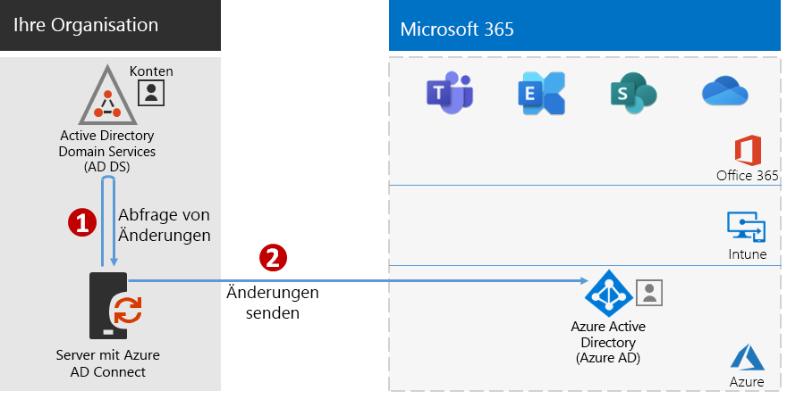
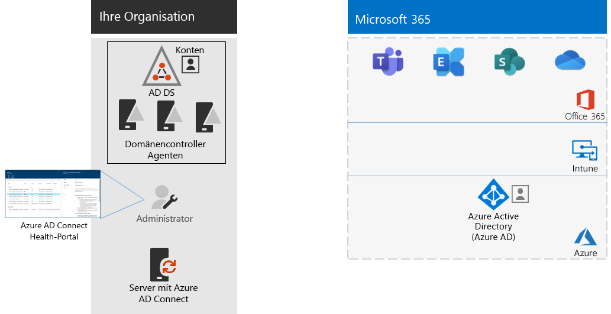

# Schritt 4: Hinzufügen von BenutzerkontenStep 4: Add your user accounts

## Erstellen von Benutzerkonten für reine CloudidentitätCreate your user accounts for cloud-only identity

Für reine Cloudidentität erstellen Sie Ihre Benutzer und Gruppen in Azure Active Directory (Azure AD).For cloud-only identity, create your users and groups in Azure Active Directory (Azure AD). Sie können Folgendes verwenden:You can use:

- Das Microsoft 365 Admin CenterThe Microsoft 365 admin center
- Das Azure-PortalThe Azure portal
- Azure PowerShellAzure PowerShell

## Synchronisieren von Identitäten für die HybrididentitätSynchronize identities for hybrid identity

*Dieser Schritt ist erforderlich für Hybridumgebungen und gilt für die Versionen E3 und E5 von Microsoft 365 Enterprise.**This is required for hybrid environments and applies to both the E3 and E5 versions of Microsoft 365 Enterprise*

In diesem Abschnitt synchronisieren Sie Ihre lokalen Active Directory Domain Services (AD DS) mit dem Azure AD-Mandanten, der von Ihren Office 365- Microsoft Intune- und anderen, in Microsoft 365 Enterprise-Abonnements enthaltenen cloudbasierten Diensten verwendet wird.In this section, you'll synchronize your on-premises Active Directory Domain Services (AD DS) with the Azure AD tenant used by Office 365, Microsoft Intune, and other cloud-based services included with Microsoft 365 Enterprise.

Azure AD Connect ist das unterstützte Microsoft-Tool, das Sie durch die Synchronisierung nur der Identitäten führt, die Sie aus AD DS -Umgebungen mit einer oder mehreren Gesamtstrukturen wirklich für Ihren Azure AD-Mandanten benötigen.Azure AD Connect is the supported Microsoft tool that guides you through synchronizing only the identities you really need from single or multi-forest AD DS environments to your Azure AD tenant. In der folgenden Abbildung ist der grundlegende Prozess für die Azure AD Connect-Synchronisierung dargestellt.The following figure shows the basic process for Azure AD Connect synchronization.

1. Azure AD Connect, das auf einem Server ausgeführt wird, fragt AD DS auf Änderungen in Konten, Gruppen und Kontakten ab.Azure AD Connect running on a server polls AD DS for changes in accounts, groups, and contacts.
2. Azure AD Connect sendet diese Änderungen an den Azure AD-Mandanten Ihres Microsoft 365-Abonnements.Azure AD Connect sends those changes to the Azure AD tenant of your Microsoft 365 subscription.

Die erste Entscheidung in Ihrer Identitätshybridlösung ist Ihre Authentifizierungsanforderung. Die folgenden Optionen sind verfügbar:The first decision in your hybrid identity solution is your authentication requirement. The following options are options:

- Bei der **verwalteten Authentifizierung** verarbeitet Azure AD den Authentifizierungsprozess für die Benutzeranmeldung. Es gibt zwei Methoden für die verwaltete Authentifizierung:With **managed authentication**, Azure AD handles the authentication process for user sign-in. There are two methods for managed authentication: 
    - **Kennworthashsynchronisierung (Password Hash Sync, PHS)** [Empfohlen und für einige Premiumfunktionen erforderlich].**Password Hash Sync (PHS)** [Recommended and required for some premium features]. Dies ist die einfachste Methode, um die Authentifizierung für lokale Verzeichnisobjekte in Azure AD zu aktivieren.This is the simplest way to enable authentication for on-premises directory objects in Azure AD. Azure AD Connect extrahiert das Kennwort mit Hash aus AD DS, führt eine zusätzliche Sicherheitsverarbeitung für den Kennworthash durch und synchronisiert es mit Azure AD.Azure AD Connect extracts the hashed password from AD DS, does extra security processing on the password hash, and synchronizes it to Azure AD. Weitere Informationen finden Sie unter [Implementieren der Kennworthashsynchronisierung mit der Azure AD Connect-Synchronisierung](https://docs.microsoft.com/azure/active-directory/hybrid/how-to-connect-password-hash-synchronization).For more information, see [Implement password hash synchronization with Azure AD Connect sync](https://docs.microsoft.com/azure/active-directory/hybrid/how-to-connect-password-hash-synchronization).
    - Die **Pass-Through-Authentifizierung (PTA)** bietet eine einfache Kennwortüberprüfungslösung für auf Azure AD basierende Dienste.**Pass-through Authentication (PTA)** provides a simple password validation solution for Azure AD-based services. PTA verwendet einen Agent, der auf einem oder mehreren lokalen Servern ausgeführt wird, um die Benutzerauthentifizierungen direkt mit Ihren lokalen AD DS zu überprüfen.PTA uses an agent running on one or more on-premises servers to validate the user authentications directly with your on-premises AD DS. Weitere Informationen finden Sie unter [Benutzeranmeldung mit der Azure Active Directory-Passthrough-Authentifizierung](https://docs.microsoft.com/azure/active-directory/connect/active-directory-aadconnect-pass-through-authentication).For more information, see [User sign-in with Azure Active Directory Pass-through Authentication](https://docs.microsoft.com/azure/active-directory/connect/active-directory-aadconnect-pass-through-authentication).
- Bei der **Verbundauthentifizierung** wird der Authentifizierungsprozess über einen Identitätsverbundserver wie die Active Directory-Verbunddienste (AD FS) an einen anderen Identitätsanbieter weitergeleitet, wenn der Benutzer sich anmelden möchte. Der Identitätsanbieter kann weitere Authentifizierungsmethoden bereitstellen, z. B. Smartcard-basierte Authentifizierung. Weitere Informationen finden Sie unter [Wählen der richtigen Authentifizierungsmethode für Ihre Azure Active Directory-Hybrididentitätslösung](https://docs.microsoft.com/azure/security/azure-ad-choose-authn).With **federated authentication**, the authentication process is redirected to another identity provider through an identity federation server, such as Active Directory Federation Services (AD FS), for a user’s sign-in. The identity provider can provide additional authentication methods, such as smartcard-based authentication. For more information, see [Choosing the right authentication method for your Azure Active Directory hybrid identity solution](https://docs.microsoft.com/azure/security/azure-ad-choose-authn).

Schauen Sie sich dieses Video an, um eine Übersicht über die Identitätsmodelle und Authentifizierung für Microsoft 365 Enterprise zu erhalten.Watch this video for an overview of identity models and authentication for Microsoft 365 Enterprise.

 

 

> [!VIDEO https://www.microsoft.com/videoplayer/embed/RE2Pjwu]

Nachdem Sie Ihre Identitätshybridlösung ermittelt haben, laden Sie das [IdFix-Tool für die Fehlerbehebung bei der Verzeichnissynchronisierung herunter](https://www.microsoft.com/download/details.aspx?id=36832) und führen es aus, um Ihre AD DS auf Probleme zu analysieren.After you've determined your hybrid identity solution, download and run the [IdFix Directory Synchronization Error Remediation Tool](https://www.microsoft.com/download/details.aspx?id=36832) to analyze your AD DS for issues.

Beheben Sie alle vom IdFix-Tool erkannten Probleme, und lesen Sie dann [Implementieren der Kennworthashsynchronisierung](https://docs.microsoft.com/azure/active-directory/connect/active-directory-aadconnectsync-implement-password-hash-synchronization). Dort finden Sie eine Anleitung zur Installation des Azure AD Connect-Tools und zur Konfiguration der Verzeichnissynchronisierung zwischen Ihren lokalen AD DS und dem Azure AD-Mandanten für Ihr Microsoft 365-Abonnement.After resolving all of the issues identified by the IdFix tool, see [Implement password hash synchronization](https://docs.microsoft.com/azure/active-directory/connect/active-directory-aadconnectsync-implement-password-hash-synchronization) for guidance on installing the Azure AD Connect tool and configuring directory synchronization between your on-premises AD DS and the Azure AD tenant for your Microsoft 365 subscription. Nach dem Start der Synchronisierung werden die Benutzerkonten und Gruppen im lokalen Identitätsanbieter (z. B. AD DS) beibehalten.After synchronization starts, you'll maintain your user accounts and groups with your on-premises identity provider, such as AD DS.

Microsoft stellt eine Reihe von Empfehlungen für [Identität und Gerätezugriff](microsoft-365-policies-configurations.md) bereit, um sicherzustellen, dass die Mitarbeiter sicher und produktiv arbeiten können.Microsoft provides a set of recommendations for [identity and device access](microsoft-365-policies-configurations.md) to ensure a secure and productive workforce. 

- Empfohlene Anforderungen für Hybridumgebungen finden Sie in der Spalte **Active Directory mit Kennworthashsynchronisierung** unter [Voraussetzungen](identity-access-prerequisites.md#prerequisites).For recommended requirements for hybrid environments, see the **Active Directory with password hash sync** column in [prerequisites](identity-access-prerequisites.md#prerequisites). 

- Empfohlene Anforderungen nur für Cloudumgebungen finden Sie in der Spalte **Nur Cloud** unter [Voraussetzungen](identity-access-prerequisites.md#prerequisites).For recommended requirements for cloud only environments, see the **Cloud only** column in [prerequisites](identity-access-prerequisites.md#prerequisites).

Sobald Ihre lokalen Benutzer und Gruppen in Azure AD vorhanden sind, können Sie mit dem Zuweisen von Lizenzen und der Verwendung von Produktivitätsarbeitslasten wie OneDrive for Business oder Exchange Online beginnen.Once your on-premises users and groups are present in Azure AD, you can start assigning licenses and using productivity workloads such as OneDrive for Business and Exchange Online.

|||
|:-------|:-----|
|| [Testumgebungsanleitung: KennworthashsynchronisierungTest Lab Guide: Password hash synchronization](password-hash-sync-m365-ent-test-environment.md)  [Testumgebungsanleitung: Pass-Through-AuthentifizierungTest Lab Guide: Pass-through authentication](pass-through-auth-m365-ent-test-environment.md) |
|||

Als Zwischenprüfung können Sie sich die [Beendigungskriterien](identity-exit-criteria.md#crit-identity-sync) für diesen Abschnitt anschauen.As an interim checkpoint, you can see the [exit criteria](identity-exit-criteria.md#crit-identity-sync) corresponding to this section.

## Überwachen des SynchronisierungsstatusMonitor synchronization health

*Dies ist optional und gilt für die Versionen E3 und E5 von Microsoft 365**This is optional and applies to both the E3 and E5 versions of Microsoft 365*

In diesem Abschnitt installieren Sie einen Azure AD Connect Health-Agent auf den einzelnen lokalen AD DS-Domänencontrollern, um die Identitätsinfrastruktur und die von Azure AD Connect bereitgestellten Synchronisierungsdienste zu überwachen.In this section, you'll install an Azure AD Connect Health agent on each of your on-premises AD DS domain controllers to monitor your identity infrastructure and the synchronization services provided by Azure AD Connect. Die Überwachungsinformationen werden in einem Azure AD Connect Health-Portal verfügbar gemacht, wo Sie Warnungen, Leistungsüberwachungsdaten, Nutzungsanalysen und andere Informationen anzeigen können.The monitoring information is made available in an Azure AD Connect Health portal, where you can view alerts, performance monitoring, usage analytics, and other information.

Die wichtigste Entwurfsentscheidung hinsichtlich der Verwendung von Azure AD Connect Health basiert auf der Art und Weise, wie Sie Azure AD Connect verwenden:The key design decision of how to use Azure AD Connect Health is based on how you are using Azure AD Connect:

- Wenn Sie die **verwaltete Authentifizierung** verwenden, beginnen Sie mit [Verwenden von Azure AD Connect Health mit Synchronisierung](https://docs.microsoft.com/azure/active-directory/connect-health/active-directory-aadconnect-health-sync), um Informationen zur Funktionsweise und Konfiguration von Azure AD Connect Health zu erhalten.If you’re using the **managed authentication** option, start with [Using Azure AD Connect Health with sync](https://docs.microsoft.com/azure/active-directory/connect-health/active-directory-aadconnect-health-sync) to understand and configure Azure AD Connect Health.
- Wenn Sie nur die Namen der Konten und Gruppen mithilfe der **Verbundauthentifizierung** mit Active Directory-Verbunddiensten (AD FS) synchronisieren, beginnen Sie mit [Verwenden von Azure AD Connect Health mit AD FS](https://docs.microsoft.com/azure/active-directory/connect-health/active-directory-aadconnect-health-adfs), um Informationen zur Funktionsweise und zur Konfiguration von Azure AD Connect Health zu erhalten.If you're synchronizing just the names of the accounts and groups using **federated authentication** with Active Directory Federation Services (AD FS), start with [Using Azure AD Connect Health with AD FS](https://docs.microsoft.com/azure/active-directory/connect-health/active-directory-aadconnect-health-adfs) to understand and configure Azure AD Connect Health.

Wenn Sie diesen Abschnitt abgeschlossen haben, verfügen Sie über Folgendes:When you complete this section, you’ll have:

- Der Azure AD Connect Health-Agent ist auf jedem Ihrer lokalen Identitätsanbieterserver installiert.The Azure AD Connect Health agent installed on your on-premises identity provider servers.
- Das Azure AD Connect Health-Portal zeigt den aktuellen Status Ihrer lokalen Infrastruktur und der Synchronisierungsaktivitäten mit dem Azure AD-Mandanten für Ihr Microsoft 365-Abonnement.The Azure AD Connect Health portal displaying the current state of your on-premises infrastructure and synchronization activities with the Azure AD tenant for your Microsoft 365 subscription.

Als Zwischenprüfung können Sie sich die [Abschlusskriterien](identity-exit-criteria.md#crit-identity-sync-health) für diesen Abschnitt ansehen.As an interim checkpoint, you can see the [exit criteria](identity-exit-criteria.md#crit-identity-sync-health) for this section.

## Vereinfachen der KennwortaktualisierungenSimplify password updates

*Dieser Schritt ist optional für Hybridumgebungen und gilt für die Versionen E3 und E5 von Microsoft 365 Enterprise.**This is optional for hybrid environments and applies to both the E3 and E5 versions of Microsoft 365 Enterprise*

In diesem Abschnitt können Sie können Sie festlegen, dass Benutzer ihre Kennwörter über Azure Active Directory (Azure AD) zurücksetzen können, das dann in Ihre lokalen Active Directory Domain Services (AD DS) repliziert wird.In this section, you'll allow users to reset their passwords through Azure Active Directory (Azure AD), which is then replicated to your local Active Directory Domain Services (AD DS). Dieser Vorgang wird als Rückschreiben des Kennworts bezeichnet.This process is known as password writeback. Mit der Kennwortrückschreibung brauchen Benutzer ihre Kennwörter nicht mehr über den lokalen AD-DS zu aktualisieren, auf dem ihre Benutzerkonten und Attribute gespeichert sind.With password writeback, users don’t need to update their passwords through the on-premises AD DS where user accounts and their attributes are stored. Dies ist für Roaming- oder Remote-Benutzer nützlich, die keine Remote-Zugriffsverbindung zum lokalen Netzwerk haben.This is valuable to roaming or remote users who do not have a remote access connection to the on-premises network.

Das Kennwortrückschreiben ist erforderlich für die vollständige Nutzung von Azure AD Identity Protection, z. B. um zu verlangen, dass Benutzer ihre lokalen Kennwörter ändern, wenn ein hohes Risiko einer Kontogefährdung besteht.Password writeback is required to fully utilize Azure AD Identity Protection capabilities, such as requiring users to change their on-premises passwords when there has been a high risk of account compromise detected.

Weitere Informationen und Hinweise zur Konfiguration finden Sie unter [Azure AD SSPR mit Kennwortrückschreiben](https://docs.microsoft.com/azure/active-directory/active-directory-passwords-writeback).For additional information and configuration instructions, see [Azure AD SSPR with password writeback](https://docs.microsoft.com/azure/active-directory/active-directory-passwords-writeback).

>[!Note]
>Führen Sie ein Upgrade auf die neueste Version von Azure AD Connect durch, um das bestmögliche Benutzererlebnis und die Verfügbarkeit neuer Features sicherzustellen, sobald diese veröffentlicht werden. Weitere Informationen finden Sie unter [Benutzerdefinierte Installation von Azure AD Connect](https://docs.microsoft.com/azure/active-directory/connect/active-directory-aadconnect-get-started-custom).Upgrade to the latest version of Azure AD Connect to ensure the best possible experience and new features as they are released. For more information, see [Custom installation of Azure AD Connect](https://docs.microsoft.com/azure/active-directory/connect/active-directory-aadconnect-get-started-custom).
>

|||
|:-------|:-----|
|| [Testumgebungsanleitung: Rückschreiben des KennwortsTest Lab Guide: Password writeback](password-writeback-m365-ent-test-environment.md) |
|||

Als Zwischenprüfung können Sie sich die [Beendigungskriterien](identity-exit-criteria.md#crit-identity-pw-writeback) für diesen Abschnitt ansehen.As an interim checkpoint, you can see the [exit criteria](identity-exit-criteria.md#crit-identity-pw-writeback) for this section.

|||
|:-------|:-----|
|| [Verwenden von Gruppen zur VerwaltungUse groups for management](identity-use-group-management.md) |
