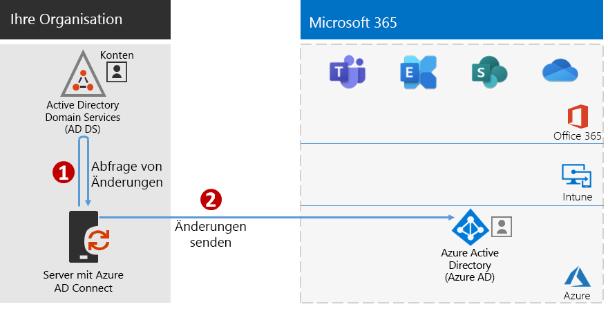
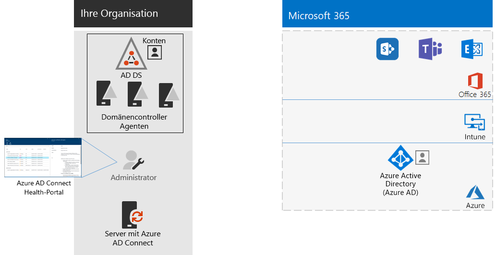

# Schritt 4: Hinzufügen von Benutzerkonten

## Erstellen von Benutzerkonten für reine Cloudidentität

Für reine Cloudidentität erstellen Sie Ihre Benutzer und Gruppen in Azure Active Directory (Azure AD). Sie können Folgendes verwenden:

- Das Microsoft 365 Admin Center
- Das Azure-Portal
- Azure PowerShell

## Synchronisieren von Identitäten für die Hybrididentität

*Dieser Schritt ist erforderlich für Hybridumgebungen und gilt für die Versionen E3 und E5 von Microsoft 365 Enterprise.*

In diesem Abschnitt synchronisieren Sie Ihre lokalen Active Directory Domain Services (AD DS) mit dem Azure AD-Mandanten, der von Ihren Office 365- Microsoft Intune- und anderen, in Microsoft 365 Enterprise-Abonnements enthaltenen cloudbasierten Diensten verwendet wird.

Azure AD Connect ist das unterstützte Microsoft-Tool, das Sie durch die Synchronisierung nur der Identitäten führt, die Sie aus AD DS -Umgebungen mit einer oder mehreren Gesamtstrukturen wirklich für Ihren Azure AD-Mandanten benötigen. In der folgenden Abbildung ist der grundlegende Prozess für die Azure AD Connect-Synchronisierung dargestellt.

1. Azure AD Connect, das auf einem Server ausgeführt wird, fragt AD DS auf Änderungen in Konten, Gruppen und Kontakten ab.
2. Azure AD Connect sendet diese Änderungen an den Azure AD-Mandanten Ihres Microsoft 365-Abonnements.

Die erste Entscheidung in Ihrer Identitätshybridlösung ist Ihre Authentifizierungsanforderung. Die folgenden Optionen sind verfügbar:

- Bei der **verwalteten Authentifizierung** verarbeitet Azure AD den Authentifizierungsprozess für die Benutzeranmeldung. Es gibt zwei Methoden für die verwaltete Authentifizierung: 
    - **Kennworthashsynchronisierung (Password Hash Sync, PHS)** [Empfohlen und für einige Premiumfunktionen erforderlich]. Dies ist die einfachste Methode, um die Authentifizierung für lokale Verzeichnisobjekte in Azure AD zu aktivieren. Azure AD Connect extrahiert das Kennwort mit Hash aus AD DS, führt eine zusätzliche Sicherheitsverarbeitung für den Kennworthash durch und synchronisiert es mit Azure AD. Weitere Informationen finden Sie unter [Implementieren der Kennworthashsynchronisierung mit der Azure AD Connect-Synchronisierung](https://docs.microsoft.com/azure/active-directory/hybrid/how-to-connect-password-hash-synchronization).
    - Die **Pass-Through-Authentifizierung (PTA)** bietet eine einfache Kennwortüberprüfungslösung für auf Azure AD basierende Dienste. PTA verwendet einen Agent, der auf einem oder mehreren lokalen Servern ausgeführt wird, um die Benutzerauthentifizierungen direkt mit Ihren lokalen AD DS zu überprüfen. Weitere Informationen finden Sie unter [Benutzeranmeldung mit der Azure Active Directory-Passthrough-Authentifizierung](https://docs.microsoft.com/azure/active-directory/connect/active-directory-aadconnect-pass-through-authentication).
- Bei der **Verbundauthentifizierung** wird der Authentifizierungsprozess über einen Identitätsverbundserver wie die Active Directory-Verbunddienste (AD FS) an einen anderen Identitätsanbieter weitergeleitet, wenn der Benutzer sich anmelden möchte. Der Identitätsanbieter kann weitere Authentifizierungsmethoden bereitstellen, z. B. Smartcard-basierte Authentifizierung. Weitere Informationen finden Sie unter [Wählen der richtigen Authentifizierungsmethode für Ihre Azure Active Directory-Hybrididentitätslösung](https://docs.microsoft.com/azure/security/azure-ad-choose-authn).

Schauen Sie sich dieses Video an, um eine Übersicht über die Identitätsmodelle und Authentifizierung für Microsoft 365 Enterprise zu erhalten.

 

> [!VIDEO https://www.microsoft.com/videoplayer/embed/RE2Pjwu]

Nachdem Sie Ihre Identitätshybridlösung ermittelt haben, laden Sie das [IdFix-Tool für die Fehlerbehebung bei der Verzeichnissynchronisierung herunter](https://www.microsoft.com/download/details.aspx?id=36832) und führen es aus, um Ihre AD DS auf Probleme zu analysieren.

Beheben Sie alle vom IdFix-Tool erkannten Probleme, und lesen Sie dann [Implementieren der Kennworthashsynchronisierung](https://docs.microsoft.com/azure/active-directory/connect/active-directory-aadconnectsync-implement-password-hash-synchronization). Dort finden Sie eine Anleitung zur Installation des Azure AD Connect-Tools und zur Konfiguration der Verzeichnissynchronisierung zwischen Ihren lokalen AD DS und dem Azure AD-Mandanten für Ihr Microsoft 365-Abonnement. Nach dem Start der Synchronisierung werden die Benutzerkonten und Gruppen im lokalen Identitätsanbieter (z. B. AD DS) beibehalten.

Microsoft stellt eine Reihe von Empfehlungen für [Identität und Gerätezugriff](microsoft-365-policies-configurations.md) bereit, um sicherzustellen, dass die Mitarbeiter sicher und produktiv arbeiten können. 

- Empfohlene Anforderungen für Hybridumgebungen finden Sie in der Spalte **Active Directory mit Kennworthashsynchronisierung** unter [Voraussetzungen](identity-access-prerequisites.md#prerequisites). 

- Empfohlene Anforderungen nur für Cloudumgebungen finden Sie in der Spalte **Nur Cloud** unter [Voraussetzungen](identity-access-prerequisites.md#prerequisites).

Sobald Ihre lokalen Benutzer und Gruppen in Azure AD vorhanden sind, können Sie mit dem Zuweisen von Lizenzen und der Verwendung von Produktivitätsarbeitslasten wie OneDrive for Business oder Exchange Online beginnen.

|||
|:-------|:-----|
|| [Testumgebungsanleitung: Kennworthashsynchronisierung](password-hash-sync-m365-ent-test-environment.md)  [Testumgebungsanleitung: Pass-Through-Authentifizierung](pass-through-auth-m365-ent-test-environment.md) |
|||

Als Zwischenprüfung können Sie sich die [Beendigungskriterien](identity-exit-criteria.md#crit-identity-sync) für diesen Abschnitt anschauen.

## Überwachen des Synchronisierungsstatus

*Dies ist optional und gilt für die Versionen E3 und E5 von Microsoft 365 Enterprise.*

In diesem Abschnitt installieren Sie einen Azure AD Connect Health-Agent auf den einzelnen lokalen AD DS-Domänencontrollern, um die Identitätsinfrastruktur und die von Azure AD Connect bereitgestellten Synchronisierungsdienste zu überwachen. Die Überwachungsinformationen werden in einem Azure AD Connect Health-Portal verfügbar gemacht, wo Sie Warnungen, Leistungsüberwachungsdaten, Nutzungsanalysen und andere Informationen anzeigen können.

Die wichtigste Entwurfsentscheidung hinsichtlich der Verwendung von Azure AD Connect Health basiert auf der Art und Weise, wie Sie Azure AD Connect verwenden:

- Wenn Sie die **verwaltete Authentifizierung** verwenden, beginnen Sie mit [Verwenden von Azure AD Connect Health mit Synchronisierung](https://docs.microsoft.com/azure/active-directory/connect-health/active-directory-aadconnect-health-sync), um Informationen zur Funktionsweise und Konfiguration von Azure AD Connect Health zu erhalten.
- Wenn Sie nur die Namen der Konten und Gruppen mithilfe der **Verbundauthentifizierung** mit Active Directory-Verbunddiensten (AD FS) synchronisieren, beginnen Sie mit [Verwenden von Azure AD Connect Health mit AD FS](https://docs.microsoft.com/azure/active-directory/connect-health/active-directory-aadconnect-health-adfs), um Informationen zur Funktionsweise und zur Konfiguration von Azure AD Connect Health zu erhalten.

Wenn Sie diesen Abschnitt abgeschlossen haben, verfügen Sie über Folgendes:

- Der Azure AD Connect Health-Agent ist auf jedem Ihrer lokalen Identitätsanbieterserver installiert.
- Das Azure AD Connect Health-Portal zeigt den aktuellen Status Ihrer lokalen Infrastruktur und der Synchronisierungsaktivitäten mit dem Azure AD-Mandanten für Ihr Microsoft 365-Abonnement.

Als Zwischenprüfung können Sie sich die [Abschlusskriterien](identity-exit-criteria.md#crit-identity-sync-health) für diesen Abschnitt ansehen.

## Vereinfachen der Kennwortaktualisierungen

*Dieser Schritt ist optional für Hybridumgebungen und gilt für die Versionen E3 und E5 von Microsoft 365 Enterprise.*

In diesem Abschnitt können Sie können Sie festlegen, dass Benutzer ihre Kennwörter über Azure Active Directory (Azure AD) zurücksetzen können, das dann in Ihre lokalen Active Directory Domain Services (AD DS) repliziert wird. Dieser Vorgang wird als Rückschreiben des Kennworts bezeichnet. Mit der Kennwortrückschreibung brauchen Benutzer ihre Kennwörter nicht mehr über den lokalen AD-DS zu aktualisieren, auf dem ihre Benutzerkonten und Attribute gespeichert sind. Dies ist für Roaming- oder Remote-Benutzer nützlich, die keine Remote-Zugriffsverbindung zum lokalen Netzwerk haben.

Das Kennwortrückschreiben ist erforderlich für die vollständige Nutzung von Azure AD Identity Protection, z. B. um zu verlangen, dass Benutzer ihre lokalen Kennwörter ändern, wenn ein hohes Risiko einer Kontogefährdung besteht.

Weitere Informationen und Hinweise zur Konfiguration finden Sie unter [Azure AD SSPR mit Kennwortrückschreiben](https://docs.microsoft.com/azure/active-directory/active-directory-passwords-writeback).

>[!Note]
>Führen Sie ein Upgrade auf die neueste Version von Azure AD Connect durch, um das bestmögliche Benutzererlebnis und die Verfügbarkeit neuer Features sicherzustellen, sobald diese veröffentlicht werden. Weitere Informationen finden Sie unter [Benutzerdefinierte Installation von Azure AD Connect](https://docs.microsoft.com/azure/active-directory/connect/active-directory-aadconnect-get-started-custom).
>

|||
|:-------|:-----|
|| [Testumgebungsanleitung: Rückschreiben des Kennworts](password-writeback-m365-ent-test-environment.md) |
|||

Als Zwischenprüfung können Sie sich die [Abschlusskriterien](identity-exit-criteria.md#crit-identity-pw-writeback) für diesen Abschnitt ansehen.

|||
|:-------|:-----|
|| [Verwenden von Gruppen zur Verwaltung](identity-use-group-management.md) |
