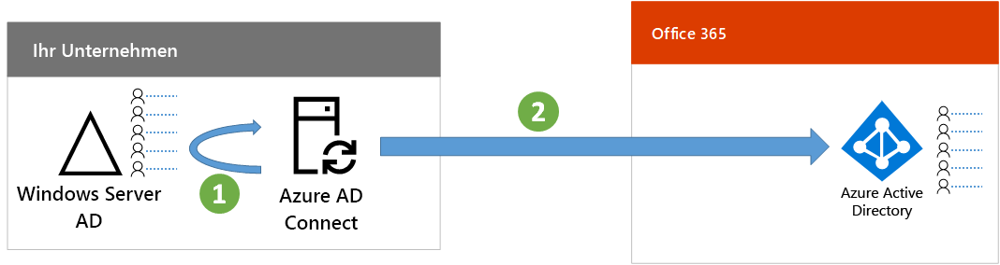
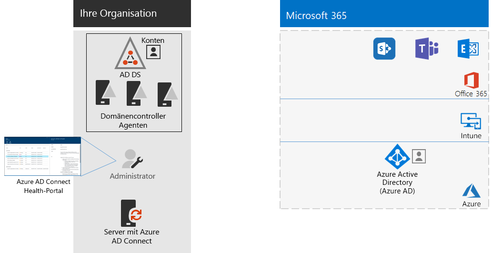

# Schritt 3: Konfigurieren der HybrididentitätStep 3: Configure hybrid identity

## Synchronisieren von IdentitätenSynchronize identities

*Dieser Schritt ist erforderlich für Hybridumgebungen und gilt für die Versionen E3 und E5 von Microsoft 365 Enterprise.**This is required for hybrid environments and applies to both the E3 and E5 versions of Microsoft 365 Enterprise*

In diesem Abschnitt synchronisieren Sie Ihre lokalen Active Directory Domain Services (AD DS) mit dem Azure Active Directory (Azure AD)-Mandanten, der von Ihren Office 365- und Enterprise Mobility + Security (EMS)-Abonnements verwendet wird.In this section, you'll synchronize your on-premises Active Directory Domain Services (AD DS) with the Azure Active Directory (Azure AD) tenant used by your Office 365 and Enterprise Mobility + Security (EMS) subscriptions.

Azure AD Connect ist das unterstützte Microsoft-Tool, das Sie durch die Synchronisierung nur der Identitäten führt, die Sie aus AD DS -Umgebungen mit einer oder mehreren Gesamtstrukturen wirklich für Ihren Azure AD-Mandanten benötigen.Azure AD Connect is the supported Microsoft tool that guides you through synchronizing only the identities you really need from single or multi-forest AD DS environments to your Azure AD tenant. In der folgenden Abbildung ist der grundlegende Prozess für die Azure AD Connect-Synchronisierung dargestellt.The following figure shows the basic process for Azure AD Connect synchronization.

1. Azure AD Connect, das auf einem Server ausgeführt wird, fragt AD DS auf Änderungen in Konten, Gruppen und Kontakten ab.Azure AD Connect running on a server polls AD DS for changes in accounts, groups, and contacts.
2. Azure AD Connect sendet diese Änderungen an den Azure AD-Mandanten Ihres Microsoft 365-Abonnements.Azure AD Connect sends those changes to the Azure AD tenant of your Microsoft 365 subscription.

Die erste Entscheidung in Ihrer Identitätshybridlösung ist Ihre Authentifizierungsanforderung. Die folgenden Optionen sind verfügbar:The first decision in your hybrid identity solution is your authentication requirement. The following options are options:

- Bei der **verwalteten Authentifizierung** verarbeitet Azure AD den Authentifizierungsprozess für die Benutzeranmeldung. Es gibt zwei Methoden für die verwaltete Authentifizierung:With **managed authentication**, Azure AD handles the authentication process for user sign-in. There are two methods for managed authentication: 
    - **Kennworthashsynchronisierung (Password Hash Sync, PHS)** [Empfohlen und für einige Premiumfunktionen erforderlich].**Password Hash Sync (PHS)** [Recommended and required for some premium features]. Dies ist die einfachste Methode, um die Authentifizierung für lokale Verzeichnisobjekte in Azure AD zu aktivieren.This is the simplest way to enable authentication for on-premises directory objects in Azure AD. Azure AD Connect extrahiert das Kennworthash aus AD DS, führt eine zusätzliche Sicherheitsverarbeitung für das Kennwort durch und speichert es in Azure AD.Azure AD Connect extracts the hashed password from AD DS, does extra security processing on the password, and saves it in Azure AD. Weitere Informationen finden Sie unter [Implementieren der Kennworthashsynchronisierung mit der Azure AD Connect-Synchronisierung](https://docs.microsoft.com/azure/active-directory/connect/active-directory-aadconnectsync-implement-password-synchronization).For more information, see [Implement password hash synchronization with Azure AD Connect sync](https://docs.microsoft.com/azure/active-directory/connect/active-directory-aadconnectsync-implement-password-synchronization).
    - Die **Pass-Through-Authentifizierung (PTA)** bietet eine einfache Kennwortüberprüfungslösung für auf Azure AD basierende Dienste.**Pass-through Authentication (PTA)** provides a simple password validation solution for Azure AD-based services. PTA verwendet einen Agent, der auf einem oder mehreren lokalen Servern ausgeführt wird, um die Benutzerauthentifizierungen direkt mit Ihren lokalen AD DS zu überprüfen.PTA uses an agent running on one or more on-premises servers to validate the user authentications directly with your on-premises AD DS. Weitere Informationen finden Sie unter [Benutzeranmeldung mit der Azure Active Directory-Passthrough-Authentifizierung](https://docs.microsoft.com/azure/active-directory/connect/active-directory-aadconnect-pass-through-authentication).For more information, see [User sign-in with Azure Active Directory Pass-through Authentication](https://docs.microsoft.com/azure/active-directory/connect/active-directory-aadconnect-pass-through-authentication).
- Bei der **Verbundauthentifizierung** wird der Authentifizierungsprozess über einen Identitätsverbundserver wie die Active Directory-Verbunddienste (AD FS) an einen anderen Identitätsanbieter weitergeleitet, wenn der Benutzer sich anmelden möchte. Der Identitätsanbieter kann weitere Authentifizierungsmethoden bereitstellen, z. B. Smartcard-basierte Authentifizierung. Weitere Informationen finden Sie unter [Wählen der richtigen Authentifizierungsmethode für Ihre Azure Active Directory-Hybrididentitätslösung](https://docs.microsoft.com/azure/security/azure-ad-choose-authn).With **federated authentication**, the authentication process is redirected to another identity provider through an identity federation server, such as Active Directory Federation Services (AD FS), for a user’s sign-in. The identity provider can provide additional authentication methods, such as smartcard-based authentication. For more information, see [Choosing the right authentication method for your Azure Active Directory hybrid identity solution](https://docs.microsoft.com/azure/security/azure-ad-choose-authn).

Nachdem Sie Ihre Identitätshybridlösung ermittelt haben, laden Sie das [IdFix-Tool für die Fehlerbehebung bei der Verzeichnissynchronisierung herunter](https://www.microsoft.com/download/details.aspx?id=36832) und führen es aus, um Ihre AD DS auf Probleme zu analysieren.After you've determined your hybrid identity solution, download and run the [IdFix Directory Synchronization Error Remediation Tool](https://www.microsoft.com/download/details.aspx?id=36832) to analyze your AD DS for issues.

Beheben Sie alle vom IdFix-Tool erkannten Probleme, und lesen Sie dann [Implementieren der Kennworthashsynchronisierung](https://docs.microsoft.com/azure/active-directory/connect/active-directory-aadconnectsync-implement-password-hash-synchronization). Dort finden Sie eine Anleitung zur Installation des Azure AD Connect-Tools und zur Konfiguration der Verzeichnissynchronisierung zwischen Ihren lokalen AD DS und dem Azure AD-Mandanten für Ihre Office 365- und EMS-Abonnements.After resolving all of the issues identified by the IdFix tool, see [Implement password hash synchronization](https://docs.microsoft.com/azure/active-directory/connect/active-directory-aadconnectsync-implement-password-hash-synchronization) for guidance on installing the Azure AD Connect tool and configuring directory synchronization between your on-premises AD DS and the Azure AD tenant for your Office 365 and EMS subscriptions. Nach dem Start der Synchronisierung werden die Benutzerkonten und Gruppen im lokalen Identitätsanbieter (z. B. AD DS) beibehalten.After synchronization starts, you'll maintain your user accounts and groups with your on-premises identity provider, such as AD DS.

Microsoft stellt eine Reihe von Empfehlungen für [Identität und Gerätezugriff](microsoft-365-policies-configurations.md) bereit, um sicherzustellen, dass die Mitarbeiter sicher und produktiv arbeiten können.Microsoft provides a set of recommendations for [identity and device access](microsoft-365-policies-configurations.md) to ensure a secure and productive workforce. 

- Empfohlene Anforderungen für Hybridumgebungen finden Sie in der Spalte **Active Directory mit Kennworthashsynchronisierung** unter [Voraussetzungen](identity-access-prerequisites.md#prerequisites).For recommended requirements for hybrid environments, see the **Active Directory with password hash sync** column in [prerequisites](identity-access-prerequisites.md#prerequisites). 

- Empfohlene Anforderungen nur für Cloudumgebungen finden Sie in der Spalte **Nur Cloud** unter [Voraussetzungen](identity-access-prerequisites.md#prerequisites).For recommended requirements for cloud only environments, see the **Cloud only** column in [prerequisites](identity-access-prerequisites.md#prerequisites).

Sobald Ihre lokalen Benutzer und Gruppen in Azure AD vorhanden sind, können Sie mit dem Zuweisen von Lizenzen und der Verwendung von Exchange Online beginnen.Once your on-premises users and groups are present in Azure AD, you can start assigning licenses and using Exchange Online. Informationen zur Einführung von Exchange Online bei Ihren Benutzern und zum Migrieren von lokalen Postfächern finden Sie unter [Bereitstellen von Exchange Online für Microsoft 365 Enterprise](exchangeonline-workload.md).To roll out Exchange Online to your users and migrate on-premises mailboxes, see [Deploy Exchange Online for Microsoft 365 Enterprise](exchangeonline-workload.md).

|||
|:-------|:-----|
|| [Testumgebungsanleitung: KennworthashsynchronisierungTest Lab Guide: Password hash synchronization](password-hash-sync-m365-ent-test-environment.md)  [Testumgebungsanleitung: Pass-Through-AuthentifizierungTest Lab Guide: Pass-through authentication](pass-through-auth-m365-ent-test-environment.md) |
|||

Als Zwischenprüfung können Sie sich die [Beendigungskriterien](identity-exit-criteria.md#crit-identity-sync) für diesen Abschnitt anschauen.As an interim checkpoint, you can see the [exit criteria](identity-exit-criteria.md#crit-identity-sync) corresponding to this section.

## Überwachen des SynchronisierungsstatusMonitor synchronization health

*Dieser Schritt ist optional und gilt für die Versionen E3 und E5 von Microsoft 365 Enterprise.**This is optional and applies to both the E3 and E5 versions of Microsoft 365 Enterprise*

In diesem Abschnitt installieren Sie einen Azure AD Connect Health-Agent auf den einzelnen lokalen Identitätsserver, um die Identitätsinfrastruktur und die von Azure AD Connect bereitgestellten Synchronisierungsdienste zu überwachen.In this section, you'll install an Azure AD Connect Health agent on each of your on-premises identity servers to monitor your identity infrastructure and the synchronization services provided by Azure AD Connect. Die Überwachungsinformationen werden in einem Azure AD Connect Health-Portal verfügbar gemacht, wo Sie Warnungen, Leistungsüberwachungsdaten, Nutzungsanalysen und andere Informationen anzeigen können.The monitoring information is made available in an Azure AD Connect Health portal, where you can view alerts, performance monitoring, usage analytics, and other information.

Die wichtigste Entwurfsentscheidung hinsichtlich der Verwendung von Azure AD Connect Health basiert auf der Art und Weise, wie Sie Azure AD Connect verwenden:The key design decision of how to use Azure AD Connect Health is based on how you are using Azure AD Connect:

- Wenn Sie die **verwaltete Authentifizierung** verwenden, beginnen Sie mit [Verwenden von Azure AD Connect Health mit Synchronisierung](https://docs.microsoft.com/azure/active-directory/connect-health/active-directory-aadconnect-health-sync), um Informationen zur Funktionsweise und Konfiguration von Azure AD Connect Health zu erhalten.If you’re using the **managed authentication** option, start with [Using Azure AD Connect Health with sync](https://docs.microsoft.com/azure/active-directory/connect-health/active-directory-aadconnect-health-sync) to understand and configure Azure AD Connect Health.
- Wenn Sie nur die Namen der Konten und Gruppen mithilfe der **Verbundauthentifizierung** mit Active Directory-Verbunddiensten (AD FS) synchronisieren, beginnen Sie mit [Verwenden von Azure AD Connect Health mit AD FS](https://docs.microsoft.com/azure/active-directory/connect-health/active-directory-aadconnect-health-adfs), um Informationen zur Funktionsweise und zur Konfiguration von Azure AD Connect Health zu erhalten.If you're synchronizing just the names of the accounts and groups using **federated authentication** with Active Directory Federation Services (AD FS), start with [Using Azure AD Connect Health with AD FS](https://docs.microsoft.com/azure/active-directory/connect-health/active-directory-aadconnect-health-adfs) to understand and configure Azure AD Connect Health.

Wenn Sie diesen Abschnitt abgeschlossen haben, verfügen Sie über Folgendes:When you complete this section, you’ll have:

- Der Azure AD Connect Health-Agent ist auf jedem Ihrer lokalen Identitätsanbieterserver installiert.The Azure AD Connect Health agent installed on your on-premises identity provider servers.
- Das Azure AD Connect Health-Portal zeigt den aktuellen Status Ihrer lokalen Infrastruktur und der Synchronisierungsaktivitäten mit dem Azure AD-Mandanten für Ihre Office 365- und EMS-Abonnements.The Azure AD Connect Health portal displaying the current state of your on-premises infrastructure and synchronization activities with the Azure AD tenant for your Office 365 and EMS subscriptions.

Als Zwischenprüfung können Sie die [Beendigungskriterien](identity-exit-criteria.md#crit-identity-sync-health) für diesen Abschnitt betrachten.As an interim checkpoint, you can see the [exit criteria](identity-exit-criteria.md#crit-identity-sync-health) for this section.

## Nächster SchrittNext step

|||
|:-------|:-----|
| [Konfigurieren der sicheren BenutzerauthentifizierungConfigure secure user authentication](identity-multi-factor-authentication.md)
