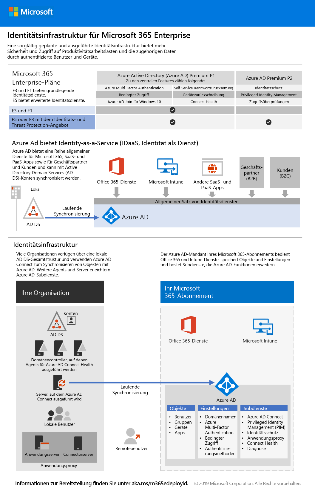

# Phase 2: Identität

In Microsoft 365 Enterprise ebnet eine sorgfältig geplante und ausgeführte Identitätsinfrastruktur den Weg für stärkere Sicherheit und Zugriff auf Produktivitätsarbeitslasten und die zugehörigen Daten nur für authentifizierte Benutzer und Geräte.

Schauen Sie sich dieses Video an, um eine Übersicht über die Identitätsmodelle und Authentifizierung für Microsoft 365 Enterprise zu erhalten.

 

> [!VIDEO https://www.microsoft.com/videoplayer/embed/RE2Pjwu]

>[!Note]
>Wenn Sie bereits eine Identitätsinfrastruktur bereitgestellt haben, lesen Sie bitte den Artikel [Identitätsbeendigungskriterien](identity-exit-criteria.md) um sicherzustellen, dass Sie die erforderlichen und optionalen Kriterien für Microsoft 365 Enterprise erfüllen.
>

Informationen zu den Identitätsfeatures jedes Microsoft 365 Enterprise-Plans, zur Rolle von Azure Active Directory (Azure AD), zu lokalen und cloudbasierten Komponenten sowie zu den häufigsten Authentifizierungskonfigurationen finden Sie auf dem [Poster zur Identitätsinfrastruktur](../media/identity-infrastructure/M365E-ID-Infra.pdf).

Dieses zweiseitige Poster ist eine schnelle Möglichkeit, sich mit den Identitätskonzepten und -konfigurationen für Microsoft 365 Enterprise vertraut zu machen.

Sie können [dieses Poster herunterladen](https://github.com/MicrosoftDocs/microsoft-365-docs/raw/public/microsoft-365/media/identity-infrastructure/M365E-ID-Infra.pdf) und in den Formaten "Brief", "Legal" oder "Tabloid" (27,94 x 43,18 cm) ausdrucken.

## Planen und Bereitstellen Ihrer Microsoft 365 Enterprise-Identitätsinfrastruktur 

Verwenden Sie die folgenden Schritte zum Planen und Bereitstellen der neuen Identitätsinfrastruktur in der Cloud. Sie können diese Schritte auch zum Anpassen Ihrer vorhandenen lokalen oder Hybrididentitätsinfrastruktur für die Verwendung mit Microsoft 365 Enterprise verwenden. 

|||
|:-------|:-----|
|| [Erstellen und Schützen Ihrer globalen Administratorkonten](identity-create-protect-global-admins.md) |
|| [Schützen von Kennwörtern](identity-secure-your-passwords.md) |
|| [Absichern und Verwalten von Benutzeranmeldungen](identity-secure-user-sign-ins.md) |
|| [Hinzufügen von Benutzerkonten](identity-add-user-accounts.md) |
|| [Verwenden von Gruppen zur Verwaltung](identity-use-group-management.md) |
|| [Konfigurieren der Identitätsgovernance](identity-configure-identity-governance.md) |

Wenn Sie diese Schritte abgeschlossen haben, wechseln Sie zu [Beendigungskriterien](identity-exit-criteria.md) für diese Phase, um sicherzustellen, dass Sie die erforderlichen und optionalen Kriterien für die Microsoft 365 Enterprise-Identität erfüllen.

## Empfehlungen für den Identitäts- und Gerätezugriff

Microsoft bietet eine Reihe von Empfehlungen für den [Identitäts- und Gerätezugriff](microsoft-365-policies-configurations.md), um sicherzustellen, dass eine sichere und produktive Mitarbeiter. Verwenden Sie für Identität die Standardeinstellungen und Empfehlungen in den folgenden Artikeln zusammen mit den Schritten in dieser Phase:

- [Voraussetzungen](identity-access-prerequisites.md)
- [Allgemeine Identitäts- und Gerätezugriffsrichtlinien](identity-access-policies.md)

## Funktionsweise von Microsoft 365 Enterprise bei Microsoft

Erfahren Sie, wie IT-Experten bei Microsoft [Identitäten verwalten und den Zugriff sichern](https://www.microsoft.com/de-DE/itshowcase/managing-user-identities-and-secure-access-at-microsoft).

>[!Note]
>Diese IT Showcase-Ressource ist nur in Englisch verfügbar.
>

## Wie Microsoft 365 Enterprise bei Contoso eingesetzt wird

Erfahren Sie, wie die Contoso Corporation, ein fiktives, aber multinationales, repräsentatives Unternehmen [eine hybride Identitätsinfrastruktur bereitgestellt hat](contoso-identity.md) (für Microsoft 365-Clouddienste).

## Nächster Schritt

|||
|:-------|:-----|
|| [Erstellen und Schützen Ihrer globalen Administratorkonten](identity-create-protect-global-admins.md) |
