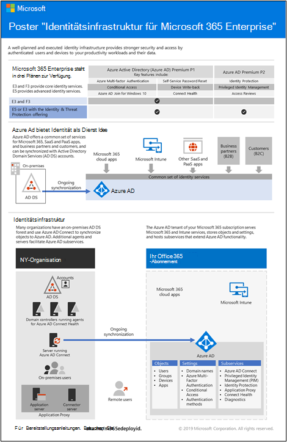

# Identitäts-Roadmap für Microsoft 365Identity roadmap for Microsoft 365

In Microsoft 365 Enterprise ebnet eine gut geplante und ausgeführte Identitätsinfrastruktur den Weg für mehr Sicherheit, einschließlich der Einschränkung des Zugriffs auf Ihre Produktivitätsworkloads und deren Daten auf nur authentifizierte Benutzer und Geräte.In Microsoft 365 for enterprise, a well-planned and executed identity infrastructure paves the way for stronger security, including restricting access to your productivity workloads and their data to only authenticated users and devices.

Eine Übersicht über Identitätsmodelle und die Authentifizierung für Microsoft 365 Enterprise finden Sie in diesem Video.For an overview of identity models and authentication for Microsoft 365 for enterprise, watch this video.

 

 

> [!VIDEO https://www.microsoft.com/videoplayer/embed/RE2Pjwu]

Informationen zu den Identitätsfeatures der einzelnen Microsoft 365 For Enterprise-Pläne, zur Rolle von Azure Active Directory, zu den lokalen und cloudbasierten Komponenten sowie zu den gängigsten Authentifizierungskonfigurationen finden Sie im Poster [Identity Infrastructure](../downloads/m365e-identity-infra.pdf).For information about the identity features of each Microsoft 365 for enterprise plan, the role of Azure Active Directory, both the on-premises and cloud-based components, and the most common authentication configurations, see the [Identity Infrastructure poster](../downloads/m365e-identity-infra.pdf).

Lesen Sie dieses zweiseitige Poster, um die Identitätskonzepte und -konfigurationen für Microsoft 365 Enterprise schnell zu entwickeln.Review this two-page poster to quickly ramp up on identity concepts and configurations for Microsoft 365 for enterprise.

Sie können [dieses Poster auch herunterladen](https://github.com/MicrosoftDocs/microsoft-365-docs/raw/public/microsoft-365/downloads/m365e-identity-infra.pdf) und im Buchstaben-, Rechts- oder Tabloidformat (11 x 17) drucken.You can also [download this poster](https://github.com/MicrosoftDocs/microsoft-365-docs/raw/public/microsoft-365/downloads/m365e-identity-infra.pdf) and can print it in letter, legal, or tabloid (11 x 17) format.

## PlanenPlan

So planen Sie ihre Identitätsimplementierung:To plan for your identity implementation:

- [Verstehen der verschiedenen IdentitätsmodelleUnderstand the different identity models](about-microsoft-365-identity.md)
- [Planen der Hybrididentität und VerzeichnissynchronisierungPlan for hybrid identity and directory synchronization](plan-for-directory-synchronization.md)

## BereitstellenDeploy

So stellen Sie Ihre Identitätsimplementierung zur Bereitstellung:To deploy your identity implementation:

- [Schützen Ihrer globalen AdministratorkontenProtect your global administrator accounts](protect-your-global-administrator-accounts.md)
- [Konfigurieren und Verwenden von Nur-Cloud-IdentitätenConfigure and use cloud-only identities](cloud-only-identities.md)
- [Konfigurieren und Verwenden von HybrididentitätenConfigure and use hybrid identities](prepare-for-directory-synchronization.md)
- [Einrichten der VerzeichnissynchronisierungSet up directory synchronization](set-up-directory-synchronization.md)
- Bereitstellen von [Hybrididentitätsszenarien bei Bedarf](hybrid-solutions.md)If needed, deploy [hybrid identity scenarios](hybrid-solutions.md)

### Empfehlungen für den Identitäts- und GerätezugriffIdentity and device access recommendations

Um eine sichere und produktive Belegschaft sicherzustellen, bietet Microsoft eine Reihe von Empfehlungen für den Identitäts- und [Gerätezugriff.](../security/defender-365-security/microsoft-365-policies-configurations.md)To help ensure a secure and productive workforce, Microsoft provides a set of recommendations for [identity and device access](../security/defender-365-security/microsoft-365-policies-configurations.md). Verwenden Sie zur Identitätsidentität die Empfehlungen und Einstellungen in den folgenden Artikeln:For identity, use the recommendations and settings in these articles:

- [VoraussetzungenPrerequisites](../security/defender-365-security/identity-access-prerequisites.md)
- [Allgemeine Identitäts- und GerätezugriffsrichtlinienCommon identity and device access policies](../security/defender-365-security/identity-access-policies.md)

## VerwaltenManage

Informationen zum Verwalten Ihrer Microsoft 365-Identitätsbereitstellung finden Sie unter:To manage your Microsoft 365 identity deployment, see:

- [BenutzerkontenUser accounts](manage-microsoft-365-accounts.md)
- [LizenzenLicenses](assign-licenses-to-user-accounts.md)
- [KennwörterPasswords](manage-microsoft-365-passwords.md)
- [GruppenGroups](manage-microsoft-365-groups.md)
- [GovernanceGovernance](manage-microsoft-365-identity-governance.md)
- [VerzeichnissynchronisierungDirectory synchronization](view-directory-synchronization-status.md)

## Funktionsweise der Identität von Microsoft für Microsoft 365How Microsoft does identity for Microsoft 365

Erfahren Sie, wie IT-Experten bei Microsoft [Identitäten verwalten und den Zugriff sichern](https://www.microsoft.com/en-us/itshowcase/managing-user-identities-and-secure-access-at-microsoft).Learn how IT experts at Microsoft [manage identities and secure access](https://www.microsoft.com/en-us/itshowcase/managing-user-identities-and-secure-access-at-microsoft).

>[!Note]
>Diese IT -Showcase-Ressource ist nur in Englisch verfügbar.This IT Showcase resource is available only in English.
>

## Funktionsweise der Identität von Contoso für Microsoft 365How Contoso did identity for Microsoft 365

Ein Beispiel dafür, wie eine fiktive, aber repräsentative multinationale Organisation eine Hybrididentitätsinfrastruktur für Microsoft 365-Clouddienste bereitgestellt hat, finden Sie unter [Identity for the Contoso Corporation](contoso-identity.md).For an example of how a fictional but representative multinational organization has deployed a hybrid identity infrastructure for Microsoft 365 cloud services, see [Identity for the Contoso Corporation](contoso-identity.md).

## Nächster SchrittNext step

Starten Sie Ihre Identitätsplanung mit [Identitätsmodellen.](about-microsoft-365-identity.md)Start your identity planning with [Identity models](about-microsoft-365-identity.md).
