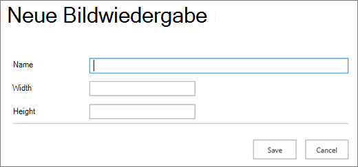

# Bildoptimierung für SharePoint klassische Online-Veröffentlichungswebsites

Die Ladegeschwindigkeit einer Webseite hängt von der kombinierten Größe aller Komponenten ab, die zum Rendern der Seite erforderlich sind, einschließlich Bildern, HTML, JavaScript und CSS. Bilder sind eine hervorragende Möglichkeit, um Ihre Website ansprechender zu gestalten, ihre Größe kann sich jedoch auf die Leistung auswirken. Durch die Optimierung Ihrer Bilder mit Komprimierung und Größenänderung und mit Sprites können Sie die Auswirkungen sehr großer Bilder ausgleichen. Mithilfe SharePoint Bilddarstellungen können Sie ein einzelnes großes Bild hochladen und Abschnitte des Bilds anzeigen, sodass es wiederverwendet und nicht neu geladen werden kann.

>[!NOTE]
>Dieses Thema gilt für SharePoint klassische Online-Veröffentlichungswebsites, nicht für moderne Portalwebsites. Informationen zur Bildoptimierung in SharePoint modernen Onlineportalwebsites finden Sie unter Optimieren von Bildern [in SharePoint modernen Onlineportalseiten](modern-image-optimization.md).
  
## Verwenden von Sprites zum Beschleunigen des Ladens von Bildern

|||
|:-----|:-----|
| Ein Bild-Sprite enthält viele kleinere Bilder. Mit CSS wählen Sie einen Teil des zusammengesetzten Bilds aus, der auf einem bestimmten Teil der Seite mit absoluter Positionierung angezeigt werden soll. Im Grunde verschieben Sie ein einzelnes Bild um die Seite, anstatt mehrere Bilder zu laden, und machen einen kleinen Teil dieses Bilds durch ein kleines Fenster sichtbar, in dem dem Endbenutzer der erforderliche Teil des sprite-Bilds angezeigt wird. SharePoint Online verwendet Sprites, um die verschiedenen Symbole im sprite-spcommon.png.     Was hier behandelt wird:     Bildkomprimierung     Bildoptimierung     SharePoint Bildversionen    ||
   
Dies kann die Leistung erhöhen, da Sie nur ein Bild anstelle mehrerer herunterladen und dann zwischenspeichern und wiederverwenden. Auch wenn das Bild nicht zwischengespeichert bleibt, reduziert diese Methode die Gesamtzahl der HTTP-Anforderungen an den Server, indem ein einzelnes Bild anstelle mehrerer Bilder vorhanden ist, wodurch die Seitenladezeiten reduziert werden. Dies ist wirklich eine Form der Bildbündelung. Dies ist eine sehr nützliche Technik, wenn die Bilder nicht sehr häufig geändert werden, z. B. Symbole, wie im SharePoint oben dargestellt. Sie können Web Essentials verwenden, ein Open-Source-Projekt eines [Drittanbieters,](https://vswebessentials.com/)das auf Communitybasis basiert, um dies problemlos in Microsoft Visual Studio. Weitere Informationen finden Sie unter [Minification and bundling in SharePoint Online](./minification-and-bundling-in-sharepoint-online.md).
  
## Verwenden von Bildkomprimierung und -optimierung zum Beschleunigen des Seitenladevorganges

Bei der Bildkomprimierung und -optimierung geht es darum, die Dateigröße der Bilder zu reduzieren, die Sie auf Ihrer Website verwenden. Häufig ist die beste Methode, um die Größe eines Bilds zu reduzieren, die Größe des Bilds auf die maximalen Dimensionen zu ändern, die auf der Website angezeigt werden. Es ist nicht sinnvoll, ein Bild größer zu machen, als es jemals angezeigt wird. Das Sicherstellen, dass Bilder mit einem Bildeditor die richtigen Dimensionen aufweisen, ist eine schnelle und einfache Möglichkeit, die Größe Ihrer Seite zu reduzieren.
  
Sobald Bilder die richtige Größe haben, besteht der nächste Schritt in der Optimierung der Komprimierung dieser Bilder. Es stehen verschiedene Tools für die Komprimierung und Optimierung zur Verfügung, einschließlich Fotogalerie und Tools von Drittanbietern. Der Schlüssel zur Komprimierung ist, die Dateigröße so weit wie möglich zu reduzieren, ohne erkennbare Qualität für Endbenutzer zu verlieren. Stellen Sie sicher, dass Sie ihre komprimierten Dateien auf einer High-Definition-Anzeige testen, um sicherzustellen, dass sie weiterhin gut aussehen.
  
## Beschleunigen von Seitendownloads mithilfe SharePoint Bildversionen

Bildversionen sind ein Feature in SharePoint Online, mit dem Sie unterschiedliche Versionen von Bildern basierend auf vordefinierten Bilddimensionen bedienen können. Dies ist besonders wichtig, wenn vom Benutzer generierte Bildinhalte vorhanden sind oder die Bilddimensionen wie Breite und Höhe von der CSS auf der Website festgelegt werden. Auch wenn ein Bild durch CSS behoben wird, wird das Bild in voller Auflösung weiterhin geladen. In diesem Fall kann die Dateigröße mithilfe von Bildformatierungen reduziert werden.
  
> [!NOTE]
> Wiedergaben sind nur für SharePoint verfügbar, wenn die Veröffentlichung aktiviert ist. Sie können die Veröffentlichung unter Einstellungen Site Einstellungen Verwalten von \> \> Websitefeatures \> SharePoint Server Publishing aktivieren. Die Option wird nicht anders angezeigt.
  
Die Größe der Bildwiedergabe kann so geändert werden, dass die kleinste dimension, die Sie definieren, entweder Breite oder Höhe, und dann die Größe des Bilds so geändert wird, dass die größe der anderen Dimension basierend auf dem gesperrten Seitenverhältnis automatisch angepasst wird. Standardmäßig wird das Bild von der Mitte um die verbleibenden Dimensionen zugeschnitten. Wenn Sie z. B. eine Wiedergabe von 100 px breit und 50 px hoch definieren und ihr Ursprüngliches Bild 1000 pixel breit und 800 px hoch ist, wird die Größe so angepasst, dass die 800px-Dimension jetzt 50px und die 1000px-Dimension (jetzt 62,5 px) aus der Mitte des Bilds zugeschnitten wird.
  
Die Schritte sind relativ einfach, aber damit Bilder die Wiedergaben verwenden können, müssen sich die Wiedergaben auf der SharePoint befinden, bevor Sie die Bilder hinzufügen. Darüber hinaus müssen Sie auch die Features SharePoint Server Publishing Infrastructure (Site Collection Level) und SharePoint Server Publishing (Site Level) aktiviert haben.
  
### Hinzufügen einer Bildwiedergabe zum Beschleunigen des Seitenladevorganges
  
1. Stellen Sie sicher, dass das Benutzerkonto, das dieses Verfahren ausführen soll, mindestens über Entwurfsberechtigungen für die Website auf oberster Ebene der Websitesammlung verfügt und dass die Website auf einer Webseite veröffentlicht wird.

2. Wechseln Sie in einem Webbrowser zur Website auf oberster Ebene der Veröffentlichungswebsitesammlung.

3. Klicken Sie auf das Symbol **Einstellungen**.

4. Auf der **Seite Website Einstellungen** werden im Abschnitt Look and **Feel** die integrierten Bildversionen angezeigt.

    Sie können die out-of-the-Box-Wiedergaben verwenden oder **Bildversionen** auswählen, um eine neue zu erstellen.

    
  
5. Wählen Sie auf der Seite **Bildwiedergaben** die Option **Neues Element hinzufügen**.

    
  
6. Geben Sie auf der Seite **Neue Bildwiedergabe** in das Feld **Name** einen Namen für die Darstellung ein, z.

7. Geben Sie in die Textfelder **Breite** und **Höhe** die Breite und Höhe der Darstellung in Pixel ein, und klicken Sie dann auf **Speichern**.

    
  
## Benutzerdefiniertes Zuschneiden mit Bildvarianten

Standardmäßig wird eine Bilddarstellung aus der Mitte des Bilds generiert. Sie können die Bilddarstellung für einzelne Bilder anpassen, indem Sie den Teil des Bilds zuschneiden, den Sie verwenden möchten. Sie können die Bilder einzeln und pro Wiedergabe zuschneiden. Durch das Zuschneiden der Bilder wird das Laden der Seite beschleunigt, indem SharePoint Blobcache verwendet wird, um eine Version des Bilds für jede Wiedergabe zu erstellen. Auf diese Weise wird die Serverlast reduziert, da die Größe des Bilds nur einmal geändert wird und dann für Endbenutzer mehrmals verwendet werden kann. Weitere Informationen zum Zuschneiden einer Bildwiedergabe finden Sie unter [Crop an image rendition](/sharepoint/dev/general-development/sharepoint-design-manager-device-channels).
