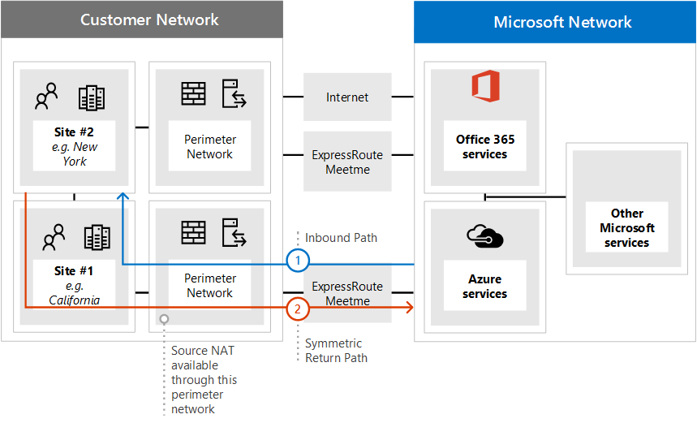

# <a name="implementing-expressroute-for-office-365"></a><span data-ttu-id="5b691-103">Implementieren von ExpressRoute für Office 365</span><span class="sxs-lookup"><span data-stu-id="5b691-103">Implementing ExpressRoute for Office 365</span></span>

<span data-ttu-id="5b691-104">*Dieser Artikel gilt sowohl für Microsoft 365 Enterprise als auch für Office 365 Enterprise.*</span><span class="sxs-lookup"><span data-stu-id="5b691-104">*This article applies to both Microsoft 365 Enterprise and Office 365 Enterprise.*</span></span>

<span data-ttu-id="5b691-105">ExpressRoute für Office 365 bietet einen alternativen Routingpfad zu vielen Office 365-Diensten mit Internetzugriff.</span><span class="sxs-lookup"><span data-stu-id="5b691-105">ExpressRoute for Office 365 provides an alternate routing path to many internet facing Office 365 services.</span></span> <span data-ttu-id="5b691-106">Die Architektur von ExpressRoute für Office 365 basiert auf der Werbung für öffentliche IP-Präfixe von Office 365-Diensten, auf die bereits über das Internet zugegriffen werden kann, in Ihre bereitgestellten ExpressRoute-Schaltungen für die nachfolgende Verteilung dieser IP-Präfixe in Ihr Netzwerk.</span><span class="sxs-lookup"><span data-stu-id="5b691-106">The architecture of ExpressRoute for Office 365 is based on advertising public IP prefixes of Office 365 services that are already accessible over the Internet into your provisioned ExpressRoute circuits for subsequent redistribution of those IP prefixes into your network.</span></span> <span data-ttu-id="5b691-107">Mit ExpressRoute können Sie für viele Office 365-Dienste mehrere verschiedene Routingpfade über das Internet und expressRoute aktivieren.</span><span class="sxs-lookup"><span data-stu-id="5b691-107">With ExpressRoute you effectively enable several different routing paths, through the internet and through ExpressRoute, for many Office 365 services.</span></span> <span data-ttu-id="5b691-108">Dieser Routingstatus in Ihrem Netzwerk kann eine wesentliche Änderung der Internen Netzwerktopologie darstellen.</span><span class="sxs-lookup"><span data-stu-id="5b691-108">This state of routing on your network may represent a significant change to how your internal network topology is designed.</span></span>
  
 <span data-ttu-id="5b691-109">**Status:** Vollständiger Leitfaden v2</span><span class="sxs-lookup"><span data-stu-id="5b691-109">**Status:** Complete Guide v2</span></span>
  
<span data-ttu-id="5b691-110">Sie müssen Ihre ExpressRoute für Office 365-Implementierung sorgfältig planen, um den Netzwerkkomplexen des Routings über eine dedizierte Schaltung mit Routen, die in Ihr Kernnetzwerk und das Internet eingesengt werden, zu helfen.</span><span class="sxs-lookup"><span data-stu-id="5b691-110">You must carefully plan your ExpressRoute for Office 365 implementation to accommodate for the network complexities of having routing available via both a dedicated circuit with routes injected into your core network and the internet.</span></span> <span data-ttu-id="5b691-111">Wenn Sie und Ihr Team die detaillierten Planungen und Tests in diesem Handbuch nicht durchführen, besteht ein hohes Risiko, dass sie zeitweise auftreten oder die Verbindung zu Office 365-Diensten insgesamt verloren geht, wenn die ExpressRoute-Schaltung aktiviert ist.</span><span class="sxs-lookup"><span data-stu-id="5b691-111">If you and your team don't perform the detailed planning and testing in this guide, there is a high risk you'll experience intermittent or a total loss of connectivity to Office 365 services when the ExpressRoute circuit is enabled.</span></span>
  
<span data-ttu-id="5b691-112">Um eine erfolgreiche Implementierung zu haben, müssen Sie Ihre Infrastrukturanforderungen analysieren, eine detaillierte Netzwerkbewertung und -planung durchgehen, den Rollout szenisch und kontrolliert planen und einen detaillierten Validierungs- und Testplan erstellen.</span><span class="sxs-lookup"><span data-stu-id="5b691-112">To have a successful implementation, you will need to analyze your infrastructure requirements, go through detailed network assessment and design, carefully plan the rollout in a staged and controlled manner, and build a detailed validation and testing plan.</span></span> <span data-ttu-id="5b691-113">Für eine große, verteilte Umgebung ist es nicht ungewöhnlich, Implementierungen über mehrere Monate zu sehen.</span><span class="sxs-lookup"><span data-stu-id="5b691-113">For a large, distributed environment it's not uncommon to see implementations span several months.</span></span> <span data-ttu-id="5b691-114">Dieses Handbuch soll Ihnen bei der Planung helfen.</span><span class="sxs-lookup"><span data-stu-id="5b691-114">This guide is designed to help you plan ahead.</span></span>
  
<span data-ttu-id="5b691-115">Umfangreiche erfolgreiche Bereitstellungen können sechs Monate in der Planung dauern und umfassen häufig Teammitglieder aus vielen Bereichen der Organisation, darunter Netzwerk-, Firewall- und Proxyserveradministratoren, Office 365-Administratoren, Sicherheit, Endbenutzersupport, Projektverwaltung und Führungskräftesponsoring.</span><span class="sxs-lookup"><span data-stu-id="5b691-115">Large successful deployments may take six months in planning and often include team members from many areas in the organization including networking, Firewall and Proxy server administrators, Office 365 administrators, security, end-user support, project management, and executive sponsorship.</span></span> <span data-ttu-id="5b691-116">Ihre Investition in den Planungsprozess reduziert die Wahrscheinlichkeit, dass Bereitstellungsfehler auftreten, die zu Ausfallzeiten oder einer komplexen und kostspieligen Problembehandlung führen.</span><span class="sxs-lookup"><span data-stu-id="5b691-116">Your investment in the planning process will reduce the likelihood that you'll experience deployment failures resulting in downtime or complex and expensive troubleshooting.</span></span>
  
<span data-ttu-id="5b691-117">Wir erwarten, dass die folgenden Voraussetzungen erfüllt werden, bevor dieses Implementierungshandbuch gestartet wird.</span><span class="sxs-lookup"><span data-stu-id="5b691-117">We expect the following pre-requisites to be completed before this implementation guide is started.</span></span>
  
1. <span data-ttu-id="5b691-118">Sie haben eine Netzwerkbewertung abgeschlossen, um festzustellen, ob ExpressRoute empfohlen und genehmigt wird.</span><span class="sxs-lookup"><span data-stu-id="5b691-118">You've completed a network assessment to determine if ExpressRoute is recommended and approved.</span></span>

2. <span data-ttu-id="5b691-119">Sie haben einen ExpressRoute-Netzwerkdienstanbieter ausgewählt.</span><span class="sxs-lookup"><span data-stu-id="5b691-119">You've selected an ExpressRoute network service provider.</span></span> <span data-ttu-id="5b691-120">Hier finden Sie Details zu [den ExpressRoute-Partnern und Peeringstandorten.](/azure/expressroute/expressroute-locations)</span><span class="sxs-lookup"><span data-stu-id="5b691-120">Find details about the [ExpressRoute partners and peering locations](/azure/expressroute/expressroute-locations).</span></span>

3. <span data-ttu-id="5b691-121">Sie haben die [ExpressRoute-Dokumentation](https://azure.microsoft.com/documentation/services/expressroute/) bereits gelesen und verstanden, und Ihr internes Netzwerk ist in der Lage, die Voraussetzungen für ExpressRoute von Ende zu Ende zu erfüllen.</span><span class="sxs-lookup"><span data-stu-id="5b691-121">You've already read and understand the [ExpressRoute documentation](https://azure.microsoft.com/documentation/services/expressroute/) and your internal network is able to meet ExpressRoute pre-requisites end to end.</span></span>

4. <span data-ttu-id="5b691-122">Ihr Team hat alle öffentlichen Anleitungen und Dokumentationen unter gelesen und die [https://aka.ms/expressrouteoffice365](./azure-expressroute.md) [https://aka.ms/ert](https://aka.ms/ert) Azure [ExpressRoute for Office 365-Schulungsreihe](https://channel9.msdn.com/series/aer) auf Kanal 9 verfolgt, um sich ein Verständnis kritischer technischer Details zu verschaffen, einschließlich:</span><span class="sxs-lookup"><span data-stu-id="5b691-122">Your team has read all of the public guidance and documentation at [https://aka.ms/expressrouteoffice365](./azure-expressroute.md), [https://aka.ms/ert](https://aka.ms/ert), and watched the [Azure ExpressRoute for Office 365 Training](https://channel9.msdn.com/series/aer) series on Channel 9 to gain an understanding of critical technical details including:</span></span>

      - <span data-ttu-id="5b691-123">Die Internetabhängigkeiten von SaaS-Diensten.</span><span class="sxs-lookup"><span data-stu-id="5b691-123">The internet dependencies of SaaS services.</span></span>

      - <span data-ttu-id="5b691-124">Vermeiden asymmetrischer Routen und Behandeln komplexer Routings</span><span class="sxs-lookup"><span data-stu-id="5b691-124">How to avoid asymmetric routes and handle complex routing.</span></span>

      - <span data-ttu-id="5b691-125">Integrieren von Perimetersicherheits-, Verfügbarkeits- und Anwendungsebenensteuerelementen.</span><span class="sxs-lookup"><span data-stu-id="5b691-125">How to incorporate perimeter security, availability, and application level controls.</span></span>

## <a name="begin-by-gathering-requirements"></a><span data-ttu-id="5b691-126">Beginnen Sie mit dem Sammeln von Anforderungen</span><span class="sxs-lookup"><span data-stu-id="5b691-126">Begin by gathering requirements</span></span>
<span data-ttu-id="5b691-127"><a name="requirements"> </a></span><span class="sxs-lookup"><span data-stu-id="5b691-127"><a name="requirements"> </a></span></span>

<span data-ttu-id="5b691-128">Bestimmen Sie zunächst, welche Features und Dienste Sie in Ihrer Organisation übernehmen möchten.</span><span class="sxs-lookup"><span data-stu-id="5b691-128">Start by determining which features and services you plan to adopt within your organization.</span></span> <span data-ttu-id="5b691-129">Sie müssen bestimmen, welche Features der verschiedenen Office 365-Dienste verwendet werden und welche Standorte in Ihrem Netzwerk Personen hosten, die diese Features verwenden.</span><span class="sxs-lookup"><span data-stu-id="5b691-129">You need to determine which features of the different Office 365 services will be used and which locations on your network will host people using those features.</span></span> <span data-ttu-id="5b691-130">Mit dem Katalog der Szenarien müssen Sie die Netzwerkattribute hinzufügen, die für jedes dieser Szenarien erforderlich sind. wie eingehende und ausgehende Netzwerkdatenströme und ob die Office 365-Endpunkte über ExpressRoute verfügbar sind oder nicht.</span><span class="sxs-lookup"><span data-stu-id="5b691-130">With the catalog of scenarios, you need to add the network attributes that each of those scenarios require; such as inbound and outbound network traffic flows and if the Office 365 endpoints are available over ExpressRoute or not.</span></span>
  
<span data-ttu-id="5b691-131">So erfassen Sie die Anforderungen Ihrer Organisation:</span><span class="sxs-lookup"><span data-stu-id="5b691-131">To gather your organization's requirements:</span></span>
  
- <span data-ttu-id="5b691-132">Katalogisieren Sie den eingehenden und ausgehenden Netzwerkdatenverkehr für die Office 365-Dienste, die Ihre Organisation verwendet.</span><span class="sxs-lookup"><span data-stu-id="5b691-132">Catalog the inbound and outbound network traffic for the Office 365 services your organization is using.</span></span> <span data-ttu-id="5b691-133">Auf der Seite Office 365-URLs und IP-Adressbereiche finden Sie eine Beschreibung der Flüsse, die für unterschiedliche Office 365-Szenarien erforderlich sind.</span><span class="sxs-lookup"><span data-stu-id="5b691-133">Consult Office 365 URLs and IP address ranges page for the description of flows that different Office 365 scenarios require.</span></span>

- <span data-ttu-id="5b691-134">Sammeln Sie eine Dokumentation der vorhandenen Netzwerktopologie, die Details ihres internen WAN-Backbones und Ihrer Topologie, die Konnektivität von Satellitenstandorten, die Benutzerkonnektivität der letzten Meile, das Routing zu Denresspunkten des Netzwerkperimeters und Proxydienste enthält.</span><span class="sxs-lookup"><span data-stu-id="5b691-134">Gather documentation of existing network topology showing details of your internal WAN backbone and topology, connectivity of satellite sites, last mile user connectivity, routing to network perimeter egress points, and proxy services.</span></span>

  - <span data-ttu-id="5b691-135">Identifizieren Sie eingehende Dienstendpunkte in den Netzwerkdiagrammen, mit denen Office 365 und andere Microsoft-Dienste eine Verbindung herstellen, und zeigen Sie sowohl Internet- als auch vorgeschlagene ExpressRoute-Verbindungspfade an.</span><span class="sxs-lookup"><span data-stu-id="5b691-135">Identify inbound service endpoints on the network diagrams that Office 365 and other Microsoft services will connect to, showing both internet and proposed ExpressRoute connection paths.</span></span>

  - <span data-ttu-id="5b691-136">Identifizieren Sie alle geografischen Benutzerstandorte und die WAN-Konnektivität zwischen Standorten, zusammen mit den Standorten, an denen derzeit ein Zugang zum Internet besteht, und der Standorte, an denen ein Ausweg zu einem ExpressRoute-Peeringstandort vorgeschlagen wird.</span><span class="sxs-lookup"><span data-stu-id="5b691-136">Identify all geographic user locations and WAN connectivity between locations along with which locations currently have an egress to the internet and which locations are proposed to have an egress to an ExpressRoute peering location.</span></span>

  - <span data-ttu-id="5b691-137">Identifizieren Sie alle Edgegeräte, z. B. Proxys, Firewalls und so weiter, und katalogisieren Sie ihre Beziehung zu Flüssen, die über das Internet und ExpressRoute fließen.</span><span class="sxs-lookup"><span data-stu-id="5b691-137">Identify all edge devices, such as proxies, firewalls, and so on and catalog their relationship to flows going over the Internet and ExpressRoute.</span></span>

  - <span data-ttu-id="5b691-138">Dokumentieren Sie, ob Endbenutzer über direktes Routing oder indirekten Anwendungsproxy für Internet- und ExpressRoute-Flüsse auf Office 365-Dienste zugreifen.</span><span class="sxs-lookup"><span data-stu-id="5b691-138">Document whether end users will access Office 365 services via direct routing or indirect application proxy for both Internet and ExpressRoute flows.</span></span>

- <span data-ttu-id="5b691-139">Fügen Sie dem Netzwerkdiagramm den Speicherort Ihres Mandanten und Ihrer Meet-Me-Standorte hinzu.</span><span class="sxs-lookup"><span data-stu-id="5b691-139">Add the location of your tenant and meet-me locations to your network diagram.</span></span>

- <span data-ttu-id="5b691-140">Schätzen Sie die erwarteten und beobachteten Netzwerkleistungs- und Latenzmerkmale von hauptbenutzerstandorten auf Office 365.</span><span class="sxs-lookup"><span data-stu-id="5b691-140">Estimate the expected and observed network performance and latency characteristics from major user locations to Office 365.</span></span> <span data-ttu-id="5b691-141">Beachten Sie, dass Office 365 eine globale und verteilte Gruppe von Diensten ist und Benutzer verbindungen zu Standorten herstellen, die sich möglicherweise vom Standort ihres Mandanten unterscheiden.</span><span class="sxs-lookup"><span data-stu-id="5b691-141">Keep in mind that Office 365 is a global and distributed set of services and users will be connecting to locations that may be different from the location of their tenant.</span></span> <span data-ttu-id="5b691-142">Aus diesem Grund wird empfohlen, die Wartezeit zwischen dem Benutzer und dem nächsten Rand des globalen Microsoft-Netzwerks über ExpressRoute- und Internetverbindungen zu messen und zu optimieren.</span><span class="sxs-lookup"><span data-stu-id="5b691-142">For this reason, it is recommended to measure and optimize for latency between the user and the closest edge of Microsoft global network over ExpressRoute and Internet connections.</span></span> <span data-ttu-id="5b691-143">Sie können Ihre Ergebnisse aus der Netzwerkbewertung verwenden, um diese Aufgabe zu erfüllen.</span><span class="sxs-lookup"><span data-stu-id="5b691-143">You can use your findings from the network assessment to aid with this task.</span></span>

- <span data-ttu-id="5b691-144">Auflisten der Anforderungen an die Netzwerksicherheit und hohe Verfügbarkeit des Unternehmens, die mit der neuen ExpressRoute-Verbindung erfüllt werden müssen.</span><span class="sxs-lookup"><span data-stu-id="5b691-144">List company network security and high availability requirements that need to be met with the new ExpressRoute connection.</span></span> <span data-ttu-id="5b691-145">Beispiel: Wie erhalten Benutzer weiterhin Zugriff auf Office 365, wenn der Internet-Egress oder der ExpressRoute-Stromkreis ausfallen.</span><span class="sxs-lookup"><span data-stu-id="5b691-145">For example, how do users continue to get access to Office 365 in the event of the Internet egress or ExpressRoute circuit failure.</span></span>

- <span data-ttu-id="5b691-146">Dokumentieren Sie, welche eingehenden und ausgehenden Office 365-Netzwerkflüsse den Internetpfad verwenden und welche ExpressRoute verwenden.</span><span class="sxs-lookup"><span data-stu-id="5b691-146">Document which inbound and outbound Office 365 network flows will use the Internet path and which will use ExpressRoute.</span></span> <span data-ttu-id="5b691-147">Die Geografischen Standorte Ihrer Benutzer und Details ihrer lokalen Netzwerktopologie erfordern möglicherweise, dass sich der Plan von einem Benutzerstandort zum anderen unterscheiden muss.</span><span class="sxs-lookup"><span data-stu-id="5b691-147">The specifics of geographical locations of your users and details of your on-premises network topology may require the plan to be different from one user location to another.</span></span>

### <a name="catalog-your-outbound-and-inbound-network-traffic"></a><span data-ttu-id="5b691-148">Katalogisieren des ausgehenden und eingehenden Netzwerkdatenverkehrs</span><span class="sxs-lookup"><span data-stu-id="5b691-148">Catalog your outbound and inbound network traffic</span></span>
<span data-ttu-id="5b691-149"><a name="trafficCatalog"> </a></span><span class="sxs-lookup"><span data-stu-id="5b691-149"><a name="trafficCatalog"> </a></span></span>

<span data-ttu-id="5b691-150">Um Routing und andere Netzwerkkomplexitäten zu minimieren, wird empfohlen, expressRoute für Office 365 nur für die Netzwerkdatenströme zu verwenden, die aufgrund gesetzlicher Anforderungen oder aufgrund der Netzwerkbewertung über eine dedizierte Verbindung gehen müssen.</span><span class="sxs-lookup"><span data-stu-id="5b691-150">To minimize routing and other network complexities, we recommend that you only use ExpressRoute for Office 365 for the network traffic flows that are required to go over a dedicated connection due to regulatory requirements or as the result of the network assessment.</span></span> <span data-ttu-id="5b691-151">Darüber hinaus wird empfohlen, den Umfang des ExpressRoute-Routings zu stufen und ausgehenden und eingehenden Netzwerkdatenverkehr als unterschiedliche und unterschiedliche Phasen des Implementierungsprojekts zu verwenden.</span><span class="sxs-lookup"><span data-stu-id="5b691-151">Additionally, we recommend that you stage the scope of ExpressRoute routing and approach outbound and inbound network traffic flows as different and distinct stages of the implementation project.</span></span> <span data-ttu-id="5b691-152">Bereitstellen von ExpressRoute für Office 365 für nur vom Benutzer initiierte ausgehende Netzwerkdatenströme und Verlassen eingehender Netzwerkdatenströme über das Internet können dazu beitragen, die zunahme der topologischen Komplexität und die Risiken der Einführung zusätzlicher asymmetrischer Routingmöglichkeiten zu steuern.</span><span class="sxs-lookup"><span data-stu-id="5b691-152">Deploy ExpressRoute for Office 365 for just user initiated outbound network traffic flows and leave inbound network traffic flows across the Internet can help to control the increase in topological complexity and risks of introducing additional asymmetric routing possibilities.</span></span>
  
<span data-ttu-id="5b691-153">Ihr Netzwerkdatenverkehrkatalog sollte Auflistungen aller eingehenden und ausgehenden Netzwerkverbindungen enthalten, die Sie zwischen Ihrem lokalen Netzwerk und Microsoft haben.</span><span class="sxs-lookup"><span data-stu-id="5b691-153">Your network traffic catalog should contain listings of all the inbound and outbound network connections that you'll have between your on-premises network and Microsoft.</span></span>
  
- <span data-ttu-id="5b691-154">Ausgehende Netzwerkdatenströme sind Szenarien, in denen eine Verbindung von Ihrer lokalen Umgebung initiiert wird, z. B. von internen Clients oder Servern mit einem Ziel der Microsoft-Dienste.</span><span class="sxs-lookup"><span data-stu-id="5b691-154">Outbound network traffic flows are any scenarios where a connection is initiated from your on-premises environment, such as from internal clients or servers, with a destination of the Microsoft services.</span></span> <span data-ttu-id="5b691-155">Diese Verbindungen können direkt zu Office 365 oder indirekt sein, z. B. wenn die Verbindung über Proxyserver, Firewalls oder andere Netzwerkgeräte auf dem Pfad zu Office 365 geht.</span><span class="sxs-lookup"><span data-stu-id="5b691-155">These connections may be direct to Office 365 or indirect, such as when the connection goes through proxy servers, firewalls, or other networking devices on the path to Office 365.</span></span>

- <span data-ttu-id="5b691-156">Eingehende Netzwerkdatenströme sind Szenarien, in denen eine Verbindung von der Microsoft-Cloud zu einem lokalen Host initiiert wird.</span><span class="sxs-lookup"><span data-stu-id="5b691-156">Inbound network traffic flows are any scenarios where a connection is initiated from the Microsoft cloud to an on-premises host.</span></span> <span data-ttu-id="5b691-157">Diese Verbindungen müssen in der Regel über firewall und andere Sicherheitsinfrastrukturen verwendet werden, die die Kundensicherheitsrichtlinie für extern entstandene Flüsse benötigt.</span><span class="sxs-lookup"><span data-stu-id="5b691-157">These connections typically need to go through firewall and other security infrastructure that customer security policy requires for externally originated flows.</span></span>

<span data-ttu-id="5b691-158">Lesen  Sie den Abschnitt Sicherstellen der Routensymmetrie im Artikel [Routing mit ExpressRoute für Office 365,](https://support.office.com/article/Routing-with-ExpressRoute-for-Office-365-e1da26c6-2d39-4379-af6f-4da213218408) um zu bestimmen, welche Dienste eingehenden Datenverkehr senden, und suchen Sie nach der Spalte **ExpressRoute für Office 365** im [Office 365-Referenzartikel](https://support.office.com/article/Office-365-URLs-and-IP-address-ranges-8548a211-3fe7-47cb-abb1-355ea5aa88a2) für Endpunkte, um die restlichen Konnektivitätsinformationen zu ermitteln.</span><span class="sxs-lookup"><span data-stu-id="5b691-158">Read the **Ensuring route symmetry** section of the article [Routing with ExpressRoute for Office 365](https://support.office.com/article/Routing-with-ExpressRoute-for-Office-365-e1da26c6-2d39-4379-af6f-4da213218408) to determine which services will send inbound traffic and look for the column marked **ExpressRoute for Office 365** in the [Office 365 endpoints](https://support.office.com/article/Office-365-URLs-and-IP-address-ranges-8548a211-3fe7-47cb-abb1-355ea5aa88a2) reference article to determine the rest of the connectivity information.</span></span>
  
<span data-ttu-id="5b691-159">Für jeden Dienst, für den eine ausgehende Verbindung erforderlich ist, sollten Sie die geplante Verbindung für den Dienst beschreiben, einschließlich Netzwerkrouting, Proxykonfiguration, Paketprüfung und Bandbreitenanforderungen.</span><span class="sxs-lookup"><span data-stu-id="5b691-159">For each service that requires an outbound connection, you'll want to describe the planned connectivity for the service including network routing, proxy configuration, packet inspection, and bandwidth needs.</span></span>
  
<span data-ttu-id="5b691-160">Für jeden Dienst, für den eine eingehende Verbindung erforderlich ist, benötigen Sie einige zusätzliche Informationen.</span><span class="sxs-lookup"><span data-stu-id="5b691-160">For each service that requires an inbound connection, you'll need some additional information.</span></span> <span data-ttu-id="5b691-161">Server in der Microsoft Cloud stellen Verbindungen mit Ihrem lokalen Netzwerk her.</span><span class="sxs-lookup"><span data-stu-id="5b691-161">Servers in the Microsoft cloud will establish connections to your on-premises network.</span></span> <span data-ttu-id="5b691-162">Um sicherzustellen, dass die Verbindungen ordnungsgemäß hergestellt werden, sollten Sie alle Aspekte dieser Konnektivität beschreiben, einschließlich; die öffentlichen DNS-Einträge für die Dienste, die diese eingehenden Verbindungen akzeptieren, die CIDR-formatierten IPv4-IP-Adressen, welche ISP-Geräte beteiligt sind und wie eingehende NAT oder Quell-NAT für diese Verbindungen verarbeitet wird.</span><span class="sxs-lookup"><span data-stu-id="5b691-162">to ensure the connections are made correctly, you'll want to describe all aspects of this connectivity, including; the public DNS entries for the services that will accept these inbound connections, the CIDR formatted IPv4 IP addresses, which ISP equipment is involved, and how inbound NAT or source NAT is handled for these connections.</span></span>
  
<span data-ttu-id="5b691-163">Eingehende Verbindungen sollten unabhängig davon überprüft werden, ob sie eine Verbindung über das Internet oder ExpressRoute herstellen, um sicherzustellen, dass das asymmetrische Routing nicht eingeführt wurde.</span><span class="sxs-lookup"><span data-stu-id="5b691-163">Inbound connections should be reviewed regardless of whether they're connecting over the internet or ExpressRoute to ensure asymmetric routing hasn't been introduced.</span></span> <span data-ttu-id="5b691-164">In einigen Fällen müssen lokale Endpunkte, mit denen Office 365-Dienste eingehende Verbindungen initiieren, möglicherweise auch von anderen Microsoft- und Nicht-Microsoft-Diensten zugegriffen werden.</span><span class="sxs-lookup"><span data-stu-id="5b691-164">In some cases, on-premises endpoints that Office 365 services initiate inbound connections to may also need to be accessed by other Microsoft and non-Microsoft services.</span></span> <span data-ttu-id="5b691-165">Es ist äußerst wichtig, dass das Aktivieren des ExpressRoute-Routings zu diesen Diensten für Office 365-Zwecke keine anderen Szenarien durchbricht.</span><span class="sxs-lookup"><span data-stu-id="5b691-165">It is paramount that enabling ExpressRoute routing to these services for Office 365 purposes doesn't break other scenarios.</span></span> <span data-ttu-id="5b691-166">In vielen Fällen müssen Kunden möglicherweise bestimmte Änderungen an ihrem internen Netzwerk implementieren, z. B. quellbasiertes NAT, um sicherzustellen, dass eingehende Flüsse von Microsoft nach der Aktivierung von ExpressRoute symmetrisch bleiben.</span><span class="sxs-lookup"><span data-stu-id="5b691-166">In many cases, customers may need to implement specific changes to their internal network, such as source based NAT, to ensure that inbound flows from Microsoft remain symmetric after ExpressRoute is enabled.</span></span>
  
<span data-ttu-id="5b691-167">Im Folgenden finden Sie ein Beispiel für die erforderliche Detailebene.</span><span class="sxs-lookup"><span data-stu-id="5b691-167">Here's a sample of the level of detail required.</span></span> <span data-ttu-id="5b691-168">In diesem Fall würde Exchange Hybrid über ExpressRoute zum lokalen System geroutet.</span><span class="sxs-lookup"><span data-stu-id="5b691-168">In this case Exchange Hybrid would route to the on-premises system over ExpressRoute.</span></span>

|<span data-ttu-id="5b691-169">**Connection-Eigenschaft**</span><span class="sxs-lookup"><span data-stu-id="5b691-169">**Connection property**</span></span>|<span data-ttu-id="5b691-170">**Wert**</span><span class="sxs-lookup"><span data-stu-id="5b691-170">**Value**</span></span>|
|:-----|:-----|
|<span data-ttu-id="5b691-171">**Richtung des Netzwerkdatenverkehrs**</span><span class="sxs-lookup"><span data-stu-id="5b691-171">**Network traffic direction**</span></span> <br/> |<span data-ttu-id="5b691-172">Eingehend</span><span class="sxs-lookup"><span data-stu-id="5b691-172">Inbound</span></span>  <br/> |
|<span data-ttu-id="5b691-173">**Service**</span><span class="sxs-lookup"><span data-stu-id="5b691-173">**Service**</span></span> <br/> |<span data-ttu-id="5b691-174">Exchange Hybrid</span><span class="sxs-lookup"><span data-stu-id="5b691-174">Exchange Hybrid</span></span>  <br/> |
|<span data-ttu-id="5b691-175">**Öffentlicher Office 365-Endpunkt (Quelle)**</span><span class="sxs-lookup"><span data-stu-id="5b691-175">**Public Office 365 endpoint (source)**</span></span> <br/> |<span data-ttu-id="5b691-176">Exchange Online (IP-Adressen)</span><span class="sxs-lookup"><span data-stu-id="5b691-176">Exchange Online (IP addresses)</span></span>  <br/> |
|<span data-ttu-id="5b691-177">**Öffentlicher lokaler Endpunkt (Ziel)**</span><span class="sxs-lookup"><span data-stu-id="5b691-177">**Public On-Premises Endpoint (destination)**</span></span> <br/> |<span data-ttu-id="5b691-178">5.5.5.5</span><span class="sxs-lookup"><span data-stu-id="5b691-178">5.5.5.5</span></span>  <br/> |
|<span data-ttu-id="5b691-179">**Öffentlicher (Internet)-DNS-Eintrag**</span><span class="sxs-lookup"><span data-stu-id="5b691-179">**Public (Internet) DNS entry**</span></span> <br/> |<span data-ttu-id="5b691-180">Autodiscover.contoso.com</span><span class="sxs-lookup"><span data-stu-id="5b691-180">Autodiscover.contoso.com</span></span>  <br/> |
|<span data-ttu-id="5b691-181">**Wird dieser lokale Endpunkt für andere (nicht office 365)-Dienste verwendet?**</span><span class="sxs-lookup"><span data-stu-id="5b691-181">**Will this on-premises endpoint be used for by other (non-Office 365) Microsoft services**</span></span> <br/> |<span data-ttu-id="5b691-182">Nein</span><span class="sxs-lookup"><span data-stu-id="5b691-182">No</span></span>  <br/> |
|<span data-ttu-id="5b691-183">**Wird dieser lokale Endpunkt von Benutzern/Systemen im Internet verwendet?**</span><span class="sxs-lookup"><span data-stu-id="5b691-183">**Will this on-premises endpoint be used by users/systems on the Internet**</span></span> <br/> |<span data-ttu-id="5b691-184">Ja</span><span class="sxs-lookup"><span data-stu-id="5b691-184">Yes</span></span>  <br/> |
|<span data-ttu-id="5b691-185">**Interne Systeme, die über öffentliche Endpunkte veröffentlicht werden**</span><span class="sxs-lookup"><span data-stu-id="5b691-185">**Internal systems published through public endpoints**</span></span> <br/> |<span data-ttu-id="5b691-186">Exchange Server Clientzugriffsrolle (lokal) 192.168.101, 192.168.102, 192.168.103</span><span class="sxs-lookup"><span data-stu-id="5b691-186">Exchange Server client access role (on-premises) 192.168.101, 192.168.102, 192.168.103</span></span>  <br/> |
|<span data-ttu-id="5b691-187">**IP-Ankündigung des öffentlichen Endpunkts**</span><span class="sxs-lookup"><span data-stu-id="5b691-187">**IP advertisement of the public endpoint**</span></span> <br/> |<span data-ttu-id="5b691-188">**To Internet**: 5.5.0.0/16</span><span class="sxs-lookup"><span data-stu-id="5b691-188">**To Internet**: 5.5.0.0/16</span></span>  <br/> <span data-ttu-id="5b691-189">**To ExpressRoute**: 5.5.5.0/24</span><span class="sxs-lookup"><span data-stu-id="5b691-189">**To ExpressRoute**: 5.5.5.0/24</span></span>  <br/> |
|<span data-ttu-id="5b691-190">**Sicherheits-/Umkreissteuerelemente**</span><span class="sxs-lookup"><span data-stu-id="5b691-190">**Security/Perimeter Controls**</span></span> <br/> |<span data-ttu-id="5b691-191">**Internetpfad**: DeviceID_002</span><span class="sxs-lookup"><span data-stu-id="5b691-191">**Internet path**: DeviceID_002</span></span>  <br/> <span data-ttu-id="5b691-192">**ExpressRoute-Pfad**: DeviceID_003</span><span class="sxs-lookup"><span data-stu-id="5b691-192">**ExpressRoute path**: DeviceID_003</span></span>  <br/> |
|<span data-ttu-id="5b691-193">**Hochverfügbarkeit**</span><span class="sxs-lookup"><span data-stu-id="5b691-193">**High Availability**</span></span> <br/> |<span data-ttu-id="5b691-194">Aktiv/Aktiv über 2 georedundant</span><span class="sxs-lookup"><span data-stu-id="5b691-194">Active/Active across 2 geo-redundant</span></span>  <br/> <span data-ttu-id="5b691-195">ExpressRoute-Schaltungen – Chicago und Dallas</span><span class="sxs-lookup"><span data-stu-id="5b691-195">ExpressRoute circuits - Chicago and Dallas</span></span>  <br/> |
|<span data-ttu-id="5b691-196">**Pfadsymmetriesteuerelement**</span><span class="sxs-lookup"><span data-stu-id="5b691-196">**Path symmetry control**</span></span> <br/> |<span data-ttu-id="5b691-197">**Methode**: Quell-NAT</span><span class="sxs-lookup"><span data-stu-id="5b691-197">**Method**: Source NAT</span></span>  <br/> <span data-ttu-id="5b691-198">**Internetpfad**: Eingehende Quell-NAT-Verbindungen zu 192.168.5.5</span><span class="sxs-lookup"><span data-stu-id="5b691-198">**Internet path**: Source NAT inbound connections to 192.168.5.5</span></span>  <br/> |<span data-ttu-id="5b691-199">**ExpressRoute-Pfad:** Quell-NAT-Verbindungen zu 192.168.1.0 (Chicago) und 192.168.2.0 (Dallas)</span><span class="sxs-lookup"><span data-stu-id="5b691-199">**ExpressRoute path**: Source NAT connections to 192.168.1.0 (Chicago) and 192.168.2.0 (Dallas)</span></span>  <br/> |

<span data-ttu-id="5b691-200">Hier ist ein Beispiel für einen Dienst, der nur ausgehend ist:</span><span class="sxs-lookup"><span data-stu-id="5b691-200">Here's a sample of a service that is outbound only:</span></span>

|<span data-ttu-id="5b691-201">**Connection-Eigenschaft**</span><span class="sxs-lookup"><span data-stu-id="5b691-201">**Connection property**</span></span>|<span data-ttu-id="5b691-202">**Wert**</span><span class="sxs-lookup"><span data-stu-id="5b691-202">**Value**</span></span>|
|:-----|:-----|
|<span data-ttu-id="5b691-203">**Richtung des Netzwerkdatenverkehrs**</span><span class="sxs-lookup"><span data-stu-id="5b691-203">**Network traffic direction**</span></span> <br/> |<span data-ttu-id="5b691-204">Ausgehend</span><span class="sxs-lookup"><span data-stu-id="5b691-204">Outbound</span></span>  <br/> |
|<span data-ttu-id="5b691-205">**Service**</span><span class="sxs-lookup"><span data-stu-id="5b691-205">**Service**</span></span> <br/> |<span data-ttu-id="5b691-206">SharePoint Online</span><span class="sxs-lookup"><span data-stu-id="5b691-206">SharePoint Online</span></span>  <br/> |
|<span data-ttu-id="5b691-207">**Lokale Endpunkte (Quelle)**</span><span class="sxs-lookup"><span data-stu-id="5b691-207">**On-premises endpoint (source)**</span></span> <br/> |<span data-ttu-id="5b691-208">Benutzerarbeitsstation</span><span class="sxs-lookup"><span data-stu-id="5b691-208">User workstation</span></span>  <br/> |
|<span data-ttu-id="5b691-209">**Öffentlicher Office 365-Endpunkt (Ziel)**</span><span class="sxs-lookup"><span data-stu-id="5b691-209">**Public Office 365 endpoint (destination)**</span></span> <br/> |<span data-ttu-id="5b691-210">SharePoint Online (IP-Adressen)</span><span class="sxs-lookup"><span data-stu-id="5b691-210">SharePoint Online (IP addresses)</span></span>  <br/> |
|<span data-ttu-id="5b691-211">**Öffentlicher (Internet)-DNS-Eintrag**</span><span class="sxs-lookup"><span data-stu-id="5b691-211">**Public (Internet) DNS entry**</span></span> <br/> |<span data-ttu-id="5b691-212">\*.sharepoint.com (und zusätzliche FQDNs)</span><span class="sxs-lookup"><span data-stu-id="5b691-212">\*.sharepoint.com (and additional FQDNs)</span></span>  <br/> |
|<span data-ttu-id="5b691-213">**CDN-Empfehlungen**</span><span class="sxs-lookup"><span data-stu-id="5b691-213">**CDN Referrals**</span></span> <br/> |<span data-ttu-id="5b691-214">cdn.sharepointonline.com (und zusätzliche FQDNs) – VON CDN-Anbietern verwaltete IP-Adressen)</span><span class="sxs-lookup"><span data-stu-id="5b691-214">cdn.sharepointonline.com (and additional FQDNs) - IP addresses maintained by CDN providers)</span></span>  <br/> |
|<span data-ttu-id="5b691-215">**IP-Werbung und NAT in Verwendung**</span><span class="sxs-lookup"><span data-stu-id="5b691-215">**IP advertisement and NAT in use**</span></span> <br/> |<span data-ttu-id="5b691-216">**Internetpfad/Quell-NAT**: 1.1.1.0/24</span><span class="sxs-lookup"><span data-stu-id="5b691-216">**Internet path/Source NAT**: 1.1.1.0/24</span></span>  <br/> <span data-ttu-id="5b691-217">**ExpressRoute-Pfad/Quell-NAT**: 1.1.2.0/24 (Chicago) und 1.1.3.0/24 (Dallas)</span><span class="sxs-lookup"><span data-stu-id="5b691-217">**ExpressRoute path/Source NAT**: 1.1.2.0/24 (Chicago) and 1.1.3.0/24 (Dallas)</span></span>  <br/> |
|<span data-ttu-id="5b691-218">**Connectivity-Methode**</span><span class="sxs-lookup"><span data-stu-id="5b691-218">**Connectivity method**</span></span> <br/> |<span data-ttu-id="5b691-219">**Internet**: über Den Layer 7-Proxy (PAC-Datei)</span><span class="sxs-lookup"><span data-stu-id="5b691-219">**Internet**: via layer 7 proxy (.pac file)</span></span>  <br/> <span data-ttu-id="5b691-220">**ExpressRoute**: direktes Routing (kein Proxy)</span><span class="sxs-lookup"><span data-stu-id="5b691-220">**ExpressRoute**: direct routing (no proxy)</span></span>  <br/> |
|<span data-ttu-id="5b691-221">**Sicherheits-/Umkreissteuerelemente**</span><span class="sxs-lookup"><span data-stu-id="5b691-221">**Security/Perimeter Controls**</span></span> <br/> |<span data-ttu-id="5b691-222">**Internetpfad**: DeviceID_002</span><span class="sxs-lookup"><span data-stu-id="5b691-222">**Internet path**: DeviceID_002</span></span>  <br/> <span data-ttu-id="5b691-223">**ExpressRoute-Pfad**: DeviceID_003</span><span class="sxs-lookup"><span data-stu-id="5b691-223">**ExpressRoute path**: DeviceID_003</span></span>  <br/> |
|<span data-ttu-id="5b691-224">**Hochverfügbarkeit**</span><span class="sxs-lookup"><span data-stu-id="5b691-224">**High Availability**</span></span> <br/> |<span data-ttu-id="5b691-225">**Internetpfad:** Redundanter Internet-Ausweg</span><span class="sxs-lookup"><span data-stu-id="5b691-225">**Internet path**: Redundant internet egress</span></span>  <br/> <span data-ttu-id="5b691-226">**ExpressRoute-Pfad**: Aktives/Aktives Routing der Heißen Ffel über 2 georedundant verteilte ExpressRoute-Schaltungen – Chicago und Dallas</span><span class="sxs-lookup"><span data-stu-id="5b691-226">**ExpressRoute path**: Active/Active 'hot potato' routing across 2 geo-redundant ExpressRoute circuits - Chicago and Dallas</span></span>  <br/> |
|<span data-ttu-id="5b691-227">**Pfadsymmetriesteuerelement**</span><span class="sxs-lookup"><span data-stu-id="5b691-227">**Path symmetry control**</span></span> <br/> |<span data-ttu-id="5b691-228">**Methode**: Quell-NAT für alle Verbindungen</span><span class="sxs-lookup"><span data-stu-id="5b691-228">**Method**: Source NAT for all connections</span></span>  <br/> |

### <a name="your-network-topology-design-with-regional-connectivity"></a><span data-ttu-id="5b691-229">Ihr Netzwerktopologieentwurf mit regionaler Konnektivität</span><span class="sxs-lookup"><span data-stu-id="5b691-229">Your network topology design with regional connectivity</span></span>
<span data-ttu-id="5b691-230"><a name="topology"> </a></span><span class="sxs-lookup"><span data-stu-id="5b691-230"><a name="topology"> </a></span></span>

<span data-ttu-id="5b691-231">Sobald Sie die Dienste und die zugehörigen Netzwerkdatenströme kennen, können Sie ein Netzwerkdiagramm erstellen, das diese neuen Konnektivitätsanforderungen enthält und die Änderungen veranschaulicht, die Sie bei der Verwendung von ExpressRoute für Office 365 vornehmen werden.</span><span class="sxs-lookup"><span data-stu-id="5b691-231">Once you understand the services and their associated network traffic flows, you can create a network diagram that incorporates these new connectivity requirements and illustrates the changes you'll make to use ExpressRoute for Office 365.</span></span> <span data-ttu-id="5b691-232">Das Diagramm sollte Folgendes enthalten:</span><span class="sxs-lookup"><span data-stu-id="5b691-232">Your diagram should include:</span></span>
  
1. <span data-ttu-id="5b691-233">Alle Benutzerstandorte, von denen aus auf Office 365 und andere Dienste zugegriffen wird.</span><span class="sxs-lookup"><span data-stu-id="5b691-233">All user locations where Office 365 and other services will be accessed from.</span></span>

2. <span data-ttu-id="5b691-234">Alle Internet- und ExpressRoute-Ausgangspunkte.</span><span class="sxs-lookup"><span data-stu-id="5b691-234">All internet and ExpressRoute egress points.</span></span>

3. <span data-ttu-id="5b691-235">Alle ausgehenden und eingehenden Geräte, die die Konnektivität im Netzwerk und aus dem Netzwerk verwalten, einschließlich Routern, Firewalls, Anwendungsproxyservern und Angriffserkennung/-verhinderung.</span><span class="sxs-lookup"><span data-stu-id="5b691-235">All outbound and inbound devices that manage connectivity in and out of the network, including routers, firewalls, application proxy servers, and intrusion detection/prevention.</span></span>

4. <span data-ttu-id="5b691-236">Interne Ziele für den eingehenden Datenverkehr, z. B. interne ADFS-Server, die Verbindungen von den ADFS-Webanwendungsproxyservern akzeptieren.</span><span class="sxs-lookup"><span data-stu-id="5b691-236">Internal destinations for all inbound traffic, such as internal ADFS servers that accept connections from the ADFS web application proxy servers.</span></span>

5. <span data-ttu-id="5b691-237">Katalog aller angekündigten IP-Subnetze</span><span class="sxs-lookup"><span data-stu-id="5b691-237">Catalog of all IP subnets that will be advertised</span></span>

6. <span data-ttu-id="5b691-238">Identifizieren Sie jeden Ort, von dem aus Personen auf Office 365 zugreifen, und listen Sie die Meet-Me-Standorte auf, die für ExpressRoute verwendet werden.</span><span class="sxs-lookup"><span data-stu-id="5b691-238">Identify each location where people will access Office 365 from and list the meet-me locations that will be used for ExpressRoute.</span></span>

7. <span data-ttu-id="5b691-239">Speicherorte und Teile Ihrer internen Netzwerktopologie, in denen Microsoft-IP-Präfixe, die von ExpressRoute gelernt wurden, akzeptiert, gefiltert und an diese verteilt werden.</span><span class="sxs-lookup"><span data-stu-id="5b691-239">Locations and portions of your internal network topology, where Microsoft IP prefixes learned from ExpressRoute will be accepted, filtered and propagated to.</span></span>

8. <span data-ttu-id="5b691-240">Die Netzwerktopologie sollte den geografischen Standort der einzelnen Netzwerksegmente und die Verbindung mit dem Microsoft-Netzwerk über ExpressRoute und/oder das Internet veranschaulichen.</span><span class="sxs-lookup"><span data-stu-id="5b691-240">The network topology should illustrate the geographic location of each network segment and how it connects to the Microsoft network over ExpressRoute and/or the Internet.</span></span>

<span data-ttu-id="5b691-241">Das folgende Diagramm zeigt jeden Ort, an dem Personen Office 365 zusammen mit den ein- und ausgehenden Routinganzeigen an Office 365 verwenden.</span><span class="sxs-lookup"><span data-stu-id="5b691-241">The diagram below shows each location where people will be using Office 365 from along with the inbound and outbound routing advertisements to Office 365.</span></span>
  

  
<span data-ttu-id="5b691-243">Für ausgehenden Datenverkehr greifen die Benutzer auf drei Arten auf Office 365 zu:</span><span class="sxs-lookup"><span data-stu-id="5b691-243">For outbound traffic, the people access Office 365 in one of three ways:</span></span>
  
1. <span data-ttu-id="5b691-244">Über einen Meet-Me-Standort in Nordamerika für die Menschen in Kalifornien.</span><span class="sxs-lookup"><span data-stu-id="5b691-244">Through a meet-me location in North America for the people in California.</span></span>

2. <span data-ttu-id="5b691-245">Über einen Meet-Me-Ort in Hongkong für die Menschen in Hongkong.</span><span class="sxs-lookup"><span data-stu-id="5b691-245">Through a meet-me location in Hong Kong for the people in Hong Kong.</span></span>

3. <span data-ttu-id="5b691-246">Über das Internet in Bangladesch, wo weniger Personen und keine ExpressRoute-Schaltung bereitgestellt sind.</span><span class="sxs-lookup"><span data-stu-id="5b691-246">Through the internet in Bangladesh where there are fewer people and no ExpressRoute circuit provisioned.</span></span>


  
<span data-ttu-id="5b691-248">Auf ähnliche Weise gibt der eingehende Netzwerkdatenverkehr von Office 365 auf eine von drei Arten zurück:</span><span class="sxs-lookup"><span data-stu-id="5b691-248">Similarly, the inbound network traffic from Office 365 returns in one of three ways:</span></span>
  
1. <span data-ttu-id="5b691-249">Über einen Meet-Me-Standort in Nordamerika für die Menschen in Kalifornien.</span><span class="sxs-lookup"><span data-stu-id="5b691-249">Through a meet-me location in North America for the people in California.</span></span>

2. <span data-ttu-id="5b691-250">Über einen Meet-Me-Ort in Hongkong für die Menschen in Hongkong.</span><span class="sxs-lookup"><span data-stu-id="5b691-250">Through a meet-me location in Hong Kong for the people in Hong Kong.</span></span>

3. <span data-ttu-id="5b691-251">Über das Internet in Bangladesch, wo weniger Personen und keine ExpressRoute-Schaltung bereitgestellt sind.</span><span class="sxs-lookup"><span data-stu-id="5b691-251">Through the internet in Bangladesh where there are fewer people and no ExpressRoute circuit provisioned.</span></span>


  
### <a name="determine-the-appropriate-meet-me-location"></a><span data-ttu-id="5b691-253">Ermitteln des geeigneten Meet-Me-Standorts</span><span class="sxs-lookup"><span data-stu-id="5b691-253">Determine the appropriate meet-me location</span></span>

<span data-ttu-id="5b691-254">Die Auswahl der Meet-Me-Standorte, bei denen es sich um den physischen Standort handelt, an dem Ihre ExpressRoute-Schaltung Ihr Netzwerk mit dem Microsoft-Netzwerk verbindet, wird durch die Standorte beeinflusst, von denen aus Personen auf Office 365 zugreifen.</span><span class="sxs-lookup"><span data-stu-id="5b691-254">The selection of meet-me locations, which are the physical location where your ExpressRoute circuit connects your network to the Microsoft network, is influenced by the locations where people will access Office 365 from.</span></span> <span data-ttu-id="5b691-255">Als SaaS-Angebot funktioniert Office 365 nicht wie Azure unter dem regionalen IaaS- oder PaaS-Modell.</span><span class="sxs-lookup"><span data-stu-id="5b691-255">As a SaaS offering, Office 365 does not operate under the IaaS or PaaS regional model in the same way Azure does.</span></span> <span data-ttu-id="5b691-256">Stattdessen handelt es sich bei Office 365 um eine verteilte Gruppe von Diensten für die Zusammenarbeit, bei denen Benutzer möglicherweise eine Verbindung zu Endpunkten über mehrere Rechenzentren und Regionen hinweg herstellen müssen, die sich möglicherweise nicht unbedingt am gleichen Standort oder in derselben Region befinden, in der der Mandant des Benutzers gehostet wird.</span><span class="sxs-lookup"><span data-stu-id="5b691-256">Instead, Office 365 is a distributed set of collaboration services, where users may need to connect to endpoints across multiple datacenters and regions, which may not necessarily be in the same location or region where the user's tenant is hosted.</span></span>
  
<span data-ttu-id="5b691-257">Dies bedeutet, dass die wichtigste Überlegung, die Sie bei der Auswahl von Meet-Me-Standorten für ExpressRoute für Office 365 treffen müssen, der Ort ist, von dem die Personen in Ihrer Organisation eine Verbindung herstellen.</span><span class="sxs-lookup"><span data-stu-id="5b691-257">This means the most important consideration you need to make when selecting meet-me locations for ExpressRoute for Office 365 is where the people in your organization will be connecting from.</span></span> <span data-ttu-id="5b691-258">Die allgemeine Empfehlung für eine optimale Office 365-Konnektivität ist das Implementieren von Routing, sodass Benutzeranforderungen an Office 365-Dienste über den kürzesten Netzwerkpfad an das Microsoft-Netzwerk übergeben werden, was auch häufig als "Hot-Routing" bezeichnet wird.</span><span class="sxs-lookup"><span data-stu-id="5b691-258">The general recommendation for optimal Office 365 connectivity is implement routing, so that user requests to Office 365 services are handed off into the Microsoft network over the shortest network path, this is also often being referred to as 'hot potato' routing.</span></span> <span data-ttu-id="5b691-259">Wenn sich die meisten Office 365-Benutzer beispielsweise an einem oder zwei Speicherorten befinden, wird das optimale Design durch Auswählen von Meet-Me-Standorten erstellt, die sich in der nähesten Nähe des Standorts dieser Benutzer befinden.</span><span class="sxs-lookup"><span data-stu-id="5b691-259">For example, if most of the Office 365 users are in one or two locations, selecting meet-me locations that are in the closest proximity to the location of those users will create the optimal design.</span></span> <span data-ttu-id="5b691-260">Wenn Ihr Unternehmen über große Benutzerpopulationen in vielen verschiedenen Regionen verfügt, sollten Sie mehrere ExpressRoute-Schaltungen und Meet-Me-Standorte in Betracht ziehen.</span><span class="sxs-lookup"><span data-stu-id="5b691-260">If your company has large user populations in many different regions, you may want to consider having multiple ExpressRoute circuits and meet-me locations.</span></span> <span data-ttu-id="5b691-261">Für einige Ihrer Benutzerstandorte ist der kürzeste/optimale Pfad zu Microsoft Network und Office 365 möglicherweise nicht über Ihre internen WAN- und ExpressRoute-Meet-Me-Punkte, sondern über das Internet.</span><span class="sxs-lookup"><span data-stu-id="5b691-261">For some of your user locations, the shortest/most optimal path into Microsoft network and Office 365, may not be through your internal WAN and ExpressRoute meet-me points, but via the Internet.</span></span>
  
<span data-ttu-id="5b691-262">Häufig gibt es mehrere Meet-Me-Standorte, die innerhalb einer Region mit relativer Nähe zu Ihren Benutzern ausgewählt werden könnten.</span><span class="sxs-lookup"><span data-stu-id="5b691-262">Often times, there are multiple meet-me locations that could be selected within a region with relative proximity to your users.</span></span> <span data-ttu-id="5b691-263">Füllen Sie die folgende Tabelle aus, um Ihre Entscheidungen zu leiten.</span><span class="sxs-lookup"><span data-stu-id="5b691-263">Fill out the following table to guide your decisions.</span></span>

|<span data-ttu-id="5b691-264">**Geplante ExpressRoute-Meet-Me-Standorte in Kalifornien und New York**</span><span class="sxs-lookup"><span data-stu-id="5b691-264">**Planned ExpressRoute meet-me locations in California and New York**</span></span>||
|:-----|:-----|
|<span data-ttu-id="5b691-265">Speicherort</span><span class="sxs-lookup"><span data-stu-id="5b691-265">Location</span></span>  <br/> |<span data-ttu-id="5b691-266">Anzahl der Personen</span><span class="sxs-lookup"><span data-stu-id="5b691-266">Number of people</span></span>  <br/> |<span data-ttu-id="5b691-267">Erwartete Latenz für Microsoft-Netzwerk über Internet-Abgress</span><span class="sxs-lookup"><span data-stu-id="5b691-267">Expected latency to Microsoft network over Internet egress</span></span>  <br/> |<span data-ttu-id="5b691-268">Erwartete Wartezeit für das Microsoft-Netzwerk über ExpressRoute</span><span class="sxs-lookup"><span data-stu-id="5b691-268">Expected latency to Microsoft network over ExpressRoute</span></span>  <br/> |
|<span data-ttu-id="5b691-269">München</span><span class="sxs-lookup"><span data-stu-id="5b691-269">Los Angeles</span></span>  <br/> |<span data-ttu-id="5b691-270">10.000</span><span class="sxs-lookup"><span data-stu-id="5b691-270">10,000</span></span>  <br/> |<span data-ttu-id="5b691-271">~15ms</span><span class="sxs-lookup"><span data-stu-id="5b691-271">~15ms</span></span>  <br/> |<span data-ttu-id="5b691-272">~10 ms (über das Silicon Valley)</span><span class="sxs-lookup"><span data-stu-id="5b691-272">~10ms (via Silicon Valley)</span></span>  <br/> |
|<span data-ttu-id="5b691-273">Washington DC</span><span class="sxs-lookup"><span data-stu-id="5b691-273">Washington DC</span></span>  <br/> |<span data-ttu-id="5b691-274">15,000</span><span class="sxs-lookup"><span data-stu-id="5b691-274">15,000</span></span>  <br/> |<span data-ttu-id="5b691-275">~20 ms</span><span class="sxs-lookup"><span data-stu-id="5b691-275">~20ms</span></span>  <br/> |<span data-ttu-id="5b691-276">~10 ms (über New York)</span><span class="sxs-lookup"><span data-stu-id="5b691-276">~10ms (via New York)</span></span>  <br/> |
|<span data-ttu-id="5b691-277">Dallas</span><span class="sxs-lookup"><span data-stu-id="5b691-277">Dallas</span></span>  <br/> |<span data-ttu-id="5b691-278">5,000</span><span class="sxs-lookup"><span data-stu-id="5b691-278">5,000</span></span>  <br/> |<span data-ttu-id="5b691-279">~15ms</span><span class="sxs-lookup"><span data-stu-id="5b691-279">~15ms</span></span>  <br/> |<span data-ttu-id="5b691-280">~40 ms (über New York)</span><span class="sxs-lookup"><span data-stu-id="5b691-280">~40ms (via New York)</span></span>  <br/> |

<span data-ttu-id="5b691-281">Sobald die globale Netzwerkarchitektur, die die Office 365-Region, die Standorte des ExpressRoute-Netzwerkdienstanbieters und die Anzahl der Personen nach Standort entwickelt hat, entwickelt wurde, kann sie verwendet werden, um zu ermitteln, ob Optimierungen vorgenommen werden können.</span><span class="sxs-lookup"><span data-stu-id="5b691-281">Once the global network architecture showing the Office 365 region, ExpressRoute network service provider meet-me locations, and the quantity of people by location has been developed, it can be used to identify if any optimizations can be made.</span></span> <span data-ttu-id="5b691-282">Es kann auch globale Hairpin-Netzwerkverbindungen anzeigen, bei denen der Datenverkehr an einen entfernten Ort weitergeroutet wird, um den Ort des Treffens zu erhalten.</span><span class="sxs-lookup"><span data-stu-id="5b691-282">It may also show global hairpin network connections where traffic routes to a distant location in order to get the meet-me location.</span></span> <span data-ttu-id="5b691-283">Wenn eine Haarnadel im globalen Netzwerk erkannt wird, sollte sie vor dem Fortfahren behoben werden.</span><span class="sxs-lookup"><span data-stu-id="5b691-283">If a hairpin on the global network is discovered it should be remediated before continuing.</span></span> <span data-ttu-id="5b691-284">Suchen Sie entweder einen anderen Meet-Me-Standort, oder verwenden Sie selektive Internet-Breakout-Ausgangspunkte, um die Haarnadel zu vermeiden.</span><span class="sxs-lookup"><span data-stu-id="5b691-284">Either find another meet-me location, or use selective Internet breakout egress points to avoid the hairpin.</span></span>
  
<span data-ttu-id="5b691-285">Das erste Diagramm zeigt ein Beispiel für einen Kunden mit zwei physischen Standorten in Nordamerika.</span><span class="sxs-lookup"><span data-stu-id="5b691-285">The first diagram, shows an example of a customer with two physical locations in North America.</span></span> <span data-ttu-id="5b691-286">Sie können die Informationen zu Bürostandorten, Office 365-Mandantenstandorten und verschiedenen Optionen für ExpressRoute-Meet-Me-Standorte sehen.</span><span class="sxs-lookup"><span data-stu-id="5b691-286">You can see the information about office locations, Office 365 tenant locations, and several choices for ExpressRoute meet-me locations.</span></span> <span data-ttu-id="5b691-287">In diesem Beispiel hat der Kunde den Meet-Me-Standort basierend auf zwei Prinzipien ausgewählt, um:</span><span class="sxs-lookup"><span data-stu-id="5b691-287">In this example, the customer has selected the meet-me location based on two principles, in order:</span></span>
  
1. <span data-ttu-id="5b691-288">Die nähe zu den Personen in ihrer Organisation.</span><span class="sxs-lookup"><span data-stu-id="5b691-288">Closest proximity to the people in their organization.</span></span>

2. <span data-ttu-id="5b691-289">In der Nähe eines Microsoft-Rechenzentrums, in dem Office 365 gehostet wird.</span><span class="sxs-lookup"><span data-stu-id="5b691-289">Closest in proximity to a Microsoft datacenter where Office 365 is hosted.</span></span>


  
<span data-ttu-id="5b691-291">Das zweite Diagramm, das dieses Konzept etwas weiter ausdehnt, zeigt ein Beispiel für multinationale Kunden, die mit ähnlichen Informationen und Entscheidungen konfrontiert sind.</span><span class="sxs-lookup"><span data-stu-id="5b691-291">Expanding this concept slightly further, the second diagram shows an example multi-national customer faced with similar information and decision making.</span></span> <span data-ttu-id="5b691-292">Dieser Kunde verfügt über ein kleines Büro in Bangladesch mit nur einem kleinen Team von zehn Personen, das sich darauf konzentriert, seinen Platzbedarf in der Region zu verbessern.</span><span class="sxs-lookup"><span data-stu-id="5b691-292">This customer has a small office in Bangladesh with only a small team of ten people focused on growing their footprint in the region.</span></span> <span data-ttu-id="5b691-293">Es gibt einen Meet-Me-Standort in Chennai und ein Microsoft-Rechenzentrum mit Office 365, das in Chennai gehostet wird, sodass ein Meet-Me-Standort sinnvoll wäre. Für zehn Personen sind die Kosten der zusätzlichen Schaltung jedoch belastend.</span><span class="sxs-lookup"><span data-stu-id="5b691-293">There is a meet-me location in Chennai and a Microsoft datacenter with Office 365 hosted in Chennai so a meet-me location would make sense; however, for ten people, the expense of the additional circuit is burdensome.</span></span> <span data-ttu-id="5b691-294">Wenn Sie sich Ihr Netzwerk anschauen, müssen Sie feststellen, ob die Latenz, die beim Senden ihres Netzwerkdatenverkehrs über Ihr Netzwerk verbunden ist, effektiver ist, als das Kapital für den Erwerb einer anderen ExpressRoute-Schaltung zu verwenden.</span><span class="sxs-lookup"><span data-stu-id="5b691-294">As you look at your network, you'll need to determine if the latency involved in sending your network traffic across your network is more effective than spending the capital to acquire another ExpressRoute circuit.</span></span>
  
<span data-ttu-id="5b691-295">Alternativ können die zehn Personen in Bangladesch mit ihrem Netzwerkdatenverkehr, der über das Internet an das Microsoft-Netzwerk gesendet wird, eine bessere Leistung erzielen, als sie über ihr internes Netzwerk weiterleiten würden, wie wir in den einführungsdiagrammen gezeigt und unten dargestellt haben.</span><span class="sxs-lookup"><span data-stu-id="5b691-295">Alternatively, the ten people in Bangladesh may experience better performance with their network traffic sent over the internet to the Microsoft network than they would routing on their internal network as we showed in the introductory diagrams and reproduced below.</span></span>
  

  
## <a name="create-your-expressroute-for-office-365-implementation-plan"></a><span data-ttu-id="5b691-297">Erstellen ihres ExpressRoute für Office 365-Implementierungsplans</span><span class="sxs-lookup"><span data-stu-id="5b691-297">Create your ExpressRoute for Office 365 implementation plan</span></span>
<span data-ttu-id="5b691-298"><a name="implementation"> </a></span><span class="sxs-lookup"><span data-stu-id="5b691-298"><a name="implementation"> </a></span></span>

<span data-ttu-id="5b691-299">Der Implementierungsplan sollte sowohl die technischen Details der Konfiguration von ExpressRoute als auch die Details zum Konfigurieren aller anderen Infrastruktur in Ihrem Netzwerk umfassen, z. B. die folgenden.</span><span class="sxs-lookup"><span data-stu-id="5b691-299">Your implementation plan should encompass both the technical details of configuring ExpressRoute as well as the details of configuring all the other infrastructure on your network, such as the following.</span></span>
  
- <span data-ttu-id="5b691-300">Planen Sie, welche Dienste zwischen ExpressRoute und Internet aufgeteilt werden.</span><span class="sxs-lookup"><span data-stu-id="5b691-300">Plan which services split between ExpressRoute and Internet.</span></span>

- <span data-ttu-id="5b691-301">Planen von Bandbreite, Sicherheit, hoher Verfügbarkeit und Failover.</span><span class="sxs-lookup"><span data-stu-id="5b691-301">Plan for bandwidth, security, high availability and failover.</span></span>

- <span data-ttu-id="5b691-302">Entwerfen des eingehenden und ausgehenden Routings, einschließlich ordnungsgemäßer Routingpfadoptimierungen für verschiedene Speicherorte</span><span class="sxs-lookup"><span data-stu-id="5b691-302">Design inbound and outbound routing, including proper routing path optimizations for different locations</span></span>

- <span data-ttu-id="5b691-303">Entscheiden Sie, wie weit #A0 in Ihrem Netzwerk angekündigt werden und was der Mechanismus ist, mit dem Clients Internet- oder #A1 auswählen können. z. B. direktes Routing oder Anwendungsproxy.</span><span class="sxs-lookup"><span data-stu-id="5b691-303">Decide how far ExpressRoute routes will be advertised into your network and what is the mechanism for clients to select Internet or ExpressRoute path; for example, direct routing or application proxy.</span></span>

- <span data-ttu-id="5b691-304">Planen von ÄNDERUNGEN an DNS-Einträgen, einschließlich [Sender Policy Framework-Einträgen.](../security/office-365-security/set-up-spf-in-office-365-to-help-prevent-spoofing.md)</span><span class="sxs-lookup"><span data-stu-id="5b691-304">Plan DNS record changes, including [Sender Policy Framework](../security/office-365-security/set-up-spf-in-office-365-to-help-prevent-spoofing.md) entries.</span></span>

- <span data-ttu-id="5b691-305">Planen der NAT-Strategie einschließlich ausgehender und eingehender Quell-NAT.</span><span class="sxs-lookup"><span data-stu-id="5b691-305">Plan NAT strategy including outbound and inbound source NAT.</span></span>

### <a name="plan-your-routing-with-both-internet-and-expressroute-network-paths"></a><span data-ttu-id="5b691-306">Planen des Routings mit Internet- und ExpressRoute-Netzwerkpfaden</span><span class="sxs-lookup"><span data-stu-id="5b691-306">Plan your routing with both internet and ExpressRoute network paths</span></span>
<span data-ttu-id="5b691-307"><a name="paths"> </a></span><span class="sxs-lookup"><span data-stu-id="5b691-307"><a name="paths"> </a></span></span>

- <span data-ttu-id="5b691-308">Für Ihre anfängliche Bereitstellung wird empfohlen, dass alle eingehenden Dienste, z. B. eingehende E-Mails oder Hybridverbindungen, das Internet verwenden.</span><span class="sxs-lookup"><span data-stu-id="5b691-308">For your initial deployment, all inbound services, such as inbound email or hybrid connectivity, are recommended to use the internet.</span></span>

- <span data-ttu-id="5b691-309">Planen des Client-LAN-Routings für Endbenutzer, z. B. Konfigurieren einer [PAC/WPAD-Datei,](./managing-office-365-endpoints.md)Standardroute, Proxyserver und BGP-Routenanzeigen.</span><span class="sxs-lookup"><span data-stu-id="5b691-309">Plan end user client LAN routing, such as [configuring a PAC/WPAD file](./managing-office-365-endpoints.md), default route, proxy servers, and BGP route advertisements.</span></span>

- <span data-ttu-id="5b691-310">Planen des Umkreisroutings, einschließlich Proxyservern, Firewalls und Cloudproxys.</span><span class="sxs-lookup"><span data-stu-id="5b691-310">Plan perimeter routing, including proxy servers, firewalls, and cloud proxies.</span></span>

### <a name="plan-your-bandwidth-security-high-availability-and-failover"></a><span data-ttu-id="5b691-311">Planen der Bandbreite, Sicherheit, Hochverfügbarkeit und Failover</span><span class="sxs-lookup"><span data-stu-id="5b691-311">Plan your bandwidth, security, high availability and failover</span></span>
<span data-ttu-id="5b691-312"><a name="availability"> </a></span><span class="sxs-lookup"><span data-stu-id="5b691-312"><a name="availability"> </a></span></span>

<span data-ttu-id="5b691-313">Erstellen Sie einen Plan für die Bandbreite, die für jede wichtige Office 365-Arbeitsauslastung erforderlich ist.</span><span class="sxs-lookup"><span data-stu-id="5b691-313">Create a plan for bandwidth required for each major Office 365 workload.</span></span> <span data-ttu-id="5b691-314">Separates Schätzen der Bandbreitenanforderungen für Exchange Online, SharePoint Online und Skype for Business Online.</span><span class="sxs-lookup"><span data-stu-id="5b691-314">Separately estimate Exchange Online, SharePoint Online, and Skype for Business Online bandwidth requirements.</span></span> <span data-ttu-id="5b691-315">Sie können die Schätzrechner, die wir für Exchange Online und Skype for Business bereitgestellt haben, als Ausgangspunkt verwenden. Ein Pilottest mit einem repräsentativen Beispiel der Benutzerprofile und Standorte ist jedoch erforderlich, um die Bandbreitenanforderungen Ihrer Organisation vollständig zu verstehen.</span><span class="sxs-lookup"><span data-stu-id="5b691-315">You can use the estimation calculators we've provided for Exchange Online and Skype for Business as a starting place; however, a pilot test with a representative sample of the user profiles and locations is required to fully understand the bandwidth needs of your organization.</span></span>
  
<span data-ttu-id="5b691-316">Fügen Sie hinzu, wie die Sicherheit an den einzelnen Internet- und ExpressRoute-Ausgangsstandorten zu Ihrem Plan verarbeitet wird, denken Sie daran, dass alle ExpressRoute-Verbindungen zu Office 365 öffentliches Peering verwenden und weiterhin in Übereinstimmung mit den Sicherheitsrichtlinien Ihres Unternehmens für die Verbindung mit externen Netzwerken gesichert werden müssen.</span><span class="sxs-lookup"><span data-stu-id="5b691-316">Add how security is handled at each internet and ExpressRoute egress location to your plan, remember all ExpressRoute connections to Office 365 use public peering and must still be secured in accordance with your company security policies of connecting to external networks.</span></span>
  
<span data-ttu-id="5b691-317">Fügen Sie Details zu Ihrem Plan hinzu, welche Personen von welchem Ausfalltyp betroffen sind und wie diese Personen ihre Arbeit auf einfachste Weise in voller Kapazität ausführen können.</span><span class="sxs-lookup"><span data-stu-id="5b691-317">Add details to your plan about which people will be affected by what type of outage and how those people will be able to perform their work at full capacity in the simplest manner.</span></span>
  
#### <a name="plan-bandwidth-requirements-including-skype-for-business-requirements-on-jitter-latency-congestion-and-headroom"></a><span data-ttu-id="5b691-318">Planen von Bandbreitenanforderungen, einschließlich Skype for Business-Anforderungen für Jitter, Latenz, Überlastung und Headroom</span><span class="sxs-lookup"><span data-stu-id="5b691-318">Plan bandwidth requirements including Skype for Business requirements on Jitter, Latency, Congestion, and Headroom</span></span>
  
<span data-ttu-id="5b691-319">Skype for Business Online hat auch spezifische zusätzliche Netzwerkanforderungen, die im Artikel Medienqualität und Netzwerkkonnektivitätsleistung [in Skype for Business Online ausführlich beschrieben werden.](https://support.office.com/article/Media-Quality-and-Network-Connectivity-Performance-in-Skype-for-Business-Online-5fe3e01b-34cf-44e0-b897-b0b2a83f0917)</span><span class="sxs-lookup"><span data-stu-id="5b691-319">Skype for Business Online also has specific additional network requirements which are detailed in the article [Media Quality and Network Connectivity Performance in Skype for Business Online](https://support.office.com/article/Media-Quality-and-Network-Connectivity-Performance-in-Skype-for-Business-Online-5fe3e01b-34cf-44e0-b897-b0b2a83f0917).</span></span>
  
<span data-ttu-id="5b691-320">Lesen Sie den Abschnitt **Bandbreitenplanung für Azure ExpressRoute** in [der Netzwerkplanung mit ExpressRoute für Office 365](https://support.office.com/article/Network-planning-with-ExpressRoute-for-Office-365-103208f1-e788-4601-aa45-504f896511cd).</span><span class="sxs-lookup"><span data-stu-id="5b691-320">Read the section **Bandwidth planning for Azure ExpressRoute** in [Network planning with ExpressRoute for Office 365](https://support.office.com/article/Network-planning-with-ExpressRoute-for-Office-365-103208f1-e788-4601-aa45-504f896511cd).</span></span>
  
<span data-ttu-id="5b691-321">Wenn Sie eine Bandbreitenbewertung mit Ihren Pilotbenutzern durchführen, können Sie unseren Leitfaden verwenden. [Office 365-Leistungsoptimierung mithilfe von Baselines und Leistungsverlauf](https://support.office.com/article/Office-365-performance-tuning-using-baselines-and-performance-history-1492cb94-bd62-43e6-b8d0-2a61ed88ebae).</span><span class="sxs-lookup"><span data-stu-id="5b691-321">When performing a bandwidth assessment with your pilot users, you can use our guide; [Office 365 performance tuning using baselines and performance history](https://support.office.com/article/Office-365-performance-tuning-using-baselines-and-performance-history-1492cb94-bd62-43e6-b8d0-2a61ed88ebae).</span></span>
  
#### <a name="plan-for-high-availability-requirements"></a><span data-ttu-id="5b691-322">Planen von Anforderungen an hohe Verfügbarkeit</span><span class="sxs-lookup"><span data-stu-id="5b691-322">Plan for high availability requirements</span></span>
  
<span data-ttu-id="5b691-323">Erstellen Sie einen Plan für hohe Verfügbarkeit, um Ihre Anforderungen zu erfüllen, und integrieren Sie diesen in Ihr aktualisiertes Netzwerktopologiediagramm.</span><span class="sxs-lookup"><span data-stu-id="5b691-323">Create a plan for high availability to meet your needs and incorporate this into your updated network topology diagram.</span></span> <span data-ttu-id="5b691-324">Lesen Sie den Abschnitt **Hohe Verfügbarkeit und Failover mit Azure ExpressRoute** in der [Netzwerkplanung mit ExpressRoute für Office 365](https://support.office.com/article/Network-planning-with-ExpressRoute-for-Office-365-103208f1-e788-4601-aa45-504f896511cd).</span><span class="sxs-lookup"><span data-stu-id="5b691-324">Read the section **High availability and failover with Azure ExpressRoute** in [Network planning with ExpressRoute for Office 365](https://support.office.com/article/Network-planning-with-ExpressRoute-for-Office-365-103208f1-e788-4601-aa45-504f896511cd).</span></span>
  
#### <a name="plan-for-network-security-requirements"></a><span data-ttu-id="5b691-325">Planen von Netzwerksicherheitsanforderungen</span><span class="sxs-lookup"><span data-stu-id="5b691-325">Plan for network security requirements</span></span>
  
<span data-ttu-id="5b691-326">Erstellen Sie einen Plan, um Ihre Netzwerksicherheitsanforderungen zu erfüllen, und integrieren Sie diesen in Ihr aktualisiertes Netzwerktopologiediagramm.</span><span class="sxs-lookup"><span data-stu-id="5b691-326">Create a plan to meet your network security requirements and incorporate this into your updated network topology diagram.</span></span> <span data-ttu-id="5b691-327">Lesen Sie den Abschnitt **Anwenden von Sicherheitssteuerelementen auf Azure ExpressRoute für Office 365-Szenarien** in [Netzwerkplanung mit ExpressRoute für Office 365](https://support.office.com/article/Network-planning-with-ExpressRoute-for-Office-365-103208f1-e788-4601-aa45-504f896511cd).</span><span class="sxs-lookup"><span data-stu-id="5b691-327">Read the section **Applying security controls to Azure ExpressRoute for Office 365 scenarios** in [Network planning with ExpressRoute for Office 365](https://support.office.com/article/Network-planning-with-ExpressRoute-for-Office-365-103208f1-e788-4601-aa45-504f896511cd).</span></span>
  
### <a name="design-outbound-service-connectivity"></a><span data-ttu-id="5b691-328">Entwerfen der ausgehenden Dienstkonnektivität</span><span class="sxs-lookup"><span data-stu-id="5b691-328">Design outbound service connectivity</span></span>
<span data-ttu-id="5b691-329"><a name="outbound"> </a></span><span class="sxs-lookup"><span data-stu-id="5b691-329"><a name="outbound"> </a></span></span>

<span data-ttu-id="5b691-330">ExpressRoute für Office 365 hat  *ausgehende*  Netzwerkanforderungen, die möglicherweise nicht vertraut sind.</span><span class="sxs-lookup"><span data-stu-id="5b691-330">ExpressRoute for Office 365 has  *outbound*  network requirements that may be unfamiliar.</span></span> <span data-ttu-id="5b691-331">Insbesondere die IP-Adressen, die Ihre Benutzer und Netzwerke für Office 365 darstellen und als Quellendpunkte für ausgehende Netzwerkverbindungen mit Microsoft fungieren, müssen bestimmte Anforderungen erfüllen, die unten beschrieben sind.</span><span class="sxs-lookup"><span data-stu-id="5b691-331">Specifically, the IP addresses that represent your users and networks to Office 365 and act as the source endpoints for outbound network connections to Microsoft must follow specific requirements outlined below.</span></span>
  
1. <span data-ttu-id="5b691-332">Die Endpunkte müssen öffentliche IP-Adressen sein, die für Ihr Unternehmen oder den Netzbetreiber registriert sind, der Ihnen eine ExpressRoute-Verbindung bietet.</span><span class="sxs-lookup"><span data-stu-id="5b691-332">The endpoints must be public IP addresses, that are registered to your company or to carrier providing ExpressRoute connectivity to you.</span></span>

2. <span data-ttu-id="5b691-333">Die Endpunkte müssen microsoft angekündigt und von ExpressRoute überprüft/akzeptiert werden.</span><span class="sxs-lookup"><span data-stu-id="5b691-333">The endpoints must be advertised to Microsoft and validated/accepted by ExpressRoute.</span></span>

3. <span data-ttu-id="5b691-334">Die Endpunkte dürfen nicht mit derselben oder mehreren bevorzugten Routingmetrik im Internet angekündigt werden.</span><span class="sxs-lookup"><span data-stu-id="5b691-334">The endpoints must not be advertised to the Internet with the same or more preferred routing metric.</span></span>

4. <span data-ttu-id="5b691-335">Die Endpunkte dürfen nicht für die Verbindung mit Microsoft-Diensten verwendet werden, die nicht über ExpressRoute konfiguriert sind.</span><span class="sxs-lookup"><span data-stu-id="5b691-335">The endpoints must not be used for connectivity to Microsoft services that are not configured over ExpressRoute.</span></span>

<span data-ttu-id="5b691-336">Wenn Ihr Netzwerkentwurf diese Anforderungen nicht erfüllt, besteht ein hohes Risiko, dass Ihre Benutzer aufgrund von black holing oder asymmetrischem Routing Konnektivitätsfehler mit Office 365 und anderen Microsoft-Diensten haben.</span><span class="sxs-lookup"><span data-stu-id="5b691-336">If your network design doesn't meet these requirements, there is a high risk your users will experience connectivity failures to Office 365 and other Microsoft services due to route black holing or asymmetric routing.</span></span> <span data-ttu-id="5b691-337">Dies tritt auf, wenn Anforderungen an Microsoft-Dienste über ExpressRoute geroutet werden, Antworten jedoch über das Internet oder umgekehrt zurückgeleitet werden und die Antworten von Zustandsnetzwerkgeräten wie Firewalls gelöscht werden.</span><span class="sxs-lookup"><span data-stu-id="5b691-337">This occurs when requests to Microsoft services are routed over ExpressRoute, but responses are routed back across the internet, or vice versa, and the responses are dropped by stateful network devices such as firewalls.</span></span>
  
<span data-ttu-id="5b691-338">Die häufigste Methode, die Sie verwenden können, um die oben genannten Anforderungen zu erfüllen, ist die Verwendung der Quell-NAT, die entweder als Teil Ihres Netzwerks implementiert oder von Ihrem ExpressRoute-Netzbetreiber bereitgestellt wird.</span><span class="sxs-lookup"><span data-stu-id="5b691-338">The most common method you can use to meet the above requirements is to use source NAT, either implemented as a part of your network or provided by your ExpressRoute carrier.</span></span> <span data-ttu-id="5b691-339">Mit der Quell-NAT können Sie die Details und die private #A0 Ihres Internetnetzwerks von ExpressRoute und abstrahieren. Stellen Sie in Verbindung mit richtigen IP-Routenanzeigen einen einfachen Mechanismus zur Sicherstellung der Pfadsymmetrie zur Verfügung.</span><span class="sxs-lookup"><span data-stu-id="5b691-339">Source NAT allows you to abstract the details and private IP addressing of your internet network from ExpressRoute and; coupled with proper IP route advertisements, provide an easy mechanism to ensure path symmetry.</span></span> <span data-ttu-id="5b691-340">Wenn Sie zustandsgehaftete Netzwerkgeräte verwenden, die für ExpressRoute-Peeringstandorte spezifisch sind, müssen Sie separate NAT-Pools für jedes ExpressRoute-Peering implementieren, um die Pfadsymmetrie sicherzustellen.</span><span class="sxs-lookup"><span data-stu-id="5b691-340">If you're using stateful network devices that are specific to ExpressRoute peering locations, you must implement separate NAT pools for each ExpressRoute peering to ensure path symmetry.</span></span>
  
<span data-ttu-id="5b691-341">Weitere Informationen zu den [ExpressRoute-NAT-Anforderungen](/azure/expressroute/expressroute-nat)finden Sie unter .</span><span class="sxs-lookup"><span data-stu-id="5b691-341">Read more about the [ExpressRoute NAT requirements](/azure/expressroute/expressroute-nat).</span></span>
  
<span data-ttu-id="5b691-342">Fügen Sie die Änderungen für die ausgehende Verbindung dem Netzwerktopologiediagramm hinzu.</span><span class="sxs-lookup"><span data-stu-id="5b691-342">Add the changes for the outbound connectivity to the network topology diagram.</span></span>
  
### <a name="design-inbound-service-connectivity"></a><span data-ttu-id="5b691-343">Entwerfen eingehender Dienstkonnektivität</span><span class="sxs-lookup"><span data-stu-id="5b691-343">Design inbound service connectivity</span></span>
<span data-ttu-id="5b691-344"><a name="inbound"> </a></span><span class="sxs-lookup"><span data-stu-id="5b691-344"><a name="inbound"> </a></span></span>

<span data-ttu-id="5b691-345">Die Mehrzahl der Office 365-Unternehmensbereitstellungen setzt eine Art eingehender Konnektivität von Office 365 zu lokalen Diensten voraus, z. B. für Exchange-, SharePoint- und Skype for Business-Hybridszenarien, Postfachmigrationen und Authentifizierung mithilfe der ADFS-Infrastruktur.</span><span class="sxs-lookup"><span data-stu-id="5b691-345">The majority of enterprise Office 365 deployments assume some form of inbound connectivity from Office 365 to on-premises services, such as for Exchange, SharePoint, and Skype for Business hybrid scenarios, mailbox migrations, and authentication using ADFS infrastructure.</span></span> <span data-ttu-id="5b691-346">Wenn Sie expressRoute einen zusätzlichen Routingpfad zwischen Ihrem lokalen Netzwerk und Microsoft für ausgehende Verbindungen aktivieren, können diese eingehenden Verbindungen versehentlich von asymmetrischem Routing betroffen sein, auch wenn Sie beabsichtigen, dass diese Flüsse weiterhin das Internet verwenden.</span><span class="sxs-lookup"><span data-stu-id="5b691-346">When ExpressRoute you enable an additional routing path between your on-premises network and Microsoft for outbound connectivity, these inbound connections may inadvertently be impacted by asymmetric routing, even if you intend to have those flows continue to use the Internet.</span></span> <span data-ttu-id="5b691-347">Es werden einige unten beschriebene Vorsichtsmaßnahmen empfohlen, um sicherzustellen, dass keine Auswirkungen auf eingehende Internetflüsse von Office 365 auf lokale Systeme entstehen.</span><span class="sxs-lookup"><span data-stu-id="5b691-347">A few precautions described below are recommended to ensure there is no impact to Internet based inbound flows from Office 365 to on-premises systems.</span></span>
  
<span data-ttu-id="5b691-348">Um die Risiken des asymmetrischen Routings für eingehende Netzwerkdatenströme zu minimieren, sollten alle eingehenden Verbindungen Quell-NAT verwenden, bevor sie in Segmente Ihres Netzwerks mit Routingtransparenz in ExpressRoute geroutet werden.</span><span class="sxs-lookup"><span data-stu-id="5b691-348">To minimize the risks of asymmetric routing for inbound network traffic flows, all of the inbound connections should use source NAT before they're routed into segments of your network which have routing visibility into ExpressRoute.</span></span> <span data-ttu-id="5b691-349">Wenn eingehende Verbindungen mit einem Netzwerksegment mit Routingtransparenz in ExpressRoute ohne Quell-NAT zulässig sind, werden Anforderungen aus Office 365 aus dem Internet eingehen, aber die Antwort, die zurück zu Office 365 geht, bevorzugt den ExpressRoute-Netzwerkpfad zurück zum Microsoft-Netzwerk, was zu asymmetrischem Routing führt.</span><span class="sxs-lookup"><span data-stu-id="5b691-349">If the incoming connections are allowed onto a network segment with routing visibility into ExpressRoute without source NAT, requests originating from Office 365 will enter from the internet, but the response going back to Office 365 will prefer the ExpressRoute network path back to the Microsoft network, causing asymmetric routing.</span></span>
  
<span data-ttu-id="5b691-350">Sie können eines der folgenden Implementierungsmuster in Betracht ziehen, um diese Anforderung zu erfüllen:</span><span class="sxs-lookup"><span data-stu-id="5b691-350">You may consider one of the following implementation patterns to satisfy this requirement:</span></span>
  
1. <span data-ttu-id="5b691-351">Führen Sie Quell-NAT aus, bevor Anforderungen mithilfe von Netzwerkgeräten wie Firewalls oder Lastenausgleichsgeräten auf dem Pfad vom Internet zu Ihren lokalen Systemen in Ihr internes Netzwerk geroutet werden.</span><span class="sxs-lookup"><span data-stu-id="5b691-351">Perform source NAT before requests are routed into your internal network using networking equipment such as firewalls or load balancers on the path from the Internet to your on-premises systems.</span></span>

2. <span data-ttu-id="5b691-352">Stellen Sie sicher, dass ExpressRoute-Routen nicht an die Netzwerksegmente verteilt werden, in denen sich eingehende Dienste wie Front-End-Server oder Reverseproxysysteme befinden, die Internetverbindungen behandeln.</span><span class="sxs-lookup"><span data-stu-id="5b691-352">Ensure that ExpressRoute routes are not propagated to the network segments where inbound services, such as front end servers or reverse proxy systems, handling Internet connections reside.</span></span>

<span data-ttu-id="5b691-353">Die explizite Abrechnung dieser Szenarien in Ihrem Netzwerk und das Halten aller eingehenden Netzwerkdatenströme über das Internet trägt dazu bei, das Bereitstellungs- und Betriebsrisiko des asymmetrischen Routings zu minimieren.</span><span class="sxs-lookup"><span data-stu-id="5b691-353">Explicitly accounting for these scenarios in your network and keeping all inbound network traffic flows over the Internet helps to minimize deployment and operational risk of asymmetric routing.</span></span>
  
<span data-ttu-id="5b691-354">Es kann Fälle gibt, in denen Sie einige eingehende Flüsse über ExpressRoute-Verbindungen umleiten möchten.</span><span class="sxs-lookup"><span data-stu-id="5b691-354">There may be cases where you may choose to direct some inbound flows over ExpressRoute connections.</span></span> <span data-ttu-id="5b691-355">Berücksichtigen Sie in diesen Szenarien die folgenden zusätzlichen Überlegungen.</span><span class="sxs-lookup"><span data-stu-id="5b691-355">For these scenarios, take the following additional considerations into account.</span></span>
  
1. <span data-ttu-id="5b691-356">Office 365 kann nur auf lokale Endpunkte mit öffentlichen IPs zielen.</span><span class="sxs-lookup"><span data-stu-id="5b691-356">Office 365 can only target on-premises endpoints that use public IPs.</span></span> <span data-ttu-id="5b691-357">Dies bedeutet, dass auch wenn der lokale eingehende Endpunkt nur für Office 365 über ExpressRoute verfügbar gemacht wird, ihm weiterhin öffentliche IP zugeordnet sein muss.</span><span class="sxs-lookup"><span data-stu-id="5b691-357">This means that even if the on-premises inbound endpoint is only exposed to Office 365 over ExpressRoute, it still needs to have public IP associated with it.</span></span>

2. <span data-ttu-id="5b691-358">Alle DNS-Namensauflösung, die Office 365-Dienste zum Auflösen von lokalen Endpunkten ausführen, geschieht mithilfe von öffentlichem DNS.</span><span class="sxs-lookup"><span data-stu-id="5b691-358">All DNS name resolution that Office 365 services perform to resolve on-premises endpoints happen using public DNS.</span></span> <span data-ttu-id="5b691-359">Dies bedeutet, dass Sie den FQDN eingehender Dienstendpunkte für IP-Zuordnungen im Internet registrieren müssen.</span><span class="sxs-lookup"><span data-stu-id="5b691-359">This means that you must register inbound service endpoints' FQDN to IP mappings on the Internet.</span></span>

3. <span data-ttu-id="5b691-360">Zum Empfangen eingehender Netzwerkverbindungen über ExpressRoute müssen die öffentlichen IP-Subnetze für diese Endpunkte microsoft über ExpressRoute angekündigt werden.</span><span class="sxs-lookup"><span data-stu-id="5b691-360">In order to receive inbound network connections over ExpressRoute, the public IP subnets for these endpoints must to be advertised to Microsoft over ExpressRoute.</span></span>

4. <span data-ttu-id="5b691-361">Bewerten Sie diese eingehenden Netzwerkdatenströme sorgfältig, um sicherzustellen, dass entsprechende Sicherheits- und Netzwerkkontrollen entsprechend Ihren Unternehmenssicherheits- und Netzwerkrichtlinien auf sie angewendet werden.</span><span class="sxs-lookup"><span data-stu-id="5b691-361">Carefully evaluate these inbound network traffic flows to ensure that proper security and network controls are applied to them in accordance with your company security and network policies.</span></span>

5. <span data-ttu-id="5b691-362">Sobald Ihre lokalen eingehenden Endpunkte microsoft über ExpressRoute angekündigt wurden, wird ExpressRoute für alle Microsoft-Dienste, einschließlich Office 365, zum bevorzugten Routingpfad zu diesen Endpunkten.</span><span class="sxs-lookup"><span data-stu-id="5b691-362">Once your on-premises inbound endpoints are advertised to Microsoft over ExpressRoute, ExpressRoute will effectively become the preferred routing path to those endpoints for all Microsoft services, including Office 365.</span></span> <span data-ttu-id="5b691-363">Dies bedeutet, dass diese Endpunktsubnetze nur für die Kommunikation mit Office 365-Diensten und keine anderen Dienste im Microsoft-Netzwerk verwendet werden dürfen.</span><span class="sxs-lookup"><span data-stu-id="5b691-363">This means that those endpoint subnets must only be used for communications with Office 365 services and no other services on the Microsoft network.</span></span> <span data-ttu-id="5b691-364">Andernfalls führt Ihr Entwurf zu asymmetrischem Routing, bei dem eingehende Verbindungen von anderen Microsoft-Diensten eingehende Routen über ExpressRoute bevorzugen, während der Rückgabepfad das Internet verwendet.</span><span class="sxs-lookup"><span data-stu-id="5b691-364">Otherwise, your design will cause asymmetric routing where inbound connections from other Microsoft services prefer to route inbound over ExpressRoute, while the return path will use the Internet.</span></span>

6. <span data-ttu-id="5b691-365">Wenn eine ExpressRoute-Schaltung oder ein Meet-Me-Standort nicht verfügbar ist, müssen Sie sicherstellen, dass die lokalen eingehenden Endpunkte weiterhin verfügbar sind, um Anforderungen über einen separaten Netzwerkpfad zu akzeptieren.</span><span class="sxs-lookup"><span data-stu-id="5b691-365">In the event an ExpressRoute circuit or meet-me location is down, you'll need to ensure the on-premises inbound endpoints are still available to accept requests over a separate network path.</span></span> <span data-ttu-id="5b691-366">Dies kann Werbesubnetze für diese Endpunkte über mehrere ExpressRoute-Schaltungen bedeuten.</span><span class="sxs-lookup"><span data-stu-id="5b691-366">This may mean advertising subnets for those endpoints through multiple ExpressRoute circuits.</span></span>

7. <span data-ttu-id="5b691-367">Es wird empfohlen, die Quell-NAT für alle eingehenden Netzwerkdatenströme zu verwenden, die über ExpressRoute in Ihr Netzwerk fließen, insbesondere dann, wenn diese Flüsse zustandsbehaftete Netzwerkgeräte wie Firewalls kreuzen.</span><span class="sxs-lookup"><span data-stu-id="5b691-367">We recommend applying source NAT for all inbound network traffic flows entering your network through ExpressRoute, especially when these flows cross stateful network devices such as firewalls.</span></span>

8. <span data-ttu-id="5b691-368">Einige lokale Dienste, z. B. ADFS-Proxy oder Exchange-AutoErmittlung, erhalten möglicherweise eingehende Anforderungen sowohl von Office 365-Diensten als auch von Benutzern aus dem Internet.</span><span class="sxs-lookup"><span data-stu-id="5b691-368">Some on-premises services, such as ADFS proxy or Exchange autodiscover, may receive inbound requests from both Office 365 services and users from the Internet.</span></span> <span data-ttu-id="5b691-369">Für diese Anforderungen wird office 365 auf denselben FQDN wie Benutzeranforderungen über das Internet zielen.</span><span class="sxs-lookup"><span data-stu-id="5b691-369">For these requests Office 365 will target the same FQDN as user requests over the Internet.</span></span> <span data-ttu-id="5b691-370">Das Zulassen eingehender Benutzerverbindungen aus dem Internet zu diesen lokalen Endpunkten und das Erzwingen der Verwendung von ExpressRoute durch Office 365-Verbindungen stellt eine erhebliche Routingkomplexität dar.</span><span class="sxs-lookup"><span data-stu-id="5b691-370">Allowing inbound user connections from the internet to those on-premises endpoints, while forcing Office 365 connections to use ExpressRoute, represents significant routing complexity.</span></span> <span data-ttu-id="5b691-371">Für die große Mehrheit der Kunden, die solche komplexen Szenarien über ExpressRoute implementieren, wird aus betrieblichen Überlegungen nicht empfohlen.</span><span class="sxs-lookup"><span data-stu-id="5b691-371">For the vast majority of customers implementing such complex scenarios over ExpressRoute is not recommended due to operational considerations.</span></span> <span data-ttu-id="5b691-372">Dieser zusätzliche Aufwand umfasst das Verwalten von Risiken des asymmetrischen Routings und erfordert eine sorgfältige Verwaltung von Routinganzeigen und -richtlinien über mehrere Dimensionen hinweg.</span><span class="sxs-lookup"><span data-stu-id="5b691-372">This additional overhead includes, managing risks of asymmetric routing and will require you to carefully manage routing advertisements and policies across multiple dimensions.</span></span>

### <a name="update-your-network-topology-plan-to-show-how-you-would-avoid-asymmetric-routes"></a><span data-ttu-id="5b691-373">Aktualisieren Ihres Netzwerktopologieplans, um zu zeigen, wie Sie asymmetrische Routen vermeiden würden</span><span class="sxs-lookup"><span data-stu-id="5b691-373">Update your network topology plan to show how you would avoid asymmetric routes</span></span>
<span data-ttu-id="5b691-374"><a name="asymmetric"> </a></span><span class="sxs-lookup"><span data-stu-id="5b691-374"><a name="asymmetric"> </a></span></span>

<span data-ttu-id="5b691-375">Sie möchten asymmetrisches Routing vermeiden, um sicherzustellen, dass Personen in Ihrer Organisation Office 365 sowie andere wichtige Dienste im Internet nahtlos nutzen können.</span><span class="sxs-lookup"><span data-stu-id="5b691-375">You want to avoid asymmetric routing to ensure people in your organization can seamlessly use Office 365 as well as other important services on the internet.</span></span> <span data-ttu-id="5b691-376">Es gibt zwei allgemeine Konfigurationen, die zu asymmetrischem Routing führen.</span><span class="sxs-lookup"><span data-stu-id="5b691-376">There are two common configurations customers have that cause asymmetric routing.</span></span> <span data-ttu-id="5b691-377">Jetzt ist es an der Zeit, die Netzwerkkonfiguration zu überprüfen, die Sie verwenden möchten, und zu überprüfen, ob eines dieser asymmetrischen Routingszenarien vorhanden sein könnte.</span><span class="sxs-lookup"><span data-stu-id="5b691-377">Now's a good time to review the network configuration you're planning to use and check if one of these asymmetric routing scenarios could exist.</span></span>
  
<span data-ttu-id="5b691-378">Zunächst untersuchen wir einige unterschiedliche Situationen im Zusammenhang mit dem folgenden Netzwerkdiagramm.</span><span class="sxs-lookup"><span data-stu-id="5b691-378">To begin, we'll examine a few different situations associated with the following network diagram.</span></span> <span data-ttu-id="5b691-379">In diesem Diagramm befinden sich alle Server, die eingehende Anforderungen empfangen, z. B. ADFS oder lokale Hybridserver, im Rechenzentrum von New Jersey und werden für das Internet angekündigt.</span><span class="sxs-lookup"><span data-stu-id="5b691-379">In this diagram, all servers that receive inbound requests, such as ADFS or on-premises hybrid servers are in the New Jersey data center and are advertised to the internet.</span></span>
  
1. <span data-ttu-id="5b691-380">Während das Umkreisnetzwerk sicher ist, ist für eingehende Anforderungen keine Quell-NAT verfügbar.</span><span class="sxs-lookup"><span data-stu-id="5b691-380">While the perimeter network is secure, there is no Source NAT available for incoming requests.</span></span>

2. <span data-ttu-id="5b691-381">Die Server im Rechenzentrum von New Jersey können sowohl Internet- als auch ExpressRoute-Routen sehen.</span><span class="sxs-lookup"><span data-stu-id="5b691-381">The servers in the New Jersey data center are able to see both internet and ExpressRoute routes.</span></span>


  
<span data-ttu-id="5b691-383">Wir haben auch Vorschläge, wie sie behoben werden können.</span><span class="sxs-lookup"><span data-stu-id="5b691-383">We also have suggestions on how to fix them.</span></span>
  
#### <a name="problem-1-cloud-to-on-premises-connection-over-the-internet"></a><span data-ttu-id="5b691-384">Problem 1: Cloud-zu-lokale Verbindung über das Internet</span><span class="sxs-lookup"><span data-stu-id="5b691-384">Problem 1: Cloud to on-premises connection over the Internet</span></span>
  
<span data-ttu-id="5b691-385">Das folgende Diagramm veranschaulicht den asymmetrischen Netzwerkpfad, der verwendet wird, wenn Ihre Netzwerkkonfiguration keine NAT für eingehende Anforderungen aus der Microsoft-Cloud über das Internet bietet.</span><span class="sxs-lookup"><span data-stu-id="5b691-385">The following diagram illustrates the asymmetric network path taken when your network configuration doesn't provide NAT for inbound requests from the Microsoft cloud over the internet.</span></span>
  
1. <span data-ttu-id="5b691-386">Die eingehende Anforderung von Office 365 ruft die IP-Adresse des lokalen Endpunkts aus dem öffentlichen DNS ab und sendet die Anforderung an Ihr Umkreisnetzwerk.</span><span class="sxs-lookup"><span data-stu-id="5b691-386">The inbound request from Office 365 retrieves the IP address of the on-premises endpoint from public DNS and sends the request to your perimeter network.</span></span>

2. <span data-ttu-id="5b691-387">In dieser fehlerhaften Konfiguration ist im Umkreisnetzwerk, in dem der Datenverkehr gesendet wird, keine Quell-NAT konfiguriert oder verfügbar, was dazu führt, dass die tatsächliche Quell-IP-Adresse als Rückgabeziel verwendet wird.</span><span class="sxs-lookup"><span data-stu-id="5b691-387">In this faulty configuration, there is no Source NAT configured or available at the perimeter network where the traffic is sent resulting in the actual source IP address being used as the return destination.</span></span>

  - <span data-ttu-id="5b691-388">Der Server in Ihrem Netzwerk leitet den Rückgabedatenverkehr über eine beliebige verfügbare ExpressRoute-Netzwerkverbindung an Office 365 weiter.</span><span class="sxs-lookup"><span data-stu-id="5b691-388">The server on your network routes the return traffic to Office 365 through any available ExpressRoute network connection.</span></span>

  - <span data-ttu-id="5b691-389">Das Ergebnis ist ein asymmetrischer Pfad für den Fluss zu Office 365, was zu einer unterbrochenen Verbindung führt.</span><span class="sxs-lookup"><span data-stu-id="5b691-389">The result is an Asymmetric path for that flow to Office 365, resulting in a broken connection.</span></span>


  
##### <a name="solution-1a-source-nat"></a><span data-ttu-id="5b691-391">Lösung 1a: Quell-NAT</span><span class="sxs-lookup"><span data-stu-id="5b691-391">Solution 1a: Source NAT</span></span>
  
<span data-ttu-id="5b691-392">Durch das einfache Hinzufügen einer Quell-NAT zur eingehenden Anforderung wird dieses falsch konfigurierte Netzwerk aufgelöst.</span><span class="sxs-lookup"><span data-stu-id="5b691-392">Simply adding a source NAT to the inbound request resolves this misconfigured network.</span></span> <span data-ttu-id="5b691-393">Inhalt dieses Diagramms:</span><span class="sxs-lookup"><span data-stu-id="5b691-393">In this diagram:</span></span>
  
1. <span data-ttu-id="5b691-394">Die eingehende Anforderung wird weiterhin über das Umkreisnetzwerk des New Jersey-Rechenzentrums eingehen.</span><span class="sxs-lookup"><span data-stu-id="5b691-394">The incoming request continues to enter through the New Jersey data center's perimeter network.</span></span> <span data-ttu-id="5b691-395">Dieses Mal ist Quell-NAT verfügbar.</span><span class="sxs-lookup"><span data-stu-id="5b691-395">This time Source NAT is available.</span></span>

2. <span data-ttu-id="5b691-396">Die Antwort vom Server wird zurück an die DER Quell-NAT zugeordnete IP anstatt an die ursprüngliche IP-Adresse gesendet, was dazu führt, dass die Antwort entlang desselben Netzwerkpfads zurückkehrt.</span><span class="sxs-lookup"><span data-stu-id="5b691-396">The response from the server routes back toward the IP associated with the Source NAT instead of the original IP address, resulting in the response returning along the same network path.</span></span>


  
##### <a name="solution-1b-route-scoping"></a><span data-ttu-id="5b691-398">Lösung 1b: Routende scoping</span><span class="sxs-lookup"><span data-stu-id="5b691-398">Solution 1b: Route Scoping</span></span>
  
<span data-ttu-id="5b691-399">Alternativ können Sie die Ankündigung der ExpressRoute-BGP-Präfixe nicht zulassen, indem Sie den alternativen Netzwerkpfad für diese Computer entfernen.</span><span class="sxs-lookup"><span data-stu-id="5b691-399">Alternatively, you can choose to not allow the ExpressRoute BGP prefixes to be advertised, removing the alternate network path for those computers.</span></span> <span data-ttu-id="5b691-400">Inhalt dieses Diagramms:</span><span class="sxs-lookup"><span data-stu-id="5b691-400">In this diagram:</span></span>
  
1. <span data-ttu-id="5b691-401">Die eingehende Anforderung wird weiterhin über das Umkreisnetzwerk des New Jersey-Rechenzentrums eingehen.</span><span class="sxs-lookup"><span data-stu-id="5b691-401">The incoming request continues to enter through the New Jersey data center's perimeter network.</span></span> <span data-ttu-id="5b691-402">Dieses Mal stehen die von Microsoft über die ExpressRoute-Schaltung angekündigten Präfixe für das Rechenzentrum in New Jersey nicht zur Verfügung.</span><span class="sxs-lookup"><span data-stu-id="5b691-402">This time the prefixes advertised from Microsoft over the ExpressRoute circuit are not available to the New Jersey data center.</span></span>

2. <span data-ttu-id="5b691-403">Die Antwort vom Server wird zurück an die DER ursprünglichen IP-Adresse zugeordnete IP über die einzige verfügbare Route gesendet, was dazu führt, dass die Antwort entlang desselben Netzwerkpfads zurückkehrt.</span><span class="sxs-lookup"><span data-stu-id="5b691-403">The response from the server routes back toward the IP associated with the original IP address over the only route available, resulting in the response returning along the same network path.</span></span>


  
#### <a name="problem-2-cloud-to-on-premises-connection-over-expressroute"></a><span data-ttu-id="5b691-405">Problem 2: Cloud-zu-lokale Verbindung über ExpressRoute</span><span class="sxs-lookup"><span data-stu-id="5b691-405">Problem 2: Cloud to on-premises connection over ExpressRoute</span></span>
  
<span data-ttu-id="5b691-406">Das folgende Diagramm veranschaulicht den asymmetrischen Netzwerkpfad, der verwendet wird, wenn Ihre Netzwerkkonfiguration keine NAT für eingehende Anforderungen aus der Microsoft Cloud über ExpressRoute bietet.</span><span class="sxs-lookup"><span data-stu-id="5b691-406">The following diagram illustrates the asymmetric network path taken when your network configuration doesn't provide NAT for inbound requests from the Microsoft cloud over ExpressRoute.</span></span>
  
1. <span data-ttu-id="5b691-407">Die eingehende Anforderung von Office 365 ruft die IP-Adresse aus DNS ab und sendet die Anforderung an Ihr Umkreisnetzwerk.</span><span class="sxs-lookup"><span data-stu-id="5b691-407">The inbound request from Office 365 retrieves the IP address from DNS and sends the request to your perimeter network.</span></span>

2. <span data-ttu-id="5b691-408">In dieser fehlerhaften Konfiguration ist im Umkreisnetzwerk, in dem der Datenverkehr gesendet wird, keine Quell-NAT konfiguriert oder verfügbar, was dazu führt, dass die tatsächliche Quell-IP-Adresse als Rückgabeziel verwendet wird.</span><span class="sxs-lookup"><span data-stu-id="5b691-408">In this faulty configuration, there is no Source NAT configured or available at the perimeter network where the traffic is sent resulting in the actual source IP address being used as the return destination.</span></span>

  - <span data-ttu-id="5b691-409">Der Computer in Ihrem Netzwerk leitet den Rückgabedatenverkehr über eine beliebige verfügbare ExpressRoute-Netzwerkverbindung an Office 365 weiter.</span><span class="sxs-lookup"><span data-stu-id="5b691-409">The computer on your network routes the return traffic to Office 365 through any available ExpressRoute network connection.</span></span>

  - <span data-ttu-id="5b691-410">Das Ergebnis ist eine asymmetrische Verbindung mit Office 365.</span><span class="sxs-lookup"><span data-stu-id="5b691-410">The result is an Asymmetric connection to Office 365.</span></span>


  
##### <a name="solution-2-source-nat"></a><span data-ttu-id="5b691-412">Lösung 2: Quell-NAT</span><span class="sxs-lookup"><span data-stu-id="5b691-412">Solution 2: Source NAT</span></span>
  
<span data-ttu-id="5b691-413">Durch das einfache Hinzufügen einer Quell-NAT zur eingehenden Anforderung wird dieses falsch konfigurierte Netzwerk aufgelöst.</span><span class="sxs-lookup"><span data-stu-id="5b691-413">Simply adding a source NAT to the inbound request resolves this misconfigured network.</span></span> <span data-ttu-id="5b691-414">Inhalt dieses Diagramms:</span><span class="sxs-lookup"><span data-stu-id="5b691-414">In this diagram:</span></span>
  
1. <span data-ttu-id="5b691-415">Die eingehende Anforderung wird weiterhin über das Umkreisnetzwerk des Rechenzentrums in New York eingehen.</span><span class="sxs-lookup"><span data-stu-id="5b691-415">The incoming request continues to enter through the New York data center's perimeter network.</span></span> <span data-ttu-id="5b691-416">Dieses Mal ist Quell-NAT verfügbar.</span><span class="sxs-lookup"><span data-stu-id="5b691-416">This time Source NAT is available.</span></span>

2. <span data-ttu-id="5b691-417">Die Antwort vom Server wird zurück an die DER Quell-NAT zugeordnete IP anstatt an die ursprüngliche IP-Adresse gesendet, was dazu führt, dass die Antwort entlang desselben Netzwerkpfads zurückkehrt.</span><span class="sxs-lookup"><span data-stu-id="5b691-417">The response from the server routes back toward the IP associated with the Source NAT instead of the original IP address, resulting in the response returning along the same network path.</span></span>


  
### <a name="paper-verify-that-the-network-design-has-path-symmetry"></a><span data-ttu-id="5b691-419">Paper verify that the network design has path symmetry</span><span class="sxs-lookup"><span data-stu-id="5b691-419">Paper verify that the network design has path symmetry</span></span>

<span data-ttu-id="5b691-420">An dieser Stelle müssen Sie auf dem Papier überprüfen, ob Ihr Implementierungsplan eine Routensymmetrie für die verschiedenen Szenarien bietet, in denen Sie Office 365 verwenden.</span><span class="sxs-lookup"><span data-stu-id="5b691-420">At this point, you need to verify on paper that your implementation plan offers route symmetry for the different scenarios in which you'll be using Office 365.</span></span> <span data-ttu-id="5b691-421">Sie identifizieren die bestimmte Netzwerkroute, die angenommen werden soll, wenn eine Person unterschiedliche Features des Diensts verwendet.</span><span class="sxs-lookup"><span data-stu-id="5b691-421">You'll identify the specific network route that is expected to be taken when a person uses different features of the service.</span></span> <span data-ttu-id="5b691-422">Vom lokalen Netzwerk- und #A0 zu den Umkreisgeräten zum Verbindungspfad; ExpressRoute oder das Internet und die Verbindung mit dem Onlineendpunkt.</span><span class="sxs-lookup"><span data-stu-id="5b691-422">From the on-premises network and WAN routing, to the perimeter devices, to the connectivity path; ExpressRoute or the internet, and on to the connection to the online endpoint.</span></span>
  
<span data-ttu-id="5b691-423">Sie müssen dies für alle Office 365-Netzwerkdienste tun, die zuvor als Dienste identifiziert wurden, die Ihre Organisation übernehmen wird.</span><span class="sxs-lookup"><span data-stu-id="5b691-423">You'll need to do this for all of the Office 365 network services that were previously identified as services that your organization will adopt.</span></span>
  
<span data-ttu-id="5b691-424">Es hilft, dieses Papier durch Routen mit einer zweiten Person zu führen.</span><span class="sxs-lookup"><span data-stu-id="5b691-424">It helps to do this paper walk through of routes with a second person.</span></span> <span data-ttu-id="5b691-425">Erläutern Sie ihnen, von wo aus jeder Netzwerkhop die nächste Route erwartet wird, und stellen Sie sicher, dass Sie mit den Routingpfaden vertraut sind.</span><span class="sxs-lookup"><span data-stu-id="5b691-425">Explain to them where each network hop is expected to get its next route from and ensure that you're familiar with the routing paths.</span></span> <span data-ttu-id="5b691-426">Denken Sie daran, dass ExpressRoute immer eine bereichsmäßige Route zu Microsoft Server-IP-Adressen bietet, die niedrigere Routenkosten als eine Standardroute im Internet bietet.</span><span class="sxs-lookup"><span data-stu-id="5b691-426">Remember that ExpressRoute will always provide a more scoped route to Microsoft server IP addresses giving it lower route cost than an Internet default route.</span></span>
  
### <a name="design-client-connectivity-configuration"></a><span data-ttu-id="5b691-427">Entwerfen der Clientverbindungskonfiguration</span><span class="sxs-lookup"><span data-stu-id="5b691-427">Design Client Connectivity Configuration</span></span>
<span data-ttu-id="5b691-428"><a name="asymmetric"> </a></span><span class="sxs-lookup"><span data-stu-id="5b691-428"><a name="asymmetric"> </a></span></span>


  
<span data-ttu-id="5b691-430">Wenn Sie einen Proxyserver für internetgebundenen Datenverkehr verwenden, müssen Sie alle PAC- oder Clientkonfigurationsdateien anpassen, um sicherzustellen, dass Clientcomputer in Ihrem Netzwerk ordnungsgemäß konfiguriert sind, um den von Ihnen benötigten ExpressRoute-Datenverkehr an Office 365 zu senden, ohne den Proxyserver zu übertragen, und der verbleibende Datenverkehr, einschließlich einiger Office 365-Datenverkehr, wird an den entsprechenden Proxy gesendet.</span><span class="sxs-lookup"><span data-stu-id="5b691-430">If you're using a proxy server for internet bound traffic then you need to adjust any PAC or client configuration files to ensure client computers on your network are correctly configured to send the ExpressRoute traffic you desire to Office 365 without transiting your proxy server, and the remaining traffic, including some Office 365 traffic, is sent to the relevant proxy.</span></span> <span data-ttu-id="5b691-431">Lesen Sie unser Handbuch zum [Verwalten von Office 365-Endpunkten,](./managing-office-365-endpoints.md) z. B. PAC-Dateien.</span><span class="sxs-lookup"><span data-stu-id="5b691-431">Read our guide on [managing Office 365 endpoints](./managing-office-365-endpoints.md) for example PAC files.</span></span>
  
> [!NOTE]
> <span data-ttu-id="5b691-432">Die Endpunkte ändern sich häufig, so oft wie wöchentlich.</span><span class="sxs-lookup"><span data-stu-id="5b691-432">The endpoints change frequently, as often as weekly.</span></span> <span data-ttu-id="5b691-433">Sie sollten änderungen nur basierend auf den Diensten und Features vornehmen, die Ihre Organisation übernommen hat, um die Anzahl der Änderungen zu reduzieren, die Sie vornehmen müssen, um auf dem aktuellen Stand zu bleiben.</span><span class="sxs-lookup"><span data-stu-id="5b691-433">You should only make changes based on the services and features your organization has adopted to reduce the number of changes you'll need to make to stay current.</span></span> <span data-ttu-id="5b691-434">Achten Sie auf  das Datum des Wirksamen Datums im RSS-Feed, in dem die Änderungen angekündigt werden und ein Datensatz aller früheren Änderungen aufbewahrt wird. Angekündigte IP-Adressen werden möglicherweise erst aus der Ankündigung angekündigt oder aus der Ankündigung entfernt, bis das Datum des wirksamen Datums erreicht ist.</span><span class="sxs-lookup"><span data-stu-id="5b691-434">Pay close attention to the **Effective Date** in the RSS feed where the changes are announced and a record is kept of all past changes, IP addresses that are announced may not be advertised, or removed from advertisement, until the effective date is reached.</span></span>
  
## <a name="build-your-deployment-and-testing-procedures"></a><span data-ttu-id="5b691-435">Erstellen von Bereitstellungs- und Testverfahren</span><span class="sxs-lookup"><span data-stu-id="5b691-435">Build your deployment and testing procedures</span></span>
<span data-ttu-id="5b691-436"><a name="testing"> </a></span><span class="sxs-lookup"><span data-stu-id="5b691-436"><a name="testing"> </a></span></span>

<span data-ttu-id="5b691-437">Der Implementierungsplan sollte sowohl die Test- als auch die Rollbackplanung umfassen.</span><span class="sxs-lookup"><span data-stu-id="5b691-437">Your implementation plan should include both testing and rollback planning.</span></span> <span data-ttu-id="5b691-438">Wenn Ihre Implementierung nicht wie erwartet funktioniert, sollte der Plan so konzipiert sein, dass er die geringste Anzahl von Personen betrifft, bevor Probleme erkannt werden.</span><span class="sxs-lookup"><span data-stu-id="5b691-438">If your implementation isn't functioning as expected, the plan should be designed to affect the least number of people before problems are discovered.</span></span> <span data-ttu-id="5b691-439">Im Folgenden finden Sie einige prinzipien auf hoher Ebene, die Ihr Plan berücksichtigen sollte.</span><span class="sxs-lookup"><span data-stu-id="5b691-439">The following are some high level principles your plan should consider.</span></span>
  
1. <span data-ttu-id="5b691-440">Stage the network segment and user service onboarding to minimize disruption.</span><span class="sxs-lookup"><span data-stu-id="5b691-440">Stage the network segment and user service onboarding to minimize disruption.</span></span>

2. <span data-ttu-id="5b691-441">Planen von Testrouten mit traceroute und TCP-Verbindung von einem separaten mit dem Internet verbundenen Host.</span><span class="sxs-lookup"><span data-stu-id="5b691-441">Plan for testing routes with traceroute and TCP connect from a separate internet connected host.</span></span>

3. <span data-ttu-id="5b691-442">Vorzugsweise sollten eingehende und ausgehende Dienste in einem isolierten Testnetzwerk mit einem Office 365-Test-Mandanten getestet werden.</span><span class="sxs-lookup"><span data-stu-id="5b691-442">Preferably, testing of inbound and outbound services should be done on an isolated test network with a test Office 365 tenant.</span></span>

      - <span data-ttu-id="5b691-443">Alternativ können Tests in einem Produktionsnetzwerk durchgeführt werden, wenn der Kunde Office 365 noch nicht verwendet oder sich im Pilotprojekt befindet.</span><span class="sxs-lookup"><span data-stu-id="5b691-443">Alternatively, testing can be performed on a production network if the customer is not yet using Office 365 or is in pilot.</span></span>

      - <span data-ttu-id="5b691-444">Alternativ können Tests während eines Produktionsausfalls durchgeführt werden, der nur für Test und Überwachung festgelegt ist.</span><span class="sxs-lookup"><span data-stu-id="5b691-444">Alternatively, testing can be performed during a production outage that is set aside for test and monitoring only.</span></span>

      - <span data-ttu-id="5b691-445">Alternativ können Tests durchgeführt werden, indem Routen für jeden Dienst auf jedem Layer 3-Routerknoten überprüft werden.</span><span class="sxs-lookup"><span data-stu-id="5b691-445">Alternatively, testing can be done by checking routes for each service on each layer 3 router node.</span></span> <span data-ttu-id="5b691-446">Dieser Fall back sollte nur verwendet werden, wenn keine weiteren Tests möglich sind, da ein Mangel an physischen Tests ein Risiko mit sich bringt.</span><span class="sxs-lookup"><span data-stu-id="5b691-446">This fall back should only be used if no other testing is possible since a lack of physical testing introduces risk.</span></span>

### <a name="build-your-deployment-procedures"></a><span data-ttu-id="5b691-447">Erstellen von Bereitstellungsverfahren</span><span class="sxs-lookup"><span data-stu-id="5b691-447">Build your deployment procedures</span></span>

<span data-ttu-id="5b691-448">Ihre Bereitstellungsverfahren sollten für kleine Personengruppen phasenweise bereitgestellt werden, um Tests vor der Bereitstellung für größere Personengruppen zu ermöglichen.</span><span class="sxs-lookup"><span data-stu-id="5b691-448">Your deployment procedures should roll out to small groups of people in stages to allow for testing before deploying to larger groups of people.</span></span> <span data-ttu-id="5b691-449">Im Folgenden finden Sie mehrere Möglichkeiten, die Bereitstellung von ExpressRoute zu inszenieren.</span><span class="sxs-lookup"><span data-stu-id="5b691-449">The following are several ways to stage the deployment of ExpressRoute.</span></span>
  
1. <span data-ttu-id="5b691-450">Richten Sie ExpressRoute mit Microsoft-Peering ein, und lassen Sie die Routenanzeigen nur zu mehrstufigen Testzwecken an einen einzelnen Host weiterleiten.</span><span class="sxs-lookup"><span data-stu-id="5b691-450">Set up ExpressRoute with Microsoft peering and have the route advertisements forwarded to a single host only for staged testing purposes.</span></span>

2. <span data-ttu-id="5b691-451">Bewerben Sie Routen zum ExpressRoute-Netzwerk zunächst zu einem einzelnen Netzwerksegment, und erweitern Sie Routenanzeigen nach Netzwerksegment oder Region.</span><span class="sxs-lookup"><span data-stu-id="5b691-451">Advertise routes to the ExpressRoute network to a single network segment at first and expand route advertisements by network segment or region.</span></span>

3. <span data-ttu-id="5b691-452">Wenn Sie Office 365 zum ersten Mal bereitstellen, verwenden Sie die ExpressRoute-Netzwerkbereitstellung als Pilotprojekt für eine kleine Anzahl von Personen.</span><span class="sxs-lookup"><span data-stu-id="5b691-452">If deploying Office 365 for the first time, use the ExpressRoute network deployment as a pilot for a small number of people.</span></span>

4. <span data-ttu-id="5b691-453">Wenn Sie Proxyserver verwenden, können Sie alternativ eine TEST-PAC-Datei konfigurieren, um eine kleine Anzahl von Personen mit Tests und Feedback an ExpressRoute weiter zu senden, bevor Sie weitere hinzufügen.</span><span class="sxs-lookup"><span data-stu-id="5b691-453">If using proxy servers, you can alternatively configure a test PAC file to direct a small number of people to ExpressRoute with testing and feedback before adding more.</span></span>

<span data-ttu-id="5b691-454">Der Implementierungsplan sollte alle Bereitstellungsverfahren auflisten, die ausgeführt werden müssen, oder Befehle, die zum Bereitstellen der Netzwerkkonfiguration verwendet werden müssen.</span><span class="sxs-lookup"><span data-stu-id="5b691-454">Your implementation plan should list each of the deployment procedures that must be taken or commands that need to be used to deploy the networking configuration.</span></span> <span data-ttu-id="5b691-455">Wenn die Netzwerkausfallzeit eintrifft, sollten alle vorgenommenen Änderungen aus dem im Voraus geschriebenen und von Peers überprüften schriftlichen Bereitstellungsplan vorgenommen werden.</span><span class="sxs-lookup"><span data-stu-id="5b691-455">When the network outage time arrives all of the changes being made should be from the written deployment plan which was written in advance and peer reviewed.</span></span> <span data-ttu-id="5b691-456">Lesen Sie unsere Anleitungen zur technischen Konfiguration von ExpressRoute.</span><span class="sxs-lookup"><span data-stu-id="5b691-456">See our guidance on the technical configuration of ExpressRoute.</span></span>
  
- <span data-ttu-id="5b691-457">Aktualisieren Ihrer SPF TXT-Einträge, wenn Sie die IP-Adressen für lokale Server geändert haben, die weiterhin E-Mails senden.</span><span class="sxs-lookup"><span data-stu-id="5b691-457">Updating your SPF TXT records if you've changed IP addresses for any on-premises servers that will continue to send email.</span></span>

- <span data-ttu-id="5b691-458">Aktualisieren von DNS-Einträgen für lokale Server, wenn Sie die IP-Adressen geändert haben, um eine neue NAT-Konfiguration zu verwenden.</span><span class="sxs-lookup"><span data-stu-id="5b691-458">Updating any DNS entries for on-premises servers if you've changed IP addresses to accommodate a new NAT configuration.</span></span>

- <span data-ttu-id="5b691-459">Stellen Sie sicher, dass Sie den RSS-Feed für Office 365-Endpunktbenachrichtigungen abonniert haben, um Routing- oder Proxykonfigurationen zu verwalten.</span><span class="sxs-lookup"><span data-stu-id="5b691-459">Ensure you've subscribed to the RSS feed for Office 365 endpoint notifications to maintain any routing or proxy configurations.</span></span>

<span data-ttu-id="5b691-460">Nach Abschluss der ExpressRoute-Bereitstellung sollten die Verfahren im Testplan ausgeführt werden.</span><span class="sxs-lookup"><span data-stu-id="5b691-460">After your ExpressRoute deployment is complete the procedures in the test plan should be executed.</span></span> <span data-ttu-id="5b691-461">Die Ergebnisse für jede Prozedur sollten protokolliert werden.</span><span class="sxs-lookup"><span data-stu-id="5b691-461">Results for each procedure should be logged.</span></span> <span data-ttu-id="5b691-462">Sie müssen Verfahren für das Rollback zur ursprünglichen Produktionsumgebung angeben, wenn die Testplanergebnisse darauf hinweisen, dass die Implementierung nicht erfolgreich war.</span><span class="sxs-lookup"><span data-stu-id="5b691-462">You must include procedures for rolling back to the original production environment in the event the test plan results indicate the implementation was not successful.</span></span>
  
### <a name="build-your-test-procedures"></a><span data-ttu-id="5b691-463">Erstellen von Testverfahren</span><span class="sxs-lookup"><span data-stu-id="5b691-463">Build your test procedures</span></span>

<span data-ttu-id="5b691-464">Ihre Testprozeduren sollten Tests für jeden ausgehenden und eingehenden Netzwerkdienst für Office 365 umfassen, die ExpressRoute verwenden und nicht.</span><span class="sxs-lookup"><span data-stu-id="5b691-464">Your testing procedures should include tests for each outbound and inbound network service for Office 365 both that will be using ExpressRoute and ones that will not.</span></span> <span data-ttu-id="5b691-465">Die Verfahren sollten Tests von jedem eindeutigen Netzwerkstandort einschließlich der Benutzer umfassen, die nicht lokal im Unternehmens-LAN sind.</span><span class="sxs-lookup"><span data-stu-id="5b691-465">The procedures should include testing from each unique network location including users who are not on-premises in the corporate LAN.</span></span>
  
<span data-ttu-id="5b691-466">Beispiele für Testaktivitäten sind die folgenden.</span><span class="sxs-lookup"><span data-stu-id="5b691-466">Some examples of test activities include the following.</span></span>
  
1. <span data-ttu-id="5b691-467">Ping vom lokalen Router an den Router des Netzwerkbetreibers.</span><span class="sxs-lookup"><span data-stu-id="5b691-467">Ping from your on-premises router to your network operator router.</span></span>

2. <span data-ttu-id="5b691-468">Überprüfen Sie, ob die 500 office 365- und CRM Online-IP-Adressanzeigen von Ihrem lokalen Router empfangen werden.</span><span class="sxs-lookup"><span data-stu-id="5b691-468">Validate the 500+ Office 365 and CRM Online IP address advertisements are received by your on-premises router.</span></span>

3. <span data-ttu-id="5b691-469">Überprüfen Sie, ob die eingehende und ausgehende NAT zwischen ExpressRoute und dem internen Netzwerk ausgeführt wird.</span><span class="sxs-lookup"><span data-stu-id="5b691-469">Validate your inbound and outbound NAT is operating between ExpressRoute and the internal network.</span></span>

4. <span data-ttu-id="5b691-470">Überprüfen Sie, ob Routen zu Ihrer NAT von Ihrem Router aus angekündigt werden.</span><span class="sxs-lookup"><span data-stu-id="5b691-470">Validate that routes to your NAT are being advertised from your router.</span></span>

5. <span data-ttu-id="5b691-471">Überprüfen Sie, ob ExpressRoute Ihre angekündigten Präfixe akzeptiert hat.</span><span class="sxs-lookup"><span data-stu-id="5b691-471">Validate that ExpressRoute has accepted your advertised prefixes.</span></span>

      - <span data-ttu-id="5b691-472">Verwenden Sie das folgende Cmdlet, um Peeringanzeigen zu überprüfen:</span><span class="sxs-lookup"><span data-stu-id="5b691-472">Use the following cmdlet to verify peering advertisements:</span></span>

      ```PowerShell
      Get-AzureRmExpressRouteCircuitRouteTable -DevicePath Primary -ExpressRouteCircuitName TestER -ResourceGroupName RG -PeeringType MicrosoftPeering
      ```

6. <span data-ttu-id="5b691-473">Überprüfen Sie, ob Ihr öffentlicher NAT-IP-Bereich für Microsoft nicht über eine andere ExpressRoute- oder öffentliche Internetnetzwerkverbindung angekündigt wird, es sei denn, es handelt sich um eine bestimmte Teilmenge eines größeren Bereichs wie im vorherigen Beispiel.</span><span class="sxs-lookup"><span data-stu-id="5b691-473">Validate your public NAT IP range is not advertised to Microsoft through any other ExpressRoute or public Internet network circuit unless it is a specific subset of a larger range as in the previous example.</span></span>

7. <span data-ttu-id="5b691-474">ExpressRoute-Schaltungen werden gekoppelt, um zu überprüfen, ob beide BGP-Sitzungen ausgeführt werden.</span><span class="sxs-lookup"><span data-stu-id="5b691-474">ExpressRoute circuits are paired, validate that both BGP sessions are running.</span></span>

8. <span data-ttu-id="5b691-475">Richten Sie einen einzelnen Host im Inneren Ihrer NAT ein, und verwenden Sie Ping, Tracert und Tcpping, um die Verbindung zwischen der neuen Schaltung und dem Hostcomputer outlook.office365.com.</span><span class="sxs-lookup"><span data-stu-id="5b691-475">Set up a single host on the inside of your NAT and use ping, tracert, and tcpping to test connectivity across the new circuit to the host outlook.office365.com.</span></span> <span data-ttu-id="5b691-476">Alternativ können Sie ein Tool wie Wireshark oder Microsoft Network Monitor 3.4 an einem gespiegelten Port zum MSEE verwenden, um zu überprüfen, ob Sie eine Verbindung mit der ip-Adresse herstellen können, die outlook.office365.com.</span><span class="sxs-lookup"><span data-stu-id="5b691-476">Alternatively, you could use a tool such as Wireshark or Microsoft Network Monitor 3.4 on a mirrored port to the MSEE to validate you're able to connect to the IP address associated with outlook.office365.com.</span></span>

9. <span data-ttu-id="5b691-477">Testen der Funktionalität auf Anwendungsebene für Exchange Online.</span><span class="sxs-lookup"><span data-stu-id="5b691-477">Test application level functionality for Exchange Online.</span></span>

  - <span data-ttu-id="5b691-478">Test Outlook kann eine Verbindung mit Exchange Online herstellen und E-Mails senden/empfangen.</span><span class="sxs-lookup"><span data-stu-id="5b691-478">Test Outlook is able to connect to Exchange Online and send/receive email.</span></span>

  - <span data-ttu-id="5b691-479">Test Outlook kann den Onlinemodus verwenden.</span><span class="sxs-lookup"><span data-stu-id="5b691-479">Test Outlook is able to use online-mode.</span></span>

  - <span data-ttu-id="5b691-480">Testen sie die Smartphonekonnektivität und die Sende-/Empfangsfunktion.</span><span class="sxs-lookup"><span data-stu-id="5b691-480">Test smartphone connectivity and send/receive capability.</span></span>

10. <span data-ttu-id="5b691-481">Testen der Funktionalität auf Anwendungsebene für SharePoint Online</span><span class="sxs-lookup"><span data-stu-id="5b691-481">Test application level functionality for SharePoint Online</span></span>

  - <span data-ttu-id="5b691-482">Testen Sie den OneDrive for Business-Synchronisierungsclient.</span><span class="sxs-lookup"><span data-stu-id="5b691-482">Test OneDrive for Business sync client.</span></span>

  - <span data-ttu-id="5b691-483">Testen des SharePoint Online-Webzugriffs.</span><span class="sxs-lookup"><span data-stu-id="5b691-483">Test SharePoint Online web access.</span></span>

11. <span data-ttu-id="5b691-484">Testen der Funktionalität auf Anwendungsebene für Skype for Business-Anrufszenarien:</span><span class="sxs-lookup"><span data-stu-id="5b691-484">Test application level functionality for Skype for Business calling scenarios:</span></span>

  - <span data-ttu-id="5b691-485">Teilnehmen an Konferenzanrufen als authentifizierter Benutzer [vom Endbenutzer initiierte Einladung].</span><span class="sxs-lookup"><span data-stu-id="5b691-485">Join to conference call as authenticated user [invite initiated by end user].</span></span>

  - <span data-ttu-id="5b691-486">Einladen des Benutzers zum Telefonkonferenzanruf [von MCU gesendete Einladung].</span><span class="sxs-lookup"><span data-stu-id="5b691-486">Invite user to conference call [invite sent from MCU].</span></span>

  - <span data-ttu-id="5b691-487">Nehmen Sie als anonymer Benutzer mit der Skype for Business-Webanwendung an einer Konferenz teil.</span><span class="sxs-lookup"><span data-stu-id="5b691-487">Join conference as anonymous user using the Skype for Business web application.</span></span>

  - <span data-ttu-id="5b691-488">Nehmen Sie an Anrufen über Ihre kabelgebundene PC-Verbindung, Ihr IP-Telefon und ihr mobiles Gerät teil.</span><span class="sxs-lookup"><span data-stu-id="5b691-488">Join call from your wired PC connection, IP phone, and mobile device.</span></span>

  - <span data-ttu-id="5b691-489">Anruf beim Verbundbenutzer o Anruf bei der PSTN-Überprüfung: Anruf ist abgeschlossen, Anrufqualität ist akzeptabel, Verbindungszeit ist akzeptabel.</span><span class="sxs-lookup"><span data-stu-id="5b691-489">Call to federated user o Call to PSTN Validation: call is completed, call quality is acceptable, connection time is acceptable.</span></span>

  - <span data-ttu-id="5b691-490">Überprüfen Sie, ob der Anwesenheitsstatus für Kontakte sowohl für Mitglieder des Mandanten als auch für Verbundbenutzer aktualisiert wird.</span><span class="sxs-lookup"><span data-stu-id="5b691-490">Verify presence status for contacts is updated for both members of the tenant and federated users.</span></span>

### <a name="common-problems"></a><span data-ttu-id="5b691-491">Häufige Probleme</span><span class="sxs-lookup"><span data-stu-id="5b691-491">Common problems</span></span>

<span data-ttu-id="5b691-492">Asymmetrisches Routing ist das häufigste Implementierungsproblem.</span><span class="sxs-lookup"><span data-stu-id="5b691-492">Asymmetric routing is the most common implementation problem.</span></span> <span data-ttu-id="5b691-493">Hier sind einige häufig verwendete Quellen, die Sie suchen müssen:</span><span class="sxs-lookup"><span data-stu-id="5b691-493">Here are some common sources to look for:</span></span>
  
- <span data-ttu-id="5b691-494">Verwenden einer offenen oder flachen Netzwerkroutingtopologie ohne Quell-NAT.</span><span class="sxs-lookup"><span data-stu-id="5b691-494">Using an open or flat network routing topology without source NAT in place.</span></span>

- <span data-ttu-id="5b691-495">Verwenden Sie SNAT nicht, um eingehende Dienste über das Internet und expressRoute-Verbindungen zu routen.</span><span class="sxs-lookup"><span data-stu-id="5b691-495">Not using SNAT to route to inbound services through both the internet and ExpressRoute connections.</span></span>

- <span data-ttu-id="5b691-496">Testen eingehender Dienste auf ExpressRoute in einem Testnetzwerk vor der allgemeinen Bereitstellung nicht.</span><span class="sxs-lookup"><span data-stu-id="5b691-496">Not testing inbound services on ExpressRoute on a test network prior to deploying broadly.</span></span>

## <a name="deploying-expressroute-connectivity-through-your-network"></a><span data-ttu-id="5b691-497">Bereitstellen der ExpressRoute-Konnektivität über Ihr Netzwerk</span><span class="sxs-lookup"><span data-stu-id="5b691-497">Deploying ExpressRoute connectivity through your network</span></span>
<span data-ttu-id="5b691-498"><a name="testing"> </a></span><span class="sxs-lookup"><span data-stu-id="5b691-498"><a name="testing"> </a></span></span>

<span data-ttu-id="5b691-499">Stufen Sie die Bereitstellung für jeweils einen Abschnitt des Netzwerks ein, und stellen Sie schrittweise die Konnektivität zu verschiedenen Teilen des Netzwerks mit einem Plan zum Rollback für jedes neue Netzwerksegment ein.</span><span class="sxs-lookup"><span data-stu-id="5b691-499">Stage your deployment to one segment of the network at a time, progressively rolling out the connectivity to different parts of the network with a plan to roll back for each new network segment.</span></span> <span data-ttu-id="5b691-500">Wenn Ihre Bereitstellung an einer Office 365-Bereitstellung ausgerichtet ist, stellen Sie sie zuerst für Ihre Office 365-Pilotbenutzer zur Verfügung und erweitern Sie von dort aus.</span><span class="sxs-lookup"><span data-stu-id="5b691-500">If your deployment is aligned with an Office 365 deployment, deploy to your Office 365 pilot users first and extend from there.</span></span>
  
<span data-ttu-id="5b691-501">Zuerst für den Test und dann für die Produktion:</span><span class="sxs-lookup"><span data-stu-id="5b691-501">First for your test and then for production:</span></span>
  
- <span data-ttu-id="5b691-502">Führen Sie die Bereitstellungsschritte aus, um ExpressRoute zu aktivieren.</span><span class="sxs-lookup"><span data-stu-id="5b691-502">Run the deployment steps to enable ExpressRoute.</span></span>

- <span data-ttu-id="5b691-503">Testen Sie, ob die Netzwerkrouten wie erwartet sind.</span><span class="sxs-lookup"><span data-stu-id="5b691-503">Test your seeing the network routes are as expected.</span></span>

- <span data-ttu-id="5b691-504">Führen Sie Tests für jeden eingehenden und ausgehenden Dienst durch.</span><span class="sxs-lookup"><span data-stu-id="5b691-504">Perform testing on each inbound and outbound service.</span></span>

- <span data-ttu-id="5b691-505">Rollback, wenn Probleme auftreten.</span><span class="sxs-lookup"><span data-stu-id="5b691-505">Rollback if you discover any issues.</span></span>

### <a name="set-up-a-test-connection-to-expressroute-with-a-test-network-segment"></a><span data-ttu-id="5b691-506">Einrichten einer Testverbindung mit ExpressRoute mit einem Testnetzwerksegment</span><span class="sxs-lookup"><span data-stu-id="5b691-506">Set up a test connection to ExpressRoute with a test network segment</span></span>

<span data-ttu-id="5b691-507">Nachdem Sie nun den abgeschlossenen Plan auf Dem Papier haben, ist es an der Zeit, einen kleinen Test zu erstellen.</span><span class="sxs-lookup"><span data-stu-id="5b691-507">Now that you have the completed plan on paper it is time to test at a small scale.</span></span> <span data-ttu-id="5b691-508">In diesem Test richten Sie eine einzelne ExpressRoute-Verbindung mit Microsoft Peering mit einem Testsubnetz in Ihrem lokalen Netzwerk ein.</span><span class="sxs-lookup"><span data-stu-id="5b691-508">In this test you will establish a single ExpressRoute connection with Microsoft Peering to a test subnet on your on-premises network.</span></span> <span data-ttu-id="5b691-509">Sie können einen Office [365-Test-Mandanten](https://go.microsoft.com/fwlink/p/?LinkID=403802) mit Konnektivität zum und vom Testsubnetz konfigurieren und alle ausgehenden und eingehenden Dienste, die Sie in der Produktion im Testsubnetz verwenden, enthalten.</span><span class="sxs-lookup"><span data-stu-id="5b691-509">You can configure a [trial Office 365 tenant](https://go.microsoft.com/fwlink/p/?LinkID=403802) with connectivity to and from the test subnet and include all outbound and inbound services that you will be using in production in the test subnet.</span></span> <span data-ttu-id="5b691-510">Richten Sie DNS für das Testnetzwerksegment ein, und richten Sie alle eingehenden und ausgehenden Dienste ein.</span><span class="sxs-lookup"><span data-stu-id="5b691-510">Set up DNS for the test network segment and establish all inbound and outbound services.</span></span> <span data-ttu-id="5b691-511">Führen Sie Den Testplan aus, und stellen Sie sicher, dass Sie mit dem Routing für jeden Dienst und der Routenverteilung vertraut sind.</span><span class="sxs-lookup"><span data-stu-id="5b691-511">Execute your test plan and ensure that you are familiar with the routing for each service and the route propagation.</span></span>
  
### <a name="execute-the-deployment-and-test-plans"></a><span data-ttu-id="5b691-512">Ausführen der Bereitstellungs- und Testpläne</span><span class="sxs-lookup"><span data-stu-id="5b691-512">Execute the deployment and test plans</span></span>

<span data-ttu-id="5b691-513">Wenn Sie die oben beschriebenen Elemente abschließen, überprüfen Sie die bereiche, die Sie abgeschlossen haben, und stellen Sie sicher, dass Sie und Ihr Team sie überprüft haben, bevor Sie Ihre Bereitstellungs- und Testpläne ausführen.</span><span class="sxs-lookup"><span data-stu-id="5b691-513">As you complete the items described above, check off the areas you've completed and ensure you and your team have reviewed them before executing your deployment and testing plans.</span></span>
  
- <span data-ttu-id="5b691-514">Liste der ausgehenden und eingehenden Dienste, die an der Netzwerkänderung beteiligt sind.</span><span class="sxs-lookup"><span data-stu-id="5b691-514">List of outbound and inbound services that are involved in the network change.</span></span>

- <span data-ttu-id="5b691-515">Diagramm der globalen Netzwerkarchitektur mit Internet-Ausgangs- und ExpressRoute-Meet-Me-Standorten.</span><span class="sxs-lookup"><span data-stu-id="5b691-515">Global network architecture diagram showing both internet egress and ExpressRoute meet-me locations.</span></span>

- <span data-ttu-id="5b691-516">Netzwerkroutingdiagramm mit den verschiedenen Netzwerkpfaden, die für jeden bereitgestellten Dienst verwendet werden.</span><span class="sxs-lookup"><span data-stu-id="5b691-516">Network routing diagram demonstrating the different network paths used for each service deployed.</span></span>

- <span data-ttu-id="5b691-517">Ein Bereitstellungsplan mit Schritten zum Implementieren der Änderungen und rollback bei Bedarf.</span><span class="sxs-lookup"><span data-stu-id="5b691-517">A deployment plan with steps to implement the changes and rollback if needed.</span></span>

- <span data-ttu-id="5b691-518">Ein Testplan zum Testen der einzelnen Office 365- und Netzwerkdienste.</span><span class="sxs-lookup"><span data-stu-id="5b691-518">A test plan for testing each Office 365 and network service.</span></span>

- <span data-ttu-id="5b691-519">Abgeschlossene Papierüberprüfung der Produktionsrouten für eingehende und ausgehende Dienste.</span><span class="sxs-lookup"><span data-stu-id="5b691-519">Completed paper validation of production routes for inbound and outbound services.</span></span>

- <span data-ttu-id="5b691-520">Ein abgeschlossener Test in einem Testnetzwerksegment, einschließlich Verfügbarkeitstests.</span><span class="sxs-lookup"><span data-stu-id="5b691-520">A completed test across a test network segment including availability testing.</span></span>

<span data-ttu-id="5b691-521">Wählen Sie ein Ausfallfenster aus, das lang genug ist, um den gesamten Bereitstellungsplan und den Testplan durchlaufen zu können. Für die Problembehandlung steht einige Zeit zur Verfügung, und bei Bedarf kann ein Rollback ausgeführt werden.</span><span class="sxs-lookup"><span data-stu-id="5b691-521">Choose an outage window that is long enough to run through the entire deployment plan and the test plan, has some time available for troubleshooting and time for rolling back if required.</span></span>
  
> [!CAUTION]
> <span data-ttu-id="5b691-522">Aufgrund der Komplexität des Routings über das Internet und ExpressRoute wird empfohlen, diesem Fenster zusätzliche Pufferzeit zur Behandlung der Problembehandlung bei komplexen Routings zu hinzufügen.</span><span class="sxs-lookup"><span data-stu-id="5b691-522">Due to the complex nature of routing over both the internet and ExpressRoute, it is recommended that additional buffer time is added to this window to handle troubleshooting complex routing.</span></span>
  
### <a name="configure-qos-for-skype-for-business-online"></a><span data-ttu-id="5b691-523">Konfigurieren von QoS für Skype for Business Online</span><span class="sxs-lookup"><span data-stu-id="5b691-523">Configure QoS for Skype for Business Online</span></span>

<span data-ttu-id="5b691-524">QoS ist erforderlich, um Sprach- und Besprechungsvorteile für Skype for Business Online zu erhalten.</span><span class="sxs-lookup"><span data-stu-id="5b691-524">QoS is necessary to obtain voice and meeting benefits for Skype for Business Online.</span></span> <span data-ttu-id="5b691-525">Sie können QoS konfigurieren, nachdem Sie sichergestellt haben, dass die ExpressRoute-Netzwerkverbindung keinen ihrer anderen Office 365-Dienstzugriffe blockiert.</span><span class="sxs-lookup"><span data-stu-id="5b691-525">You can configure QoS after you have ensured that the ExpressRoute network connection does not block any of your other Office 365 service access.</span></span> <span data-ttu-id="5b691-526">Die Konfiguration für QoS wird im Artikel [ExpressRoute und QoS in Skype for Business Online beschrieben.](https://support.office.com/article/ExpressRoute-and-QoS-in-Skype-for-Business-Online-20c654da-30ee-4e4f-a764-8b7d8844431d)</span><span class="sxs-lookup"><span data-stu-id="5b691-526">Configuration for QoS is described in the article [ExpressRoute and QoS in Skype for Business Online](https://support.office.com/article/ExpressRoute-and-QoS-in-Skype-for-Business-Online-20c654da-30ee-4e4f-a764-8b7d8844431d) .</span></span>
  
## <a name="troubleshooting-your-implementation"></a><span data-ttu-id="5b691-527">Problembehandlung bei der Implementierung</span><span class="sxs-lookup"><span data-stu-id="5b691-527">Troubleshooting your implementation</span></span>
<span data-ttu-id="5b691-528"><a name="troubleshooting"> </a></span><span class="sxs-lookup"><span data-stu-id="5b691-528"><a name="troubleshooting"> </a></span></span>

<span data-ttu-id="5b691-529">Der erste Ort, um die Schritte in diesem Implementierungshandbuch zu sehen, wurden in Ihrem Implementierungsplan verpasst?</span><span class="sxs-lookup"><span data-stu-id="5b691-529">The first place to look is at the steps in this implementation guide, were any missed in your implementation plan?</span></span> <span data-ttu-id="5b691-530">Gehen Sie zurück, und führen Sie nach Möglichkeit weitere Tests für kleine Netzwerke aus, um den Fehler zu replizieren und dort zu debuggen.</span><span class="sxs-lookup"><span data-stu-id="5b691-530">Go back and run further small network testing if possible to replicate the error and debug it there.</span></span>
  
<span data-ttu-id="5b691-531">Identifizieren Sie, welche eingehenden oder ausgehenden Dienste während der Tests fehlgeschlagen sind.</span><span class="sxs-lookup"><span data-stu-id="5b691-531">Identify which inbound or outbound services failed during testing.</span></span> <span data-ttu-id="5b691-532">Get specifically the IP addresses and subnets for each of the services which failed.</span><span class="sxs-lookup"><span data-stu-id="5b691-532">Get specifically the IP addresses and subnets for each of the services which failed.</span></span> <span data-ttu-id="5b691-533">Gehen Sie voran, und gehen Sie das Netzwerktopologiediagramm auf Papier durch, und überprüfen Sie das Routing.</span><span class="sxs-lookup"><span data-stu-id="5b691-533">Go ahead and walk the network topology diagram on paper and validate the routing.</span></span> <span data-ttu-id="5b691-534">Überprüfen Sie insbesondere, wo das ExpressRoute-Routing angekündigt wird, Testen Sie dieses Routing während des Ausfalls, wenn möglich, mit Ablaufverfolgungen.</span><span class="sxs-lookup"><span data-stu-id="5b691-534">Validate specifically where the ExpressRoute routing is advertised to, Test that routing during the outage if possible with traces.</span></span>
  
<span data-ttu-id="5b691-535">Führen Sie PSPing mit einer Netzwerkverfolgung zu jedem Kundenendpunkt aus, und werten Sie Quell- und Ziel-IP-Adressen aus, um zu überprüfen, ob sie wie erwartet sind.</span><span class="sxs-lookup"><span data-stu-id="5b691-535">Run PSPing with a network trace to each customer endpoint and evaluate source and destination IP addresses to validate that they are as expected.</span></span> <span data-ttu-id="5b691-536">Führen Sie telnet für jeden E-Mail-Host aus, den Sie an Port 25 verfügbar machen, und vergewissern Sie sich, dass SNAT die ursprüngliche Quell-IP-Adresse ausblenden wird, wenn dies erwartet wird.</span><span class="sxs-lookup"><span data-stu-id="5b691-536">Run telnet to any mail host that you expose on port 25 and verify that SNAT is hiding the original source IP address if this is expected.</span></span>
  
<span data-ttu-id="5b691-537">Beachten Sie, dass Sie bei der Bereitstellung von Office 365 mit einer ExpressRoute-Verbindung sicherstellen müssen, dass sowohl die Netzwerkkonfiguration für ExpressRoute optimal entworfen ist als auch die anderen Komponenten in Ihrem Netzwerk optimiert wurden, z. B. Clientcomputer.</span><span class="sxs-lookup"><span data-stu-id="5b691-537">Keep in mind that while deploying Office 365 with an ExpressRoute connection you'll need to ensure both the network configuration for ExpressRoute is optimally designed and you've also optimized the other components on your network such as client computers.</span></span> <span data-ttu-id="5b691-538">Zusätzlich zur Verwendung dieses Planungshandbuchs zur Problembehandlung der möglicherweise verpassten Schritte haben wir auch einen Plan zur Problembehandlung bei Der Leistung für [Office 365 geschrieben.](https://support.office.com/article/Performance-troubleshooting-plan-for-Office-365-e241e5d9-b1d8-4f1d-a5c8-4106b7325f8c)</span><span class="sxs-lookup"><span data-stu-id="5b691-538">In addition to using this planning guide to troubleshoot the steps you may have missed, we also have written a [Performance troubleshooting plan for Office 365](https://support.office.com/article/Performance-troubleshooting-plan-for-Office-365-e241e5d9-b1d8-4f1d-a5c8-4106b7325f8c) .</span></span>
  
<span data-ttu-id="5b691-539">Mit diesem kurzen Link gelangen Sie wieder hierher zurück: [https://aka.ms/implementexpressroute365]()</span><span class="sxs-lookup"><span data-stu-id="5b691-539">Here's a short link you can use to come back: [https://aka.ms/implementexpressroute365]()</span></span>
  
## <a name="related-topics"></a><span data-ttu-id="5b691-540">Verwandte Themen</span><span class="sxs-lookup"><span data-stu-id="5b691-540">Related Topics</span></span>

[<span data-ttu-id="5b691-541">Bewerten der Office 365-Netzwerkkonnektivität</span><span class="sxs-lookup"><span data-stu-id="5b691-541">Assessing Office 365 network connectivity</span></span>](assessing-network-connectivity.md)
  
[<span data-ttu-id="5b691-542">Azure ExpressRoute für Office 365</span><span class="sxs-lookup"><span data-stu-id="5b691-542">Azure ExpressRoute for Office 365</span></span>](azure-expressroute.md)
  
[<span data-ttu-id="5b691-543">Verwalten von ExpressRoute für Office 365-Verbindungen</span><span class="sxs-lookup"><span data-stu-id="5b691-543">Managing ExpressRoute for Office 365 connectivity</span></span>](managing-expressroute-for-connectivity.md)
  
[<span data-ttu-id="5b691-544">Routing mit ExpressRoute für Office 365</span><span class="sxs-lookup"><span data-stu-id="5b691-544">Routing with ExpressRoute for Office 365</span></span>](routing-with-expressroute.md)
  
[<span data-ttu-id="5b691-545">Netzwerkplanung mit ExpressRoute für Office 365</span><span class="sxs-lookup"><span data-stu-id="5b691-545">Network planning with ExpressRoute for Office 365</span></span>](network-planning-with-expressroute.md)
  
[<span data-ttu-id="5b691-546">Verwenden von BGP-Communitys in ExpressRoute für Office 365-Szenarien</span><span class="sxs-lookup"><span data-stu-id="5b691-546">Using BGP communities in ExpressRoute for Office 365 scenarios</span></span>](bgp-communities-in-expressroute.md)
  
[<span data-ttu-id="5b691-547">Medienqualität und Netzwerkverbindungsleistung in Skype for Business Online</span><span class="sxs-lookup"><span data-stu-id="5b691-547">Media Quality and Network Connectivity Performance in Skype for Business Online</span></span>](https://support.office.com/article/5fe3e01b-34cf-44e0-b897-b0b2a83f0917)
  
[<span data-ttu-id="5b691-548">Optimieren Ihres Netzwerks für Skype for Business Online</span><span class="sxs-lookup"><span data-stu-id="5b691-548">Optimizing your network for Skype for Business Online</span></span>](https://support.office.com/article/b363bdca-b00d-4150-96c3-ec7eab5a8a43)
  
[<span data-ttu-id="5b691-549">ExpressRoute und QoS in Skype for Business Online</span><span class="sxs-lookup"><span data-stu-id="5b691-549">ExpressRoute and QoS in Skype for Business Online</span></span>](https://support.office.com/article/20c654da-30ee-4e4f-a764-8b7d8844431d)
  
[<span data-ttu-id="5b691-550">Anruffluss mit ExpressRoute</span><span class="sxs-lookup"><span data-stu-id="5b691-550">Call flow using ExpressRoute</span></span>](https://support.office.com/article/413acb29-ad83-4393-9402-51d88e7561ab)
  
[<span data-ttu-id="5b691-551">Office 365-Leistungsoptimierung mit Basisplänen und Leistungsverlauf</span><span class="sxs-lookup"><span data-stu-id="5b691-551">Office 365 performance tuning using baselines and performance history</span></span>](performance-tuning-using-baselines-and-history.md)
  
[<span data-ttu-id="5b691-552">Plan zur Problembehandlung für Office 365</span><span class="sxs-lookup"><span data-stu-id="5b691-552">Performance troubleshooting plan for Office 365</span></span>](performance-troubleshooting-plan.md)
  
[<span data-ttu-id="5b691-553">URLs und IP-Adressbereiche für Office 365</span><span class="sxs-lookup"><span data-stu-id="5b691-553">Office 365 URLs and IP address ranges</span></span>](https://support.office.com/article/8548a211-3fe7-47cb-abb1-355ea5aa88a2)
  
[<span data-ttu-id="5b691-554">Office 365-Netzwerk- und Leistungsoptimierung</span><span class="sxs-lookup"><span data-stu-id="5b691-554">Office 365 network and performance tuning</span></span>](network-planning-and-performance.md)