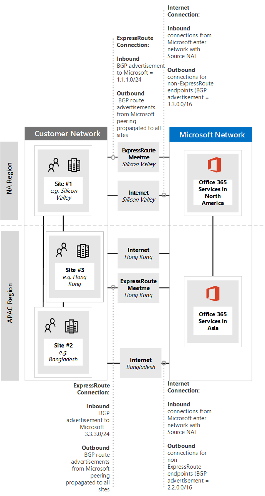

# <a name="implementing-expressroute-for-office-365"></a>Implementieren von ExpressRoute für Office 365

*Dieser Artikel gilt sowohl für Microsoft 365 Enterprise als auch für Office 365 Enterprise.*

ExpressRoute für Office 365 bietet einen alternativen Routingpfad zu vielen Office 365-Diensten mit Internetzugriff. Die Architektur von ExpressRoute für Office 365 basiert auf der Werbung für öffentliche IP-Präfixe von Office 365-Diensten, auf die bereits über das Internet zugegriffen werden kann, in Ihre bereitgestellten ExpressRoute-Schaltungen für die nachfolgende Verteilung dieser IP-Präfixe in Ihr Netzwerk. Mit ExpressRoute können Sie für viele Office 365-Dienste mehrere verschiedene Routingpfade über das Internet und expressRoute aktivieren. Dieser Routingstatus in Ihrem Netzwerk kann eine wesentliche Änderung der Internen Netzwerktopologie darstellen.
  
 **Status:** Vollständiger Leitfaden v2
  
Sie müssen Ihre ExpressRoute für Office 365-Implementierung sorgfältig planen, um den Netzwerkkomplexen des Routings über eine dedizierte Schaltung mit Routen, die in Ihr Kernnetzwerk und das Internet eingesengt werden, zu helfen. Wenn Sie und Ihr Team die detaillierten Planungen und Tests in diesem Handbuch nicht durchführen, besteht ein hohes Risiko, dass sie zeitweise auftreten oder die Verbindung zu Office 365-Diensten insgesamt verloren geht, wenn die ExpressRoute-Schaltung aktiviert ist.
  
Um eine erfolgreiche Implementierung zu haben, müssen Sie Ihre Infrastrukturanforderungen analysieren, eine detaillierte Netzwerkbewertung und -planung durchgehen, den Rollout szenisch und kontrolliert planen und einen detaillierten Validierungs- und Testplan erstellen. Für eine große, verteilte Umgebung ist es nicht ungewöhnlich, Implementierungen über mehrere Monate zu sehen. Dieses Handbuch soll Ihnen bei der Planung helfen.
  
Umfangreiche erfolgreiche Bereitstellungen können sechs Monate in der Planung dauern und umfassen häufig Teammitglieder aus vielen Bereichen der Organisation, darunter Netzwerk-, Firewall- und Proxyserveradministratoren, Office 365-Administratoren, Sicherheit, Endbenutzersupport, Projektverwaltung und Führungskräftesponsoring. Ihre Investition in den Planungsprozess reduziert die Wahrscheinlichkeit, dass Bereitstellungsfehler auftreten, die zu Ausfallzeiten oder einer komplexen und kostspieligen Problembehandlung führen.
  
Wir erwarten, dass die folgenden Voraussetzungen erfüllt werden, bevor dieses Implementierungshandbuch gestartet wird.
  
1. Sie haben eine Netzwerkbewertung abgeschlossen, um festzustellen, ob ExpressRoute empfohlen und genehmigt wird.

2. Sie haben einen ExpressRoute-Netzwerkdienstanbieter ausgewählt. Hier finden Sie Details zu [den ExpressRoute-Partnern und Peeringstandorten.](/azure/expressroute/expressroute-locations)

3. Sie haben die [ExpressRoute-Dokumentation](https://azure.microsoft.com/documentation/services/expressroute/) bereits gelesen und verstanden, und Ihr internes Netzwerk ist in der Lage, die Voraussetzungen für ExpressRoute von Ende zu Ende zu erfüllen.

4. Ihr Team hat alle öffentlichen Anleitungen und Dokumentationen unter gelesen und die [https://aka.ms/expressrouteoffice365](./azure-expressroute.md) [https://aka.ms/ert](https://aka.ms/ert) Azure [ExpressRoute for Office 365-Schulungsreihe](https://channel9.msdn.com/series/aer) auf Kanal 9 verfolgt, um sich ein Verständnis kritischer technischer Details zu verschaffen, einschließlich:

      - Die Internetabhängigkeiten von SaaS-Diensten.

      - Vermeiden asymmetrischer Routen und Behandeln komplexer Routings

      - Integrieren von Perimetersicherheits-, Verfügbarkeits- und Anwendungsebenensteuerelementen.

## <a name="begin-by-gathering-requirements"></a>Beginnen Sie mit dem Sammeln von Anforderungen
<a name="requirements"> </a>

Bestimmen Sie zunächst, welche Features und Dienste Sie in Ihrer Organisation übernehmen möchten. Sie müssen bestimmen, welche Features der verschiedenen Office 365-Dienste verwendet werden und welche Standorte in Ihrem Netzwerk Personen hosten, die diese Features verwenden. Mit dem Katalog der Szenarien müssen Sie die Netzwerkattribute hinzufügen, die für jedes dieser Szenarien erforderlich sind. wie eingehende und ausgehende Netzwerkdatenströme und ob die Office 365-Endpunkte über ExpressRoute verfügbar sind oder nicht.
  
So erfassen Sie die Anforderungen Ihrer Organisation:
  
- Katalogisieren Sie den eingehenden und ausgehenden Netzwerkdatenverkehr für die Office 365-Dienste, die Ihre Organisation verwendet. Auf der Seite Office 365-URLs und IP-Adressbereiche finden Sie eine Beschreibung der Flüsse, die für unterschiedliche Office 365-Szenarien erforderlich sind.

- Sammeln Sie eine Dokumentation der vorhandenen Netzwerktopologie, die Details ihres internen WAN-Backbones und Ihrer Topologie, die Konnektivität von Satellitenstandorten, die Benutzerkonnektivität der letzten Meile, das Routing zu Denresspunkten des Netzwerkperimeters und Proxydienste enthält.

  - Identifizieren Sie eingehende Dienstendpunkte in den Netzwerkdiagrammen, mit denen Office 365 und andere Microsoft-Dienste eine Verbindung herstellen, und zeigen Sie sowohl Internet- als auch vorgeschlagene ExpressRoute-Verbindungspfade an.

  - Identifizieren Sie alle geografischen Benutzerstandorte und die WAN-Konnektivität zwischen Standorten, zusammen mit den Standorten, an denen derzeit ein Zugang zum Internet besteht, und der Standorte, an denen ein Ausweg zu einem ExpressRoute-Peeringstandort vorgeschlagen wird.

  - Identifizieren Sie alle Edgegeräte, z. B. Proxys, Firewalls und so weiter, und katalogisieren Sie ihre Beziehung zu Flüssen, die über das Internet und ExpressRoute fließen.

  - Dokumentieren Sie, ob Endbenutzer über direktes Routing oder indirekten Anwendungsproxy für Internet- und ExpressRoute-Flüsse auf Office 365-Dienste zugreifen.

- Fügen Sie dem Netzwerkdiagramm den Speicherort Ihres Mandanten und Ihrer Meet-Me-Standorte hinzu.

- Schätzen Sie die erwarteten und beobachteten Netzwerkleistungs- und Latenzmerkmale von hauptbenutzerstandorten auf Office 365. Beachten Sie, dass Office 365 eine globale und verteilte Gruppe von Diensten ist und Benutzer verbindungen zu Standorten herstellen, die sich möglicherweise vom Standort ihres Mandanten unterscheiden. Aus diesem Grund wird empfohlen, die Wartezeit zwischen dem Benutzer und dem nächsten Rand des globalen Microsoft-Netzwerks über ExpressRoute- und Internetverbindungen zu messen und zu optimieren. Sie können Ihre Ergebnisse aus der Netzwerkbewertung verwenden, um diese Aufgabe zu erfüllen.

- Auflisten der Anforderungen an die Netzwerksicherheit und hohe Verfügbarkeit des Unternehmens, die mit der neuen ExpressRoute-Verbindung erfüllt werden müssen. Beispiel: Wie erhalten Benutzer weiterhin Zugriff auf Office 365, wenn der Internet-Egress oder der ExpressRoute-Stromkreis ausfallen.

- Dokumentieren Sie, welche eingehenden und ausgehenden Office 365-Netzwerkflüsse den Internetpfad verwenden und welche ExpressRoute verwenden. Die Geografischen Standorte Ihrer Benutzer und Details ihrer lokalen Netzwerktopologie erfordern möglicherweise, dass sich der Plan von einem Benutzerstandort zum anderen unterscheiden muss.

### <a name="catalog-your-outbound-and-inbound-network-traffic"></a>Katalogisieren des ausgehenden und eingehenden Netzwerkdatenverkehrs
<a name="trafficCatalog"> </a>

Um Routing und andere Netzwerkkomplexitäten zu minimieren, wird empfohlen, expressRoute für Office 365 nur für die Netzwerkdatenströme zu verwenden, die aufgrund gesetzlicher Anforderungen oder aufgrund der Netzwerkbewertung über eine dedizierte Verbindung gehen müssen. Darüber hinaus wird empfohlen, den Umfang des ExpressRoute-Routings zu stufen und ausgehenden und eingehenden Netzwerkdatenverkehr als unterschiedliche und unterschiedliche Phasen des Implementierungsprojekts zu verwenden. Bereitstellen von ExpressRoute für Office 365 für nur vom Benutzer initiierte ausgehende Netzwerkdatenströme und Verlassen eingehender Netzwerkdatenströme über das Internet können dazu beitragen, die zunahme der topologischen Komplexität und die Risiken der Einführung zusätzlicher asymmetrischer Routingmöglichkeiten zu steuern.
  
Ihr Netzwerkdatenverkehrkatalog sollte Auflistungen aller eingehenden und ausgehenden Netzwerkverbindungen enthalten, die Sie zwischen Ihrem lokalen Netzwerk und Microsoft haben.
  
- Ausgehende Netzwerkdatenströme sind Szenarien, in denen eine Verbindung von Ihrer lokalen Umgebung initiiert wird, z. B. von internen Clients oder Servern mit einem Ziel der Microsoft-Dienste. Diese Verbindungen können direkt zu Office 365 oder indirekt sein, z. B. wenn die Verbindung über Proxyserver, Firewalls oder andere Netzwerkgeräte auf dem Pfad zu Office 365 geht.

- Eingehende Netzwerkdatenströme sind Szenarien, in denen eine Verbindung von der Microsoft-Cloud zu einem lokalen Host initiiert wird. Diese Verbindungen müssen in der Regel über firewall und andere Sicherheitsinfrastrukturen verwendet werden, die die Kundensicherheitsrichtlinie für extern entstandene Flüsse benötigt.

Lesen  Sie den Abschnitt Sicherstellen der Routensymmetrie im Artikel [Routing mit ExpressRoute für Office 365,](https://support.office.com/article/Routing-with-ExpressRoute-for-Office-365-e1da26c6-2d39-4379-af6f-4da213218408) um zu bestimmen, welche Dienste eingehenden Datenverkehr senden, und suchen Sie nach der Spalte **ExpressRoute für Office 365** im [Office 365-Referenzartikel](https://support.office.com/article/Office-365-URLs-and-IP-address-ranges-8548a211-3fe7-47cb-abb1-355ea5aa88a2) für Endpunkte, um die restlichen Konnektivitätsinformationen zu ermitteln.
  
Für jeden Dienst, für den eine ausgehende Verbindung erforderlich ist, sollten Sie die geplante Verbindung für den Dienst beschreiben, einschließlich Netzwerkrouting, Proxykonfiguration, Paketprüfung und Bandbreitenanforderungen.
  
Für jeden Dienst, für den eine eingehende Verbindung erforderlich ist, benötigen Sie einige zusätzliche Informationen. Server in der Microsoft Cloud stellen Verbindungen mit Ihrem lokalen Netzwerk her. Um sicherzustellen, dass die Verbindungen ordnungsgemäß hergestellt werden, sollten Sie alle Aspekte dieser Konnektivität beschreiben, einschließlich; die öffentlichen DNS-Einträge für die Dienste, die diese eingehenden Verbindungen akzeptieren, die CIDR-formatierten IPv4-IP-Adressen, welche ISP-Geräte beteiligt sind und wie eingehende NAT oder Quell-NAT für diese Verbindungen verarbeitet wird.
  
Eingehende Verbindungen sollten unabhängig davon überprüft werden, ob sie eine Verbindung über das Internet oder ExpressRoute herstellen, um sicherzustellen, dass das asymmetrische Routing nicht eingeführt wurde. In einigen Fällen müssen lokale Endpunkte, mit denen Office 365-Dienste eingehende Verbindungen initiieren, möglicherweise auch von anderen Microsoft- und Nicht-Microsoft-Diensten zugegriffen werden. Es ist äußerst wichtig, dass das Aktivieren des ExpressRoute-Routings zu diesen Diensten für Office 365-Zwecke keine anderen Szenarien durchbricht. In vielen Fällen müssen Kunden möglicherweise bestimmte Änderungen an ihrem internen Netzwerk implementieren, z. B. quellbasiertes NAT, um sicherzustellen, dass eingehende Flüsse von Microsoft nach der Aktivierung von ExpressRoute symmetrisch bleiben.
  
Im Folgenden finden Sie ein Beispiel für die erforderliche Detailebene. In diesem Fall würde Exchange Hybrid über ExpressRoute zum lokalen System geroutet.

|**Connection-Eigenschaft**|**Wert**|
|:-----|:-----|
|**Richtung des Netzwerkdatenverkehrs** <br/> |Eingehend  <br/> |
|**Service** <br/> |Exchange Hybrid  <br/> |
|**Öffentlicher Office 365-Endpunkt (Quelle)** <br/> |Exchange Online (IP-Adressen)  <br/> |
|**Öffentlicher lokaler Endpunkt (Ziel)** <br/> |5.5.5.5  <br/> |
|**Öffentlicher (Internet)-DNS-Eintrag** <br/> |Autodiscover.contoso.com  <br/> |
|**Wird dieser lokale Endpunkt für andere (nicht office 365)-Dienste verwendet?** <br/> |Nein  <br/> |
|**Wird dieser lokale Endpunkt von Benutzern/Systemen im Internet verwendet?** <br/> |Ja  <br/> |
|**Interne Systeme, die über öffentliche Endpunkte veröffentlicht werden** <br/> |Exchange Server Clientzugriffsrolle (lokal) 192.168.101, 192.168.102, 192.168.103  <br/> |
|**IP-Ankündigung des öffentlichen Endpunkts** <br/> |**To Internet**: 5.5.0.0/16  <br/> **To ExpressRoute**: 5.5.5.0/24  <br/> |
|**Sicherheits-/Umkreissteuerelemente** <br/> |**Internetpfad**: DeviceID_002  <br/> **ExpressRoute-Pfad**: DeviceID_003  <br/> |
|**Hochverfügbarkeit** <br/> |Aktiv/Aktiv über 2 georedundant  <br/> ExpressRoute-Schaltungen – Chicago und Dallas  <br/> |
|**Pfadsymmetriesteuerelement** <br/> |**Methode**: Quell-NAT  <br/> **Internetpfad**: Eingehende Quell-NAT-Verbindungen zu 192.168.5.5  <br/> |**ExpressRoute-Pfad:** Quell-NAT-Verbindungen zu 192.168.1.0 (Chicago) und 192.168.2.0 (Dallas)  <br/> |

Hier ist ein Beispiel für einen Dienst, der nur ausgehend ist:

|**Connection-Eigenschaft**|**Wert**|
|:-----|:-----|
|**Richtung des Netzwerkdatenverkehrs** <br/> |Ausgehend  <br/> |
|**Service** <br/> |SharePoint Online  <br/> |
|**Lokale Endpunkte (Quelle)** <br/> |Benutzerarbeitsstation  <br/> |
|**Öffentlicher Office 365-Endpunkt (Ziel)** <br/> |SharePoint Online (IP-Adressen)  <br/> |
|**Öffentlicher (Internet)-DNS-Eintrag** <br/> |\*.sharepoint.com (und zusätzliche FQDNs)  <br/> |
|**CDN-Empfehlungen** <br/> |cdn.sharepointonline.com (und zusätzliche FQDNs) – VON CDN-Anbietern verwaltete IP-Adressen)  <br/> |
|**IP-Werbung und NAT in Verwendung** <br/> |**Internetpfad/Quell-NAT**: 1.1.1.0/24  <br/> **ExpressRoute-Pfad/Quell-NAT**: 1.1.2.0/24 (Chicago) und 1.1.3.0/24 (Dallas)  <br/> |
|**Connectivity-Methode** <br/> |**Internet**: über Den Layer 7-Proxy (PAC-Datei)  <br/> **ExpressRoute**: direktes Routing (kein Proxy)  <br/> |
|**Sicherheits-/Umkreissteuerelemente** <br/> |**Internetpfad**: DeviceID_002  <br/> **ExpressRoute-Pfad**: DeviceID_003  <br/> |
|**Hochverfügbarkeit** <br/> |**Internetpfad:** Redundanter Internet-Ausweg  <br/> **ExpressRoute-Pfad**: Aktives/Aktives Routing der Heißen Ffel über 2 georedundant verteilte ExpressRoute-Schaltungen – Chicago und Dallas  <br/> |
|**Pfadsymmetriesteuerelement** <br/> |**Methode**: Quell-NAT für alle Verbindungen  <br/> |

### <a name="your-network-topology-design-with-regional-connectivity"></a>Ihr Netzwerktopologieentwurf mit regionaler Konnektivität
<a name="topology"> </a>

Sobald Sie die Dienste und die zugehörigen Netzwerkdatenströme kennen, können Sie ein Netzwerkdiagramm erstellen, das diese neuen Konnektivitätsanforderungen enthält und die Änderungen veranschaulicht, die Sie bei der Verwendung von ExpressRoute für Office 365 vornehmen werden. Das Diagramm sollte Folgendes enthalten:
  
1. Alle Benutzerstandorte, von denen aus auf Office 365 und andere Dienste zugegriffen wird.

2. Alle Internet- und ExpressRoute-Ausgangspunkte.

3. Alle ausgehenden und eingehenden Geräte, die die Konnektivität im Netzwerk und aus dem Netzwerk verwalten, einschließlich Routern, Firewalls, Anwendungsproxyservern und Angriffserkennung/-verhinderung.

4. Interne Ziele für den eingehenden Datenverkehr, z. B. interne ADFS-Server, die Verbindungen von den ADFS-Webanwendungsproxyservern akzeptieren.

5. Katalog aller angekündigten IP-Subnetze

6. Identifizieren Sie jeden Ort, von dem aus Personen auf Office 365 zugreifen, und listen Sie die Meet-Me-Standorte auf, die für ExpressRoute verwendet werden.

7. Speicherorte und Teile Ihrer internen Netzwerktopologie, in denen Microsoft-IP-Präfixe, die von ExpressRoute gelernt wurden, akzeptiert, gefiltert und an diese verteilt werden.

8. Die Netzwerktopologie sollte den geografischen Standort der einzelnen Netzwerksegmente und die Verbindung mit dem Microsoft-Netzwerk über ExpressRoute und/oder das Internet veranschaulichen.

Das folgende Diagramm zeigt jeden Ort, an dem Personen Office 365 zusammen mit den ein- und ausgehenden Routinganzeigen an Office 365 verwenden.
  

  
Für ausgehenden Datenverkehr greifen die Benutzer auf drei Arten auf Office 365 zu:
  
1. Über einen Meet-Me-Standort in Nordamerika für die Menschen in Kalifornien.

2. Über einen Meet-Me-Ort in Hongkong für die Menschen in Hongkong.

3. Über das Internet in Bangladesch, wo weniger Personen und keine ExpressRoute-Schaltung bereitgestellt sind.


  
Auf ähnliche Weise gibt der eingehende Netzwerkdatenverkehr von Office 365 auf eine von drei Arten zurück:
  
1. Über einen Meet-Me-Standort in Nordamerika für die Menschen in Kalifornien.

2. Über einen Meet-Me-Ort in Hongkong für die Menschen in Hongkong.

3. Über das Internet in Bangladesch, wo weniger Personen und keine ExpressRoute-Schaltung bereitgestellt sind.


  
### <a name="determine-the-appropriate-meet-me-location"></a>Ermitteln des geeigneten Meet-Me-Standorts

Die Auswahl der Meet-Me-Standorte, bei denen es sich um den physischen Standort handelt, an dem Ihre ExpressRoute-Schaltung Ihr Netzwerk mit dem Microsoft-Netzwerk verbindet, wird durch die Standorte beeinflusst, von denen aus Personen auf Office 365 zugreifen. Als SaaS-Angebot funktioniert Office 365 nicht wie Azure unter dem regionalen IaaS- oder PaaS-Modell. Stattdessen handelt es sich bei Office 365 um eine verteilte Gruppe von Diensten für die Zusammenarbeit, bei denen Benutzer möglicherweise eine Verbindung zu Endpunkten über mehrere Rechenzentren und Regionen hinweg herstellen müssen, die sich möglicherweise nicht unbedingt am gleichen Standort oder in derselben Region befinden, in der der Mandant des Benutzers gehostet wird.
  
Dies bedeutet, dass die wichtigste Überlegung, die Sie bei der Auswahl von Meet-Me-Standorten für ExpressRoute für Office 365 treffen müssen, der Ort ist, von dem die Personen in Ihrer Organisation eine Verbindung herstellen. Die allgemeine Empfehlung für eine optimale Office 365-Konnektivität ist das Implementieren von Routing, sodass Benutzeranforderungen an Office 365-Dienste über den kürzesten Netzwerkpfad an das Microsoft-Netzwerk übergeben werden, was auch häufig als "Hot-Routing" bezeichnet wird. Wenn sich die meisten Office 365-Benutzer beispielsweise an einem oder zwei Speicherorten befinden, wird das optimale Design durch Auswählen von Meet-Me-Standorten erstellt, die sich in der nähesten Nähe des Standorts dieser Benutzer befinden. Wenn Ihr Unternehmen über große Benutzerpopulationen in vielen verschiedenen Regionen verfügt, sollten Sie mehrere ExpressRoute-Schaltungen und Meet-Me-Standorte in Betracht ziehen. Für einige Ihrer Benutzerstandorte ist der kürzeste/optimale Pfad zu Microsoft Network und Office 365 möglicherweise nicht über Ihre internen WAN- und ExpressRoute-Meet-Me-Punkte, sondern über das Internet.
  
Häufig gibt es mehrere Meet-Me-Standorte, die innerhalb einer Region mit relativer Nähe zu Ihren Benutzern ausgewählt werden könnten. Füllen Sie die folgende Tabelle aus, um Ihre Entscheidungen zu leiten.

|**Geplante ExpressRoute-Meet-Me-Standorte in Kalifornien und New York**||
|:-----|:-----|
|Ort  <br/> |Anzahl der Personen  <br/> |Erwartete Latenz für Microsoft-Netzwerk über Internet-Abgress  <br/> |Erwartete Wartezeit für das Microsoft-Netzwerk über ExpressRoute  <br/> |
|München  <br/> |10,000  <br/> |~15ms  <br/> |~10 ms (über das Silicon Valley)  <br/> |
|Washington DC  <br/> |15,000  <br/> |~20 ms  <br/> |~10 ms (über New York)  <br/> |
|Dallas  <br/> |5,000  <br/> |~15ms  <br/> |~40 ms (über New York)  <br/> |

Sobald die globale Netzwerkarchitektur, die die Office 365-Region, die Standorte des ExpressRoute-Netzwerkdienstanbieters und die Anzahl der Personen nach Standort entwickelt hat, entwickelt wurde, kann sie verwendet werden, um zu ermitteln, ob Optimierungen vorgenommen werden können. Es kann auch globale Hairpin-Netzwerkverbindungen anzeigen, bei denen der Datenverkehr an einen entfernten Ort weitergeroutet wird, um den Ort des Treffens zu erhalten. Wenn eine Haarnadel im globalen Netzwerk erkannt wird, sollte sie vor dem Fortfahren behoben werden. Suchen Sie entweder einen anderen Meet-Me-Standort, oder verwenden Sie selektive Internet-Breakout-Ausgangspunkte, um die Haarnadel zu vermeiden.
  
Das erste Diagramm zeigt ein Beispiel für einen Kunden mit zwei physischen Standorten in Nordamerika. Sie können die Informationen zu Bürostandorten, Office 365-Mandantenstandorten und verschiedenen Optionen für ExpressRoute-Meet-Me-Standorte sehen. In diesem Beispiel hat der Kunde den Meet-Me-Standort basierend auf zwei Prinzipien ausgewählt, um:
  
1. Die nähe zu den Personen in ihrer Organisation.

2. In der Nähe eines Microsoft-Rechenzentrums, in dem Office 365 gehostet wird.


  
Das zweite Diagramm, das dieses Konzept etwas weiter ausdehnt, zeigt ein Beispiel für multinationale Kunden, die mit ähnlichen Informationen und Entscheidungen konfrontiert sind. Dieser Kunde verfügt über ein kleines Büro in Bangladesch mit nur einem kleinen Team von zehn Personen, das sich darauf konzentriert, seinen Platzbedarf in der Region zu verbessern. Es gibt einen Meet-Me-Standort in Chennai und ein Microsoft-Rechenzentrum mit Office 365, das in Chennai gehostet wird, sodass ein Meet-Me-Standort sinnvoll wäre. Für zehn Personen sind die Kosten der zusätzlichen Schaltung jedoch belastend. Wenn Sie sich Ihr Netzwerk anschauen, müssen Sie feststellen, ob die Latenz, die beim Senden ihres Netzwerkdatenverkehrs über Ihr Netzwerk verbunden ist, effektiver ist, als das Kapital für den Erwerb einer anderen ExpressRoute-Schaltung zu verwenden.
  
Alternativ können die zehn Personen in Bangladesch mit ihrem Netzwerkdatenverkehr, der über das Internet an das Microsoft-Netzwerk gesendet wird, eine bessere Leistung erzielen, als sie über ihr internes Netzwerk weiterleiten würden, wie wir in den einführungsdiagrammen gezeigt und unten dargestellt haben.
  

  
## <a name="create-your-expressroute-for-office-365-implementation-plan"></a>Erstellen ihres ExpressRoute für Office 365-Implementierungsplans
<a name="implementation"> </a>

Der Implementierungsplan sollte sowohl die technischen Details der Konfiguration von ExpressRoute als auch die Details zum Konfigurieren aller anderen Infrastruktur in Ihrem Netzwerk umfassen, z. B. die folgenden.
  
- Planen Sie, welche Dienste zwischen ExpressRoute und Internet aufgeteilt werden.

- Planen von Bandbreite, Sicherheit, hoher Verfügbarkeit und Failover.

- Entwerfen des eingehenden und ausgehenden Routings, einschließlich ordnungsgemäßer Routingpfadoptimierungen für verschiedene Speicherorte

- Entscheiden Sie, wie weit #A0 in Ihrem Netzwerk angekündigt werden und was der Mechanismus ist, mit dem Clients Internet- oder #A1 auswählen können. z. B. direktes Routing oder Anwendungsproxy.

- Planen von ÄNDERUNGEN an DNS-Einträgen, einschließlich [Sender Policy Framework-Einträgen.](../security/defender-365-security/set-up-spf-in-office-365-to-help-prevent-spoofing.md)

- Planen der NAT-Strategie einschließlich ausgehender und eingehender Quell-NAT.

### <a name="plan-your-routing-with-both-internet-and-expressroute-network-paths"></a>Planen des Routings mit Internet- und ExpressRoute-Netzwerkpfaden
<a name="paths"> </a>

- Für Ihre anfängliche Bereitstellung wird empfohlen, dass alle eingehenden Dienste, z. B. eingehende E-Mails oder Hybridverbindungen, das Internet verwenden.

- Planen des Client-LAN-Routings für Endbenutzer, z. B. Konfigurieren einer [PAC/WPAD-Datei,](./managing-office-365-endpoints.md)Standardroute, Proxyserver und BGP-Routenanzeigen.

- Planen des Umkreisroutings, einschließlich Proxyservern, Firewalls und Cloudproxys.

### <a name="plan-your-bandwidth-security-high-availability-and-failover"></a>Planen der Bandbreite, Sicherheit, Hochverfügbarkeit und Failover
<a name="availability"> </a>

Erstellen Sie einen Plan für die Bandbreite, die für jede wichtige Office 365-Arbeitsauslastung erforderlich ist. Separates Schätzen der Bandbreitenanforderungen für Exchange Online, SharePoint Online und Skype for Business Online. Sie können die Schätzrechner, die wir für Exchange Online und Skype for Business bereitgestellt haben, als Ausgangspunkt verwenden. Ein Pilottest mit einem repräsentativen Beispiel der Benutzerprofile und Standorte ist jedoch erforderlich, um die Bandbreitenanforderungen Ihrer Organisation vollständig zu verstehen.
  
Fügen Sie hinzu, wie die Sicherheit an den einzelnen Internet- und ExpressRoute-Ausgangsstandorten zu Ihrem Plan verarbeitet wird, denken Sie daran, dass alle ExpressRoute-Verbindungen zu Office 365 öffentliches Peering verwenden und weiterhin in Übereinstimmung mit den Sicherheitsrichtlinien Ihres Unternehmens für die Verbindung mit externen Netzwerken gesichert werden müssen.
  
Fügen Sie Details zu Ihrem Plan hinzu, welche Personen von welchem Ausfalltyp betroffen sind und wie diese Personen ihre Arbeit auf einfachste Weise in voller Kapazität ausführen können.
  
#### <a name="plan-bandwidth-requirements-including-skype-for-business-requirements-on-jitter-latency-congestion-and-headroom"></a>Planen von Bandbreitenanforderungen, einschließlich Skype for Business-Anforderungen für Jitter, Latenz, Überlastung und Headroom
  
Skype for Business Online hat auch spezifische zusätzliche Netzwerkanforderungen, die im Artikel Medienqualität und Netzwerkkonnektivitätsleistung [in Skype for Business Online ausführlich beschrieben werden.](https://support.office.com/article/Media-Quality-and-Network-Connectivity-Performance-in-Skype-for-Business-Online-5fe3e01b-34cf-44e0-b897-b0b2a83f0917)
  
Lesen Sie den Abschnitt **Bandbreitenplanung für Azure ExpressRoute** in [der Netzwerkplanung mit ExpressRoute für Office 365](https://support.office.com/article/Network-planning-with-ExpressRoute-for-Office-365-103208f1-e788-4601-aa45-504f896511cd).
  
Wenn Sie eine Bandbreitenbewertung mit Ihren Pilotbenutzern durchführen, können Sie unseren Leitfaden verwenden. [Office 365-Leistungsoptimierung mithilfe von Baselines und Leistungsverlauf](https://support.office.com/article/Office-365-performance-tuning-using-baselines-and-performance-history-1492cb94-bd62-43e6-b8d0-2a61ed88ebae).
  
#### <a name="plan-for-high-availability-requirements"></a>Planen von Anforderungen an hohe Verfügbarkeit
  
Erstellen Sie einen Plan für hohe Verfügbarkeit, um Ihre Anforderungen zu erfüllen, und integrieren Sie diesen in Ihr aktualisiertes Netzwerktopologiediagramm. Lesen Sie den Abschnitt **Hohe Verfügbarkeit und Failover mit Azure ExpressRoute** in der [Netzwerkplanung mit ExpressRoute für Office 365](https://support.office.com/article/Network-planning-with-ExpressRoute-for-Office-365-103208f1-e788-4601-aa45-504f896511cd).
  
#### <a name="plan-for-network-security-requirements"></a>Planen von Netzwerksicherheitsanforderungen
  
Erstellen Sie einen Plan, um Ihre Netzwerksicherheitsanforderungen zu erfüllen, und integrieren Sie diesen in Ihr aktualisiertes Netzwerktopologiediagramm. Lesen Sie den Abschnitt **Anwenden von Sicherheitssteuerelementen auf Azure ExpressRoute für Office 365-Szenarien** in [Netzwerkplanung mit ExpressRoute für Office 365](https://support.office.com/article/Network-planning-with-ExpressRoute-for-Office-365-103208f1-e788-4601-aa45-504f896511cd).
  
### <a name="design-outbound-service-connectivity"></a>Entwerfen der ausgehenden Dienstkonnektivität
<a name="outbound"> </a>

ExpressRoute für Office 365 hat  *ausgehende*  Netzwerkanforderungen, die möglicherweise nicht vertraut sind. Insbesondere die IP-Adressen, die Ihre Benutzer und Netzwerke für Office 365 darstellen und als Quellendpunkte für ausgehende Netzwerkverbindungen mit Microsoft fungieren, müssen bestimmte Anforderungen erfüllen, die unten beschrieben sind.
  
1. Die Endpunkte müssen öffentliche IP-Adressen sein, die für Ihr Unternehmen oder den Netzbetreiber registriert sind, der Ihnen eine ExpressRoute-Verbindung bietet.

2. Die Endpunkte müssen microsoft angekündigt und von ExpressRoute überprüft/akzeptiert werden.

3. Die Endpunkte dürfen nicht mit derselben oder mehreren bevorzugten Routingmetrik im Internet angekündigt werden.

4. Die Endpunkte dürfen nicht für die Verbindung mit Microsoft-Diensten verwendet werden, die nicht über ExpressRoute konfiguriert sind.

Wenn Ihr Netzwerkentwurf diese Anforderungen nicht erfüllt, besteht ein hohes Risiko, dass Ihre Benutzer aufgrund von black holing oder asymmetrischem Routing Konnektivitätsfehler mit Office 365 und anderen Microsoft-Diensten haben. Dies tritt auf, wenn Anforderungen an Microsoft-Dienste über ExpressRoute geroutet werden, Antworten jedoch über das Internet oder umgekehrt zurückgeleitet werden und die Antworten von Zustandsnetzwerkgeräten wie Firewalls gelöscht werden.
  
Die häufigste Methode, die Sie verwenden können, um die oben genannten Anforderungen zu erfüllen, ist die Verwendung der Quell-NAT, die entweder als Teil Ihres Netzwerks implementiert oder von Ihrem ExpressRoute-Netzbetreiber bereitgestellt wird. Mit der Quell-NAT können Sie die Details und die private #A0 Ihres Internetnetzwerks von ExpressRoute und abstrahieren. Stellen Sie in Verbindung mit richtigen IP-Routenanzeigen einen einfachen Mechanismus zur Sicherstellung der Pfadsymmetrie zur Verfügung. Wenn Sie zustandsgehaftete Netzwerkgeräte verwenden, die für ExpressRoute-Peeringstandorte spezifisch sind, müssen Sie separate NAT-Pools für jedes ExpressRoute-Peering implementieren, um die Pfadsymmetrie sicherzustellen.
  
Weitere Informationen zu den [ExpressRoute-NAT-Anforderungen](/azure/expressroute/expressroute-nat)finden Sie unter .
  
Fügen Sie die Änderungen für die ausgehende Verbindung dem Netzwerktopologiediagramm hinzu.
  
### <a name="design-inbound-service-connectivity"></a>Entwerfen eingehender Dienstkonnektivität
<a name="inbound"> </a>

Die Mehrzahl der Office 365-Unternehmensbereitstellungen setzt eine Art eingehender Konnektivität von Office 365 zu lokalen Diensten voraus, z. B. für Exchange-, SharePoint- und Skype for Business-Hybridszenarien, Postfachmigrationen und Authentifizierung mithilfe der ADFS-Infrastruktur. Wenn Sie expressRoute einen zusätzlichen Routingpfad zwischen Ihrem lokalen Netzwerk und Microsoft für ausgehende Verbindungen aktivieren, können diese eingehenden Verbindungen versehentlich von asymmetrischem Routing betroffen sein, auch wenn Sie beabsichtigen, dass diese Flüsse weiterhin das Internet verwenden. Es werden einige unten beschriebene Vorsichtsmaßnahmen empfohlen, um sicherzustellen, dass keine Auswirkungen auf eingehende Internetflüsse von Office 365 auf lokale Systeme entstehen.
  
Um die Risiken des asymmetrischen Routings für eingehende Netzwerkdatenströme zu minimieren, sollten alle eingehenden Verbindungen Quell-NAT verwenden, bevor sie in Segmente Ihres Netzwerks mit Routingtransparenz in ExpressRoute geroutet werden. Wenn eingehende Verbindungen mit einem Netzwerksegment mit Routingtransparenz in ExpressRoute ohne Quell-NAT zulässig sind, werden Anforderungen aus Office 365 aus dem Internet eingehen, aber die Antwort, die zurück zu Office 365 geht, bevorzugt den ExpressRoute-Netzwerkpfad zurück zum Microsoft-Netzwerk, was zu asymmetrischem Routing führt.
  
Sie können eines der folgenden Implementierungsmuster in Betracht ziehen, um diese Anforderung zu erfüllen:
  
1. Führen Sie Quell-NAT aus, bevor Anforderungen mithilfe von Netzwerkgeräten wie Firewalls oder Lastenausgleichsgeräten auf dem Pfad vom Internet zu Ihren lokalen Systemen in Ihr internes Netzwerk geroutet werden.

2. Stellen Sie sicher, dass ExpressRoute-Routen nicht an die Netzwerksegmente verteilt werden, in denen sich eingehende Dienste wie Front-End-Server oder Reverseproxysysteme befinden, die Internetverbindungen behandeln.

Die explizite Abrechnung dieser Szenarien in Ihrem Netzwerk und das Halten aller eingehenden Netzwerkdatenströme über das Internet trägt dazu bei, das Bereitstellungs- und Betriebsrisiko des asymmetrischen Routings zu minimieren.
  
Es kann Fälle gibt, in denen Sie einige eingehende Flüsse über ExpressRoute-Verbindungen umleiten möchten. Berücksichtigen Sie in diesen Szenarien die folgenden zusätzlichen Überlegungen.
  
1. Office 365 kann nur auf lokale Endpunkte mit öffentlichen IPs zielen. Dies bedeutet, dass auch wenn der lokale eingehende Endpunkt nur für Office 365 über ExpressRoute verfügbar gemacht wird, ihm weiterhin öffentliche IP zugeordnet sein muss.

2. Alle DNS-Namensauflösung, die Office 365-Dienste zum Auflösen von lokalen Endpunkten ausführen, geschieht mithilfe von öffentlichem DNS. Dies bedeutet, dass Sie den FQDN eingehender Dienstendpunkte für IP-Zuordnungen im Internet registrieren müssen.

3. Zum Empfangen eingehender Netzwerkverbindungen über ExpressRoute müssen die öffentlichen IP-Subnetze für diese Endpunkte microsoft über ExpressRoute angekündigt werden.

4. Bewerten Sie diese eingehenden Netzwerkdatenströme sorgfältig, um sicherzustellen, dass entsprechende Sicherheits- und Netzwerkkontrollen entsprechend Ihren Unternehmenssicherheits- und Netzwerkrichtlinien auf sie angewendet werden.

5. Sobald Ihre lokalen eingehenden Endpunkte microsoft über ExpressRoute angekündigt wurden, wird ExpressRoute für alle Microsoft-Dienste, einschließlich Office 365, zum bevorzugten Routingpfad zu diesen Endpunkten. Dies bedeutet, dass diese Endpunktsubnetze nur für die Kommunikation mit Office 365-Diensten und keine anderen Dienste im Microsoft-Netzwerk verwendet werden dürfen. Andernfalls führt Ihr Entwurf zu asymmetrischem Routing, bei dem eingehende Verbindungen von anderen Microsoft-Diensten eingehende Routen über ExpressRoute bevorzugen, während der Rückgabepfad das Internet verwendet.

6. Wenn eine ExpressRoute-Schaltung oder ein Meet-Me-Standort nicht verfügbar ist, müssen Sie sicherstellen, dass die lokalen eingehenden Endpunkte weiterhin verfügbar sind, um Anforderungen über einen separaten Netzwerkpfad zu akzeptieren. Dies kann Werbesubnetze für diese Endpunkte über mehrere ExpressRoute-Schaltungen bedeuten.

7. Es wird empfohlen, die Quell-NAT für alle eingehenden Netzwerkdatenströme zu verwenden, die über ExpressRoute in Ihr Netzwerk fließen, insbesondere dann, wenn diese Flüsse zustandsbehaftete Netzwerkgeräte wie Firewalls kreuzen.

8. Einige lokale Dienste, z. B. ADFS-Proxy oder Exchange-AutoErmittlung, erhalten möglicherweise eingehende Anforderungen sowohl von Office 365-Diensten als auch von Benutzern aus dem Internet. Für diese Anforderungen wird office 365 auf denselben FQDN wie Benutzeranforderungen über das Internet zielen. Das Zulassen eingehender Benutzerverbindungen aus dem Internet zu diesen lokalen Endpunkten und das Erzwingen der Verwendung von ExpressRoute durch Office 365-Verbindungen stellt eine erhebliche Routingkomplexität dar. Für die große Mehrheit der Kunden, die solche komplexen Szenarien über ExpressRoute implementieren, wird aus betrieblichen Überlegungen nicht empfohlen. Dieser zusätzliche Aufwand umfasst das Verwalten von Risiken des asymmetrischen Routings und erfordert eine sorgfältige Verwaltung von Routinganzeigen und -richtlinien über mehrere Dimensionen hinweg.

### <a name="update-your-network-topology-plan-to-show-how-you-would-avoid-asymmetric-routes"></a>Aktualisieren Ihres Netzwerktopologieplans, um zu zeigen, wie Sie asymmetrische Routen vermeiden würden
<a name="asymmetric"> </a>

Sie möchten asymmetrisches Routing vermeiden, um sicherzustellen, dass Personen in Ihrer Organisation Office 365 sowie andere wichtige Dienste im Internet nahtlos nutzen können. Es gibt zwei allgemeine Konfigurationen, die zu asymmetrischem Routing führen. Jetzt ist es an der Zeit, die Netzwerkkonfiguration zu überprüfen, die Sie verwenden möchten, und zu überprüfen, ob eines dieser asymmetrischen Routingszenarien vorhanden sein könnte.
  
Zunächst untersuchen wir einige unterschiedliche Situationen im Zusammenhang mit dem folgenden Netzwerkdiagramm. In diesem Diagramm befinden sich alle Server, die eingehende Anforderungen empfangen, z. B. ADFS oder lokale Hybridserver, im Rechenzentrum von New Jersey und werden für das Internet angekündigt.
  
1. Während das Umkreisnetzwerk sicher ist, ist für eingehende Anforderungen keine Quell-NAT verfügbar.

2. Die Server im Rechenzentrum von New Jersey können sowohl Internet- als auch ExpressRoute-Routen sehen.


  
Wir haben auch Vorschläge, wie sie behoben werden können.
  
#### <a name="problem-1-cloud-to-on-premises-connection-over-the-internet"></a>Problem 1: Cloud-zu-lokale Verbindung über das Internet
  
Das folgende Diagramm veranschaulicht den asymmetrischen Netzwerkpfad, der verwendet wird, wenn Ihre Netzwerkkonfiguration keine NAT für eingehende Anforderungen aus der Microsoft-Cloud über das Internet bietet.
  
1. Die eingehende Anforderung von Office 365 ruft die IP-Adresse des lokalen Endpunkts aus dem öffentlichen DNS ab und sendet die Anforderung an Ihr Umkreisnetzwerk.

2. In dieser fehlerhaften Konfiguration ist im Umkreisnetzwerk, in dem der Datenverkehr gesendet wird, keine Quell-NAT konfiguriert oder verfügbar, was dazu führt, dass die tatsächliche Quell-IP-Adresse als Rückgabeziel verwendet wird.

  - Der Server in Ihrem Netzwerk leitet den Rückgabedatenverkehr über eine beliebige verfügbare ExpressRoute-Netzwerkverbindung an Office 365 weiter.

  - Das Ergebnis ist ein asymmetrischer Pfad für den Fluss zu Office 365, was zu einer unterbrochenen Verbindung führt.


  
##### <a name="solution-1a-source-nat"></a>Lösung 1a: Quell-NAT
  
Durch das einfache Hinzufügen einer Quell-NAT zur eingehenden Anforderung wird dieses falsch konfigurierte Netzwerk aufgelöst. Inhalt dieses Diagramms:
  
1. Die eingehende Anforderung wird weiterhin über das Umkreisnetzwerk des New Jersey-Rechenzentrums eingehen. Dieses Mal ist Quell-NAT verfügbar.

2. Die Antwort vom Server wird zurück an die DER Quell-NAT zugeordnete IP anstatt an die ursprüngliche IP-Adresse gesendet, was dazu führt, dass die Antwort entlang desselben Netzwerkpfads zurückkehrt.


  
##### <a name="solution-1b-route-scoping"></a>Lösung 1b: Routende scoping
  
Alternativ können Sie die Ankündigung der ExpressRoute-BGP-Präfixe nicht zulassen, indem Sie den alternativen Netzwerkpfad für diese Computer entfernen. Inhalt dieses Diagramms:
  
1. Die eingehende Anforderung wird weiterhin über das Umkreisnetzwerk des New Jersey-Rechenzentrums eingehen. Dieses Mal stehen die von Microsoft über die ExpressRoute-Schaltung angekündigten Präfixe für das Rechenzentrum in New Jersey nicht zur Verfügung.

2. Die Antwort vom Server wird zurück an die DER ursprünglichen IP-Adresse zugeordnete IP über die einzige verfügbare Route gesendet, was dazu führt, dass die Antwort entlang desselben Netzwerkpfads zurückkehrt.


  
#### <a name="problem-2-cloud-to-on-premises-connection-over-expressroute"></a>Problem 2: Cloud-zu-lokale Verbindung über ExpressRoute
  
Das folgende Diagramm veranschaulicht den asymmetrischen Netzwerkpfad, der verwendet wird, wenn Ihre Netzwerkkonfiguration keine NAT für eingehende Anforderungen aus der Microsoft Cloud über ExpressRoute bietet.
  
1. Die eingehende Anforderung von Office 365 ruft die IP-Adresse aus DNS ab und sendet die Anforderung an Ihr Umkreisnetzwerk.

2. In dieser fehlerhaften Konfiguration ist im Umkreisnetzwerk, in dem der Datenverkehr gesendet wird, keine Quell-NAT konfiguriert oder verfügbar, was dazu führt, dass die tatsächliche Quell-IP-Adresse als Rückgabeziel verwendet wird.

  - Der Computer in Ihrem Netzwerk leitet den Rückgabedatenverkehr über eine beliebige verfügbare ExpressRoute-Netzwerkverbindung an Office 365 weiter.

  - Das Ergebnis ist eine asymmetrische Verbindung mit Office 365.


  
##### <a name="solution-2-source-nat"></a>Lösung 2: Quell-NAT
  
Durch das einfache Hinzufügen einer Quell-NAT zur eingehenden Anforderung wird dieses falsch konfigurierte Netzwerk aufgelöst. Inhalt dieses Diagramms:
  
1. Die eingehende Anforderung wird weiterhin über das Umkreisnetzwerk des Rechenzentrums in New York eingehen. Dieses Mal ist Quell-NAT verfügbar.

2. Die Antwort vom Server wird zurück an die DER Quell-NAT zugeordnete IP anstatt an die ursprüngliche IP-Adresse gesendet, was dazu führt, dass die Antwort entlang desselben Netzwerkpfads zurückkehrt.


  
### <a name="paper-verify-that-the-network-design-has-path-symmetry"></a>Paper verify that the network design has path symmetry

An dieser Stelle müssen Sie auf dem Papier überprüfen, ob Ihr Implementierungsplan eine Routensymmetrie für die verschiedenen Szenarien bietet, in denen Sie Office 365 verwenden. Sie identifizieren die bestimmte Netzwerkroute, die angenommen werden soll, wenn eine Person unterschiedliche Features des Diensts verwendet. Vom lokalen Netzwerk- und #A0 zu den Umkreisgeräten zum Verbindungspfad; ExpressRoute oder das Internet und die Verbindung mit dem Onlineendpunkt.
  
Sie müssen dies für alle Office 365-Netzwerkdienste tun, die zuvor als Dienste identifiziert wurden, die Ihre Organisation übernehmen wird.
  
Es hilft, dieses Papier durch Routen mit einer zweiten Person zu führen. Erläutern Sie ihnen, von wo aus jeder Netzwerkhop die nächste Route erwartet wird, und stellen Sie sicher, dass Sie mit den Routingpfaden vertraut sind. Denken Sie daran, dass ExpressRoute immer eine bereichsmäßige Route zu Microsoft Server-IP-Adressen bietet, die niedrigere Routenkosten als eine Standardroute im Internet bietet.
  
### <a name="design-client-connectivity-configuration"></a>Entwerfen der Clientverbindungskonfiguration
<a name="asymmetric"> </a>


  
Wenn Sie einen Proxyserver für internetgebundenen Datenverkehr verwenden, müssen Sie alle PAC- oder Clientkonfigurationsdateien anpassen, um sicherzustellen, dass Clientcomputer in Ihrem Netzwerk ordnungsgemäß konfiguriert sind, um den von Ihnen benötigten ExpressRoute-Datenverkehr an Office 365 zu senden, ohne den Proxyserver zu übertragen, und der verbleibende Datenverkehr, einschließlich einiger Office 365-Datenverkehr, wird an den entsprechenden Proxy gesendet. Lesen Sie unser Handbuch zum [Verwalten von Office 365-Endpunkten,](./managing-office-365-endpoints.md) z. B. PAC-Dateien.
  
> [!NOTE]
> Die Endpunkte ändern sich häufig, so oft wie wöchentlich. Sie sollten änderungen nur basierend auf den Diensten und Features vornehmen, die Ihre Organisation übernommen hat, um die Anzahl der Änderungen zu reduzieren, die Sie vornehmen müssen, um auf dem aktuellen Stand zu bleiben. Achten Sie auf  das Datum des Wirksamen Datums im RSS-Feed, in dem die Änderungen angekündigt werden und ein Datensatz aller früheren Änderungen aufbewahrt wird. Angekündigte IP-Adressen werden möglicherweise erst aus der Ankündigung angekündigt oder aus der Ankündigung entfernt, bis das Datum des wirksamen Datums erreicht ist.
  
## <a name="build-your-deployment-and-testing-procedures"></a>Erstellen von Bereitstellungs- und Testverfahren
<a name="testing"> </a>

Der Implementierungsplan sollte sowohl die Test- als auch die Rollbackplanung umfassen. Wenn Ihre Implementierung nicht wie erwartet funktioniert, sollte der Plan so konzipiert sein, dass er die geringste Anzahl von Personen betrifft, bevor Probleme erkannt werden. Im Folgenden finden Sie einige prinzipien auf hoher Ebene, die Ihr Plan berücksichtigen sollte.
  
1. Stage the network segment and user service onboarding to minimize disruption.

2. Planen von Testrouten mit traceroute und TCP-Verbindung von einem separaten mit dem Internet verbundenen Host.

3. Vorzugsweise sollten eingehende und ausgehende Dienste in einem isolierten Testnetzwerk mit einem Office 365-Test-Mandanten getestet werden.

      - Alternativ können Tests in einem Produktionsnetzwerk durchgeführt werden, wenn der Kunde Office 365 noch nicht verwendet oder sich im Pilotprojekt befindet.

      - Alternativ können Tests während eines Produktionsausfalls durchgeführt werden, der nur für Test und Überwachung festgelegt ist.

      - Alternativ können Tests durchgeführt werden, indem Routen für jeden Dienst auf jedem Layer 3-Routerknoten überprüft werden. Dieser Fall back sollte nur verwendet werden, wenn keine weiteren Tests möglich sind, da ein Mangel an physischen Tests ein Risiko mit sich bringt.

### <a name="build-your-deployment-procedures"></a>Erstellen von Bereitstellungsverfahren

Ihre Bereitstellungsverfahren sollten für kleine Personengruppen phasenweise bereitgestellt werden, um Tests vor der Bereitstellung für größere Personengruppen zu ermöglichen. Im Folgenden finden Sie mehrere Möglichkeiten, die Bereitstellung von ExpressRoute zu inszenieren.
  
1. Richten Sie ExpressRoute mit Microsoft-Peering ein, und lassen Sie die Routenanzeigen nur zu mehrstufigen Testzwecken an einen einzelnen Host weiterleiten.

2. Bewerben Sie Routen zum ExpressRoute-Netzwerk zunächst zu einem einzelnen Netzwerksegment, und erweitern Sie Routenanzeigen nach Netzwerksegment oder Region.

3. Wenn Sie Office 365 zum ersten Mal bereitstellen, verwenden Sie die ExpressRoute-Netzwerkbereitstellung als Pilotprojekt für eine kleine Anzahl von Personen.

4. Wenn Sie Proxyserver verwenden, können Sie alternativ eine TEST-PAC-Datei konfigurieren, um eine kleine Anzahl von Personen mit Tests und Feedback an ExpressRoute weiter zu senden, bevor Sie weitere hinzufügen.

Der Implementierungsplan sollte alle Bereitstellungsverfahren auflisten, die ausgeführt werden müssen, oder Befehle, die zum Bereitstellen der Netzwerkkonfiguration verwendet werden müssen. Wenn die Netzwerkausfallzeit eintrifft, sollten alle vorgenommenen Änderungen aus dem im Voraus geschriebenen und von Peers überprüften schriftlichen Bereitstellungsplan vorgenommen werden. Lesen Sie unsere Anleitungen zur technischen Konfiguration von ExpressRoute.
  
- Aktualisieren Ihrer SPF TXT-Einträge, wenn Sie die IP-Adressen für lokale Server geändert haben, die weiterhin E-Mails senden.

- Aktualisieren von DNS-Einträgen für lokale Server, wenn Sie die IP-Adressen geändert haben, um eine neue NAT-Konfiguration zu verwenden.

- Stellen Sie sicher, dass Sie den RSS-Feed für Office 365-Endpunktbenachrichtigungen abonniert haben, um Routing- oder Proxykonfigurationen zu verwalten.

Nach Abschluss der ExpressRoute-Bereitstellung sollten die Verfahren im Testplan ausgeführt werden. Die Ergebnisse für jede Prozedur sollten protokolliert werden. Sie müssen Verfahren für das Rollback zur ursprünglichen Produktionsumgebung angeben, wenn die Testplanergebnisse darauf hinweisen, dass die Implementierung nicht erfolgreich war.
  
### <a name="build-your-test-procedures"></a>Erstellen von Testverfahren

Ihre Testprozeduren sollten Tests für jeden ausgehenden und eingehenden Netzwerkdienst für Office 365 umfassen, die ExpressRoute verwenden und nicht. Die Verfahren sollten Tests von jedem eindeutigen Netzwerkstandort einschließlich der Benutzer umfassen, die nicht lokal im Unternehmens-LAN sind.
  
Beispiele für Testaktivitäten sind die folgenden.
  
1. Ping vom lokalen Router an den Router des Netzwerkbetreibers.

2. Überprüfen Sie, ob die 500 office 365- und CRM Online-IP-Adressanzeigen von Ihrem lokalen Router empfangen werden.

3. Überprüfen Sie, ob die eingehende und ausgehende NAT zwischen ExpressRoute und dem internen Netzwerk ausgeführt wird.

4. Überprüfen Sie, ob Routen zu Ihrer NAT von Ihrem Router aus angekündigt werden.

5. Überprüfen Sie, ob ExpressRoute Ihre angekündigten Präfixe akzeptiert hat.

      - Verwenden Sie das folgende Cmdlet, um Peeringanzeigen zu überprüfen:

      ```PowerShell
      Get-AzureRmExpressRouteCircuitRouteTable -DevicePath Primary -ExpressRouteCircuitName TestER -ResourceGroupName RG -PeeringType MicrosoftPeering
      ```

6. Überprüfen Sie, ob Ihr öffentlicher NAT-IP-Bereich für Microsoft nicht über eine andere ExpressRoute- oder öffentliche Internetnetzwerkverbindung angekündigt wird, es sei denn, es handelt sich um eine bestimmte Teilmenge eines größeren Bereichs wie im vorherigen Beispiel.

7. ExpressRoute-Schaltungen werden gekoppelt, um zu überprüfen, ob beide BGP-Sitzungen ausgeführt werden.

8. Richten Sie einen einzelnen Host im Inneren Ihrer NAT ein, und verwenden Sie Ping, Tracert und Tcpping, um die Verbindung zwischen der neuen Schaltung und dem Hostcomputer outlook.office365.com. Alternativ können Sie ein Tool wie Wireshark oder Microsoft Network Monitor 3.4 an einem gespiegelten Port zum MSEE verwenden, um zu überprüfen, ob Sie eine Verbindung mit der ip-Adresse herstellen können, die outlook.office365.com.

9. Testen der Funktionalität auf Anwendungsebene für Exchange Online.

  - Test Outlook kann eine Verbindung mit Exchange Online herstellen und E-Mails senden/empfangen.

  - Test Outlook kann den Onlinemodus verwenden.

  - Testen sie die Smartphonekonnektivität und die Sende-/Empfangsfunktion.

10. Testen der Funktionalität auf Anwendungsebene für SharePoint Online

  - Testen Sie den OneDrive for Business-Synchronisierungsclient.

  - Testen des SharePoint Online-Webzugriffs.

11. Testen der Funktionalität auf Anwendungsebene für Skype for Business-Anrufszenarien:

  - Teilnehmen an Konferenzanrufen als authentifizierter Benutzer [vom Endbenutzer initiierte Einladung].

  - Einladen des Benutzers zum Telefonkonferenzanruf [von MCU gesendete Einladung].

  - Nehmen Sie als anonymer Benutzer mit der Skype for Business-Webanwendung an einer Konferenz teil.

  - Nehmen Sie an Anrufen über Ihre kabelgebundene PC-Verbindung, Ihr IP-Telefon und ihr mobiles Gerät teil.

  - Anruf beim Verbundbenutzer o Anruf bei der PSTN-Überprüfung: Anruf ist abgeschlossen, Anrufqualität ist akzeptabel, Verbindungszeit ist akzeptabel.

  - Überprüfen Sie, ob der Anwesenheitsstatus für Kontakte sowohl für Mitglieder des Mandanten als auch für Verbundbenutzer aktualisiert wird.

### <a name="common-problems"></a>Häufige Probleme

Asymmetrisches Routing ist das häufigste Implementierungsproblem. Hier sind einige häufig verwendete Quellen, die Sie suchen müssen:
  
- Verwenden einer offenen oder flachen Netzwerkroutingtopologie ohne Quell-NAT.

- Verwenden Sie SNAT nicht, um eingehende Dienste über das Internet und expressRoute-Verbindungen zu routen.

- Testen eingehender Dienste auf ExpressRoute in einem Testnetzwerk vor der allgemeinen Bereitstellung nicht.

## <a name="deploying-expressroute-connectivity-through-your-network"></a>Bereitstellen der ExpressRoute-Konnektivität über Ihr Netzwerk
<a name="testing"> </a>

Stufen Sie die Bereitstellung für jeweils einen Abschnitt des Netzwerks ein, und stellen Sie schrittweise die Konnektivität zu verschiedenen Teilen des Netzwerks mit einem Plan zum Rollback für jedes neue Netzwerksegment ein. Wenn Ihre Bereitstellung an einer Office 365-Bereitstellung ausgerichtet ist, stellen Sie sie zuerst für Ihre Office 365-Pilotbenutzer zur Verfügung und erweitern Sie von dort aus.
  
Zuerst für den Test und dann für die Produktion:
  
- Führen Sie die Bereitstellungsschritte aus, um ExpressRoute zu aktivieren.

- Testen Sie, ob die Netzwerkrouten wie erwartet sind.

- Führen Sie Tests für jeden eingehenden und ausgehenden Dienst durch.

- Rollback, wenn Probleme auftreten.

### <a name="set-up-a-test-connection-to-expressroute-with-a-test-network-segment"></a>Einrichten einer Testverbindung mit ExpressRoute mit einem Testnetzwerksegment

Nachdem Sie nun den abgeschlossenen Plan auf Dem Papier haben, ist es an der Zeit, einen kleinen Test zu erstellen. In diesem Test richten Sie eine einzelne ExpressRoute-Verbindung mit Microsoft Peering mit einem Testsubnetz in Ihrem lokalen Netzwerk ein. Sie können einen Office [365-Test-Mandanten](https://go.microsoft.com/fwlink/p/?LinkID=403802) mit Konnektivität zum und vom Testsubnetz konfigurieren und alle ausgehenden und eingehenden Dienste, die Sie in der Produktion im Testsubnetz verwenden, enthalten. Richten Sie DNS für das Testnetzwerksegment ein, und richten Sie alle eingehenden und ausgehenden Dienste ein. Führen Sie Den Testplan aus, und stellen Sie sicher, dass Sie mit dem Routing für jeden Dienst und der Routenverteilung vertraut sind.
  
### <a name="execute-the-deployment-and-test-plans"></a>Ausführen der Bereitstellungs- und Testpläne

Wenn Sie die oben beschriebenen Elemente abschließen, überprüfen Sie die bereiche, die Sie abgeschlossen haben, und stellen Sie sicher, dass Sie und Ihr Team sie überprüft haben, bevor Sie Ihre Bereitstellungs- und Testpläne ausführen.
  
- Liste der ausgehenden und eingehenden Dienste, die an der Netzwerkänderung beteiligt sind.

- Diagramm der globalen Netzwerkarchitektur mit Internet-Ausgangs- und ExpressRoute-Meet-Me-Standorten.

- Netzwerkroutingdiagramm mit den verschiedenen Netzwerkpfaden, die für jeden bereitgestellten Dienst verwendet werden.

- Ein Bereitstellungsplan mit Schritten zum Implementieren der Änderungen und rollback bei Bedarf.

- Ein Testplan zum Testen der einzelnen Office 365- und Netzwerkdienste.

- Abgeschlossene Papierüberprüfung der Produktionsrouten für eingehende und ausgehende Dienste.

- Ein abgeschlossener Test in einem Testnetzwerksegment, einschließlich Verfügbarkeitstests.

Wählen Sie ein Ausfallfenster aus, das lang genug ist, um den gesamten Bereitstellungsplan und den Testplan durchlaufen zu können. Für die Problembehandlung steht einige Zeit zur Verfügung, und bei Bedarf kann ein Rollback ausgeführt werden.
  
> [!CAUTION]
> Aufgrund der Komplexität des Routings über das Internet und ExpressRoute wird empfohlen, diesem Fenster zusätzliche Pufferzeit zur Behandlung der Problembehandlung bei komplexen Routings zu hinzufügen.
  
### <a name="configure-qos-for-skype-for-business-online"></a>Konfigurieren von QoS für Skype for Business Online

QoS ist erforderlich, um Sprach- und Besprechungsvorteile für Skype for Business Online zu erhalten. Sie können QoS konfigurieren, nachdem Sie sichergestellt haben, dass die ExpressRoute-Netzwerkverbindung keinen ihrer anderen Office 365-Dienstzugriffe blockiert. Die Konfiguration für QoS wird im Artikel [ExpressRoute und QoS in Skype for Business Online beschrieben.](https://support.office.com/article/ExpressRoute-and-QoS-in-Skype-for-Business-Online-20c654da-30ee-4e4f-a764-8b7d8844431d)
  
## <a name="troubleshooting-your-implementation"></a>Problembehandlung bei der Implementierung
<a name="troubleshooting"> </a>

Der erste Ort, um die Schritte in diesem Implementierungshandbuch zu sehen, wurden in Ihrem Implementierungsplan verpasst? Gehen Sie zurück, und führen Sie nach Möglichkeit weitere Tests für kleine Netzwerke aus, um den Fehler zu replizieren und dort zu debuggen.
  
Identifizieren Sie, welche eingehenden oder ausgehenden Dienste während der Tests fehlgeschlagen sind. Get specifically the IP addresses and subnets for each of the services which failed. Gehen Sie voran, und gehen Sie das Netzwerktopologiediagramm auf Papier durch, und überprüfen Sie das Routing. Überprüfen Sie insbesondere, wo das ExpressRoute-Routing angekündigt wird, Testen Sie dieses Routing während des Ausfalls, wenn möglich, mit Ablaufverfolgungen.
  
Führen Sie PSPing mit einer Netzwerkverfolgung zu jedem Kundenendpunkt aus, und werten Sie Quell- und Ziel-IP-Adressen aus, um zu überprüfen, ob sie wie erwartet sind. Führen Sie telnet für jeden E-Mail-Host aus, den Sie an Port 25 verfügbar machen, und vergewissern Sie sich, dass SNAT die ursprüngliche Quell-IP-Adresse ausblenden wird, wenn dies erwartet wird.
  
Beachten Sie, dass Sie bei der Bereitstellung von Office 365 mit einer ExpressRoute-Verbindung sicherstellen müssen, dass sowohl die Netzwerkkonfiguration für ExpressRoute optimal entworfen ist als auch die anderen Komponenten in Ihrem Netzwerk optimiert wurden, z. B. Clientcomputer. Zusätzlich zur Verwendung dieses Planungshandbuchs zur Problembehandlung der möglicherweise verpassten Schritte haben wir auch einen Plan zur Problembehandlung bei Der Leistung für [Office 365 geschrieben.](https://support.office.com/article/Performance-troubleshooting-plan-for-Office-365-e241e5d9-b1d8-4f1d-a5c8-4106b7325f8c)
  
Mit diesem kurzen Link gelangen Sie wieder hierher zurück: [https://aka.ms/implementexpressroute365]()
  
## <a name="related-topics"></a>Verwandte Themen

[Bewerten der Office 365-Netzwerkkonnektivität](assessing-network-connectivity.md)
  
[Azure ExpressRoute für Office 365](azure-expressroute.md)
  
[Verwalten von ExpressRoute für Office 365-Verbindungen](managing-expressroute-for-connectivity.md)
  
[Routing mit ExpressRoute für Office 365](routing-with-expressroute.md)
  
[Netzwerkplanung mit ExpressRoute für Office 365](network-planning-with-expressroute.md)
  
[Verwenden von BGP-Communitys in ExpressRoute für Office 365-Szenarien](bgp-communities-in-expressroute.md)
  
[Medienqualität und Netzwerkverbindungsleistung in Skype for Business Online](https://support.office.com/article/5fe3e01b-34cf-44e0-b897-b0b2a83f0917)
  
[Optimieren Ihres Netzwerks für Skype for Business Online](https://support.office.com/article/b363bdca-b00d-4150-96c3-ec7eab5a8a43)
  
[ExpressRoute und QoS in Skype for Business Online](https://support.office.com/article/20c654da-30ee-4e4f-a764-8b7d8844431d)
  
[Anruffluss mit ExpressRoute](https://support.office.com/article/413acb29-ad83-4393-9402-51d88e7561ab)
  
[Office 365-Leistungsoptimierung mit Basisplänen und Leistungsverlauf](performance-tuning-using-baselines-and-history.md)
  
[Plan zur Problembehandlung für Office 365](performance-troubleshooting-plan.md)
  
[URLs und IP-Adressbereiche für Office 365](https://support.office.com/article/8548a211-3fe7-47cb-abb1-355ea5aa88a2)
  
[Office 365-Netzwerk- und Leistungsoptimierung](network-planning-and-performance.md)