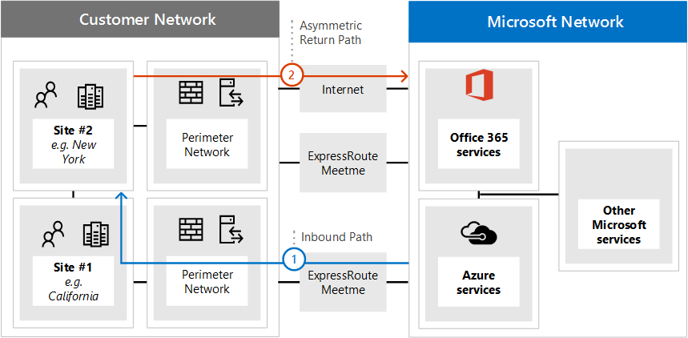

# <a name="implementing-expressroute-for-office-365"></a>Implementieren von ExpressRoute für Office 365

*Dieser Artikel gilt sowohl für Microsoft 365 Enterprise als auch für Office 365 Enterprise.*

Express Route für Office 365 stellt einen alternativen Routingpfad zu vielen Office 365 Diensten für Internet zur Verfügung. Die Architektur von Express Route für Office 365 basiert auf der Werbung für öffentliche IP-Präfixe von Office 365 Diensten, die bereits über das Internet auf Ihre bereitgestellten Express Route-Schaltkreise zur späteren Weiterverteilung dieser IP-Präfixe in Ihr Netzwerk zugegriffen werden können. Mit Express Route können Sie mehrere verschiedene Routingpfade über das Internet und über Express Route effektiv für viele Office 365 Dienste aktivieren. Dieser Status des Routings in Ihrem Netzwerk stellt möglicherweise eine wesentliche Änderung der Planung Ihrer internen Netzwerktopologie dar.
  
 **Status:** Complete Guide v2
  
Sie müssen Ihre Express Route sorgfältig planen, damit Office 365 Implementierung für die Netzwerkkomplexität der Verfügbarkeit von Routing über eine dedizierte Schaltung mit Routen, die in Ihr Kernnetzwerk und das Internet injiziert werden, verfügbar ist. Wenn Sie und Ihr Team die detaillierten Planung und Tests in diesem Leitfaden nicht ausführen, besteht ein hohes Risiko, dass Sie bei aktivierter Express Route-Schaltung einen zeitweiligen oder vollständigen Verlust der Konnektivität zu Office 365 Diensten erleben.
  
Um eine erfolgreiche Implementierung zu erhalten, müssen Sie Ihre Infrastrukturanforderungen analysieren, detailliertes Netzwerk Assessment und-Entwurf durchgehen, das Rollout sorgfältig planen und Steuern und einen detaillierten Validierungs-und Testplan erstellen. Für eine große verteilte Umgebung ist es nicht ungewöhnlich, dass sich Implementierungen über mehrere Monate erstrecken. Dieses Handbuch soll Ihnen helfen, die Vorausplanung zu planen.
  
Große erfolgreiche Bereitstellungen können sechs Monate in Planung sein und umfassen häufig Teammitglieder aus vielen Bereichen in der Organisation einschließlich Netzwerk-, Firewall-und Proxy Serveradministratoren, Office 365 Administratoren, Sicherheit, Endbenutzer Unterstützung, Projektmanagement und Sponsoring von Führungskräften für Unternehmen. Ihre Investition in den Planungsprozess verringert die Wahrscheinlichkeit, dass Sie Bereitstellungsfehler auftreten, was zu Ausfallzeiten oder komplexer und kostspieliger Problembehandlung führt.
  
Es wird erwartet, dass die folgenden Voraussetzungen erfüllt sind, bevor dieser Einführungsleitfaden gestartet wird.
  
1. Sie haben eine Netzwerkbewertung durchgeführt, um festzustellen, ob Express Route empfohlen und genehmigt wurde.

2. Sie haben einen Express Route-Netzwerkdienst Anbieter ausgewählt. Hier finden Sie Informationen zu den [Express Route-Partnern und Peering-Standorten](https://azure.microsoft.com/documentation/articles/expressroute-locations/).

3. Sie haben die [Express Route-Dokumentation](https://azure.microsoft.com/documentation/services/expressroute/) bereits gelesen und verstanden, und Ihr internes Netzwerk kann die Express Route-Voraussetzungen bis Ende erfüllen.

4. Ihr Team hat alle öffentlichen Anleitungen und Dokumentationen unter gelesen [https://aka.ms/expressrouteoffice365](https://aka.ms/expressrouteoffice365) [https://aka.ms/ert](https://aka.ms/ert) und die [Azure Express Route für Office 365-Schulungs](https://channel9.msdn.com/series/aer) Reihe auf Kanal 9 untersucht, um wichtige technische Details zu verstehen, einschließlich:

      - Die Internet Abhängigkeiten von Saas-Diensten.

      - Vermeiden asymmetrischer Routen und behandeln komplexer Routings.

      - Vorgehensweise zum Integrieren von Begrenzungs Sicherheit, Verfügbarkeit und Steuerelementen auf Anwendungsebene.

## <a name="begin-by-gathering-requirements"></a>Beginnen Sie mit dem Sammeln von Anforderungen
<a name="requirements"> </a>

Bestimmen Sie zunächst, welche Features und Dienste Sie in Ihrer Organisation einführen möchten. Sie müssen ermitteln, welche Features der verschiedenen Office 365 Dienste verwendet werden und welche Standorte in Ihrem Netzwerk Personen mit diesen Funktionen hosten. Mit dem Katalog der Szenarien müssen Sie die Netzwerkattribute hinzufügen, die für jedes dieser Szenarien erforderlich sind. wie eingehende und ausgehende netzwerkdatenströme und wenn die Office 365 Endpunkte über Express Route verfügbar sind oder nicht.
  
So erfassen Sie die Anforderungen Ihrer Organisation:
  
- Katalogisieren Sie den eingehenden und ausgehenden Netzwerkdatenverkehr für die Office 365 Dienste, die Ihre Organisation verwendet. Auf der Seite Office 365 URLs und IP-Adressbereiche finden Sie eine Beschreibung der Flüsse, die unterschiedliche Office 365 Szenarien erfordern.

- Sammeln Sie Dokumentation zu einer vorhandenen Netzwerktopologie mit Details zu Ihrem internen WAN-Backbone und ihrer internen Topologie, Konnektivität von Satellitenstandorten, Verbindung mit der letzten Meile Benutzer, Weiterleitung an Netzwerkperimeter-Ausgangspunkte und Proxydienste.

  - Identifizieren von eingehenden Dienstendpunkten in den Netzwerkdiagrammen, mit denen Office 365 und andere Microsoft-Dienste eine Verbindung herstellen, wobei sowohl Internet als auch vorgeschlagene Express Route-Verbindungspfade angezeigt werden.

  - Identifizieren aller geografischen Benutzer Standorte und der WAN-Konnektivität Zwischenstand Orten sowie der Standorte, an denen derzeit ein Ausstieg zum Internet vorliegt und an welchen Orten ein Ausstieg zu einem Express Route-Peering-Standort vorgesehen ist.

  - Identifizieren Sie alle Edge-Geräte wie Proxys, Firewalls und so weiter, und Katalogisieren Sie Ihre Beziehung zu Flüssen, die über das Internet und Express Route gehen.

  - Dokumentieren Sie, ob Endbenutzer über direktes Routing oder indirekte Anwendungsproxys für Internet-und Express Route-Flows auf Office 365 Dienste zugreifen können.

- Fügen Sie den Speicherort Ihres Mandanten und Meet-Me-Speicherortes zu Ihrem Netzplandiagramm hinzu.

- Schätzen Sie die erwarteten und beobachteten Merkmale der Netzwerkleistung und-Latenz von Hauptbenutzer Standorten bis hin zu Office 365. Beachten Sie, dass Office 365 eine globale und verteilte Gruppe von Diensten ist und Benutzer eine Verbindung mit Standorten herstellen, die sich möglicherweise vom Standort Ihres Mandanten unterscheiden. Aus diesem Grund wird empfohlen, die Wartezeit zwischen dem Benutzer und dem nächsten Edge of Microsoft Global Network über Express Route und Internet Verbindungen zu messen und zu optimieren. Sie können Ihre Ergebnisse aus der Netzwerkbewertung verwenden, um diese Aufgabe zu unterstützen.

- Auflisten von Unternehmensnetzwerk Sicherheit und Anforderungen an hohe Verfügbarkeit, die mit der neuen Express Route-Verbindung erfüllt sein müssen. Wie erhalten Benutzer beispielsweise weiterhin Zugriff auf Office 365 im Falle eines Ausfalls des Internet Ausgangs oder des Express Route-Circuits.

- Dokumentieren Sie, welche eingehenden und ausgehenden Office 365 Netzwerk Flüsse den Internet Pfad verwenden und welche Express Route verwendet werden. Die Besonderheiten der geografischen Standorte Ihrer Benutzer und Details Ihrer lokalen Netzwerktopologie erfordern möglicherweise, dass sich der Plan von einem Benutzerstandort zu einem anderen unterscheidet.

### <a name="catalog-your-outbound-and-inbound-network-traffic"></a>Katalogisieren des ausgehenden und eingehenden Netzwerkdatenverkehrs
<a name="trafficCatalog"> </a>

Um das Routing und andere Netzwerk Komplexitäten zu minimieren, wird empfohlen, dass Sie Express Route nur für Office 365 für die Netzwerkdatenverkehr verwenden, die aufgrund behördlicher Anforderungen oder als Ergebnis der Netzwerkbewertung über eine dedizierte Verbindung geleitet werden müssen. Darüber hinaus wird empfohlen, den Umfang des Express Route-Routings zu inszenieren und an ausgehenden und eingehenden Netzwerkdatenverkehr als unterschiedliche Phasen des Implementierungsprojekts heranzukommen. Bereitstellen von Express Route für Office 365 nur von Benutzern initiierten ausgehenden Netzwerkdatenverkehr und überlassen eingehender Netzwerkdatenverkehr über das Internet kann dazu beitragen, die zunehmende topologische Komplexität und die Risiken bei der Einführung zusätzlicher asymmetrischer Routing Möglichkeiten zu steuern.
  
Ihr Netzwerkdaten Verkehrs Katalog sollte Auflistungen aller eingehenden und ausgehenden Netzwerkverbindungen enthalten, die Sie zwischen Ihrem lokalen Netzwerk und Microsoft haben.
  
- Ausgehende Netzwerkdatenverkehr sind Szenarien, in denen eine Verbindung von Ihrer lokalen Umgebung initiiert wird, beispielsweise von internen Clients oder Servern mit einem Ziel der Microsoft-Dienste. Diese Verbindungen sind möglicherweise direkt zu Office 365 oder indirekt, beispielsweise wenn die Verbindung über Proxy Server, Firewalls oder andere Netzwerkgeräte auf dem Pfad zu Office 365 durchläuft.

- Bei eingehenden Netzwerkdatenverkehr handelt es sich um Szenarien, in denen eine Verbindung von der Microsoft-Cloud zu einem lokalen Host initiiert wird. Diese Verbindungen müssen in der Regel durch die Firewall und andere Sicherheitsinfrastrukturen geleitet werden, die von der Kunden Sicherheitsrichtlinie für extern entstandene Datenflüsse benötigt werden.

Lesen Sie den Abschnitt " **sicherstellen der Routen Symmetrie** " im Artikel [Routing mit Express Route für Office 365](https://support.office.com/article/Routing-with-ExpressRoute-for-Office-365-e1da26c6-2d39-4379-af6f-4da213218408) , um zu ermitteln, welche Dienste eingehenden Datenverkehr senden werden, und suchen Sie nach der Spalte mit der Bezeichnung **Express Route für Office 365** im Referenzartikel [Office 365 Endpunkte](https://support.office.com/article/Office-365-URLs-and-IP-address-ranges-8548a211-3fe7-47cb-abb1-355ea5aa88a2) , um die restlichen Verbindungsinformationen zu ermitteln.
  
Für jeden Dienst, der eine ausgehende Verbindung erfordert, sollten Sie die geplante Konnektivität für den Dienst einschließlich Netzwerkrouting, Proxykonfiguration, Paketüberprüfung und Bandbreitenbedarf beschreiben.
  
Für jeden Dienst, der eine eingehende Verbindung erfordert, benötigen Sie einige zusätzliche Informationen. Server in der Microsoft-Cloud stellen Verbindungen zu Ihrem lokalen Netzwerk her. um sicherzustellen, dass die Verbindungen ordnungsgemäß ausgeführt werden, sollten Sie alle Aspekte dieser Konnektivität beschreiben, einschließlich; die öffentlichen DNS-Einträge für die Dienste, die diese eingehenden Verbindungen akzeptieren, die mit CIDR formatierten IPv4-IP-Adressen, die ISP-Geräte und wie eingehende NAT-oder Quell-NAT für diese Verbindungen verarbeitet wird.
  
Eingehende Verbindungen sollten unabhängig davon überprüft werden, ob Sie über das Internet oder Express Route eine Verbindung herstellen, um sicherzustellen, dass kein asymmetrisches Routing eingeführt wurde. In einigen Fällen muss der Zugriff auf lokale Endpunkte, auf denen Office 365 Dienste eingehende Verbindungen initiieren, auch von anderen Microsoft-und nicht-Microsoft-Diensten verwendet werden. Es ist wichtig, dass die Aktivierung von Express Route-Routing zu diesen Diensten für Office 365 Zwecke keine anderen Szenarien unterbrechen kann. In vielen Fällen müssen Kunden möglicherweise bestimmte Änderungen an Ihrem internen Netzwerk wie etwa die Quell basierte NAT implementieren, um sicherzustellen, dass eingehende Datenflüsse von Microsoft nach der Aktivierung von Express Route symmetrisch bleiben.
  
Im folgenden finden Sie ein Beispiel der erforderlichen Detailebene. In diesem Fall würde die Exchange-Hybrid Bereitstellung über Express Route zum lokalen System weitergeleitet.

|**Connection-Eigenschaft**|**Wert**|
|:-----|:-----|
|**Richtung des Netzwerkverkehrs** <br/> |Eingehend  <br/> |
|**Dienst** <br/> |Exchange Hybrid  <br/> |
|**Öffentlicher Office 365 Endpunkt (Quelle)** <br/> |Exchange Online (IP-Adressen)  <br/> |
|**Öffentlicher lokaler Endpunkt (Ziel)** <br/> |5.5.5.5  <br/> |
|**Öffentlicher DNS-Eintrag (Internet)** <br/> |Autodiscover.contoso.com  <br/> |
|**Wird dieser lokale Endpunkt für andere (nicht Office 365) Microsoft-Dienste verwendet?** <br/> |Nein  <br/> |
|**Wird dieser lokale Endpunkt von Benutzern/Systemen im Internet verwendet?** <br/> |Ja  <br/> |
|**Über öffentliche Endpunkte veröffentlichte interne Systeme** <br/> |Exchange Server clientzugriffsrolle (lokal) 192.168.101, 192.168.102, 192.168.103  <br/> |
|**IP-Werbung des öffentlichen Endpunkts** <br/> |**An Internet**: 5.5.0.0/16  <br/> **An Express Route**: 5.5.5.0/24  <br/> |
|**Sicherheit/Umkreis Steuerung** <br/> |**Internet Pfad**: DeviceID_002  <br/> **Express Route-Pfad**: DeviceID_003  <br/> |
|**Hochverfügbarkeit** <br/> |Aktiv/aktiv in 2 Geo-redundant  <br/> Express Route Circuits-Chicago und Dallas  <br/> |
|**Pfad Symmetrie-Steuerelement** <br/> |**Methode**: Source NAT  <br/> **Internet Pfad**: Quell-NAT-eingehende Verbindungen zu 192.168.5.5  <br/> |**Express Route Path**: Source NAT Connections to 192.168.1.0 (Chicago) and 192.168.2.0 (Dallas)  <br/> |

Im folgenden finden Sie ein Beispiel für einen Dienst, der nur ausgehenden ist:

|**Connection-Eigenschaft**|**Wert**|
|:-----|:-----|
|**Richtung des Netzwerkverkehrs** <br/> |Ausgehend  <br/> |
|**Dienst** <br/> |SharePoint Online  <br/> |
|**Lokaler Endpunkt (Quelle)** <br/> |Benutzer Arbeitsstation  <br/> |
|**Öffentlicher Office 365 Endpunkt (Ziel)** <br/> |SharePoint Online (IP-Adressen)  <br/> |
|**Öffentlicher DNS-Eintrag (Internet)** <br/> |\*. SharePoint.com (und zusätzliche FQDNs)  <br/> |
|**CDN-Verweise** <br/> |CDN.sharepointonline.com (und zusätzliche FQDNs) – von CDN-Anbietern verwaltete IP-Adressen)  <br/> |
|**IP-Werbung und verwendete NAT** <br/> |**Internet Pfad/Quell-NAT**: 1.1.1.0/24  <br/> **Express Route Path/Source NAT**: 1.1.2.0/24 (Chicago) und 1.1.3.0/24 (Dallas)  <br/> |
|**Connectivity-Methode** <br/> |**Internet**: über Layer 7-Proxy (PAC-Datei)  <br/> **Express Route**: Direktes Routing (kein Proxy)  <br/> |
|**Sicherheit/Umkreis Steuerung** <br/> |**Internet Pfad**: DeviceID_002  <br/> **Express Route-Pfad**: DeviceID_003  <br/> |
|**Hochverfügbarkeit** <br/> |**Internetpfad**: redundantes Internet-Ausstieg  <br/> **Express Route Path**: Active/Active "Hot Potato" Routing Across 2 Geo-redundant Express Route Circuits-Chicago and Dallas  <br/> |
|**Pfad Symmetrie-Steuerelement** <br/> |**Methode**: Quell-NAT für alle Verbindungen  <br/> |

### <a name="your-network-topology-design-with-regional-connectivity"></a>Ihr Netzwerktopologie-Design mit regionaler Konnektivität
<a name="topology"> </a>

Wenn Sie die Dienste und die zugehörigen Netzwerkdatenverkehr-Datenflüsse verstehen, können Sie ein Netzwerkdiagramm erstellen, das diese neuen Verbindungsanforderungen enthält und die Änderungen veranschaulicht, die Sie zur Verwendung von Express Route für Office 365 vornehmen. Ihr Diagramm sollte Folgendes enthalten:
  
1. Alle Benutzer Standorte, von denen auf Office 365 und andere Dienste zugegriffen wird.

2. Alle Internet-und Express Route-Ausgangspunkte.

3. Alle ausgehenden und eingehenden Geräte, die die Konnektivität im Netzwerk verwalten, einschließlich Router, Firewalls, Anwendungsproxy Server und Intrusionserkennung/-Verhinderung.

4. Interne Ziele für den gesamten eingehenden Datenverkehr, beispielsweise interne ADFS-Server, die Verbindungen von den Proxyservern für ADFS-Webanwendungen akzeptieren.

5. Katalog aller IP-Subnetze, die beworben werden

6. Identifizieren Sie jeden Ort, an dem Benutzer auf Office 365 zugreifen, und Listen Sie die Meet-Me-Speicherorte auf, die für Express Route verwendet werden.

7. Standorte und Teile Ihrer internen Netzwerktopologie, in denen Microsoft-IP-Präfixe, die von Express Route erlernt wurden, akzeptiert, gefiltert und weitergegeben werden.

8. Die Netzwerktopologie sollte den geografischen Standort jedes Netzwerksegments und deren Verbindung mit dem Microsoft-Netzwerk über Express Route und/oder das Internet veranschaulichen.

Das folgende Diagramm zeigt jeden Standort, an dem die Benutzer Office 365 zusammen mit den Ankündigungen für ein-und ausgehendes Routing für Office 365 verwenden werden.
  

  
Für ausgehenden Datenverkehr haben die Personen Zugriff auf Office 365 auf eine von drei Arten:
  
1. Durch einen Meet-Me-Standort in Nordamerika für die Personen in Kalifornien.

2. Über einen Meet-Me-Standort in Hongkong für die Menschen in Hongkong.

3. Über das Internet in Bangladesch, in dem weniger Personen und keine Express Route-Schaltung vorgesehen sind.


  
Dementsprechend gibt der eingehende Netzwerkdatenverkehr von Office 365 eine von drei Arten zurück:
  
1. Durch einen Meet-Me-Standort in Nordamerika für die Personen in Kalifornien.

2. Über einen Meet-Me-Standort in Hongkong für die Menschen in Hongkong.

3. Über das Internet in Bangladesch, in dem weniger Personen und keine Express Route-Schaltung vorgesehen sind.


  
### <a name="determine-the-appropriate-meet-me-location"></a>Ermitteln des geeigneten Meet-Me-Speicherorts

Die Auswahl von Meet-Me-Speicherorten, bei denen der physische Standort, an dem Ihre Express Route-Schaltung Ihr Netzwerk mit dem Microsoft-Netzwerk verbindet, wird von den Speicherorten beeinflusst, von denen Benutzer auf Office 365 von zugreifen können. Als SaaS-Angebot arbeitet Office 365 nicht unter dem regionalen Modell IaaS oder PaaS auf die gleiche Weise wie Azure. Stattdessen handelt es sich bei Office 365 um eine verteilte Gruppe von Zusammenarbeitsdiensten, bei denen Benutzer möglicherweise eine Verbindung mit Endpunkten in mehreren Rechenzentren und Regionen herstellen müssen, die sich möglicherweise nicht unbedingt am gleichen Standort oder in derselben Region befinden, in der der Mandant des Benutzers gehostet wird.
  
Dies ist die wichtigste Überlegung, die Sie bei der Auswahl von Meet-Me-Speicherorten für Express Route für Office 365 vornehmen müssen, von dem die Personen in Ihrer Organisation eine Verbindung herstellen werden. Die allgemeine Empfehlung für eine optimale Office 365 Konnektivität ist das Routing implementieren, sodass Benutzeranforderungen an Office 365 Dienste über den kürzesten Netzwerkpfad an das Microsoft-Netzwerk übergeben werden, dies wird auch häufig als "Hot Potato"-Routing bezeichnet. Wenn sich die meisten Office 365-Benutzer beispielsweise an einem oder zwei Standorten befinden, wird durch Auswählen von Meet-Me-Speicherorten, die sich in nächster Nähe zum Standort dieser Benutzer befinden, der optimale Entwurf erstellt. Wenn Ihr Unternehmen über große Benutzer Populationen in vielen verschiedenen Regionen verfügt, können Sie mehrere Express Route-Schaltkreise und Meet-Me-Speicherorte verwenden. Für einige Ihrer Benutzer Standorte ist der kürzeste/optimaleste Pfad in Microsoft-Netzwerk und Office 365 möglicherweise nicht über Ihre internen WAN-und Express Route-Meet-Me-Punkte, sondern über das Internet.
  
Oftmals gibt es mehrere Meet-Me-Standorte, die in einer Region mit relativer Nähe zu Ihren Benutzern ausgewählt werden können. Füllen Sie die folgende Tabelle aus, um Ihre Entscheidungen zu leiten.

|**Geplante Express Route Meet-Me-Standorte in Kalifornien und New York**||
|:-----|:-----|
|Standort  <br/> |Anzahl der Personen  <br/> |Erwartete Wartezeit für Microsoft-Netzwerk über Internet Austritt  <br/> |Erwartete Wartezeit für Microsoft-Netzwerk über Express Route  <br/> |
|München  <br/> |10.000  <br/> |~ 15ms  <br/> |~ 10ms (via Silicon Valley)  <br/> |
|Washington DC  <br/> |15,000  <br/> |~ 20ms  <br/> |~ 10ms (über New York)  <br/> |
|Dallas  <br/> |5,000  <br/> |~ 15ms  <br/> |~ 40ms (über New York)  <br/> |

Nachdem die globale Netzwerkarchitektur mit der Office 365 Region, Express Route-Standort für den Netzwerkdienstanbieter und die Anzahl der Personen nach Standort entwickelt wurde, kann Sie verwendet werden, um zu ermitteln, ob Optimierungen vorgenommen werden können. Möglicherweise werden auch globale Haarnadel-Netzwerkverbindungen angezeigt, bei denen der Datenverkehr an einen entfernten Standort weitergeleitet wird, um den Standort "Meet-Me" zu erhalten. Wenn eine Haarnadel im globalen Netzwerk erkannt wird, sollte Sie korrigiert werden, bevor Sie fortfahren kann. Suchen Sie entweder einen anderen Meet-Me-Standort, oder verwenden Sie selektive Internet-Ausbruch Punkte, um die Haarnadel zu vermeiden.
  
Das erste Diagramm zeigt ein Beispiel für einen Kunden mit zwei physischen Standorten in Nordamerika. Sie können die Informationen zu Office-Standorten, Office 365 Mandanten Standorten und verschiedene Auswahlmöglichkeiten für Express Route Meet-Me-Standorte anzeigen. In diesem Beispiel hat der Kunde den Meet-Me-Standort basierend auf zwei Prinzipien in der Reihenfolge ausgewählt:
  
1. Engste Nähe zu den Personen in Ihrer Organisation.

2. Am nächsten in der Nähe eines Microsoft-Rechenzentrums, in dem Office 365 gehostet wird.


  
Um dieses Konzept etwas weiter auszubauen, zeigt das zweite Diagramm ein Beispiel für einen multinationalen Kunden mit ähnlichen Informationen und Entscheidungsfindung. Dieser Kunde hat ein kleines Büro in Bangladesch mit nur einem kleinen Team von zehn Personen, das sich auf den Ausbau seiner Präsenz in der Region konzentriert. Es gibt einen Meet-Me-Standort in Chennai und ein Microsoft-Rechenzentrum mit Office 365, die in Chennai gehostet werden, sodass ein Meet-Me-Standort sinnvoll wäre. für zehn Personen sind die Kosten des zusätzlichen Stromkreises jedoch aufwändig. Wenn Sie sich Ihr Netzwerk ansehen, müssen Sie feststellen, ob die Wartezeit beim Senden des Netzwerkdatenverkehrs in Ihrem Netzwerk effektiver ist als die Verwendung des Haupt Kapitals, um einen anderen Express Route-Circuit zu erwerben.
  
Alternativ können die zehn Personen in Bangladesch eine bessere Leistung erzielen, wenn Ihr Netzwerkdatenverkehr über das Internet an das Microsoft-Netzwerk gesendet wird, als Sie es in Ihrem internen Netzwerk weiterleiteten, wie in den einleitenden Diagrammen gezeigt und nachfolgend wiedergegeben.
  

  
## <a name="create-your-expressroute-for-office-365-implementation-plan"></a>Erstellen Ihrer Express Route für Office 365 Implementierungsplan
<a name="implementation"> </a>

Der Implementierungsplan sollte sowohl die technischen Details des Konfigurierens von Express Route als auch die Details zum Konfigurieren aller anderen Infrastrukturen in Ihrem Netzwerk umfassen, beispielsweise die folgenden.
  
- Planen der Aufteilung der Dienste zwischen Express Route und Internet.

- Planen der Bandbreite, der Sicherheit, der hohen Verfügbarkeit und des Failovers

- Entwerfen eines eingehenden und ausgehenden Routings, einschließlich der richtigen Routingpfad Optimierung für unterschiedliche Standorte

- Entscheiden, wie weit Express Route Routen in Ihrem Netzwerk beworben werden und was ist der Mechanismus für Clients zum Auswählen von Internet-oder Express Route-Pfad; beispielsweise Direktes Routing oder Anwendungsproxy.

- Planen von Änderungen des DNS-Eintrags, einschließlich der [Sender Policy Framework](https://technet.microsoft.com/library/dn789058%28v=exchg.150%29.aspx) -Einträge.

- Planen der NAT-Strategie einschließlich der ausgehenden und eingehenden Quell-NAT.

### <a name="plan-your-routing-with-both-internet-and-expressroute-network-paths"></a>Planen des Routings mit Internet-und Express Route-Netzwerkpfaden
<a name="paths"> </a>

- Für die anfängliche Bereitstellung werden alle eingehenden Dienste, wie eingehende e-Mail oder Hybrid Konnektivität, für die Verwendung des Internets empfohlen.

- Planen des Client LAN-Routings für Endbenutzer, beispielsweise [Konfigurieren einer PAC/WPAD-Datei](https://aka.ms/manageo365endpoints), Standardroute, Proxy Server und BGP-Routenankündigungen.

- Planen des Umkreis Routings, einschließlich Proxyservern, Firewalls und Cloud-Proxies.

### <a name="plan-your-bandwidth-security-high-availability-and-failover"></a>Planen der Bandbreite, der Sicherheit, der hohen Verfügbarkeit und des Failovers
<a name="availability"> </a>

Erstellen Sie einen Plan für die Bandbreite, die für jede Haupt Office 365 Arbeitsauslastung erforderlich ist. Ermitteln Sie separat Exchange Online-, SharePoint Online-und Skype for Business Online-Bandbreitenanforderungen. Sie können die schätzungs Rechner verwenden, die wir für Exchange Online und Skype for Business als Ausgangspunkt bereitgestellt haben. Es ist jedoch ein Pilot Test mit einem repräsentativen Beispiel für die Benutzerprofile und Speicherorte erforderlich, um die Bandbreitenanforderungen Ihrer Organisation vollständig zu verstehen.
  
Fügen Sie hinzu, wie Sicherheit bei jedem Internet-und Express Route-Ausgangsstandort zu Ihrem Plan verarbeitet wird, denken Sie daran, dass alle Express Route-Verbindungen zu Office 365 Public Peering verwenden und weiterhin gemäß den Sicherheitsrichtlinien des Unternehmens für die Verbindung mit externen Netzwerken gesichert werden müssen.
  
Fügen Sie Ihrem Plan Details hinzu, welche Personen von welchen Ausfalltypen betroffen sind und wie diese Personen Ihre Arbeit auf einfachste Weise mit voller Kapazität durchführen können.
  
#### <a name="plan-bandwidth-requirements-including-skype-for-business-requirements-on-jitter-latency-congestion-and-headroom"></a>Planen der Bandbreitenanforderungen einschließlich Skype for Business Anforderungen an Jitter, Wartezeit, Überlastung und Kopffreiheit
  
Skype for Business Online enthält auch spezifische zusätzliche Netzwerkanforderungen, die im Artikel [Media Quality and Network Connectivity Performance in Skype for Business Online](https://support.office.com/article/Media-Quality-and-Network-Connectivity-Performance-in-Skype-for-Business-Online-5fe3e01b-34cf-44e0-b897-b0b2a83f0917)aufgeführt sind.
  
Lesen Sie den Abschnitt **Bandbreitenplanung für Azure Express Route** in [Netzwerkplanung mit Express Route für Office 365](https://support.office.com/article/Network-planning-with-ExpressRoute-for-Office-365-103208f1-e788-4601-aa45-504f896511cd).
  
Wenn Sie eine Bewertung der Bandbreite mit ihren Pilotbenutzern durchführen, können Sie unser Handbuch verwenden; [Office 365 Leistungsoptimierung mithilfe von Basisplänen und Leistungsverlauf](https://support.office.com/article/Office-365-performance-tuning-using-baselines-and-performance-history-1492cb94-bd62-43e6-b8d0-2a61ed88ebae).
  
#### <a name="plan-for-high-availability-requirements"></a>Planen der Anforderungen an hohe Verfügbarkeit
  
Erstellen Sie einen Plan für hohe Verfügbarkeit, um Ihre Anforderungen zu erfüllen, und integrieren Sie diesen in das aktualisierte Diagramm der Netzwerktopologie. Lesen Sie den Abschnitt **hohe Verfügbarkeit und Failover mit Azure Express Route** in der [Netzwerkplanung mit Express Route für Office 365](https://support.office.com/article/Network-planning-with-ExpressRoute-for-Office-365-103208f1-e788-4601-aa45-504f896511cd).
  
#### <a name="plan-for-network-security-requirements"></a>Planen der Anforderungen an die Netzwerksicherheit
  
Erstellen Sie einen Plan, um Ihre Netzwerksicherheitsanforderungen zu erfüllen, und integrieren Sie diesen in das aktualisierte Diagramm der Netzwerktopologie. Lesen Sie den Abschnitt **Anwenden von Sicherheitssteuerelementen auf Azure Express Route für Office 365 Szenarien** in der [Netzwerkplanung mit Express Route für Office 365](https://support.office.com/article/Network-planning-with-ExpressRoute-for-Office-365-103208f1-e788-4601-aa45-504f896511cd).
  
### <a name="design-outbound-service-connectivity"></a>Entwerfen der Verbindung mit ausgehenden Diensten
<a name="outbound"> </a>

Express Route für Office 365 verfügt über  *ausgehende*  Netzwerkanforderungen, die möglicherweise nicht vertraut sind. Insbesondere müssen die IP-Adressen, die Ihre Benutzer und Netzwerke darstellen, Office 365 und als Quell Endpunkte für ausgehende Netzwerkverbindungen mit Microsoft fungieren, den unten aufgeführten spezifischen Anforderungen entsprechen.
  
1. Bei den Endpunkten muss es sich um öffentliche IP-Adressen handeln, die für Ihr Unternehmen registriert sind, oder für Carrier, der Ihnen Express Route-Konnektivität bereitstellt.

2. Die Endpunkte müssen bei Microsoft beworben und von Express Route validiert/akzeptiert werden.

3. Die Endpunkte dürfen nicht im Internet mit derselben oder einer bevorzugten Routingmetrik beworben werden.

4. Die Endpunkte dürfen nicht für Verbindungen mit Microsoft-Diensten verwendet werden, die nicht über Express Route konfiguriert sind.

Wenn Ihr Netzwerkentwurf diese Anforderungen nicht erfüllt, besteht ein hohes Risiko, dass Ihre Benutzer Verbindungsfehler für Office 365 und andere Microsoft-Dienste aufgrund von schwarz holing oder asymmetrischer Weiterleitung auftreten können. Dies tritt auf, wenn Anforderungen an Microsoft-Dienste über Express Route weitergeleitet werden, die Antworten jedoch über das Internet zurückgeleitet werden oder umgekehrt, und die Antworten werden durch Stateful-Netzwerkgeräte wie Firewalls verworfen.
  
Die gängigste Methode, die Sie zur Erfüllung der oben genannten Anforderungen verwenden können, ist die Verwendung der Quell-NAT, die entweder als Teil Ihres Netzwerks implementiert oder von Ihrem Express Route-Carrier bereitgestellt wird. Mit der Quell-NAT können Sie die Details und die private IP-Adressierung Ihres Internetnetzwerks von Express Route abstrahieren und; gekoppelt mit geeigneten IP-Routenankündigungen bieten Sie einen einfachen Mechanismus, um die Pfad Symmetrie sicherzustellen. Wenn Sie Stateful-Netzwerkgeräte verwenden, die für Express Route-Peering-Speicherorte spezifisch sind, müssen Sie separate NAT-Pools für jedes Express Route-Peering implementieren, um die Pfad Symmetrie sicherzustellen.
  
Lesen Sie mehr über die [Express Route-NAT-Anforderungen](https://azure.microsoft.com/documentation/articles/expressroute-nat/).
  
Fügen Sie die Änderungen für die ausgehende Konnektivität zum Netzwerktopologie-Diagramm hinzu.
  
### <a name="design-inbound-service-connectivity"></a>Entwerfen der Konnektivität für eingehende Dienste
<a name="inbound"> </a>

Die Mehrzahl der Enterprise Office 365-Bereitstellungen übernehmen eine gewisse Form der eingehenden Konnektivität von Office 365 zu lokalen Diensten, beispielsweise für Exchange-, SharePoint-und Skype for Business-Hybrid Szenarien, Postfachmigrationen und Authentifizierung mithilfe der ADFS-Infrastruktur. Wenn Sie einen zusätzlichen Express Route zwischen Ihrem lokalen Netzwerk und Microsoft für ausgehende Verbindungen aktivieren, werden diese eingehenden Verbindungen möglicherweise versehentlich durch asymmetrisches Routing beeinträchtigt, selbst wenn Sie beabsichtigen, dass diese Flüsse weiterhin das Internet nutzen. Einige Vorsichtsmaßnahmen, die nachfolgend beschrieben werden, werden empfohlen, um sicherzustellen, dass keine Auswirkungen auf Internet basierte eingehende Flüsse von Office 365 auf lokale Systeme haben.
  
Um die Risiken eines asymmetrischen Routings für eingehende Netzwerkdatenverkehr zu minimieren, sollten alle eingehenden Verbindungen die Quell-NAT verwenden, bevor Sie in Segmente Ihres Netzwerks weitergeleitet werden, die über Routing Sichtbarkeit in Express Route verfügen. Wenn die eingehenden Verbindungen in ein Netzwerksegment mit Routing Sichtbarkeit in Express Route ohne Quell-NAT zulässig sind, werden Anforderungen aus Office 365 aus dem Internet eingegeben, aber die Antwort auf Office 365 bevorzugt den Express Route-Netzwerkpfad zurück zum Microsoft-Netzwerk, wodurch ein asymmetrisches Routing entsteht.
  
Sie können eine der folgenden Implementierungsmuster in Frage stellen, um diese Anforderung zu erfüllen:
  
1. Ausführen der Quell-NAT vor dem Weiterleiten von Anforderungen an das interne Netzwerk mithilfe von Netzwerkgeräten wie Firewalls oder Lastenausgleichs stellen auf dem Pfad vom Internet zu Ihren lokalen Systemen.

2. Stellen Sie sicher, dass Express Route-Routen nicht an die Netzwerksegmente weitergegeben werden, in denen eingehende Dienste wie Front-End-Server oder Reverse-Proxy-Systeme, die Internet Verbindungen behandeln, sich befinden.

Das explizite aufrechnen dieser Szenarien in Ihrem Netzwerk und das aufhalten aller eingehenden Netzwerkdatenverkehr über das Internet hilft, die Bereitstellung und das operationelle Risiko für asymmetrisches Routing zu minimieren.
  
Es kann Fälle geben, in denen Sie einige eingehende Flüsse über Express Route-Verbindungen leiten können. Berücksichtigen Sie für diese Szenarien die folgenden zusätzlichen Aspekte.
  
1. Office 365 können nur lokale Endpunkte adressieren, die öffentliche IPS verwenden. Dies bedeutet, dass auch dann, wenn der lokale eingehende Endpunkt nur für Office 365 über Express Route verfügbar gemacht wird, eine öffentliche IP-Adresse zugeordnet sein muss.

2. Die gesamte DNS-Namensauflösung, die Office 365 Dienste durchführen, um lokale Endpunkte zu lösen, geschieht mithilfe von öffentlichem DNS. Dies bedeutet, dass Sie den FQDN des eingehenden Dienstendpunkts für IP-Zuordnungen im Internet registrieren müssen.

3. Um eingehende Netzwerkverbindungen über Express Route zu erhalten, müssen die öffentlichen IP-Subnetze für diese Endpunkte für Microsoft über Express Route angekündigt werden.

4. Werten Sie diese eingehenden Netzwerkdatenverkehr sorgfältig aus, um sicherzustellen, dass entsprechende Sicherheits-und Netzwerk Steuerelemente entsprechend den Sicherheits-und Netzwerkrichtlinien Ihres Unternehmens angewendet werden.

5. Sobald Ihre lokalen eingehenden Endpunkte für Microsoft über Express Route angekündigt wurden, wird Express Route effektiv als bevorzugter Routingpfad zu diesen Endpunkten für alle Microsoft-Dienste, einschließlich Office 365, verwendet. Dies bedeutet, dass diese Endpunkt-Subnetze nur für die Kommunikation mit Office 365 Diensten und keine anderen Dienste im Microsoft-Netzwerk verwendet werden dürfen. Andernfalls führt Ihr Entwurf zu einem asymmetrischen Routing, bei dem eingehende Verbindungen von anderen Microsoft-Diensten eine Weiterleitung von Inbound über Express Route bevorzugen, während der Rückgabepfad das Internet verwenden wird.

6. Für den Fall, dass ein Express Route Circuit oder Meet-Me-Standort nicht verfügbar ist, müssen Sie sicherstellen, dass die lokalen eingehenden Endpunkte weiterhin zur Annahme von Anforderungen über einen separaten Netzwerkpfad zur Verfügung stehen. Dies kann Werbe Subnetze für diese Endpunkte über mehrere Express Route-Schaltkreise bedeuten.

7. Es wird empfohlen, die Quell-NAT für alle eingehenden Netzwerkdatenverkehr einzusetzen, die über Express Route in Ihr Netzwerk eindringen, vor allem dann, wenn diese durch kreuzend behaftete Netzwerkgeräte wie Firewalls fließen.

8. Einige lokale Dienste wie ADFS-Proxy oder Exchange AutoErmittlung erhalten möglicherweise eingehende Anforderungen von Office 365 Diensten und Benutzern aus dem Internet. Für diese Anforderungen werden Office 365 denselben FQDN wie Benutzeranforderungen über das Internet abzielen. Wenn Sie eingehende Benutzer Verbindungen aus dem Internet zu diesen lokalen Endpunkten zulassen und Office 365 Verbindungen zur Verwendung von Express Route erzwingen, stellt dies eine erhebliche Routing Komplexität dar. Für den Großteil der Kunden, die solche komplexen Szenarien über Express Route implementieren, wird aufgrund betrieblicher Überlegungen nicht empfohlen. Dieser zusätzliche Overhead umfasst das Verwalten von Risiken des asymmetrischen Routings und erfordert eine sorgfältige Verwaltung der Routing Ankündigungen und-Richtlinien in mehreren Dimensionen.

### <a name="update-your-network-topology-plan-to-show-how-you-would-avoid-asymmetric-routes"></a>Aktualisieren Sie den Plan der Netzwerktopologie, um zu zeigen, wie asymmetrische Routen vermieden werden.
<a name="asymmetric"> </a>

Sie möchten asymmetrisches Routing vermeiden, um sicherzustellen, dass Personen in Ihrer Organisation Office 365 und andere wichtige Dienste im Internet nahtlos verwenden können. Es gibt zwei gängige Konfigurationen, die Kunden asymmetrisches Routing verursachen. Überprüfen Sie jetzt die Netzwerkkonfiguration, die Sie verwenden möchten, und überprüfen Sie, ob eines dieser asymmetrischen Routingszenarien vorhanden sein könnte.
  
Zunächst wird ein paar unterschiedliche Situationen im Zusammenhang mit dem folgenden Netzplandiagramm untersucht. In diesem Diagramm befinden sich alle Server, die eingehende Anforderungen wie ADFS oder lokale hybridserver empfangen, im Datencenter von New Jersey und werden im Internet beworben.
  
1. Während das Umkreisnetzwerk sicher ist, ist für eingehende Anforderungen keine Quell-NAT verfügbar.

2. Die Server im Datencenter von New Jersey können sowohl Internet-als auch Express Route-Routen anzeigen.


  
Wir haben auch Vorschläge zur Problembehebung.
  
#### <a name="problem-1-cloud-to-on-premises-connection-over-the-internet"></a>Problem 1: Cloud für die lokale Verbindung über das Internet
  
Das folgende Diagramm zeigt den asymmetrischen Netzwerkpfad, der ausgeführt wird, wenn Ihre Netzwerkkonfiguration keine NAT für eingehende Anforderungen von der Microsoft-Cloud über das Internet bereitstellt.
  
1. Die eingehende Anforderung von Office 365 Ruft die IP-Adresse des lokalen Endpunkts aus dem öffentlichen DNS ab und sendet die Anforderung an das Umkreisnetzwerk.

2. In dieser fehlerhaften Konfiguration ist im Umkreisnetzwerk, in dem der Datenverkehr gesendet wird, keine Quell-NAT konfiguriert oder verfügbar, wodurch die tatsächliche Quell-IP-Adresse als Rückgabe Ziel verwendet wird.

  - Der Server in Ihrem Netzwerk leitet den Rückgabe Datenverkehr an Office 365 über eine beliebige verfügbare Express Route-Netzwerkverbindung weiter.

  - Das Ergebnis ist ein asymmetrischer Pfad für diesen Fluss zu Office 365, was zu einer fehlerhaften Verbindung führt.


  
##### <a name="solution-1a-source-nat"></a>Lösung 1a: Quell-NAT
  
Durch einfaches Hinzufügen einer Quell-NAT zur eingehenden Anforderung wird dieses falsch konfigurierte Netzwerk aufgelöst. Inhalt dieses Diagramms:
  
1. Die eingehende Anforderung wird weiterhin über das Umkreisnetzwerk des neuen Jersey-Datencenters eingegeben. Dieses Mal ist die Quelle NAT verfügbar.

2. Die Antwort vom Server wird an die IP-Adresse zurückgeleitet, die der Quell-NAT anstelle der ursprünglichen IP-Adresse zugeordnet ist, was dazu führt, dass die Antwort auf demselben Netzwerkpfad zurückgegeben wird.


  
##### <a name="solution-1b-route-scoping"></a>Lösung 1B: Routendefinition
  
Alternativ können Sie auch festlegen, dass die Express Route BGP-Präfixe nicht angekündigt werden, und der Alternative Netzwerkpfad für diese Computer wird entfernt. Inhalt dieses Diagramms:
  
1. Die eingehende Anforderung wird weiterhin über das Umkreisnetzwerk des neuen Jersey-Datencenters eingegeben. Dieses Mal sind die von Microsoft für die Express Route-Schaltung beworbenen Präfixe für das New Jersey-Rechenzentrum nicht verfügbar.

2. Die Antwort vom Server wird auf die IP zurückgeführt, die der ursprünglichen IP-Adresse über die einzige verfügbare Route zugeordnet ist, was dazu führt, dass die Antwort auf demselben Netzwerkpfad zurückgegeben wird.


  
#### <a name="problem-2-cloud-to-on-premises-connection-over-expressroute"></a>Problem 2: Cloud zur lokalen Verbindung über Express Route
  
Das folgende Diagramm zeigt den asymmetrischen Netzwerkpfad, der ausgeführt wird, wenn Ihre Netzwerkkonfiguration keine NAT für eingehende Anforderungen von der Microsoft-Cloud über Express Route bereitstellt.
  
1. Die eingehende Anforderung von Office 365 Ruft die IP-Adresse aus dem DNS ab und sendet die Anforderung an das Umkreisnetzwerk.

2. In dieser fehlerhaften Konfiguration ist im Umkreisnetzwerk, in dem der Datenverkehr gesendet wird, keine Quell-NAT konfiguriert oder verfügbar, wodurch die tatsächliche Quell-IP-Adresse als Rückgabe Ziel verwendet wird.

  - Der Computer in Ihrem Netzwerk leitet den Rück Verkehr an Office 365 über eine beliebige verfügbare Express Route-Netzwerkverbindung weiter.

  - Das Ergebnis ist eine asymmetrische Verbindung mit Office 365.


  
##### <a name="solution-2-source-nat"></a>Lösung 2: Quell-NAT
  
Durch einfaches Hinzufügen einer Quell-NAT zur eingehenden Anforderung wird dieses falsch konfigurierte Netzwerk aufgelöst. Inhalt dieses Diagramms:
  
1. Die eingehende Anforderung wird weiterhin über das Umkreisnetzwerk des New York Data Centers eingegeben. Dieses Mal ist die Quelle NAT verfügbar.

2. Die Antwort vom Server wird an die IP-Adresse zurückgeleitet, die der Quell-NAT anstelle der ursprünglichen IP-Adresse zugeordnet ist, was dazu führt, dass die Antwort auf demselben Netzwerkpfad zurückgegeben wird.


  
### <a name="paper-verify-that-the-network-design-has-path-symmetry"></a>Papier stellen Sie sicher, dass der Netzwerkentwurf eine Pfad Symmetrie aufweist

Jetzt müssen Sie auf Papier überprüfen, ob Ihr Implementierungsplan eine Routen Symmetrie für die verschiedenen Szenarien bietet, in denen Sie Office 365 verwenden. Sie identifizieren die bestimmte Netzwerkroute, die ausgeführt werden soll, wenn eine Person andere Features des Diensts verwendet. Vom lokalen Netzwerk und WAN-Routing über die Umkreisgeräte zum Verbindungspfad; Express Route oder das Internet und an die Verbindung mit dem Online-Endpunkt.
  
Sie müssen dies für alle Office 365 Netzwerkdienste tun, die zuvor als Dienste identifiziert wurden, die Ihre Organisation übernimmt.
  
Er hilft bei der Durchführung von Routen mit einer zweiten Person. Erklären Sie Ihnen, wo jeder Netzwerkhop erwartet wird, um die nächste Route zu erhalten, und stellen Sie sicher, dass Sie mit den Routingpfaden vertraut sind. Denken Sie daran, dass Express Route immer eine Mehrbereichs bezogene Route zu Microsoft Server-IP-Adressen bereitstellt, die niedrigere Routen Kosten als eine Standardroute im Internet bietet.
  
### <a name="design-client-connectivity-configuration"></a>Entwerfen der Client Verbindungskonfiguration
<a name="asymmetric"> </a>


  
Wenn Sie einen Proxy Server für den internetgebundenen Datenverkehr verwenden, müssen Sie alle PAC-oder Client Konfigurationsdateien anpassen, um sicherzustellen, dass die Clientcomputer in Ihrem Netzwerk ordnungsgemäß konfiguriert sind, um den Express Route-Datenverkehr zu senden, den Sie Office 365 möchten, ohne den Proxy Server zu übertragen, und der verbleibende Datenverkehr, einschließlich Office 365 Datenverkehr, wird an den Lesen Sie unser Leitfaden zum [Verwalten von Office 365 Endpunkten](https://aka.ms/manageo365endpoints) , beispielsweise PAC-Dateien.
  
> [!NOTE]
> Die Endpunkte ändern sich häufig, so oft wie wöchentlich. Sie sollten Änderungen nur basierend auf den Diensten und Features vornehmen, die Ihre Organisation angenommen hat, um die Anzahl der Änderungen zu reduzieren, die Sie vornehmen müssen, um auf dem aktuellen Stand zu bleiben. Achten Sie genau auf das **effektive Datum** im RSS-Feed, in dem die Änderungen angekündigt und ein Datensatz allerletzten Änderungen aufbewahrt wird, IP-Adressen, die angekündigt werden, möglicherweise erst nach Erreichen des Gültigkeitsdatums beworben oder aus der Werbung entfernt werden.
  
## <a name="build-your-deployment-and-testing-procedures"></a>Erstellen der Bereitstellungs-und Testverfahren
<a name="testing"> </a>

Ihr Implementierungsplan sollte sowohl Test-als auch Rollback-Planung umfassen. Wenn Ihre Implementierung nicht wie erwartet funktioniert, sollte der Plan so konzipiert sein, dass Sie sich auf die geringste Anzahl von Personen auswirkt, bevor Probleme ermittelt werden. Im folgenden finden Sie einige allgemeine Grundsätze, die Ihr Plan berücksichtigen sollte.
  
1. Stellen Sie das Onboarding für das Netzwerksegment und den Benutzer Dienst bereit, um die Unterbrechung zu minimieren.

2. Planen Sie das Testen von Routen mit traceroute und TCP Connect von einem separaten mit dem Internet verbundenen Host.

3. Vorzugsweise sollten Tests für eingehende und ausgehende Dienste in einem isolierten Testnetzwerk mit einem Test Office 365 Mandanten ausgeführt werden.

      - Alternativ können Tests in einem Produktionsnetzwerk ausgeführt werden, wenn der Kunde noch nicht Office 365 verwendet oder sich im Pilotprojekt befindet.

      - Alternativ können Tests während eines Produktionsausfalls durchgeführt werden, der nur für Test und Überwachung vorgesehen ist.

      - Alternativ können Tests durchgeführt werden, indem Sie Routen für jeden Dienst auf jedem Layer 3-Router-Knoten überprüfen. Dieser Fall zurück sollte nur verwendet werden, wenn keine anderen Tests möglich ist, da ein Mangel an physikalischen Tests Risiko eingeführt wird.

### <a name="build-your-deployment-procedures"></a>Erstellen der Bereitstellungs Prozeduren

Ihre Bereitstellungsverfahren sollten für kleine Gruppen von Personen in Phasen bereitgestellt werden, damit Tests vor der Bereitstellung für größere Personengruppen ausgeführt werden können. Es gibt verschiedene Möglichkeiten, um die Bereitstellung von Express Route zu inszenieren.
  
1. Richten Sie Express Route mit Microsoft Peering ein, und lassen Sie die Routenankündigungen nur für mehrstufige Testzwecke an einen einzelnen Host weiterleiten.

2. Werben Sie zunächst Routen zum Express Route-Netzwerk an ein einzelnes Netzwerksegment, und erweitern Sie dann Routenankündigungen nach Netzwerksegment oder Region.

3. Wenn Sie Office 365 zum ersten Mal bereitstellen, verwenden Sie die Express Route-Netzwerkbereitstellung als Pilotprojekt für eine kleine Anzahl von Personen.

4. Wenn Sie Proxy Server verwenden, können Sie alternativ eine Test-PAC-Datei so konfigurieren, dass eine kleine Anzahl von Personen mit Tests und Feedback an Express Route weitergeleitet wird, bevor Sie weitere hinzufügen.

In Ihrem Implementierungsplan sollten alle Bereitstellungsverfahren aufgelistet werden, die ausgeführt werden müssen, oder Befehle, die zum Bereitstellen der Netzwerkkonfiguration verwendet werden müssen. Wenn die Dauer des Netzwerkausfalls eintrifft, sollten alle Änderungen aus dem schriftlichen Bereitstellungsplan erfolgen, der vorab erstellt und von einem Peer überprüft wurde. Siehe unsere Anleitung zur technischen Konfiguration von Express Route.
  
- Aktualisieren der SPF TXT-Einträge, wenn Sie IP-Adressen für alle lokalen Server geändert haben, die weiterhin e-Mails senden werden.

- Aktualisieren von DNS-Einträgen für lokale Server, wenn Sie IP-Adressen geändert haben, um eine neue NAT-Konfiguration zu ermöglichen.

- Stellen Sie sicher, dass Sie den RSS-Feed für Office 365 Endpunkt Benachrichtigungen abonniert haben, um Routing-oder Proxy Konfigurationen beizubehalten.

Nachdem die Express Route-Bereitstellung abgeschlossen ist, sollten die Verfahren im Testplan ausgeführt werden. Die Ergebnisse für die einzelnen Prozeduren sollten protokolliert werden. Sie müssen Verfahren für das Zurücksetzen auf die ursprüngliche Produktionsumgebung einschließen, falls die Ergebnisse des Test Plans darauf hindeuten, dass die Implementierung nicht erfolgreich war.
  
### <a name="build-your-test-procedures"></a>Erstellen der Testprozeduren

Die Testverfahren sollten Tests für jeden ausgehenden und eingehenden Netzwerkdienst enthalten, für Office 365 sowohl, die Express Route verwenden werden, als auch für solche, die nicht verwendet werden. Die Verfahren sollten Tests von jedem eindeutigen Netzwerkstandort einschließen, einschließlich der Benutzer, die sich nicht lokal im LAN des Unternehmens befinden.
  
Einige Beispiele für Testaktivitäten umfassen Folgendes:
  
1. Pingen Sie von Ihrem lokalen Router an den Router Ihres Netzwerkbetreibers.

2. Überprüfen Sie die 500 + Office 365-und CRM Online-IP-Adress Ankündigungen werden von Ihrem lokalen Router empfangen.

3. Überprüfen der eingehenden und ausgehenden NAT wird zwischen Express Route und dem internen Netzwerk betrieben.

4. Überprüfen Sie, ob Routen zu ihrer NAT von Ihrem Router beworben werden.

5. Überprüfen Sie, ob Express Route ihre angekündigten Präfixe angenommen hat.

      - Verwenden Sie das folgende Cmdlet, um Peering-Ankündigungen zu überprüfen:

      ```PowerShell
      Get-AzureRmExpressRouteCircuitRouteTable -DevicePath Primary -ExpressRouteCircuitName TestER -ResourceGroupName RG -PeeringType MicrosoftPeering
      ```

6. Überprüfen des öffentlichen NAT-IP-Bereichs wird von Microsoft nicht über andere Express Route oder öffentliche Internet-Netzwerk Schaltungen beworben, es sei denn, es handelt sich um eine bestimmte Teilmenge eines größeren Bereichs wie im vorherigen Beispiel.

7. Express Route-Schaltkreise werden gekoppelt, überprüfen, ob beide BGP-Sitzungen aktiv sind.

8. Richten Sie einen einzelnen Host auf der Innenseite ihrer NAT ein, und verwenden Sie Ping, tracert und tcpping, um die Konnektivität über den neuen Circuit mit dem Host-Outlook.office365.com zu testen. Alternativ können Sie ein Tool wie Wireshark oder Microsoft Network Monitor 3,4 an einem gespiegelten Port für den msee verwenden, um zu überprüfen, ob Sie eine Verbindung mit der IP-Adresse herstellen können, die Outlook.office365.com zugeordnet ist.

9. Testen der Funktionalität der Anwendungsebene für Exchange Online.

  - Test Outlook kann eine Verbindung mit Exchange Online herstellen und e-Mails senden/empfangen.

  - Test Outlook kann den Onlinemodus verwenden.

  - Testen der Smartphone-Konnektivität und der Sende-/Empfangsfunktion.

10. Testen der Funktionalität der Anwendungsebene für SharePoint Online

  - Testen Sie OneDrive für Unternehmen synchronisierungsclient.

  - Testen Sie SharePoint Online-Webzugriff.

11. Testen der Funktionalität der Anwendungsebene für Skype for Business Anrufszenarien:

  - Beitreten zum Konferenzanruf als authentifizierter Benutzer [vom Endbenutzer initiierte Einladung].

  - Benutzer zum Konferenzanruf einladen [invite gesendet von MCU].

  - Treten Sie mit der Skype for Business-Webanwendung als anonymer Benutzer an der Konferenz an.

  - Verbinden Sie einen Anruf von ihrer kabelgebundenen PC-Verbindung, dem IP-Telefon und dem mobilen Gerät.

  - Anruf bei Verbundbenutzer o Anruf zur PSTN-Überprüfung: Anruf ist abgeschlossen, die Anrufqualität ist akzeptabel, die Verbindungszeit ist akzeptabel.

  - Stellen Sie sicher, dass der Anwesenheitsstatus für Kontakte sowohl für die Mitglieder des Mandanten als auch für die Verbundbenutzer aktualisiert wird.

### <a name="common-problems"></a>Häufige Probleme

Das asymmetrische Routing ist das häufigste Implementierungsproblem. Hier sind einige häufige Quellen, nach denen gesucht werden sollte:
  
- Verwenden einer offenen oder flachen Netzwerkrouting Topologie ohne Quell-NAT.

- Verwenden von SNAT nicht zum Weiterleiten von eingehenden Diensten über die Internet-und Express Route-Verbindungen.

- Nicht Testen von eingehenden Diensten auf Express Route in einem Testnetzwerk vor der umfassenden Bereitstellung.

## <a name="deploying-expressroute-connectivity-through-your-network"></a>Bereitstellen von Express Route-Konnektivität über Ihr Netzwerk
<a name="testing"> </a>

Stellen Sie die Bereitstellung gleichzeitig in einem Segment des Netzwerks zur Verfügung, und führen Sie schrittweise die Konnektivität mit verschiedenen Teilen des Netzwerks mit einem Plan für ein Rollback für jedes neue Netzwerksegment aus. Wenn Ihre Bereitstellung mit einer Office 365-Bereitstellung ausgerichtet ist, stellen Sie Sie zuerst für Ihre Office 365 Pilotbenutzer bereit und erweitern Sie von dort aus.
  
Zunächst für Ihren Test und dann für die Produktion:
  
- Führen Sie die Bereitstellungsschritte aus, um Express Route zu aktivieren.

- Testen des Sehens die Netzwerkrouten sind wie erwartet.

- Führen Sie Tests für jeden eingehenden und ausgehenden Dienst aus.

- Rollback, wenn Sie Probleme entdecken.

### <a name="set-up-a-test-connection-to-expressroute-with-a-test-network-segment"></a>Einrichten einer Testverbindung mit einem Testnetzwerk Segment mit Express Route

Nachdem Sie nun den abgeschlossenen Plan auf dem Papier haben, ist es an der Zeit, im kleinen Maßstab zu testen. In diesem Test wird eine einzelne Express Route-Verbindung mit Microsoft-Peering mit einem Test-Subnetz in Ihrem lokalen Netzwerk hergestellt. Sie können einen [Test Office 365 Mandanten](https://go.microsoft.com/fwlink/p/?LinkID=403802) mit Konnektivität zu und aus dem Test-Subnetz konfigurieren und alle ausgehenden und eingehenden Dienste einbeziehen, die Sie in der Produktion im Test-Subnetz verwenden werden. Richten Sie DNS für das Testnetzwerk Segment ein, und richten Sie alle eingehenden und ausgehenden Dienste ein. Führen Sie den Testplan aus, und stellen Sie sicher, dass Sie mit dem Routing für jeden Dienst und der Routen Verteilung vertraut sind.
  
### <a name="execute-the-deployment-and-test-plans"></a>Ausführen der Bereitstellung und des Test Plans

Wenn Sie die oben beschriebenen Elemente abgeschlossen haben, überprüfen Sie die Bereiche, die Sie abgeschlossen haben, und stellen Sie sicher, dass Sie und Ihr Team diese überprüft haben, bevor Sie die Bereitstellungs-und Test Pläne ausführen.
  
- Liste der ausgehenden und eingehenden Dienste, die an der Netzwerkänderung beteiligt sind.

- Diagramm zur globalen Netzwerkarchitektur, in dem sowohl Internet Ausgangs-als auch Express Route-Meet-Me-Standorte angezeigt werden.

- Netzwerkrouting Diagramm, das die verschiedenen Netzwerkpfade demonstriert, die für jeden bereitgestellten Dienst verwendet werden.

- Ein Bereitstellungsplan mit Schritten zum Implementieren der Änderungen und Rollback bei Bedarf.

- Ein Testplan zum Testen der einzelnen Office 365 und des Netzwerkdiensts.

- Abgeschlossene Papier Validierung von Produktions Routen für eingehende und ausgehende Dienste.

- Ein abgeschlossener Test in einem Testnetzwerk Segment, einschließlich Verfügbarkeitstests.

Wählen Sie ein Ausfallfenster aus, das lang genug ist, um den gesamten Bereitstellungsplan und den Testplan auszuführen, während der Problembehandlung und der Zeit für das Rollback bei Bedarf einige Zeit zur Verfügung stehen.
  
> [!CAUTION]
> Aufgrund der komplexen Art des Routings sowohl über das Internet als auch über das Express Route wird empfohlen, dass diesem Fenster zusätzliche Pufferzeit hinzugefügt wird, um die Problembehandlung für komplexes Routing zu behandeln.
  
### <a name="configure-qos-for-skype-for-business-online"></a>Konfigurieren von QoS für Skype for Business Online

QoS ist erforderlich, um Sprach-und Besprechungs Vorteile für Skype for Business Online zu erhalten. Sie können QoS konfigurieren, nachdem Sie sichergestellt haben, dass die Express Route-Netzwerkverbindung keinen anderen Office 365-Dienst Zugriff blockiert. Die Konfiguration für QoS wird im Artikel [Express Route und QoS in Skype for Business Online](https://support.office.com/article/ExpressRoute-and-QoS-in-Skype-for-Business-Online-20c654da-30ee-4e4f-a764-8b7d8844431d) beschrieben.
  
## <a name="troubleshooting-your-implementation"></a>Problembehandlung bei der Implementierung
<a name="troubleshooting"> </a>

Der erste Ort, an dem die Schritte in diesem Einführungsleitfaden aussehen sollten, wurden in Ihrem Implementierungsplan verpasst? Wechseln Sie zurück, und führen Sie nach Möglichkeit weitere kleine Netzwerktests aus, um den Fehler zu replizieren und dort zu debuggen.
  
Ermitteln Sie, welche eingehenden oder ausgehenden Dienste während der Tests fehlgeschlagen sind. Holen Sie sich speziell die IP-Adressen und Subnetze für jeden der Dienste, die nicht erfolgreich waren. Gehen Sie voran und gehen Sie das Diagramm Netzwerktopologie auf Papier und überprüfen Sie das Routing. Überprüfen Sie insbesondere, wo das Express Route-Routing beworben wird, testen Sie dieses Routing bei einem Ausfall, wenn möglich, mit Ablaufverfolgungen.
  
Führen Sie PSPing mit einer Netzwerkablaufverfolgung für jeden Kunden Endpunkt aus, und Werten Sie die Quell-und Ziel-IP-Adressen aus, um zu überprüfen, ob Sie wie erwartet sind Führen Sie Telnet für alle e-Mail-Hosts aus, die Sie in Port 25 verfügbar machen, und stellen Sie sicher, dass SNAT die ursprüngliche Quell-IP-Adresse verbirgt, wenn dies erwartet wird.
  
Beachten Sie, dass Sie bei der Bereitstellung Office 365 mit einer Express Route-Verbindung sicherstellen müssen, dass die Netzwerkkonfiguration für Express Route optimal entwickelt wurde und Sie auch die anderen Komponenten in Ihrem Netzwerk wie Clientcomputer optimiert haben. Zusätzlich zur Verwendung dieses Planungshandbuchs für die Problembehandlung der verpassten Schritte haben wir auch einen [Plan zur Leistungsproblembehandlung für Office 365](https://support.office.com/article/Performance-troubleshooting-plan-for-Office-365-e241e5d9-b1d8-4f1d-a5c8-4106b7325f8c) geschrieben.
  
Mit diesem kurzen Link gelangen Sie wieder hierher zurück: [https://aka.ms/implementexpressroute365](https://aka.ms/implementexpressroute365)
  
## <a name="related-topics"></a>Verwandte Themen

[Bewerten der Office 365-Netzwerkkonnektivität](assessing-network-connectivity.md)
  
[Azure ExpressRoute für Office 365](azure-expressroute.md)
  
[Verwalten von ExpressRoute für Office 365-Verbindungen](managing-expressroute-for-connectivity.md)
  
[Routing mit ExpressRoute für Office 365](routing-with-expressroute.md)
  
[Netzwerkplanung mit ExpressRoute für Office 365](network-planning-with-expressroute.md)
  
[Verwenden von BGP-Communities in Express Route für Office 365 Szenarien](bgp-communities-in-expressroute.md)
  
[Medienqualität und Netzwerkverbindungsleistung in Skype for Business Online](https://support.office.com/article/5fe3e01b-34cf-44e0-b897-b0b2a83f0917)
  
[Optimieren Ihres Netzwerks für Skype for Business Online](https://support.office.com/article/b363bdca-b00d-4150-96c3-ec7eab5a8a43)
  
[ExpressRoute und QoS in Skype for Business Online](https://support.office.com/article/20c654da-30ee-4e4f-a764-8b7d8844431d)
  
[Anruffluss mit ExpressRoute](https://support.office.com/article/413acb29-ad83-4393-9402-51d88e7561ab)
  
[Office 365-Leistungsoptimierung mit Basisplänen und Leistungsverlauf](performance-tuning-using-baselines-and-history.md)
  
[Plan zur Problembehandlung für Office 365](performance-troubleshooting-plan.md)
  
[URLs und IP-Adressbereiche für Office 365](https://support.office.com/article/8548a211-3fe7-47cb-abb1-355ea5aa88a2)
  
[Office 365-Netzwerk- und Leistungsoptimierung](network-planning-and-performance.md)
