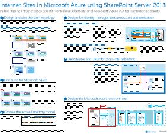

# Internetwebsites in Microsoft Azure mit SharePoint Server 2013

 Internet Websites, die SharePoint Server 2013 nutzen, indem Sie in Azure-Infrastrukturdiensten gehostet werden. Dieser Artikel bietet Ressourcen für den Entwurf und die Implementierung dieser Lösung.

## Verwenden von Windows Azure-Infrastrukturdiensten für Internetwebsites

Microsoft Azure bietet eine überzeugende Möglichkeit für das Hosting von Internetwebsites, die auf SharePoint Server 2013 basieren. Es ergeben sich folgende Vorteile:

- Konzentration auf die Entwicklung einer überzeugenden Website anstatt auf den Aufbau von Infrastruktur

- Flexibilität bei der Skalierung der Lösung entsprechend der Nachfrage

- Gebühren ausschließlich für die Ressourcen, die Sie benötigen und verwenden

- Nutzung von Azure Active Directory für Kundenkonten

- Hinzufügen von Features, die derzeit in Microsoft 365 nicht verfügbar sind, beispielsweise Deep Reporting und Analyse.

## Ressourcen

Die folgenden technischen Abbildungen und Artikel bieten Informationen zum Entwerfen und Implementieren von Internetwebsites in Azure mit SharePoint Server 2013.

|Ressource|Weitere Informationen|
|---|---|
|**SharePoint Server 2013-Internetwebsites in Azure**      [PDF](https://go.microsoft.com/fwlink/p/?LinkId=392552) \| [Visio](https://go.microsoft.com/fwlink/p/?LinkId=392551)|Dieses Architekturmodell zeigt wichtige Entwurfsaktivitäten und empfohlene Architekturentscheidungen für Internetwebsites in Azure.|
|**Entwurfsbeispiel: Internetwebsites in Azure für SharePoint Server 2013**   [  ]   [PDF](https://go.microsoft.com/fwlink/p/?LinkId=392549)  \| [Visio](https://go.microsoft.com/fwlink/p/?LinkId=392548)|Verwenden Sie dieses Entwurfsbeispiel als Ausgangspunkt für Ihre eigene Architektur.|
|**[Microsoft Azure-Architekturen für SharePoint 2013](microsoft-azure-architectures-for-sharepoint-2013.md)**   |In diesem Artikel wird beschrieben, wie Sie Azure-Architekturen zum Hosten von SharePoint-Lösungen entwerfen.|
|

## Siehe auch

[Microsoft 365-Center – Lösungen und Architekturen](../solutions/solution-architecture-center.md)
