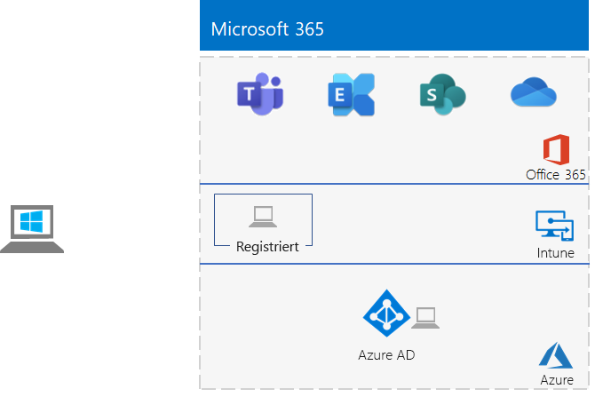

# <a name="the-lightweight-base-configuration"></a><span data-ttu-id="40c95-103">Die einfache Standardkonfiguration</span><span class="sxs-lookup"><span data-stu-id="40c95-103">The lightweight base configuration</span></span>

<span data-ttu-id="40c95-104">*Diese Testumgebungsanleitung kann sowohl für Microsoft 365 Enterprise- als auch für Office 365 Enterprise-Testumgebungen verwendet werden.*</span><span class="sxs-lookup"><span data-stu-id="40c95-104">*This Test Lab Guide can be used for both Microsoft 365 for enterprise and Office 365 Enterprise test environments.*</span></span>

<span data-ttu-id="40c95-105">In diesem Artikel wird beschrieben, wie Sie eine vereinfachte Umgebung mit einem Microsoft 365 E5-Abonnement und einem Computer mit Windows 10 Enterprise erstellen.</span><span class="sxs-lookup"><span data-stu-id="40c95-105">This article describes how to create a simplified environment with a Microsoft 365 E5 subscription and a computer running Windows 10 Enterprise.</span></span>



<span data-ttu-id="40c95-107">Das Erstellen einer einfachen Testumgebung umfasst fünf Phasen:</span><span class="sxs-lookup"><span data-stu-id="40c95-107">Creating a lightweight test environment involves five phases:</span></span>
- [<span data-ttu-id="40c95-108">Phase 1: Erstellen Ihres Microsoft 365 E5-Abonnements</span><span class="sxs-lookup"><span data-stu-id="40c95-108">Phase 1: Create your Microsoft 365 E5 subscription</span></span>](#phase-1-create-your-microsoft-365-e5-subscription)
- [<span data-ttu-id="40c95-109">Phase 2: Konfigurieren des Office 365-Testabonnements</span><span class="sxs-lookup"><span data-stu-id="40c95-109">Phase 2: Configure your Office 365 trial subscription</span></span>](#phase-2-configure-your-office-365-trial-subscription)
- [<span data-ttu-id="40c95-110">Phase 3: Hinzufügen eines Testabonnements für Microsoft 365 E5</span><span class="sxs-lookup"><span data-stu-id="40c95-110">Phase 3: Add a Microsoft 365 E5 trial subscription</span></span>](#phase-3-add-a-microsoft-365-e5-trial-subscription)
- [<span data-ttu-id="40c95-111">Phase 4: Erstellen eines Computers mit Windows 10 Enterprise</span><span class="sxs-lookup"><span data-stu-id="40c95-111">Phase 4: Create a Windows 10 Enterprise computer</span></span>](#phase-4-create-a-windows-10-enterprise-computer)
- [<span data-ttu-id="40c95-112">Phase 5: Einbinden des Windows 10-Computers in Azure AD</span><span class="sxs-lookup"><span data-stu-id="40c95-112">Phase 5: Join your Windows 10 computer to Azure AD</span></span>](#phase-5-join-your-windows-10-computer-to-azure-ad)

<span data-ttu-id="40c95-113">Verwenden Sie die resultierende Umgebung, um die Features und Funktionen von [Microsoft 365 Enterprise zu testen.](https://www.microsoft.com/microsoft-365/enterprise)</span><span class="sxs-lookup"><span data-stu-id="40c95-113">Use the resulting environment to test the features and functionality of [Microsoft 365 for enterprise](https://www.microsoft.com/microsoft-365/enterprise).</span></span>


  
> [!TIP]
> <span data-ttu-id="40c95-115">Eine visuelle Karte zu allen Artikeln im Microsoft 365 for Enterprise Test Lab Guide-Stapel finden Sie unter [Microsoft 365 for Enterprise Test Lab Guide Stack](../downloads/Microsoft365EnterpriseTLGStack.pdf).</span><span class="sxs-lookup"><span data-stu-id="40c95-115">For a visual map to all the articles in the Microsoft 365 for enterprise Test Lab Guide stack, see [Microsoft 365 for enterprise Test Lab Guide Stack](../downloads/Microsoft365EnterpriseTLGStack.pdf).</span></span>

>[!NOTE]
><span data-ttu-id="40c95-116">Sie können diesen Artikel auch ausdrucken, um die speziellen Informationen zu notieren, die Sie für diese Umgebung in den kommenden 30 Tage des Office 365-Testabonnements benötigen.</span><span class="sxs-lookup"><span data-stu-id="40c95-116">You might want to print this article to record the specific information that you will need for this environment over the 30 days of the Office 365 trial subscription.</span></span> <span data-ttu-id="40c95-117">Sie können das Testabonnement einfach um weitere 30 Tage verlängern.</span><span class="sxs-lookup"><span data-stu-id="40c95-117">You can easily extend the trail subscription for another 30 days.</span></span> <span data-ttu-id="40c95-118">Für eine dauerhafte Testumgebung erstellen Sie ein neues bezahltes Abonnement mit einem separaten Azure AD-Mandanten und einer kleinen Anzahl von Lizenzen.</span><span class="sxs-lookup"><span data-stu-id="40c95-118">For a permanent test environment, create a new paid subscription with a separate Azure AD tenant and a small number of licenses.</span></span>

## <a name="phase-1-create-your-microsoft-365-e5-subscription"></a><span data-ttu-id="40c95-119">Phase 1: Erstellen Ihres Microsoft 365 E5-Abonnements</span><span class="sxs-lookup"><span data-stu-id="40c95-119">Phase 1: Create your Microsoft 365 E5 subscription</span></span>

<span data-ttu-id="40c95-120">Wir beginnen mit einem Microsoft 365 E5-Testabonnement und fügen dann das Microsoft 365 E5-Abonnement hinzu.</span><span class="sxs-lookup"><span data-stu-id="40c95-120">We start with an Microsoft 365 E5 trial subscription and then add the Microsoft 365 E5 subscription to it.</span></span>

>[!NOTE]
><span data-ttu-id="40c95-121">Es wird empfohlen, ein Testabonnement von Office 365 zu erstellen, damit Ihre Testumgebung einen separaten Azure AD-Mandanten von allen kostenpflichtigen Abonnements hat, die Sie derzeit haben.</span><span class="sxs-lookup"><span data-stu-id="40c95-121">We recommend that you create a trial subscription of Office 365 so that your test environment has a separate Azure AD tenant from any paid subscriptions you currently have.</span></span> <span data-ttu-id="40c95-122">Diese Trennung bedeutet, dass Sie Benutzer und Gruppen im Test mandanten ohne Auswirkungen auf Ihre Produktionsabonnements hinzufügen und entfernen können.</span><span class="sxs-lookup"><span data-stu-id="40c95-122">This separation means that you can add and remove users and groups in the test tenant without affecting your production subscriptions.</span></span>

<span data-ttu-id="40c95-123">Für das Microsoft 365 E5-Testabonnement benötigen Sie zunächst einen fiktiven Unternehmensnamen und ein neues Microsoft-Konto.</span><span class="sxs-lookup"><span data-stu-id="40c95-123">To start your Microsoft 365 E5 trial subscription, you first need a fictitious company name and a new Microsoft account.</span></span>
  
1. <span data-ttu-id="40c95-p103">Es wird empfohlen, eine Variante von „Contoso“ als Unternehmensnamen zu verwenden. Dies ist ein fiktives Unternehmen, das von Microsoft in Beispielen verwendet wird. Notieren Sie hier Ihren fiktiven Unternehmensnamen: .</span><span class="sxs-lookup"><span data-stu-id="40c95-p103">We recommend that you use a variant of the company name Contoso for your company name, which is a fictitious company used in Microsoft sample content, but it isn't required. Record your fictitious company name here:</span></span> 
    
2. <span data-ttu-id="40c95-p104">Wenn Sie sich für ein neues Microsoft-Konto registrieren möchten, wechseln Sie zu [https://outlook.com](https://outlook.com), und erstellen Sie ein Konto mit neuem E-Mail-Konto und neuer E-Mail-Adresse. Dieses Konto wird für die Registrierung für Office 365 verwendet.</span><span class="sxs-lookup"><span data-stu-id="40c95-p104">To sign up for a new Microsoft account, go to [https://outlook.com](https://outlook.com) and create an account with a new email account and address. You will use this account to sign up for Office 365.</span></span>
    
    - <span data-ttu-id="40c95-129">Notieren Sie hier den Vor- und Nachnamen des Kontos: </span><span class="sxs-lookup"><span data-stu-id="40c95-129">Record the first and last name of your new account here:</span></span> 
    
    - <span data-ttu-id="40c95-131">Notieren Sie hier die neue E-Mail-Kontoadresse:</span><span class="sxs-lookup"><span data-stu-id="40c95-131">Record the new email account address here:</span></span> <span data-ttu-id="40c95-133">@outlook.com</span><span class="sxs-lookup"><span data-stu-id="40c95-133">@outlook.com</span></span>
    
### <a name="sign-up-for-an-office-365-e5-trial-subscription"></a><span data-ttu-id="40c95-134">Registrieren für ein Office 365 E5-Testabonnement</span><span class="sxs-lookup"><span data-stu-id="40c95-134">Sign up for an Office 365 E5 trial subscription</span></span>

1. <span data-ttu-id="40c95-135">Wechseln Sie in Ihrem Browser zu [https://aka.ms/e5trial](https://aka.ms/e5trial) .</span><span class="sxs-lookup"><span data-stu-id="40c95-135">In your browser, go to [https://aka.ms/e5trial](https://aka.ms/e5trial).</span></span>
    
2. <span data-ttu-id="40c95-136">Geben Sie in Schritt 1 der Seite Vielen Dank für die Auswahl von **Office 365 E5** Ihre neue E-Mail-Kontoadresse ein.</span><span class="sxs-lookup"><span data-stu-id="40c95-136">In step 1 of the **Thank you for choosing Office 365 E5** page, enter your new email account address.</span></span>
3. <span data-ttu-id="40c95-137">Geben Sie in Schritt 2 des Trailabonnements die angeforderten Informationen ein, und führen Sie dann die Überprüfung aus.</span><span class="sxs-lookup"><span data-stu-id="40c95-137">In step 2 of the trail subscription process, enter the requested information, and then perform the verification.</span></span>
4. <span data-ttu-id="40c95-138">Geben Sie in Schritt 3 einen Organisationsnamen und dann einen Kontonamen ein, der der globale Administrator für das Abonnement ist.</span><span class="sxs-lookup"><span data-stu-id="40c95-138">In step 3, enter an organization name and then an account name that will be the global admin for the subscription.</span></span>
5. <span data-ttu-id="40c95-139">Notieren Sie hier für Schritt 4 die Anmeldeseite (auswählen und kopieren):</span><span class="sxs-lookup"><span data-stu-id="40c95-139">For step 4, record the sign-in page here (select and copy):</span></span> 
6. <span data-ttu-id="40c95-141">Notieren Sie hier die Benutzer-ID: .onmicrosoft.com</span><span class="sxs-lookup"><span data-stu-id="40c95-141">Record the user ID here: .onmicrosoft.com</span></span>  
   <span data-ttu-id="40c95-142">Noten Sie das Kennwort, das Sie an einem sicheren Ort eingegeben haben.</span><span class="sxs-lookup"><span data-stu-id="40c95-142">Record the password that you entered in a secure location.</span></span>
   <span data-ttu-id="40c95-143">Dieser Wert wird **Name des globalen Administrators** genannt.</span><span class="sxs-lookup"><span data-stu-id="40c95-143">This value will be referred to as the **global administrator name**.</span></span>
7. <span data-ttu-id="40c95-144">Wählen **Sie Gehe zu Setup aus.**</span><span class="sxs-lookup"><span data-stu-id="40c95-144">Select **Go to Setup**.</span></span>
8. <span data-ttu-id="40c95-145">Wählen Sie in Office 365 E5 Setup die Option Weiter mit Ihrer Organisation **.onmicrosoft.com** für E-Mail und Anmeldung aus, und wählen Sie dann Beenden aus, und fahren Sie **später fort.**</span><span class="sxs-lookup"><span data-stu-id="40c95-145">In Office 365 E5 Setup, select **Continue using *your organization*.onmicrosoft.com for email and signing in**, and then select **Exit and continue later**.</span></span>

<span data-ttu-id="40c95-146">Das Microsoft 365 Admin Center sollte angezeigt werden.</span><span class="sxs-lookup"><span data-stu-id="40c95-146">You should see the Microsoft 365 admin center.</span></span>
    
## <a name="phase-2-configure-your-office-365-trial-subscription"></a><span data-ttu-id="40c95-147">Phase 2: Konfigurieren des Office 365-Testabonnements</span><span class="sxs-lookup"><span data-stu-id="40c95-147">Phase 2: Configure your Office 365 trial subscription</span></span>

<span data-ttu-id="40c95-148">In dieser Phase konfigurieren Sie Ihr Abonnement mit weiteren Benutzern und weisen diesen Office 365 E5-Lizenzen zu.</span><span class="sxs-lookup"><span data-stu-id="40c95-148">In this phase, you configure your subscription with additional users and assign them Office 365 E5 licenses.</span></span>
  
<span data-ttu-id="40c95-149">Um eine Verbindung mit Ihrem Abonnement mit dem Azure Active Directory PowerShell for Graph-Modul von Ihrem Computer aus herzustellen, verwenden Sie die Anweisungen unter [Connect to Microsoft 365 with PowerShell](connect-to-microsoft-365-powershell.md#connect-with-the-azure-active-directory-powershell-for-graph-module).</span><span class="sxs-lookup"><span data-stu-id="40c95-149">To connect to your subscription with the Azure Active Directory PowerShell for Graph module from your computer, use the instructions in [Connect to Microsoft 365 with PowerShell](connect-to-microsoft-365-powershell.md#connect-with-the-azure-active-directory-powershell-for-graph-module).</span></span>
    
<span data-ttu-id="40c95-150">Geben Sie **Windows PowerShell** Namen des globalen Administrators (z. B. jdoe@contosotoycompany.onmicrosoft.com *)* und das Kennwort ein.</span><span class="sxs-lookup"><span data-stu-id="40c95-150">In the **Windows PowerShell Credential Request** dialog box, enter the global administrator name (for example, *jdoe@contosotoycompany.onmicrosoft.com*) and password.</span></span>
  
<span data-ttu-id="40c95-151">Geben Sie den Namen Ihrer Organisation (z. B. *contosotoycompany),* den zwei zeichenigen Ländercode für Ihren Standort, ein allgemeines Kontokennwort ein, und führen Sie dann die folgenden Befehle an der PowerShell-Eingabeaufforderung aus:</span><span class="sxs-lookup"><span data-stu-id="40c95-151">Fill in your organization name (for example, *contosotoycompany*), the two-character country code for your location, a common account password, and then run the following commands from the PowerShell prompt:</span></span>

```powershell
$orgName="<organization name>"
$loc="<two-character country code, such as US>"
$commonPW="<common user account password>"
$PasswordProfile=New-Object -TypeName Microsoft.Open.AzureAD.Model.PasswordProfile
$PasswordProfile.Password=$commonPW

$userUPN= "user2@" + $orgName + ".onmicrosoft.com"
New-AzureADUser -DisplayName "User 2" -GivenName User -SurName 2 -UserPrincipalName $userUPN -UsageLocation $loc -AccountEnabled $true -PasswordProfile $PasswordProfile -MailNickName "user2"
$License = New-Object -TypeName Microsoft.Open.AzureAD.Model.AssignedLicense
$License.SkuId = (Get-AzureADSubscribedSku | Where-Object -Property SkuPartNumber -Value "ENTERPRISEPREMIUM" -EQ).SkuID
$LicensesToAssign = New-Object -TypeName Microsoft.Open.AzureAD.Model.AssignedLicenses
$LicensesToAssign.AddLicenses = $License
Set-AzureADUserLicense -ObjectId $userUPN -AssignedLicenses $LicensesToAssign

$userUPN= "user3@" + $orgName + ".onmicrosoft.com"
New-AzureADUser -DisplayName "User 3" -GivenName User -SurName 3 -UserPrincipalName $userUPN -UsageLocation $loc -AccountEnabled $true -PasswordProfile $PasswordProfile -MailNickName "user3"
$License = New-Object -TypeName Microsoft.Open.AzureAD.Model.AssignedLicense
$License.SkuId = (Get-AzureADSubscribedSku | Where-Object -Property SkuPartNumber -Value "ENTERPRISEPREMIUM" -EQ).SkuID
$LicensesToAssign = New-Object -TypeName Microsoft.Open.AzureAD.Model.AssignedLicenses
$LicensesToAssign.AddLicenses = $License
Set-AzureADUserLicense -ObjectId $userUPN -AssignedLicenses $LicensesToAssign

$userUPN= "user4@" + $orgName + ".onmicrosoft.com"
New-AzureADUser -DisplayName "User 4" -GivenName User -SurName 4 -UserPrincipalName $userUPN -UsageLocation $loc -AccountEnabled $true -PasswordProfile $PasswordProfile -MailNickName "user4"
$License = New-Object -TypeName Microsoft.Open.AzureAD.Model.AssignedLicense
$License.SkuId = (Get-AzureADSubscribedSku | Where-Object -Property SkuPartNumber -Value "ENTERPRISEPREMIUM" -EQ).SkuID
$LicensesToAssign = New-Object -TypeName Microsoft.Open.AzureAD.Model.AssignedLicenses
$LicensesToAssign.AddLicenses = $License
Set-AzureADUserLicense -ObjectId $userUPN -AssignedLicenses $LicensesToAssign
```
> [!NOTE]
> <span data-ttu-id="40c95-152">Für die Automatisierung und Vereinfachung der Konfiguration einer Testumgebung wird hier ein gemeinsames Kennwort verwendet.</span><span class="sxs-lookup"><span data-stu-id="40c95-152">The use of a common password here is for automation and ease of configuration for a test environment.</span></span> <span data-ttu-id="40c95-153">Natürlich ist davon bei Produktionsabonnements dringend abzuraten.</span><span class="sxs-lookup"><span data-stu-id="40c95-153">Obviously, this is highly discouraged for production subscriptions.</span></span> 

### <a name="record-key-information-for-future-reference"></a><span data-ttu-id="40c95-154">Aufzeichnen von Schlüsselinformationen für spätere Verweise</span><span class="sxs-lookup"><span data-stu-id="40c95-154">Record key information for future reference</span></span>

<span data-ttu-id="40c95-155">Wenn Sie diese Werte noch nicht aufgezeichnet haben, notieren Sie sie jetzt:</span><span class="sxs-lookup"><span data-stu-id="40c95-155">If you haven't already recorded these values, record them now:</span></span>
  
- <span data-ttu-id="40c95-156">Globaler Administratorname:</span><span class="sxs-lookup"><span data-stu-id="40c95-156">Global administrator name:</span></span> <span data-ttu-id="40c95-158">.onmicrosoft.com (aus Schritt 6 von Phase 1)</span><span class="sxs-lookup"><span data-stu-id="40c95-158">.onmicrosoft.com (from step 6 of Phase 1)</span></span>
    
    <span data-ttu-id="40c95-159">Notieren Sie auch das Kennwort für dieses Konto, und bewahren Sie es an einem sicheren Ort auf.</span><span class="sxs-lookup"><span data-stu-id="40c95-159">Also record the password for this account in a secure location.</span></span>
    
- <span data-ttu-id="40c95-160">Organisationsname für das Testabonnement:</span><span class="sxs-lookup"><span data-stu-id="40c95-160">Your trial subscription organization name:</span></span>  <span data-ttu-id="40c95-162">(aus Schritt 4 von Phase 1)</span><span class="sxs-lookup"><span data-stu-id="40c95-162">(from step 4 of Phase 1)</span></span>
    
- <span data-ttu-id="40c95-163">Führen Sie über die „Windows Azure Active Directory-Modul für Windows PowerShell“-Eingabeaufforderung den folgenden Befehl aus, um die Konten für Benutzer 2, Benutzer 3, Benutzer 4 und Benutzer 5 anzuzeigen:</span><span class="sxs-lookup"><span data-stu-id="40c95-163">To list the accounts for User 2, User 3, User 4, and User 5, run the following command from the Windows Azure Active Directory Module for Windows PowerShell prompt:</span></span>
    
  ```powershell
  Get-AzureADUser | Sort UserPrincipalName | Select UserPrincipalName
  ```

    <span data-ttu-id="40c95-164">Notieren Sie hier die Kontonamen:</span><span class="sxs-lookup"><span data-stu-id="40c95-164">Record the account names here:</span></span>
    
  - <span data-ttu-id="40c95-165">Benutzer 2 Kontoname: user2@</span><span class="sxs-lookup"><span data-stu-id="40c95-165">User 2 account name: user2@</span></span><span data-ttu-id="40c95-167">.onmicrosoft.com</span><span class="sxs-lookup"><span data-stu-id="40c95-167">.onmicrosoft.com</span></span>
    
  - <span data-ttu-id="40c95-168">Benutzer 3 Kontoname: user3@</span><span class="sxs-lookup"><span data-stu-id="40c95-168">User 3 account name: user3@</span></span><span data-ttu-id="40c95-170">.onmicrosoft.com</span><span class="sxs-lookup"><span data-stu-id="40c95-170">.onmicrosoft.com</span></span>
    
  - <span data-ttu-id="40c95-171">Benutzer 4 Kontoname: user4@</span><span class="sxs-lookup"><span data-stu-id="40c95-171">User 4 account name: user4@</span></span><span data-ttu-id="40c95-173">.onmicrosoft.com</span><span class="sxs-lookup"><span data-stu-id="40c95-173">.onmicrosoft.com</span></span>
    
  - <span data-ttu-id="40c95-174">Benutzer 5 Kontoname: user5@</span><span class="sxs-lookup"><span data-stu-id="40c95-174">User 5 account name: user5@</span></span><span data-ttu-id="40c95-176">.onmicrosoft.com</span><span class="sxs-lookup"><span data-stu-id="40c95-176">.onmicrosoft.com</span></span>
    
    <span data-ttu-id="40c95-177">Notieren Sie auch das gemeinsame Kennwort für diese Konten, und bewahren Sie es an einem sicheren Ort auf.</span><span class="sxs-lookup"><span data-stu-id="40c95-177">Also record the common password for these accounts in a secure location.</span></span>
   
### <a name="using-an-office-365-test-environment"></a><span data-ttu-id="40c95-178">Verwenden einer Office 365-Testumgebung</span><span class="sxs-lookup"><span data-stu-id="40c95-178">Using an Office 365 test environment</span></span>

<span data-ttu-id="40c95-179">Wenn Sie nur eine Office 365-Testumgebung benötigen, müssen Sie den Rest dieses Artikels nicht lesen.</span><span class="sxs-lookup"><span data-stu-id="40c95-179">If you need only an Office 365 test environment, you do not need to read the rest of this article.</span></span>

<span data-ttu-id="40c95-180">Weitere Testumgebungsanleitungen, die sowohl für Office 365 als auch für Microsoft 365 gelten, finden Sie unter [Microsoft 365 for Enterprise Test Lab Guides](m365-enterprise-test-lab-guides.md).</span><span class="sxs-lookup"><span data-stu-id="40c95-180">For additional Test Lab Guides that apply to both Office 365 and Microsoft 365, see [Microsoft 365 for enterprise Test Lab Guides](m365-enterprise-test-lab-guides.md).</span></span>
  
## <a name="phase-3-add-a-microsoft-365-e5-trial-subscription"></a><span data-ttu-id="40c95-181">Phase 3: Hinzufügen eines Testabonnements für Microsoft 365 E5</span><span class="sxs-lookup"><span data-stu-id="40c95-181">Phase 3: Add a Microsoft 365 E5 trial subscription</span></span>

<span data-ttu-id="40c95-182">In dieser Phase registrieren Sie sich für das Microsoft 365 E5-Testabonnement und fügen es derselben Organisation wie Ihr Office 365 E5-Testabonnement hinzu.</span><span class="sxs-lookup"><span data-stu-id="40c95-182">In this phase, you sign up for the Microsoft 365 E5 trial subscription and add it to the same organization as your Office 365 E5 trial subscription.</span></span>
  
<span data-ttu-id="40c95-183">Fügen Sie zuerst das Testabonnement für Microsoft 365 E5 hinzu, und weisen Sie ihrem globalen Administratorkonto die neue Microsoft 365-Lizenz zu.</span><span class="sxs-lookup"><span data-stu-id="40c95-183">First, add the Microsoft 365 E5 trial subscription and assign the new Microsoft 365 license to your global administrator account.</span></span>
  
1. <span data-ttu-id="40c95-184">Verwenden Sie in einem privaten Fenster des Internetbrowsers Ihre Anmeldeinformationen für ihr globales Administratorkonto, um sich beim Microsoft 365 Admin Center unter zu [https://admin.microsoft.com](https://admin.microsoft.com) anmelden.</span><span class="sxs-lookup"><span data-stu-id="40c95-184">In an internet browser private window, use your global administrator account credentials to sign in to the Microsoft 365 admin center at [https://admin.microsoft.com](https://admin.microsoft.com).</span></span>
    
2. <span data-ttu-id="40c95-185">Wählen Sie auf der **Seite Microsoft 365 Admin Center** im linken Navigationsbereich Abrechnung > Dienste kaufen **aus.**</span><span class="sxs-lookup"><span data-stu-id="40c95-185">On the **Microsoft 365 admin center** page, in the left navigation, select **Billing > Purchase services**.</span></span>
    
3. <span data-ttu-id="40c95-186">Wählen Sie **auf der** Seite Dienste kaufen die Option **Microsoft 365 E5** aus, und wählen Sie dann **Kostenlose Testversion erhalten aus.**</span><span class="sxs-lookup"><span data-stu-id="40c95-186">On the **Purchase services** page, select **Microsoft 365 E5**, and then select **Get free trial**.</span></span>

4. <span data-ttu-id="40c95-187">Entscheiden Sie sich auf der Microsoft **365** E5-Testversionsseite für den Empfang einer Textnachricht oder eines Telefonanrufs, geben Sie Ihre Telefonnummer ein, und wählen Sie dann **Text me** or **Call me** aus.</span><span class="sxs-lookup"><span data-stu-id="40c95-187">On the **Microsoft 365 E5 Trial** page, decide to receive a text message or a phone call, enter your phone number, and then select **Text me** or **Call me**.</span></span> <span data-ttu-id="40c95-188">Führen Sie eine Überprüfung durch.</span><span class="sxs-lookup"><span data-stu-id="40c95-188">Perform the verification.</span></span>

5. <span data-ttu-id="40c95-189">Wählen Sie **auf der Seite Bestellung bestätigen** die Option Jetzt testen **aus.**</span><span class="sxs-lookup"><span data-stu-id="40c95-189">On the **Confirm your order** page, select **Try now**.</span></span>

6. <span data-ttu-id="40c95-190">Wählen Sie **auf der** Seite Bestellungsbestätigung die Option **Weiter aus.**</span><span class="sxs-lookup"><span data-stu-id="40c95-190">On the **Order receipt** page, select **Continue**.</span></span>

7. <span data-ttu-id="40c95-191">Wählen Sie im Microsoft 365 Admin Center Die Option **Benutzer > aktive Benutzer aus.**</span><span class="sxs-lookup"><span data-stu-id="40c95-191">In the Microsoft 365 admin center, select **Users > Active users**.</span></span>

8. <span data-ttu-id="40c95-192">Wählen **Sie unter Aktive** Benutzer Ihr Administratorkonto aus.</span><span class="sxs-lookup"><span data-stu-id="40c95-192">In **Active users**, select your administrator account.</span></span>

9. <span data-ttu-id="40c95-193">Wählen **Sie Lizenzen und Apps aus.**</span><span class="sxs-lookup"><span data-stu-id="40c95-193">Select **Licenses and apps**.</span></span>

10. <span data-ttu-id="40c95-194">Deaktivieren Sie die Lizenz für Office 365 Enterprise E5 und aktivieren Sie die Lizenz für Microsoft 365 E5.</span><span class="sxs-lookup"><span data-stu-id="40c95-194">Disable the license for Office 365 Enterprise E5 and enable the license for Microsoft 365 E5.</span></span>

11. <span data-ttu-id="40c95-195">Wählen **Sie Änderungen speichern** aus, und schließen Sie dann den Benutzerkontoinformationsbereich.</span><span class="sxs-lookup"><span data-stu-id="40c95-195">Select **Save changes**, and then close the user account information pane.</span></span>

<span data-ttu-id="40c95-196">Wiederholen Sie dann die Schritte 8 bis 11 des vorherigen Verfahrens für alle anderen Konten (Benutzer 2, Benutzer 3, Benutzer 4 und Benutzer 5).</span><span class="sxs-lookup"><span data-stu-id="40c95-196">Next, repeat steps 8 through 11 of the previous procedure for all of your other accounts (User 2, User 3, User 4, and User 5).</span></span>
  
> [!NOTE]
> <span data-ttu-id="40c95-197">Die Dauer des Microsoft 365 E5-Testabonnements beträgt 30 Tage.</span><span class="sxs-lookup"><span data-stu-id="40c95-197">The length of the Microsoft 365 E5 trial subscription is 30 days.</span></span> <span data-ttu-id="40c95-198">Ändern Sie für eine dauerhafte Testumgebung dieses Testabonnement in ein kostenpflichtiges Abonnement mit einer kleinen Anzahl von Lizenzen.</span><span class="sxs-lookup"><span data-stu-id="40c95-198">For a permanent test environment, convert this trial subscription into a paid subscription with a small number of licenses.</span></span>
  
<span data-ttu-id="40c95-199">Ihre Testumgebung verfügt nun über Folgendes:</span><span class="sxs-lookup"><span data-stu-id="40c95-199">Your test environment now has:</span></span>
  
- <span data-ttu-id="40c95-200">Ein Testabonnement für Microsoft 365 E5.</span><span class="sxs-lookup"><span data-stu-id="40c95-200">A Microsoft 365 E5 trial subscription.</span></span>
- <span data-ttu-id="40c95-201">Alle Ihre entsprechenden Benutzerkonten (entweder nur der globale Administrator oder alle fünf Benutzerkonten) können Microsoft 365 E5 verwenden.</span><span class="sxs-lookup"><span data-stu-id="40c95-201">All your appropriate user accounts (either just the global administrator or all five user accounts) are enabled to use Microsoft 365 E5.</span></span>
    
<span data-ttu-id="40c95-202">Die resultierende Konfiguration, die Microsoft 365 E5 hinzufügt, sieht wie die folgenden aus:</span><span class="sxs-lookup"><span data-stu-id="40c95-202">Your resulting configuration, which adds Microsoft 365 E5, looks like this:</span></span>
  

  
## <a name="phase-4-create-a-windows-10-enterprise-computer"></a><span data-ttu-id="40c95-204">Phase 4: Erstellen eines Computers mit Windows 10 Enterprise</span><span class="sxs-lookup"><span data-stu-id="40c95-204">Phase 4: Create a Windows 10 Enterprise computer</span></span>

<span data-ttu-id="40c95-205">In dieser Phase erstellen Sie einen eigenständigen Computer unter Windows 10 Enterprise entweder als physischen Computer, als virtuellen Computer oder als virtuellen Azure-Computer.</span><span class="sxs-lookup"><span data-stu-id="40c95-205">In this phase, you create a standalone computer running Windows 10 Enterprise as either a physical computer, a virtual machine, or an Azure virtual machine.</span></span>
  
### <a name="physical-computer"></a><span data-ttu-id="40c95-206">Physischer Computer</span><span class="sxs-lookup"><span data-stu-id="40c95-206">Physical computer</span></span>

<span data-ttu-id="40c95-207">Installieren Sie auf einem PC Windows 10 Enterprise.</span><span class="sxs-lookup"><span data-stu-id="40c95-207">On a personal computer, install Windows 10 Enterprise.</span></span> <span data-ttu-id="40c95-208">Sie können die Windows 10 Enterprise-Testversion hier [herunterladen.](https://www.microsoft.com/evalcenter/evaluate-windows-10-enterprise)</span><span class="sxs-lookup"><span data-stu-id="40c95-208">You can download the Windows 10 Enterprise trial [here](https://www.microsoft.com/evalcenter/evaluate-windows-10-enterprise).</span></span>
  
### <a name="virtual-machine"></a><span data-ttu-id="40c95-209">Virtueller Computer</span><span class="sxs-lookup"><span data-stu-id="40c95-209">Virtual machine</span></span>

<span data-ttu-id="40c95-210">Verwenden Sie den Hypervisor Ihrer Wahl, um einen virtuellen Computer zu erstellen und dann Windows 10 Enterprise auf dem Computer zu installieren.</span><span class="sxs-lookup"><span data-stu-id="40c95-210">Use the hypervisor of your choice to create a virtual machine, and then install Windows 10 Enterprise on it.</span></span> <span data-ttu-id="40c95-211">Sie können die Windows 10 Enterprise-Testversion hier [herunterladen.](https://www.microsoft.com/evalcenter/evaluate-windows-10-enterprise)</span><span class="sxs-lookup"><span data-stu-id="40c95-211">You can download the Windows 10 Enterprise trial [here](https://www.microsoft.com/evalcenter/evaluate-windows-10-enterprise).</span></span>
  
### <a name="virtual-machine-in-azure"></a><span data-ttu-id="40c95-212">Virtueller Computer in Azure</span><span class="sxs-lookup"><span data-stu-id="40c95-212">Virtual machine in Azure</span></span>

<span data-ttu-id="40c95-p111">Zum Erstellen eines virtuellen Computers mit Windows 10 in Microsoft Azure ***benötigen Sie ein Visual Studio-basiertes Abonnement***, das Zugriff auf das Image für Windows 10 Enterprise hat. Andere Arten von Azure-Abonnements, wie z. B. Testabonnements und kostenpflichtige Abonnements, haben keinen Zugriff auf dieses Image. Die neuesten Informationen finden Sie unter [Verwenden des Windows-Clients in Azure für Entwicklungs-/Testszenarien](/azure/virtual-machines/windows/client-images).</span><span class="sxs-lookup"><span data-stu-id="40c95-p111">To create a Windows 10 virtual machine in Microsoft Azure, ***you must have a Visual Studio-based subscription***, which has access to the image for Windows 10 Enterprise. Other types of Azure subscriptions, such as trial and paid subscriptions, do not have access to this image. For the latest information, see [Use Windows client in Azure for dev/test scenarios](/azure/virtual-machines/windows/client-images).</span></span>
  
> [!NOTE]
> <span data-ttu-id="40c95-216">[!HINWEIS] In den folgenden Befehlssätzen wird die aktuelle Version von Azure PowerShell verwendet.</span><span class="sxs-lookup"><span data-stu-id="40c95-216">The following command sets use the latest version of Azure PowerShell.</span></span> <span data-ttu-id="40c95-217">Informationen dazu finden Sie unter [Get started with Azure PowerShell cmdlets](/powershell/azureps-cmdlets-docs/).</span><span class="sxs-lookup"><span data-stu-id="40c95-217">See [Get started with Azure PowerShell cmdlets](/powershell/azureps-cmdlets-docs/).</span></span> <span data-ttu-id="40c95-218">Mit diesen Befehlssätzen werden ein virtueller Windows 10 Enterprise-Computer mit dem Namen „WIN10“ hat sowie die gesamte erforderliche Infrastruktur, einschließlich einer Ressourcengruppe, eines Speicherkontos und eines virtuellen Netzwerks erstellt.</span><span class="sxs-lookup"><span data-stu-id="40c95-218">These command sets build a Windows 10 Enterprise virtual machine named WIN10 and all of its required infrastructure, including a resource group, a storage account, and a virtual network.</span></span> <span data-ttu-id="40c95-219">Wenn Sie bereits mit Azure-Infrastrukturdiensten vertraut sind, passen Sie diese Anweisungen an Ihre derzeit bereitgestellte Infrastruktur an.</span><span class="sxs-lookup"><span data-stu-id="40c95-219">If you are already familiar with Azure infrastructure services, adapt these instructions to suit your currently deployed infrastructure.</span></span>
  
<span data-ttu-id="40c95-220">Starten Sie zuerst eine Microsoft PowerShell-Eingabeaufforderung.</span><span class="sxs-lookup"><span data-stu-id="40c95-220">First, start a Microsoft PowerShell prompt.</span></span>
  
<span data-ttu-id="40c95-221">Melden Sie sich bei Ihrem Azure-Konto mit diesem Befehl an.</span><span class="sxs-lookup"><span data-stu-id="40c95-221">Sign in to your Azure account with this command.</span></span>
  
```powershell
Connect-AzAccount
```

<span data-ttu-id="40c95-222">Verwenden Sie diesen Befehl, um Den Abonnementnamen zu erhalten.</span><span class="sxs-lookup"><span data-stu-id="40c95-222">Get your subscription name using this  command.</span></span>
  
```powershell
Get-AzSubscription | Sort Name | Select Name
```

<span data-ttu-id="40c95-223">Tragen Sie Ihr Azure-Abonnement ein.</span><span class="sxs-lookup"><span data-stu-id="40c95-223">Set your Azure subscription.</span></span> <span data-ttu-id="40c95-224">Ersetzen Sie alles innerhalb der Anführungszeichen, einschließlich \< and > der Zeichen, durch den richtigen Namen.</span><span class="sxs-lookup"><span data-stu-id="40c95-224">Replace everything within the quotation marks, including the \< and > characters, with the correct name.</span></span>
  
```powershell
$subscr="<subscription name>"
Get-AzSubscription -SubscriptionName $subscr | Select-AzSubscription
```

<span data-ttu-id="40c95-p114">Im nächsten Schritt wird eine neue Ressourcengruppe erstellt. Verwenden Sie zum Ermitteln eines eindeutigen Ressourcengruppennamens diesen Befehl, mit dem die vorhandenen Ressourcengruppen aufgeführt werden.</span><span class="sxs-lookup"><span data-stu-id="40c95-p114">Next, create a new resource group. To determine a unique resource group name, use this command to list your existing resource groups.</span></span>
  
```powershell
Get-AzResourceGroup | Sort ResourceGroupName | Select ResourceGroupName
```

<span data-ttu-id="40c95-227">Erstellen Sie die neue Ressourcengruppe mit diesen Befehlen.</span><span class="sxs-lookup"><span data-stu-id="40c95-227">Create your new resource group with these commands.</span></span> <span data-ttu-id="40c95-228">Ersetzen Sie alles innerhalb der Anführungszeichen, einschließlich \< and > der Zeichen, durch die richtigen Namen.</span><span class="sxs-lookup"><span data-stu-id="40c95-228">Replace everything within the quotation marks, including the \< and > characters, with the correct names.</span></span>
  
```powershell
$rgName="<resource group name>"
$locName="<location name, such as West US>"
New-AzResourceGroup -Name $rgName -Location $locName
```

<span data-ttu-id="40c95-229">Erstellen Sie als Nächstes ein neues virtuelles Netzwerk und den virtuellen COMPUTER WIN10 mit diesen Befehlen.</span><span class="sxs-lookup"><span data-stu-id="40c95-229">Next, create a new virtual network and the WIN10 virtual machine with these commands.</span></span> <span data-ttu-id="40c95-230">Wenn Sie dazu aufgefordert werden, geben Sie den Namen und das Kennwort des lokalen Administratorkontos für WIN10 an, und bewahren Sie dieses an einem sicheren Ort auf.</span><span class="sxs-lookup"><span data-stu-id="40c95-230">When prompted, provide the name and password of the local administrator account for WIN10 and store these in a secure location.</span></span>
  
```powershell
$corpnetSubnet=New-AzVirtualNetworkSubnetConfig -Name Corpnet -AddressPrefix 10.0.0.0/24
New-AzVirtualNetwork -Name "M365Ent-TestLab" -ResourceGroupName $rgName -Location $locName -AddressPrefix 10.0.0.0/8 -Subnet $corpnetSubnet
$rule1=New-AzNetworkSecurityRuleConfig -Name "RDPTraffic" -Description "Allow RDP to all VMs on the subnet" -Access Allow -Protocol Tcp -Direction Inbound -Priority 100 -SourceAddressPrefix Internet -SourcePortRange * -DestinationAddressPrefix * -DestinationPortRange 3389
New-AzNetworkSecurityGroup -Name Corpnet -ResourceGroupName $rgName -Location $locName -SecurityRules $rule1
$vnet=Get-AzVirtualNetwork -ResourceGroupName $rgName -Name "M365Ent-TestLab"
$nsg=Get-AzNetworkSecurityGroup -Name Corpnet -ResourceGroupName $rgName
Set-AzVirtualNetworkSubnetConfig -VirtualNetwork $vnet -Name Corpnet -AddressPrefix "10.0.0.0/24" -NetworkSecurityGroup $nsg
$vnet | Set-AzVirtualNetwork
$pip=New-AzPublicIpAddress -Name WIN10-PIP -ResourceGroupName $rgName -Location $locName -AllocationMethod Dynamic
$nic=New-AzNetworkInterface -Name WIN10-NIC -ResourceGroupName $rgName -Location $locName -SubnetId $vnet.Subnets[0].Id -PublicIpAddressId $pip.Id
$vm=New-AzVMConfig -VMName WIN10 -VMSize Standard_A2_V2
$cred=Get-Credential -Message "Type the name and password of the local administrator account for WIN10."
$vm=Set-AzVMOperatingSystem -VM $vm -Windows -ComputerName WIN10 -Credential $cred -ProvisionVMAgent -EnableAutoUpdate
$vm=Set-AzVMSourceImage -VM $vm -PublisherName MicrosoftWindowsDesktop -Offer Windows-10 -Skus RS3-Pro -Version "latest"
$vm=Add-AzVMNetworkInterface -VM $vm -Id $nic.Id
$vm=Set-AzVMOSDisk -VM $vm -Name WIN10-TestLab-OSDisk -DiskSizeInGB 128 -CreateOption FromImage
New-AzVM -ResourceGroupName $rgName -Location $locName -VM $vm
```

## <a name="phase-5-join-your-windows-10-computer-to-azure-ad"></a><span data-ttu-id="40c95-231">Phase 5: Einbinden des Windows 10-Computers in Azure AD</span><span class="sxs-lookup"><span data-stu-id="40c95-231">Phase 5: Join your Windows 10 computer to Azure AD</span></span>

<span data-ttu-id="40c95-232">Nachdem Sie den physischen oder virtuellen Computer mit Windows 10 Enterprise erstellt haben, melden Sie sich mit einem lokalen Administratorkonto an.</span><span class="sxs-lookup"><span data-stu-id="40c95-232">After the physical or virtual machine with Windows 10 Enterprise is created, sign in with a local administrator account.</span></span>
  
> [!NOTE]
> <span data-ttu-id="40c95-233">Verwenden Sie für einen virtuellen Computer in Azure  [diese Anweisungen,](/azure/virtual-machines/windows/connect-logon) um eine Verbindung zu diesem Computer herzustellen.</span><span class="sxs-lookup"><span data-stu-id="40c95-233">For a virtual machine in Azure, use  [these instructions](/azure/virtual-machines/windows/connect-logon) to connect to it.</span></span>
  
<span data-ttu-id="40c95-234">Als Nächstes fügen Sie den WIN10-Computer dem Azure AD-Mandanten Ihres Microsoft 365 E5-Abonnements hinzu.</span><span class="sxs-lookup"><span data-stu-id="40c95-234">Next, join the WIN10 computer to the Azure AD tenant of your Microsoft 365 E5 subscription.</span></span>
  
1. <span data-ttu-id="40c95-235">Wählen Sie auf dem Desktop des WIN10-Computers Start > Einstellungen > Konten > Access **work or school > Connect aus.**</span><span class="sxs-lookup"><span data-stu-id="40c95-235">On the desktop of the WIN10 computer, select **Start > Settings > Accounts > Access work or school > Connect**.</span></span>
    
2. <span data-ttu-id="40c95-236">Wählen Sie im Dialogfeld Einrichten eines Arbeits- oder **Schulkontos** die Option Dieses Gerät zu **Azure Active Directory hinzufügen aus.**</span><span class="sxs-lookup"><span data-stu-id="40c95-236">In the **Set up a work or school account** dialog box, select **Join this device to Azure Active Directory**.</span></span>
    
3. <span data-ttu-id="40c95-237">Geben **Sie unter Arbeits- oder** Schulkonto den globalen Administratorkontonamen Ihres Microsoft 365 E5-Abonnements ein, und wählen Sie dann Weiter **aus.**</span><span class="sxs-lookup"><span data-stu-id="40c95-237">In **Work or school account**, enter the global administrator account name of your Microsoft 365 E5 subscription, and then select **Next**.</span></span>
    
4. <span data-ttu-id="40c95-238">Geben **Sie unter** Kennwort eingeben das Kennwort für Ihr globales Administratorkonto ein, und wählen Sie dann Anmelden **aus.**</span><span class="sxs-lookup"><span data-stu-id="40c95-238">In **Enter password**, enter the password for your global administrator account, and then select **Sign in**.</span></span>
    
5. <span data-ttu-id="40c95-239">Wenn Sie aufgefordert werden, sicherzustellen, dass es sich um Ihre Organisation handelt, wählen Sie **Beitreten** aus, und wählen Sie dann **Fertig aus.**</span><span class="sxs-lookup"><span data-stu-id="40c95-239">When prompted to make sure that this is your organization, select **Join**, and then select **Done**.</span></span>
    
6. <span data-ttu-id="40c95-240">Schließen Sie das Fenster mit den Einstellungen.</span><span class="sxs-lookup"><span data-stu-id="40c95-240">Close the settings window.</span></span>
    
<span data-ttu-id="40c95-241">Installieren Sie als Nächstes Microsoft 365 Apps for Enterprise auf dem WIN10-Computer:</span><span class="sxs-lookup"><span data-stu-id="40c95-241">Next, install Microsoft 365 Apps for enterprise on the WIN10 computer:</span></span>
  
1. <span data-ttu-id="40c95-242">Öffnen Sie den Microsoft Edge-Browser, und melden Sie sich beim [Microsoft 365 Admin Center](https://admin.microsoft.com) mit Den Anmeldeinformationen ihres globalen Administratorkontos an.</span><span class="sxs-lookup"><span data-stu-id="40c95-242">Open the Microsoft Edge browser and sign in to the [Microsoft 365 admin center](https://admin.microsoft.com) with your global administrator account credentials.</span></span>
    
2. <span data-ttu-id="40c95-243">Wählen Sie **auf Microsoft Office Registerkarte Start** die Option Office installieren **aus.**</span><span class="sxs-lookup"><span data-stu-id="40c95-243">On the **Microsoft Office Home** tab, select **Install Office**.</span></span>
    
3. <span data-ttu-id="40c95-244">Wenn Sie dazu aufgefordert werden, was Sie tun möchten, wählen **Sie Ausführen** aus, und wählen Sie dann **Ja** für **Die Benutzerkontensteuerung aus.**</span><span class="sxs-lookup"><span data-stu-id="40c95-244">When prompted with what to do, select **Run**, and then select **Yes** for **User Account Control**.</span></span>
    
4. <span data-ttu-id="40c95-245">Warten Sie, bis Office die Installation beendet hat.</span><span class="sxs-lookup"><span data-stu-id="40c95-245">Wait for Office to complete its installation.</span></span> <span data-ttu-id="40c95-246">Wenn Sie **sehen, dass Sie alle festgelegt sind!**, wählen Sie **zweimal Schließen** aus.</span><span class="sxs-lookup"><span data-stu-id="40c95-246">When you see **You're all set!**, select **Close** twice.</span></span>
    
<span data-ttu-id="40c95-247">Die resultierende Umgebung sieht wie die folgenden aus:</span><span class="sxs-lookup"><span data-stu-id="40c95-247">Your resulting environment looks like this:</span></span>


<span data-ttu-id="40c95-249">Dies schließt den WIN10-Computer mit ein:</span><span class="sxs-lookup"><span data-stu-id="40c95-249">This includes the WIN10 computer that has:</span></span>

- <span data-ttu-id="40c95-250">Er wurde dem Azure AD-Mandanten Ihres Microsoft 365 E5-Abonnements hinzugefügt.</span><span class="sxs-lookup"><span data-stu-id="40c95-250">Joined the Azure AD tenant of your Microsoft 365 E5 subscription.</span></span>
- <span data-ttu-id="40c95-251">Er wurde als Azure AD-Gerät in Microsoft Intune (EMS) registriert.</span><span class="sxs-lookup"><span data-stu-id="40c95-251">Enrolled as an Azure AD device in Microsoft Intune (EMS).</span></span>
- <span data-ttu-id="40c95-252">Microsoft 365 Apps for Enterprise installiert.</span><span class="sxs-lookup"><span data-stu-id="40c95-252">Microsoft 365 Apps for enterprise installed.</span></span>
  
<span data-ttu-id="40c95-253">Sie können nun mit zusätzlichen Features von [Microsoft 365 Enterprise experimentieren.](https://www.microsoft.com/microsoft-365/enterprise)</span><span class="sxs-lookup"><span data-stu-id="40c95-253">You are now ready to experiment with additional features of [Microsoft 365 for enterprise](https://www.microsoft.com/microsoft-365/enterprise).</span></span>
  
## <a name="next-steps"></a><span data-ttu-id="40c95-254">Nächste Schritte</span><span class="sxs-lookup"><span data-stu-id="40c95-254">Next steps</span></span>

<span data-ttu-id="40c95-255">Sehen Sie sich diese zusätzlichen Testumgebungsanleitungen an:</span><span class="sxs-lookup"><span data-stu-id="40c95-255">Explore these additional sets of Test Lab Guides:</span></span>
  
- [<span data-ttu-id="40c95-256">Identität</span><span class="sxs-lookup"><span data-stu-id="40c95-256">Identity</span></span>](m365-enterprise-test-lab-guides.md#identity)
- [<span data-ttu-id="40c95-257">Verwaltung mobiler Geräte</span><span class="sxs-lookup"><span data-stu-id="40c95-257">Mobile device management</span></span>](m365-enterprise-test-lab-guides.md#mobile-device-management)
- [<span data-ttu-id="40c95-258">Schutz von Daten</span><span class="sxs-lookup"><span data-stu-id="40c95-258">Information protection</span></span>](m365-enterprise-test-lab-guides.md#information-protection)
   

## <a name="see-also"></a><span data-ttu-id="40c95-259">Siehe auch</span><span class="sxs-lookup"><span data-stu-id="40c95-259">See also</span></span>

[<span data-ttu-id="40c95-260">Testumgebungsanleitungen für Microsoft 365 Enterprise</span><span class="sxs-lookup"><span data-stu-id="40c95-260">Microsoft 365 for enterprise Test Lab Guides</span></span>](m365-enterprise-test-lab-guides.md)

[<span data-ttu-id="40c95-261">Übersicht über Microsoft 365 Enterprise</span><span class="sxs-lookup"><span data-stu-id="40c95-261">Microsoft 365 for enterprise overview</span></span>](microsoft-365-overview.md)

[<span data-ttu-id="40c95-262">Dokumentation zu Microsoft 365 Enterprise</span><span class="sxs-lookup"><span data-stu-id="40c95-262">Microsoft 365 for enterprise documentation</span></span>](/microsoft-365-enterprise/)