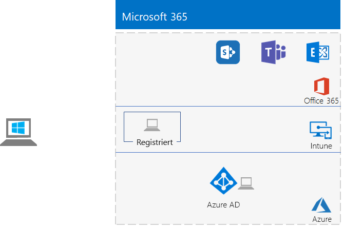
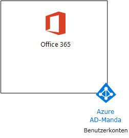
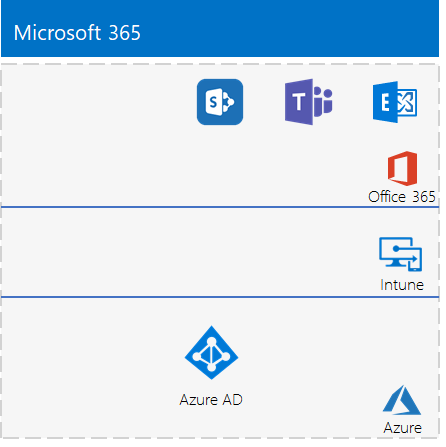

# <a name="the-lightweight-base-configuration"></a><span data-ttu-id="e73e9-103">Die einfache Standardkonfiguration</span><span class="sxs-lookup"><span data-stu-id="e73e9-103">The lightweight base configuration</span></span>

<span data-ttu-id="e73e9-104">In diesem Artikel erhalten Sie schrittweise Anweisungen zum Erstellen einer vereinfachten Umgebung, die Office 365 E5, Enterprise Mobility + Security (EMS) E5 und einen Computer mit Windows 10 Enterprise umfasst.</span><span class="sxs-lookup"><span data-stu-id="e73e9-104">This article provides you with step-by-step instructions to create a simplified environment that includes Office 365 E5, Enterprise Mobility + Security (EMS) E5, and a computer running Windows 10 Enterprise.</span></span> 



<span data-ttu-id="e73e9-106">Verwenden die resultierende Umgebung zum Testen der Features und Funktionen von [Microsoft 365 Enterprise](https://www.microsoft.com/microsoft-365/enterprise).</span><span class="sxs-lookup"><span data-stu-id="e73e9-106">Use the resulting environment to test the features and functionality of [Microsoft 365 Enterprise](https://www.microsoft.com/microsoft-365/enterprise).</span></span>


  
> [!TIP]
> <span data-ttu-id="e73e9-108">Klicken Sie [hier](https://aka.ms/m365etlgstack), um eine visuelle Darstellung aller Artikel im Stapel der Testumgebungsanleitungen in Microsoft 365 Enterprise zu erhalten.</span><span class="sxs-lookup"><span data-stu-id="e73e9-108">Click [here](https://aka.ms/m365etlgstack) for a visual map to all the articles in the Microsoft 365 Enterprise Test Lab Guide stack.</span></span>

## <a name="phase-1-create-your-office-365-e5-subscription"></a><span data-ttu-id="e73e9-109">Phase 1: Erstellen des Office 365 E5-Abonnements</span><span class="sxs-lookup"><span data-stu-id="e73e9-109">Phase 1: Create your Office 365 E5 subscription</span></span>

<span data-ttu-id="e73e9-110">Folgen Sie den Schritten für Phase 2 und 3 unter [Office 365-Entwicklungs-/Testumgebung](https://docs.microsoft.com/office365/enterprise/office-365-dev-test-environment), um eine einfache Entwicklungs-/Testumgebung für Office 365 zu erstellen, wie in Abbildung 1 gezeigt.</span><span class="sxs-lookup"><span data-stu-id="e73e9-110">Follow the steps in Phase 2 and Phase 3 of the [Office 365 dev/test environment](https://docs.microsoft.com/office365/enterprise/office-365-dev-test-environment) to create a lightweight Office 365 dev/test environment, as shown in Figure 1.</span></span>
  
<span data-ttu-id="e73e9-111">**Abbildung 1: Ihr Office 365 E5-Abonnement mit dem Azure Active Directory (Azure AD)-Mandanten und Benutzerkonten**</span><span class="sxs-lookup"><span data-stu-id="e73e9-111">**Figure 1: Your Office 365 E5 subscription with its Azure Active Directory (AD) tenant and user accounts**</span></span>



> [!NOTE]
> <span data-ttu-id="e73e9-p101">Das Testabonnement für Office 365 E5 ist 30 Tage gültig und kann problemlos auf 60 Tage verlängert werden. Erstellen Sie für eine dauerhafte Testumgebung ein neues kostenpflichtiges Abonnement mit einer kleinen Anzahl von Lizenzen.</span><span class="sxs-lookup"><span data-stu-id="e73e9-p101">The Office 365 E5 trial subscription is 30 days, which can be easily extended to 60 days. For a permanent test environment, create a new paid subscription with a small number of licenses.</span></span> 
  
## <a name="phase-2-add-ems"></a><span data-ttu-id="e73e9-115">Phase 2: Hinzufügen von EMS</span><span class="sxs-lookup"><span data-stu-id="e73e9-115">Phase 2: Add EMS</span></span>

<span data-ttu-id="e73e9-116">In dieser Phase registrieren Sie sich für das EMS E5-Testabonnement und fügen es derselben Organisation wie Ihr Office 365 E5-Testabonnement hinzu.</span><span class="sxs-lookup"><span data-stu-id="e73e9-116">In this phase, you sign up for the EMS E5 trial subscription and add it to the same organization as your Office 365 E5 trial subscription.</span></span>
  
<span data-ttu-id="e73e9-117">Fügen Sie zunächst das Testabonnement für EMS E5 hinzu, und weisen Sie ihrem globalen Administratorkonto eine EMS-Lizenz zu.</span><span class="sxs-lookup"><span data-stu-id="e73e9-117">First, add the EMS E5 trial subscription and assign an EMS license to your global administrator account.</span></span>
  
1. <span data-ttu-id="e73e9-118">Melden Sie sich mit einer privaten Instanz eines Internetbrowsers beim Office-Portal an, indem Sie die Anmeldeinformationen für Ihr globales Administratorkonto verwenden.</span><span class="sxs-lookup"><span data-stu-id="e73e9-118">With a private instance of an Internet browser, sign in to the Office 365 portal with your global administrator account credentials.</span></span> <span data-ttu-id="e73e9-119">Hilfe finden Sie unter [Wo kann ich mich bei Office 365 anmelden?](https://support.office.com/Article/Where-to-sign-in-to-Office-365-e9eb7d51-5430-4929-91ab-6157c5a050b4).</span><span class="sxs-lookup"><span data-stu-id="e73e9-119">For help, see [Where to sign in to Office 365](https://support.office.com/Article/Where-to-sign-in-to-Office-365-e9eb7d51-5430-4929-91ab-6157c5a050b4).</span></span>
    
2. <span data-ttu-id="e73e9-120">Klicken Sie auf die Kachel **Admin**.</span><span class="sxs-lookup"><span data-stu-id="e73e9-120">Click the **Admin** tile.</span></span>
    
3. <span data-ttu-id="e73e9-121">Klicken Sie auf der Registerkarte **Microsoft 365 Admin Center** in Ihrem Browser im linken Navigationsbereich auf **Abrechnung > Dienste kaufen**.</span><span class="sxs-lookup"><span data-stu-id="e73e9-121">On the **Microsoft 365 admin center** tab, in the left navigation, click **Billing > Purchase services**.</span></span>
    
4. <span data-ttu-id="e73e9-p103">Suchen Sie auf der Seite **Dienste kaufen** den Artikel **Enterprise Mobility + Security E5**. Platzieren Sie den Mauszeiger auf dem Artikelnamen, und klicken Sie auf **Start free trial**.</span><span class="sxs-lookup"><span data-stu-id="e73e9-p103">On the **Purchase services** page, find the **Enterprise Mobility + Security E5** item. Hover your mouse pointer over it and click **Start free trial**.</span></span>
    
5. <span data-ttu-id="e73e9-124">Klicken Sie auf der Seite für die **Bestätigung Ihrer Bestellung** auf **Jetzt versuchen**.</span><span class="sxs-lookup"><span data-stu-id="e73e9-124">On the **Confirm your order** page, click **Try now**.</span></span>
    
6. <span data-ttu-id="e73e9-125">Klicken Sie auf der Seite **Bestellbestätigung** auf **Weiter**.</span><span class="sxs-lookup"><span data-stu-id="e73e9-125">On the **Order receipt** page, click **Continue**.</span></span>
    
7. <span data-ttu-id="e73e9-126">Klicken Sie auf der Registerkarte **Office 365 Admin Center** in Ihrem Browser im linken Navigationsbereich auf **Benutzer > Aktive Benutzer**.</span><span class="sxs-lookup"><span data-stu-id="e73e9-126">On the **Office 365 Admin center** tab in your browser, in the left navigation, click **Users > Active users**.</span></span>
    
8. <span data-ttu-id="e73e9-127">Klicken Sie auf Ihr globales Administratorkonto und dann auf **Bearbeiten**, um die **Produktlizenzen** anzuzeigen.</span><span class="sxs-lookup"><span data-stu-id="e73e9-127">Click your global administrator account, and then click **Edit** for **Product licenses**.</span></span>
    
9. <span data-ttu-id="e73e9-128">Setzen Sie im Bereich **Product licenses** die Produktlizenz für **Enterprise Mobility + Security E5** auf **On**. Klicken Sie auf **Speichern** und dann auf **Schließen**.</span><span class="sxs-lookup"><span data-stu-id="e73e9-128">On the **Product licenses** pane, turn the product license for **Enterprise Mobility + Security E5** to **On**, click **Save,** and then click **Close** twice.</span></span>
    
> [!NOTE]
> <span data-ttu-id="e73e9-p104">Das Testabonnement für Enterprise Mobility + Security E5 ist 90 Tage gültig. Für eine dauerhafteTestumgebung erstellen Sie ein neues bezahltes Abonnement mit einer kleinen Anzahl von Lizenzen.</span><span class="sxs-lookup"><span data-stu-id="e73e9-p104">The Enterprise Mobility + Security E5 trial subscription is 90 days. For a permanent test environment, create a new paid subscription with a small number of licenses.</span></span> 
  
 <span data-ttu-id="e73e9-131">***Wenn Sie die Schritte in Phase 3 des Artikels*** [Office 365-Entwicklungs-/Testumgebung](https://docs.microsoft.com/office365/enterprise/office-365-dev-test-environment) abgeschlossen haben, wiederholen Sie die Schritte 8 und 9 des vorherigen Verfahrens für alle anderen Konten (Benutzer 2, Benutzer 3, Benutzer 4 und Benutzer 5).</span><span class="sxs-lookup"><span data-stu-id="e73e9-131">***If you completed Phase 3 of the*** [Office 365 dev/test environment](https://docs.microsoft.com/office365/enterprise/office-365-dev-test-environment), repeat steps 8 and 9 of the previous procedure for all of your other accounts (User 2, User 3, User 4, and User 5).</span></span>
  
<span data-ttu-id="e73e9-132">Ihre Testumgebung verfügt nun über Folgendes:</span><span class="sxs-lookup"><span data-stu-id="e73e9-132">Your test environment now has:</span></span>
  
- <span data-ttu-id="e73e9-133">Office 365 E5 Enterprise- und EMS E5-Testabonnements mit demselben Azure AD-Mandanten mit Ihrer Liste von Benutzerkonten.</span><span class="sxs-lookup"><span data-stu-id="e73e9-133">Office 365 E5 Enterprise and EMS E5 trial subscriptions sharing the same Azure AD tenant with your list of user accounts.</span></span>
- <span data-ttu-id="e73e9-134">Alle entsprechenden Benutzerkonten (entweder nur der globale Administrator oder alle fünf Benutzerkonten) können Office 365 E5 und EMS E5 verwenden.</span><span class="sxs-lookup"><span data-stu-id="e73e9-134">All your appropriate user accounts (either just the global administrator or all five user accounts) are enabled to use Office 365 E5 and EMS E5.</span></span>
    
<span data-ttu-id="e73e9-135">Abbildung 2 zeigt die Konfiguration nach dem Hinzufügen von EMS.</span><span class="sxs-lookup"><span data-stu-id="e73e9-135">Figure 2 shows your resulting configuration, which adds EMS.</span></span>
  
<span data-ttu-id="e73e9-136">**Abbildung 2: Hinzufügen des EMS-Testabonnements**</span><span class="sxs-lookup"><span data-stu-id="e73e9-136">**Figure 2: Adding the EMS trial subscription**</span></span>


  
## <a name="phase-3-create-a-windows-10-enterprise-computer"></a><span data-ttu-id="e73e9-138">Phase 3: Erstellen eines Computers mit Windows 10 Enterprise</span><span class="sxs-lookup"><span data-stu-id="e73e9-138">Phase 3: Create a Windows 10 Enterprise computer</span></span>

<span data-ttu-id="e73e9-139">In dieser Phase erstellen Sie einen eigenständigen Computer unter Windows 10 Enterprise entweder als physischen Computer, als virtuellen Computer oder als virtuellen Azure-Computer.</span><span class="sxs-lookup"><span data-stu-id="e73e9-139">In this phase, you create a standalone computer running Windows 10 Enterprise as either a physical computer, a virtual machine, or an Azure virtual machine.</span></span>
  
### <a name="physical-computer"></a><span data-ttu-id="e73e9-140">Physischer Computer</span><span class="sxs-lookup"><span data-stu-id="e73e9-140">Physical computer</span></span>

<span data-ttu-id="e73e9-p105">Installieren Sie Windows 10 Enterprise auf einem PC. Sie können die Testversion von Windows 10 Enterprise [hier](https://www.microsoft.com/evalcenter/evaluate-windows-10-enterprise) herunterladen.</span><span class="sxs-lookup"><span data-stu-id="e73e9-p105">Obtain a personal computer and install Windows 10 Enterprise on it. You can download the Windows 10 Enterprise trial [here](https://www.microsoft.com/evalcenter/evaluate-windows-10-enterprise).</span></span>
  
### <a name="virtual-machine"></a><span data-ttu-id="e73e9-143">Virtueller Computer</span><span class="sxs-lookup"><span data-stu-id="e73e9-143">Virtual machine</span></span>

<span data-ttu-id="e73e9-p106">Erstellen Sie mit dem Hypervisor Ihrer Wahl einen virtuellen Computer, und installieren Sie Windows 10 Enterprise darauf. Sie können die Testversion von Windows 10 Enterprise [hier](https://www.microsoft.com/evalcenter/evaluate-windows-10-enterprise) herunterladen.</span><span class="sxs-lookup"><span data-stu-id="e73e9-p106">Create a virtual machine using the hypervisor of your choice and install Windows 10 Enterprise on it. You can download the Windows 10 Enterprise trial [here](https://www.microsoft.com/evalcenter/evaluate-windows-10-enterprise).</span></span>
  
### <a name="virtual-machine-in-azure"></a><span data-ttu-id="e73e9-146">Virtueller Computer in Azure</span><span class="sxs-lookup"><span data-stu-id="e73e9-146">Virtual machine in Azure</span></span>

<span data-ttu-id="e73e9-p107">Zum Erstellen eines virtuellen Computers mit Windows 10 in Microsoft Azure ***benötigen Sie ein Visual Studio-basiertes Abonnement***, das Zugriff auf das Image für Windows 10 Enterprise hat. Andere Arten von Azure-Abonnements, wie z. B. Testabonnements und kostenpflichtige Abonnements, haben keinen Zugriff auf dieses Image. Die neuesten Informationen finden Sie unter [Verwenden des Windows-Clients in Azure für Entwicklungs-/Testszenarien](https://docs.microsoft.com/azure/virtual-machines/windows/client-images).</span><span class="sxs-lookup"><span data-stu-id="e73e9-p107">To create a Windows 10 virtual machine in Microsoft Azure, ***you must have a Visual Studio-based subscription***, which has access to the image for Windows 10 Enterprise. Other types of Azure subscriptions, such as trial and paid subscriptions, do not have access to this image. For the latest information, see [Use Windows client in Azure for dev/test scenarios](https://docs.microsoft.com/azure/virtual-machines/windows/client-images).</span></span>
  
> [!NOTE]
> <span data-ttu-id="e73e9-p108">Die folgenden Befehlssätze verwenden die aktuelle Version von Azure PowerShell. Informationen dazu finden Sie unter [Erste Schritte mit Azure PowerShell-Cmdlets](https://docs.microsoft.com/powershell/azureps-cmdlets-docs/). Mit diesen Befehlssätzen werden ein virtueller Windows 10 Enterprise-Computer mit dem Namen „WIN10“ sowie die gesamte erforderliche Infrastruktur, einschließlich einer Ressourcengruppe, eines Speicherkontos und eines virtuellen Netzwerks erstellt. Wenn Sie bereits mit den Azure-Infrastrukturdiensten vertraut sind, passen Sie diese Anweisungen entsprechend Ihrer aktuell bereitgestellten Infrastruktur an.</span><span class="sxs-lookup"><span data-stu-id="e73e9-p108">The following command sets use the latest version of Azure PowerShell. See [Get started with Azure PowerShell cmdlets](https://docs.microsoft.com/powershell/azureps-cmdlets-docs/). These command sets build a Windows 10 Enterprise virtual machine named WIN10 and all of its required infrastructure, including a resource group, a storage account, and a virtual network. If you are already familiar with Azure infrastructure services, please adapt these instructions to suit your currently deployed infrastructure.</span></span> 
  
<span data-ttu-id="e73e9-154">Starten Sie zuerst eine Microsoft PowerShell-Eingabeaufforderung.</span><span class="sxs-lookup"><span data-stu-id="e73e9-154">First, start a Microsoft PowerShell prompt.</span></span>
  
<span data-ttu-id="e73e9-155">Melden Sie sich mit dem folgenden Befehl bei Ihrem Azure-Konto an.</span><span class="sxs-lookup"><span data-stu-id="e73e9-155">Sign in to your Azure account with the following command.</span></span>
  
```
Connect-AzAccount
```

<span data-ttu-id="e73e9-156">Rufen Sie den Namen Ihres Abonnements mithilfe des folgenden Befehls ab.</span><span class="sxs-lookup"><span data-stu-id="e73e9-156">Get your subscription name using the following command.</span></span>
  
```
Get-AzSubscription | Sort Name | Select Name
```

<span data-ttu-id="e73e9-p109">Tragen Sie Ihr Azure-Abonnement ein. Ersetzen Sie alles innerhalb der Anführungszeichen, einschließlich der Zeichen „\<“ und „>“, durch den entsprechenden Namen.</span><span class="sxs-lookup"><span data-stu-id="e73e9-p109">Set your Azure subscription. Replace everything within the quotes, including the \< and > characters, with the correct name.</span></span>
  
```
$subscr="<subscription name>"
Get-AzSubscription -SubscriptionName $subscr | Select-AzSubscription
```

<span data-ttu-id="e73e9-p110">Im nächsten Schritt wird eine neue Ressourcengruppe erstellt. Verwenden Sie zum Ermitteln eines eindeutigen Ressourcengruppennamens diesen Befehl, mit dem die vorhandenen Ressourcengruppen aufgeführt werden.</span><span class="sxs-lookup"><span data-stu-id="e73e9-p110">Next, create a new resource group. To determine a unique resource group name, use this command to list your existing resource groups.</span></span>
  
```
Get-AzResourceGroup | Sort ResourceGroupName | Select ResourceGroupName
```

<span data-ttu-id="e73e9-p111">Erstellen Sie die neue Ressourcengruppe mit diesen Befehlen. Ersetzen Sie alles innerhalb der Anführungszeichen, einschließlich der Zeichen „\<“ und „>“, durch die entsprechenden Namen.</span><span class="sxs-lookup"><span data-stu-id="e73e9-p111">Create your new resource group with these commands. Replace everything within the quotes, including the \< and > characters, with the correct names.</span></span>
  
```
$rgName="<resource group name>"
$locName="<location name, such as West US>"
New-AzResourceGroup -Name $rgName -Location $locName
```

<span data-ttu-id="e73e9-p112">Im nächsten Schritt erstellen Sie ein neues virtuelles Netzwerk und den virtuellen WIN10-Computer mit den folgenden Befehlen. Wenn Sie dazu aufgefordert werden, geben Sie den Namen und das Kennwort des lokalen Administratorkontos für WIN10 an, und bewahren Sie dieses an einem sicheren Ort auf.</span><span class="sxs-lookup"><span data-stu-id="e73e9-p112">Next, you create a new virtual network and the WIN10 virtual machine with these commands. When prompted, provide the name and password of the local administrator account for WIN10 and store these in a secure location.</span></span>
  
```
$corpnetSubnet=New-AzVirtualNetworkSubnetConfig -Name Corpnet -AddressPrefix 10.0.0.0/24
New-AzVirtualNetwork -Name "M365Ent-TestLab" -ResourceGroupName $rgName -Location $locName -AddressPrefix 10.0.0.0/8 -Subnet $corpnetSubnet
$rule1=New-AzNetworkSecurityRuleConfig -Name "RDPTraffic" -Description "Allow RDP to all VMs on the subnet" -Access Allow -Protocol Tcp -Direction Inbound -Priority 100 -SourceAddressPrefix Internet -SourcePortRange * -DestinationAddressPrefix * -DestinationPortRange 3389
New-AzNetworkSecurityGroup -Name Corpnet -ResourceGroupName $rgName -Location $locName -SecurityRules $rule1
$vnet=Get-AzVirtualNetwork -ResourceGroupName $rgName -Name "M365Ent-TestLab"
$nsg=Get-AzNetworkSecurityGroup -Name Corpnet -ResourceGroupName $rgName
Set-AzVirtualNetworkSubnetConfig -VirtualNetwork $vnet -Name Corpnet -AddressPrefix "10.0.0.0/24" -NetworkSecurityGroup $nsg
$pip=New-AzPublicIpAddress -Name WIN10-PIP -ResourceGroupName $rgName -Location $locName -AllocationMethod Dynamic
$nic=New-AzNetworkInterface -Name WIN10-NIC -ResourceGroupName $rgName -Location $locName -SubnetId $vnet.Subnets[0].Id -PublicIpAddressId $pip.Id
$vm=New-AzVMConfig -VMName WIN10 -VMSize Standard_D1_V2
$cred=Get-Credential -Message "Type the name and password of the local administrator account for WIN10."
$vm=Set-AzVMOperatingSystem -VM $vm -Windows -ComputerName WIN10 -Credential $cred -ProvisionVMAgent -EnableAutoUpdate
$vm=Set-AzVMSourceImage -VM $vm -PublisherName MicrosoftWindowsDesktop -Offer Windows-10 -Skus RS3-Pro -Version "latest"
$vm=Add-AzVMNetworkInterface -VM $vm -Id $nic.Id
$vm=Set-AzVMOSDisk -VM $vm -Name WIN10-TestLab-OSDisk -DiskSizeInGB 128 -CreateOption FromImage
New-AzVM -ResourceGroupName $rgName -Location $locName -VM $vm
```

## <a name="phase-4-join-your-windows-10-computer-to-azure-ad"></a><span data-ttu-id="e73e9-165">Phase 4: Einbinden des Windows 10-Computers in Azure AD</span><span class="sxs-lookup"><span data-stu-id="e73e9-165">Phase 4: Join your Windows 10 computer to Azure AD</span></span>

<span data-ttu-id="e73e9-166">Nachdem Sie den physischen oder virtuellen Computer mit Windows 10 Enterprise erstellt haben, melden Sie sich mit einem lokalen Administratorkonto an.</span><span class="sxs-lookup"><span data-stu-id="e73e9-166">After the physical or virtual machine with Windows 10 Enterprise is created, sign in with a local administrator account.</span></span>
  
> [!NOTE]
> <span data-ttu-id="e73e9-167">Für einen virtuellen Computer in Azure verbinden Sie diesen mithilfe der [folgenden Anweisungen](https://docs.microsoft.com/azure/virtual-machines/windows/connect-logon).</span><span class="sxs-lookup"><span data-stu-id="e73e9-167">For a virtual machine in Azure, connect to it using [these instructions](https://docs.microsoft.com/azure/virtual-machines/windows/connect-logon).</span></span>
  
<span data-ttu-id="e73e9-168">Als Nächstes fügen Sie den WIN10-Computer dem Azure AD-Mandanten Ihrer Office 365- und EMS-Abonnements hinzu.</span><span class="sxs-lookup"><span data-stu-id="e73e9-168">Next, join the WIN10 computer to the Azure AD tenant of your Office 365 and EMS subscriptions.</span></span>
  
1. <span data-ttu-id="e73e9-169">Klicken Sie auf dem Desktop des WIN10-Computers auf **Start > Einstellungen > Konten > Auf Arbeits- oder Schulkonto zugreifen > Verbinden**.</span><span class="sxs-lookup"><span data-stu-id="e73e9-169">At the desktop of the WIN10 computer, click **Start > Settings > Accounts > Access work or school > Connect**.</span></span>
    
2. <span data-ttu-id="e73e9-170">Klicken Sie im Dialogfeld **Geschäfts-, Schul- oder Unikonto einrichten** auf **Dieses Gerät in Azure Active Directory einbinden**.</span><span class="sxs-lookup"><span data-stu-id="e73e9-170">In the **Set up a work or school account** dialog box, click **Join this device to Azure Active Directory**.</span></span>
    
3. <span data-ttu-id="e73e9-171">Geben Sie unter **Geschäfts-, Schul- oder Unikonto** den Namen des globalen Administratorkontos Ihres Office 365-Abonnements ein, und klicken Sie dann auf **Weiter**.</span><span class="sxs-lookup"><span data-stu-id="e73e9-171">In **Work or school account**, type the global administrator account name of your Office 365 subscription, and then click **Next**.</span></span>
    
4. <span data-ttu-id="e73e9-172">Geben Sie unter **Kennwort eingeben** das Kennwort für das globale Administratorkonto ein, und klicken Sie dann auf **Anmelden**.</span><span class="sxs-lookup"><span data-stu-id="e73e9-172">In **Enter password**, type the password for your global administrator account, and then click **Sign in**.</span></span>
    
5. <span data-ttu-id="e73e9-173">Wenn Sie dazu aufgefordert werden, sicherzustellen, dass es sich hierbei um Ihre Organisation handelt, klicken Sie auf **Teilnehmen**, und klicken Sie dann auf **Fertig**.</span><span class="sxs-lookup"><span data-stu-id="e73e9-173">When prompted to make sure this is your organization, click **Join**, and then click **Done**.</span></span>
    
6. <span data-ttu-id="e73e9-174">Schließen Sie das Fenster mit den Einstellungen.</span><span class="sxs-lookup"><span data-stu-id="e73e9-174">Close the settings window.</span></span>
    
<span data-ttu-id="e73e9-175">Installieren Sie im nächsten Schritt Office 365 ProPlus auf dem WIN10-Computer.</span><span class="sxs-lookup"><span data-stu-id="e73e9-175">Next, install Office 365 ProPlus on the WIN10 computer.</span></span>
  
1. <span data-ttu-id="e73e9-176">Öffnen Sie den Microsoft Edge-Browser, und melden Sie sich mit den Anmeldeinformationen Ihres globalen Administratorkontos beim Office-Portal an.</span><span class="sxs-lookup"><span data-stu-id="e73e9-176">Open the Microsoft Edge browser and sign in to the Office 365 portal with your global administrator account credentials.</span></span> <span data-ttu-id="e73e9-177">Hilfe finden Sie unter [Wo kann ich mich bei Office 365 anmelden?](https://support.office.com/Article/Where-to-sign-in-to-Office-365-e9eb7d51-5430-4929-91ab-6157c5a050b4).</span><span class="sxs-lookup"><span data-stu-id="e73e9-177">For help, see [Where to sign in to Office 365](https://support.office.com/Article/Where-to-sign-in-to-Office-365-e9eb7d51-5430-4929-91ab-6157c5a050b4).</span></span>
    
2. <span data-ttu-id="e73e9-178">Klicken Sie auf der Registerkarte der **Microsoft Office-Startseite** auf **Office 2016 installieren**.</span><span class="sxs-lookup"><span data-stu-id="e73e9-178">On the **Microsoft Office Home** tab, click **Install Office 2016**.</span></span>
    
3. <span data-ttu-id="e73e9-179">Wenn Sie dazu aufgefordert werden, klicken Sie auf **Ausführen**, und klicken Sie dann auf **Ja** für **Benutzerkontensteuerung**.</span><span class="sxs-lookup"><span data-stu-id="e73e9-179">When prompted with what to do, click **Run**, and then click **Yes** for **User Account Control**.</span></span>
    
4. <span data-ttu-id="e73e9-p114">Warten Sie, bis Office die Installation beendet hat. Wenn **Alles bereit** angezeigt wird, klicken Sie zweimal auf **Schließen**.</span><span class="sxs-lookup"><span data-stu-id="e73e9-p114">Wait for Office to complete its installation. When you see **You're all set!**, click **Close** twice.</span></span>
    
<span data-ttu-id="e73e9-182">Abbildung 3 zeigt die resultierende Umgebung, die den WIN10-Computer enthält, für den Folgendes gilt:</span><span class="sxs-lookup"><span data-stu-id="e73e9-182">Figure 3 shows your resulting environment, which includes the WIN10 computer that has:</span></span>

- <span data-ttu-id="e73e9-183">Er wurde dem Azure AD-Mandanten Ihrer Office 365- und EMS-Abonnements hinzugefügt.</span><span class="sxs-lookup"><span data-stu-id="e73e9-183">Joined the Azure AD tenant of your Office 365 and EMS subscriptions.</span></span>
- <span data-ttu-id="e73e9-184">Er wurde als Azure AD-Gerät in Intune (EMS) registriert.</span><span class="sxs-lookup"><span data-stu-id="e73e9-184">Enrolled as an Azure AD device in Intune (EMS).</span></span>
- <span data-ttu-id="e73e9-185">Auf ihm ist Office 365 ProPlus installiert.</span><span class="sxs-lookup"><span data-stu-id="e73e9-185">Has Office 365 ProPlus installed.</span></span>
  
<span data-ttu-id="e73e9-186">**Abbildung 3: Die endgültige Konfiguration der Microsoft 365-Testumgebung**</span><span class="sxs-lookup"><span data-stu-id="e73e9-186">**Figure 3: The final configuration of the Microsoft 365 test environment**</span></span>


  
<span data-ttu-id="e73e9-188">Sie können nun die zusätzlichen Funktionen von [Microsoft 365 Enterprise](https://www.microsoft.com/microsoft-365/enterprise) ausprobieren.</span><span class="sxs-lookup"><span data-stu-id="e73e9-188">You are now ready to experiment with additional features of [Microsoft 365 Enterprise](https://www.microsoft.com/microsoft-365/enterprise).</span></span>
  
## <a name="next-steps"></a><span data-ttu-id="e73e9-189">Nächste Schritte</span><span class="sxs-lookup"><span data-stu-id="e73e9-189">Next steps</span></span>

<span data-ttu-id="e73e9-190">Sehen Sie sich diese zusätzlichen Testumgebungsanleitungen an:</span><span class="sxs-lookup"><span data-stu-id="e73e9-190">Explore these additional sets of Test Lab Guides:</span></span>
  
- [<span data-ttu-id="e73e9-191">Identität</span><span class="sxs-lookup"><span data-stu-id="e73e9-191">Identity</span></span>](m365-enterprise-test-lab-guides.md#identity)
- [<span data-ttu-id="e73e9-192">Verwaltung mobiler Geräte</span><span class="sxs-lookup"><span data-stu-id="e73e9-192">Mobile device management</span></span>](m365-enterprise-test-lab-guides.md#mobile-device-management)
- [<span data-ttu-id="e73e9-193">Schutz von Daten</span><span class="sxs-lookup"><span data-stu-id="e73e9-193">Information protection</span></span>](m365-enterprise-test-lab-guides.md#information-protection)
   

## <a name="see-also"></a><span data-ttu-id="e73e9-194">Siehe auch</span><span class="sxs-lookup"><span data-stu-id="e73e9-194">See also</span></span>

[<span data-ttu-id="e73e9-195">Testumgebungsanleitungen für Microsoft 365 Enterprise</span><span class="sxs-lookup"><span data-stu-id="e73e9-195">Microsoft 365 Enterprise Test Lab Guides</span></span>](m365-enterprise-test-lab-guides.md)

[<span data-ttu-id="e73e9-196">Bereitstellen von Microsoft 365 Enterprise</span><span class="sxs-lookup"><span data-stu-id="e73e9-196">Deploy Microsoft 365 Enterprise</span></span>](deploy-microsoft-365-enterprise.md)

[<span data-ttu-id="e73e9-197">Dokumentation zu Microsoft 365 Enterprise</span><span class="sxs-lookup"><span data-stu-id="e73e9-197">Microsoft 365 Enterprise documentation</span></span>](https://docs.microsoft.com/microsoft-365-enterprise/)
