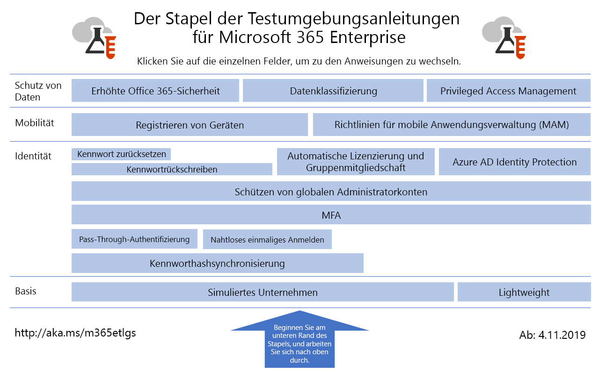

# Testumgebungsanleitungen für Microsoft 365 EnterpriseMicrosoft 365 for enterprise Test Lab Guides

*Dies gilt sowohl für Microsoft 365 Enterprise als auch Office 365 Enterprise.**This applies to both Microsoft 365 for enterprise and Office 365 Enterprise.*

Mithilfe von Testumgebungsanleitungen können Sie schnell mehr zu Microsoft-Produkten erfahren. Sie enthalten Anweisungen zum Konfigurieren vereinfachter, aber repräsentativer Testumgebungen. Sie können diese Umgebungen für Demos, Anpassungen oder das Erstellen komplexer Machbarkeitsstudien für die Dauer eines Test- oder bezahlten Abonnements verwenden.Test Lab Guides (TLGs) help you quickly learn about Microsoft products. They provide prescriptive instructions to configure simplified but representative test environments. You can use these environments for demonstration, customization, or creation of complex proofs of concept for the duration of a trial or paid subscription. 

Testumgebungsanleitungen sind modular aufgebaut. Sie bauen aufeinander auf, sodass mehrere Konfigurationen entstehen, die Ihren Lern- oder Testkonfigurationsanforderungen besser entsprechen. Diese praktische Erfahrung erweitert Ihre Kenntnisse der Bereitstellungsanforderungen neuer Produkte oder Szenarien, sodass Sie besser planen können, wie diese in der Produktionsumgebung gehostet werden sollen.TLGs are designed to be modular. They build upon each other to create multiple configurations that more closely match your learning or test configuration needs. The "I built it out myself and it works" hands-on experience helps you understand the deployment requirements of a new product or scenario so you can better plan for hosting it in production.

Testumgebungsanleitungen ermöglichen die Erstellung repräsentativer Umgebungen zum Entwickeln und Testen von Anwendungen, auch als Entwicklungs-/Testumgebungen bezeichnet.You can also use TLGs to create representative environments for development and testing of applications, also known as dev/test environments.
  

Klicken Sie [hier](../media/m365-enterprise-test-lab-guides/Microsoft365EnterpriseTLGStack.pdf), um eine visuelle Darstellung aller Artikel im Stapel der Testumgebungsanleitungen in Microsoft 365 Enterprise zu erhalten.Click [here](../media/m365-enterprise-test-lab-guides/Microsoft365EnterpriseTLGStack.pdf) for a visual map to all the articles in the Microsoft 365 for enterprise Test Lab Guide stack.

## StandardkonfigurationBase configuration

Zuerst erstellen Sie eine Testumgebung für [Microsoft 365 Enterprise](https://docs.microsoft.com/microsoft-365-enterprise/), die Office 365 E5, Enterprise Mobility + Security (EMS) E5 und Windows 10 Enterprise umfasst. Es stehen zwei unterschiedliche Typen von Standardkonfiguration zur Auswahl:First, you create a test environment for [Microsoft 365 for enterprise](https://docs.microsoft.com/microsoft-365-enterprise/) that includes Office 365 E5, Enterprise Mobility + Security (EMS) E5, and Windows 10 Enterprise. You can create two different types of base configurations:

- Verwenden Sie die [einfache Standardkonfiguration](lightweight-base-configuration-microsoft-365-enterprise.md), wenn Sie die Features und Funktionen von Microsoft 365 Enterprise in einer reinen Cloudumgebung konfigurieren und demonstrieren möchten, die keine lokalen Komponenten umfasst.Use the [lightweight base configuration](lightweight-base-configuration-microsoft-365-enterprise.md) when you want to configure and demonstrate Microsoft 365 for enterprise features and capabilities in a cloud-only environment, which does not include any on-premises components.

- Verwenden Sie die [simulierte Unternehmensstandardkonfiguration](simulated-ent-base-configuration-microsoft-365-enterprise.md), wenn Sie die Features und Funktionen von Microsoft 365 Enterprise in einer hybriden Cloudumgebung konfigurieren und demonstrieren möchten, die lokale Komponenten wie eine Active Directory Domain Services (AD DS)-Domäne verwendet.Use the [simulated enterprise base configuration](simulated-ent-base-configuration-microsoft-365-enterprise.md) when you want to configure and demonstrate Microsoft 365 for enterprise features and capabilities in a hybrid cloud environment, which uses on-premises components such as an Active Directory Domain Services (AD DS) domain.

Sie können auch Testumgebungen für Office 365 E5 erstellen, ohne die Microsoft 365 E5-Lizenz zu Ihrer Test- oder Produktionstestumgebung hinzuzufügen.You can also create test environments for Office 365 E5 by not adding the Microsoft 365 E5 license to your trial or production test environment.
    
## IdentitätIdentity

Wie Sie identitätsbezogene Features und Funktionen demonstrieren können, erfahren Sie hier:To demonstrate identity-related features and capabilities, see:

- [KennworthashsynchronisierungPassword hash synchronization](password-hash-sync-m365-ent-test-environment.md)
  
   Aktivieren und testen Sie die auf Kennworthash basierte Verzeichnissynchronisierung von einem AD DS-Domänencontroller aus.Enable and test password hash-based directory synchronization from an AD DS domain controller.

- [Pass-Through-AuthentifizierungPass-through authentication](pass-through-auth-m365-ent-test-environment.md)
  
   Aktivieren und testen Sie die Pass-Through-Authentifizierung an einen AD DS-Domänencontroller.Enable and test pass-through authentication to an AD DS domain controller.

- [VerbundauthentifizierungFederated authentication](federated-identity-for-your-office-365-dev-test-environment.md)
  
   Aktivieren und testen Sie die Verbundauthentifizierung an einen AD DS-Domänencontroller.Enable and test federated authentication to an AD DS domain controller.

- [Nahtloses einmaliges Anmelden in Azure ADAzure AD Seamless Single Sign-on](single-sign-on-m365-ent-test-environment.md)
  
   Aktivieren und testen Sie das nahtlose einmalige Anmelden in Azure AD mit einem AD DS-Domänencontroller.Enable and test Azure AD Seamless Single Sign-on (SSO) with an AD DS domain controller.

- [Mehrstufige AuthentifizierungMulti-factor authentication](multi-factor-authentication-microsoft-365-test-environment.md)
  
   Aktivieren und testen Sie die Smartphone-basierte mehrstufige Authentifizierung für ein bestimmtes Benutzerkonto.Enable and test smart phone-based multi-factor authentication for a specific user account.

- [Schützen von globalen AdministratorkontenProtect global administrator accounts](protect-global-administrator-accounts-microsoft-365-test-environment.md)
 
   Sperren Sie Ihre globalen Administratorkonten mit Richtlinien für bedingten Zugriff.Lock down your global administrator accounts with conditional access policies.

- [Rückschreiben des KennwortsPassword writeback](password-writeback-m365-ent-test-environment.md)

   Verwenden Sie das Rückschreiben des Kennworts, um das Kennwort in Ihrem AD DS-Benutzerkonto aus Azure AD zu ändern.Use password writeback to change the password on your AD DS user account from Azure AD.

- [KennwortzurücksetzungPassword reset](password-reset-m365-ent-test-environment.md)

   Verwenden Sie die Self-Service-Kennwortzurücksetzung, um Ihr Kennwort zurückzusetzen.Use self-service password reset (SSPR) to reset your password.

- [Automatische Lizenzierung und GruppenmitgliedschaftAutomatic licensing and group membership](automate-licenses-group-membership-microsoft-365-test-environment.md)

   Machen Sie die Verwaltung neuer Konten durch automatische Lizenzierung und dynamische Gruppenmitgliedschaft einfacher als je zuvor.Make administering new accounts easier than ever with automatic licensing and dynamic group membership.

- [Azure AD Identity ProtectionAzure AD Identity Protection](azure-ad-identity-protection-microsoft-365-test-environment.md)

   Überprüfen Sie Ihre aktuellen Benutzerkonten auf Sicherheitsrisiken.Scan your current user accounts for vulnerabilities.

- [Identitäts- und GerätezugriffIdentity and device access](identity-device-access-m365-test-environment.md)

   Erstellen Sie eine Umgebung, um empfohlene Konfigurationen für Identitäts- und Gerätezugriff sowie Richtlinien für bedingten Zugriff zu testen.Create an environment to test recommended identity and device access configurations and conditional access policies.

## Verwaltung mobiler GeräteMobile device management

Eine Veranschaulichung von Features und Funktionen im Zusammenhang mit der Verwaltung mobiler Geräte finden Sie unter:To demonstrate mobile device management-related features and capabilities, see:

- [GerätekompatibilitätsrichtlinienDevice compliance policies](mam-policies-for-your-microsoft-365-enterprise-dev-test-environment.md)
    
   Erstellen Sie eine Benutzergruppe und eine Gerätekompatibilitätsrichtlinie für Windows 10-Geräte.Create a user group and a device compliance policy for Windows 10 devices.
    
- [Registrieren von iOS- und Android-GerätenEnroll iOS and Android devices](enroll-ios-and-android-devices-in-your-microsoft-enterprise-365-dev-test-environ.md)
   
   Registrieren Sie iOS- oder Android-Geräte, und verwalten Sie sie remote.Enroll iOS or Android devices and manage them remotely.

## Schutz von DatenInformation protection

Eine Veranschaulichung der schutzbezogenen Features und Funktionen finden Sie unter:To demonstrate information protection-related features and capabilities, see:

- [Erhöhte Sicherheit in Microsoft 365Increased Microsoft 365 security](increased-o365-security-microsoft-365-enterprise-dev-test-environment.md)
    
   Konfigurieren der Einstellungen für höhere Sicherheit von Microsoft 365 und Prüfen der integrierten Sicherheitstools.Configure settings for increased Microsoft 365 security and investigate built-in security tools.
  
- [DatenklassifikationData classification](data-classification-microsoft-365-enterprise-dev-test-environment.md)
    
   Konfigurieren und Anwenden von Bezeichnungen auf ein Dokument in einer SharePoint Online-Teamwebsite.Configure and apply labels to a document in a SharePoint Online team site.
    
- [Privileged Access ManagementPrivileged access management](privileged-access-microsoft-365-enterprise-dev-test-environment.md)
    
   Konfigurieren von Privileged Access Management für Just-in-Time-Zugriff auf privilegierte Aufgaben mit erhöhten Rechten in Ihrer Organisation.Configure privileged access management for just-in-time access to elevated and privileged tasks in your organization.

