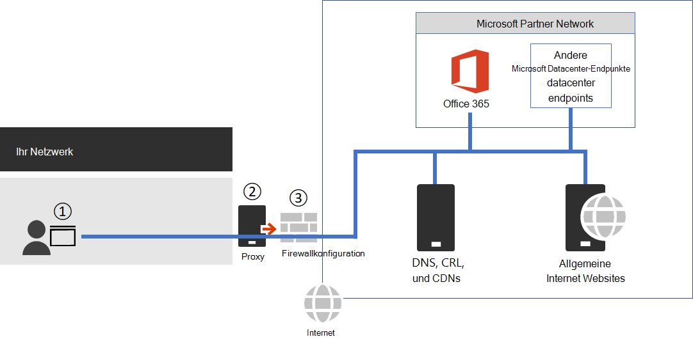

# <a name="managing-office-365-endpoints"></a><span data-ttu-id="3781f-103">Verwalten von Office 365-Endpunkten</span><span class="sxs-lookup"><span data-stu-id="3781f-103">Managing Office 365 endpoints</span></span>

<span data-ttu-id="3781f-104">Die meisten Unternehmen, die über mehrere geographische Standorte und ein sie verbindendes WAN verfügen, müssen für die Office 365-Netzwerkverbindung konfiguriert werden.</span><span class="sxs-lookup"><span data-stu-id="3781f-104">Most enterprise organizations that have multiple office locations and a connecting WAN will need configuration for Office 365 network connectivity.</span></span> <span data-ttu-id="3781f-105">Sie können Ihr Netzwerk optimieren, indem alle vertrauenswürdigen Office 365-Netzwerkanfragen direkt über Ihre Firewall gesendet und so alle zusätzlichen Überprüfungen oder Verarbeitungen auf Paketebene umgangen werden.</span><span class="sxs-lookup"><span data-stu-id="3781f-105">You can optimize your network by sending all trusted Office 365 network requests directly through your firewall, bypassing all additional packet level inspection or processing.</span></span> <span data-ttu-id="3781f-106">Dadurch werden die Latenz und die Anforderungen an die Umkreiskapazität reduziert.</span><span class="sxs-lookup"><span data-stu-id="3781f-106">This reduces latency and your perimeter capacity requirements.</span></span> <span data-ttu-id="3781f-107">Die Identifikation des Office 365-Netzwerkdatenverkehrs ist der erste Schritt, um Ihren Benutzern eine optimale Leistung zu garantieren.</span><span class="sxs-lookup"><span data-stu-id="3781f-107">Identifying Office 365 network traffic is the first step in providing optimal performance for your users.</span></span> <span data-ttu-id="3781f-108">Weitere Informationen finden Sie unter [Office 365 Network Connectivity Principles](microsoft-365-network-connectivity-principles.md).</span><span class="sxs-lookup"><span data-stu-id="3781f-108">For more information, see [Office 365 Network Connectivity Principles](microsoft-365-network-connectivity-principles.md).</span></span>

<span data-ttu-id="3781f-109">Microsoft empfiehlt, dass Sie mithilfe des [Office 365-IP-Adress-](microsoft-365-ip-web-service.md)und -URL-Webdiensts auf die Office 365-Netzwerkendpunkte zugreifen und fortlaufende Änderungen an diesen endpunkten vornehmen.</span><span class="sxs-lookup"><span data-stu-id="3781f-109">Microsoft recommends you access the Office 365 network endpoints and ongoing changes to them using the [Office 365 IP Address and URL Web Service](microsoft-365-ip-web-service.md).</span></span>

<span data-ttu-id="3781f-110">Unabhängig davon, wie Sie den notwendigen Office 365-Netzwerkdatenverkehr verwalten, benötigt Office 365 eine Verbindung zum Internet.</span><span class="sxs-lookup"><span data-stu-id="3781f-110">Regardless of how you manage vital Office 365 network traffic, Office 365 requires Internet connectivity.</span></span> <span data-ttu-id="3781f-111">Weitere Netzwerkendpunkte, für die eine Verbindung erforderlich ist, sind in [Weitere Endpunkten, die nicht in der Office 365-IP-Adresse und dem URL-Webdienst enthalten sind](additional-office365-ip-addresses-and-urls.md) aufgelistet.</span><span class="sxs-lookup"><span data-stu-id="3781f-111">Other network endpoints where connectivity is required are listed at [Additional endpoints not included in the Office 365 IP Address and URL Web service](additional-office365-ip-addresses-and-urls.md).</span></span>

<span data-ttu-id="3781f-112">Wie Sie die Office 365-Netzwerkendpunkte verwenden, hängt von der Netzwerkarchitektur ihres Unternehmens ab.</span><span class="sxs-lookup"><span data-stu-id="3781f-112">How you use the Office 365 network endpoints will depend on your enterprise organization network architecture.</span></span> <span data-ttu-id="3781f-113">In diesem Artikel werden verschiedene Möglichkeiten beschrieben, wie Netzwerkarchitekturen Office 365-IP-Adressen und -URLs integrieren können.</span><span class="sxs-lookup"><span data-stu-id="3781f-113">This article outlines several ways that enterprise network architectures can integrate with Office 365 IP addresses and URLs.</span></span> <span data-ttu-id="3781f-114">Am einfachsten können Sie auswählen, welche Netzwerkanforderungen vertrauenswürdig sind, wenn Sie SD-WAN-Geräte verwenden, die die automatisierte Office 365-Konfiguration an jedem Ihrer Bürostandorte unterstützen.</span><span class="sxs-lookup"><span data-stu-id="3781f-114">The easiest way to choose which network requests to trust is to use SD-WAN devices that support automated Office 365 configuration at each of your office locations.</span></span>

## <a name="sd-wan-for-local-branch-egress-of-vital-office-365-network-traffic"></a><span data-ttu-id="3781f-115">SD-WAN für den lokalen Zweigstellenverkehr mit wichtigem Office 365-Netzwerkdatenverkehr</span><span class="sxs-lookup"><span data-stu-id="3781f-115">SD-WAN for local branch egress of vital Office 365 network traffic</span></span>

<span data-ttu-id="3781f-116">An jedem Zweigstellenstandort können Sie ein SD-WAN-Gerät bereitstellen, das so konfiguriert ist, dass Datenverkehr für die Office 365-Optimierungskategorie von Endpunkten oder die Kategorien "Optimieren" und "Zulassen" direkt an das Netzwerk von Microsoft geleitet wird.</span><span class="sxs-lookup"><span data-stu-id="3781f-116">At each branch office location, you can provide an SD-WAN device that is configured to route traffic for Office 365 Optimize category of endpoints, or Optimize and Allow categories, directly to Microsoft's network.</span></span> <span data-ttu-id="3781f-117">Weiterer Netzwerkdatenverkehr einschließlich des Datenverkehrs des lokalen Datenzentrums, des allgemeinen Website-Datenverkehrs und des Datenverkehrs zu Office 365 Standardkategorie-Endpunkten wird an einen anderen Ort gesendet, an dem Sie einen größeren Netzwerkrand haben.</span><span class="sxs-lookup"><span data-stu-id="3781f-117">Other network traffic including on-premises datacenter traffic, general Internet web sites traffic, and traffic to Office 365 Default category endpoints is sent to another location where you have a more substantial network perimeter.</span></span>

<span data-ttu-id="3781f-118">Microsoft arbeitet mit SD-WAN-Anbietern zusammen, um die automatisierte Konfiguration zu aktivieren.</span><span class="sxs-lookup"><span data-stu-id="3781f-118">Microsoft is working with SD-WAN providers to enable automated configuration.</span></span> <span data-ttu-id="3781f-119">Weitere Informationen finden Sie unter [Office 365 Networking Partner Program](microsoft-365-networking-partner-program.md).</span><span class="sxs-lookup"><span data-stu-id="3781f-119">For more information, see [Office 365 Networking Partner Program](microsoft-365-networking-partner-program.md).</span></span>

<span data-ttu-id="3781f-120"><a name="pacfiles"> </a></span><span class="sxs-lookup"><span data-stu-id="3781f-120"><a name="pacfiles"> </a></span></span>
## <a name="use-a-pac-file-for-direct-routing-of-vital-office-365-traffic"></a><span data-ttu-id="3781f-121">Verwenden einer PAC-Datei für das Routing von wichtigem Office 365-Datenverkehr</span><span class="sxs-lookup"><span data-stu-id="3781f-121">Use a PAC file for direct routing of vital Office 365 traffic</span></span>

<span data-ttu-id="3781f-122">Verwenden Sie PAC- oder WPAD-Dateien, um Netzwerkanforderungen zu verwalten, die Office 365 zugeordnet sind, aber keine IP-Adresse besitzen.</span><span class="sxs-lookup"><span data-stu-id="3781f-122">Use PAC or WPAD files to manage network requests that are associated with Office 365 but don't have an IP address.</span></span> <span data-ttu-id="3781f-123">In der Regel erhöhen Netzwerkanfragen, die über ein Proxy- oder Umkreisgerät gesendet werden, die Latenz.</span><span class="sxs-lookup"><span data-stu-id="3781f-123">Typical network requests that are sent through a proxy or perimeter device increase latency.</span></span> <span data-ttu-id="3781f-124">Während SSL-Unterbrechung und -prüfung die größte Latenz erzeugen, können andere Dienste wie die Proxyauthentifizierung und die Reputationssuche zu niedriger Leistung und einer entsprechend schlechten Benutzererfahrung führen.</span><span class="sxs-lookup"><span data-stu-id="3781f-124">While SSL Break and Inspect creates the largest latency, other services such as proxy authentication and reputation lookup can cause poor performance and a bad user experience.</span></span> <span data-ttu-id="3781f-125">Darüber hinaus benötigen diese Umkreisnetzwerkgeräte ausreichend Kapazität, um alle Netzwerkanfragen zu verarbeiten.</span><span class="sxs-lookup"><span data-stu-id="3781f-125">Additionally, these perimeter network devices need enough capacity to process all of the network connection requests.</span></span> <span data-ttu-id="3781f-126">Es empfiehlt sich, Proxy- bzw. Überprüfungsgeräte für direkte Office 365-Netzwerkanforderungen zu umgehen.</span><span class="sxs-lookup"><span data-stu-id="3781f-126">We recommend bypassing your proxy or inspection devices for direct Office 365 network requests.</span></span>
  
<span data-ttu-id="3781f-127">[PowerShell Gallery Get-PacFile](https://www.powershellgallery.com/packages/Get-PacFile) ist ein PowerShell-Skript, das die neuesten Netzwerkendpunkte aus dem IP-Adress- und URL-Webdienst von Office 365 ausliest und eine PAC-Beispieldatei erstellt.</span><span class="sxs-lookup"><span data-stu-id="3781f-127">[PowerShell Gallery Get-PacFile](https://www.powershellgallery.com/packages/Get-PacFile) is a PowerShell script that reads the latest network endpoints from the Office 365 IP Address and URL Web service and creates a sample PAC file.</span></span> <span data-ttu-id="3781f-128">Sie können das Skript so ändern, dass es in Ihre vorhandene PAC-Dateiverwaltung integriert werden kann.</span><span class="sxs-lookup"><span data-stu-id="3781f-128">You can modify the script so that it integrates with your existing PAC file management.</span></span>



<span data-ttu-id="3781f-130">**Abbildung 1: Einfaches Unternehmensumkreisnetzwerk**</span><span class="sxs-lookup"><span data-stu-id="3781f-130">**Figure 1 - Simple enterprise network perimeter**</span></span>

<span data-ttu-id="3781f-131">Die PAC-Datei wird für Webbrowser in Punkt 1 in Abbildung 1 bereitgestellt.</span><span class="sxs-lookup"><span data-stu-id="3781f-131">The PAC file is deployed to web browsers at point 1 in Figure 1.</span></span> <span data-ttu-id="3781f-132">Wenn Sie eine PAC-Datei für den direkten Ausgang von wichtigem Office 365-Netzwerkdatenverkehr verwenden, müssen Sie auch die Verbindung zu den IP-Adressen hinter diesen URLs in ihrer Umkreisnetzwerk-Firewall zulassen.</span><span class="sxs-lookup"><span data-stu-id="3781f-132">When using a PAC file for direct egress of vital Office 365 network traffic, you also need to allow connectivity to the IP addresses behind these URLs on your network perimeter firewall.</span></span> <span data-ttu-id="3781f-133">Dazu rufen Sie die IP-Adressen für die gleichen Office 365-Endpunktkategorien ab, die in der PAC-Datei angegeben sind, und erstellen basierend auf diesen Adressen Firewall-ACLs.</span><span class="sxs-lookup"><span data-stu-id="3781f-133">This is done by fetching the IP addresses for the same Office 365 endpoint categories as specified in the PAC file and creating firewall ACLs based on those addresses.</span></span> <span data-ttu-id="3781f-134">Die Firewall ist Punkt 3 in Abbildung 1.</span><span class="sxs-lookup"><span data-stu-id="3781f-134">The firewall is point 3 in Figure 1.</span></span>

<span data-ttu-id="3781f-135">Wenn Sie gesondert festlegen, dass für die Endpunkte der Kategorie „Optimize“ nur direktes Routing ausgeführt werden soll, müssen alle erforderlichen Endpunkte der Kategorie „Allow“, die Sie an den Proxyserver senden, in diesem aufgelistet werden, um die Weiterverarbeitung zu umgehen.</span><span class="sxs-lookup"><span data-stu-id="3781f-135">Separately if you choose to only do direct routing for the Optimize category endpoints, any required Allow category endpoints that you send to the proxy server will need to be listed in the proxy server to bypass further processing.</span></span> <span data-ttu-id="3781f-136">So sind beispielsweise die SSL-Unterbrechung und -Überprüfung und die Proxyauthentifizierung mit den Endpunkten der Kategorien „Optimize“ und „Allow“ nicht kompatibel.</span><span class="sxs-lookup"><span data-stu-id="3781f-136">For example, SSL break and Inspect and Proxy Authentication are incompatible with both the Optimize and Allow category endpoints.</span></span> <span data-ttu-id="3781f-137">Der Proxy Server ist Punkt 2 in Abbildung 1.</span><span class="sxs-lookup"><span data-stu-id="3781f-137">The proxy server is point 2 in Figure 1.</span></span>

<span data-ttu-id="3781f-138">Die allgemeine Konfiguration erlaubt den Office 365-Netzwerkdatenverkehr, der auf den Proxy Server trifft, ohne dass der gesamte ausgehende Datenverkehr vom Proxyserver verarbeitet wird.</span><span class="sxs-lookup"><span data-stu-id="3781f-138">The common configuration is to permit without processing all outbound traffic from the proxy server for the destination IP addresses for Office 365 network traffic that hits the proxy server.</span></span> <span data-ttu-id="3781f-139">Informationen zu Problemen mit SSL-Unterbrechung und -Prüfung finden Sie unter [Verwenden von Netzwerkgeräten oder-Lösungen von Drittanbietern im Office 365-Datenverkehr](https://support.microsoft.com/help/2690045/using-third-party-network-devices-or-solutions-with-office-365).</span><span class="sxs-lookup"><span data-stu-id="3781f-139">For information about issues with SSL Break and Inspect, see [Using third-party network devices or solutions on Office 365 traffic](https://support.microsoft.com/help/2690045/using-third-party-network-devices-or-solutions-with-office-365).</span></span>

<span data-ttu-id="3781f-140">Es gibt zwei Arten von PAC-Dateien, die vom Get-PacFile-Skript erzeugt werden.</span><span class="sxs-lookup"><span data-stu-id="3781f-140">There are two types of PAC files that the Get-PacFile script will generate.</span></span>

| <span data-ttu-id="3781f-141">Typ</span><span class="sxs-lookup"><span data-stu-id="3781f-141">Type</span></span> | <span data-ttu-id="3781f-142">Beschreibung</span><span class="sxs-lookup"><span data-stu-id="3781f-142">Description</span></span> |
|:-----|:-----|
|<span data-ttu-id="3781f-143">**1**</span><span class="sxs-lookup"><span data-stu-id="3781f-143">**1**</span></span> <br/> |<span data-ttu-id="3781f-144">Senden des Endpunktdatenverkehrs der Kategorie „Optimize“ direkt und des sonstigen Datenverkehrs an den Proxyserver.</span><span class="sxs-lookup"><span data-stu-id="3781f-144">Send Optimize endpoint traffic direct and everything else to the proxy server.</span></span> <br/> |
|<span data-ttu-id="3781f-145">**2**</span><span class="sxs-lookup"><span data-stu-id="3781f-145">**2**</span></span> <br/> |<span data-ttu-id="3781f-146">Senden des Endpunktdatenverkehrs der Kategorien „Optimize“ und „Allow“ direkt und des sonstigen Datenverkehrs an den Proxyserver.</span><span class="sxs-lookup"><span data-stu-id="3781f-146">Send Optimize and Allow endpoint traffic direct and everything else to the proxy server.</span></span> <span data-ttu-id="3781f-147">Mit diesem Typ können Sie auch den gesamten ExpressRoute für Office 365-Datenverkehr zu ExpressRoute-Netzwerksegmenten und den sonstigen Datenverkehr an den Proxyserver senden.</span><span class="sxs-lookup"><span data-stu-id="3781f-147">This type can also be used to send all supported ExpressRoute for Office 365 traffic to ExpressRoute network segments and everything else to the proxy server.</span></span> <br/> |

<span data-ttu-id="3781f-148">Hier ein einfaches Beispiel für das Aufrufen des PowerShell-Skripts:</span><span class="sxs-lookup"><span data-stu-id="3781f-148">Here's a simple example of calling the PowerShell script:</span></span>

```powershell
Get-PacFile -ClientRequestId b10c5ed1-bad1-445f-b386-b919946339a7
```

<span data-ttu-id="3781f-149">Es gibt viele Parameter, die Sie an das Skript übergeben können:</span><span class="sxs-lookup"><span data-stu-id="3781f-149">There are many parameters you can pass to the script:</span></span>

| <span data-ttu-id="3781f-150">Parameter</span><span class="sxs-lookup"><span data-stu-id="3781f-150">Parameter</span></span> | <span data-ttu-id="3781f-151">Beschreibung</span><span class="sxs-lookup"><span data-stu-id="3781f-151">Description</span></span> |
|:-----|:-----|
|<span data-ttu-id="3781f-152">**ClientRequestId**</span><span class="sxs-lookup"><span data-stu-id="3781f-152">**ClientRequestId**</span></span> <br/> |<span data-ttu-id="3781f-153">Dies ist erforderlich, und es handelt sich um einen GUID, der an den Webdienst übergeben wird, der den Clientcomputer darstellt, der den Anruf macht.</span><span class="sxs-lookup"><span data-stu-id="3781f-153">This is required and is a GUID passed to the web service that represents the client machine making the call.</span></span> <br/> |
|<span data-ttu-id="3781f-154">**Instanz**</span><span class="sxs-lookup"><span data-stu-id="3781f-154">**Instance**</span></span> <br/> |<span data-ttu-id="3781f-155">Die Office 365-Dienstinstanz, die standardmäßig auf "Weltweit" festgelegt ist.</span><span class="sxs-lookup"><span data-stu-id="3781f-155">The Office 365 service instance, which defaults to Worldwide.</span></span> <span data-ttu-id="3781f-156">Dies wird auch an den Webdienst übergeben.</span><span class="sxs-lookup"><span data-stu-id="3781f-156">This is also passed to the web service.</span></span> <br/> |
|<span data-ttu-id="3781f-157">**TenantName**</span><span class="sxs-lookup"><span data-stu-id="3781f-157">**TenantName**</span></span> <br/> |<span data-ttu-id="3781f-158">Der Name Ihres Office 365-Mandanten.</span><span class="sxs-lookup"><span data-stu-id="3781f-158">Your Office 365 tenant name.</span></span> <span data-ttu-id="3781f-159">Wird an den Webdienst übergeben und in einigen Office 365-URLs als ersetzbarer Parameter verwendet.</span><span class="sxs-lookup"><span data-stu-id="3781f-159">Passed to the web service and used as a replaceable parameter in some Office 365 URLs.</span></span> <br/> |
|<span data-ttu-id="3781f-160">**Typ**</span><span class="sxs-lookup"><span data-stu-id="3781f-160">**Type**</span></span> <br/> |<span data-ttu-id="3781f-161">Der Typ der Proxy-PAC-Datei, die Sie generieren möchten.</span><span class="sxs-lookup"><span data-stu-id="3781f-161">The type of the proxy PAC file that you want to generate.</span></span> <br/> |

<span data-ttu-id="3781f-162">Hier ist ein weiteres Beispiel für das Aufrufen des PowerShell-Skripts mit zusätzlichen Parametern:</span><span class="sxs-lookup"><span data-stu-id="3781f-162">Here's another example of calling the PowerShell script with additional parameters:</span></span>

```powershell
Get-PacFile -Type 2 -Instance Worldwide -TenantName Contoso -ClientRequestId b10c5ed1-bad1-445f-b386-b919946339a7
```

## <a name="proxy-server-bypass-processing-of-office-365-network-traffic"></a><span data-ttu-id="3781f-163">Umgehungsverarbeitung des Office 365-Netzwerkdatenverkehrs durch einen Proxyserver</span><span class="sxs-lookup"><span data-stu-id="3781f-163">Proxy server bypass processing of Office 365 network traffic</span></span>

<span data-ttu-id="3781f-164">Wo PAC-Dateien für den direkten ausgehenden Datenverkehr nicht verwendet werden, sollten Sie die Verarbeitung auf ihrem Umkreisnetzwerk trotzdem weiterhin umgehen, indem Sie Ihren Proxyserver entsprechend konfigurieren.</span><span class="sxs-lookup"><span data-stu-id="3781f-164">Where PAC files are not used for direct outbound traffic, you still want to bypass processing on your network perimeter by configuring your proxy server.</span></span> <span data-ttu-id="3781f-165">Einige Anbieter von Proxyservern haben diese automatisierte Konfiguration aktiviert, wie sie in [Office 365 Networking Partner Program](microsoft-365-networking-partner-program.md) beschrieben ist.</span><span class="sxs-lookup"><span data-stu-id="3781f-165">Some proxy server vendors have enabled automated configuration of this as described in the [Office 365 Networking Partner Program](microsoft-365-networking-partner-program.md).</span></span>

<span data-ttu-id="3781f-166">Wenn Sie dies manuell vornehmen, müssen Sie die Kategoriedaten der Endpunkte "Optimieren" und "Zulassen" aus dem Office 365-IP-Adress- und -URL-Webdienst erhalten und den Proxyserver so konfigurieren, dass die Verarbeitung für diese Umgangen umgangen wird.</span><span class="sxs-lookup"><span data-stu-id="3781f-166">If you are doing this manually, you will need to get the Optimize and Allow endpoint category data from the Office 365 IP Address and URL Web Service and configure your proxy server to bypass processing for these.</span></span> <span data-ttu-id="3781f-167">Es ist wichtig, die SSL-Unterbrechung und -Überprüfung und die Proxyauthentifizierung mit den Endpunkten der Kategorien „Optimize“ und „Allow“ zu vermeiden.</span><span class="sxs-lookup"><span data-stu-id="3781f-167">It is important to avoid SSL Break and Inspect and Proxy Authentication for the Optimize and Allow category endpoints.</span></span>
  
<span data-ttu-id="3781f-168"><a name="bkmk_changes"> </a></span><span class="sxs-lookup"><span data-stu-id="3781f-168"><a name="bkmk_changes"> </a></span></span>
## <a name="change-management-for-office-365-ip-addresses-and-urls"></a><span data-ttu-id="3781f-169">Änderungsverwaltung für Office 365-IP-Adressen und-URLs</span><span class="sxs-lookup"><span data-stu-id="3781f-169">Change management for Office 365 IP addresses and URLs</span></span>

<span data-ttu-id="3781f-170">Zusätzlich zur Auswahl der geeigneten Konfiguration für Ihre Netzwerkumgebung, müssen Sie auch einen Änderungsverwaltungsprozess für Office 365-Endpunkte einrichten.</span><span class="sxs-lookup"><span data-stu-id="3781f-170">In addition to selecting appropriate configuration for your network perimeter, it is critical that you adopt a change management process for Office 365 endpoints.</span></span> <span data-ttu-id="3781f-171">Diese Endpunkte ändern sich regelmäßig, und wenn Sie die Änderungen nicht verwalten, kann das dazu führen, dass Benutzer blockiert werden oder sich die Leistung verschlechtert, nachdem eine neue IP-Adresse oder URL hinzugefügt worden ist.</span><span class="sxs-lookup"><span data-stu-id="3781f-171">These endpoints change regularly and if you do not manage the changes, you can end up with users blocked or with poor performance after a new IP address or URL is added.</span></span>

<span data-ttu-id="3781f-172">Änderungen an den Office 365-IP-Adressen und -URLs werden üblicherweise am letzten Tag eines jeden Monats veröffentlicht.</span><span class="sxs-lookup"><span data-stu-id="3781f-172">Changes to the Office 365 IP addresses and URLs are usually published near the last day of each month.</span></span> <span data-ttu-id="3781f-173">Es aber kann vorkommen, dass eine Änderung aufgrund von Betriebs-, Support- oder Sicherheitsanforderungen auch zu einem anderen Zeitpunkt veröffentlicht wird.</span><span class="sxs-lookup"><span data-stu-id="3781f-173">Sometimes a change will be published outside of that schedule due to operational, support, or security requirements.</span></span>

<span data-ttu-id="3781f-174">Wenn eine Änderung veröffentlicht wird, die Ihr Eingreifen erforderlich macht, da eine IP-Adresse oder URL hinzugefügt wurde, können Sie davon ausgehen, dass es ab dem Zeitpunkt der Veröffentlichung 30 Tage dauert, bis ein Office 365-Dienst für diesen Endpunkt vorhanden ist.</span><span class="sxs-lookup"><span data-stu-id="3781f-174">When a change is published that requires you to act because an IP address or URL was added, you should expect to receive 30 days notice from the time we publish the change until there is an Office 365 service on that endpoint.</span></span> <span data-ttu-id="3781f-175">Obwohl wir diesen Benachrichtigungszeitraum anstreben, ist dies aufgrund von Betriebs-, Support- oder Sicherheitsanforderungen unter Umständen nicht immer möglich.</span><span class="sxs-lookup"><span data-stu-id="3781f-175">Although we aim for this notification period, it may not always be possible due to operational, support, or security requirements.</span></span> <span data-ttu-id="3781f-176">Über Änderungen, für die keine sofortigen Maßnahmen erforderlich sind, um die Verbindung aufrechtzuerhalten, wie z. b. entfernte IP-Adressen oder URLs oder weniger signifikante Änderungen, erhalten Sie keine Vorabbenachrichtigung.</span><span class="sxs-lookup"><span data-stu-id="3781f-176">Changes that do not require immediate action to maintain connectivity, such as removed IP addresses or URLs or less significant changes, do not include advance notification.</span></span> <span data-ttu-id="3781f-177">Unabhängig davon, welche Benachrichtigung bereitgestellt wird, wird für jede Änderung der Termin der Aktivierung des Dienstes aufgelistet.</span><span class="sxs-lookup"><span data-stu-id="3781f-177">Regardless of what notification is provided, we list the expected service active date for each change.</span></span>

### <a name="change-notification-using-the-web-service"></a><span data-ttu-id="3781f-178">Änderungsbenachrichtigungen mithilfe des Webdiensts</span><span class="sxs-lookup"><span data-stu-id="3781f-178">Change notification using the Web Service</span></span>

<span data-ttu-id="3781f-179">Sie können den Office 365-IP-Adresse und -URL-Webdienst verwenden, um eine Änderungsbenachrichtigung zu erhalten.</span><span class="sxs-lookup"><span data-stu-id="3781f-179">You can use the Office 365 IP Address and URL Web Service to get change notification.</span></span> <span data-ttu-id="3781f-180">Wir empfehlen, die **/version**-Webmethode einmal pro Stunde aufzurufen, um die Version der Endpunkte zu überprüfen, die Sie für die Verbindung zu Office 365 verwenden.</span><span class="sxs-lookup"><span data-stu-id="3781f-180">We recommend you call the **/version** web method once an hour to check the version of the endpoints that you are using to connect to Office 365.</span></span> <span data-ttu-id="3781f-181">Wenn sich diese Version im Vergleich zu der von Ihnen verwendeten Version ändert, sollten Sie die neuesten Endpunktdaten aus der **/endpoints**-Webmethode und optional die Unterschiede aus der **/changes**-Webmethode abrufen.</span><span class="sxs-lookup"><span data-stu-id="3781f-181">If this version changes when compared to the version that you have in use, then you should get the latest endpoint data from the **/endpoints** web method and optionally get the differences from the **/changes** web method.</span></span> <span data-ttu-id="3781f-182">Wenn die von Ihnen gefundene Version nicht geändert wurde, müssen Sie die **/endpoints**- und **/changes**-Webmethode nicht aufrufen.</span><span class="sxs-lookup"><span data-stu-id="3781f-182">It is not necessary to call the **/endpoints** or **/changes** web methods if there has not been any change to the version you found.</span></span>

<span data-ttu-id="3781f-183">Weitere Informationen finden Sie unter [Office 365-IP-Adresse und -URL-Webdienst](microsoft-365-ip-web-service.md).</span><span class="sxs-lookup"><span data-stu-id="3781f-183">For more information, see [Office 365 IP Address and URL Web Service](microsoft-365-ip-web-service.md).</span></span>

### <a name="change-notification-using-rss-feeds"></a><span data-ttu-id="3781f-184">Änderungsbenachrichtigungen mithilfe von RSS-Feeds</span><span class="sxs-lookup"><span data-stu-id="3781f-184">Change notification using RSS feeds</span></span>

<span data-ttu-id="3781f-185">Der Office 365-IP-Adresse- und -URL-Webdienst bietet einen Feed, den Sie in Outlook abonnieren können.</span><span class="sxs-lookup"><span data-stu-id="3781f-185">The Office 365 IP Address and URL Web Service provides an RSS feed that you can subscribe to in Outlook.</span></span> <span data-ttu-id="3781f-186">Es gibt Links zu den RSS-URLs auf den einzelnen Office 365 Service instanzspezifischen Seiten für die IP-Adressen und URLs.</span><span class="sxs-lookup"><span data-stu-id="3781f-186">There are links to the RSS URLs on each of the Office 365 service instance-specific pages for the IP addresses and URLs.</span></span> <span data-ttu-id="3781f-187">Weitere Informationen finden Sie unter [Office 365-IP-Adresse und -URL-Webdienst](microsoft-365-ip-web-service.md).</span><span class="sxs-lookup"><span data-stu-id="3781f-187">For more information, see [Office 365 IP Address and URL Web Service](microsoft-365-ip-web-service.md).</span></span>

### <a name="change-notification-and-approval-review-using-microsoft-flow"></a><span data-ttu-id="3781f-188">Änderungsbenachrichtigungen und Genehmigungsüberprüfungen mit Microsoft Flow</span><span class="sxs-lookup"><span data-stu-id="3781f-188">Change notification and approval review using Microsoft Flow</span></span>

<span data-ttu-id="3781f-189">Uns ist bewusst, dass Sie möglicherweise weiterhin die monatlichen Änderungen an Netzwerkendpunkten manuell vornehmen müssen.</span><span class="sxs-lookup"><span data-stu-id="3781f-189">We understand that you might still require manual processing for network endpoint changes that come through each month.</span></span> <span data-ttu-id="3781f-190">Sie können Microsoft Flow zum Erstellen eines Workflows verwenden, der Sie per E-Mail benachrichtigt, und optional einen Genehmigungsprozess anstößt, wenn Änderungen an den Office 365-Netzwerkendpunkten vorgenommen werden müssen.</span><span class="sxs-lookup"><span data-stu-id="3781f-190">You can use Microsoft Flow to create a flow that notifies you by email and optionally runs an approval process for changes when Office 365 network endpoints have changes.</span></span> <span data-ttu-id="3781f-191">Nach Abschluss der Überprüfung können Sie den Workflow per E-Mail automatisch an Ihr Firewall- und das Proxyserver-Managementteam senden.</span><span class="sxs-lookup"><span data-stu-id="3781f-191">Once review is completed, you can have the flow automatically email the changes to your firewall and proxy server management team.</span></span>

<span data-ttu-id="3781f-192">Informationen über ein Microsoft Flow-Beispiel und eine -Vorlage finden sie unter [Verwenden von Microsoft Flow, um eine E-Mail wegen Änderungen an Office 365-IP-Adressen und -URLs zu erhalten](https://techcommunity.microsoft.com/t5/Office-365-Networking/Use-Microsoft-Flow-to-receive-an-email-for-changes-to-Office-365/td-p/240651).</span><span class="sxs-lookup"><span data-stu-id="3781f-192">For information about a Microsoft Flow sample and template, see [Use Microsoft Flow to receive an email for changes to Office 365 IP addresses and URLs](https://techcommunity.microsoft.com/t5/Office-365-Networking/Use-Microsoft-Flow-to-receive-an-email-for-changes-to-Office-365/td-p/240651).</span></span>
  
<span data-ttu-id="3781f-193"><a name="FAQ"> </a></span><span class="sxs-lookup"><span data-stu-id="3781f-193"><a name="FAQ"> </a></span></span>
## <a name="office-365-network-endpoints-faq"></a><span data-ttu-id="3781f-194">Häufig gestellte Fragen zu Office 365-Netzwerkendpunkten</span><span class="sxs-lookup"><span data-stu-id="3781f-194">Office 365 network endpoints FAQ</span></span>

<span data-ttu-id="3781f-195">Hier finden Sie häufig gestellte Fragen zur Office 365-Netzwerkkonnektivität.</span><span class="sxs-lookup"><span data-stu-id="3781f-195">See these frequently asked questions about Office 365 network connectivity.</span></span>
  
### <a name="how-do-i-submit-a-question"></a><span data-ttu-id="3781f-196">Wie übermittle ich eine Frage?</span><span class="sxs-lookup"><span data-stu-id="3781f-196">How do I submit a question?</span></span>

<span data-ttu-id="3781f-197">Klicken Sie auf den Link unten, um anzugeben, ob die Artikel hilfreich war, und weiteren Fragen zu übermitteln.</span><span class="sxs-lookup"><span data-stu-id="3781f-197">Click the link at the bottom to indicate if the article was helpful or not and submit any additional questions.</span></span> <span data-ttu-id="3781f-198">Wir überwachen das Feedback und aktualisieren die Liste der am häufigsten gestellten Fragen.</span><span class="sxs-lookup"><span data-stu-id="3781f-198">We monitor the feedback and update the questions here with the most frequently asked.</span></span>
  
### <a name="how-do-i-determine-the-location-of-my-tenant"></a><span data-ttu-id="3781f-199">Wie kann ich den Standort meines Mandanten ermitteln?</span><span class="sxs-lookup"><span data-stu-id="3781f-199">How do I determine the location of my tenant?</span></span>

 <span data-ttu-id="3781f-200">Der **Mandantenstandort** lässt sich am besten mit unserer [Karte der Rechenzentren](https://aka.ms/datamaps) ermitteln.</span><span class="sxs-lookup"><span data-stu-id="3781f-200">**Tenant location** is best determined using our [datacenter map](https://aka.ms/datamaps).</span></span>
  
### <a name="am-i-peering-appropriately-with-microsoft"></a><span data-ttu-id="3781f-201">Bin ich in geeigneter Weise über Peering mit Microsoft verbunden?</span><span class="sxs-lookup"><span data-stu-id="3781f-201">Am I peering appropriately with Microsoft?</span></span>

 <span data-ttu-id="3781f-202">Die **Peeringstandorte** werden unter [Peering mit Microsoft](https://www.microsoft.com/peering) im Detail beschrieben.</span><span class="sxs-lookup"><span data-stu-id="3781f-202">**Peering locations** are described in more detail in [peering with Microsoft](https://www.microsoft.com/peering).</span></span>
  
<span data-ttu-id="3781f-203">Mit mehr als 2500 ISP-Peeringbeziehungen weltweit und 70 Präsenzpunkten sollte der Zugang aus Ihrem Netzwerk in unseres nahtlos möglich sein.</span><span class="sxs-lookup"><span data-stu-id="3781f-203">With over 2500 ISP peering relationships globally and 70 points of presence, getting from your network to ours should be seamless.</span></span> <span data-ttu-id="3781f-204">Es lohnt sich, ein paar Minuten zu investieren, um sicherzustellen, dass die Peeringbeziehung Ihres ISPs optimal ist. [Hier finden Sie ein paar Beispiele](https://blogs.technet.microsoft.com/onthewire/2017/03/22/__guidance/) guter und weniger guter Peeringübergaben an Ihr Netzwerk.</span><span class="sxs-lookup"><span data-stu-id="3781f-204">It can't hurt to spend a few minutes making sure your ISP's peering relationship is the most optimal, [here's a few examples](https://blogs.technet.microsoft.com/onthewire/2017/03/22/__guidance/) of good and not so good peering hand-offs to our network.</span></span>
  
<span data-ttu-id="3781f-205"><a name="bkmk_MissingIP"> </a></span><span class="sxs-lookup"><span data-stu-id="3781f-205"><a name="bkmk_MissingIP"> </a></span></span>
### <a name="i-see-network-requests-to-ip-addresses-not-on-the-published-list-do-i-need-to-provide-access-to-them"></a><span data-ttu-id="3781f-206">Ich sehe Netzwerkanforderungen an IP-Adressen, die nicht in der Liste "Veröffentlicht" angezeigt werden. Muss ich Zugriff auf diese Netzwerkanforderungen zulassen?</span><span class="sxs-lookup"><span data-stu-id="3781f-206">I see network requests to IP addresses not on the published list, do I need to provide access to them?</span></span>

<span data-ttu-id="3781f-207">In der Liste werden nur IP-Adressen für die Office 365-Server angezeigt, zu denen Sie direkt routen sollten.</span><span class="sxs-lookup"><span data-stu-id="3781f-207">We only provide IP addresses for the Office 365 servers you should route directly to.</span></span> <span data-ttu-id="3781f-208">Es handelt sich nicht um eine vollständige Liste aller IP-Adressen, für die Netzwerkanforderungen angezeigt werden.</span><span class="sxs-lookup"><span data-stu-id="3781f-208">This isn't a comprehensive list of all IP addresses you'll see network requests for.</span></span> <span data-ttu-id="3781f-209">Es werden Netzwerkanforderungen Microsoft und unveröffentlichte IP-Adressen von Drittanbietern angezeigt.</span><span class="sxs-lookup"><span data-stu-id="3781f-209">You will see network requests to Microsoft and third-party owned, unpublished, IP addresses.</span></span> <span data-ttu-id="3781f-210">Diese IP-Adressen werden dynamisch generiert oder auf eine Weise verwaltet, die bei Änderungen eine rechtzeitige Benachrichtigung verhindert.</span><span class="sxs-lookup"><span data-stu-id="3781f-210">These IP addresses are dynamically generated or managed in a way that prevents timely notice when they change.</span></span> <span data-ttu-id="3781f-211">Wenn Ihre Firewall den Zugriff für diese Netzwerkanforderungen nicht basierend auf den FQDNs zulassen kann, verwenden Sie zum Verwalten der Anforderungen eine PAC- oder WPAD-Datei.</span><span class="sxs-lookup"><span data-stu-id="3781f-211">If your firewall can't allow access based on the FQDNs for these network requests, use a PAC or WPAD file to manage the requests.</span></span>
  
<span data-ttu-id="3781f-212">Sie sehen eine Office 365 zugeordnete IP-Adresse, über die Sie weitere Informationen erhalten möchten?</span><span class="sxs-lookup"><span data-stu-id="3781f-212">See an IP associated with Office 365 that you want more information on?</span></span>
  
1. <span data-ttu-id="3781f-213">Überprüfen Sie mithilfe eines CIDR-Rechners, ob die IP-Adresse in einem größeren veröffentlichten Bereich enthalten ist, z. B. dem für [IPv4](https://www.ipaddressguide.com/cidr) oder [IPv6](https://www.ipaddressguide.com/ipv6-cidr)..</span><span class="sxs-lookup"><span data-stu-id="3781f-213">Check if the IP address is included in a larger published range using a CIDR calculator, such as these for [IPv4](https://www.ipaddressguide.com/cidr) or [IPv6](https://www.ipaddressguide.com/ipv6-cidr).</span></span> <span data-ttu-id="3781f-214">Beispielsweise enthält 40.96.0.0/13 die IP-Adresse 40.103.0.1, obwohl 40.96 nicht mit 40.103 übereinstimmt.</span><span class="sxs-lookup"><span data-stu-id="3781f-214">For example, 40.96.0.0/13 includes the IP Address 40.103.0.1 despite 40.96 not matching 40.103.</span></span>
2. <span data-ttu-id="3781f-215">Überprüfen Sie mithilfe einer [Whois-Abfrage](https://dnsquery.org/), ob die IP-Adresse einem Partner gehört.</span><span class="sxs-lookup"><span data-stu-id="3781f-215">See if a partner owns the IP with a [whois query](https://dnsquery.org/).</span></span> <span data-ttu-id="3781f-216">Wenn die IP-Adresse von Microsoft betrieben wird, kann es sich um einen internen Partner handeln.</span><span class="sxs-lookup"><span data-stu-id="3781f-216">If it's Microsoft owned, it may be an internal partner.</span></span> <span data-ttu-id="3781f-217">Viele Partnernetzwerk-Endpunkte werden als zur _Standardkategorie_ gehörend aufgelistet, für die keine IP-Adressen veröffentlicht werden.</span><span class="sxs-lookup"><span data-stu-id="3781f-217">Many partner network endpoints are listed as belonging to the _default_ category, for which IP addresses are not published.</span></span>
3. <span data-ttu-id="3781f-218">Die IP-Adresse darf nicht Teil von Office 365 oder einer Abhängigkeit sein.</span><span class="sxs-lookup"><span data-stu-id="3781f-218">The IP address may not be part of Office 365 or a dependency.</span></span> <span data-ttu-id="3781f-219">Die Office 365-Netzwerkendpunkt-Veröffentlichung umfasst nicht alle Microsoft-Netzwerkendpunkte.</span><span class="sxs-lookup"><span data-stu-id="3781f-219">Office 365 network endpoint publishing does not include all of Microsoft network endpoints.</span></span>
4. <span data-ttu-id="3781f-220">Überprüfen Sie das Zertifikat.</span><span class="sxs-lookup"><span data-stu-id="3781f-220">Check the certificate.</span></span> <span data-ttu-id="3781f-221">Stellen Sie mit einem Browser eine Verbindung mit der IP-Adresse mithilfe von *HTTPS://, \<IP_ADDRESS\>* und überprüfen Sie die im Zertifikat aufgeführten Domänen, um zu verstehen, welche Domänen der IP-Adresse zugeordnet sind.</span><span class="sxs-lookup"><span data-stu-id="3781f-221">With a browser, connect to the IP address using  *HTTPS://\<IP_ADDRESS\>* and check the domains listed on the certificate to understand what domains are associated with the IP address.</span></span> <span data-ttu-id="3781f-222">Wenn es sich um eine Microsoft-eigene IP-Adresse handelt, die nicht in der Liste der Office 365-IP-Adressen enthalten ist, ist sie wahrscheinlich einem Microsoft CDN  *wie MSOCDN.NET*  oder einer anderen Microsoft-Domäne ohne veröffentlichte IP-Informationen zugeordnet.</span><span class="sxs-lookup"><span data-stu-id="3781f-222">If it's a Microsoft-owned IP address and not on the list of Office 365 IP addresses, it's likely the IP address is associated with a Microsoft CDN such as  *MSOCDN.NET*  or another Microsoft domain without published IP information.</span></span> <span data-ttu-id="3781f-223">Wenn Sie feststellen, dass es sich bei der Domäne auf dem Zertifikat um eine Domäne handelt, für die die IP-Adresse aufgelistet sein sollte, teilen Sie uns dies bitte mit.</span><span class="sxs-lookup"><span data-stu-id="3781f-223">If you do find the domain on the certificate is one where we claim to list the IP address, please let us know.</span></span>

<span data-ttu-id="3781f-224"><a name="bkmk_cname"> </a></span><span class="sxs-lookup"><span data-stu-id="3781f-224"><a name="bkmk_cname"> </a></span></span>
### <a name="some-office-365-urls-point-to-cname-records-instead-of-a-records-in-the-dns-what-do-i-have-to-do-with-the-cname-records"></a><span data-ttu-id="3781f-225">Einige Office 365-URLs verweisen auf CNAME-Einträge anstelle von A-Einträgen im DNS.</span><span class="sxs-lookup"><span data-stu-id="3781f-225">Some Office 365 URLs point to CNAME records instead of A records in the DNS.</span></span> <span data-ttu-id="3781f-226">Was muss ich mit den CNAME-Einträgen tun?</span><span class="sxs-lookup"><span data-stu-id="3781f-226">What do I have to do with the CNAME records?</span></span>

<span data-ttu-id="3781f-227">Clientcomputer benötigen einen DNS-A- oder AAAA-Eintrag, der eine oder mehrere IP-Adressen enthält, um eine Verbindung mit einem Clouddienst herzustellen.</span><span class="sxs-lookup"><span data-stu-id="3781f-227">Client computers need a DNS A or AAAA record t)hat includes one or more IP address(es) to connect to a cloud service.</span></span> <span data-ttu-id="3781f-228">Einige URLs in Office 365 zeigen CNAME-Einträge anstelle von A- oder AAAA-Einträgen an.</span><span class="sxs-lookup"><span data-stu-id="3781f-228">Some URLs included in Office 365 show CNAME records instead of A or AAAA records.</span></span> <span data-ttu-id="3781f-229">Diese CNAME-Einträge sind zwischengeschaltet und es können mehrere als Kette vorhanden sein.</span><span class="sxs-lookup"><span data-stu-id="3781f-229">These CNAME records are intermediary and there may be several in a chain.</span></span> <span data-ttu-id="3781f-230">Sie werden immer in einen A- oder AAAA-Eintrag für eine IP-Adresse aufgelöst.</span><span class="sxs-lookup"><span data-stu-id="3781f-230">They will always eventually resolve to an A or AAAA record for an IP Address.</span></span> <span data-ttu-id="3781f-231">Sehen Sie sich beispielsweise die folgende Liste von DNS-Einträgen an, die schließlich in die IP-Adresse _IP_1_ aufgelöst werden:</span><span class="sxs-lookup"><span data-stu-id="3781f-231">For example, consider the following series of DNS records, which ultimately resolves to the IP address _IP_1_:</span></span>

```console
serviceA.office.com -> CNAME: serviceA.domainA.com -> CNAME: serviceA.domainB.com -> A: IP_1
```

<span data-ttu-id="3781f-232">Diese CNAME-Umleitungen sind ein normaler Bestandteil des DNS, und für den Clientcomputer wie für den Proxyserver transparent.</span><span class="sxs-lookup"><span data-stu-id="3781f-232">These CNAME redirects are a normal part of the DNS and are transparent to the client computer and transparent to proxy servers.</span></span> <span data-ttu-id="3781f-233">Sie werden für den Lastenausgleich, Netzwerke für die Inhaltsübermittlung, hohe Verfügbarkeit und die Minimierung von Servicevorfällen verwendet.</span><span class="sxs-lookup"><span data-stu-id="3781f-233">They are used for load balancing, content delivery networks, high availability, and service incident mitigation.</span></span> <span data-ttu-id="3781f-234">Microsoft veröffentlicht die zwischengeschalteten CNAME-Einträge nicht. Sie können sich jederzeit ändern, und Sie sollten Sie in Ihrem Proxyserver nicht als zulässig konfigurieren.</span><span class="sxs-lookup"><span data-stu-id="3781f-234">Microsoft does not publish the intermediary CNAME records, they are subject to change at any time, and you should not need to configure them as allowed in your proxy server.</span></span>

<span data-ttu-id="3781f-235">Ein Proxyserver überprüft die ursprüngliche URL, die im obigen Beispiel serviceA.office.com ist, und diese URL wird in die Office 365-Veröffentlichung einbezogen.</span><span class="sxs-lookup"><span data-stu-id="3781f-235">A proxy server validates the initial URL, which in the above example is serviceA.office.com, and this URL would be included in Office 365 publishing.</span></span> <span data-ttu-id="3781f-236">Der Proxy Server fordert die DNS-Auflösung dieser URL in eine IP-Adresse an und empfängt IP_1.</span><span class="sxs-lookup"><span data-stu-id="3781f-236">The proxy server requests DNS resolution of that URL to an IP Address and will receive back IP_1.</span></span> <span data-ttu-id="3781f-237">Er überprüft dabei nicht die Einträge der zwischengeschalteten CNAME-Einträge.</span><span class="sxs-lookup"><span data-stu-id="3781f-237">It does not validate the intermediary CNAME redirection records.</span></span>

<span data-ttu-id="3781f-238">Hart kodierte Konfigurationen oder Whitelisting basierend auf indirekten FQDNs von Office 365 werden nicht empfohlen, werden von Microsoft nicht unterstützt und verursachen bekannte zeitverursachen Probleme mit der Kundenkonnektivität.</span><span class="sxs-lookup"><span data-stu-id="3781f-238">Hard-coded configurations or whitelisting based on indirect Office 365 FQDNs are not recommended, not supported by Microsoft, and are known to cause customer connectivity issues.</span></span> <span data-ttu-id="3781f-239">DNS-Lösungen, die die #A0 blockieren oder anderweitig fälschlicherweise Office 365-DNS-Einträge auflösen, können über #A1 mit aktivierter #A2 oder mithilfe von #A3 gelöst werden.</span><span class="sxs-lookup"><span data-stu-id="3781f-239">DNS solutions that block on CNAME redirection, or that otherwise incorrectly resolve Office 365 DNS entries, can be solved via DNS forwarders with DNS recursion enabled or by using DNS root hints.</span></span> <span data-ttu-id="3781f-240">Viele Netzwerkperimeterprodukte von Drittanbietern integrieren die empfohlene Office 365-Endpunkt-Whitelist in ihre Konfiguration mithilfe des [Office 365-IP-Adress- und URL-Webdiensts.](microsoft-365-ip-web-service.md)</span><span class="sxs-lookup"><span data-stu-id="3781f-240">Many third-party network perimeter products natively integrate recommended Office 365 endpoint whitelisting in their configuration using the [Office 365 IP Address and URL Web service](microsoft-365-ip-web-service.md).</span></span>

<span data-ttu-id="3781f-241"><a name="bkmk_akamai"> </a></span><span class="sxs-lookup"><span data-stu-id="3781f-241"><a name="bkmk_akamai"> </a></span></span>
### <a name="why-do-i-see-names-such-as-nsatcnet-or-akadnsnet-in-the-microsoft-domain-names"></a><span data-ttu-id="3781f-242">Warum enthalten Microsoft-Domänennamen Namen wie "nsatc.net" oder "akadns.net"?</span><span class="sxs-lookup"><span data-stu-id="3781f-242">Why do I see names such as nsatc.net or akadns.net in the Microsoft domain names?</span></span>

<span data-ttu-id="3781f-243">Office 365 und andere Microsoft-Dienste nutzen verschiedene Drittanbieterdienste wie Akamai und MarkMonitor, um die Office 365-Benutzererfahrung zu optimieren.</span><span class="sxs-lookup"><span data-stu-id="3781f-243">Office 365 and other Microsoft services use several third-party services such as Akamai and MarkMonitor to improve your Office 365 experience.</span></span> <span data-ttu-id="3781f-244">Um stets die besten Ergebnisse zu ermöglichen, können sich diese Dienste in Zukunft ändern.</span><span class="sxs-lookup"><span data-stu-id="3781f-244">To keep giving you the best experience possible, we may change these services in the future.</span></span> <span data-ttu-id="3781f-245">Domänen von Drittanbietern können Inhalte hosten, z. B. ein CDN, oder sie hosten einen Dienst, z. B. einen Dienst für die Verwaltung des geografischen Datenverkehrs.</span><span class="sxs-lookup"><span data-stu-id="3781f-245">Third-party domains may host content, such as a CDN, or they may host a service, such as a geographical traffic management service.</span></span> <span data-ttu-id="3781f-246">Zu den derzeit genutzten Dienste gehören unter anderem:</span><span class="sxs-lookup"><span data-stu-id="3781f-246">Some of the services currently in use include:</span></span>
  
<span data-ttu-id="3781f-247">[MarkMonitor](https://www.markmonitor.com/) wird verwendet, wenn Sie Anforderungen sehen, die *\* .nsatc.net*.</span><span class="sxs-lookup"><span data-stu-id="3781f-247">[MarkMonitor](https://www.markmonitor.com/) is in use when you see requests that include  *\*.nsatc.net*.</span></span> <span data-ttu-id="3781f-248">Dieser Dienst bietet Schutz und Überwachung von Domänennamen zum Schutz vor böswilligem Verhalten.</span><span class="sxs-lookup"><span data-stu-id="3781f-248">This service provides domain name protection and monitoring to protect against malicious behavior.</span></span>
  
<span data-ttu-id="3781f-249">[ExactTarget](https://www.marketingcloud.com/) wird verwendet, wenn Sie Anforderungen an *\* .exacttarget.com*.</span><span class="sxs-lookup"><span data-stu-id="3781f-249">[ExactTarget](https://www.marketingcloud.com/) is in use when you see requests to  *\*.exacttarget.com*.</span></span> <span data-ttu-id="3781f-250">Dieser Dienst bietet E-Mail-Linkverwaltung und Überwachung vor böswilligem Verhalten.</span><span class="sxs-lookup"><span data-stu-id="3781f-250">This service provides email link management and monitoring against malicious behavior.</span></span>
  
<span data-ttu-id="3781f-251">[Akamai](https://www.akamai.com/) wird verwendet, wenn Sie Anforderungen sehen, die einen der folgenden vollqualifizierten Domänennamen enthalten.</span><span class="sxs-lookup"><span data-stu-id="3781f-251">[Akamai](https://www.akamai.com/) is in use when you see requests that include one of the following FQDNs.</span></span> <span data-ttu-id="3781f-252">Dieser Dienst stellt Geo-DNS- und CDN-Dienste (Content Delivery Network) bereit.</span><span class="sxs-lookup"><span data-stu-id="3781f-252">This service offers geo-DNS and content delivery network services.</span></span>
  
```console
*.akadns.net
*.akam.net
*.akamai.com
*.akamai.net
*.akamaiedge.net
*.akamaihd.net
*.akamaized.net
*.edgekey.net
*.edgesuite.net
```

<span data-ttu-id="3781f-253"><a name="bkmk_thirdparty"> </a></span><span class="sxs-lookup"><span data-stu-id="3781f-253"><a name="bkmk_thirdparty"> </a></span></span>
### <a name="i-have-to-have-the-minimum-connectivity-possible-for-office-365"></a><span data-ttu-id="3781f-254">Ich benötige die geringstmögliche Konnektivität für Office 365</span><span class="sxs-lookup"><span data-stu-id="3781f-254">I have to have the minimum connectivity possible for Office 365</span></span>

<span data-ttu-id="3781f-255">Office 365 ist eine Suite von Diensten, die für die Verwendung über das Internet konzipiert sind. Die Versprechen hinsichtlich Zuverlässigkeit und Verfügbarkeit basieren auf der Verfügbarkeit zahlreicher Standardinternetdienste.</span><span class="sxs-lookup"><span data-stu-id="3781f-255">As Office 365 is a suite of services built to function over the internet, the reliability and availability promises are based on many standard internet services being available.</span></span> <span data-ttu-id="3781f-256">Standardinternetdienste wie DNS, CRL und CDNs müssen beispielsweise erreichbar sein, um Office 365 zu verwenden, genau so, wie es für die meisten modernem Internetdienste der Fall ist.</span><span class="sxs-lookup"><span data-stu-id="3781f-256">For example, standard internet services such as DNS, CRL, and CDNs must be reachable to use Office 365 just as they must be reachable to use most modern internet services.</span></span>

<span data-ttu-id="3781f-257">Die Office 365-Suite ist in ihre wichtigsten Dienstbereiche unterteilt.</span><span class="sxs-lookup"><span data-stu-id="3781f-257">The Office 365 suite is broken down into major service areas.</span></span> <span data-ttu-id="3781f-258">Diese können selektiv für verbindungen aktiviert werden, und es gibt einen gemeinsamen Bereich, der eine Abhängigkeit für alle ist und immer erforderlich ist.</span><span class="sxs-lookup"><span data-stu-id="3781f-258">These can be selectively enabled for connectivity and there is a Common area, which is a dependency for all and is always required.</span></span>

| <span data-ttu-id="3781f-259">Dienstbereich</span><span class="sxs-lookup"><span data-stu-id="3781f-259">Service Area</span></span> | <span data-ttu-id="3781f-260">Beschreibung</span><span class="sxs-lookup"><span data-stu-id="3781f-260">Description</span></span> |
|:-----|:-----|
|<span data-ttu-id="3781f-261">**Exchange**</span><span class="sxs-lookup"><span data-stu-id="3781f-261">**Exchange**</span></span> <br/> |<span data-ttu-id="3781f-262">Exchange Online und Exchange Online Protection</span><span class="sxs-lookup"><span data-stu-id="3781f-262">Exchange Online and Exchange Online Protection</span></span> <br/> |
|<span data-ttu-id="3781f-263">**SharePoint**</span><span class="sxs-lookup"><span data-stu-id="3781f-263">**SharePoint**</span></span> <br/> |<span data-ttu-id="3781f-264">SharePoint Online und OneDrive for Business</span><span class="sxs-lookup"><span data-stu-id="3781f-264">SharePoint Online and OneDrive for Business</span></span> <br/> |
|<span data-ttu-id="3781f-265">**Skype for Business Online und Microsoft Teams**</span><span class="sxs-lookup"><span data-stu-id="3781f-265">**Skype for Business Online and Microsoft Teams**</span></span> <br/> |<span data-ttu-id="3781f-266">Skype for Business auf Microsoft Teams</span><span class="sxs-lookup"><span data-stu-id="3781f-266">Skype for Business and Microsoft Teams</span></span> <br/> |
|<span data-ttu-id="3781f-267">**Standard**</span><span class="sxs-lookup"><span data-stu-id="3781f-267">**Common**</span></span> <br/> |<span data-ttu-id="3781f-268">Office 365 pro Plus, Office in einem Browser, Azure AD und andere häufige Netzwerkendpunkte</span><span class="sxs-lookup"><span data-stu-id="3781f-268">Office 365 Pro Plus, Office in a browser, Azure AD, and other common network endpoints</span></span> <br/> |

<span data-ttu-id="3781f-269">Zusätzlich zu diesen grundlegenden Internetdiensten gibt es Drittanbieterservices, die nur zur Integration zusätzlicher Funktionalitäten dienen.</span><span class="sxs-lookup"><span data-stu-id="3781f-269">In addition to basic internet services, there are third-party services that are only used to integrate functionality.</span></span> <span data-ttu-id="3781f-270">Diese sind zwar für die Integration erforderlich, werden jedoch im Office 365-Endpunktartikel als optional gekennzeichnet, was bedeutet, dass die Kernfunktionalität des Diensts weiterhin funktioniert, wenn auf den Endpunkt nicht zugegriffen werden kann.</span><span class="sxs-lookup"><span data-stu-id="3781f-270">While these are needed for integration, they're marked as optional in the Office 365 endpoints article, which means core functionality of the service will continue to function if the endpoint isn't accessible.</span></span> <span data-ttu-id="3781f-271">Für jeden erforderlichen Netzwerkendpunkt wird das erforderliche Attribut auf "true" festgelegt.</span><span class="sxs-lookup"><span data-stu-id="3781f-271">Any network endpoint that is required will have the required attribute set to true.</span></span> <span data-ttu-id="3781f-272">Für jeden optionalen Netzwerkendpunkt wird das erforderliche Attribut auf "false" festgelegt, und das Attribut "notes" enthält die fehlenden Funktionen, die Sie bei blockierter Konnektivität erwarten sollten.</span><span class="sxs-lookup"><span data-stu-id="3781f-272">Any network endpoint that is optional will have the required attribute set to false and the notes attribute will detail the missing functionality you should expect if connectivity is blocked.</span></span>
  
<span data-ttu-id="3781f-273">Wenn Sie Versuchen, Office 365 zu verwenden, und finden, dass auf Drittanbieterdienste nicht zugegriffen werden kann, sollten Sie sicherstellen, dass alle [FQDNs,](urls-and-ip-address-ranges.md)die in diesem Artikel als erforderlich oder optional gekennzeichnet sind, über den Proxy und die Firewall zulässig sind.</span><span class="sxs-lookup"><span data-stu-id="3781f-273">If you're trying to use Office 365 and are finding third-party services aren't accessible, you'll want to [ensure all FQDNs marked required or optional in this article are allowed through the proxy and firewall](urls-and-ip-address-ranges.md).</span></span>
  
<span data-ttu-id="3781f-274"><a name="bkmk_consumer"> </a></span><span class="sxs-lookup"><span data-stu-id="3781f-274"><a name="bkmk_consumer"> </a></span></span>
### <a name="how-do-i-block-access-to-microsofts-consumer-services"></a><span data-ttu-id="3781f-275">Wie blockiere ich den Zugriff auf Microsoft-Services für Endverbraucher?</span><span class="sxs-lookup"><span data-stu-id="3781f-275">How do I block access to Microsoft's consumer services?</span></span>

<span data-ttu-id="3781f-276">Das Blockieren des Zugriffs auf unsere Services für Endverbraucher geschieht auf eigene Gefahr.</span><span class="sxs-lookup"><span data-stu-id="3781f-276">Restricting access to our consumer services should be done at your own risk.</span></span> <span data-ttu-id="3781f-277">Die einzige zuverlässige Methode zum Blockieren der Services für Endverbraucher ist das Einschränken des Zugriffs auf den vollqualifizierten Domänennamen *Login.Live.com*.</span><span class="sxs-lookup"><span data-stu-id="3781f-277">The only reliable way to block consumer services is to restrict access to the  *login.live.com*  FQDN.</span></span> <span data-ttu-id="3781f-278">Dieser vollqualifizierte Domänenname wird von einer großen Zahl von Diensten verwendet, einschließlich Nicht-Verbraucherdienste wie MSDN, TechNet und anderen.</span><span class="sxs-lookup"><span data-stu-id="3781f-278">This FQDN is used by a broad set of services including non-consumer services such as MSDN, TechNet, and others.</span></span> <span data-ttu-id="3781f-279">Dieser vollqualifizierte Domänenname wird auch vom Secure File Exchange-Programm des Microsoft-Supports und für die Übertragung von Dateien verwendet, die Problembehandlung bei Microsoft-Produkten erleichtern.</span><span class="sxs-lookup"><span data-stu-id="3781f-279">This FQDN is also used by Microsoft Support's Secure File Exchange program and is necessary to transfer files to facilitate troubleshooting for Microsoft products.</span></span>  <span data-ttu-id="3781f-280">Das Einschränken des Zugriffs auf diesen vollqualifizierten Domänennamen kann dazu führen, dass außerdem Ausnahmen zur Regel für Netzwerkanforderungen im Zusammenhang mit diesen Diensten eingeschlossen werden müssen.</span><span class="sxs-lookup"><span data-stu-id="3781f-280">Restricting access to this FQDN may result in the need to also include exceptions to the rule for network requests associated with these services.</span></span>
  
<span data-ttu-id="3781f-281">Beachten Sie, dass das Blockieren des Zugriffs auf die Microsoft-Verbraucherdienste allein nicht verhindert, dass andere Personen in Ihrem Netzwerk Informationen unter Verwendung eines Office 365-Mandanten oder eines anderen Diensts exfiltrieren können. 
</span><span class="sxs-lookup"><span data-stu-id="3781f-281">Keep in mind that blocking access to the Microsoft consumer services alone won't prevent the ability for someone on your network to exfiltrate information using an Office 365 tenant or other service.</span></span>

<span data-ttu-id="3781f-282"><a name="bkmk_IPOnlyFirewall"> </a></span><span class="sxs-lookup"><span data-stu-id="3781f-282"><a name="bkmk_IPOnlyFirewall"> </a></span></span>
### <a name="my-firewall-requires-ip-addresses-and-cannot-process-urls-how-do-i-configure-it-for-office-365"></a><span data-ttu-id="3781f-283">Meine Firewall benötigt IP-Adressen und kann keine URLs verarbeiten.</span><span class="sxs-lookup"><span data-stu-id="3781f-283">My firewall requires IP Addresses and cannot process URLs.</span></span> <span data-ttu-id="3781f-284">Wie konfiguriere ich sie für Office 365?</span><span class="sxs-lookup"><span data-stu-id="3781f-284">How do I configure it for Office 365?</span></span>

<span data-ttu-id="3781f-285">Office 365 stellt nicht die IP-Adressen aller erforderlichen Netzwerkendpunkte zur Verfügung.</span><span class="sxs-lookup"><span data-stu-id="3781f-285">Office 365 does not provide IP addresses of all required network endpoints.</span></span> <span data-ttu-id="3781f-286">Einige werden nur als URLs bereitgestellt und sind als Standard kategorisiert.</span><span class="sxs-lookup"><span data-stu-id="3781f-286">Some are provided as URLs only and are categorized as default.</span></span> <span data-ttu-id="3781f-287">URLs in der Standardkategorie, die erforderlich sind, sollten über einen Proxyserver zulässig sein.</span><span class="sxs-lookup"><span data-stu-id="3781f-287">URLs in the default category that are required should be allowed through a proxy server.</span></span> <span data-ttu-id="3781f-288">Wenn Sie keinen Proxyserver haben, sehen Sie sich an, wie Sie Webanforderungen für URLs konfiguriert haben, die Benutzer in die Adressleiste eines Webbrowsers eingeben. Der Benutzer stellt auch keine IP-Adresse zur Verfügung.</span><span class="sxs-lookup"><span data-stu-id="3781f-288">If you don't have a proxy server, look at how you have configured web requests for URLs that users type into the address bar of a web browser; the user doesn’t provide an IP address either.</span></span> <span data-ttu-id="3781f-289">Die UrLs der Office 365-Standardkategorie, die keine IP-Adressen bereitstellen, sollten auf die gleiche Weise konfiguriert werden.</span><span class="sxs-lookup"><span data-stu-id="3781f-289">The Office 365 default category URLs that do not provide IP addresses should be configured in the same way.</span></span>

## <a name="related-topics"></a><span data-ttu-id="3781f-290">Verwandte Themen</span><span class="sxs-lookup"><span data-stu-id="3781f-290">Related topics</span></span>

[<span data-ttu-id="3781f-291">Office 365 – IP-Adress- und URL-Webdienst</span><span class="sxs-lookup"><span data-stu-id="3781f-291">Office 365 IP Address and URL Web service</span></span>](microsoft-365-ip-web-service.md)

[<span data-ttu-id="3781f-292">IP-Bereiche von Microsoft Azure-Rechenzentren</span><span class="sxs-lookup"><span data-stu-id="3781f-292">Microsoft Azure Datacenter IP Ranges</span></span>](https://www.microsoft.com/download/details.aspx?id=41653)
  
[<span data-ttu-id="3781f-293">Öffentlicher Microsoft IP-Bereich</span><span class="sxs-lookup"><span data-stu-id="3781f-293">Microsoft Public IP Space</span></span>](https://www.microsoft.com/download/details.aspx?id=53602)
  
[<span data-ttu-id="3781f-294">Anforderungen an die Netzwerkinfrastruktur für Microsoft Intune</span><span class="sxs-lookup"><span data-stu-id="3781f-294">Network infrastructure requirements for Microsoft Intune</span></span>](https://docs.microsoft.com/intune/get-started/network-infrastructure-requirements-for-microsoft-intune)
  
[<span data-ttu-id="3781f-295">ExpressRoute und Power BI</span><span class="sxs-lookup"><span data-stu-id="3781f-295">ExpressRoute and Power BI</span></span>](https://powerbi.microsoft.com/documentation/powerbi-admin-power-bi-expressroute/)
  
[<span data-ttu-id="3781f-296">URLs und IP-Adressbereiche für Office 365</span><span class="sxs-lookup"><span data-stu-id="3781f-296">Office 365 URLs and IP address ranges</span></span>](urls-and-ip-address-ranges.md)
  
[<span data-ttu-id="3781f-297">Verwalten von ExpressRoute für Office 365-Verbindungen</span><span class="sxs-lookup"><span data-stu-id="3781f-297">Managing ExpressRoute for Office 365 connectivity</span></span>](managing-expressroute-for-connectivity.md)
  
[<span data-ttu-id="3781f-298">Prinzipien von Office 365-Netzwerkverbindungen</span><span class="sxs-lookup"><span data-stu-id="3781f-298">Office 365 Network Connectivity Principles</span></span>](microsoft-365-network-connectivity-principles.md)
