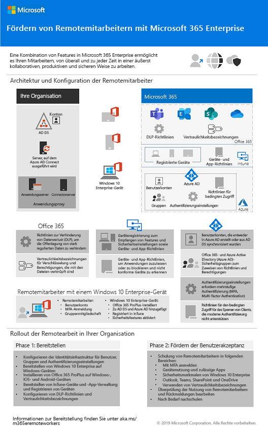

# Änderungen betreffend Microsoft 365 Enterprise-BereitstellungsinhalteChanges to Microsoft 365 Enterprise deployment content

## Oktober 2019October 2019

### Neue InhalteNew content 

- [Poster "Fördern von Remotemitarbeitern"Empower remote workers](empower-people-to-work-remotely.md#poster)

   
 

### Updates und VerbesserungenUpdates and enhancements

- Aktualisierung der [Contoso-Fallstudie](contoso-case-study.md)Refresh of the [Contoso case study](contoso-case-study.md)
- Aktualisierung der [Exchange Online](exchangeonline-workload.md)-WorkloadRefresh of the [Exchange Online](exchangeonline-workload.md) workload
- Aktualisierung des Szenarios [SharePoint-Websites für streng regulierte Daten](teams-sharepoint-online-sites-highly-regulated-data.md)Refresh of the [SharePoint sites for highly regulated data](teams-sharepoint-online-sites-highly-regulated-data.md) scenario
 
  

- [Poster "Microsoft 365 Enterprise"](microsoft-365-overview.md#get-the-big-picture) für neue Szenarien[Microsoft 365 Enterprise poster](microsoft-365-overview.md#get-the-big-picture) for new scenarios 

  

## September 2019September 2019

### Neue InhalteNew content 

- [Szenario "Remotemitarbeiter"Remote workers scenario](empower-people-to-work-remotely.md)

   
 
- [Schritt "E-Mail-Verschlüsselung"](infoprotect-email-encryption.md) für [Phase 6: Schutz von Daten](infoprotect-infrastructure.md)[Email encryption step](infoprotect-email-encryption.md) for [Phase 6: Information Protection](infoprotect-infrastructure.md)

### Updates und VerbesserungenUpdates and enhancements

- Reorganisation und Aktualisierung von [Phase 2: Identität](identity-infrastructure.md)Reorganization and refresh of [Phase 2: Identity](identity-infrastructure.md)
- Aktualisierung von [Phase 1: Vernetzung](networking-infrastructure.md) und [Phase 6: Schutz von Daten](infoprotect-infrastructure.md)Refresh of [Phase 1: Networking](networking-infrastructure.md) and [Phase 6: Information Protection](infoprotect-infrastructure.md)

## August 2019August 2019

### Neue InhalteNew content 

- [Poster "Umstellung Ihrer Organisation auf Microsoft 365 Enterprise"Transition Your Organization to Microsoft 365 Enterprise poster](migration-microsoft-365-enterprise-workload.md#transition-your-entire-organization)

   
 
- [Poster "Identitätsinfrastruktur für Microsoft 365 Enterprise"Identity infrastructure for Microsoft 365 Enterprise poster](identity-infrastructure.md)

  

  Ankündigungen: [Microsoft 365 Technical Community-Blog](https://techcommunity.microsoft.com/t5/Microsoft-365-Blog/Get-the-new-Identity-infrastructure-for-Microsoft-365-Enterprise/ba-p/874941)  |  [LinkedIn](https://www.linkedin.com/pulse/how-can-i-quickly-ramp-up-key-concepts-features-identity-joe-davies/?published=t)Announcements: [Microsoft 365 Technical Community blog](https://techcommunity.microsoft.com/t5/Microsoft-365-Blog/Get-the-new-Identity-infrastructure-for-Microsoft-365-Enterprise/ba-p/874941)  |  [LinkedIn](https://www.linkedin.com/pulse/how-can-i-quickly-ramp-up-key-concepts-features-identity-joe-davies/?published=t)

- [Poster "Ende des Supports für Windows 7 und Office 10"Windows 7 and Office 10 End-of-Support poster](migration-microsoft-365-enterprise-workload.md#summary-of-options-for-office-2010-clients-and-servers-and-windows-7)
  
  

  Ankündigungen: [Microsoft 365 Technical Community-Blog](https://techcommunity.microsoft.com/t5/Microsoft-365-Blog/Move-from-Office-2010-clients-and-servers-and-Windows-7-to/ba-p/846994)  |  [LinkedIn](https://www.linkedin.com/pulse/how-can-microsoft-365-enterprise-help-me-end-support-products-davies/)Announcements: [Microsoft 365 Technical Community blog](https://techcommunity.microsoft.com/t5/Microsoft-365-Blog/Move-from-Office-2010-clients-and-servers-and-Windows-7-to/ba-p/846994)  |  [LinkedIn](https://www.linkedin.com/pulse/how-can-microsoft-365-enterprise-help-me-end-support-products-davies/)

### Updates und VerbesserungenUpdates and enhancements

- [Poster "Microsoft 365 Enterprise"](microsoft-365-overview.md#get-the-big-picture) für neue Produktivitätsszenarien[Microsoft 365 Enterprise poster](microsoft-365-overview.md#get-the-big-picture) for new productivity scenarios

   

## Juli 2019July 2019

### Neue InhalteNew content

- Excel-Arbeitsmappe für den [Artikel "Microsoft 365 Enterprise für Nicht-Unternehmensorganisationen"](deploy-foundation-infrastructure-non-enterprises.md#onboarding)Excel workbook for [Microsoft 365 Enterprise for non-enterprise organizations article](deploy-foundation-infrastructure-non-enterprises.md#onboarding)

## Mai 2019May 2019

### Neue InhalteNew content

- [Poster "Foundation-Infrastruktur"Foundation Infrastructure poster](deploy-foundation-infrastructure.md#at-a-glance)

  

  Ankündigungen: [LinkedIn](https://www.linkedin.com/pulse/how-can-i-get-big-picture-microsoft-365-enterprise-joe-davies/)Announcements: [LinkedIn](https://www.linkedin.com/pulse/how-can-i-get-big-picture-microsoft-365-enterprise-joe-davies/)

 
- [Artikel "Microsoft 365 Enterprise für Nicht-Unternehmensorganisationen"Microsoft 365 Enterprise for non-enterprise organizations article](deploy-foundation-infrastructure-non-enterprises.md)

  

  Ankündigungen: [Microsoft 365 Technical Community-Blog](https://techcommunity.microsoft.com/t5/Microsoft-365-Blog/Deploy-Microsoft-365-Enterprise-infrastructure-even-if-you-re/ba-p/900012)  |  [LinkedIn](https://www.linkedin.com/pulse/how-do-i-deploy-microsoft-365-enterprise-without-joe-davies/)Announcements: [Microsoft 365 Technical Community blog](https://techcommunity.microsoft.com/t5/Microsoft-365-Blog/Deploy-Microsoft-365-Enterprise-infrastructure-even-if-you-re/ba-p/900012)  |  [LinkedIn](https://www.linkedin.com/pulse/how-do-i-deploy-microsoft-365-enterprise-without-joe-davies/)

## April 2019April 2019

### Neue InhalteNew content 

- Testumgebungsanleitungen zu den Voraussetzungen für den [Identitäts- und Gerätezugriff](identity-device-access-m365-test-environment.md)[Identity and device access](identity-device-access-m365-test-environment.md) prerequisite Test Lab Guides
- Die Schritte [Windows Information Protection](infoprotect-deploy-windows-information-protection.md) und [Verhinderung von Datenverlust in Office 365](infoprotect-data-loss-prevention.md) für [Phase 6: Schutz von Daten](infoprotect-infrastructure.md)[Windows Information Protection](infoprotect-deploy-windows-information-protection.md) and [Office 365 Data Loss Prevention](infoprotect-data-loss-prevention.md) steps for [Phase 6: Information Protection](infoprotect-infrastructure.md)

## Siehe auchSee also

[BereitstellungshandbuchDeployment guide](deploy-microsoft-365-enterprise.md)
