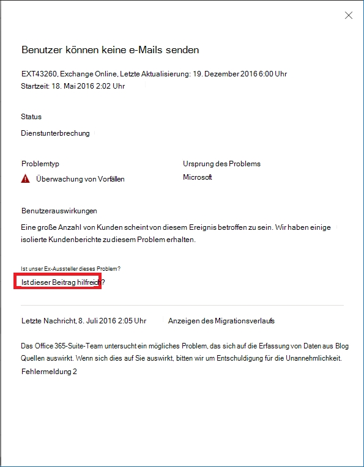

# Exchange Online-Überwachung für Microsoft 365Exchange Online monitoring for Microsoft 365

Mithilfe der Exchange Online-Überwachungsfunktion im Microsoft 365 Admin Center können Sie den Status des Exchange-Diensts für das Microsoft 365-Abonnement Ihrer Organisation überwachen.You can use Exchange Online monitoring in the Microsoft 365 admin center to monitor the health of the Exchange service for your organization’s Microsoft 365 subscription. Über die Exchange Online-Überwachung erhalten Sie Informationen zu Vorfällen und Empfehlungen in bzw. zu den folgenden Kategorien:Exchange Online monitoring provides you with information about incidents and advisories that are collected in these categories:

- **Infrastruktur**: Es werden Probleme in der Microsoft 365-Infrastruktur von Microsoft ermittelt für die Bereitstellung regulärer Updates und die Lösung der Probleme.**Infrastructure**: Issue is detected in the Microsoft 365 infrastructure that Microsoft owns for providing regular updates and resolving the issue. Beispiel: Benutzer können aufgrund von Problemen mit Exchange oder einer anderen Microsoft 365-Cloud-Infrastruktur nicht auf Exchange Online zugreifen.For example, users cannot access Exchange Online because of issues with Exchange or other Microsoft 365 cloud infrastructure.
- **Infrastruktur eines Drittanbieters**: Es werden Probleme in der Infrastruktur eines Drittanbieters ermittelt, von der Ihre Organisation abhängig ist, die Maßnahmen zu deren Behebung von Seiten Ihrer Organisation erfordern.**Third-party infrastructure**: Issue is detected in third-party infrastructure on which your organization has taken a dependency and requires action from your organization for resolution. Beispiel: Transaktionen zur Benutzerauthentifizierung werden durch einen Sicherheitstokendienst (STS, Security Token Service) eines Drittanbieters eingeschränkt, der verhindert, dass Benutzer eine Verbindung mit Exchange Online herstellen können.For example, user authentication transactions are getting throttled by a third-party security token service (STS) provider that prevents users from connecting to Exchange Online.
- **Kundeninfrastruktur**: Es werden Probleme in der Infrastruktur Ihrer Organisation ermittelt, die Maßnahmen zu deren Behebung von Seiten Ihrer Organisation erfordern.**Customer infrastructure**: Issue is detected in your organization's infrastructure and requires action from your organization for resolution. Beispiel: Benutzer können nicht auf Exchange Online zugreifen, da sie aufgrund eines abgelaufenen Zertifikats kein Authentifizierungstoken vom STS-Anbieter erhalten, der von Ihrer Organisation gehostet wird.For example, users cannot access Exchange Online because they are unable to obtain an authentication token from STS provider hosted by your organization because of an expired certificate.

Nachfolgend sehen Sie ein Beispiel für die Seite **Dienststatus** im Microsoft 365 Admin Center, die über **Integrität > Dienststatus** zugänglich ist.Here is an example of the **Service health** page in the Microsoft 365 admin center, available from **Health > Service health**.

Der Wert der Spalte **Status** gibt an, ob der Dienst ordnungsgemäß ausgeführt wird, oder es werden basierend auf den von Microsoft verwalteten Cloud-Diensten Empfehlungen bzw. Vorfälle angezeigt.The value of the **Status** column indicates whether the service is healthy or has advisories or incidents based on the cloud services that Microsoft maintains. 

Der Wert der Spalte **Probleme Ihrer Organisation und von Drittanbietern** gibt an, dass sich die Infrastruktur Ihres Unternehmens oder die Software von Drittanbietern auf die Nutzung der Dienste durch Ihre Benutzer in Exchange Online auswirkt.The value of the **Your org and 3rd party issues** column indicates that your organization's infrastructure or third-party software affects your users service health experience with Exchange Online. Bei Empfehlungen oder Vorfällen sind Maßnahmen von *Ihrer* Seite erforderlich.Advisories or incidents require *your* actions to resolve.

Nachfolgend sehen Sie ein Beispiel für die **Exchange Online**-Überwachungsseite im Microsoft 365 Admin Center, die über **Integrität > Dienststatus > Exchange Online** zugänglich ist.Here is an example of the **Exchange Online** monitoring page in the Microsoft 365 admin center, available from **Health > Service health > Exchange Online**.

Auf der **Exchange Online**-Überwachungsseite können Sie sehen, ob der Exchange Online-Dienst ordnungsgemäß funktioniert oder Probleme vorliegen, und ob damit zusammenhängende Vorfälle oder Empfehlungen angezeigt werden.With the **Exchange Online** monitoring page, you can see whether the Exchange Online service is healthy or not and whether there are any associated incidents or advisories. Mithilfe der Exchange Online-Überwachung können Sie sich den Dienststatus für bestimmte E-Mail-Szenarien ansehen und nahezu in Echtzeit Signale anzeigen, um die Auswirkungen nach Szenarien zu ermitteln.With Exchange Online monitoring, you can look at the service health for specific email scenarios and view near real-time signals to determine the impact by scenario. 

## AnforderungenRequirements

Diese Vorschau ist für Kunden verfügbar, die die folgenden Anforderungen erfüllen:This preview is enabled for customers who meet these requirements: 

- Ihre Organisation muss über mindestens 5000 Lizenzen für eines oder eine Kombination dieser Produkte verfügen: Office 365 E3, Microsoft 365 E3, Office 365 E5, Microsoft 365 E5.Your organization needs to have a license count of at least 5,000, from one or a combination of these products: Office 365 E3, Microsoft 365 E3, Office 365 E5, Microsoft 365 E5. 

  So kann Ihre Organisation beispielsweise über 3000 Office 365 E3-Lizenzen und 2500 Microsoft 365 E5-Lizenzen verfügen, die insgesamt 5500 Lizenzen für berechtigende Produkte ergeben.For example, your organization can have 3,000 Office 365 E3 licenses and 2,500 Microsoft 365 E5, for a total of 5,500 licenses from the qualifying products.

- Ihre Organisation muss über mindestens 50 monatlich aktive Exchange Online-Benutzer verfügen.Your organization needs to have at least 50 monthly active Exchange Online users.

Mithilfe der Exchange Online-Überwachung können Sie den Status der folgenden E-Mail-Clients basierend auf den E-Mail-Leseaktivitäten anzeigen:With Exchange Online monitoring you can view the health for the following email clients based on email read activity:

- Outlook DesktopOutlook Desktop
- Outlook im WebOutlook on the Web
- Native E-Mail-Clients von iOS und AndroidNative mail clients of iOS and Android 
- Mobile Outlook-App in iOS und AndroidOutlook Mobile app in iOS and Android 
- Outlook-Mac-ClientOutlook Mac client

Für diese Clients können Sie die Anzahl der aktiven Benutzer in den letzten 30 Minuten anzeigen, basierend auf den Benutzern, die eine E-Mail gelesen haben, sowie die Anzahl der Vorfälle und Empfehlungen im Dashboard.For these clients, you can see the number of active users in the last 30 minutes based on users reading an email, along with number of incidents and advisories in the dashboard. Diese Daten werden mit jenen desselben Intervalls für die vorherige Woche verglichen, um festzustellen, ob ein Problem vorliegt.This data is compared to the same interval for the previous week to see if there’s an issue. 

>[!Note]
> Die Anzahl der aktiven Benutzer wird anhand einer einzelnen Aktivität wie beispielsweise das Lesen einer E-Mail erfasst.Active user count is measured by a single activity, for example, when a user reads an email. Dabei werden nur die letzten 30 Minuten der Aktivität berücksichtigt.It only accounts for the last 30 minutes of activity.
>

Sie können den Exchange Online-Status auch für die folgenden Szenarien überwachen:You can also monitor Exchange Online health for the following scenarios:

- **E-Mail-Fluss**: die Anzahl der Nachrichten, die nach dem Erreichen des Microsoft 365-Netzwerks ohne Verzögerungen an ein Postfach übermittelt wurden.**Mail flow**: The number of messages successfully delivered to a mailbox without any delay after the message reached the Microsoft 365 network. 
- **Standardauthentifizierung und moderne Authentifizierung**: die Anzahl der Benutzer, die im Exchange Online-Dienst erfolgreich überprüft wurden.**Basic Authentication and Modern Authentication**: The number of users successfully validated in the Exchange Online service.

Die Schlüsselzahlen im Hauptdashboard zu all diesen Szenarien beziehen auf die letzten 30 Minuten.For all these scenarios, the key numbers are for the last 30 minutes in the main dashboard. In detaillierten Ansichten für jedes dieser Szenarien wird der Beinah-Echtzeit-Trend für sieben Tage mit den aggregierten 30-Minuten-Daten im Vergleich zur vorherigen Woche angezeigt.Detailed views for each of these scenarios shows the near real-time trend for seven days with the 30-minute aggregate compared with the previous week. 

## Senden Sie uns Ihr FeedbackSend us feedback

Es gibt zwei Möglichkeiten, Feedback zu senden:There are two ways you can provide feedback:

- Verwenden Sie die **Feedback**-Option, die auf allen Seiten des Microsoft 365 Admin Centers verfügbar ist.Use the **Give feedback** option available on every page of the Microsoft 365 admin center.
- Übermitteln Sie Ihr Feedback über den Link **Ist dieser Beitrag hilfreich?** zu einem bestimmten Vorfall oder einer bestimmten Empfehlung.Submit feedback using the **Is this post helpful?** link for a specific incident or advisory.

## Häufig gestellte FragenFrequently asked questions

#### 1. Warum wird die "Exchange Online-Überwachung" im Microsoft 365 Admin Center im Bereich "Integrität" nicht angezeigt?1. Why don’t I see “Exchange Online monitoring” under Health in the Microsoft 365 admin center? 

Vergewissern Sie sich zunächst, dass Sie das neue Admin Center auf der **Startseite** des Microsoft 365 Admin Centers aktiviert haben.First, make sure you’ve enabled the new admin center on the **Home** page of the Microsoft 365 admin center. 

Stellen Sie dann sicher, dass Sie die beiden folgenden Voraussetzungen erfüllen:Then make sure you meet both of the following requirements: 

- Ihre Organisation muss über mindestens 5000 Lizenzen für eines oder eine Kombination dieser Produkte verfügen: Office 365 E3, Microsoft 365 E3, Office 365 E5, Microsoft 365 E5.Your organization needs to have a license count of at least 5,000, from one or a combination of these products: Office 365 E3, Microsoft 365 E3, Office 365 E5, Microsoft 365 E5. 
- Ihre Organisation muss über mindestens 50 monatlich aktive Exchange Online-Benutzer verfügen.Your organization needs to have at least 50 monthly active Exchange Online users.

Wenn die Anzahl der Lizenzen für Ihre Organisation unter 5000 Benutzern liegt und die monatlich aktiven Benutzer weniger als 50 sind, wird die Exchange Online-Überwachung erst aktiviert, wenn diese Voraussetzungen erfüllt sind.If the license count for your organization goes below 5,000 users and the monthly active users goes below 50 users, Exchange Online monitoring won’t be enabled until these requirements are met.

#### 2. Die Anzahl der im Dashboard für jeden Client angezeigten aktiven Benutzer scheint niedrig zu sein.2. The active user count in the dashboard for each client appears to be low. Wir verfügen über viele Benutzern zugewiesene aktive Lizenzen.We have a lot of active licenses assigned to users. Was bedeutet dies?What does this mean? 

Die in der Überwachung angezeigte Anzahl aktiver Benutzer basiert auf einem 30-Minuten-Fenster, in dem die Benutzer die im Feature angegebene Aktivität ausgeführt haben.The active user count shown in monitoring is based on a 30-minute window where users have performed the activity called out in the feature. Dies sollte nicht mit Nutzungswerten verwechselt werden.This shouldn’t be confused with usage numbers. Verwenden Sie zum Anzeigen von Nutzungswerten Aktivitätsberichte im Microsoft 365 Admin Center (**Berichte > Nutzung**).To view usage numbers, use activity reports in the Microsoft 365 admin center (**Reports > Usage**).

#### 3. Wird es andere Überwachungsszenarien für andere Dienste wie Microsoft Teams und SharePoint geben?3. Will there be other monitoring scenarios for other services such as Teams and SharePoint? 

Dieses Feature wird von Microsoft direkt in das Dashboard "Dienststatus" im Microsoft 365 Admin Center integriert.Microsoft is integrating this experience directly inside the Service Health dashboard in the Microsoft 365 admin center. Auf diese Weise kann Microsoft Überwachungsszenarien für andere Dienste erweitern. Wenn es so weit ist, wird eine entsprechende Mitteilung erfolgen.This will provide opportunities for Microsoft to extend monitoring scenarios for other services, which will be announced when there is news to share. 

#### 4. Was sind die Absichten im Hinblick auf eine allgemeine Verfügbarkeit dieser Lösung?4. What is the plan for general availability of this experience? 

Microsoft hat die Exchange Online-Überwachung direkt in das Dashboard **Dienststatus** im Microsoft 365 Admin Center integriert.Microsoft has integrated Exchange Online monitoring directly on the **Service Health** dashboard in the Microsoft 365 admin center. 

Microsoft möchte Ihr Feedback zu dieser neuen integrierten Lösung sammeln und anschließend Entscheidungen hinsichtlich einer allgemeinen Verfügbarkeit treffen.With this new integrated experience, Microsoft's plan is to collect your feedback and then define our plan for general availability.

#### 5. Handelt es sich um ein kostenloses (inbegriffenes) oder ein kostenpflichtiges (zusätzliches) Feature?5. Is this a free (included) or paid (extra) feature? 

Dieses Feature befindet sich in der öffentlichen Vorschau und ist nur für Kunden verfügbar, die die in Frage 1 aufgeführten Anforderungen erfüllen.This feature is in Public preview and only available for customers that meet the requirements in question 1.

<!--
>[!Note]
>INTERNAL: That decision is pending
>
--> 

#### 6. Wie kann ich Feedback geben?6. How do I provide feedback? 

Verwenden Sie für allgemeines Feedback das **Feedback**-Symbol in der unteren rechten Ecke auf der **Exchange Online**-Überwachungsseite.For general feedback, use the **Give feedback** icon on the bottom-right corner of the **Exchange Online** monitoring page. 

Wenn Sie Feedback zu Vorfällen oder Empfehlungen geben möchten, verwenden Sie den Link **Ist dieser Beitrag hilfreich?**.For feedback on incidents or advisories, use the **Is this post helpful?** link.

#### 7. Wo werden die Daten für die Szenarien instrumentiert, die Aktivitätstrends aufweisen?7. Where is the data instrumented for the scenarios that show activity trends?

Die Daten werden im Exchange Online-Dienst instrumentiert. Wenn ein Fehler auftritt, bevor die Anforderung Exchange Online erreicht, oder wenn in Exchange Online ein Fehler auftritt, wird das Aktivitätssignal zurückgehen.The data is instrumented in the Exchange Online service. If there is a failure that happens before the request reaches Exchange Online or there is a failure in Exchange Online, you will see a drop in the activity signal.

