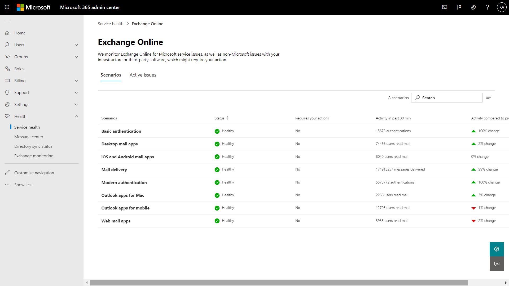

# Exchange Online-Überwachung für Microsoft 365

Mithilfe der Exchange Online-Überwachungsfunktion im Microsoft 365 Admin Center können Sie den Status des Exchange-Diensts für das Microsoft 365-Abonnement Ihrer Organisation überwachen. Über die Exchange Online-Überwachung erhalten Sie Informationen zu Vorfällen und Empfehlungen in bzw. zu den folgenden Kategorien:

- **Infrastruktur**: Es werden Probleme in der Microsoft 365-Infrastruktur von Microsoft ermittelt für die Bereitstellung regulärer Updates und die Lösung der Probleme. Beispiel: Benutzer können aufgrund von Problemen mit Exchange oder einer anderen Microsoft 365-Cloud-Infrastruktur nicht auf Exchange Online zugreifen.
- **Infrastruktur eines Drittanbieters**: Es werden Probleme in der Infrastruktur eines Drittanbieters ermittelt, von der Ihre Organisation abhängig ist, die Maßnahmen zu deren Behebung von Seiten Ihrer Organisation erfordern. Beispiel: Transaktionen zur Benutzerauthentifizierung werden durch einen Sicherheitstokendienst (STS, Security Token Service) eines Drittanbieters eingeschränkt, der verhindert, dass Benutzer eine Verbindung mit Exchange Online herstellen können.
- **Kundeninfrastruktur**: Es werden Probleme in der Infrastruktur Ihrer Organisation ermittelt, die Maßnahmen zu deren Behebung von Seiten Ihrer Organisation erfordern. Beispiel: Benutzer können nicht auf Exchange Online zugreifen, da sie aufgrund eines abgelaufenen Zertifikats kein Authentifizierungstoken vom STS-Anbieter erhalten, der von Ihrer Organisation gehostet wird.

Nachfolgend sehen Sie ein Beispiel für die Seite **Dienststatus** im Microsoft 365 Admin Center, die über **Integrität > Dienststatus** zugänglich ist.

Der Wert der Spalte **Status** gibt an, ob der Dienst ordnungsgemäß ausgeführt wird, oder es werden basierend auf den von Microsoft verwalteten Cloud-Diensten Empfehlungen bzw. Vorfälle angezeigt. 

Der Wert der Spalte **Probleme Ihrer Organisation und von Drittanbietern** gibt an, dass sich die Infrastruktur Ihres Unternehmens oder die Software von Drittanbietern auf die Nutzung der Dienste durch Ihre Benutzer in Exchange Online auswirkt. Bei Empfehlungen oder Vorfällen sind Maßnahmen von *Ihrer* Seite erforderlich.

Nachfolgend sehen Sie ein Beispiel für die **Exchange Online**-Überwachungsseite im Microsoft 365 Admin Center, die über **Integrität > Dienststatus > Exchange Online** zugänglich ist.

Auf der **Exchange Online**-Überwachungsseite können Sie sehen, ob der Exchange Online-Dienst ordnungsgemäß funktioniert oder Probleme vorliegen, und ob damit zusammenhängende Vorfälle oder Empfehlungen angezeigt werden. Mithilfe der Exchange Online-Überwachung können Sie sich den Dienststatus für bestimmte E-Mail-Szenarien ansehen und nahezu in Echtzeit Signale anzeigen, um die Auswirkungen nach Szenarien zu ermitteln. 

## Anforderungen

Diese Vorschau ist für Kunden verfügbar, die die folgenden Anforderungen erfüllen: 

- Ihre Organisation muss über mindestens 5000 Lizenzen für eines oder eine Kombination dieser Produkte verfügen: Office 365 E3, Microsoft 365 E3, Office 365 E5, Microsoft 365 E5. 

  So kann Ihre Organisation beispielsweise über 3000 Office 365 E3-Lizenzen und 2500 Microsoft 365 E5-Lizenzen verfügen, die insgesamt 5500 Lizenzen für berechtigende Produkte ergeben.

- Ihre Organisation muss über mindestens 50 monatlich aktive Exchange Online-Benutzer verfügen.

Mithilfe der Exchange Online-Überwachung können Sie den Status der folgenden E-Mail-Clients basierend auf den E-Mail-Leseaktivitäten anzeigen:

- Outlook Desktop
- Outlook im Web
- Native E-Mail-Clients von iOS und Android 
- Mobile Outlook-App in iOS und Android 
- Outlook-Mac-Client

Für diese Clients können Sie die Anzahl der aktiven Benutzer in den letzten 30 Minuten anzeigen, basierend auf den Benutzern, die eine E-Mail gelesen haben, sowie die Anzahl der Vorfälle und Empfehlungen im Dashboard. Diese Daten werden mit jenen desselben Intervalls für die vorherige Woche verglichen, um festzustellen, ob ein Problem vorliegt. 

>[!Note]
> Die Anzahl der aktiven Benutzer wird anhand einer einzelnen Aktivität wie beispielsweise das Lesen einer E-Mail erfasst. Dabei werden nur die letzten 30 Minuten der Aktivität berücksichtigt.
>

Sie können den Exchange Online-Status auch für die folgenden Szenarien überwachen:

- **E-Mail-Fluss**: die Anzahl der Nachrichten, die nach dem Erreichen des Microsoft 365-Netzwerks ohne Verzögerungen an ein Postfach übermittelt wurden. 
- **Standardauthentifizierung und moderne Authentifizierung**: die Anzahl der Benutzer, die im Exchange Online-Dienst erfolgreich überprüft wurden.

Die Schlüsselzahlen im Hauptdashboard zu all diesen Szenarien beziehen auf die letzten 30 Minuten. In detaillierten Ansichten für jedes dieser Szenarien wird der Beinah-Echtzeit-Trend für sieben Tage mit den aggregierten 30-Minuten-Daten im Vergleich zur vorherigen Woche angezeigt. 

## Senden Sie uns Ihr Feedback

Es gibt zwei Möglichkeiten, Feedback zu senden:

- Verwenden Sie die **Feedback**-Option, die auf allen Seiten des Microsoft 365 Admin Centers verfügbar ist.
- Übermitteln Sie Ihr Feedback über den Link **Ist dieser Beitrag hilfreich?** zu einem bestimmten Vorfall oder einer bestimmten Empfehlung.

## Häufig gestellte Fragen

#### 1. Warum wird die "Exchange Online-Überwachung" im Microsoft 365 Admin Center im Bereich "Integrität" nicht angezeigt? 

Vergewissern Sie sich zunächst, dass Sie das neue Admin Center auf der **Startseite** des Microsoft 365 Admin Centers aktiviert haben. 

Stellen Sie dann sicher, dass Sie die beiden folgenden Voraussetzungen erfüllen: 

- Ihre Organisation muss über mindestens 5000 Lizenzen für eines oder eine Kombination dieser Produkte verfügen: Office 365 E3, Microsoft 365 E3, Office 365 E5, Microsoft 365 E5. 
- Ihre Organisation muss über mindestens 50 monatlich aktive Exchange Online-Benutzer verfügen.

Wenn die Anzahl der Lizenzen für Ihre Organisation unter 5000 Benutzern liegt und die monatlich aktiven Benutzer weniger als 50 sind, wird die Exchange Online-Überwachung erst aktiviert, wenn diese Voraussetzungen erfüllt sind.

#### 2. Die Anzahl der im Dashboard für jeden Client angezeigten aktiven Benutzer scheint niedrig zu sein. Wir verfügen über viele Benutzern zugewiesene aktive Lizenzen. Was bedeutet dies? 

Die in der Überwachung angezeigte Anzahl aktiver Benutzer basiert auf einem 30-Minuten-Fenster, in dem die Benutzer die im Feature angegebene Aktivität ausgeführt haben. Dies sollte nicht mit Nutzungswerten verwechselt werden. Verwenden Sie zum Anzeigen von Nutzungswerten Aktivitätsberichte im Microsoft 365 Admin Center (**Berichte > Nutzung**).

#### 3. Wird es andere Überwachungsszenarien für andere Dienste wie Microsoft Teams und SharePoint geben? 

Dieses Feature wird von Microsoft direkt in das Dashboard "Dienststatus" im Microsoft 365 Admin Center integriert. Auf diese Weise kann Microsoft Überwachungsszenarien für andere Dienste erweitern. Wenn es so weit ist, wird eine entsprechende Mitteilung erfolgen. 

#### 4. Was sind die Absichten im Hinblick auf eine allgemeine Verfügbarkeit dieser Lösung? 

Microsoft hat die Exchange Online-Überwachung direkt in das Dashboard **Dienststatus** im Microsoft 365 Admin Center integriert. 

Microsoft möchte Ihr Feedback zu dieser neuen integrierten Lösung sammeln und anschließend Entscheidungen hinsichtlich einer allgemeinen Verfügbarkeit treffen.

#### 5. Handelt es sich um ein kostenloses (inbegriffenes) oder ein kostenpflichtiges (zusätzliches) Feature? 

Dieses Feature befindet sich in der öffentlichen Vorschau und ist nur für Kunden verfügbar, die die in Frage 1 aufgeführten Anforderungen erfüllen.

<!--
>[!Note]
>INTERNAL: That decision is pending
>
--> 

#### 6. Wie kann ich Feedback geben? 

Verwenden Sie für allgemeines Feedback das **Feedback**-Symbol in der unteren rechten Ecke auf der **Exchange Online**-Überwachungsseite. 

Wenn Sie Feedback zu Vorfällen oder Empfehlungen geben möchten, verwenden Sie den Link **Ist dieser Beitrag hilfreich?**.

#### 7. Wo werden die Daten für die Szenarien instrumentiert, die Aktivitätstrends aufweisen?

Die Daten werden im Exchange Online-Dienst instrumentiert. Wenn ein Fehler auftritt, bevor die Anforderung Exchange Online erreicht, oder wenn in Exchange Online ein Fehler auftritt, wird das Aktivitätssignal zurückgehen.

