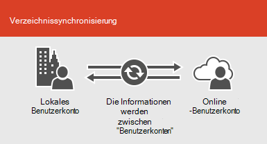

# Microsoft 365-Integration in lokale Umgebungen

*Dieser Artikel gilt sowohl für Microsoft 365 Enterprise als auch für Office 365 Enterprise.*

Sie können Microsoft 365 mit Ihren vorhandenen Verzeichnisdiensten und mit einer lokalen Installation von Exchange Server, Skype for Business Server 2015 oder SharePoint Server integrieren.
  
 - Wenn Sie die Integration in die Verzeichnisdienste durchführen, können Sie Benutzerkonten für beide Umgebungen synchronisieren und verwalten. Sie können auch die Kennworthashsynchronisierung oder das einmalige Anmelden (Single Sign-on, SSO) hinzufügen, damit sich die Benutzer mit Ihren lokalen Anmeldeinformationen bei beiden Umgebungen anmelden können.
 - Bei der Integration in lokale Serverprodukte erstellen Sie eine Hybridumgebung. Eine Hybridumgebung kann bei der Migration von Benutzern oder Informationen zu Microsoft 365 helfen, oder Sie können weiterhin einige Benutzer oder einige lokale Informationen und einige in der Cloud haben. Weitere Informationen zu Hybridumgebungen finden Sie unter [Übersicht über die Hybridcloud](https://docs.microsoft.com/Office365/Enterprise/hybrid-cloud-overview).

Sie können auch die Azure Active Directory (Azure AD)-Ratgeber für angepasste Setup Anleitungen verwenden (Sie müssen bei Microsoft 365 angemeldet sein):

- [Synchronisieren von Benutzern aus dem Verzeichnis Ihrer Organisation](https://aka.ms/aadconnectpwsync)
- [Bereitstellungsratgeber für AD FS](https://aka.ms/adfsguidance)
- [Azure AD-Installationshandbuch](https://aka.ms/aadpguidance)
   
## Bevor Sie beginnen

Bevor Sie Microsoft 365 und eine lokale Umgebung integrieren, müssen Sie auch an der [Netzwerkplanung und der Leistungsoptimierung](network-planning-and-performance.md)teilnehmen. Außerdem ist es wichtig, dass Sie die verfügbaren [Identitätsmodelle](about-microsoft-365-identity.md) verstehen. 

Eine Liste der Tools, die Sie zum Verwalten von Microsoft 365-Benutzern und-Konten verwenden können, finden Sie unter [Verwalten von Microsoft 365-Konten](manage-microsoft-365-accounts.md) . 
  
## Integrieren von Microsoft 365 mit Verzeichnisdiensten
Wenn Sie über vorhandene Benutzerkonten in einem lokalen Verzeichnis verfügen, möchten Sie nicht alle diese Konten in Microsoft 365 neu erstellen und möglicherweise Unterschiede oder Fehler zwischen den Umgebungen einführen. Mithilfe der Verzeichnissynchronisierung können Sie diese Konten zwischen der Onlineumgebung und der lokalen Umgebung spiegeln. Bei der Verzeichnissynchronisierung müssen sich die Benutzer nicht neue Informationen zu jeder Umgebung merken, und Sie brauchen die Konten nicht zweimal zu erstellen oder zu aktualisieren. Sie müssen [Ihr lokales Verzeichnis für die](prepare-for-directory-synchronization.md) Verzeichnissynchronisierung vorbereiten.
  

  
Wenn Sie möchten, dass sich Benutzer bei Microsoft 365 mit Ihren lokalen Anmeldeinformationen anmelden können, können Sie auch SSO konfigurieren. Mit SSO wird Microsoft 365 so konfiguriert, dass die lokale Umgebung für die Benutzerauthentifizierung vertrauenswürdig ist.
  

  
Unterschiedliche Techniken der Benutzerkontenverwaltung bieten Ihren Benutzern unterschiedliche Erfahrungen, wie in der nachstehenden Tabelle gezeigt wird.
 
### Verzeichnissynchronisierung mit oder ohne Kennworthashsynchronisierung oder Passthrough-Authentifizierung

Ein Benutzer meldet sich mit seinem Benutzerkonto (domäne\benutzername) bei seiner lokalen Umgebung an. Wenn Sie zu Microsoft 365 wechseln, müssen Sie sich mit Ihrem Arbeits-oder Schulkonto (User@Domain.com) erneut anmelden. Der Benutzername ist in beiden Umgebungen identisch. Wenn Sie Kennworthash Synchronisierung oder Pass-Through-Authentifizierung hinzufügen, verfügt der Benutzer über dasselbe Kennwort für beide Umgebungen, muss diese Anmeldeinformationen jedoch erneut bereitstellen, wenn er sich bei Microsoft 365 anmeldet. Verzeichnissynchronisierung mit Kennworthashsynchronisierung ist das am häufigsten verwendete Szenario der Verzeichnissynchronisierung.

Verwenden Sie Azure Active Directory Connect, um die Verzeichnissynchronisierung einzurichten. Anweisungen finden Sie unter [Einrichten der Verzeichnissynchronisierung für Microsoft 365](set-up-directory-synchronization.md)und [Azure AD Verbindung mit Express-Einstellungen](https://go.microsoft.com/fwlink/p/?LinkId=698537).

Erfahren Sie mehr über die [Vorbereitung der Verzeichnissynchronisierung auf Microsoft 365](prepare-for-directory-synchronization.md) und [die Integration Ihrer lokalen identifiziert sich mit Azure Active Directory](https://go.microsoft.com/fwlink/?LinkId=518101).

### Verzeichnissynchronisierung mit SSO

Ein Benutzer meldet sich mit seinem Benutzerkonto bei seiner lokalen Umgebung an. Wenn Sie zu Microsoft 365 wechseln, werden Sie entweder automatisch angemeldet, oder Sie melden sich mit den gleichen Anmeldeinformationen an, die Sie für Ihre lokale Umgebung verwenden (Domäne \ Benutzername).

Zum Einrichten von SSO verwenden Sie ebenfalls Azure Active Directory Connect. Anweisungen finden Sie unter [Benutzerdefinierte Installation von Azure AD Connect](https://go.microsoft.com/fwlink/p/?LinkID=698430).

Weitere Informationen zum [einmaligen Anmelden bei Anwendungen in Azure Active Directory](https://go.microsoft.com/fwlink/p/?LinkId=698604).

## Azure AD Connect

Azure AD Connect ersetzt ältere Versionen von Identitätsintegrationstools wie DirSync und Azure AD Sync. Weitere Informationen finden Sie unter [Was bedeutet Hybrididentität in Azure Active Directory?](https://go.microsoft.com/fwlink/p/?LinkId=527969). Informationen zum Aktualisieren von Azure AD Sync auf Azure AD Connect finden Sie in den [Aktualisierungsanweisungen](https://go.microsoft.com/fwlink/p/?LinkId=733240). 

Siehe auch [Bereitstellen der Microsoft 365-Verzeichnissynchronisierung in Microsoft Azure](https://go.microsoft.com/fwlink/?LinkId=517887).

## Siehe auch

[Übersicht zu Microsoft 365 Enterprise](microsoft-365-overview.md)
