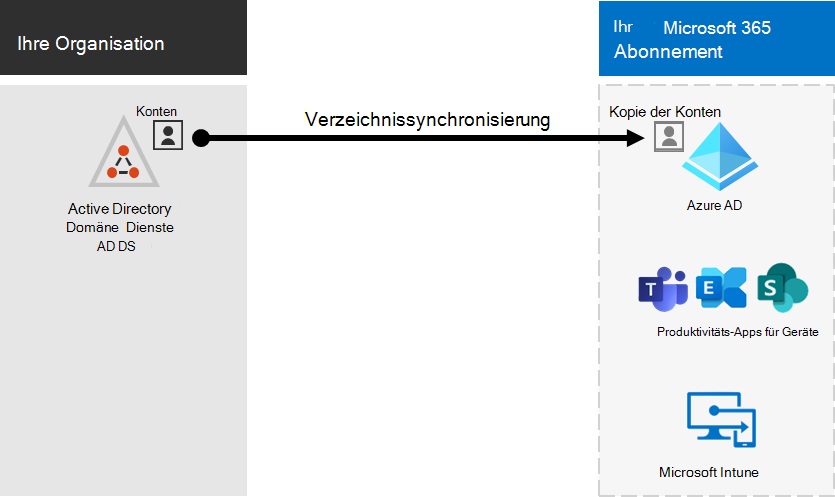
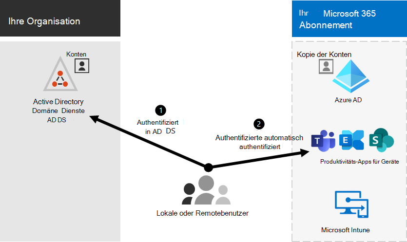

# Microsoft 365-Integration in lokale Umgebungen

*Dieser Artikel gilt sowohl für Microsoft 365 Enterprise als auch für Office 365 Enterprise.*

Sie können Microsoft 365 mit Ihren vorhandenen lokalen Active Directory-Domänendienste (AD DS) und mit lokalen Installationen von Exchange Server, Skype for Business Server 2015 oder SharePoint Server integrieren.
  
 - Wenn Sie AD DS integrieren, können Sie Benutzerkonten für beide Umgebungen synchronisieren und verwalten. Sie können auch die Kennworthash Synchronisierung (PHS) oder einmaliges Anmelden (Single Sign-on, SSO) hinzufügen, damit sich Benutzer bei beiden Umgebungen mit Ihren lokalen Anmeldeinformationen anmelden können.
 - Bei der Integration in lokale Serverprodukte erstellen Sie eine Hybridumgebung. Eine Hybridumgebung kann bei der Migration von Benutzern oder Informationen zu Microsoft 365 helfen, oder Sie können weiterhin einige Benutzer oder einige lokale Informationen und einige in der Cloud haben. Weitere Informationen zu Hybrid Umgebungen finden Sie unter [Hybrid Cloud](../solutions/cloud-architecture-models.md#hybrid).

Sie können auch die Azure Active Directory (Azure AD)-Ratgeber für angepasste Einrichtungsanleitungen im Microsoft 365 Admin Center verwenden (Sie müssen bei Microsoft 365 angemeldet sein):

- [Azure AD-Installationshandbuch](https://aka.ms/aadpguidance)
- [Synchronisieren von Benutzern aus dem Verzeichnis Ihrer Organisation](https://aka.ms/aadconnectpwsync)
- [Bereitstellungs Ratgeber für Active Directory Verbunddienste (AD FS)](https://aka.ms/adfsguidance)
   
## Bevor Sie beginnen

Bevor Sie Microsoft 365 und eine lokale Umgebung integrieren, müssen Sie auch die [Netzwerkplanung und die Leistungsoptimierung](network-planning-and-performance.md)durchführen. Außerdem ist es wichtig, dass Sie die verfügbaren [Identitätsmodelle](about-microsoft-365-identity.md) verstehen. 

Unter [Verwalten von Microsoft 365-Konten](manage-microsoft-365-accounts.md) finden Sie eine Liste der Tools, die Sie zum Verwalten von Microsoft 365-Benutzerkonten verwenden können. 
  
## Integrieren von Microsoft 365 mit AD DS

Wenn Sie über vorhandene Benutzerkonten in AD DS verfügen, möchten Sie nicht alle diese Konten in Microsoft 365 neu erstellen und möglicherweise Unterschiede oder Fehler zwischen den Umgebungen einführen. Die Verzeichnissynchronisierung unterstützt Sie beim Spiegeln dieser Konten zwischen Ihren lokalen und Online-Umgebungen. Bei der Verzeichnissynchronisierung müssen sich die Benutzer nicht neue Informationen zu jeder Umgebung merken, und Sie brauchen die Konten nicht zweimal zu erstellen oder zu aktualisieren. Sie müssen [Ihr lokales Verzeichnis für die](prepare-for-directory-synchronization.md) Verzeichnissynchronisierung vorbereiten.
  

  
Wenn Sie möchten, dass sich Benutzer bei Microsoft 365 mit Ihren lokalen Anmeldeinformationen anmelden können, können Sie auch SSO konfigurieren. Mit SSO wird Microsoft 365 so konfiguriert, dass die lokale Umgebung für die Benutzerauthentifizierung vertrauenswürdig ist.
  

### Verzeichnissynchronisierung mit oder ohne Kennworthash Synchronisierung oder Pass-Through-Authentifizierung (PTA)

Ein Benutzer meldet sich mit seinem Benutzerkonto (domäne\benutzername) bei seiner lokalen Umgebung an. Wenn Sie zu Microsoft 365 wechseln, müssen Sie sich mit Ihrem Arbeits-oder Schulkonto (User@Domain.com) erneut anmelden. Der Benutzername ist in beiden Umgebungen identisch. Wenn Sie PHS oder PTA hinzufügen, verfügt der Benutzer über dasselbe Kennwort für beide Umgebungen, muss diese Anmeldeinformationen jedoch erneut bereitstellen, wenn er sich bei Microsoft 365 anmeldet. Die Verzeichnissynchronisierung mit PHS ist die am häufigsten verwendete Verzeichnissynchronisierung.

Verwenden Sie Azure AD Connect, um die Verzeichnissynchronisierung einzurichten. Anweisungen finden Sie unter [Einrichten der Verzeichnissynchronisierung für Microsoft 365](set-up-directory-synchronization.md) und [Azure AD Connect with Express Settings](https://go.microsoft.com/fwlink/p/?LinkId=698537).

Erfahren Sie mehr über [die Vorbereitung der Verzeichnissynchronisierung auf Microsoft 365](prepare-for-directory-synchronization.md).

### Verzeichnissynchronisierung mit SSO

Ein Benutzer meldet sich mit seinem Benutzerkonto bei seiner lokalen Umgebung an. Wenn Sie zu Microsoft 365 wechseln, werden Sie entweder automatisch angemeldet, oder Sie melden sich mit den gleichen Anmeldeinformationen an, die Sie für Ihre lokale Umgebung verwenden (Domäne \ Benutzername).

Zum Einrichten von SSO verwenden Sie ebenfalls Azure Active Directory Connect. Anweisungen finden Sie unter [Custom install of Azure AD Connect](https://go.microsoft.com/fwlink/p/?LinkID=698430).

Weitere Informationen finden Sie unter [Single Sign-on](https://go.microsoft.com/fwlink/p/?LinkId=698604).

## Azure AD Connect

Azure AD Connect ersetzt ältere Versionen von Identitäts Integrationstools wie Dirsync und Azure AD Sync. Wenn Sie die Aktualisierung von Azure Active Directory Sync mit Azure AD Connect durchführen möchten, lesen Sie [die Upgrade-Anweisungen](https://go.microsoft.com/fwlink/p/?LinkId=733240). 

## Siehe auch

[Übersicht zu Microsoft 365 Enterprise](microsoft-365-overview.md)
