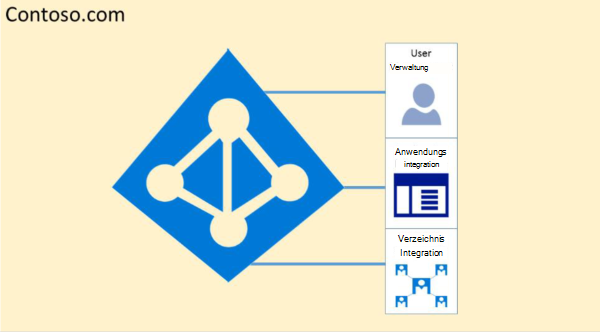
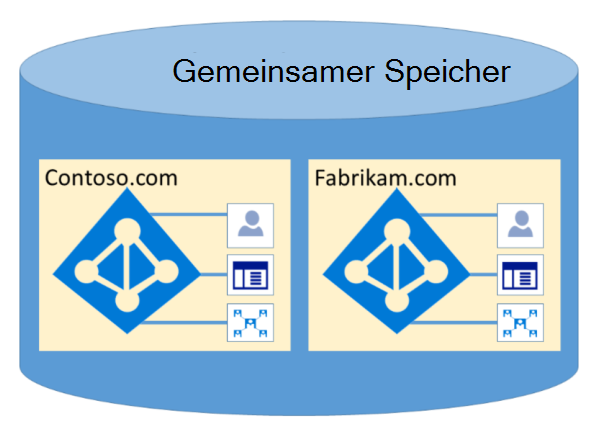

# Microsoft 365 Isolation und Zugriffssteuerung in Azure Active DirectoryMicrosoft 365 Isolation and Access Control in Azure Active Directory

Azure Active Directory (Azure AD) wurde entwickelt, um mehrere Mandanten durch logische Datenisolation auf äußerst sichere Weise zu hosten.Azure Active Directory (Azure AD) was designed to host multiple tenants in a highly secure way through logical data isolation. Der Zugriff auf Azure AD wird durch eine Autorisierungsebene geortet.Access to Azure AD is gated by an authorization layer. Azure AD isoliert Kunden, die Mandantencontainer als Sicherheitsgrenzen verwenden, um die Inhalte eines Kunden zu schützen, sodass der Zugriff auf die Inhalte durch Mit-Mandanten nicht möglich ist oder von diesen beeinträchtigt werden kann.Azure AD isolates customers using tenant containers as security boundaries to safeguard a customer's content so that the content cannot be accessed or compromised by co-tenants. Drei Prüfungen werden von der Autorisierungsebene von Azure AD durchgeführt:Three checks are performed by Azure AD's authorization layer:

- Ist der Prinzipal für den Zugriff auf Azure AD-Mandanten aktiviert?Is the principal enabled for access to Azure AD tenant?
- Ist der Prinzipal für den Zugriff auf Daten in diesem Mandanten aktiviert?Is the principal enabled for access to data in this tenant?
- Ist die Rolle des Prinzipal in diesem Mandanten für die Art des angeforderten Datenzugriffs autorisiert?Is the principal's role in this tenant authorized for the type of data access requested?

Keine Anwendung, kein Benutzer, kein Server oder kein Dienst kann ohne die richtige Authentifizierung und das entsprechende Token oder Zertifikat auf Azure AD zugreifen.No application, user, server, or service can access Azure AD without the proper authentication and token or certificate. Anforderungen werden abgelehnt, wenn sie nicht von ordnungsgemäßen Anmeldeinformationen begleitet werden.Requests are rejected if they are not accompanied by proper credentials.

Tatsächlich hostet Azure AD jeden Mandanten in seinem eigenen geschützten Container mit Richtlinien und Berechtigungen für und innerhalb des Containers, die ausschließlich im Besitz des Mandanten sind und vom Mandanten verwaltet werden.Effectively, Azure AD hosts each tenant in its own protected container, with policies and permissions to and within the container solely owned and managed by the tenant.
 

Das Konzept von Mandantencontainern ist tief in den Verzeichnisdienst auf allen Ebenen, von Portalen bis zum persistenten Speicher, tief gespalten.The concept of tenant containers is deeply ingrained in the directory service at all layers, from portals all the way to persistent storage. Selbst wenn mehrere Azure AD-Mandantenmetadaten auf demselben physischen Datenträger gespeichert werden, besteht keine andere Beziehung zwischen den Containern als dem, was vom Verzeichnisdienst definiert wird, was wiederum vom Mandantenadministrator diktiert wird.Even when multiple Azure AD tenant metadata is stored on the same physical disk, there is no relationship between the containers other than what is defined by the directory service, which in turn is dictated by the tenant administrator. Es kann keine direkten Verbindungen mit Azure AD-Speicher von einer anfordernden Anwendung oder einem dienst ohne vorheriges Durch-die-Autorisierungsebenen gibt.There can be no direct connections to Azure AD storage from any requesting application or service without first going through the authorization layer.

Im folgenden Beispiel verfügen Contoso und Fabrikam über separate, dedizierte Container, und auch wenn diese Container einige derselben zugrunde liegenden Infrastruktur wie Server und Speicher gemeinsam nutzen können, bleiben sie getrennt und voneinander isoliert und durch Autorisierungs- und Zugriffssteuerungsebenen umlagert.In the example below, Contoso and Fabrikam both have separate, dedicated containers, and even though those containers may share some of the same underlying infrastructure, such as servers and storage, they remain separate and isolated from each other, and gated by layers of authorization and access control.
 

Darüber hinaus gibt es keine Anwendungskomponenten, die in Azure AD ausgeführt werden können, und es ist nicht möglich, dass ein Mandant die Integrität eines anderen Mandanten gewaltsam verletzt, auf Verschlüsselungsschlüssel eines anderen Mandanten zutritt oder Rohdaten vom Server liest.In addition, there are no application components that can execute from within Azure AD, and it is not possible for one tenant to forcibly breach the integrity of another tenant, access encryption keys of another tenant, or read raw data from the server.

Standardmäßig werden in Azure AD alle Vorgänge, die von Identitäten in anderen Mandanten ausgegeben werden, nicht unterstützt.By default, Azure AD disallows all operations issued by identities in other tenants. Jeder Mandant ist logisch in Azure AD durch anspruchsbasierte Zugriffssteuerelemente isoliert.Each tenant is logically isolated within Azure AD through claims-based access controls. Lese- und Schreibvorgänge von Verzeichnisdaten sind auf Mandantencontainer begrenzt und werden durch eine interne Abstraktionsebene und eine rollenbasierte Zugriffssteuerungsebene (RBAC) begrenzt, die den Mandanten gemeinsam als Sicherheitsgrenze erzwingen.Reads and writes of directory data are scoped to tenant containers, and gated by an internal abstraction layer and a role-based access control (RBAC) layer, which together enforce the tenant as the security boundary. Jede Verzeichnisdatenzugriffsanforderung wird von diesen Ebenen verarbeitet, und jede Zugriffsanforderung in Microsoft 365 wird von der obigen Logik verarbeitet.Every directory data access request is processed by these layers and every access request in Microsoft 365 is policed by the logic above.

Azure AD verfügt über Nordamerika, die US-Regierung, die Europäische Union, Deutschland und die weltweiten Partitionen.Azure AD has North America, U.S. Government, European Union, Germany, and World Wide partitions. Ein Mandant ist in einer einzelnen Partition vorhanden, und Partitionen können mehrere Mandanten enthalten.A tenant exists in a single partition, and partitions can contain multiple tenants. Partitionsinformationen werden von Benutzern abstrahiert.Partition information is abstracted away from users. Eine bestimmte Partition (einschließlich aller Mandanten in ihr) wird in mehrere Rechenzentren repliziert.A given partition (including all the tenants within it) is replicated to multiple datacenters. Die Partition für einen Mandanten wird basierend auf den Eigenschaften des Mandanten (z. B. der Ländercode) ausgewählt.The partition for a tenant is chosen based on properties of the tenant (e.g., the country code). Geheime Und andere vertrauliche Informationen in jeder Partition werden mit einem dedizierten Schlüssel verschlüsselt.Secrets and other sensitive information in each partition is encrypted with a dedicated key. Die Schlüssel werden automatisch generiert, wenn eine neue Partition erstellt wird.The keys are generated automatically when a new partition is created.

Azure AD-Systemfunktionen sind eine eindeutige Instanz für jede Benutzersitzung.Azure AD system functionalities are a unique instance to each user session. Darüber hinaus verwendet Azure AD Verschlüsselungstechnologien, um die Isolation freigegebener Systemressourcen auf Netzwerkebene zu ermöglichen, um eine nicht autorisierte und unbeabsichtigte Übertragung von Informationen zu verhindern.In addition, Azure AD uses encryption technologies to provide isolation of shared system resources at the network level to prevent unauthorized and unintended transfer of information.
