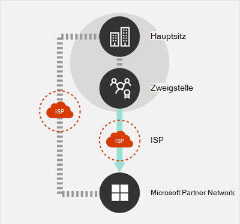
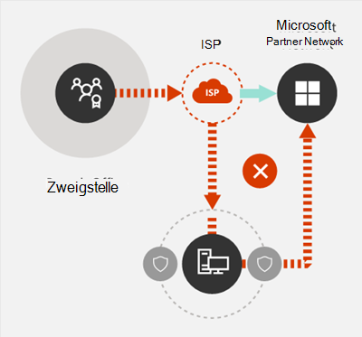

# Prinzipien von Microsoft 365-NetzwerkverbindungenMicrosoft 365 network connectivity principles

*Dieser Artikel gilt sowohl für Microsoft 365 Enterprise als auch für Office 365 Enterprise.**This article applies to both Microsoft 365 Enterprise and Office 365 Enterprise.*

Bevor Sie mit der Planung Ihres Netzwerks für die Microsoft 365-Netzwerkkonnektivität beginnen, ist es wichtig, dass Sie sich mit den Prinzipien von Verbindungen für die sichere Verwaltung von Microsoft 365-Datenverkehr und optimaler Leistung vertraut machen.Before you begin planning your network for Microsoft 365 network connectivity, it is important to understand the connectivity principles for securely managing Microsoft 365 traffic and getting the best possible performance. Dieser Artikel hilft Ihnen, die neuesten Hinweise für die sichere Optimierung der Microsoft 365-Netzwerkkonnektivität zu verstehen.This article will help you understand the most recent guidance for securely optimizing Microsoft 365 network connectivity.
  
Herkömmliche Unternehmensnetzwerke sind in erster Linie für den Zugriff von Benutzern auf Anwendungen und Daten ausgelegt, die in unternehmenseigenen Rechenzentren mit hoher Perimetersicherheit gehostet werden.Traditional enterprise networks are designed primarily to provide users access to applications and data hosted in company operated datacenters with strong perimeter security. Das herkömmliche Modell setzt voraus, dass Benutzer auf Anwendungen und Daten innerhalb des Perimeters des Unternehmensnetzwerks über WAN-Links von Zweigniederlassungen aus oder remote über VPN-Verbindungen zugreifen.The traditional model assumes that users will access applications and data from inside the corporate network perimeter, over WAN links from branch offices, or remotely over VPN connections.
  
Durch die Einführung von SaaS-Anwendungen wie Microsoft 365 wird eine Kombination aus Diensten und Daten aus dem Netzwerkperimeter heraus verlagert.Adoption of SaaS applications like Microsoft 365 moves some combination of services and data outside the network perimeter. Ohne Optimierung wird der Datenverkehr zwischen Benutzern und SaaS-Anwendungen durch Latenzen durch die Paketüberprüfung, Spitzkehren für Netzwerke, versehentliche Verbindungen zu geographisch entfernten Endpunkten und andere Faktoren beeinträchtigt.Without optimization, traffic between users and SaaS applications is subject to latency introduced by packet inspection, network hairpins, inadvertent connections to geographically distant endpoints and other factors. Sie können die optimale Leistung und Zuverlässigkeit von Microsoft 365 sicherstellen, wenn Sie die wichtigsten Optimierungsrichtlinien kennen und implementieren.You can ensure the best Microsoft 365 performance and reliability by understanding and implementing key optimization guidelines.
  
In diesem Artikel werden die folgenden Themen behandelt:In this article, you will learn about:
  
- [Microsoft 365-Architektur](microsoft-365-network-connectivity-principles.md#BKMK_Architecture) für die Kundenanbindung an die Cloud[Microsoft 365 architecture](microsoft-365-network-connectivity-principles.md#BKMK_Architecture) as it applies to customer connectivity to the cloud
- Aktualisierte [Prinzipien der Microsoft 365-Konnektivität](microsoft-365-network-connectivity-principles.md#BKMK_Principles) und Strategien zur Optimierung des Netzwerkverkehrs und der EndbenutzererfahrungUpdated [Microsoft 365 connectivity principles](microsoft-365-network-connectivity-principles.md#BKMK_Principles) and strategies for optimizing network traffic and the end-user experience
- Der [Office 365-Webdienst für Endpunkte](microsoft-365-network-connectivity-principles.md#BKMK_WebSvc), der es Netzwerkadministratoren ermöglicht, eine strukturierte Liste von Endpunkten für die Netzwerkoptimierung zu verwendenThe [Office 365 Endpoints web service](microsoft-365-network-connectivity-principles.md#BKMK_WebSvc), which allows network administrators to consume a structured list of endpoints for use in network optimization
- [Neue Office 365-Endpunktkategorien](microsoft-365-network-connectivity-principles.md#BKMK_Categories) und Optimierungshinweise[New Office 365 endpoint categories](microsoft-365-network-connectivity-principles.md#BKMK_Categories) and optimization guidance
- [Vergleichen der Sicherheit des Netzwerkperimeters mit der EndpunktsicherheitComparing network perimeter security with endpoint security](microsoft-365-network-connectivity-principles.md#BKMK_SecurityComparison)
- [Inkrementelle Optimierungsoptionen](microsoft-365-network-connectivity-principles.md#BKMK_IncOpt) für Microsoft 365-Datenverkehr[Incremental optimization](microsoft-365-network-connectivity-principles.md#BKMK_IncOpt) options for Microsoft 365 traffic
- Der [Microsoft 365-Konnektivitätstest](https://aka.ms/netonboard), ein neues Tool zum Testen der grundlegenden Konnektivität zu Microsoft 365The [Microsoft 365 connectivity test](https://aka.ms/netonboard), a new tool for testing basic connectivity to Microsoft 365

## Microsoft 365-ArchitekturMicrosoft 365 architecture

Microsoft 365 ist eine verteilte Software-as-a-Service (SaaS)-Cloud, die Produktivitäts-und Zusammenarbeitsszenarien über eine Vielzahl von Mikrodiensten und Anwendungen wie z. B. Exchange Online, SharePoint Online, Skype for Business Online, Microsoft Teams, Exchange Online Protection, Office im Browser und viele mehr bietet.Microsoft 365 is a distributed Software-as-a-Service (SaaS) cloud that provides productivity and collaboration scenarios through a diverse set of micro-services and applications, such as Exchange Online, SharePoint Online, Skype for Business Online, Microsoft Teams, Exchange Online Protection, Office in a browser, and many others. Auch wenn bestimmte Microsoft 365-Anwendungen über spezielle Funktionen für Kundennetzwerke und die Konnektivität zur Cloud verfügen können, teilen sie alle einige wichtige Prinzipien, Ziele und Architekturmuster.While specific Microsoft 365 applications may have their unique features as it applies to customer network and connectivity to the cloud, they all share some key principals, goals, and architecture patterns. Diese Prinzipien und Architekturmuster für die Konnektivität sind typisch für viele andere SaaS-Clouds und unterscheiden sich gleichzeitig von den typischen Bereitstellungsmodellen von Platform-as-a-Service- und Infrastructure-as-a-Service-Clouds wie Microsoft Azure.These principles and architecture patterns for connectivity are typical for many other SaaS clouds and at the same time being different from the typical deployment models of Platform-as-a-Service and Infrastructure-as-a-Service clouds, such as Microsoft Azure.
  
Eines der wichtigsten architektonischen Merkmale von Microsoft 365 (das von Netzwerkarchitekten häufig übersehen oder falsch interpretiert wird) besteht darin, dass es sich im Hinblick darauf, wie Benutzer eine Verbindung damit herstellen, um einen wirklich globalen verteilten Dienst handelt.One of the most significant architectural features of Microsoft 365 (that is often missed or misinterpreted by network architects) is that it is a truly global distributed service, in the context of how users connect to it. Der Standort des Microsoft 365-Zielmandanten ist wichtig, um zu verstehen, wo Kundendaten in der Cloud gespeichert sind. Der Benutzer muss bei Microsoft 365 aber keine direkte Verbindung zu Datenträgern herstellen, welche die Daten enthalten.The location of the target Microsoft 365 tenant is important to understand the locality of where customer data is stored within the cloud, but the user experience with Microsoft 365 doesn't involve connecting directly to disks containing the data. Die Benutzererfahrung bei Microsoft 365 (einschließlich Leistung, Zuverlässigkeit und anderer wichtiger Qualitätsmerkmale) bezieht sich auf die Konnektivität über hochgradig verteilte Dienst-Einstiegspunkte, die über Hunderte von Microsoft-Standorten weltweit skaliert werden.The user experience with Microsoft 365 (including performance, reliability, and other important quality characteristics) involves connectivity through highly distributed service front doors that are scaled out across hundreds of Microsoft locations worldwide. In den meisten Fällen wird eine optimale Benutzererfahrung dadurch erzielt, dass das Kundennetzwerk Benutzeranforderungen an den nächstgelegenen Microsoft 365-Dienst-Einstiegspunkt weiterleiten kann, anstatt eine Verbindung mit Microsoft 365 über einen Ausgangspunkt an einem zentralen Ort oder in einer Region herzustellen.In the majority of cases, the best user experience is achieved by allowing the customer network to route user requests to the closest Microsoft 365 service entry point, rather than connecting to Microsoft 365 through an egress point in a central location or region.
  
Bei den meisten Kunden sind Microsoft 365-Benutzer über viele Standorte verteilt.For most customers, Microsoft 365 users are distributed across many locations. Um die besten Ergebnisse zu erzielen, sollten die in diesem Dokument skizzierten Prinzipien vom Standpunkt der horizontalen Skalierung (nicht der vertikalen Skalierung) aus betrachtet werden. Dabei liegt der Schwerpunkt auf der Optimierung der Konnektivität zum nächstgelegenen Standort im globalen Microsoft-Netzwerk und nicht zum geografischen Standort des Microsoft 365-Mandanten.To achieve the best results, the principles outlined in this document should be looked at from the scale-out (not scale-up) point of view, focusing on optimizing connectivity to the nearest point of presence in the Microsoft Global Network, not to the geographic location of the Microsoft 365 tenant. Dies bedeutet im Grunde, dass die Microsoft 365-Erfahrung für diesen Mandanten weiterhin verteilt bleibt und sich in direkter Nähe zu jedem Endbenutzerstandort befinden kann, den der Mandant hat, auch wenn Microsoft 365-Mandatendaten möglicherweise an einem bestimmten geografischen Standort gespeichert werden.In essence, this means that even though Microsoft 365 tenant data may be stored in a specific geographic location, Microsoft 365 experience for that tenant remains distributed, and can be present in very close (network) proximity to every end-user location that the tenant has.
  
## Prinzipien der Microsoft 365-KonnektivitätMicrosoft 365 connectivity principles

Microsoft empfiehlt die folgenden Prinzipien, um eine optimale Konnektivität und Leistung von Microsoft 365 zu erzielen.Microsoft recommends the following principles to achieve optimal Microsoft 365 connectivity and performance. Verwenden Sie diese Prinzipien der Microsoft 365-Konnektivität, um den Datenverkehr zu verwalten und bei der Herstellung der Verbindung zu Microsoft 365 eine optimale Leistung zu erzielen.Use these Microsoft 365 connectivity principles to manage your traffic and get the best performance when connecting to Microsoft 365.
  
Das Hauptziel des Netzwerkdesigns sollte sein, die Latenz zu minimieren, indem die RTT (Round Trip Time) von Ihrem Netzwerk zum globalen Microsoft-Netzwerk minimiert wird, welches der öffentliche Netzwerkbackbone von Microsoft ist, der alle Microsoft-Rechenzentren mit geringer Latenz und weltweit verteilten Einstiegspunkten für Cloudanwendungen verbindet.The primary goal in the network design should be to minimize latency by reducing the round-trip time (RTT) from your network into the Microsoft Global Network, Microsoft's public network backbone that interconnects all of Microsoft's datacenters with low latency and cloud application entry points spread around the world. Erfahren Sie mehr über das globale Microsoft-Netzwerk unter [So erstellt Microsoft sein schnelles und zuverlässiges globales Netzwerk](https://azure.microsoft.com/blog/how-microsoft-builds-its-fast-and-reliable-global-network/).You can learn more about the Microsoft Global Network at [How Microsoft builds its fast and reliable global network](https://azure.microsoft.com/blog/how-microsoft-builds-its-fast-and-reliable-global-network/).
  

### Identifizieren und Unterscheiden von Microsoft 365-DatenverkehrIdentify and differentiate Microsoft 365 traffic

  
Die Identifizierung von Microsoft 365-Netzwerkdatenverkehr ist der erste Schritt, um den Datenverkehr vom allgemeinen Internet-Netzwerkdatenverkehr unterscheiden zu können.Identifying Microsoft 365 network traffic is the first step in being able to differentiate that traffic from generic Internet-bound network traffic. Die Microsoft 365-Konnektivität kann optimiert werden, indem eine Kombination von Ansätzen wie Netzwerk-Routing-Optimierung, Firewallregeln, Browser-Proxyeinstellungen und Umgehung von Netzwerküberprüfungsgeräten für bestimmte Endpunkte implementiert wird.Microsoft 365 connectivity can be optimized by implementing a combination of approaches like network route optimization, firewall rules, browser proxy settings, and bypass of network inspection devices for certain endpoints.
  
Im früheren Microsoft 365-Optimierungsleitfaden wurden Microsoft 365-Endpunkte in zwei Kategorien unterteilt: **Erforderlich** und **Optional**.Previous Microsoft 365 optimization guidance divided Microsoft 365 endpoints into two categories, **Required** and **Optional**. Nachdem Endpunkte zur Unterstützung neuer Microsoft 365-Dienste und -Features hinzugefügt wurden, haben wir die Microsoft 365-Endpunkte in drei Kategorien unterteilt: **Optimieren**, **Zulassen** und **Standard**.As endpoints have been added to support new Microsoft 365 services and features, we have reorganized Microsoft 365 endpoints into three categories: **Optimize**, **Allow**, and **Default**. Richtlinien für jede Kategorie gelten für alle Endpunkte in der Kategorie, wodurch Optimierungen einfacher zu verstehen und zu implementieren sind.Guidelines for each category applies to all endpoints in the category, making optimizations easier to understand and implement.
  
Weitere Informationen zu den Microsoft 365-Endpunktkategorien und Optimierungsmethoden finden Sie im Abschnitt [Neue Office 365-Endpunktkategorien](microsoft-365-network-connectivity-principles.md#BKMK_Categories).For more information on Microsoft 365 endpoint categories and optimization methods, see the [New Office 365 endpoint categories](microsoft-365-network-connectivity-principles.md#BKMK_Categories) section.
  
Microsoft veröffentlicht nun alle Microsoft 365-Endpunkte als Webdienst und bietet Anleitungen dazu, wie Sie diese Daten am besten verwenden können.Microsoft now publishes all Microsoft 365 endpoints as a web service and provides guidance on how best to use this data. Weitere Informationen zum Abrufen von und Arbeiten mit Microsoft 365-Endpunkten finden Sie im Artikel [Office 365-URLs und -IP-Adressbereiche](https://support.office.com/article/office-365-urls-and-ip-address-ranges-8548a211-3fe7-47cb-abb1-355ea5aa88a2?ui=en-US&amp;rs=en-US&amp;ad=US).For more information on how to fetch and work with Microsoft 365 endpoints, see the article [Office 365 URLs and IP address ranges](https://support.office.com/article/office-365-urls-and-ip-address-ranges-8548a211-3fe7-47cb-abb1-355ea5aa88a2?ui=en-US&amp;rs=en-US&amp;ad=US).
  

### Lokaler Ausgang von NetzwerkverbindungenEgress network connections locally

  
Lokaler DNS- und Internetausgang sind von entscheidender Bedeutung, um die Verbindungswartezeit zu verringern und sicherzustellen, dass Benutzerverbindungen zum nächstgelegenen Einstiegspunkt für Microsoft 365-Dienste vorgenommen werden.Local DNS and Internet egress is of critical importance for reducing connection latency and ensuring that user connections are made to the nearest point of entry to Microsoft 365 services. In einer komplexen Netzwerktopologie ist es wichtig, dass sowohl lokaler DNS- als auch lokaler Internetausgang zusammen implementiert werden.In a complex network topology, it is important to implement both local DNS and local Internet egress together. Weitere Informationen dazu, wie Clientverbindungen in Microsoft 365 zum nächstgelegenen Einstiegspunkt weitergeleitet werden, finden Sie im Artikel [Clientkonnektivität](https://support.office.com/article/client-connectivity-4232abcf-4ae5-43aa-bfa1-9a078a99c78b).For more information about how Microsoft 365 routes client connections to the nearest point of entry, see the article [Client Connectivity](https://support.office.com/article/client-connectivity-4232abcf-4ae5-43aa-bfa1-9a078a99c78b).
  
Vor der Einführung von Clouddiensten wie Microsoft 365 war die Internetkonnektivität für Endbenutzer als Gestaltungsfaktor in der Netzwerkarchitektur relativ einfach.Prior to the advent of cloud services such as Microsoft 365, end-user Internet connectivity as a design factor in network architecture was relatively simple. Wenn Internetdienste und Websites rund um den Globus verteilt sind, wird die Latenz zwischen den Ausgangspunkten des Unternehmens und einem bestimmten Zielendpunkt weitestgehend durch die geografische Entfernung bestimmt.When Internet services and web sites are distributed around the globe, latency between corporate egress points and any given destination endpoint is largely a function of geographical distance.
  
Bei einer herkömmlichen Netzwerkarchitektur durchlaufen alle ausgehenden Internetverbindungen das Unternehmensnetzwerk und gehen von einem zentralen Standort aus.In a traditional network architecture, all outbound Internet connections traverse the corporate network, and egress from a central location. Angesichts ausgereifterer Cloudprodukte von Microsoft ist eine verteilte, mit dem Internet verbundene Netzwerkarchitektur für die Unterstützung latenzsensibler Clouddienste wichtig geworden.As Microsoft's cloud offerings have matured, a distributed Internet-facing network architecture has become critical for supporting latency-sensitive cloud services. Das globale Microsoft-Netzwerk wurde so entwickelt, dass Latenzanforderungen mit der Infrastruktur verteilter Dienst-Front-Doors erfüllt werden. Dabei handelt es sich um eine dynamische Fabric globaler Einstiegspunkte, die eingehende Clouddienst-Verbindungen zum nächstgelegenen Einstiegspunkt weiterleitet.The Microsoft Global Network was designed to accommodate latency requirements with the Distributed Service Front Door infrastructure, a dynamic fabric of global entry points that routes incoming cloud service connections to the closest entry point. Damit soll die Länge der "letzten Meile" für Microsoft Cloud-Kunden reduziert werden, indem der Weg zwischen dem Kunden und der Cloud effektiv verkürzt wird.This is intended to reduce the length of the "last mile" for Microsoft cloud customers by effectively shortening the route between the customer and the cloud.
  
Unternehmens-WANs sind häufig so ausgelegt, dass Netzwerkdatenverkehr per Backhauling zur Überprüfung an eine Unternehmenszentrale zurückgeleitet wird, bevor er (in der Regel über einen oder mehrere Proxyserver) ins Internet geroutet wird.Enterprise WANs are often designed to backhaul network traffic to a central company head office for inspection before egress to the Internet, usually through one or more proxy servers. Die folgende Abbildung zeigt eine solche Netzwerktopologie.The diagram below illustrates such a network topology.
  

  
Da Microsoft 365 im globalen Microsoft-Netzwerk ausgeführt wird, das Front-End-Server weltweit umfasst, ist häufig ein Front-End-Server in der Nähe des Standorts des Benutzers vorhanden.Because Microsoft 365 runs on the Microsoft Global Network, which includes front-end servers around the world, there will often be a front-end server close to the user's location. Wenn Sie lokalen Internetausgang bereitstellen und interne DNS-Server zur Bereitstellung der lokalen Namensauflösung für Microsoft 365-Endpunkte konfigurieren, kann der für Microsoft 365 bestimmte Netzwerkdatenverkehr eine Verbindung zu den zum Benutzer nächstgelegenen Microsoft 365-Front-End-Servern herstellen.By providing local Internet egress and by configuring internal DNS servers to provide local name resolution for Microsoft 365 endpoints, network traffic destined for Microsoft 365 can connect to Microsoft 365 front end servers as close as possible to the user. Das nachstehende Diagramm zeigt ein Beispiel für eine Netzwerktopologie, die es Benutzern ermöglicht, die eine Verbindung von der Unternehmenszentrale, Zweigstellen und Remotestandorten aus herstellen, den kürzesten Weg zum nächstgelegenen Microsoft 365-Einstiegspunkt zu verwenden.The diagram below shows an example of a network topology that allows users connecting from main office, branch office, and remote locations to follow the shortest route to the closest Microsoft 365 entry point.
  

  
Eine derartige Verkürzung des Netzwerkpfads zu Microsoft 365-Einstiegspunkten kann die Konnektivitätsleistung und die Endbenutzererfahrung in Microsoft 365 verbessern und kann auch dazu beitragen, die Auswirkungen zukünftiger Änderungen an der Netzwerkarchitektur auf die Leistung und Zuverlässigkeit von Microsoft 365 zu verringern.Shortening the network path to Microsoft 365 entry points in this way can improve connectivity performance and the end-user experience in Microsoft 365, and can also help to reduce the impact of future changes to the network architecture on Microsoft 365 performance and reliability.
  
Außerdem können DNS-Anforderungen zu Wartezeiten führen, wenn sich der antwortende DNS-Server in weiter Entfernung befindet oder ausgelastet ist.Also, DNS requests can introduce latency if the responding DNS server is distant or busy. Sie können die Wartezeit bei Namensauflösungen minimieren, indem Sie lokale DNS-Server an Zweigstellen bereitstellen und sicherstellen, dass Sie so konfiguriert sind, dass DNS-Einträge entsprechend zwischengespeichert werden.You can minimize name resolution latency by provisioning local DNS servers in branch locations and making sure they are configured to cache DNS records appropriately.
  
Während sich regionale Ausgangspunkte zwar gut für Microsoft 365 eignen können, würde bei einem optimalen Konnektivitätsmodell immer ein Netzwerkausgang am Standort des Benutzers bereitgestellt, und zwar unabhängig davon, ob es sich um ein Unternehmensnetzwerk oder um Remotestandorte wie Home-Offices, Hotels, Cafés und Flughäfen handelt.While regional egress can work well for Microsoft 365, the optimum connectivity model would be to always provide network egress at the user's location, regardless of whether this is on the corporate network or remote locations such as homes, hotels, coffee shops, and airports. Dieses Modell mit lokalem direkten Ausgang ist in der nachstehenden Abbildung dargestellt.This local direct egress model is represented in the diagram below.
  

  
Unternehmen, die Microsoft 365 eingeführt haben, können die Architektur verteilter Dienst-Front-Doors des globalen Microsoft-Netzwerks nutzen, indem sie sicherstellen, dass Benutzerverbindungen zu Microsoft 365 den kürzestmöglichen Weg zum nächstgelegenen Einstiegspunkt des globalen Microsoft-Netzwerks verwenden.Enterprises who have adopted Microsoft 365 can take advantage of the Microsoft Global Network's Distributed Service Front Door architecture by ensuring that user connections to Microsoft 365 take the shortest possible route to the nearest Microsoft Global Network entry point. Bei einer Netzwerkarchitektur mit lokalem Ausgang lässt sich der Microsoft 365-Datenverkehr unabhängig vom Standort des Benutzers über den nächstgelegenen Ausgang leiten.The local egress network architecture does this by allowing Microsoft 365 traffic to be routed over the nearest egress, regardless of user location.
  
Die Architektur mit lokalem Ausgang bietet gegenüber dem herkömmlichen Modell folgende Vorteile:The local egress architecture has the following benefits over the traditional model:
  
- Bietet optimale Microsoft 365-Leistung durch optimale Routenlänge.Provides optimal Microsoft 365 performance by optimizing route length. Die Endbenutzerverbindungen werden durch die Infrastruktur verteilter Dienst-Front-Doors dynamisch an den nächstgelegenen Microsoft 365-Einstiegspunkt weitergeleitet.end-user connections are dynamically routed to the nearest Microsoft 365 entry point by the Distributed Service Front Door infrastructure.
- Verringert die Auslastung der Unternehmensnetzwerkinfrastruktur durch einen lokalen AusgangReduces the load on corporate network infrastructure by allowing local egress.
- Gewährleistet die Sicherheit von Verbindungen auf beiden Seiten durch Nutzung von Client-Endpunktsicherheits- und CloudsicherheitsfunktionenSecures connections on both ends by leveraging client endpoint security and cloud security features.

### Vermeiden von Spitzkehren für NetzwerkeAvoid network hairpins

  
Als Faustregel gilt: Die kürzeste und direkteste Route zwischen dem Benutzer und dem nächstgelegenen Microsoft 365-Endpunkt bietet die beste Leistung.As a general rule of thumb, the shortest, most direct route between user and closest Microsoft 365 endpoint will offer the best performance. Eine Netzwerk-Spitzkehre tritt auf, wenn WAN- oder VPN-Datenverkehr, der für ein bestimmtes Ziel bestimmt ist, zuerst zu einem anderen Zwischenstandort geleitet wird (z. B. Sicherheitsstack, Cloudzugriffs-Broker oder cloudbasiertes Web-Gateway), was zu Latenzen und einer möglichen Weiterleitung zu einem geografisch entfernten Endpunkt führt.A network hairpin happens when WAN or VPN traffic bound for a particular destination is first directed to another intermediate location (such as security stack, cloud access broker, of cloud-based web gateway), introducing latency and potential redirection to a geographically distant endpoint. Netzwerk-Spitzkehren können auch durch Ineffizienzen beim Routing/Peering oder durch nicht optimale (Remote-)DNS-Suchen verursacht werden.Network hairpins can also be caused by routing/peering inefficiencies or suboptimal (remote) DNS lookups.
  
Wenn Sie sicherstellen möchten, dass die Konnektivität zu Microsoft 365 auch bei einem lokalen Ausgang nicht durch Netzwerk-Spitzkehren beeinträchtigt wird, überprüfen Sie, ob der Internetdienstanbieter, der für die Bereitstellung des Internetausgangs für den Benutzerstandort verwendet wird, über eine direkte Peeringverbindung zum globalen Microsoft-Netzwerk in direkter Nähe zu diesem Standort verfügt.To ensure that Microsoft 365 connectivity is not subject to network hairpins even in the local egress case, check whether the ISP that is used to provide Internet egress for the user location has a direct peering relationship with the Microsoft Global Network in close proximity to that location. Sie sollten auch Ausgangsrouting konfigurieren, um vertrauenswürdigen Microsoft 365-Datenverkehr direkt zu senden, statt ihn über eine Drittanbieter-Cloud oder einen cloudbasierten Netzwerksicherheitsanbieter weiterzuleiten oder zu tunneln, der Ihren Internetdatenverkehr verarbeitet.You may also want to configure egress routing to send trusted Microsoft 365 traffic directly, as opposed to proxying or tunneling through a third-party cloud or cloud-based network security vendor that processes your Internet-bound traffic. Die lokale DNS-Namensauflösung von Microsoft 365-Endpunkten trägt dazu bei, dass für Benutzerverbindungen zusätzlich zum direkten Routing die nächstgelegenen Microsoft 365-Einstiegspunkte verwendet werden.Local DNS name resolution of Microsoft 365 endpoints helps to ensure that in addition to direct routing, the closest Microsoft 365 entry points are being used for user connections.
  
Wenn Sie cloudbasierte Netzwerk- oder Sicherheitsdienste für Microsoft 365-Datenverkehr verwenden, stellen Sie sicher, dass das Spitzkehrenergebnis ausgewertet und die Auswirkung auf die Microsoft 365-Leistung verstanden wird.If you use cloud-based network or security services for your Microsoft 365 traffic, ensure that the result of the hairpin is evaluated and its impact on Microsoft 365 performance is understood. Dazu müssen Sie die Anzahl und die Standorte von Dienstanbietern, über die der Datenverkehr weitergeleitet wird, im Verhältnis zur Anzahl Ihrer Zweigniederlassungen und den Peering-Punkten des globalen Microsoft-Netzwerks, die Qualität der Netzwerk-Peering-Beziehung des Dienstanbieters mit Ihrem Internetdienstanbieter und Microsoft sowie die Auswirkungen von Backhauling in der Infrastruktur des Dienstanbieters auf die Leistung überprüfen.This can be done by examining the number and locations of service provider locations through which the traffic is forwarded in relationship to number of your branch offices and Microsoft Global Network peering points, quality of the network peering relationship of the service provider with your ISP and Microsoft, and the performance impact of backhauling in the service provider infrastructure.
  
Aufgrund der hohen Anzahl verteilter Standorte bei Microsoft 365-Einstiegspunkten und deren Nähe zu Endbenutzern kann sich die Weiterleitung von Microsoft 365-Datenverkehr zu externen Netzwerk- oder Sicherheitsanbietern negativ auf Microsoft 365-Verbindungen auswirken, wenn das Anbieternetzwerk nicht für optimales Microsoft 365-Peering konfiguriert ist.Due to the large number of distributed locations with Microsoft 365 entry points and their proximity to end-users, routing Microsoft 365 traffic to any third-party network or security provider can have an adverse impact on Microsoft 365 connections if the provider network is not configured for optimal Microsoft 365 peering.
  

### Bewerten der Umgehung von Proxys, Geräten zur Datenverkehrsüberprüfung und doppelten SicherheitstechnologienAssess bypassing proxies, traffic inspection devices, and duplicate security technologies

  
Unternehmenskunden sollten ihre Netzwerksicherheits- und Risikosenkungsmethoden speziell für Microsoft 365-Datenverkehr überprüfen und die Sicherheitsfunktionen von Microsoft 365 verwenden, um ihre Abhängigkeit von stark eingreifenden, leistungssenkenden und teuren Netzwerksicherheitstechnologien für Microsoft 365-Netzwerkdatenverkehr zu verringern.Enterprise customers should review their network security and risk reduction methods specifically for Microsoft 365 bound traffic and use Microsoft 365 security features to reduce their reliance on intrusive, performance impacting, and expensive network security technologies for Microsoft 365 network traffic.
  
Die meisten Unternehmensnetzwerke erzwingen Netzwerksicherheit für Internetdatenverkehr mithilfe von Technologien wie Proxys, SSL-Prüfung, Paketüberprüfung und Systemen zur Verhinderung von Datenverlust.Most enterprise networks enforce network security for Internet traffic using technologies like proxies, SSL inspection, packet inspection, and data loss prevention systems. Diese Technologien mindern die Risiken für allgemeine Internetanforderungen, können aber die Leistung, Skalierbarkeit und die Qualität der Endbenutzererfahrung erheblich verringern, wenn sie auf Microsoft 365-Endpunkte angewendet werden.These technologies provide important risk mitigation for generic Internet requests but can dramatically reduce performance, scalability, and the quality of end user experience when applied to Microsoft 365 endpoints.
  

#### Office 365-Endpunkte-WebdienstOffice 365 Endpoints web service

Microsoft 365-Administratoren können ein Skript oder einen REST-Aufruf verwenden, um eine strukturierte Liste der Endpunkte vom Office 365-Endpunkte-Webdienst zu verwenden und die Konfigurationen von Umkreisfirewalls und anderen Netzwerkgeräten zu aktualisieren.Microsoft 365 administrators can use a script or REST call to consume a structured list of endpoints from the Office 365 Endpoints web service and update the configurations of perimeter firewalls and other network devices. Auf diese Weise wird sichergestellt, dass der Datenverkehr für Microsoft 365 erkannt, angemessen verarbeitet und anders verwaltet wird als Netzwerkdatenverkehr für generische und häufig unbekannte Internetwebsites.This will ensure that traffic bound for Microsoft 365 is identified, treated appropriately and managed differently from network traffic bound for generic and often unknown Internet web sites. Weitere Informationen zum Verwenden des Office 365-Endpunkte-Webdienstes finden Sie im Artikel [Office 365-URLs und -IP-Adressbereiche](https://support.office.com/article/office-365-urls-and-ip-address-ranges-8548a211-3fe7-47cb-abb1-355ea5aa88a2?ui=en-US&amp;rs=en-US&amp;ad=US).For more information on how to use the Office 365 Endpoints web service, see the article [Office 365 URLs and IP address ranges](https://support.office.com/article/office-365-urls-and-ip-address-ranges-8548a211-3fe7-47cb-abb1-355ea5aa88a2?ui=en-US&amp;rs=en-US&amp;ad=US).
  
#### PAC-Skripts (Proxy Automatic Configuration)PAC (Proxy Automatic Configuration) scripts

Microsoft 365-Administratoren können PAC-Skripts (Proxy Automatic Configuration) erstellen, die über WPAD oder GPO an Benutzercomputer übermittelt werden können.Microsoft 365 administrators can create PAC (Proxy Automatic Configuration) scripts that can be delivered to user computers via WPAD or GPO. PAC-Skripts können zum Umgehen von Proxys bei Microsoft 365-Anfragen von WAN-oder VPN-Benutzern verwendet werden, sodass der Microsoft 365-Datenverkehr direkte Internetverbindungen verwenden kann, anstatt das Unternehmensnetzwerk zu durchlaufen.PAC scripts can be used to bypass proxies for Microsoft 365 requests from WAN or VPN users, allowing Microsoft 365 traffic to use direct Internet connections rather than traversing the corporate network.
  
#### Microsoft 365-SicherheitsfunktionenMicrosoft 365 security features

Microsoft ist transparent hinsichtlich der Sicherheit der Rechenzentren, betrieblicher Sicherheit und Risikominimierung bei Microsoft 365-Servern und den Netzwerkendpunkten, die sie darstellen.Microsoft is transparent about datacenter security, operational security, and risk reduction around Microsoft 365 servers and the network endpoints that they represent. Die integrierten Sicherheitsfunktionen von Microsoft 365 stehen zur Verfügung, um Netzwerksicherheitsrisiken zu verringern, so etwa die Verhinderung von Datenverlust, Virenbekämpfung, mehrstufige Authentifizierung, Kunden-Lockbox, Defender für Office 365, Microsoft 365 Threat Intelligence, Microsoft 365 Sicherheitsbewertung, Exchange Online Protection und Netzwerk DDOS-Sicherheit.Microsoft 365 built-in security features are available for reducing network security risk, such as Data Loss Prevention, Anti-Virus, Multi-Factor Authentication, Customer Lock Box, Defender for Office 365, Microsoft 365 Threat Intelligence, Microsoft 365 Secure Score, Exchange Online Protection, and Network DDOS Security.
  
Weitere Informationen zur Sicherheit der Rechenzentren und des globalen Netzwerks von Microsoft finden Sie im [Microsoft Trust Center](https://www.microsoft.com/trustcenter/security).For more information on Microsoft datacenter and Global Network security, see the [Microsoft Trust Center](https://www.microsoft.com/trustcenter/security).
  
## Neue Office 365-EndpunktkategorienNew Office 365 endpoint categories

Office 365-Endpunkte stellen einen vielfältigen Satz von Netzwerkadressen und Subnetzen dar.Office 365 endpoints represent a varied set of network addresses and subnets. Endpunkte sind URLs, IP-Adressen oder IP-Bereiche und einige Endpunkte werden mit bestimmten TCP/UDP-Ports aufgelistet.Endpoints may be URLs, IP addresses or IP ranges, and some endpoints are listed with specific TCP/UDP ports. URLs können entweder ein FQDN wie *account.office.net* oder eine Platzhalter-URL wie *\*.office365.com* sein.URLs can either be an FQDN like *account.office.net*, or a wildcard URL like *\*.office365.com*.
  
> [!NOTE]
> Die Standorte von Office 365-Endpunkten im Netzwerk stehen nicht in direktem Zusammenhang mit dem Speicherort der Microsoft 365-Mandantendaten.The locations of Office 365 endpoints within the network are not directly related to the location of the Microsoft 365 tenant data. Aus diesem Grund sollten Kunden Microsoft 365 als einen verteilten und globalen Dienst betrachten und nicht versuchen, Netzwerkverbindungen zu Office 365-Endpunkten auf der Grundlage geographischer Kriterien zu blockieren.For this reason, customers should look at Microsoft 365 as a distributed and global service and should not attempt to block network connections to Office 365 endpoints based on geographical criteria.
  
In unserem früheren Leitfaden zur Verwaltung von Microsoft 365-Datenverkehr wurden Endpunkte in zwei Kategorien unterteilt: **Erforderlich** und **Optional**.In our previous guidance for managing Microsoft 365 traffic, endpoints were organized into two categories, **Required** and **Optional**. Endpunkte innerhalb jeder Kategorie erforderten je nach Kritikalität des Dienstes unterschiedliche Optimierungen und viele Kunden hatten Schwierigkeiten, die Anwendung derselben Netzwerkoptimierungen auf die gesamte Liste der Office 365-URLs und -IP-Adressen zu rechtfertigen.Endpoints within each category required different optimizations depending on the criticality of the service, and many customers faced challenges in justifying the application of the same network optimizations to the full list of Office 365 URLs and IP addresses.
  
Im neuen Modell werden die Endpunkte in drei Kategorien unterteilt **Optimieren**, **Zulassen** und **Standard**. So können Anstrengungen zur Netzwerkoptimierung prioritätsbasiert fokussiert werden, um Leistung und Rentabilität optimal zu verbessern.In the new model, endpoints are segregated into three categories, **Optimize**, **Allow**, and **Default**, providing a priority-based pivot on where to focus network optimization efforts to realize the best performance improvements and return on investment. Die Endpunkte werden in die oben aufgeführten Kategorien konsolidiert, basierend auf der Sensibilität der effektiven Benutzererfahrung hinsichtlich Netzwerkqualität, Volumen und Leistung von Szenarien und einfacher Implementierung.The endpoints are consolidated in the above categories based on the sensitivity of the effective user experience to network quality, volume, and performance envelope of scenarios and ease of implementation. Auf die gleiche Weise können empfohlene Optimierungen auf alle Endpunkte in der jeweiligen Kategorie angewendet werden.Recommended optimizations can be applied the same way to all endpoints in a given category.
  
- **Optimieren**: Endpunkte sind für Konnektivität zu jedem Office 365-Dienst erforderlich und machen über 75 % der Bandbreite, Verbindungen und Datenmenge von Office 365 aus.**Optimize** endpoints are required for connectivity to every Office 365 service and represent over 75% of Office 365 bandwidth, connections, and volume of data. Diese Endpunkte bilden Office 365-Szenarien ab, bei denen Netzwerkleistung, Latenz und Verfügbarkeit die höchste Priorität haben.These endpoints represent Office 365 scenarios that are the most sensitive to network performance, latency, and availability. Alle Endpunkte werden in Microsoft-Rechenzentren gehostet.All endpoints are hosted in Microsoft datacenters. Die Anzahl der Änderungen an den Endpunkten in dieser Kategorie wird voraussichtlich erheblich geringer sein als bei den Endpunkten in den anderen beiden Kategorien.The rate of change to the endpoints in this category is expected to be much lower than for the endpoints in the other two categories. Diese Kategorie enthält eine kleine Gruppe (in einer Größenordnung von ~ 10) von Schlüssel-URLs und eine definierte Gruppe von IP-Subnetzen, die den wichtigsten Office 365-Workloads wie Exchange Online, SharePoint Online, Skype for Business Online und Microsoft Teams zugeordnet sind.This category includes a small (on the order of ~10) set of key URLs and a defined set of IP subnets dedicated to core Office 365 workloads such as Exchange Online, SharePoint Online, Skype for Business Online, and Microsoft Teams.

    Eine komprimierte Liste mit gut definierten kritischen Endpunkten soll Ihnen helfen, hochwertige Netzwerkoptimierungen für diese Ziele schneller und einfacher zu planen und zu implementieren.A condensed list of well-defined critical endpoints should help you to plan and implement high value network optimizations for these destinations faster and easier.

    Beispiele für *Optimieren*-Endpunkte sind etwa *https://outlook.office365.com*, *https://\<tenant\>.sharepoint.com* und *https://\<tenant\>-my.sharepoint.com*.Examples of  *Optimize*  endpoints include *https://outlook.office365.com*, *https://\<tenant\>.sharepoint.com*, and *https://\<tenant\>-my.sharepoint.com*.

    Zu Optimierungsmethoden zählen folgende:Optimization methods include:

  - Umgehung von *Optimieren*-Endpunkten auf Netzwerkgeräten und Diensten, die Abfangen von Datenverkehr, SSL-Entschlüsselung, umfassende Paketüberprüfung und Inhaltsfilterung ausführen.Bypass  *Optimize*  endpoints on network devices and services that perform traffic interception, SSL decryption, deep packet inspection, and content filtering.
  - Umgehung von lokalen Proxy-Geräten und cloudbasierten Proxy-Diensten, die häufig für allgemeines Browsen im Internet verwendet werden.Bypass on-premises proxy devices and cloud-based proxy services commonly used for generic Internet browsing.
  - Priorisieren Sie die Auswertung dieser Endpunkte als vollständig vertrauenswürdig durch Ihre Netzwerkinfrastruktur und Perimetersysteme.Prioritize the evaluation of these endpoints as fully trusted by your network infrastructure and perimeter systems.
  - Priorisieren Sie die Reduktion oder Eliminierung von WAN-Backhauling und unterstützen Sie den direkten verteilten internetbasierten Ausgang für diese Endpunkte so nahe wie möglich zu Benutzern/Zweigstellen.Prioritize reduction or elimination of WAN backhauling, and facilitate direct distributed Internet-based egress for these endpoints as close to users/branch locations as possible.
  - Unterstützen Sie die direkte Konnektivität zu diesen Cloud-Endpunkten für VPN-Benutzer durch Implementierung getrennter Tunnel.Facilitate direct connectivity to these cloud endpoints for VPN users by implementing split tunneling.
  - Stellen Sie sicher, dass die durch die DNS-Namensauflösung zurückgegebenen IP-Adressen dem Routing-Ausgangspfad für diese Endpunkte entsprechen.Ensure that IP addresses returned by DNS name resolution match the routing egress path for these endpoints.
  - Priorisieren Sie diese Endpunkte für die SD-WAN-Integration für direktes Routing mit minimaler Latenz in den nächstgelegenen Internet-Peering-Punkt des globalen Microsoft-Netzwerks.Prioritize these endpoints for SD-WAN integration for direct, minimal latency routing into the nearest Internet peering point of the Microsoft global network.

- **Zulassen**: Endpunkte sind für die Konnektivität zu speziellen Microsoft 365-Diensten und -Funktionen erforderlich, sind jedoch in Bezug auf Leistung und Latenz im Netzwerk nicht so sensibel sind wie diejenigen in der Kategorie *Optimieren*.**Allow** endpoints are required for connectivity to specific Office 365 services and features, but are not as sensitive to network performance and latency as those in the *Optimize* category. Die gesamten Netzwerkanforderungen dieser Endpunkte im Hinblick auf Bandbreite und Verbindungsanzahl sind ebenfalls geringer.The overall network footprint of these endpoints from the standpoint of bandwidth and connection count is also smaller. Diese Endpunkte sind Office 365 zugeordnet und werden in Microsoft-Rechenzentren gehostet.These endpoints are dedicated to Office 365 and are hosted in Microsoft datacenters. Sie stellen eine breite Palette von Office 365-Mikrodiensten und deren Abhängigkeiten (von ~ 100-URLs) dar und es ist davon auszugehen, dass sie eine höhere Änderungsrate als diejenigen in der Kategorie *Optimieren* aufweisen.They represent a broad set of Office 365 micro-services and their dependencies (on the order of ~100 URLs) and are expected to change at a higher rate than those in the  *Optimize*  category. Nicht alle Endpunkte in dieser Kategorie sind definierten dedizierten IP-Subnetzen zugeordnet.Not all endpoints in this category are associated with defined dedicated IP subnets.

    Netzwerkoptimierungen für *Zulassen*-Endpunkte können das Office 365-Benutzererlebnis verbessern, aber einige Kunden entscheiden sich möglicherweise dazu, diese Optimierungen enger einzugrenzen, um Änderungen am Netzwerk möglichst gering zu halten.Network optimizations for  *Allow*  endpoints can improve the Office 365 user experience, but some customers may choose to scope those optimizations more narrowly to minimize changes to their network.

    Beispiele für *Zulassen*-Endpunkte sind etwa *https://\*.protection.outlook.com* und *https://accounts.accesscontrol.windows.net*.Examples of *Allow* endpoints include *https://\*.protection.outlook.com* and *https://accounts.accesscontrol.windows.net*.

    Zu Optimierungsmethoden zählen folgende:Optimization methods include:

  - Umgehung von *Zulassen*-Endpunkten auf Netzwerkgeräten und Diensten, die Abfangen von Datenverkehr, SSL-Entschlüsselung, umfassende Paketüberprüfung und Inhaltsfilterung ausführen.Bypass *Allow*  endpoints on network devices and services that perform traffic interception, SSL decryption, deep packet inspection, and content filtering.
  - Priorisieren Sie die Auswertung dieser Endpunkte als vollständig vertrauenswürdig durch Ihre Netzwerkinfrastruktur und Perimetersysteme.Prioritize the evaluation of these endpoints as fully trusted by your network infrastructure and perimeter systems.
  - Priorisieren Sie die Reduktion oder Eliminierung von WAN-Backhauling und unterstützen Sie den direkten verteilten internetbasierten Ausgang für diese Endpunkte so nahe wie möglich zu Benutzern/Zweigstellen.Prioritize reduction or elimination of WAN backhauling, and facilitate direct distributed Internet-based egress for these endpoints as close to users/branch locations as possible.
  - Stellen Sie sicher, dass die durch die DNS-Namensauflösung zurückgegebenen IP-Adressen dem Routing-Ausgangspfad für diese Endpunkte entsprechen.Ensure that IP addresses returned by DNS name resolution match the routing egress path for these endpoints.
  - Priorisieren Sie diese Endpunkte für die SD-WAN-Integration für direktes Routing mit minimaler Latenz in den nächstgelegenen Internet-Peering-Punkt des globalen Microsoft-Netzwerks.Prioritize these endpoints for SD-WAN integration for direct, minimal latency routing into the nearest Internet peering point of the Microsoft global network.

- **Standard**-Endpunkte stellen Office 365-Dienste und Abhängigkeiten dar, die keine Optimierung erfordern und von Kundennetzwerken als normaler Internetdatenverkehr behandelt werden können.**Default** endpoints represent Office 365 services and dependencies that do not require any optimization, and can be treated by customer networks as normal Internet bound traffic. Einige der Endpunkte in dieser Kategorie möglicherweise nicht in Microsoft-Rechenzentren gehostet werden.Some endpoints in this category may not be hosted in Microsoft datacenters. Beispiele sind *https://odc.officeapps.live.com* und *https://appexsin.stb.s-msn.com*.Examples include  *https://odc.officeapps.live.com*  and  *https://appexsin.stb.s-msn.com*.

Weitere Informationen zu den Verfahren zur Office 365-Netzwerkoptimierung finden Sie im Artikel [Verwalten von Office 365-Endpunkten](managing-office-365-endpoints.md).For more information about Office 365 network optimization techniques, see the article [Managing Office 365 endpoints](managing-office-365-endpoints.md).
  
## Vergleichen der Sicherheit des Netzwerkperimeters mit der EndpunktsicherheitComparing network perimeter security with endpoint security

Das Ziel der herkömmlichen Netzwerksicherheit ist die Absicherung des Unternehmensnetzwerkperimeters gegen Eindringversuche und böswillige Angriffe.The goal of traditional network security is to harden the corporate network perimeter against intrusion and malicious exploits. Wenn Organisationen Microsoft 365 einführen, werden einige Netzwerkdienste und -daten teilweise oder vollständig in die Cloud migriert.As organizations adopt Microsoft 365, some network services and data are partly or completely migrated to the cloud. Wie bei allen grundlegenden Änderungen an der Netzwerkarchitektur erfordert dieser Vorgang eine Neubewertung der Netzwerksicherheit, die neue Faktoren berücksichtigt:As for any fundamental change to network architecture, this process requires a reevaluation of network security that takes emerging factors into account:
  
- Wenn Clouddienste eingeführt werden, werden Netzwerkdienste und -daten zwischen lokalen Rechenzentren und der Cloud verteilt und der Perimeterschutz allein ist nicht mehr ausreichend.As cloud services are adopted, network services and data are distributed between on-premises datacenters and the cloud, and perimeter security is no longer adequate on its own.
- Remotebenutzer stellen zu Unternehmensressourcen sowohl in lokalen Rechenzentren als auch in der Cloud von unkontrollierten Standorten wie Home-Offices, Hotels und Cafés aus eine Verbindung her.Remote users connect to corporate resources both in on-premises datacenters and in the cloud from uncontrolled locations such as homes, hotels, and coffee shops.
- Speziell entwickelte Sicherheitsfeatures werden zunehmend in Clouddienste integriert und können vorhandene Sicherheitssysteme ergänzen oder ersetzen.Purpose-built security features are increasingly built into cloud services and can potentially supplement or replace existing security systems.

Microsoft bietet eine breite Palette an Microsoft 365-Sicherheitsfunktionen und Anleitungen für die Verwendung bewährter Sicherheitsmethoden, mit denen Sie Daten- und Netzwerksicherheit für Microsoft 365 sicherstellen können.Microsoft offers a wide range of Microsoft 365 security features and provides prescriptive guidance for employing security best practices that can help you to ensure data and network security for Microsoft 365. Empfohlene bewährte Methoden umfassen die folgenden:Recommended best practices include the following:
  
- **Verwenden Sie mehrstufige Authentifizierung (MFA)** MFA fügt eine zusätzliche Schutzebene zu einer Strategie mit sicherem Kennwort hinzu, indem Benutzer nach der korrekten Eingabe des Kennworts einen Telefonanruf, eine Textnachricht oder eine App-Benachrichtigung auf ihrem Smartphone bestätigen müssen.**Use multi-factor authentication (MFA)** MFA adds an additional layer of protection to a strong password strategy by requiring users to acknowledge a phone call, text message, or an app notification on their smart phone after correctly entering their password.

- **Verwenden Sie Microsoft Cloud App Security** Konfigurieren Sie Richtlinien zum Nachverfolgen anomaler Aktivitäten und zum Umgang mit diesen ein.**Use Microsoft Cloud App Security** Configure policies to track anomalous activity and act on it. Richten Sie Benachrichtigungen mit Microsoft Cloud App Security ein, damit Administratoren ungewöhnliche oder riskante Benutzeraktivitäten, z. B. das Herunterladen großer Datenmengen, mehrere gescheiterte Anmeldeversuche oder Verbindungen von unbekannten oder gefährlichen IP-Adressen aus, überprüfen können.Set up alerts with Microsoft Cloud App Security so that admins can review unusual or risky user activity, such as downloading large amounts of data, multiple failed sign-in attempts, or connections from a unknown or dangerous IP addresses.

- **Konfigurieren Sie die Verhinderung von Datenverlust (DLP)** DLP ermöglicht es Ihnen, vertrauliche Daten zu erkennen und Richtlinien zu erstellen, durch die verhindert wird, dass Ihre Benutzer die Daten versehentlich oder absichtlich freigeben.**Configure Data Loss Prevention (DLP)** DLP allows you to identify sensitive data and create policies that help prevent your users from accidentally or intentionally sharing the data. DLP funktioniert übergreifend in Microsoft 365, einschließlich Exchange Online, SharePoint Online und OneDrive, damit Compliance durch die Benutzer ohne Unterbrechung ihres Arbeitsflusses gewährleistet ist.DLP works across Microsoft 365 including Exchange Online, SharePoint Online, and OneDrive so that your users can stay compliant without interrupting their workflow.

- **Verwenden Sie Kunden-Lockbox** Als Microsoft 365-Administrator können Sie Kunden-Lockbox verwenden, um zu steuern, wie ein Microsoft-Supporttechniker während einer Hilfesitzung auf Ihre Daten zugreift.**Use Customer Lockbox** As a Microsoft 365 admin, you can use Customer Lockbox to control how a Microsoft support engineer accesses your data during a help session. In Fällen, in denen der Techniker zur Erkennung und Behebung eines Problems Zugriff auf Ihre Daten benötigt, ermöglicht Ihnen Kunden Lockbox, die Zugriffsanfrage zu genehmigen oder abzulehnen.In cases where the engineer requires access to your data to troubleshoot and fix an issue, Customer Lockbox allows you to approve or reject the access request.

- **Verwenden Sie Office 365 Secure Score** Ein Sicherheitsanalysetool, das Empfehlungen zur weiteren Risikoreduzierung gibt.**Use Office 365 Secure Score** A security analytics tool that recommends what you can do to further reduce risk. Secure Score überprüft Ihre Einstellungen und Aktivitäten in Microsoft 365 und vergleicht diese mit einer von Microsoft aufgestellten Basislinie.Secure Score looks at your Microsoft 365 settings and activities and compares them to a baseline established by Microsoft. Anschließend erhalten Sie eine Bewertung basierend auf Ihrer Anwendung der bewährten Methoden für die Wahrung der Sicherheit.You'll get a score based on how aligned you are with best security practices.

Ein ganzheitlicher Ansatz zur Verbesserung der Sicherheit sollte folgende Aspekte berücksichtigen:A holistic approach to enhanced security should include consideration of the following:
  
- Verlagern Sie den Schwerpunkt vom Perimeterschutz auf die Endpunktsicherheit, indem Sie cloudbasierte und Office-Client-basierte Sicherheitsfunktionen anwenden.Shift emphasis from perimeter security towards endpoint security by applying cloud-based and Office client security features.
  - Verkleinern Sie den Sicherheitsperimeter auf das RechenzentrumShrink the security perimeter to the datacenter
  - Aktivieren Sie eine gleichwertige Vertrauensstellung für Benutzergeräte innerhalb des Büros oder an RemotestandortenEnable equivalent trust for user devices inside the office or at remote locations
  - Legen Sie den Fokus auf die Absicherung des Datenspeicherorts und des BenutzerstandortsFocus on securing the data location and the user location
  - Verwaltete Benutzercomputer haben eine höhere VertrauensstellungManaged user machines have higher trust with endpoint security
- Ganzheitliche Verwaltung aller Informationssicherheitsdaten, keine reine Fokussierung auf den PerimeterManage all information security holistically, not focusing solely on the perimeter
  - Definieren Sie das WAN neu und bauen Sie Perimeternetzwerksicherheit auf, indem Sie vertrauenswürdigem Datenverkehr erlauben, Sicherheitsgeräte zu umgehen, und für nicht verwaltete Geräte WLAN-Gastnetzwerke schaffenRedefine WAN and building perimeter network security by allowing trusted traffic to bypass security devices and separating unmanaged devices to guest Wi-Fi networks
  - Reduzierung der Netzwerksicherheitsanforderungen des WAN-UnternehmensrandsReduce network security requirements of the corporate WAN edge
  - Einige Geräte für den Netzwerkperimeterschutz wie Firewalls sind weiterhin erforderlich, aber die Auslastung wird reduziert.Some network perimeter security devices such as firewalls are still required, but load is decreased
  - Stellt lokalen Ausgangspunkt für Microsoft 365-Datenverkehr sicherEnsures local egress for Microsoft 365 traffic
- Verbesserungen können inkrementell umgesetzt werden, wie im Abschnitt [Inkrementelle Optimierung](microsoft-365-network-connectivity-principles.md#BKMK_IncOpt) beschrieben.Improvements can be addressed incrementally as described in the [Incremental optimization](microsoft-365-network-connectivity-principles.md#BKMK_IncOpt) section. Einige Optimierungstechniken bieten je nach Netzwerkarchitektur möglicherweise ein besseres Preis-Leistungs-Verhältnis. Wählen Sie die Optimierungen aus, die für Ihre Organisation am besten geeignet sind.Some optimization techniques may offer better cost/benefit ratios depending on your network architecture, and you should choose optimizations that make the most sense for your organization.

Weitere Informationen zu Microsoft 365 Security und Compliance finden Sie im Artikel [Microsoft 365 Security](https://docs.microsoft.com/microsoft-365/security) und [Microsoft 365 Compliance](https://docs.microsoft.com/microsoft-365/compliance).For more information on Microsoft 365 security and compliance, see the articles [Microsoft 365 security](https://docs.microsoft.com/microsoft-365/security) and [Microsoft 365 compliance](https://docs.microsoft.com/microsoft-365/compliance).
  
## Schrittweise OptimierungIncremental optimization

Wir haben weiter oben in diesem Artikel das ideale Netzwerkverbindungsmodell für SaaS vorgestellt, aber vielen großen Organisationen mit historisch komplexen Netzwerkarchitekturen wird es nicht möglich sein, alle diese Änderungen direkt durchzuführen.We have represented the ideal network connectivity model for SaaS earlier in this article, but for many large organizations with historically complex network architectures, it will not be practical to directly make all of these changes. In diesem Abschnitt befassen wir uns mit einer Reihe von inkrementellen Änderungen zur Verbesserung der Leistung und Zuverlässigkeit von Microsoft 365.In this section, we discuss a number of incremental changes that can help to improve Microsoft 365 performance and reliability.
  
Die Methoden zum Optimieren von Microsoft 365-Datenverkehr variieren je nach Netzwerktopologie und den von Ihnen implementierten Netzwerkgeräten.The methods you will use to optimize Microsoft 365 traffic will vary depending on your network topology and the network devices you have implemented. Große Unternehmen mit vielen Standorten und komplexen Netzwerksicherheitspraktiken müssen eine Strategie entwickeln, welche die meisten oder alle Grundsätze umfasst, die im Abschnitt [Prinzipien der Microsoft 365-Konnektivität](microsoft-365-network-connectivity-principles.md#BKMK_Principles) aufgelistet sind, während kleinere Organisationen möglicherweise nur ein oder zwei Prinzipien berücksichtigen müssen.Large enterprises with many locations and complex network security practices will need to develop a strategy that includes most or all of the principles listed in the [Microsoft 365 connectivity principles](microsoft-365-network-connectivity-principles.md#BKMK_Principles) section, while smaller organizations might only need to consider one or two.
  
Sie können die Optimierung als inkrementellen Vorgang angehen und die jeweiligen Methoden nacheinander anwenden.You can approach optimization as an incremental process, applying each method successively. In der folgenden Tabelle sind die wichtigsten Optimierungsmethoden danach aufgeführt, wie stark sie sich bei den meisten Benutzern auf Latenz und Zuverlässigkeit auswirken.The following table lists key optimization methods in order of their impact on latency and reliability for the largest number of users.
  
|**Optimierungsmethode****Optimization method**|**Beschreibung****Description**|**Auswirkung****Impact**|
|:-----|:-----|:-----|
|Lokale DNS-Auflösung und InternetausgangLocal DNS resolution and Internet egress    |Stellen Sie lokale DNS-Server an jedem Standort bereit und stellen Sie sicher, dass Microsoft 365-Verbindungen so nah wie möglich am Standort des Benutzers ins Internet geroutet werden.Provision local DNS servers in each location and ensure that Microsoft 365 connections egress to the Internet as close as possible to the user's location.    | Latenzen minimierenMinimize latency     Zuverlässige Konnektivität zum nächstgelegenen Microsoft 365-Einstiegspunkt verbessernImprove reliable connectivity to the closest Microsoft 365 entry point    |
|Regionale Ausgangspunkte hinzufügenAdd regional egress points    |Wenn Ihr Unternehmensnetzwerk mehrere Standorte umfasst, aber nur einen Ausgangspunkt aufweist, fügen Sie regionale Ausgangspunkte hinzu, damit Benutzer eine Verbindung zum nächstgelegenen Microsoft 365-Einstiegspunkt herstellen können.If your corporate network has multiple locations but only one egress point, add regional egress points to enable users to connect to the closest Microsoft 365 entry point.    | Latenzen minimierenMinimize latency     Zuverlässige Konnektivität zum nächstgelegenen Microsoft 365-Einstiegspunkt verbessernImprove reliable connectivity to the closest Microsoft 365 entry point    |
|Proxys und Überprüfungsgeräte umgehenBypass proxies and inspection devices    |Konfigurieren Sie Browser mit PAC-Dateien, die Microsoft 365-Anforderungen direkt an Ausgangspunkte senden.Configure browsers with PAC files that send Microsoft 365 requests directly to egress points.    Konfigurieren Sie Edge-Router und Firewalls zum Zulassen von Microsoft 365-Datenverkehr ohne Überprüfung.Configure edge routers and firewalls to permit Microsoft 365 traffic without inspection.    | Latenzen minimierenMinimize latency     Auslastung von Netzwerkgeräten reduzierenReduce load on network devices    |
|Direkte Verbindung für VPN-Benutzer aktivierenEnable direct connection for VPN users    |Aktivieren Sie für VPN-Benutzer Microsoft 365-Verbindungen, um eine direkte Verbindung vom Netzwerk des Benutzers aus anstatt über den VPN-Tunnel herzustellen, indem Sie getrennte Tunnel implementieren.For VPN users, enable Microsoft 365 connections to connect directly from the user's network rather than over the VPN tunnel by implementing split tunneling.    | Latenzen minimierenMinimize latency     Zuverlässige Konnektivität zum nächstgelegenen Microsoft 365-Einstiegspunkt verbessernImprove reliable connectivity to the closest Microsoft 365 entry point    |
|Migrieren vom herkömmlichen WAN zu SD-WANMigrate from traditional WAN to SD-WAN    |SD-WANs (Software Defined Wide Area Networks) vereinfachen die WAN-Verwaltung und verbessern die Leistung, da herkömmliche WAN-Router durch virtuelle Geräte ersetzt werden, ähnlich wie bei der Virtualisierung von Computerressourcen mit virtuellen Maschinen (VMs).SD-WANs (Software Defined Wide Area Networks) simplify WAN management and improve performance by replacing traditional WAN routers with virtual appliances, similar to the virtualization of compute resources using virtual machines (VMs).    | Verbessern der Leistung und Verwaltbarkeit von WAN-DatenverkehrImprove performance and manageability of WAN traffic     Auslastung von Netzwerkgeräten reduzierenReduce load on network devices    |

## Verwandte ThemenRelated topics

[Microsoft 365 – Überblick über die NetzwerkkonnektivitätMicrosoft 365 Network Connectivity Overview](microsoft-365-networking-overview.md)

[Verwalten von Office 365-EndpunktenManaging Office 365 endpoints](managing-office-365-endpoints.md)

[URLs und IP-Adressbereiche für Office 365Office 365 URLs and IP address ranges](urls-and-ip-address-ranges.md)

[Office 365 – IP-Adress- und URL-WebdienstOffice 365 IP Address and URL Web service](microsoft-365-ip-web-service.md)

[Bewerten der Microsoft 365-NetzwerkkonnektivitätAssessing Microsoft 365 network connectivity](assessing-network-connectivity.md)

[Netzwerkplanung und Leistungsoptimierung für Microsoft 365Network planning and performance tuning for Microsoft 365](network-planning-and-performance.md)

[Office 365-Leistungsoptimierung mit Basisplänen und LeistungsverlaufOffice 365 performance tuning using baselines and performance history](performance-tuning-using-baselines-and-history.md)

[Plan zur Problembehandlung für Office 365Performance troubleshooting plan for Office 365](performance-troubleshooting-plan.md)

[Netzwerke für die InhaltsübermittlungContent Delivery Networks](content-delivery-networks.md)

[Microsoft 365-KonnektivitätstestMicrosoft 365 connectivity test](https://aka.ms/netonboard)

[So erstellt Microsoft sein schnelles und zuverlässiges globales NetzwerkHow Microsoft builds its fast and reliable global network](https://azure.microsoft.com/blog/how-microsoft-builds-its-fast-and-reliable-global-network/)

[Office 365-Networking-BlogOffice 365 Networking blog](https://techcommunity.microsoft.com/t5/Office-365-Networking/bd-p/Office365Networking)
