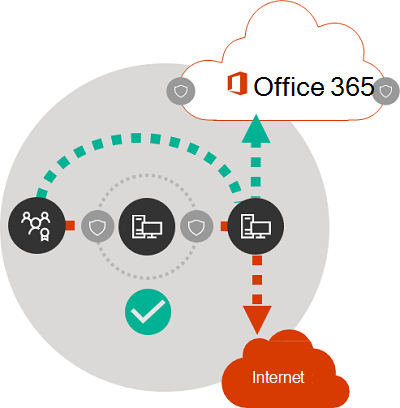

# Prinzipien von Microsoft 365-Netzwerkverbindungen

*Dieser Artikel gilt sowohl für Microsoft 365 Enterprise als auch für Office 365 Enterprise.*

Bevor Sie mit der Planung Ihres Netzwerks für die Microsoft 365-Netzwerkkonnektivität beginnen, ist es wichtig, dass Sie sich mit den Prinzipien von Verbindungen für die sichere Verwaltung von Microsoft 365-Datenverkehr und optimaler Leistung vertraut machen. Dieser Artikel hilft Ihnen, die neuesten Hinweise für die sichere Optimierung der Microsoft 365-Netzwerkkonnektivität zu verstehen.
  
Herkömmliche Unternehmensnetzwerke sind in erster Linie für den Zugriff von Benutzern auf Anwendungen und Daten ausgelegt, die in unternehmenseigenen Rechenzentren mit hoher Perimetersicherheit gehostet werden. Das herkömmliche Modell setzt voraus, dass Benutzer auf Anwendungen und Daten innerhalb des Perimeters des Unternehmensnetzwerks über WAN-Links von Zweigniederlassungen aus oder remote über VPN-Verbindungen zugreifen.
  
Durch die Einführung von SaaS-Anwendungen wie Microsoft 365 wird eine Kombination aus Diensten und Daten aus dem Netzwerkperimeter heraus verlagert. Ohne Optimierung wird der Datenverkehr zwischen Benutzern und SaaS-Anwendungen durch Latenzen durch die Paketüberprüfung, Spitzkehren für Netzwerke, versehentliche Verbindungen zu geographisch entfernten Endpunkten und andere Faktoren beeinträchtigt. Sie können die optimale Leistung und Zuverlässigkeit von Microsoft 365 sicherstellen, wenn Sie die wichtigsten Optimierungsrichtlinien kennen und implementieren.
  
In diesem Artikel werden die folgenden Themen behandelt:
  
- [Microsoft 365-Architektur](microsoft-365-network-connectivity-principles.md#BKMK_Architecture) für die Kundenanbindung an die Cloud
- Aktualisierte [Prinzipien der Microsoft 365-Konnektivität](microsoft-365-network-connectivity-principles.md#BKMK_Principles) und Strategien zur Optimierung des Netzwerkverkehrs und der Endbenutzererfahrung
- Der [Office 365-Webdienst für Endpunkte](microsoft-365-network-connectivity-principles.md#BKMK_WebSvc), der es Netzwerkadministratoren ermöglicht, eine strukturierte Liste von Endpunkten für die Netzwerkoptimierung zu verwenden
- [Neue Office 365-Endpunktkategorien](microsoft-365-network-connectivity-principles.md#BKMK_Categories) und Optimierungshinweise
- [Vergleichen der Sicherheit des Netzwerkperimeters mit der Endpunktsicherheit](microsoft-365-network-connectivity-principles.md#BKMK_SecurityComparison)
- [Inkrementelle Optimierungsoptionen](microsoft-365-network-connectivity-principles.md#BKMK_IncOpt) für Microsoft 365-Datenverkehr
- Der [Microsoft 365-Konnektivitätstest](https://aka.ms/netonboard), ein neues Tool zum Testen der grundlegenden Konnektivität zu Microsoft 365

## Microsoft 365-Architektur

Microsoft 365 ist eine verteilte Software-as-a-Service (SaaS)-Cloud, die Produktivitäts-und Zusammenarbeitsszenarien über eine Vielzahl von Mikrodiensten und Anwendungen wie z. B. Exchange Online, SharePoint Online, Skype for Business Online, Microsoft Teams, Exchange Online Protection, Office im Browser und viele mehr bietet. Auch wenn bestimmte Microsoft 365-Anwendungen über spezielle Funktionen für Kundennetzwerke und die Konnektivität zur Cloud verfügen können, teilen sie alle einige wichtige Prinzipien, Ziele und Architekturmuster. Diese Prinzipien und Architekturmuster für die Konnektivität sind typisch für viele andere SaaS-Clouds und unterscheiden sich gleichzeitig von den typischen Bereitstellungsmodellen von Platform-as-a-Service- und Infrastructure-as-a-Service-Clouds wie Microsoft Azure.
  
Eines der wichtigsten architektonischen Merkmale von Microsoft 365 (das von Netzwerkarchitekten häufig übersehen oder falsch interpretiert wird) besteht darin, dass es sich im Hinblick darauf, wie Benutzer eine Verbindung damit herstellen, um einen wirklich globalen verteilten Dienst handelt. Der Standort des Microsoft 365-Zielmandanten ist wichtig, um zu verstehen, wo Kundendaten in der Cloud gespeichert sind. Der Benutzer muss bei Microsoft 365 aber keine direkte Verbindung zu Datenträgern herstellen, welche die Daten enthalten. Die Benutzererfahrung bei Microsoft 365 (einschließlich Leistung, Zuverlässigkeit und anderer wichtiger Qualitätsmerkmale) bezieht sich auf die Konnektivität über hochgradig verteilte Dienst-Einstiegspunkte, die über Hunderte von Microsoft-Standorten weltweit skaliert werden. In den meisten Fällen wird eine optimale Benutzererfahrung dadurch erzielt, dass das Kundennetzwerk Benutzeranforderungen an den nächstgelegenen Microsoft 365-Dienst-Einstiegspunkt weiterleiten kann, anstatt eine Verbindung mit Microsoft 365 über einen Ausgangspunkt an einem zentralen Ort oder in einer Region herzustellen.
  
Bei den meisten Kunden sind Microsoft 365-Benutzer über viele Standorte verteilt. Um die besten Ergebnisse zu erzielen, sollten die in diesem Dokument skizzierten Prinzipien vom Standpunkt der horizontalen Skalierung (nicht der vertikalen Skalierung) aus betrachtet werden. Dabei liegt der Schwerpunkt auf der Optimierung der Konnektivität zum nächstgelegenen Standort im globalen Microsoft-Netzwerk und nicht zum geografischen Standort des Microsoft 365-Mandanten. Dies bedeutet im Grunde, dass die Microsoft 365-Erfahrung für diesen Mandanten weiterhin verteilt bleibt und sich in direkter Nähe zu jedem Endbenutzerstandort befinden kann, den der Mandant hat, auch wenn Microsoft 365-Mandatendaten möglicherweise an einem bestimmten geografischen Standort gespeichert werden.
  
## Prinzipien der Microsoft 365-Konnektivität

Microsoft empfiehlt die folgenden Prinzipien, um eine optimale Konnektivität und Leistung von Microsoft 365 zu erzielen. Verwenden Sie diese Prinzipien der Microsoft 365-Konnektivität, um den Datenverkehr zu verwalten und bei der Herstellung der Verbindung zu Microsoft 365 eine optimale Leistung zu erzielen.
  
Das Hauptziel des Netzwerkdesigns sollte sein, die Latenz zu minimieren, indem die RTT (Round Trip Time) von Ihrem Netzwerk zum globalen Microsoft-Netzwerk minimiert wird, welches der öffentliche Netzwerkbackbone von Microsoft ist, der alle Microsoft-Rechenzentren mit geringer Latenz und weltweit verteilten Einstiegspunkten für Cloudanwendungen verbindet. Erfahren Sie mehr über das globale Microsoft-Netzwerk unter [So erstellt Microsoft sein schnelles und zuverlässiges globales Netzwerk](https://azure.microsoft.com/blog/how-microsoft-builds-its-fast-and-reliable-global-network/).
  

### Identifizieren und Unterscheiden von Microsoft 365-Datenverkehr

  
Die Identifizierung von Microsoft 365-Netzwerkdatenverkehr ist der erste Schritt, um den Datenverkehr vom allgemeinen Internet-Netzwerkdatenverkehr unterscheiden zu können. Die Microsoft 365-Konnektivität kann optimiert werden, indem eine Kombination von Ansätzen wie Netzwerk-Routing-Optimierung, Firewallregeln, Browser-Proxyeinstellungen und Umgehung von Netzwerküberprüfungsgeräten für bestimmte Endpunkte implementiert wird.
  
Im früheren Microsoft 365-Optimierungsleitfaden wurden Microsoft 365-Endpunkte in zwei Kategorien unterteilt: **Erforderlich** und **Optional**. Nachdem Endpunkte zur Unterstützung neuer Microsoft 365-Dienste und -Features hinzugefügt wurden, haben wir die Microsoft 365-Endpunkte in drei Kategorien unterteilt: **Optimieren**, **Zulassen** und **Standard**. Richtlinien für jede Kategorie gelten für alle Endpunkte in der Kategorie, wodurch Optimierungen einfacher zu verstehen und zu implementieren sind.
  
Weitere Informationen zu den Microsoft 365-Endpunktkategorien und Optimierungsmethoden finden Sie im Abschnitt [Neue Office 365-Endpunktkategorien](microsoft-365-network-connectivity-principles.md#BKMK_Categories).
  
Microsoft veröffentlicht nun alle Microsoft 365-Endpunkte als Webdienst und bietet Anleitungen dazu, wie Sie diese Daten am besten verwenden können. Weitere Informationen zum Abrufen von und Arbeiten mit Microsoft 365-Endpunkten finden Sie im Artikel [Office 365-URLs und -IP-Adressbereiche](https://support.office.com/article/office-365-urls-and-ip-address-ranges-8548a211-3fe7-47cb-abb1-355ea5aa88a2?ui=en-US&amp;rs=en-US&amp;ad=US).
  

### Lokaler Ausgang von Netzwerkverbindungen

  
Lokaler DNS- und Internetausgang sind von entscheidender Bedeutung, um die Verbindungswartezeit zu verringern und sicherzustellen, dass Benutzerverbindungen zum nächstgelegenen Einstiegspunkt für Microsoft 365-Dienste vorgenommen werden. In einer komplexen Netzwerktopologie ist es wichtig, dass sowohl lokaler DNS- als auch lokaler Internetausgang zusammen implementiert werden. Weitere Informationen dazu, wie Clientverbindungen in Microsoft 365 zum nächstgelegenen Einstiegspunkt weitergeleitet werden, finden Sie im Artikel [Clientkonnektivität](https://support.office.com/article/client-connectivity-4232abcf-4ae5-43aa-bfa1-9a078a99c78b).
  
Vor der Einführung von Clouddiensten wie Microsoft 365 war die Internetkonnektivität für Endbenutzer als Gestaltungsfaktor in der Netzwerkarchitektur relativ einfach. Wenn Internetdienste und Websites rund um den Globus verteilt sind, wird die Latenz zwischen den Ausgangspunkten des Unternehmens und einem bestimmten Zielendpunkt weitestgehend durch die geografische Entfernung bestimmt.
  
Bei einer herkömmlichen Netzwerkarchitektur durchlaufen alle ausgehenden Internetverbindungen das Unternehmensnetzwerk und gehen von einem zentralen Standort aus. Angesichts ausgereifterer Cloudprodukte von Microsoft ist eine verteilte, mit dem Internet verbundene Netzwerkarchitektur für die Unterstützung latenzsensibler Clouddienste wichtig geworden. Das globale Microsoft-Netzwerk wurde so entwickelt, dass Latenzanforderungen mit der Infrastruktur verteilter Dienst-Front-Doors erfüllt werden. Dabei handelt es sich um eine dynamische Fabric globaler Einstiegspunkte, die eingehende Clouddienst-Verbindungen zum nächstgelegenen Einstiegspunkt weiterleitet. Damit soll die Länge der "letzten Meile" für Microsoft Cloud-Kunden reduziert werden, indem der Weg zwischen dem Kunden und der Cloud effektiv verkürzt wird.
  
Unternehmens-WANs sind häufig so ausgelegt, dass Netzwerkdatenverkehr per Backhauling zur Überprüfung an eine Unternehmenszentrale zurückgeleitet wird, bevor er (in der Regel über einen oder mehrere Proxyserver) ins Internet geroutet wird. Die folgende Abbildung zeigt eine solche Netzwerktopologie.
  

  
Da Microsoft 365 im globalen Microsoft-Netzwerk ausgeführt wird, das Front-End-Server weltweit umfasst, ist häufig ein Front-End-Server in der Nähe des Standorts des Benutzers vorhanden. Wenn Sie lokalen Internetausgang bereitstellen und interne DNS-Server zur Bereitstellung der lokalen Namensauflösung für Microsoft 365-Endpunkte konfigurieren, kann der für Microsoft 365 bestimmte Netzwerkdatenverkehr eine Verbindung zu den zum Benutzer nächstgelegenen Microsoft 365-Front-End-Servern herstellen. Das nachstehende Diagramm zeigt ein Beispiel für eine Netzwerktopologie, die es Benutzern ermöglicht, die eine Verbindung von der Unternehmenszentrale, Zweigstellen und Remotestandorten aus herstellen, den kürzesten Weg zum nächstgelegenen Microsoft 365-Einstiegspunkt zu verwenden.
  

  
Eine derartige Verkürzung des Netzwerkpfads zu Microsoft 365-Einstiegspunkten kann die Konnektivitätsleistung und die Endbenutzererfahrung in Microsoft 365 verbessern und kann auch dazu beitragen, die Auswirkungen zukünftiger Änderungen an der Netzwerkarchitektur auf die Leistung und Zuverlässigkeit von Microsoft 365 zu verringern.
  
Außerdem können DNS-Anforderungen zu Wartezeiten führen, wenn sich der antwortende DNS-Server in weiter Entfernung befindet oder ausgelastet ist. Sie können die Wartezeit bei Namensauflösungen minimieren, indem Sie lokale DNS-Server an Zweigstellen bereitstellen und sicherstellen, dass Sie so konfiguriert sind, dass DNS-Einträge entsprechend zwischengespeichert werden.
  
Während sich regionale Ausgangspunkte zwar gut für Microsoft 365 eignen können, würde bei einem optimalen Konnektivitätsmodell immer ein Netzwerkausgang am Standort des Benutzers bereitgestellt, und zwar unabhängig davon, ob es sich um ein Unternehmensnetzwerk oder um Remotestandorte wie Home-Offices, Hotels, Cafés und Flughäfen handelt. Dieses Modell mit lokalem direkten Ausgang ist in der nachstehenden Abbildung dargestellt.
  

  
Unternehmen, die Microsoft 365 eingeführt haben, können die Architektur verteilter Dienst-Front-Doors des globalen Microsoft-Netzwerks nutzen, indem sie sicherstellen, dass Benutzerverbindungen zu Microsoft 365 den kürzestmöglichen Weg zum nächstgelegenen Einstiegspunkt des globalen Microsoft-Netzwerks verwenden. Bei einer Netzwerkarchitektur mit lokalem Ausgang lässt sich der Microsoft 365-Datenverkehr unabhängig vom Standort des Benutzers über den nächstgelegenen Ausgang leiten.
  
Die Architektur mit lokalem Ausgang bietet gegenüber dem herkömmlichen Modell folgende Vorteile:
  
- Bietet optimale Microsoft 365-Leistung durch optimale Routenlänge. Die Endbenutzerverbindungen werden durch die Infrastruktur verteilter Dienst-Front-Doors dynamisch an den nächstgelegenen Microsoft 365-Einstiegspunkt weitergeleitet.
- Verringert die Auslastung der Unternehmensnetzwerkinfrastruktur durch einen lokalen Ausgang
- Gewährleistet die Sicherheit von Verbindungen auf beiden Seiten durch Nutzung von Client-Endpunktsicherheits- und Cloudsicherheitsfunktionen

### Vermeiden von Spitzkehren für Netzwerke

  
Als Faustregel gilt: Die kürzeste und direkteste Route zwischen dem Benutzer und dem nächstgelegenen Microsoft 365-Endpunkt bietet die beste Leistung. Eine Netzwerk-Spitzkehre tritt auf, wenn WAN- oder VPN-Datenverkehr, der für ein bestimmtes Ziel bestimmt ist, zuerst zu einem anderen Zwischenstandort geleitet wird (z. B. Sicherheitsstack, Cloudzugriffs-Broker oder cloudbasiertes Web-Gateway), was zu Latenzen und einer möglichen Weiterleitung zu einem geografisch entfernten Endpunkt führt. Netzwerk-Spitzkehren können auch durch Ineffizienzen beim Routing/Peering oder durch nicht optimale (Remote-)DNS-Suchen verursacht werden.
  
Wenn Sie sicherstellen möchten, dass die Konnektivität zu Microsoft 365 auch bei einem lokalen Ausgang nicht durch Netzwerk-Spitzkehren beeinträchtigt wird, überprüfen Sie, ob der Internetdienstanbieter, der für die Bereitstellung des Internetausgangs für den Benutzerstandort verwendet wird, über eine direkte Peeringverbindung zum globalen Microsoft-Netzwerk in direkter Nähe zu diesem Standort verfügt. Sie sollten auch Ausgangsrouting konfigurieren, um vertrauenswürdigen Microsoft 365-Datenverkehr direkt zu senden, statt ihn über eine Drittanbieter-Cloud oder einen cloudbasierten Netzwerksicherheitsanbieter weiterzuleiten oder zu tunneln, der Ihren Internetdatenverkehr verarbeitet. Die lokale DNS-Namensauflösung von Microsoft 365-Endpunkten trägt dazu bei, dass für Benutzerverbindungen zusätzlich zum direkten Routing die nächstgelegenen Microsoft 365-Einstiegspunkte verwendet werden.
  
Wenn Sie cloudbasierte Netzwerk- oder Sicherheitsdienste für Microsoft 365-Datenverkehr verwenden, stellen Sie sicher, dass das Spitzkehrenergebnis ausgewertet und die Auswirkung auf die Microsoft 365-Leistung verstanden wird. Dazu müssen Sie die Anzahl und die Standorte von Dienstanbietern, über die der Datenverkehr weitergeleitet wird, im Verhältnis zur Anzahl Ihrer Zweigniederlassungen und den Peering-Punkten des globalen Microsoft-Netzwerks, die Qualität der Netzwerk-Peering-Beziehung des Dienstanbieters mit Ihrem Internetdienstanbieter und Microsoft sowie die Auswirkungen von Backhauling in der Infrastruktur des Dienstanbieters auf die Leistung überprüfen.
  
Aufgrund der hohen Anzahl verteilter Standorte bei Microsoft 365-Einstiegspunkten und deren Nähe zu Endbenutzern kann sich die Weiterleitung von Microsoft 365-Datenverkehr zu externen Netzwerk- oder Sicherheitsanbietern negativ auf Microsoft 365-Verbindungen auswirken, wenn das Anbieternetzwerk nicht für optimales Microsoft 365-Peering konfiguriert ist.
  

### Bewerten der Umgehung von Proxys, Geräten zur Datenverkehrsüberprüfung und doppelten Sicherheitstechnologien

  
Unternehmenskunden sollten ihre Netzwerksicherheits- und Risikosenkungsmethoden speziell für Microsoft 365-Datenverkehr überprüfen und die Sicherheitsfunktionen von Microsoft 365 verwenden, um ihre Abhängigkeit von stark eingreifenden, leistungssenkenden und teuren Netzwerksicherheitstechnologien für Microsoft 365-Netzwerkdatenverkehr zu verringern.
  
Die meisten Unternehmensnetzwerke erzwingen Netzwerksicherheit für Internetdatenverkehr mithilfe von Technologien wie Proxys, SSL-Prüfung, Paketüberprüfung und Systemen zur Verhinderung von Datenverlust. Diese Technologien mindern die Risiken für allgemeine Internetanforderungen, können aber die Leistung, Skalierbarkeit und die Qualität der Endbenutzererfahrung erheblich verringern, wenn sie auf Microsoft 365-Endpunkte angewendet werden.
  

#### Office 365-Endpunkte-Webdienst

Microsoft 365-Administratoren können ein Skript oder einen REST-Aufruf verwenden, um eine strukturierte Liste der Endpunkte vom Office 365-Endpunkte-Webdienst zu verwenden und die Konfigurationen von Umkreisfirewalls und anderen Netzwerkgeräten zu aktualisieren. Auf diese Weise wird sichergestellt, dass der Datenverkehr für Microsoft 365 erkannt, angemessen verarbeitet und anders verwaltet wird als Netzwerkdatenverkehr für generische und häufig unbekannte Internetwebsites. Weitere Informationen zum Verwenden des Office 365-Endpunkte-Webdienstes finden Sie im Artikel [Office 365-URLs und -IP-Adressbereiche](https://support.office.com/article/office-365-urls-and-ip-address-ranges-8548a211-3fe7-47cb-abb1-355ea5aa88a2?ui=en-US&amp;rs=en-US&amp;ad=US).
  
#### PAC-Skripts (Proxy Automatic Configuration)

Microsoft 365-Administratoren können PAC-Skripts (Proxy Automatic Configuration) erstellen, die über WPAD oder GPO an Benutzercomputer übermittelt werden können. PAC-Skripts können zum Umgehen von Proxys bei Microsoft 365-Anfragen von WAN-oder VPN-Benutzern verwendet werden, sodass der Microsoft 365-Datenverkehr direkte Internetverbindungen verwenden kann, anstatt das Unternehmensnetzwerk zu durchlaufen.
  
#### Microsoft 365-Sicherheitsfunktionen

Microsoft ist transparent hinsichtlich der Sicherheit der Rechenzentren, betrieblicher Sicherheit und Risikominimierung bei Microsoft 365-Servern und den Netzwerkendpunkten, die sie darstellen. Die integrierten Sicherheitsfunktionen von Microsoft 365 stehen zur Verfügung, um Netzwerksicherheitsrisiken zu verringern, so etwa die Verhinderung von Datenverlust, Virenbekämpfung, mehrstufige Authentifizierung, Kunden-Lockbox, Defender für Office 365, Microsoft 365 Threat Intelligence, Microsoft 365 Sicherheitsbewertung, Exchange Online Protection und Netzwerk DDOS-Sicherheit.
  
Weitere Informationen zur Sicherheit der Rechenzentren und des globalen Netzwerks von Microsoft finden Sie im [Microsoft Trust Center](https://www.microsoft.com/trustcenter/security).
  
## Neue Office 365-Endpunktkategorien

Office 365-Endpunkte stellen einen vielfältigen Satz von Netzwerkadressen und Subnetzen dar. Endpunkte sind URLs, IP-Adressen oder IP-Bereiche und einige Endpunkte werden mit bestimmten TCP/UDP-Ports aufgelistet. URLs können entweder ein FQDN wie *account.office.net* oder eine Platzhalter-URL wie *\*.office365.com* sein.
  
> [!NOTE]
> Die Standorte von Office 365-Endpunkten im Netzwerk stehen nicht in direktem Zusammenhang mit dem Speicherort der Microsoft 365-Mandantendaten. Aus diesem Grund sollten Kunden Microsoft 365 als einen verteilten und globalen Dienst betrachten und nicht versuchen, Netzwerkverbindungen zu Office 365-Endpunkten auf der Grundlage geographischer Kriterien zu blockieren.
  
In unserem früheren Leitfaden zur Verwaltung von Microsoft 365-Datenverkehr wurden Endpunkte in zwei Kategorien unterteilt: **Erforderlich** und **Optional**. Endpunkte innerhalb jeder Kategorie erforderten je nach Kritikalität des Dienstes unterschiedliche Optimierungen und viele Kunden hatten Schwierigkeiten, die Anwendung derselben Netzwerkoptimierungen auf die gesamte Liste der Office 365-URLs und -IP-Adressen zu rechtfertigen.
  
Im neuen Modell werden die Endpunkte in drei Kategorien unterteilt **Optimieren**, **Zulassen** und **Standard**. So können Anstrengungen zur Netzwerkoptimierung prioritätsbasiert fokussiert werden, um Leistung und Rentabilität optimal zu verbessern. Die Endpunkte werden in die oben aufgeführten Kategorien konsolidiert, basierend auf der Sensibilität der effektiven Benutzererfahrung hinsichtlich Netzwerkqualität, Volumen und Leistung von Szenarien und einfacher Implementierung. Auf die gleiche Weise können empfohlene Optimierungen auf alle Endpunkte in der jeweiligen Kategorie angewendet werden.
  
- **Optimieren**: Endpunkte sind für Konnektivität zu jedem Office 365-Dienst erforderlich und machen über 75 % der Bandbreite, Verbindungen und Datenmenge von Office 365 aus. Diese Endpunkte bilden Office 365-Szenarien ab, bei denen Netzwerkleistung, Latenz und Verfügbarkeit die höchste Priorität haben. Alle Endpunkte werden in Microsoft-Rechenzentren gehostet. Die Anzahl der Änderungen an den Endpunkten in dieser Kategorie wird voraussichtlich erheblich geringer sein als bei den Endpunkten in den anderen beiden Kategorien. Diese Kategorie enthält eine kleine Gruppe (in einer Größenordnung von ~ 10) von Schlüssel-URLs und eine definierte Gruppe von IP-Subnetzen, die den wichtigsten Office 365-Workloads wie Exchange Online, SharePoint Online, Skype for Business Online und Microsoft Teams zugeordnet sind.

    Eine komprimierte Liste mit gut definierten kritischen Endpunkten soll Ihnen helfen, hochwertige Netzwerkoptimierungen für diese Ziele schneller und einfacher zu planen und zu implementieren.

    Beispiele für *Optimieren*-Endpunkte sind etwa *https://outlook.office365.com*, *https://\<tenant\>.sharepoint.com* und *https://\<tenant\>-my.sharepoint.com*.

    Zu Optimierungsmethoden zählen folgende:

  - Umgehung von *Optimieren*-Endpunkten auf Netzwerkgeräten und Diensten, die Abfangen von Datenverkehr, SSL-Entschlüsselung, umfassende Paketüberprüfung und Inhaltsfilterung ausführen.
  - Umgehung von lokalen Proxy-Geräten und cloudbasierten Proxy-Diensten, die häufig für allgemeines Browsen im Internet verwendet werden.
  - Priorisieren Sie die Auswertung dieser Endpunkte als vollständig vertrauenswürdig durch Ihre Netzwerkinfrastruktur und Perimetersysteme.
  - Priorisieren Sie die Reduktion oder Eliminierung von WAN-Backhauling und unterstützen Sie den direkten verteilten internetbasierten Ausgang für diese Endpunkte so nahe wie möglich zu Benutzern/Zweigstellen.
  - Unterstützen Sie die direkte Konnektivität zu diesen Cloud-Endpunkten für VPN-Benutzer durch Implementierung getrennter Tunnel.
  - Stellen Sie sicher, dass die durch die DNS-Namensauflösung zurückgegebenen IP-Adressen dem Routing-Ausgangspfad für diese Endpunkte entsprechen.
  - Priorisieren Sie diese Endpunkte für die SD-WAN-Integration für direktes Routing mit minimaler Latenz in den nächstgelegenen Internet-Peering-Punkt des globalen Microsoft-Netzwerks.

- **Zulassen**: Endpunkte sind für die Konnektivität zu speziellen Microsoft 365-Diensten und -Funktionen erforderlich, sind jedoch in Bezug auf Leistung und Latenz im Netzwerk nicht so sensibel sind wie diejenigen in der Kategorie *Optimieren*. Die gesamten Netzwerkanforderungen dieser Endpunkte im Hinblick auf Bandbreite und Verbindungsanzahl sind ebenfalls geringer. Diese Endpunkte sind Office 365 zugeordnet und werden in Microsoft-Rechenzentren gehostet. Sie stellen eine breite Palette von Office 365-Mikrodiensten und deren Abhängigkeiten (von ~ 100-URLs) dar und es ist davon auszugehen, dass sie eine höhere Änderungsrate als diejenigen in der Kategorie *Optimieren* aufweisen. Nicht alle Endpunkte in dieser Kategorie sind definierten dedizierten IP-Subnetzen zugeordnet.

    Netzwerkoptimierungen für *Zulassen*-Endpunkte können das Office 365-Benutzererlebnis verbessern, aber einige Kunden entscheiden sich möglicherweise dazu, diese Optimierungen enger einzugrenzen, um Änderungen am Netzwerk möglichst gering zu halten.

    Beispiele für *Zulassen*-Endpunkte sind etwa *https://\*.protection.outlook.com* und *https://accounts.accesscontrol.windows.net*.

    Zu Optimierungsmethoden zählen folgende:

  - Umgehung von *Zulassen*-Endpunkten auf Netzwerkgeräten und Diensten, die Abfangen von Datenverkehr, SSL-Entschlüsselung, umfassende Paketüberprüfung und Inhaltsfilterung ausführen.
  - Priorisieren Sie die Auswertung dieser Endpunkte als vollständig vertrauenswürdig durch Ihre Netzwerkinfrastruktur und Perimetersysteme.
  - Priorisieren Sie die Reduktion oder Eliminierung von WAN-Backhauling und unterstützen Sie den direkten verteilten internetbasierten Ausgang für diese Endpunkte so nahe wie möglich zu Benutzern/Zweigstellen.
  - Stellen Sie sicher, dass die durch die DNS-Namensauflösung zurückgegebenen IP-Adressen dem Routing-Ausgangspfad für diese Endpunkte entsprechen.
  - Priorisieren Sie diese Endpunkte für die SD-WAN-Integration für direktes Routing mit minimaler Latenz in den nächstgelegenen Internet-Peering-Punkt des globalen Microsoft-Netzwerks.

- **Standard**-Endpunkte stellen Office 365-Dienste und Abhängigkeiten dar, die keine Optimierung erfordern und von Kundennetzwerken als normaler Internetdatenverkehr behandelt werden können. Einige der Endpunkte in dieser Kategorie möglicherweise nicht in Microsoft-Rechenzentren gehostet werden. Beispiele sind *https://odc.officeapps.live.com* und *https://appexsin.stb.s-msn.com*.

Weitere Informationen zu den Verfahren zur Office 365-Netzwerkoptimierung finden Sie im Artikel [Verwalten von Office 365-Endpunkten](managing-office-365-endpoints.md).
  
## Vergleichen der Sicherheit des Netzwerkperimeters mit der Endpunktsicherheit

Das Ziel der herkömmlichen Netzwerksicherheit ist die Absicherung des Unternehmensnetzwerkperimeters gegen Eindringversuche und böswillige Angriffe. Wenn Organisationen Microsoft 365 einführen, werden einige Netzwerkdienste und -daten teilweise oder vollständig in die Cloud migriert. Wie bei allen grundlegenden Änderungen an der Netzwerkarchitektur erfordert dieser Vorgang eine Neubewertung der Netzwerksicherheit, die neue Faktoren berücksichtigt:
  
- Wenn Clouddienste eingeführt werden, werden Netzwerkdienste und -daten zwischen lokalen Rechenzentren und der Cloud verteilt und der Perimeterschutz allein ist nicht mehr ausreichend.
- Remotebenutzer stellen zu Unternehmensressourcen sowohl in lokalen Rechenzentren als auch in der Cloud von unkontrollierten Standorten wie Home-Offices, Hotels und Cafés aus eine Verbindung her.
- Speziell entwickelte Sicherheitsfeatures werden zunehmend in Clouddienste integriert und können vorhandene Sicherheitssysteme ergänzen oder ersetzen.

Microsoft bietet eine breite Palette an Microsoft 365-Sicherheitsfunktionen und Anleitungen für die Verwendung bewährter Sicherheitsmethoden, mit denen Sie Daten- und Netzwerksicherheit für Microsoft 365 sicherstellen können. Empfohlene bewährte Methoden umfassen die folgenden:
  
- **Verwenden Sie mehrstufige Authentifizierung (MFA)** MFA fügt eine zusätzliche Schutzebene zu einer Strategie mit sicherem Kennwort hinzu, indem Benutzer nach der korrekten Eingabe des Kennworts einen Telefonanruf, eine Textnachricht oder eine App-Benachrichtigung auf ihrem Smartphone bestätigen müssen.

- **Verwenden Sie Microsoft Cloud App Security** Konfigurieren Sie Richtlinien zum Nachverfolgen anomaler Aktivitäten und zum Umgang mit diesen ein. Richten Sie Benachrichtigungen mit Microsoft Cloud App Security ein, damit Administratoren ungewöhnliche oder riskante Benutzeraktivitäten, z. B. das Herunterladen großer Datenmengen, mehrere gescheiterte Anmeldeversuche oder Verbindungen von unbekannten oder gefährlichen IP-Adressen aus, überprüfen können.

- **Konfigurieren Sie die Verhinderung von Datenverlust (DLP)** DLP ermöglicht es Ihnen, vertrauliche Daten zu erkennen und Richtlinien zu erstellen, durch die verhindert wird, dass Ihre Benutzer die Daten versehentlich oder absichtlich freigeben. DLP funktioniert übergreifend in Microsoft 365, einschließlich Exchange Online, SharePoint Online und OneDrive, damit Compliance durch die Benutzer ohne Unterbrechung ihres Arbeitsflusses gewährleistet ist.

- **Verwenden Sie Kunden-Lockbox** Als Microsoft 365-Administrator können Sie Kunden-Lockbox verwenden, um zu steuern, wie ein Microsoft-Supporttechniker während einer Hilfesitzung auf Ihre Daten zugreift. In Fällen, in denen der Techniker zur Erkennung und Behebung eines Problems Zugriff auf Ihre Daten benötigt, ermöglicht Ihnen Kunden Lockbox, die Zugriffsanfrage zu genehmigen oder abzulehnen.

- **Verwenden Sie Office 365 Secure Score** Ein Sicherheitsanalysetool, das Empfehlungen zur weiteren Risikoreduzierung gibt. Secure Score überprüft Ihre Einstellungen und Aktivitäten in Microsoft 365 und vergleicht diese mit einer von Microsoft aufgestellten Basislinie. Anschließend erhalten Sie eine Bewertung basierend auf Ihrer Anwendung der bewährten Methoden für die Wahrung der Sicherheit.

Ein ganzheitlicher Ansatz zur Verbesserung der Sicherheit sollte folgende Aspekte berücksichtigen:
  
- Verlagern Sie den Schwerpunkt vom Perimeterschutz auf die Endpunktsicherheit, indem Sie cloudbasierte und Office-Client-basierte Sicherheitsfunktionen anwenden.
  - Verkleinern Sie den Sicherheitsperimeter auf das Rechenzentrum
  - Aktivieren Sie eine gleichwertige Vertrauensstellung für Benutzergeräte innerhalb des Büros oder an Remotestandorten
  - Legen Sie den Fokus auf die Absicherung des Datenspeicherorts und des Benutzerstandorts
  - Verwaltete Benutzercomputer haben eine höhere Vertrauensstellung
- Ganzheitliche Verwaltung aller Informationssicherheitsdaten, keine reine Fokussierung auf den Perimeter
  - Definieren Sie das WAN neu und bauen Sie Perimeternetzwerksicherheit auf, indem Sie vertrauenswürdigem Datenverkehr erlauben, Sicherheitsgeräte zu umgehen, und für nicht verwaltete Geräte WLAN-Gastnetzwerke schaffen
  - Reduzierung der Netzwerksicherheitsanforderungen des WAN-Unternehmensrands
  - Einige Geräte für den Netzwerkperimeterschutz wie Firewalls sind weiterhin erforderlich, aber die Auslastung wird reduziert.
  - Stellt lokalen Ausgangspunkt für Microsoft 365-Datenverkehr sicher
- Verbesserungen können inkrementell umgesetzt werden, wie im Abschnitt [Inkrementelle Optimierung](microsoft-365-network-connectivity-principles.md#BKMK_IncOpt) beschrieben. Einige Optimierungstechniken bieten je nach Netzwerkarchitektur möglicherweise ein besseres Preis-Leistungs-Verhältnis. Wählen Sie die Optimierungen aus, die für Ihre Organisation am besten geeignet sind.

Weitere Informationen zu Microsoft 365 Security und Compliance finden Sie im Artikel [Microsoft 365 Security](https://docs.microsoft.com/microsoft-365/security) und [Microsoft 365 Compliance](https://docs.microsoft.com/microsoft-365/compliance).
  
## Schrittweise Optimierung

Wir haben weiter oben in diesem Artikel das ideale Netzwerkverbindungsmodell für SaaS vorgestellt, aber vielen großen Organisationen mit historisch komplexen Netzwerkarchitekturen wird es nicht möglich sein, alle diese Änderungen direkt durchzuführen. In diesem Abschnitt befassen wir uns mit einer Reihe von inkrementellen Änderungen zur Verbesserung der Leistung und Zuverlässigkeit von Microsoft 365.
  
Die Methoden zum Optimieren von Microsoft 365-Datenverkehr variieren je nach Netzwerktopologie und den von Ihnen implementierten Netzwerkgeräten. Große Unternehmen mit vielen Standorten und komplexen Netzwerksicherheitspraktiken müssen eine Strategie entwickeln, welche die meisten oder alle Grundsätze umfasst, die im Abschnitt [Prinzipien der Microsoft 365-Konnektivität](microsoft-365-network-connectivity-principles.md#BKMK_Principles) aufgelistet sind, während kleinere Organisationen möglicherweise nur ein oder zwei Prinzipien berücksichtigen müssen.
  
Sie können die Optimierung als inkrementellen Vorgang angehen und die jeweiligen Methoden nacheinander anwenden. In der folgenden Tabelle sind die wichtigsten Optimierungsmethoden danach aufgeführt, wie stark sie sich bei den meisten Benutzern auf Latenz und Zuverlässigkeit auswirken.
  
|**Optimierungsmethode**|**Beschreibung**|**Auswirkung**|
|:-----|:-----|:-----|
|Lokale DNS-Auflösung und Internetausgang    |Stellen Sie lokale DNS-Server an jedem Standort bereit und stellen Sie sicher, dass Microsoft 365-Verbindungen so nah wie möglich am Standort des Benutzers ins Internet geroutet werden.    | Latenzen minimieren     Zuverlässige Konnektivität zum nächstgelegenen Microsoft 365-Einstiegspunkt verbessern    |
|Regionale Ausgangspunkte hinzufügen    |Wenn Ihr Unternehmensnetzwerk mehrere Standorte umfasst, aber nur einen Ausgangspunkt aufweist, fügen Sie regionale Ausgangspunkte hinzu, damit Benutzer eine Verbindung zum nächstgelegenen Microsoft 365-Einstiegspunkt herstellen können.    | Latenzen minimieren     Zuverlässige Konnektivität zum nächstgelegenen Microsoft 365-Einstiegspunkt verbessern    |
|Proxys und Überprüfungsgeräte umgehen    |Konfigurieren Sie Browser mit PAC-Dateien, die Microsoft 365-Anforderungen direkt an Ausgangspunkte senden.    Konfigurieren Sie Edge-Router und Firewalls zum Zulassen von Microsoft 365-Datenverkehr ohne Überprüfung.    | Latenzen minimieren     Auslastung von Netzwerkgeräten reduzieren    |
|Direkte Verbindung für VPN-Benutzer aktivieren    |Aktivieren Sie für VPN-Benutzer Microsoft 365-Verbindungen, um eine direkte Verbindung vom Netzwerk des Benutzers aus anstatt über den VPN-Tunnel herzustellen, indem Sie getrennte Tunnel implementieren.    | Latenzen minimieren     Zuverlässige Konnektivität zum nächstgelegenen Microsoft 365-Einstiegspunkt verbessern    |
|Migrieren vom herkömmlichen WAN zu SD-WAN    |SD-WANs (Software Defined Wide Area Networks) vereinfachen die WAN-Verwaltung und verbessern die Leistung, da herkömmliche WAN-Router durch virtuelle Geräte ersetzt werden, ähnlich wie bei der Virtualisierung von Computerressourcen mit virtuellen Maschinen (VMs).    | Verbessern der Leistung und Verwaltbarkeit von WAN-Datenverkehr     Auslastung von Netzwerkgeräten reduzieren    |

## Verwandte Themen

[Microsoft 365 – Überblick über die Netzwerkkonnektivität](microsoft-365-networking-overview.md)

[Verwalten von Office 365-Endpunkten](managing-office-365-endpoints.md)

[URLs und IP-Adressbereiche für Office 365](urls-and-ip-address-ranges.md)

[Office 365 – IP-Adress- und URL-Webdienst](microsoft-365-ip-web-service.md)

[Bewerten der Microsoft 365-Netzwerkkonnektivität](assessing-network-connectivity.md)

[Netzwerkplanung und Leistungsoptimierung für Microsoft 365](network-planning-and-performance.md)

[Office 365-Leistungsoptimierung mit Basisplänen und Leistungsverlauf](performance-tuning-using-baselines-and-history.md)

[Plan zur Problembehandlung für Office 365](performance-troubleshooting-plan.md)

[Netzwerke für die Inhaltsübermittlung](content-delivery-networks.md)

[Microsoft 365-Konnektivitätstest](https://aka.ms/netonboard)

[So erstellt Microsoft sein schnelles und zuverlässiges globales Netzwerk](https://azure.microsoft.com/blog/how-microsoft-builds-its-fast-and-reliable-global-network/)

[Office 365-Networking-Blog](https://techcommunity.microsoft.com/t5/Office-365-Networking/bd-p/Office365Networking)
