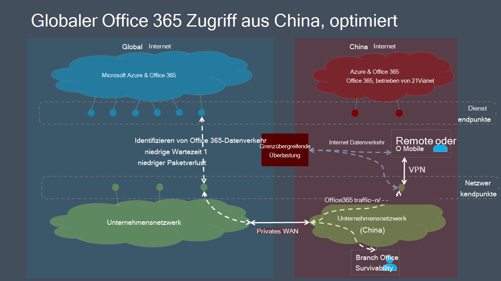

# Microsoft 365 der globalen Mandantenleistungsoptimierung für Benutzer in ChinaMicrosoft 365 global tenant performance optimization for China users

>[!IMPORTANT]
>Diese Anleitung gilt speziell für Verwendungsszenarien, in denen **Microsoft 365 benutzer in China** eine Verbindung mit einem globalen mandanten Microsoft 365 **herstellen.**This guidance is specific to usage scenarios in which **enterprise Microsoft 365 users located in China** connect to a **global Microsoft 365 tenant**. Diese Anleitung gilt **nicht** für Mandanten in Office 365 betrieben von 21Vianet.This guidance does **not** apply to tenants in Office 365 operated by 21Vianet.

Für Unternehmen mit globalen Microsoft 365 Mandanten und einer Unternehmenspräsenz in China kann die Microsoft 365-Clientleistung für chinabasierte Benutzer durch Faktoren kompliziert werden, die für die Internetarchitektur von China Telco einzigartig sind.For enterprises with global Microsoft 365 tenants and a corporate presence in China, Microsoft 365 client performance for China-based users can be complicated by factors unique to China Telco's Internet architecture.

China-ISPs verfügen über regulierte Verbindungen mit dem globalen öffentlichen Internet, die über Umkreisgeräte verfügen, die für eine hohe Überlastung des grenzübergreifenden Netzwerks anfällig sind.China ISPs have regulated offshore connections to the global public Internet that go through perimeter devices that are prone to high-levels of cross-border network congestion. Diese Überlastung führt zu Paketverlusten und Wartezeiten für den ganzen Internetdatenverkehr, der nach China und aus China führt.This congestion creates packet loss and latency for all Internet traffic going into and out of China.

Paketverluste und Wartezeiten beeinträchtigen die Leistung von Netzwerkdiensten, insbesondere Dienste, die einen großen Datenaustausch (z. B. große Dateiübertragungen) oder eine nahezu echtzeitnahe Leistung (Audio- und Videoanwendungen) erfordern.Packet loss and latency are detrimental to the performance of network services, especially services that require large data exchanges (such as large file transfers) or requiring near real-time performance (audio and video applications).

Das Ziel dieses Themas besteht in der Bereitstellung bewährter Methoden zur Minderung der Auswirkungen der grenzüberschreitenden Netzwerküberlastung chinas auf Microsoft 365 Dienste.The goal of this topic is to provide best practices for mitigating the impact of China cross-border network congestion on Microsoft 365 services. In diesem Thema werden keine anderen häufigen Leistungsprobleme der letzten Meile, z. B. Probleme mit hoher Paketlatenz aufgrund komplexer Routings innerhalb von Chinesischen Netzbetreibern, beschrieben.This topic does not address other common last-mile performance issues such as issues of high packet latency due to complex routing within China carriers.

## Bewährte Methoden für UnternehmensnetzwerkeCorporate network best practices

Viele Unternehmen mit globalen Microsoft 365 und Benutzern in China haben private Netzwerke implementiert, die den Unternehmensnetzwerkverkehr zwischen Chinesischen Bürostandorten und Standorten auf der ganzen Welt im Ausland transportieren.Many enterprises with global Microsoft 365 tenants and users in China have implemented private networks that carry corporate network traffic between China office locations and offshore locations around the world. Diese Unternehmen können diese Netzwerkinfrastruktur nutzen, um grenzübergreifende Netzwerküberlastungen zu vermeiden und Microsoft 365 leistung in China zu optimieren.These enterprises can leverage this network infrastructure to avoid cross-border network congestion and optimize their Microsoft 365 service performance in China.

>[!IMPORTANT]
>Wie bei allen privaten WAN-Implementierungen sollten Sie immer die gesetzlichen Anforderungen für Ihr Land und/oder Ihre Region konsultieren, um sicherzustellen, dass Ihre Netzwerkkonfiguration den Anforderungen entspricht.As with all private WAN implementations, you should always consult regulatory requirements for your country and/or region to ensure that your network configuration is in compliance.

Als ersten Schritt ist es wichtig, dass Sie unsere Benchmark-Netzwerkanleitungen unter Netzwerkplanung und [Leistungsoptimierung](./network-planning-and-performance.md)für Microsoft 365.As a first step, it is crucial that you follow our benchmark network guidance at [Network planning and performance tuning for Microsoft 365](./network-planning-and-performance.md). Das Hauptziel sollte sein, den Zugriff auf globale Microsoft 365 über das Internet in China möglichst zu vermeiden.The primary goal should be to avoid accessing global Microsoft 365 services from the Internet in China if possible.

- Nutzen Sie Ihr vorhandenes privates Netzwerk, um Microsoft 365 Netzwerkverkehr zwischen chinesischen Büronetzwerken und Off-Office-Standorten zu übertragen, die über das öffentliche Internet außerhalb Chinas abziehen.Leverage your existing private network to carry Microsoft 365 network traffic between China office networks and offshore locations that egress on the public Internet outside China. Fast jeder Standort außerhalb Chinas bietet einen eindeutigen Vorteil.Almost any location outside China will provide a clear benefit. Netzwerkadministratoren können die Optimierung weiter optimieren, indem sie sich in Bereichen mit niedriger Latenz mit dem globalen [Microsoft-Netzwerk verbinden.](https://docs.microsoft.com/azure/networking/microsoft-global-network)Network administrators can further optimize by egressing in areas with low-latency interconnect with the [Microsoft global network](https://docs.microsoft.com/azure/networking/microsoft-global-network). Hongkong, Japan und Südkorea sind Beispiele.Hong Kong, Japan, and South Korea are examples.
- Konfigurieren Sie Benutzergeräte so, dass sie über eine VPN-Verbindung auf das Unternehmensnetzwerk zugreifen, damit Microsoft 365 die private Off-Off -Verbindung des Unternehmensnetzwerks übertragen kann.Configure user devices to access the corporate network over a VPN connection to allow Microsoft 365 traffic to transit the corporate network's private offshore link. Stellen Sie sicher, dass die VPN-Clients entweder nicht für die Verwendung von geteilten Tunneln konfiguriert sind oder dass Benutzergeräte so konfiguriert sind, dass sie den geteilten Tunneling für den Microsoft 365 ignorieren.Ensure that VPN clients are either not configured to use split tunneling, or that user devices are configured to ignore split tunneling for Microsoft 365 traffic. Weitere Informationen zum Optimieren der VPN-Konnektivität für Teams und Echtzeitmedienverkehr finden Sie [in diesem Abschnitt](#optimizing-microsoft-teams-meetings-network-performance-for-users-in-china).For additional information on optimizing VPN connectivity for Teams and real-time media traffic, see [this section](#optimizing-microsoft-teams-meetings-network-performance-for-users-in-china).
- Konfigurieren Sie Ihr Netzwerk so, dass Microsoft 365 datenverkehr über Ihre private Off-Off -Verbindung weiterverroutet wird.Configure your network to route all Microsoft 365 traffic across your private offshore link. Wenn Sie das Datenverkehrsvolumen auf Ihrer privaten Verbindung minimieren müssen, können Sie auswählen, dass Endpunkte nur in der **Kategorie Optimieren** geleitet werden, und Anforderungen an **Allow-** und **Default-Endpunkte** die Übertragung des Internets erlauben.If you must minimize the volume of traffic on your private link, you can choose to only route endpoints in the **Optimize** category, and allow requests to **Allow** and **Default** endpoints to transit the Internet. Dadurch wird die Leistung verbessert und die Bandbreitenauslastung minimiert, indem optimierter Datenverkehr auf kritische Dienste begrenzt wird, die besonders auf hohe Latenz und Paketverluste reagieren.This will improve performance and minimize bandwidth consumption by limiting optimized traffic to critical services that are most sensitive to high latency and packet loss.
- Verwenden Sie nach Möglichkeit UDP anstelle von TCP für Livemedienstreamingverkehr, z. B. für Teams.If possible, use UDP instead of TCP for live media streaming traffic, such as for Teams. UDP bietet eine bessere Livemedienstreamingleistung als TCP.UDP offers better live media streaming performance than TCP.

Informationen zum selektiven Routen von Datenverkehr Microsoft 365 finden Sie unter [Managing Office 365 endpoints](managing-office-365-endpoints.md).For information about how to selectively route Microsoft 365 traffic, see [Managing Office 365 endpoints](managing-office-365-endpoints.md). Eine Liste aller weltweiten Office 365 URLs und IP-Adressen finden Sie [unter Office 365 URLs und IP-Adressbereiche](urls-and-ip-address-ranges.md).For a list of all worldwide Office 365 URLs and IP addresses, see [Office 365 URLs and IP address ranges](urls-and-ip-address-ranges.md).

## Bewährte Methoden für BenutzerUser best practices

Benutzer in China, die eine Verbindung mit globalen Microsoft 365-Mandanten von Remotestandorten wie Heimen, Cafés, Hotels und Zweigstellen ohne Verbindung zu Unternehmensnetzwerken herstellen, können eine schlechte Netzwerkleistung erleben, da der Datenverkehr zwischen ihren Geräten und Microsoft 365 chinas überlastete grenzübergreifende Netzwerkschaltungen durchqueren muss.Users in China who connect to global Microsoft 365 tenants from remote locations such as homes, coffee shops, hotels, and branch offices with no connection to enterprise networks can experience poor network performance because traffic between their devices and Microsoft 365 must transit China's congested cross-border network circuits.

Wenn grenzüberschreitende private Netzwerke und/oder VPN-Zugriff auf das Unternehmensnetzwerk keine Option sind, können Leistungsprobleme pro Benutzer weiterhin durch Schulung Ihrer in China ansässigen Benutzer zur Anwendung dieser bewährten Methoden abgemildert werden.If cross-border private networks and/or VPN access into the corporate network are not an option, per-user performance issues can still be mitigated by training your China-based users to follow these best practices.

- Nutzen Sie Office Clients, die zwischenspeichern (z. B. Outlook, Teams, OneDrive usw.), und vermeiden Sie webbasierte Clients.Utilize rich Office clients that support caching (e.g. Outlook, Teams, OneDrive, etc.), and avoid web-based clients. Office Client zwischenspeichern und Offlinezugriffsfeatures können die Auswirkungen von Netzwerküberlastung und Latenz erheblich reduzieren.Office client caching and offline access features can dramatically reduce the impact of network congestion and latency.
- Wenn Ihr Microsoft 365-Mandant mit der  Audiokonferenzfunktion konfiguriert wurde, können Teams Benutzer über das Festnetz (Public Switched Telephone Network, PSTN) an Besprechungen teilnehmen.If your Microsoft 365 tenant has been configured with the _Audio Conferencing_ feature, Teams users can join meetings via the public switched telephone network (PSTN). Weitere Informationen finden Sie unter [Audiokonferenzen in Office 365](/microsoftteams/audio-conferencing-in-office-365).For more information, see [Audio Conferencing in Office 365](/microsoftteams/audio-conferencing-in-office-365).
- Wenn Benutzer Probleme mit der Netzwerkleistung haben, sollten sie sich zur Problembehandlung an ihre IT-Abteilung melden und an den Microsoft-Support eskalieren, wenn Probleme mit Microsoft 365 auftreten.If users experience network performance issues, they should report to their IT department for troubleshooting, and escalate to Microsoft support if trouble with Microsoft 365 services is suspected. Nicht alle Probleme werden durch die grenzüberschreitende Netzwerkleistung verursacht.Not all issues are caused by cross-border network performance.

## Optimieren Microsoft Teams Netzwerkleistung von Besprechungen für Benutzer in ChinaOptimizing Microsoft Teams meetings network performance for users in China  

Für Organisationen mit globalen Microsoft 365 mandanten und einer Anwesenheit in China kann die Microsoft 365 der Clientleistung für chinabasierte Benutzer durch Faktoren kompliziert werden, die für die Chinesische Internetarchitektur einzigartig sind.For organizations with global Microsoft 365 tenants and a presence in China, Microsoft 365 client performance for China-based users can be complicated by factors unique to the China Internet architecture. Viele Unternehmen und Schulen haben gute Ergebnisse gemeldet, indem sie diese Anleitungen folgen.Many companies and schools have reported good results by following this guidance. Der Bereich ist jedoch auf Benutzernetzwerkstandorte beschränkt, die die Kontrolle über das Setup des IT-Netzwerks haben, z. B. Bürostandorte oder heim-/mobile Endpunkte mit VPN-Konnektivität.However, the scope is limited to user network locations that are under control of the IT networking setup, for example, office locations or home/mobile endpoints with VPN connectivity. Microsoft Teams Anrufe und Besprechungen werden häufig von externen Standorten wie Home Offices, mobilen Standorten, unterwegs und Cafés verwendet.Microsoft Teams calls and meetings are often used from external locations, such as home offices, mobile locations, on the road, and coffee shops. Da Anrufe und Besprechungen auf Dem Mediendatenverkehr in Echtzeit beruhen, Teams die Netzwerküberlastung besonders sensibel.Because calls and meetings rely on real-time media traffic, these Teams experiences are particularly sensitive to network congestion.

Aus diesem Grund hat Microsoft eine Partnerschaft mit Telekommunikationsanbietern hergestellt, um Teams- und Skype for Business Online-Mediendatenverkehr über einen qualitativ hochwertigen, bevorzugten Netzwerkpfad zwischen nationalen und öffentlichen Internetverbindungen in China und den Teams- und Skype-Diensten in der globalen Microsoft 365-Cloud zu übertragen.As a result, Microsoft has partnered with telecommunications providers to carry Teams and Skype for Business Online real-time media traffic using a higher-quality, preferential network path between domestic and public internet connections in China and the Teams and Skype services in the Microsoft 365 global cloud. Diese Funktion hat zu einer mehr als zehnfachen Verbesserung des Paketverlusts und anderer wichtiger Metriken geführt, die sich auf die Benutzererfahrung auswirken.This capability has resulted in a more than ten-fold improvement in packet loss and other key metrics impacting your user's experience.

>[!IMPORTANT]
>Derzeit werden diese Verbesserungen nicht auf die Teilnahme an Microsoft Live Events-Besprechungen wie großen Übertragungen oder "Rathaus"-Stilbesprechungen mit Teams oder Microsoft Stream adressiert.Currently, these improvements do not address attending Microsoft Live Events meetings such as large broadcast or “town hall” style meetings using Teams or Microsoft Stream. Um eine Live-Ereignis-Besprechung anzeigen zu können, müssen Benutzer in China ein privates Netzwerk oder eine SDWAN/VPN-Lösung verwenden.To view a Live Events meeting, users in China need to use a private network or SDWAN/VPN solution. Die Netzwerkverbesserungen profitieren jedoch von Benutzern, die eine Live-Ereignis-Besprechung präsentieren oder herstellen, da diese Erfahrung als regelmäßige Teams des Produzenten oder Moderators dient.However, the network improvements will benefit users who are presenting or producing a Live Events meeting, because that experience acts as a regular Teams meeting for the producer or presenter.

### Bewährte Methoden des Organisationsnetzwerks für Teams BesprechungenOrganization network best practices for Teams meetings

Sie müssen überlegen, wie Sie diese Netzwerkverbesserungen nutzen können, da in den vorherigen Anleitungen eine private Netzwerkerweiterung in Betracht zu ziehen ist, um grenzübergreifende Netzwerküberlastungen zu vermeiden.You need to consider how to leverage these network improvements, given that the previous guidance to consider a private network extension to avoid cross-border network congestion. Es gibt zwei allgemeine Optionen für Organisationsbüronetzwerke:There are two general options for organization office networks:

1.  Nichts Neues tun.Do nothing new. Befolgen Sie weiterhin die früheren Anleitungen zur Umgehung privater Netzwerke, um eine grenzüberschreitende Überlastung zu vermeiden.Continue to follow the earlier guidance around private network bypass to avoid cross-border congestion. Teams Echtzeitmediendatenverkehr nutzt diese Einrichtung wie zuvor.Teams real-time media traffic will leverage that setup, as before.
2.  Implementieren Eines geteilten/hybriden Musters.Implement a split/hybrid pattern. 

  - Verwenden Sie die vorherige Anleitung für den datenverkehr, der zur Optimierung gekennzeichnet ist, außer Teams Besprechungen und aufrufenden Mediendatenverkehr in Echtzeit.Use the previous guidance for all traffic flagged for optimization except Teams meetings and calling real-time media traffic.

  - Routen Teams Besprechung und Aufrufen von Echtzeitmediendatenverkehr über das öffentliche Internet.Route Teams meeting and calling real-time media traffic over the public internet. In den folgenden Informationen finden Sie Spezifisches zum Identifizieren des Echtzeitdatenverkehrs im Mediennetzwerk.See the following information for specifics on identifying the real-time media network traffic.

Das Senden Teams Audio- und Videodatenverkehr in Echtzeit über das öffentliche Internet, bei dem die Konnektivität mit höherer Qualität verwendet wird, kann zu erheblichen Kosteneinsparungen führen, da es kostenlos und nicht kostenpflichtig ist, diesen Datenverkehr über ein privates Netzwerk zu senden.Sending Teams real-time media audio and video traffic over the public internet, which uses the higher quality connectivity, can result in considerable cost savings, because it is free versus paying to send that traffic over a private network. Es kann ähnliche zusätzliche Vorteile geben, wenn Benutzer auch SDWAN- oder VPN-Clients verwenden.There may be similar additional benefits if users are also using SDWAN or VPN clients. Einige Organisationen bevorzugen möglicherweise auch, dass mehr ihrer Daten öffentliche Internetverbindungen durchlaufen, wie allgemein üblich.Some organizations may also prefer to have more of their data traverse public internet connections as a general practice.

Die gleichen Optionen können für SDWAN- oder VPN-Konfigurationen gelten.The same options could apply to SDWAN or VPN configurations. Beispielsweise verwendet ein Benutzer einen SDWAN oder VPN, um Microsoft 365-Datenverkehr an das Unternehmensnetzwerk weiter zu routen und dann die private Erweiterung dieses Netzwerks zu nutzen, um eine grenzüberschreitende Überlastung zu vermeiden.For example, a user is using an SDWAN or VPN to route Microsoft 365 traffic to the corporate network and then leveraging the private extension of that network to avoid cross-border congestion. SdWAN oder VPN des Benutzers können nun so konfiguriert werden, dass Teams besprechungs- und aufrufenden Echtzeitdatenverkehr vom VPN-Routing ausgeschlossen werden.The user’s SDWAN or VPN can now be configured to exclude Teams meeting and calling real-time traffic from the VPN routing. Diese VPN-Konfiguration wird als geteiltes Tunneling bezeichnet.This VPN configuration is referred to as split tunneling. Weitere Informationen finden Sie unter [VPN split tunneling for Office 365.](https://docs.microsoft.com/microsoft-365/enterprise/microsoft-365-vpn-implement-split-tunnel)See [VPN split tunneling for Office 365](https://docs.microsoft.com/microsoft-365/enterprise/microsoft-365-vpn-implement-split-tunnel) for more information.

Sie können Ihren SDWAN oder VPN auch weiterhin für den Microsoft 365 verwenden, einschließlich Microsoft Teams Echtzeitdatenverkehr.You can also continue to use your SDWAN or VPN for all Microsoft 365 traffic, including for Microsoft Teams real-time traffic. Microsoft hat keine Empfehlungen für die Verwendung von SDWAN- oder VPN-Lösungen.Microsoft has no recommendations on the use of SDWAN or VPN solutions.

### Bewährte Methoden für Heim-, Mobil- und Benutzernetzwerke für Teams BesprechungenHome, mobile, and user network best practices for Teams meetings

Benutzer in China können diese Verbesserungen nutzen, indem sie einfach eine Verbindung mit dem öffentlichen Internetdienst in China über eine Festnetz- oder mobile Verbindung herstellen.Users in China can take advantage of these improvements simply by connecting to the public internet service in China with a landline or mobile connection. Teams Audio- und Videodatenverkehr in Echtzeit im öffentlichen Internet profitieren direkt von verbesserter Konnektivität und Qualität.Teams real-time media audio and video traffic on the public internet directly benefits from improved connectivity and quality.

Daten von anderen Microsoft 365-Diensten – und anderer Datenverkehr in Teams, z. B. Chats oder Dateien – profitieren jedoch nicht direkt von diesen Verbesserungen.However, data from other Microsoft 365 services—and other traffic in Teams, such as chat or files—will not directly benefit from these improvements. Benutzer außerhalb des Organisationsnetzwerks können weiterhin eine schlechte Netzwerkleistung für diesen Datenverkehr erleben.Users outside the organization network may still experience poor network performance for this traffic. Wie in diesem Artikel erläutert, können Sie diese Auswirkungen mithilfe eines VPN oder SDWAN mindern.As discussed in this article, you can mitigate these effects by using a VPN or SDWAN. Sie können auch benutzerreiche Desktopclients über Webclients verwenden, die die In-App-Zwischenspeicherung unterstützen, um Netzwerkprobleme zu beheben.You can also have your users use rich desktop clients over web clients, which support in-app caching to mitigate network issues.

### Identifizieren Teams EchtzeitmediennetzwerkdatenverkehrsIdentifying Teams real-time media network traffic

Zum Konfigurieren eines Netzwerkgeräts oder eines VPN/SDWAN-Setups müssen Sie nur den Teams Audio- und Videodatenverkehr in Echtzeit ausschließen.For configuring a network device or a VPN/SDWAN setup, you need to exclude only the Teams real-time media audio and video traffic. Die Datenverkehrsdetails finden Sie für ID 11 in der offiziellen Liste Office 365 [URLs und IP-Adressbereiche](https://docs.microsoft.com/microsoft-365/enterprise/urls-and-ip-address-ranges#skype-for-business-online-and-microsoft-teams).The traffic details can be found  for ID 11 on the official list of [Office 365 URLs and IP address ranges](https://docs.microsoft.com/microsoft-365/enterprise/urls-and-ip-address-ranges#skype-for-business-online-and-microsoft-teams). Alle anderen Netzwerkkonfigurationen sollten unverändert bleiben.All other network configurations should remain as-is.

Microsoft arbeitet kontinuierlich daran, die Microsoft 365 benutzerfreundlichkeit und die Leistung von Clients über die breiteste Palette von Netzwerkarchitekturen und -merkmalen zu verbessern.Microsoft is continually working to improve the Microsoft 365 user experience and the performance of clients over the widest possible range of network architectures and characteristics. Besuchen Sie [Office 365 Networking Tech Community,]( https://techcommunity.microsoft.com/t5/office-365-networking/bd-p/Office365Networking) um eine Unterhaltung zu starten oder an einer Unterhaltung zu teilnehmen, Ressourcen zu finden und Featureanforderungen und Vorschläge zu übermittelnVisit the [Office 365 Networking Tech Community]( https://techcommunity.microsoft.com/t5/office-365-networking/bd-p/Office365Networking) to start or join a conversation, find resources, and submit feature requests and suggestions

## Verwandte ThemenRelated topics

[Netzwerkplanung und Leistungsoptimierung für Microsoft 365Network planning and performance tuning for Microsoft 365](./network-planning-and-performance.md)

[Prinzipien der Microsoft 365-NetzwerkkonnektivitätMicrosoft 365 network connectivity principles](microsoft-365-network-connectivity-principles.md)

[Verwalten von Office 365-EndpunktenManaging Office 365 endpoints](managing-office-365-endpoints.md)

[URLs und IP-Adressbereiche für Office 365Office 365 URLs and IP address ranges](urls-and-ip-address-ranges.md)

[Globales Microsoft-NetzwerkMicrosoft global network](/azure/networking/microsoft-global-network)