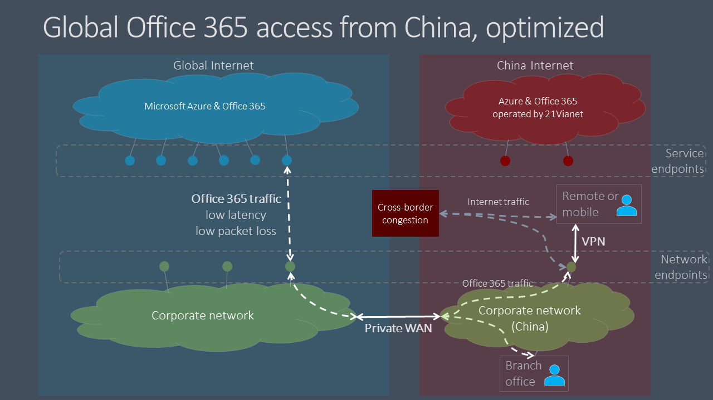

# Microsoft 365– Optimierung der globalen Mandantenleistung für Benutzer in China

>[!IMPORTANT]
>Diese Anleitung gilt speziell für Verwendungsszenarien, in denen **Microsoft 365-Benutzer in China** eine Verbindung mit einem globalen Microsoft **365-Mandanten herstellen.** Diese Anleitung gilt **nicht** für Mandanten in Office 365, betrieben von 21Vianet.

Für Unternehmen mit globalen Microsoft 365-Mandanten und einer Unternehmenspräsenz in China kann die Leistung von Microsoft 365-Clients für chinabasierte Benutzer durch Faktoren kompliziert werden, die für die Internetarchitektur von China Telco einzigartig sind.

China-ISPs verfügen über regulierte Verbindungen mit dem globalen öffentlichen Internet, die über Umkreisgeräte verfügen, die für eine hohe Überlastung des grenzübergreifenden Netzwerks anfällig sind. Diese Überlastung führt zu Paketverlusten und Wartezeiten für den ganzen Internetdatenverkehr, der nach China und aus China führt.

Paketverluste und Wartezeiten beeinträchtigen die Leistung von Netzwerkdiensten, insbesondere Dienste, die einen großen Datenaustausch (z. B. große Dateiübertragungen) oder eine nahezu echtzeitnahe Leistung (Audio- und Videoanwendungen) erfordern.

Das Ziel dieses Themas besteht in der Bereitstellung bewährter Methoden für die Abmildung der Auswirkungen der grenzüberschreitenden Netzwerküberlastung chinas auf Microsoft 365-Dienste. In diesem Thema werden keine anderen häufigen Leistungsprobleme der letzten Meile, z. B. Probleme mit hoher Paketlatenz aufgrund komplexer Routings innerhalb von Chinesischen Netzbetreibern, beschrieben.

## Bewährte Methoden für Unternehmensnetzwerke

Viele Unternehmen mit globalen Microsoft 365-Mandanten und -Benutzern in China haben private Netzwerke implementiert, die Unternehmensnetzwerkdatenverkehr zwischen Chinesischen Bürostandorten und Standorten auf der ganzen Welt im Zusammenhang mit dem Unternehmensnetzwerk transportieren. Diese Unternehmen können diese Netzwerkinfrastruktur nutzen, um eine grenzüberschreitende Netzwerküberlastung zu vermeiden und ihre Microsoft 365-Dienstleistung in China zu optimieren.

>[!IMPORTANT]
>Wie bei allen privaten WAN-Implementierungen sollten Sie immer die gesetzlichen Anforderungen für Ihr Land und/oder Ihre Region konsultieren, um sicherzustellen, dass Ihre Netzwerkkonfiguration den Anforderungen entspricht.

Als ersten Schritt ist es wichtig, dass Sie unsere Benchmark-Netzwerkanleitungen unter Netzwerkplanung und Leistungsoptimierung [für Microsoft 365 befolgen.](./network-planning-and-performance.md) Das Hauptziel sollte sein, den Zugriff auf globale Microsoft 365-Dienste aus dem Internet in China möglichst zu vermeiden.

- Nutzen Sie Ihr vorhandenes privates Netzwerk, um Microsoft 365-Netzwerkdatenverkehr zwischen chinesischen Büronetzwerken und Off-Office-Standorten zu übertragen, die über das öffentliche Internet außerhalb Chinas abziehen. Fast jeder Standort außerhalb Chinas bietet einen eindeutigen Vorteil. Netzwerkadministratoren können die Optimierung weiter optimieren, indem sie sich in Bereichen mit niedriger Latenz mit dem globalen [Microsoft-Netzwerk verbinden.](https://docs.microsoft.com/azure/networking/microsoft-global-network) Hongkong, Japan und Südkorea sind Beispiele.
- Konfigurieren Sie Benutzergeräte so, dass sie über eine VPN-Verbindung auf das Unternehmensnetzwerk zugreifen, damit Microsoft 365-Datenverkehr die private Off-End-Verbindung des Unternehmensnetzwerks übertragen kann. Stellen Sie sicher, dass VPN-Clients entweder nicht für die Verwendung von geteilten Tunneln konfiguriert sind oder dass Benutzergeräte so konfiguriert sind, dass geteilter Tunneling für Microsoft 365-Datenverkehr ignoriert wird. Weitere Informationen zum Optimieren der VPN-Konnektivität für Teams und des Echtzeitmedienverkehrs finden Sie [in diesem Abschnitt](#optimizing-microsoft-teams-meetings-network-performance-for-users-in-china).
- Konfigurieren Sie Ihr Netzwerk so, dass der gesamte Microsoft 365-Datenverkehr über Ihre private Off-Off -Verbindung geroutet wird. Wenn Sie das Datenverkehrsvolumen auf Ihrer privaten Verbindung minimieren müssen, können Sie auswählen, dass Endpunkte nur in der **Kategorie Optimieren** geleitet werden, und Anforderungen an **Allow-** und **Default-Endpunkte** die Übertragung des Internets erlauben. Dadurch wird die Leistung verbessert und die Bandbreitenauslastung minimiert, indem optimierter Datenverkehr auf kritische Dienste begrenzt wird, die besonders auf hohe Latenz und Paketverluste reagieren.
- Verwenden Sie nach Möglichkeit UDP anstelle von TCP für Live-Medienstreaming-Datenverkehr, z. B. für Teams. UDP bietet eine bessere Livemedienstreamingleistung als TCP.

Informationen zum selektiven Routen von Microsoft 365-Datenverkehr finden Sie unter [Managing Office 365 endpoints](managing-office-365-endpoints.md). Eine Liste aller weltweiten Office 365-URLs und IP-Adressen finden Sie unter [Office 365-URLs und IP-Adressbereiche](urls-and-ip-address-ranges.md).

## Bewährte Methoden für Benutzer

Benutzer in China, die eine Verbindung mit globalen Microsoft 365-Mandanten von Remotestandorten wie Heimen, Cafés, Hotels und Zweigstellen ohne Verbindung zu Unternehmensnetzwerken herstellen, können eine schlechte Netzwerkleistung erleben, da der Datenverkehr zwischen ihren Geräten und Microsoft 365 chinas überlastete grenzübergreifende Netzwerkschaltungen durchqueren muss.

Wenn grenzüberschreitende private Netzwerke und/oder VPN-Zugriff auf das Unternehmensnetzwerk keine Option sind, können Leistungsprobleme pro Benutzer weiterhin durch Schulung Ihrer in China ansässigen Benutzer zur Anwendung dieser bewährten Methoden abgemildert werden.

- Nutzen Sie umfangreiche Office-Clients, die zwischenspeichern (z. B. Outlook, Teams, OneDrive usw.) unterstützen und webbasierte Clients vermeiden. Office-Client-Zwischenspeicherung und Offlinezugriffsfeatures können die Auswirkungen von Netzwerküberlastung und Latenz erheblich reduzieren.
- Wenn Ihr Microsoft 365-Mandant mit der _Audiokonferenzfunktion_ konfiguriert wurde, können Teams-Benutzer über das Festnetz (Public Switched Telephone Network, PSTN) an Besprechungen teilnehmen. Weitere Informationen finden Sie [unter Audiokonferenzen in Office 365](/microsoftteams/audio-conferencing-in-office-365).
- Wenn Benutzer Probleme mit der Netzwerkleistung haben, sollten sie sich zur Problembehandlung an ihre IT-Abteilung melden und an den Microsoft-Support eskalieren, wenn Probleme mit Microsoft 365-Diensten vermutet werden. Nicht alle Probleme werden durch die grenzüberschreitende Netzwerkleistung verursacht.

## Optimieren der Netzwerkleistung von Microsoft Teams-Besprechungen für Benutzer in China  

Für Organisationen mit globalen Microsoft 365-Mandanten und einer Anwesenheit in China kann die Microsoft 365-Clientleistung für chinabasierte Benutzer durch Faktoren kompliziert werden, die für die Chinesische Internetarchitektur einzigartig sind. Viele Unternehmen und Schulen haben gute Ergebnisse gemeldet, indem sie diese Anleitungen folgen. Der Bereich ist jedoch auf Benutzernetzwerkstandorte beschränkt, die die Kontrolle über das Setup des IT-Netzwerks haben, z. B. Bürostandorte oder heim-/mobile Endpunkte mit VPN-Konnektivität. Microsoft Teams-Anrufe und Besprechungen werden häufig von externen Standorten wie Home Offices, mobilen Standorten, unterwegs und Cafés verwendet. Da Anrufe und Besprechungen auf Dem Mediendatenverkehr in Echtzeit beruhen, sind diese Teams-Erfahrungen besonders anfällig für Netzwerküberlastungen.

Als Ergebnis hat Microsoft eine Partnerschaft mit Telekommunikationsanbietern hergestellt, um Teams und Skype for Business Online-Mediendatenverkehr in Echtzeit mit einem qualitativ hochwertigeren, bevorzugten Netzwerkpfad zwischen nationalen und öffentlichen Internetverbindungen in China und den Teams- und Skype-Diensten in der globalen Microsoft 365-Cloud zu übertragen. Diese Funktion hat zu einer mehr als zehnfachen Verbesserung des Paketverlusts und anderer wichtiger Metriken geführt, die sich auf die Benutzererfahrung auswirken.

>[!IMPORTANT]
>Derzeit werden diese Verbesserungen nicht für die Teilnahme an Microsoft Live Events-Besprechungen wie großen Übertragungen oder "Rathaus"-Stilbesprechungen mithilfe von Teams oder Microsoft Stream verwendet. Um eine Live-Ereignis-Besprechung anzeigen zu können, müssen Benutzer in China ein privates Netzwerk oder eine SDWAN/VPN-Lösung verwenden. Die Netzwerkverbesserungen kommen jedoch Benutzern zugute, die eine Live-Ereignis-Besprechung präsentieren oder erzeugen, da diese Erfahrung als reguläre Teams-Besprechung für den Produzenten oder Moderator fungiert.

### Bewährte Methoden des Organisationsnetzwerks für Teams-Besprechungen

Sie müssen überlegen, wie Sie diese Netzwerkverbesserungen nutzen können, da in den vorherigen Anleitungen eine private Netzwerkerweiterung in Betracht zu ziehen ist, um grenzübergreifende Netzwerküberlastungen zu vermeiden. Es gibt zwei allgemeine Optionen für Organisationsbüronetzwerke:

1.  Nichts Neues tun. Befolgen Sie weiterhin die früheren Anleitungen zur Umgehung privater Netzwerke, um eine grenzüberschreitende Überlastung zu vermeiden. Der Echtzeitmediendatenverkehr von Teams nutzt dieses Setup wie zuvor.
2.  Implementieren Eines geteilten/hybriden Musters. 

  - Verwenden Sie die vorherige Anleitung für den datenverkehr, der zur Optimierung gekennzeichnet ist, mit Ausnahme von Teams-Besprechungen und Aufrufen des Mediendatenverkehrs in Echtzeit.

  - Routen Von Teams-Besprechungen und Aufrufen von Mediendatenverkehr in Echtzeit über das öffentliche Internet. In den folgenden Informationen finden Sie Spezifisches zum Identifizieren des Echtzeitdatenverkehrs im Mediennetzwerk.

Das Senden von Audio- und Videodatenverkehr von Teams in Echtzeit über das öffentliche Internet, bei dem die Konnektivität mit höherer Qualität verwendet wird, kann zu erheblichen Kosteneinsparungen führen, da es kostenlos und nicht kostenpflichtig ist, diesen Datenverkehr über ein privates Netzwerk zu senden. Es kann ähnliche zusätzliche Vorteile geben, wenn Benutzer auch SDWAN- oder VPN-Clients verwenden. Einige Organisationen bevorzugen möglicherweise auch, dass mehr ihrer Daten öffentliche Internetverbindungen durchlaufen, wie allgemein üblich.

Die gleichen Optionen können für SDWAN- oder VPN-Konfigurationen gelten. Beispielsweise verwendet ein Benutzer einen SDWAN oder VPN, um Microsoft 365-Datenverkehr an das Unternehmensnetzwerk weiter zu routen und dann die private Erweiterung dieses Netzwerks zu nutzen, um eine grenzüberschreitende Überlastung zu vermeiden. Das SDWAN oder VPN des Benutzers kann nun so konfiguriert werden, dass Teams-Besprechungen und Das Aufrufen von Echtzeitdatenverkehr vom VPN-Routing ausgeschlossen werden. Diese VPN-Konfiguration wird als geteiltes Tunneling bezeichnet. Weitere [Informationen finden Sie unter VPN split tunneling for Office 365.](https://docs.microsoft.com/microsoft-365/enterprise/microsoft-365-vpn-implement-split-tunnel)

Sie können Ihren SDWAN oder VPN auch weiterhin für den ganzen Microsoft 365-Datenverkehr verwenden, einschließlich für Microsoft Teams-Echtzeitdatenverkehr. Microsoft hat keine Empfehlungen für die Verwendung von SDWAN- oder VPN-Lösungen.

### Bewährte Methoden für Heim-, Mobil- und Benutzernetzwerke für Teams-Besprechungen

Benutzer in China können diese Verbesserungen nutzen, indem sie einfach eine Verbindung mit dem öffentlichen Internetdienst in China über eine Festnetz- oder mobile Verbindung herstellen. Der Audio- und Videodatenverkehr von Teams in Echtzeit im öffentlichen Internet profitiert direkt von verbesserter Konnektivität und Qualität.

Daten anderer Microsoft 365-Dienste – und anderer Datenverkehr in Teams, z. B. Chats oder Dateien – profitieren jedoch nicht direkt von diesen Verbesserungen. Benutzer außerhalb des Organisationsnetzwerks können weiterhin eine schlechte Netzwerkleistung für diesen Datenverkehr erleben. Wie in diesem Artikel erläutert, können Sie diese Auswirkungen mithilfe eines VPN oder SDWAN mindern. Sie können auch benutzerreiche Desktopclients über Webclients verwenden, die die In-App-Zwischenspeicherung unterstützen, um Netzwerkprobleme zu beheben.

### Identifizieren des Echtzeitdatenverkehrs im Mediennetzwerk von Teams

Zum Konfigurieren eines Netzwerkgeräts oder eines VPN/SDWAN-Setups müssen Sie nur den Echtzeitdaten- und Videodatenverkehr von Teams ausschließen. Die Datenverkehrsdetails finden Sie für ID 11 in der offiziellen Liste der [Office 365-URLs und IP-Adressbereiche.](https://docs.microsoft.com/microsoft-365/enterprise/urls-and-ip-address-ranges#skype-for-business-online-and-microsoft-teams) Alle anderen Netzwerkkonfigurationen sollten unverändert bleiben.

Microsoft arbeitet kontinuierlich daran, die Benutzerfreundlichkeit von Microsoft 365 und die Leistung von Clients über eine möglichst breite Palette von Netzwerkarchitekturen und -merkmalen zu verbessern. Besuchen Sie [die Office 365 Networking Tech Community,]( https://techcommunity.microsoft.com/t5/office-365-networking/bd-p/Office365Networking) um eine Unterhaltung zu starten oder an einer Unterhaltung zu teilnehmen, Ressourcen zu finden und Featureanforderungen und Vorschläge zu übermitteln

## Verwandte Themen

[Netzwerkplanung und Leistungsoptimierung für Microsoft 365](./network-planning-and-performance.md)

[Prinzipien der Microsoft 365-Netzwerkkonnektivität](microsoft-365-network-connectivity-principles.md)

[Verwalten von Office 365-Endpunkten](managing-office-365-endpoints.md)

[URLs und IP-Adressbereiche für Office 365](urls-and-ip-address-ranges.md)

[Globales Microsoft-Netzwerk](/azure/networking/microsoft-global-network)