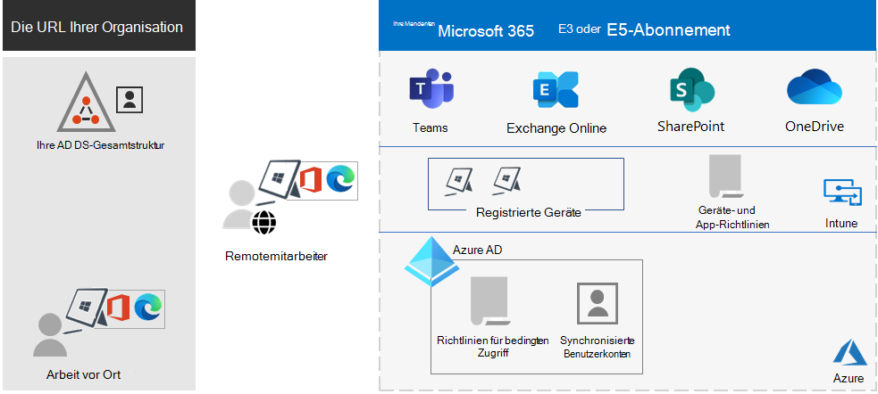

# Übersicht über Microsoft 365 Enterprise

Mit dieser intelligenten Microsoft 365 Enterprise-Komplettlösung kann jeder kreativ und sicher im Team arbeiten.

Microsoft 365 Enterprise eignet sich für große Unternehmen, kann aber auch für mittelständische und kleine Unternehmen verwendet werden, die die fortschrittlichsten Sicherheits- und Produktivitätsfunktionen benötigen.

## Komponenten

Microsoft 365 Enterprise besteht aus:

|Dienste|Beschreibung|
|---|---|
|Lokale Apps und cloudbasierte Apps und Produktivitätsdienste|Umfasst Microsoft 365 Apps for Enterprise, die neuesten Office-Apps für Ihren PC und Mac (z. B. Word, Excel, PowerPoint und Outlook) und den vollen Umfang von Onlinediensten für E-Mail, Dateispeicher und Zusammenarbeit, Besprechungen und vieles mehr.|
|Windows 10 Enterprise|Erfüllt die Bedürfnisse sowohl großer als auch mittelständischer Organisationen. Dies ist die produktivste und sicherste Version von Windows für Benutzer. Für IT-Experten bietet Sie zudem eine umfassende Bereitstellungs-, Geräte- und App-Verwaltung.|
|Geräteverwaltung und erweiterte Sicherheitsdienste|Enthält Microsoft Intune der ein cloudbasierter Enterprise Mobility-Verwaltungsdienst ist, der die Produktivität Ihrer Mitarbeiter unterstützt und gleichzeitig Ihre Unternehmensdaten schützt.|
|||

## Pläne

Microsoft 365 Enterprise steht in drei Plänen zur Verfügung.

|Planname|Funktionen|
|---|---|
|E3|Greifen Sie sicher auf Kernprodukte und -funktionen von Microsoft 365 zu, um die Produktivität am Arbeitsplatz sicher zu steigern und Innovationen voranzutreiben.|
|E5|Greifen Sie auf die neuesten Produkte und Features von Microsoft 365 zu. Diese beinhalten Defender für Office 365, Sicherheitstools und Tools für die Zusammenarbeit. Dieser Plan enthält alle E3-Funktionen sowie erweiterte Sicherheits-, Sprach- und Datenanalysetools.|
|F3|Stellen Sie eine Verbindung zu Ihren Außendienstmitarbeitern her, indem Sie ihnen mit bedarfsgerechten Tools und Ressourcen helfen, ihre Arbeit optimal zu erledigen.|
|||

Wenn Sie Microsoft 365 E3 besitzen, können Sie auch diese Add-Ons abrufen:

- Identitäts- und Bedrohungsschutz
- Schutz von Informationen und Compliance
- [Microsoft 365 E5 Compliance](https://www.microsoft.com/microsoft-365/business/e5-compliance)
- Microsoft 365 E5 Insider-Risiko

Microsoft 365 E3-Benutzer können mithilfe dieser Add-ons einige der zusätzlichen Features nutzen, die Microsoft 365 E5 enthält.

Weitere Informationen finden Sie unter [Funktionen und Features für jeden Plan](https://www.microsoft.com/microsoft-365/compare-all-microsoft-365-plans).

## Grundlegende Informationen

Das [Poster "Microsoft 365 Enterprise"](../downloads/Microsoft365Enterprise.pdf) bietet eine gute Übersicht:

- Die Vorteile von Microsoft 365 Enterprise und die Zuordnung von Anwendungen und Diensten zu den Wertpfeilern von Microsoft 365.
- Microsoft 365 Enterprise-Pläne und die enthaltenen Komponenten.
- Die wichtigsten Bestandteile des „Modern Workplace“ von Microsoft, die von Microsoft 365 Enterprise aktiviert werden können.
- Die [Microsoft 365-Produktivitätsbibliothek](https://www.microsoft.com/microsoft-365/success/) und repräsentative Szenarien für einige gemeinsame Organisationsabteilungen.

Sie können auch [eine Kopie des Posters herunterladen](https://github.com/MicrosoftDocs/microsoft-365-docs/raw/public/microsoft-365/downloads/Microsoft365Enterprise.pdf).

## Umstellung Ihrer gesamten Organisation

Um einen besseren Überblick darüber zu erhalten, wie Sie Ihre gesamte Organisation auf die Produkte und Dienste von Microsoft 365 Enterprise umstellen können, sehen Sie sich das [Poster zur Umstellung](https://download.microsoft.com/download/2/c/7/2c7bcc04-aae3-4604-9707-1ffff66b9851/transition-org-to-m365.pdf) an.

Dieses zweiseitige Poster bietet eine schnelle Methode, um Ihre vorhandene Infrastruktur aufzulisten. Es hilft Ihnen beim Auffinden des entsprechenden Produkts oder Diensts in Microsoft 365 Enterprise. Es enthält Windows- und Office-Produkte sowie weitere Infrastruktur- und Sicherheitselemente, wie z. B. Geräteverwaltung, sowie Identitäts-, Daten- und Bedrohungsschutz.

## Ende des Supports für Clients und Server von Windows 7 und Office 2010

[Windows 7](https://aka.ms/win7upgrade) erreichte am **14. Januar 2020** das Ende des Supports.

Der Support für diese Produkte endete am **13. Oktober 2020**:

- [Office 2010](https://docs.microsoft.com/DeployOffice/office-2010-end-support-roadmap)
- [Exchange Server 2010](exchange-2010-end-of-support.md)

Das Ende des Supports für [SharePoint Server 2010](upgrade-from-sharepoint-2010.md) wird am **13. April 2021** erreicht. 

Eine visuelle Zusammenfassung der Optionen für Upgrades, Migration und den Wechsel in die Cloud für diese Produkte finden Sie auf dem [Poster zum Ende des Supports](../downloads/Office2010Windows7EndOfSupport.pdf).

Dieses einseitige Poster veranschaulicht auf einfache Weise, welche verschiedenen Pfade Sie wählen können, um zu verhindern, dass Client- und Serverprodukte von Windows 7 und Office 2010 das Ende des Supports erreichen, wobei bevorzugte Pfade und Support in Microsoft 365 Enterprise hervorgehoben werden.

Sie können [dieses Poster herunterladen](https://github.com/MicrosoftDocs/microsoft-365-docs/raw/public/microsoft-365/downloads/Office2010Windows7EndOfSupport.pdf) und in den Formaten "Brief", "Legal" oder "Tabloid" (27,94 x 43,18 cm) ausdrucken.

## Planen und Bereitstellen von

Es gibt drei Möglichkeiten, die Produkte, Features und Komponenten von Microsoft 365 Enterprise zu planen und bereitzustellen:

- Zusammenarbeit mit FastTrack

   Mit FastTrack helfen Ihnen die Microsoft-Techniker, in Ihrem eigenen Tempo in die Cloud zu wechseln. Siehe [FastTrack für Microsoft 365](https://fasttrack.microsoft.com/microsoft365).

- Mithilfe von Microsoft Consulting Services oder eines [Microsoft-Partners](https://partner.microsoft.com/)

   Berater können Ihre aktuelle Infrastruktur analysieren und Ihnen helfen, einen Plan zu entwickeln, der die gesamte Software und alle Dienste von Microsoft 365 Enterprise umfasst.

- Selbstständig ausführen

   Beginnen Sie mit der [Networking-Roadmap](networking-roadmap-microsoft-365.md), um Ihre vorhandenen Infrastruktur- und Produktivitätslasten auszubauen oder zu überprüfen.

Ein Beispiel dafür, wie eine fiktive, aber repräsentative multinationale Organisation Microsoft 365 Enterprise eingesetzt hat, finden Sie in der [Contoso Corporation-Fallstudie](contoso-overview.md).

## Weitere Microsoft 365-Produkte

- [Microsoft 365 Business Premium](https://docs.microsoft.com/microsoft-365/business/)

  Kombinieren Sie die Funktionen in puncto Produktivität und Zusammenarbeit mit Geräte und Lösungen zum Schutz von Geschäftsdaten für kleine und mittlere Unternehmen.

- [Microsoft 365 Education](https://docs.microsoft.com/education)

  Setzen Sie Kreativität frei, fördern Sie die Zusammenarbeit, und stellen Sie eine einfache und sichere Erfahrung in einer einzelnen, bezahlbaren Lösung für das Bildungswesen bereit.

- [Microsoft 365 Government](https://www.microsoft.com/microsoft-365/government)

  Ermöglichen Sie den Mitarbeitern des öffentlichen Sektors der Vereinigten Staaten eine sichere Zusammenarbeit.

## Optimale Kombination mit Surface und dem Microsoft Edge-Browser

Optimieren Sie die integrierte und sichere Produktivität Ihrer Benutzer mit der besten Kombination aus Microsoft 365 Enterprise, Microsoft Surface-Geräten und dem Microsoft Edge-Browser. Diese produktübergreifende Integration bietet:

- Eine allgemeine Infrastruktur für Identitäts- und Anmeldesicherheit.
- Integrierte lokale und Cloud-Apps für Suche, Zusammenarbeit, Produktivität und Compliance.
- Umfassende und integrierte Sicherheit für Hardware, Browser, lokale Apps und Cloud-Apps.
- Eine allgemeine Infrastruktur für die IT-Verwaltung von Installationen und Updates.

Nachfolgend finden Sie ein Beispiel für eine Unternehmensorganisation.

Weitere Informationen und Konfigurationsbeispiele für kleine und mittelgroße Unternehmen sowie Bildungseinrichtungen erhalten Sie, indem Sie das [Poster „Optimale Kombination“](https://download.microsoft.com/download/2/8/d/28db0cf9-2f5a-4f63-91e2-46ff5c4d3baf/microsoft-best-together-poster.pdf) herunterladen.

## Microsoft 365-Schulung

Wenn Sie mehr über Microsoft 365 und die Arbeit an einer Microsoft 365-Zertifizierung wissen möchten, können Sie mit [Microsoft 365-zertifiziert: Grundlagen](https://docs.microsoft.com/learn/paths/m365-fundamentals/) beginnen.

## Siehe auch

[Microsoft 365 Enterprise-Produktseite](https://www.microsoft.com/microsoft-365/enterprise)
