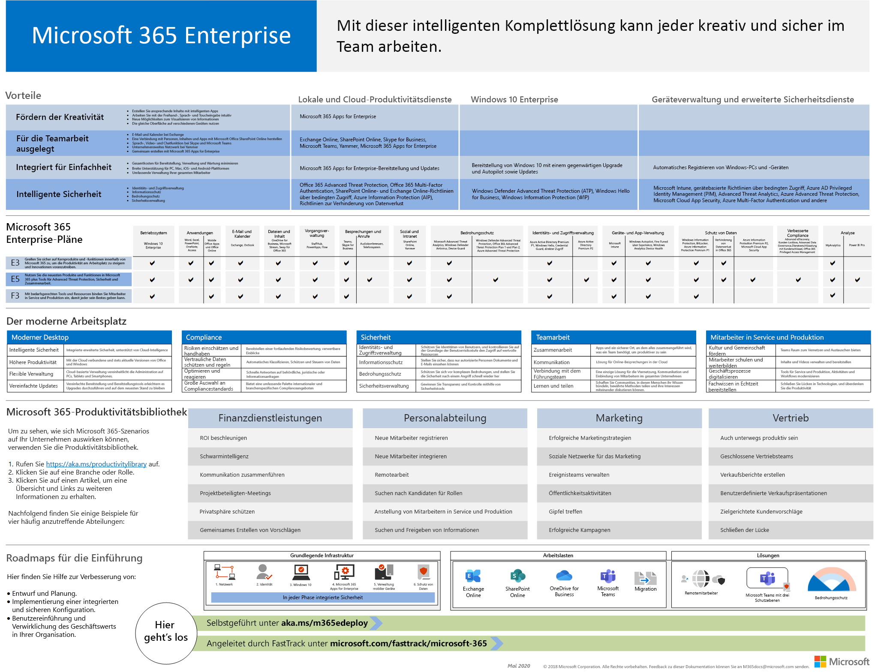
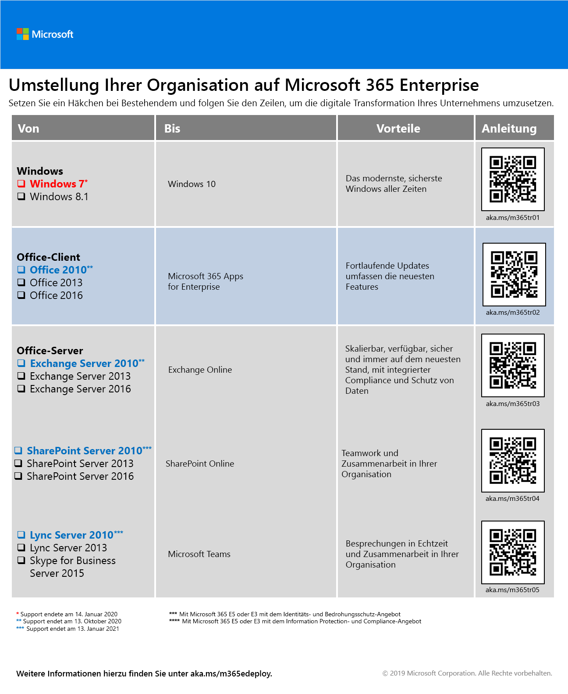
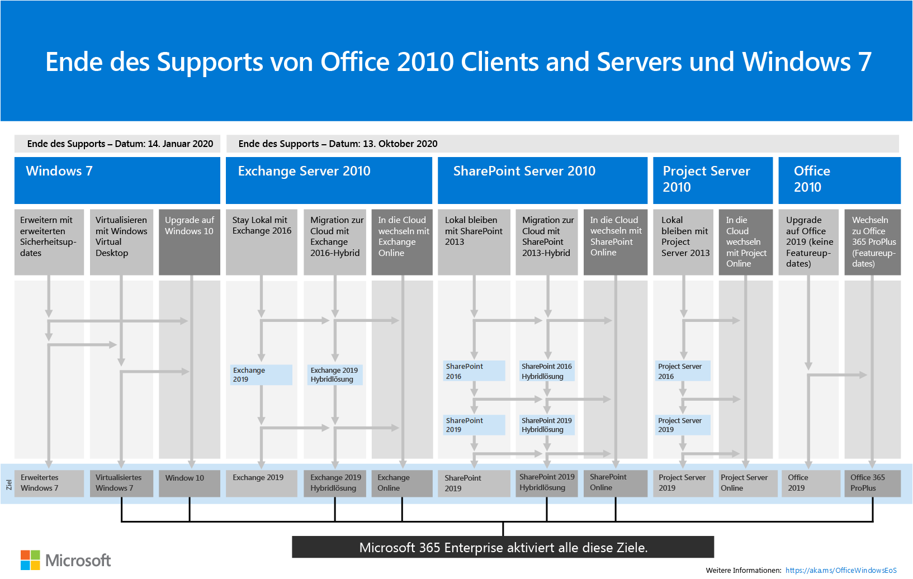

# Übersicht über Microsoft 365 EnterpriseMicrosoft 365 for enterprise overview

Microsoft 365 for Enterprise ist eine vollständige, intelligente Lösung, die es allen ermöglicht, kreativ zu sein und sicher zusammenzuarbeiten.Microsoft 365 for enterprise is a complete, intelligent solution that empowers everyone to be creative and work together securely. 

Obwohl für große Organisationen entwickelt, kann Microsoft 365 for Enterprise auch für mittelständische und kleine Unternehmen verwendet werden, die die fortschrittlichsten Sicherheits-und Produktivitätsfunktionen benötigen.Although designed for large organizations, Microsoft 365 for enterprise can also be used for medium-sized and small businesses that need the most advanced security and productivity capabilities. 

## KomponentenComponents

Microsoft 365 for Enterprise besteht aus folgenden Elementen:Microsoft 365 for enterprise consists of:

|||
|:-------|:-----|
| Lokale und Cloud-basierte apps und ProduktivitätsdiensteLocal and cloud-based apps and productivity services | Umfasst Office 365 ProPlus, die neuesten Office-Apps für Ihren PC und Mac (z. B. Word, Excel, PowerPoint und Outlook) und den vollen Umfang von Onlinediensten für E-Mail, Dateispeicher und Zusammenarbeit, Besprechungen und vieles mehr.Includes both Office 365 ProPlus, the latest Office apps for your PC and Mac (such as Word, Excel, PowerPoint, Outlook, and others), and a full suite of online services for email, file storage and collaboration, meetings, and more. |
| Windows 10 EnterpriseWindows 10 Enterprise | Erfüllt die Anforderungen von Groß-und mittelständischen Organisationen und stellt Benutzern die produktivste und sichere Version von Windows-und IT-Experten mit umfassender Bereitstellung, Geräte-und App-Verwaltung zur Verfügung.Addresses the needs of both large and midsize organizations, providing users with the most productive and secure version of Windows and IT professionals with comprehensive deployment, device, and app management. |
| Geräteverwaltung und erweiterte SicherheitsdiensteDevice management and advanced security services | Umfasst Microsoft InTune, ein Cloud-basierter Dienst für die Enterprise Mobility-Verwaltung (EMM), mit dem Ihre Mitarbeiter produktiv arbeiten und Ihre Unternehmensdaten geschützt werden können.Includes Microsoft Intune, which is a cloud-based enterprise mobility management (EMM) service that helps enable your workforce to be productive while keeping your corporate data protected. |
|||

## PlänePlans

Microsoft 365 for Enterprise ist in drei Plänen verfügbar.Microsoft 365 for enterprise is available in three plans.

|||
|:-------|:-----|
| E3E3 | Greifen Sie auf Kernprodukte und-Features in Microsoft 365 zu, um die Produktivität am Arbeitsplatz zu verbessern und Innovationen sicher zu fördern.Access core products and features within Microsoft 365 to enhance workplace productivity and drive innovation, securely. |
| E5E5 | Greifen Sie auf die neuesten Produkte und Features in Microsoft 365, einschließlich Advanced Threat Protection, Security and Collaboration Tools, zu..Access the latest products and features within Microsoft 365, including advanced threat protection, security and collaboration tools.. Umfasst alle E3's-Funktionen sowie erweiterte Sicherheits-, sprach-und Datenanalysetools.Includes all of E3's capabilities plus advanced security, voice, and data analysis tools. |
| F1F1 | Stellen Sie eine Verbindung mit ihren First-Workern über speziell entwickelte Tools und Ressourcen her, mit denen Sie Ihre besten Aufgaben erledigen können.Connect with your Firstline Workers through purpose-built tools and resources that allow them to do their best work. |
|||

Wenn Sie Microsoft 365 E3 haben, können Sie auch diese [Angebote](https://www.microsoft.com/microsoft-365/blog/2019/01/02/introducing-new-advanced-security-and-compliance-offerings-for-microsoft-365/)erhalten:If you have Microsoft 365 E3, you can also get these [offerings](https://www.microsoft.com/microsoft-365/blog/2019/01/02/introducing-new-advanced-security-and-compliance-offerings-for-microsoft-365/):

- Identitäts & BedrohungsschutzIdentity & Threat Protection
- Informationsschutz & ComplianceInformation Protection & Compliance

Diese Angebote enthalten zusätzliche Funktionen, die in Microsoft 365 E5 enthalten sind.These offerings contain additional features that are included with Microsoft 365 E5.

Weitere Informationen finden Sie unter [Features und Funktionen für jeden Plan](https://www.microsoft.com/microsoft-365/compare-all-microsoft-365-plans).For more information, see [Features and capabilities for each plan](https://www.microsoft.com/microsoft-365/compare-all-microsoft-365-plans).

## Holen Sie sich das große BildGet the big picture

Das [Poster Microsoft 365 for Enterprise](../media/m365-poster/Microsoft365Enterprise.pdf) ist ein zentraler Ort, an dem Sie Folgendes anzeigen können:The [Microsoft 365 for enterprise poster](../media/m365-poster/Microsoft365Enterprise.pdf) is a central location for you to view:

- Die Vorteile von Microsoft 365 für Unternehmen und wie apps und Dienste ihren Wert stützen zuordnenThe benefits of Microsoft 365 for enterprise and how apps and services map to its value pillars
- Microsoft 365 für Enterprise-Pläne und die darin enthaltenen KomponentenMicrosoft 365 for enterprise plans and which components they contain 
- Die wichtigsten Komponenten des modernen Arbeitsplatzes, die von Microsoft 365 für Unternehmen aktiviert werdenThe key components of the Modern Workplace, which Microsoft 365 for enterprise enables
- Die [Microsoft 365-Produktivitäts Bibliothek](https://www.microsoft.com/microsoft-365/success/) und repräsentative Szenarien für einige allgemeine OrganisationsabteilungenThe [Microsoft 365 Productivity Library](https://www.microsoft.com/microsoft-365/success/) and representative scenarios for some common organization departments
- Die Einführungs-Roadmap, die das Microsoft 365 for Enterprise [-Bereitstellungshandbuch](deploy-microsoft-365-enterprise.md) hervorhebtThe adoption roadmap that highlights the Microsoft 365 for enterprise [Deployment Guide](deploy-microsoft-365-enterprise.md)

Zum Herunterladen einer Kopie des Posters klicken Sie [hier](https://github.com/MicrosoftDocs/microsoft-365-docs/raw/public/microsoft-365/enterprise/media/m365-poster/Microsoft365Enterprise.pdf).To download a copy of the poster, click [here](https://github.com/MicrosoftDocs/microsoft-365-docs/raw/public/microsoft-365/enterprise/media/m365-poster/Microsoft365Enterprise.pdf).

## Umstellung Ihrer gesamten OrganisationTransition your entire organization

Um ein besseres Bild davon zu erhalten, wie Sie Ihre gesamte Organisation auf die Produkte und Dienste in Microsoft 365 for Enterprise umstellen können, laden Sie das [Transition-Poster](../media/deploy-microsoft-365-enterprise/transition-org-to-m365.pdf)herunter.To get a better picture of how to move your entire organization to the products and services in Microsoft 365 for enterprise, download the [transition poster](../media/deploy-microsoft-365-enterprise/transition-org-to-m365.pdf).

Dieses zweiseitige Poster ist eine schnelle Methode, um eine Übersicht Ihrer vorhandenen Infrastruktur zu erstellen, und bietet Anweisungen für den Wechsel zum entsprechenden Produkt oder Dienst in Microsoft 365 Enterprise.This two-page poster is a quick way to inventory your existing infrastructure and get to the guidance for moving to the corresponding product or service in Microsoft 365 for enterprise. Es enthält Windows- und Office-Produkte sowie weitere Infrastruktur- und Sicherheitselemente wie Geräteverwaltung, sowie Identitäts-, Daten- und Bedrohungsschutz.It includes Windows and Office products and other infrastructure and security elements such as device management, identity, and information and threat protection.

Sie können [dieses Poster herunterladen](https://github.com/MicrosoftDocs/microsoft-365-docs/raw/public/microsoft-365/enterprise/media/deploy-microsoft-365-enterprise/transition-org-to-m365.pdf) und in den Formaten "Brief", "Legal" oder "Tabloid" (27,94 x 43,18 cm) ausdrucken.You can also [download this poster](https://github.com/MicrosoftDocs/microsoft-365-docs/raw/public/microsoft-365/enterprise/media/deploy-microsoft-365-enterprise/transition-org-to-m365.pdf) and print it in letter, legal, or tabloid (11 x 17) formats.

## Vermeiden des Endes der Unterstützung für Windows 7-und Office 2010-Clients und-ServerAvoid end of support for Windows 7 and Office 2010 clients and servers

Die folgenden Produkte erreichen das Ende der Unterstützung am **14. Januar 2020**:The following products reach end of support on **January 14, 2020**:

- [Windows 7Windows 7](https://aka.ms/win7upgrade)

Die folgenden Produkte erreichen das Ende der Unterstützung am **13. Oktober 2020**:The following products reach end of support on  **October 13, 2020**:

- [Office 2010Office 2010](https://docs.microsoft.com/DeployOffice/office-2010-end-support-roadmap)
- [Exchange Server 2010Exchange Server 2010](https://docs.microsoft.com/office365/enterprise/exchange-2010-end-of-support)
- [SharePoint Server 2010SharePoint Server 2010](https://docs.microsoft.com/office365/enterprise/upgrade-from-sharepoint-2010)

Eine visuelle Zusammenfassung der Optionen für Upgrades, Migration und den Wechsel in die Cloud für diese Produkte finden Sie auf dem [Poster zum Ende des Supports](../media/migration-microsoft-365-enterprise-workload/Office2010Windows7EndOfSupport.pdf).For a visual summary of the upgrade, migrate, and move-to-the-cloud options for these products, see the [end of support poster](../media/migration-microsoft-365-enterprise-workload/Office2010Windows7EndOfSupport.pdf).

Dieses einseitige Poster ist eine schnelle Möglichkeit, die verschiedenen Pfade zu verstehen, die Sie ergreifen können, um zu verhindern, dass Windows 7 und Office 2010 Client-und Serverprodukte das Ende der Unterstützung erreichen, wobei bevorzugte Pfade und Unterstützung in Microsoft 365 for Enterprise hervorgehoben sind.This one-page poster is a quick way to understand the various paths you can take to prevent Windows 7 and Office 2010 client and server products from reaching end of support, with preferred paths and support in Microsoft 365 for enterprise highlighted.

Sie können [dieses Poster herunterladen](https://github.com/MicrosoftDocs/microsoft-365-docs/raw/public/microsoft-365/enterprise/media/migration-microsoft-365-enterprise-workload/Office2010Windows7EndOfSupport.pdf) und in den Formaten "Brief", "Legal" oder "Tabloid" (27,94 x 43,18 cm) ausdrucken.You can also [download this poster](https://github.com/MicrosoftDocs/microsoft-365-docs/raw/public/microsoft-365/enterprise/media/migration-microsoft-365-enterprise-workload/Office2010Windows7EndOfSupport.pdf) and print it in letter, legal, or tabloid (11 x 17) formats.

## BereitstellenDeploy

Es gibt drei Möglichkeiten, die Produkte, Features und Komponenten von Microsoft 365 für Unternehmen bereitzustellen:There are three ways to deploy the products, features, and components of Microsoft 365 for enterprise:

1. In Partnerschaft mit dem Kurzarbeits-In partnership with FastTrack
  
   Mit dem Kurztext helfen Ihnen Microsoft-Ingenieure, in Ihrem eigenen Tempo in die Cloud zu gelangen.With FastTrack, Microsoft engineers help you move to the cloud at your own pace. Siehe [FastTrack für Microsoft 365](https://fasttrack.microsoft.com/microsoft365).See [FastTrack for Microsoft 365](https://fasttrack.microsoft.com/microsoft365).
  
2. Mithilfe von Microsoft Consulting Services oder eines Microsoft- [Partners](https://partner.microsoft.com/).With the help of Microsoft Consulting Services or a [Microsoft partner](https://partner.microsoft.com/).

   Berater können Ihre aktuelle Infrastruktur analysieren und Ihnen bei der Entwicklung eines Plans zur Integration aller Software und Dienste von Microsoft 365 für Unternehmen helfen.Consultants can analyze your current infrastructure and help you develop a plan to incorporate all of the software and services of Microsoft 365 for enterprise.

3. Selbst ausführenDo it yourself

   Das [Microsoft 365 for Enterprise-Bereitstellungshandbuch](deploy-microsoft-365-enterprise.md) führt Sie Schritt für Schritt durch die Entwicklung der Infrastruktur-und Produktivitäts Arbeitslasten.The [Microsoft 365 for enterprise deployment guide](deploy-microsoft-365-enterprise.md) takes you step by step through building out the infrastructure and productivity workloads. 

Weitere Informationen zur Bereitstellung finden Sie unter How:For more deployment information, see how:

- [Kunden](deploy-microsoft-365-enterprise.md#how-customers-use-microsoft-365-for-enterprise) verwenden Microsoft 365 für Unternehmen.[Customers](deploy-microsoft-365-enterprise.md#how-customers-use-microsoft-365-for-enterprise)  use Microsoft 365 for enterprise.
- [Microsoft](deploy-microsoft-365-enterprise.md#how-microsoft-uses-microsoft-365-for-enterprise) verwendet Microsoft 365 für Enterprise.[Microsoft](deploy-microsoft-365-enterprise.md#how-microsoft-uses-microsoft-365-for-enterprise) uses Microsoft 365 for enterprise.
- [Die Contoso Corporation](contoso-overview.md), eine fiktive, aber repräsentative multinationale Organisation, hat Microsoft 365 für Unternehmen bereitgestellt.[The Contoso Corporation](contoso-overview.md), a fictional but representative multinational organization, has deployed Microsoft 365 for enterprise.

## Weitere Microsoft 365-LösungenAdditional Microsoft 365 solutions

- [Microsoft 365 BusinessMicrosoft 365 Business](https://docs.microsoft.com/microsoft-365/business/)
 
  Kombinieren Sie die Funktionen von Office 365 in puncto Produktivität und Zusammenarbeit mit Geräte und Lösungen zum Schutz von Geschäftsdaten für kleine und mittlere Unternehmen (SMB).Bring together the best-in-class productivity and collaboration capabilities of Office 365 with device management and security solutions to safeguard business data for small and midsize businesses (SMB).

- [Microsoft 365 EducationMicrosoft 365 Education](https://docs.microsoft.com/education)
 
  Setzen Sie Kreativität frei, fördern Sie die Zusammenarbeit, und stellen Sie eine einfache und sichere Erfahrung in einer einzelnen, bezahlbaren Lösung für das Bildungswesen bereit.Empower educators to unlock creativity, promote teamwork, and provide a simple and safe experience in a single, affordable solution built for education.

- [Microsoft 365 GovernmentMicrosoft 365 Government](https://www.microsoft.com/microsoft-365/government)
 
  Bevollmächtigen Sie die Mitarbeiter des öffentlichen Sektors für die Zusammenarbeit, sicher.Empower United States public sector employees to work together, securely.

## Microsoft 365-SchulungMicrosoft 365 training

|||
|:-------|:-----|
| Lassen Sie sich selbst geschult und auf eine Microsoft 365-Zertifizierung hinarbeiten.Get yourself trained and work towards a Microsoft 365 certification.   Beginnen Sie mit [Microsoft 365 Fundamentals](https://docs.microsoft.com/learn/paths/m365-fundamentals/).Start with [Microsoft 365 Fundamentals](https://docs.microsoft.com/learn/paths/m365-fundamentals/).
|||

## Nächster SchrittNext step

Wenn Sie die Bereitstellung selbst ausführen, starten Sie die [Bereitstellungs Reise von Microsoft 365 für Enterprise](deploy-microsoft-365-enterprise.md).If you're doing the deployment yourself, start your [Microsoft 365 for enterprise deployment journey](deploy-microsoft-365-enterprise.md).

## Weitere ArtikelSee also

[Microsoft 365 für Enterprise-ProduktseiteMicrosoft 365 for enterprise product page](https://www.microsoft.com/microsoft-365/enterprise)
