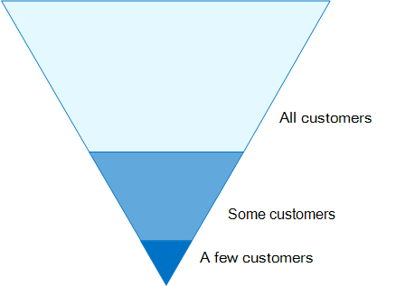

# Konfigurationen für den Identitäts- und Gerätezugriff

In dieser Artikelreihe wird beschrieben, wie Sie den sicheren Zugriff auf Cloud-Dienste über Enterprise Mobility + Security (EMS)-Produkte konfigurieren, indem Sie eine empfohlene Umgebung und Konfiguration implementieren, einschließlich einer vorgegebenen Reihe von Richtlinien für bedingten Zugriff und der zugehörigen Funktionen. EMS ist eine Kernkomponente von Microsoft 365. Sie können diese Anleitung verwenden, um den Zugriff auf alle Dienste zu schützen, die in Azure-Active Directory integriert sind, einschließlich Microsoft 365-Dienste, andere Saas-Dienste und lokale Anwendungen, die mit Azure AD Application Proxy veröffentlicht werden. 

Diese Empfehlungen sind sowohl mit Microsoft Secure Score als auch mit [der Identitäts Bewertung in Azure AD](https://docs.microsoft.com/azure/active-directory/fundamentals/identity-secure-score)ausgerichtet und verbessern diese Ergebnisse für Ihre Organisation. Diese Empfehlungen helfen Ihnen auch beim Implementieren dieser [fünf Schritte zum Sichern Ihrer Identitätsinfrastruktur](https://docs.microsoft.com/azure/security/azure-ad-secure-steps). 

Microsoft ist bewusst, dass einige Organisationen über eindeutige Umgebungsanforderungen oder-Komplexitäten verfügen. Wenn Sie eine dieser Organisationen sind, verwenden Sie diese Empfehlungen als Ausgangspunkt. Die meisten Organisationen können diese Empfehlungen jedoch wie vorgeschrieben implementieren. 

## Zielgruppe

Diese Empfehlungen sind für Enterprise-Architekten und IT-Experten gedacht, die mit [Office 365](https://docs.microsoft.com/microsoft-365/admin) und [Microsoft Enterprise Mobility + Security](https://microsoft.com/ems)vertraut sind, dazu gehören unter anderem Azure Active Directory (Identity), Microsoft InTune (Geräteverwaltung) und Azure Information Protection (Datenschutz).

### Kundenumgebung

Die empfohlenen Richtlinien gelten für Unternehmensorganisationen, die sowohl in der Microsoft-Cloud als auch für Kunden mit hybrider Infrastruktur (sowohl lokal als auch in der Microsoft-Cloud) tätig sind.

Viele der bereitgestellten Empfehlungen basieren auf Diensten, die nur mit Enterprise Mobility + Security (EMS) E5-Lizenzen verfügbar sind. Empfehlungen werden vollständige EMS E5-Lizenz Funktionen angenommen.

Für Organisationen, die nicht über Enterprise Mobility + Security E5-Lizenzen verfügen, empfiehlt Microsoft, dass Sie mindestens Azure AD grundlegenden Schutzfunktionen implementieren, die in allen Plänen enthalten sind. Weitere Informationen finden Sie im Artikel [What is Baseline Protection](/azure/active-directory/active-directory-conditional-access-baseline-protection)in der Azure AD Library.

### Warnhinweise

Ihre Organisation unterliegt möglicherweise behördlichen oder anderen Compliance-Anforderungen, einschließlich spezifischer Empfehlungen, bei denen Sie möglicherweise Richtlinien anwenden müssen, die von diesen empfohlenen Konfigurationen abweichen. Bei diesen Konfigurationen werden Verwendungs Steuerelemente empfohlen, die nicht historisch verfügbar waren. Wir empfehlen diese Steuerelemente, da wir glauben, dass Sie ein Gleichgewichtzwischen Sicherheit und Produktivität darstellen.  

Wir haben unser Bestes getan, um eine Vielzahl von organisatorischen Schutzanforderungen zu erfüllen, aber wir können nicht alle möglichen Anforderungen oder alle einzigartigen Aspekte Ihrer Organisation berücksichtigen.

## Drei Schutzebenen

Die meisten Organisationen haben spezifische Anforderungen bezüglich Datensicherheit und Datenschutz. Diese Anforderungen variieren je nach Branche und Tätigkeiten im Unternehmen. Beispielsweise können Ihre Rechtsabteilung und Administratoren zusätzliche Sicherheits-und Informationsschutz Kontrollen in Ihrer e-Mail-Korrespondenz erfordern, die für andere Geschäftsbereichs Benutzer nicht erforderlich sind. 

Jede Branche verfügt auch über ihren eigenen Satz von spezialisierten Vorschriften. Anstatt eine Liste aller möglichen Sicherheitsoptionen oder einer Empfehlung pro Branchensegment oder Auftragsfunktion bereitzustellen, wurden Empfehlungen für drei verschiedene Sicherheits-und Schutzstufen bereitgestellt, die basierend auf der Granularität Ihrer Anforderungen angewendet werden können.

- **Grund**legender Schutz: Es wird empfohlen, einen Mindeststandard zum Schutz von Daten sowie die Identitäten und Geräte festzulegen, die auf Ihre Daten zugreifen. Sie können diese grundlegenden Empfehlungen befolgen, um einen starken Standardschutz bereitzustellen, der die Anforderungen vieler Organisationen erfüllt.
- **Vertraulicher Schutz**: einige Kunden verfügen über eine Teilmenge von Daten, die auf höheren Ebenen geschützt werden müssen, oder Sie erfordern möglicherweise, dass alle Daten auf einer höheren Ebene geschützt werden. Sie können einen erhöhten Schutz für alle oder bestimmte Datensätze in Ihrer Microsoft 365-Umgebung anwenden. Es wird empfohlen, Identitäten und Geräte mit Zugriff auf sensible Daten mit einem vergleichbaren Grad an Sicherheit auszustatten.  
- **Stark reguliert**: einige Organisationen haben möglicherweise eine kleine Menge an Daten, die streng klassifiziert sind, Geschäftsgeheimnisse darstellen oder regulierte Daten sind. Microsoft stellt Funktionen bereit, die es Organisationen ermöglichen, diese Anforderungen zu erfüllen, wie etwa den zusätzlichen Schutz von Identitäten und Geräten.

In diesem Leitfaden erfahren Sie, wie Sie den Schutz von Identitäten und Geräten für jede dieser Schutzebenen implementieren. Verwenden Sie diese Anleitung als Ausgangspunkt für Ihre Organisation, und passen Sie die Richtlinien an die spezifischen Anforderungen Ihrer Organisation an.

Es ist wichtig, konsistente Schutzebenen für Daten, Identitäten und Geräte zu verwenden. Wenn Sie beispielsweise diesen Leitfaden implementieren, müssen Sie Ihre Daten auf vergleichbaren Ebenen schützen. Diese Architekturmodelle zeigen Ihnen, welche Funktionen vergleichbar sind.

**Identität- und Geräteschutz für Office 365** 
 
[PDF](https://go.microsoft.com/fwlink/p/?linkid=841656) | [Visio](https://go.microsoft.com/fwlink/p/?linkid=841657) | [Weitere Sprachen](https://www.microsoft.com/download/details.aspx?id=55032)

**Lösungen zum Schutz von Dateien in Office 365** 
 
[PDF](https://download.microsoft.com/download/7/8/9/789645A5-BD10-4541-BC33-F8D1EFF5E911/MSFT_cloud_architecture_O365%20file%20protection.pdf) | [Visio](https://download.microsoft.com/download/7/8/9/789645A5-BD10-4541-BC33-F8D1EFF5E911/MSFT_cloud_architecture_O365%20file%20protection.vsdx)

## Kompromisse in den Bereichen Sicherheit und Produktivität

Die Implementierung einer Sicherheitsstrategie erfordert Kompromisse zwischen Sicherheit und Produktivität. Es ist hilfreich, zu bewerten, wie sich jede Entscheidung auf das Gleichgewichtzwischen Sicherheit, Funktionalität und Benutzerfreundlichkeit auswirkt.

Die bereitgestellten Empfehlungen basieren auf folgenden Grundsätzen:

- Kennen Sie Ihre Zielgruppe, und lassen Sie sich flexibel an Ihre Sicherheits-und Funktionsanforderungen anpassen.
- Wenden Sie eine Sicherheitsrichtlinie rechtzeitig an, und stellen Sie sicher, dass Sie sinnvoll ist.

## Dienste und Konzepte für den Identitäts-und Gerätezugriffs Schutz

Microsoft 365 Enterprise wurde für große Organisationen entwickelt und integriert Office 365 Enterprise, Windows 10 Enterprise und Enterprise Mobility + Security (EMS), damit jeder kreativ sein und sicher zusammenarbeiten kann.

Dieser Abschnitt enthält eine Übersicht über die Microsoft 365-Dienste und-Funktionen, die für den Identitäts-und Geräte Zugriff wichtig sind.

### Microsoft Azure Active Directory

Azure Ad bietet eine umfassende Sammlung von Funktionen zur Identitätsverwaltung. Zur Sicherung des Zugriffs empfehlen wir die Verwendung der folgenden Funktionen:

- **[Self-Service Password Reset (SSPR)](/azure/active-directory/authentication/concept-sspr-howitworks)**: ermöglichen Sie Ihren Benutzern, ihre Kennwörter sicher und ohne Helpdesk-Eingriff zurückzusetzen, indem Sie die Überprüfung von mehreren Authentifizierungsmethoden bereitstellen, die der Administrator steuern kann.

- **[Mehrstufige Authentifizierung (MFA)](/azure/active-directory/authentication/concept-mfa-howitworks)**: MFA erfordert, dass Benutzer zwei Arten der Überprüfung bereitstellen, beispielsweise ein Benutzerkennwort sowie eine Benachrichtigung von der Microsoft Authenticator-APP oder einem Telefonanruf. MFA reduziert erheblich das Risiko, dass eine gestohlene Identität für den Zugriff auf Ihre Umgebung verwendet werden kann.

- **[Bedingter Zugriff](/azure/active-directory/conditional-access/overview)**: Azure AD wertet die Bedingungen der Benutzeranmeldung aus und verwendet Richtlinien für den bedingten Zugriff, die Sie erstellen, um den Zugriff zuzulassen. In diesem Leitfaden erfahren Sie beispielsweise, wie Sie eine Richtlinie für den bedingten Zugriff erstellen, um die Geräte Konformität für den Zugriff auf vertrauliche Daten zu erfordern. Dadurch wird das Risiko, dass ein Hacker mit einer gestohlenen Identität auf Ihre vertraulichen Daten zugreifen kann, erheblich reduziert. Außerdem werden vertrauliche Daten auf den Geräten geschützt, da die Geräte bestimmte Anforderungen an Sicherheit und Gesundheitsschutz erfüllen.

- **[Azure Ad Gruppen](/azure/active-directory/fundamentals/active-directory-manage-groups)**: Regeln für bedingten Zugriff, Geräteverwaltung mit InTune und sogar Berechtigungen für Dateien und Websites in Ihrer Organisation basieren auf Zuweisung zu Benutzer-und/oder Azure Ad Gruppen. Es wird empfohlen, Azure Ad Gruppen zu erstellen, die den von Ihnen implementierten Schutzebenen entsprechen. Beispielsweise sind Ihre Führungskräfte wahrscheinlich höhere Wert Ziele für Hacker. Daher ist es sinnvoll, diese Mitarbeiter einer Azure Ad Gruppe zuzuweisen und diese Gruppe den Richtlinien für bedingten Zugriff und anderen Richtlinien zuzuweisen, die eine höhere Schutzebene für den Zugriff erzwingen.

- **[Geräteregistrierung](/azure/active-directory/devices/overview)**: Sie registrieren ein Gerät in Azure AD, um dem Gerät eine Identität zur Verfügung zu stellen. Diese Identität wird verwendet, um das Gerät zu authentifizieren, wenn ein Benutzer sich anmeldet und Regeln für den bedingten Zugriff anwendet, die Domänenbeitritt oder kompatible PCs erfordern. Für diesen Leitfaden verwenden wir die Geräteregistrierung, um automatisch mit der Domäne verbundene Windows-Computer zu registrieren. Die Geräteregistrierung ist eine Voraussetzung für die Verwaltung von Geräten mit InTune. 

- **[Azure AD Identity Protection](/azure/active-directory/identity-protection/overview)**: mit Azure AD Identity Protection können Sie potenzielle Sicherheitsrisiken erkennen, die sich auf die Identitäten Ihrer Organisation auswirken, und die Richtlinie für automatische Korrekturen auf niedriges, mittleres und hohes Anmelde-und Benutzer Risiko konfigurieren. Dieser Leitfaden basiert auf dieser Risikobewertung, um Richtlinien für bedingten Zugriff für mehrstufige Authentifizierung anzuwenden. Dieser Leitfaden enthält auch eine Richtlinie für den bedingten Zugriff, bei der Benutzer Ihr Kennwort ändern müssen, wenn für Ihr Kontoaktivitäten mit hohem Risiko erkannt werden.

### Microsoft Intune

[InTune](https://docs.microsoft.com/intune/introduction-intune) ist der Cloud-basierte Verwaltungsdienst von Microsoft für mobile Geräte. In diesem Leitfaden wird die Geräteverwaltung von Windows-PCs mit InTune empfohlen und die Konfiguration von Richtlinienkonfigurationen für Geräte Konformität empfohlen. InTune ermittelt, ob Geräte kompatibel sind, und sendet diese Daten an Azure AD, die beim Anwenden von Richtlinien für den bedingten Zugriff verwendet werden sollen.

#### InTune-App-Schutz

[InTune-App-Schutz](https://docs.microsoft.com/intune/app-protection-policy) Richtlinien können verwendet werden, um die Daten Ihrer Organisation in Mobile Apps zu schützen, mit oder ohne Registrierung von Geräten in der Verwaltung. InTune hilft, Informationen zu schützen, um sicherzustellen, dass Ihre Mitarbeiter produktiv bleiben und Datenverluste verhindern. Durch die Implementierung von Richtlinien auf App-Ebene können Sie den Zugriff auf Unternehmensressourcen einschränken und Daten im Rahmen der Steuerung Ihrer IT-Abteilung verwalten.

In diesem Leitfaden erfahren Sie, wie Sie empfohlene Richtlinien erstellen, um die Verwendung genehmigter apps zu erzwingen und zu ermitteln, wie diese apps mit ihren Geschäftsdaten verwendet werden können.

### Microsoft 365

In diesem Leitfaden erfahren Sie, wie Sie eine Reihe von Richtlinien implementieren, um den Zugriff auf Office 365 zu schützen, einschließlich Exchange Online, SharePoint Online und OneDrive für Unternehmen. Zusätzlich zur Implementierung dieser Richtlinien sollten Sie auch den Schutzgrad für Ihren Mandanten mit diesen Ressourcen erhöhen:

- [Konfigurieren Sie Ihren Mandanten für mehr Sicherheit](https://docs.microsoft.com/microsoft-365/security/office-365-security/tenant-wide-setup-for-increased-security): Diese Empfehlungen gelten für die grundlegende Sicherheit Ihres Mandanten.
- [Microsoft 365 Security Roadmap: die wichtigsten Prioritäten für die ersten 30 Tage, 90 Tage und darüber hinaus](https://docs.microsoft.com/microsoft-365/security/office-365-security/security-roadmap): Diese Empfehlungen umfassen Protokollierung, Datensteuerung, Administratorzugriff und Bedrohungsschutz.

### Windows 10 und Microsoft 365 Apps for Enterprise

Windows 10 und Microsoft 365 apps for Enterprise sind die empfohlene Clientumgebung für PCs. Windows 10 wird empfohlen, da Azure so konzipiert ist, dass es sowohl lokal als auch Azure AD eine möglichst reibungslose Umgebung bietet. Windows 10 umfasst außerdem erweiterte Sicherheitsfunktionen, die über InTune verwaltet werden können. Microsoft 365 apps for Enterprise enthält die neuesten Versionen von Office-Anwendungen. Diese verwenden moderne Authentifizierung, die sicherer und eine Anforderung für bedingten Zugriff ist. Zu diesen apps gehören auch erweiterte Sicherheits-und Compliance-Tools.

## Anwenden dieser Funktionen auf die drei Schutzebenen

In der folgenden Tabelle sind unsere Empfehlungen für die Verwendung dieser Funktionen in den drei Schutzebenen zusammengefasst.

|Schutzmechanismus|Baseline|Vertraulich|Streng geregelt|
|:-------------------|:-------|:--------|:---------------|
|**MFA erzwingen**|Bei mittlerem oder höherem Anmelderisiko|Bei niedrigem oder höherem Anmelderisiko|Auf alle neuen Sitzungen|
|**Erzwingen der Kennwortänderung**|Für Benutzer mit hohem Risiko|Für Benutzer mit hohem Risiko|Für Benutzer mit hohem Risiko|
|**Erzwingen des InTune-Anwendungsschutzes**|Ja|Ja|Ja|
|**Erzwingen der InTune-Registrierung (COD)**|Erfordern eines kompatiblen oder einer Domäne beigetretenen PCs, aber zulassen von BYOD-Telefonen/-Tablets|Erfordern eines kompatiblen oder mit der Domäne verbundenen Geräts|Erfordern eines kompatiblen oder mit der Domäne verbundenen Geräts|

## Gerätebesitz

Die obige Tabelle zeigt den Trend vieler Organisationen zur Unterstützung einer Kombination aus unternehmenseigenen Geräten sowie persönlichen oder eigenen Geräten (BYODs), um die mobile Produktivität für die gesamte Belegschaft zu ermöglichen. Mit InTune-App-Schutzrichtlinien wird sichergestellt, dass e-Mails vor exfiltrating aus dem Outlook-Mobile App und anderen Office-Mobile Apps geschützt werden, sowohl auf unternehmenseigenen Geräten als auch auf BYODs.  

Wir empfehlen, dass unternehmenseigene Geräte von InTune oder von der Domäne verbunden verwaltet werden, um zusätzliche Schutzmaßnahmen und Steuerelemente anzuwenden. Je nach Daten Empfindlichkeit kann Ihre Organisation festlegen, dass BYODs für bestimmte Benutzer Populationen oder bestimmte apps nicht zulässig ist.

## Nächste Schritte

[Erforderliche Arbeit für die Implementierung von Identitäts-und Gerätezugriffs Richtlinien](identity-access-prerequisites.md)
