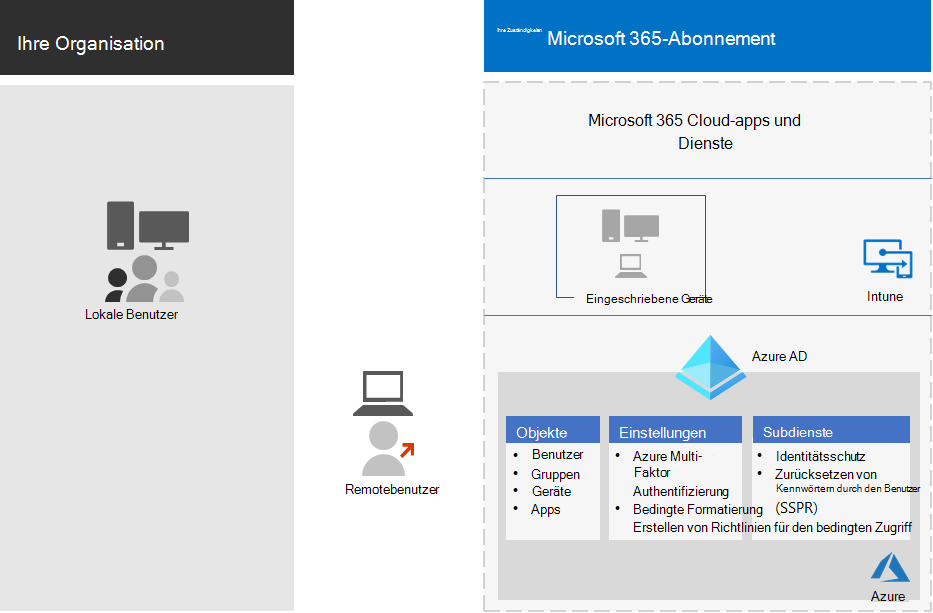

# Konfigurationen für den Identitäts- und GerätezugriffIdentity and device access configurations

Der moderne Sicherheitsumfang Ihrer Organisation reicht nun über das Netzwerk hinaus und umfasst Benutzer, die von einem beliebigen Standort mit einer Vielzahl von Geräten auf Cloud-basierte apps zugreifen.The modern security perimeter of your organization now extends beyond your network to include users accessing cloud-based apps from any location with a variety of devices. Ihre Sicherheitsinfrastruktur muss ermitteln, ob eine bestimmte Zugriffsanforderung erteilt werden soll und unter welchen Bedingungen.Your security infrastructure needs to determine whether a given access request should be granted and under what conditions. 

Diese Bestimmung sollte auf dem Benutzerkonto der Anmeldung, dem verwendeten Gerät, der APP, die der Benutzer für den Zugriff verwendet, dem Standort, von dem die Zugriffsanforderung erfolgt, und einer Bewertung des Risikos der Anforderung basieren.This determination should be based on the user account of the sign-in, the device being used, the app the user is using for access, the location from which the access request is made, and an assessment of the risk of the request. Diese Funktion trägt dazu bei, sicherzustellen, dass nur autorisierte Benutzer und Geräte auf Ihre kritischen Ressourcen zugreifen können.This capability helps ensure that only approved users and devices can access your critical resources.

In dieser Artikelreihe werden eine Reihe von erforderlichen Konfigurationen für den Identitäts-und Geräte Zugriff sowie eine Reihe von bedingten Zugriffen auf Azure Active Directory (Azure AD), Microsoft InTune und andere Richtlinien zum Sichern des Zugriffs auf Microsoft 365 für Enterprise-Cloud-apps und-Dienste, andere Saas-Dienste und lokale Anwendungen beschrieben, die mit Azure AD-Anwendungs Proxy veröffentlicht werden.This series of articles describes a set of identity and device access prerequisite configurations and a set of Azure Active Directory (Azure AD) Conditional Access, Microsoft Intune, and other policies to secure access to Microsoft 365 for enterprise cloud apps and services, other SaaS services, and on-premises applications published with Azure AD Application Proxy.

Einstellungen und Richtlinien für den Identitäts-und Geräte Zugriff werden auf drei Ebenen empfohlen: Basisschutz, vertraulicher Schutz und Schutz für Umgebungen mit stark regulierten oder klassifizierten Daten.Identity and device access settings and policies are recommended in three tiers: baseline protection, sensitive protection, and protection for environments with highly regulated or classified data. Diese Ebenen und die entsprechenden Konfigurationen bieten einheitliche Schutzniveaus für Ihre Daten, Identitäten und Geräte.These tiers and their corresponding configurations provide consistent levels of protection across your data, identities, and devices.

Diese Funktionen und ihre Empfehlungen:These capabilities and their recommendations:

- Werden in Microsoft 365 E3 und Microsoft 365 E5 unterstützt.Are supported in Microsoft 365 E3 and Microsoft 365 E5.
- Werden sowohl mit [Microsoft Secure Score](https://docs.microsoft.com/microsoft-365/security/mtp/microsoft-secure-score) als auch mit dem [Ergebnis der Identitäts Bewertung in Azure AD](https://docs.microsoft.com/azure/active-directory/fundamentals/identity-secure-score)ausgerichtet und werden diese Ergebnisse für Ihre Organisation verbessern.Are aligned with [Microsoft Secure Score](https://docs.microsoft.com/microsoft-365/security/mtp/microsoft-secure-score) as well as [identity score in Azure AD](https://docs.microsoft.com/azure/active-directory/fundamentals/identity-secure-score), and will increase these scores for your organization.
- Hilft Ihnen bei der Implementierung dieser [fünf Schritte zur Sicherung ihrer Identitätsinfrastruktur](https://docs.microsoft.com/azure/security/azure-ad-secure-steps).Will help you implement these [five steps to securing your identity infrastructure](https://docs.microsoft.com/azure/security/azure-ad-secure-steps).

Wenn Ihre Organisation eindeutige Umgebungsanforderungen oder Komplexitäten aufweist, verwenden Sie diese Empfehlungen als Ausgangspunkt.If your organization has unique environment requirements or complexities, use these recommendations as a starting point. Die meisten Organisationen können diese Empfehlungen jedoch wie vorgeschrieben implementieren.However, most organizations can implement these recommendations as prescribed.

>[!Note]
>Microsoft verkauft außerdem Enterprise Mobility + Security (EMS)-Lizenzen für Office 365 Abonnements.Microsoft also sells Enterprise Mobility + Security (EMS) licenses for Office 365 subscriptions. Die Funktionen EMS E3 und EMS E5 entsprechen denen in Microsoft 365 E3 und Microsoft 365 E5.EMS E3 and EMS E5 capabilities are equivalent to those in Microsoft 365 E3 and Microsoft 365 E5. Details finden Sie unter [EMS-Pläne](https://www.microsoft.com/en-us/microsoft-365/enterprise-mobility-security/compare-plans-and-pricing) .See [EMS plans](https://www.microsoft.com/en-us/microsoft-365/enterprise-mobility-security/compare-plans-and-pricing) for the details.
>

## ZielgruppeIntended audience

Diese Empfehlungen sind für Enterprise-Architekten und IT-Experten gedacht, die mit Microsoft 365 Cloud Productivity and Security Services vertraut sind, einschließlich Azure AD (Identity), Microsoft InTune (Device Management) und Azure Information Protection (Datenschutz).These recommendations are intended for enterprise architects and IT professionals who are familiar with Microsoft 365 cloud productivity and security services, which includes Azure AD (identity), Microsoft Intune (device management), and Azure Information Protection (data protection).

### KundenumgebungCustomer environment

Die empfohlenen Richtlinien gelten für Unternehmensorganisationen, die vollständig innerhalb der Microsoft-Cloud und für Kunden mit hybrider Identitätsinfrastruktur, die eine lokale Active Directory-Domänendienste (AD DS) Gesamtstruktur ist, die mit einem Azure AD Mandanten synchronisiert ist.The recommended policies are applicable to enterprise organizations operating both entirely within the Microsoft cloud and for customers with hybrid identity infrastructure, which is an on-premises Active Directory Domain Services (AD DS) forest that is synchronized with an Azure AD tenant.

Viele der bereitgestellten Empfehlungen stützen sich auf Dienste, die nur mit Microsoft 365 E5, Microsoft 365 E3 mit dem Identity & Threat Protection-Add-on, EMS E5 oder Azure Premium P2-Lizenzen verfügbar sind.Many of the provided recommendations rely on services available only with Microsoft 365 E5, Microsoft 365 E3 with the Identity & Threat Protection add-on, EMS E5, or Azure Premium P2 licenses.

Für Organisationen, die nicht über diese Lizenzen verfügen, empfiehlt Microsoft, dass Sie mindestens [Sicherheitsstandards](https://docs.microsoft.com/azure/active-directory/fundamentals/concept-fundamentals-security-defaults)implementieren, die in allen Microsoft 365-Plänen enthalten sind.For those organizations who do not have these licenses, Microsoft recommends you at least implement [security defaults](https://docs.microsoft.com/azure/active-directory/fundamentals/concept-fundamentals-security-defaults), which is included with all Microsoft 365 plans. 

### WarnhinweiseCaveats

Ihre Organisation unterliegt möglicherweise behördlichen oder anderen Compliance-Anforderungen, einschließlich spezifischer Empfehlungen, bei denen Sie möglicherweise Richtlinien anwenden müssen, die von diesen empfohlenen Konfigurationen abweichen.Your organization may be subject to regulatory or other compliance requirements, including specific recommendations that may require you to apply policies that diverge from these recommended configurations. Bei diesen Konfigurationen werden Verwendungs Steuerelemente empfohlen, die nicht historisch verfügbar waren.These configurations recommend usage controls that have not historically been available. Wir empfehlen diese Steuerelemente, da wir glauben, dass Sie ein Gleichgewichtzwischen Sicherheit und Produktivität darstellen.We recommend these controls because we believe they represent a balance between security and productivity.  

Wir haben unser Bestes getan, um eine Vielzahl von organisatorischen Schutzanforderungen zu erfüllen, aber wir können nicht alle möglichen Anforderungen oder alle einzigartigen Aspekte Ihrer Organisation berücksichtigen.We've done our best to account for a wide variety of organizational protection requirements, but we're not able to account for all possible requirements or for all the unique aspects of your organization.

## Drei SchutzebenenThree tiers of protection

Die meisten Organisationen haben spezifische Anforderungen bezüglich Datensicherheit und Datenschutz.Most organizations have specific requirements regarding security and data protection. Diese Anforderungen variieren je nach Branche und Tätigkeiten im Unternehmen.These requirements vary by industry segment and by job functions within organizations. Beispielsweise benötigen Ihre Rechtsabteilung und Administratoren möglicherweise zusätzliche Sicherheits-und Informationsschutz Kontrollen rund um Ihre e-Mail-Korrespondenz, die für andere Geschäftseinheiten nicht erforderlich sind.For example, your legal department and administrators might require additional security and information protection controls around their email correspondence that are not required for other business units. 

Jede Branche verfügt auch über ihren eigenen Satz von spezialisierten Vorschriften.Each industry also has their own set of specialized regulations. Anstatt eine Liste aller möglichen Sicherheitsoptionen oder einer Empfehlung pro Branchensegment oder Auftragsfunktion bereitzustellen, wurden Empfehlungen für drei verschiedene Sicherheits-und Schutzstufen bereitgestellt, die basierend auf der Granularität Ihrer Anforderungen angewendet werden können.Rather than providing a list of all possible security options or a recommendation per industry segment or job function, recommendations have been provided for three different tiers of security and protection that can be applied based on the granularity of your needs.

- **Grund**legender Schutz: Es wird empfohlen, einen Mindeststandard zum Schutz von Daten sowie die Identitäten und Geräte festzulegen, die auf Ihre Daten zugreifen.**Baseline protection**: We recommend you establish a minimum standard for protecting data, as well as the identities and devices that access your data. Sie können diese grundlegenden Empfehlungen befolgen, um einen starken Standardschutz bereitzustellen, der die Anforderungen vieler Organisationen erfüllt.You can follow these baseline recommendations to provide strong default protection that meets the needs of many organizations.
- **Vertraulicher Schutz**: einige Kunden verfügen über eine Teilmenge von Daten, die auf höheren Ebenen geschützt werden müssen, oder Sie erfordern möglicherweise, dass alle Daten auf einer höheren Ebene geschützt werden.**Sensitive protection**: Some customers have a subset of data that must be protected at higher levels, or they may require all data to be protected at a higher level. Sie können einen erhöhten Schutz für alle oder bestimmte Datensätze in Ihrer Microsoft 365-Umgebung anwenden.You can apply increased protection to all or specific data sets in your Microsoft 365 environment. Es wird empfohlen, Identitäten und Geräte mit Zugriff auf sensible Daten mit einem vergleichbaren Grad an Sicherheit auszustatten.We recommend protecting identities and devices that access sensitive data with comparable levels of security.  
- **Stark reguliert**: einige Organisationen haben möglicherweise eine kleine Menge an Daten, die streng klassifiziert sind, Geschäftsgeheimnisse darstellen oder regulierte Daten sind.**Highly regulated**: Some organizations may have a small amount of data that is highly classified, constitutes trade secrets, or is regulated data. Microsoft stellt Funktionen bereit, die es Organisationen ermöglichen, diese Anforderungen zu erfüllen, wie etwa den zusätzlichen Schutz von Identitäten und Geräten.Microsoft provides capabilities to help organizations meet these requirements, including added protection for identities and devices.

In diesem Leitfaden erfahren Sie, wie Sie den Schutz von Identitäten und Geräten für jede dieser Schutzebenen implementieren.This guidance shows you how to implement protection for identities and devices for each of these tiers of protection. Verwenden Sie diese Anleitung als Ausgangspunkt für Ihre Organisation, und passen Sie die Richtlinien an die spezifischen Anforderungen Ihrer Organisation an.Use this guidance as a starting point for your organization and adjust the policies to meet your organization's specific requirements.

Es ist wichtig, konsistente Schutzebenen für Daten, Identitäten und Geräte zu verwenden.It's important to use consistent levels of protection across your data, identities, and devices. Wenn Sie beispielsweise diesen Leitfaden implementieren, müssen Sie Ihre Daten auf vergleichbaren Ebenen schützen.For example, if you implement this guidance, be sure to protect your data at comparable levels. 

Der **Identitäts-und Geräteschutz für das Microsoft 365-** Architekturmodell zeigt Ihnen, welche Funktionen vergleichbar sind.The **Identity and device protection for Microsoft 365** architecture model shows you which capabilities are comparable.

    [Als PDF anzeigen](../downloads/MSFT_cloud_architecture_identity&device_protection.pdf) \| [Als PDF](https://github.com/MicrosoftDocs/microsoft-365-docs/raw/public/microsoft-365/downloads/MSFT_cloud_architecture_identity&device_protection.pdf) \| herunterladen [Als Visio herunterladen](https://github.com/MicrosoftDocs/microsoft-365-docs/raw/public/microsoft-365/downloads/MSFT_cloud_architecture_identity&device_protection.vsdx)  [View as a PDF](../downloads/MSFT_cloud_architecture_identity&device_protection.pdf) \| [Download as a PDF](https://github.com/MicrosoftDocs/microsoft-365-docs/raw/public/microsoft-365/downloads/MSFT_cloud_architecture_identity&device_protection.pdf)  \| [Download as a Visio](https://github.com/MicrosoftDocs/microsoft-365-docs/raw/public/microsoft-365/downloads/MSFT_cloud_architecture_identity&device_protection.vsdx)

Weitere Informationen finden Sie unter [Deploy Information Protection for Data Privacy Regulations](../solutions/information-protection-deploy.md) Solution zum Schutz der in Microsoft 365 gespeicherten Informationen.Additionally, see the [Deploy information protection for data privacy regulations](../solutions/information-protection-deploy.md) solution to protect information stored in Microsoft 365.

## Kompromisse in den Bereichen Sicherheit und ProduktivitätSecurity and productivity trade-offs

Die Implementierung einer Sicherheitsstrategie erfordert Kompromisse zwischen Sicherheit und Produktivität.Implementing any security strategy requires trade-offs between security and productivity. Es ist hilfreich, zu bewerten, wie sich jede Entscheidung auf das Gleichgewichtzwischen Sicherheit, Funktionalität und Benutzerfreundlichkeit auswirkt.It's helpful to evaluate how each decision affects the balance of security, functionality, and ease of use.

Die bereitgestellten Empfehlungen basieren auf folgenden Grundsätzen:The recommendations provided are based on the following principles:

- Kennen Sie Ihre Benutzer, und lassen Sie sich an Ihre Sicherheits-und Funktionsanforderungen flexibel anpassen.Know your users and be flexible to their security and functional requirements.
- Wenden Sie eine Sicherheitsrichtlinie rechtzeitig an, und stellen Sie sicher, dass Sie sinnvoll ist.Apply a security policy just in time and ensure it is meaningful.

## Dienste und Konzepte für den Identitäts-und Gerätezugriffs SchutzServices and concepts for identity and device access protection

Microsoft 365 für Unternehmen wurde für große Organisationen entwickelt, die es ermöglichen, kreativ zu sein und sicher zusammenzuarbeiten.Microsoft 365 for enterprise is designed for large organizations to empower everyone to be creative and work together securely.

Dieser Abschnitt enthält eine Übersicht über die Microsoft 365-Dienste und-Funktionen, die für den Identitäts-und Geräte Zugriff wichtig sind.This section provides an overview of the Microsoft 365 services and capabilities that are important for identity and device access.

### Azure ADAzure AD

Azure Ad bietet eine umfassende Sammlung von Funktionen zur Identitätsverwaltung.Azure AD provides a full suite of identity management capabilities. Es wird empfohlen, diese Funktionen zum Sichern des Zugriffs zu verwenden.We recommend using these capabilities to secure access.

| Funktion oder FeatureCapability or feature | BeschreibungDescription | LizenzierungLicensing |
|:-------|:-----|:-------|
| [Mehrstufige Authentifizierung (MFA)Multi-factor authentication (MFA)](/azure/active-directory/authentication/concept-mfa-howitworks) | Für MFA müssen Benutzer zwei Arten der Überprüfung bereitstellen, beispielsweise ein Benutzerkennwort sowie eine Benachrichtigung über die Microsoft Authenticator-APP oder einen Anruf.MFA requires users to provide two forms of verification, such as a user password plus a notification from the Microsoft Authenticator app or a phone call. MFA reduziert das Risiko, dass gestohlene Anmeldeinformationen für den Zugriff auf Ihre Umgebung verwendet werden können, erheblich.MFA greatly reduces the risk that stolen credentials can be used to access your environment. Microsoft 365 verwendet den Azure-mehrstufigen Authentifizierungsdienst für MFA-basierte Anmeldungen.Microsoft 365 uses the Azure Multi-Factor Authentication service for MFA-based sign-ins. | Microsoft 365 E3 oder E5Microsoft 365 E3 or E5 |
| [Bedingter ZugriffConditional Access](/azure/active-directory/conditional-access/overview) | Azure AD wertet die Bedingungen der Benutzeranmeldung aus und verwendet Richtlinien für den bedingten Zugriff, um den zulässigen Zugriff zu bestimmen.Azure AD evaluates the conditions of the user sign-in and uses Conditional Access policies to determine the allowed access. In diesem Leitfaden erfahren Sie beispielsweise, wie Sie eine Richtlinie für den bedingten Zugriff erstellen, um die Geräte Konformität für den Zugriff auf vertrauliche Daten zu erfordern.For example, in this guidance we show you how to create a Conditional Access policy to require device compliance for access to sensitive data. Dadurch wird das Risiko erheblich reduziert, dass ein Hacker mit seinem eigenen Gerät und die gestohlenen Anmeldeinformationen auf Ihre vertraulichen Daten zugreifen können.This greatly reduces the risk that a hacker with their own device and stolen credentials can access your sensitive data. Außerdem werden vertrauliche Daten auf den Geräten geschützt, da die Geräte bestimmte Anforderungen an die Integrität und Sicherheit erfüllen müssen.It also protects sensitive data on the devices, because the devices must meet specific requirements for health and security. | Microsoft 365 E3 oder E5Microsoft 365 E3 or E5 |
| [Azure Ad GruppenAzure AD groups](/azure/active-directory/fundamentals/active-directory-manage-groups) | Bedingte Zugriffsrichtlinien, Geräteverwaltung mit InTune und sogar Berechtigungen für Dateien und Websites in Ihrer Organisation beruhen auf der Zuweisung zu Benutzerkonten oder Azure Ad Gruppen.Conditional Access policies, device management with Intune, and even permissions to files and sites in your organization rely on the assignment to user accounts or Azure AD groups. Es wird empfohlen, Azure Ad Gruppen zu erstellen, die den von Ihnen implementierten Schutzebenen entsprechen.We recommend you create Azure AD groups that correspond to the levels of protection you are implementing. Beispielsweise sind Ihre Führungskräfte wahrscheinlich höhere Wert Ziele für Hacker.For example, your executive staff are likely higher value targets for hackers. Daher ist es sinnvoll, die Benutzerkonten dieser Mitarbeiter einer Azure Ad Gruppe hinzuzufügen und diese Gruppe den Richtlinien für bedingten Zugriff und anderen Richtlinien zuzuweisen, die eine höhere Schutzebene für den Zugriff erzwingen.Therefore, it makes sense to add the user accounts of these employees to an Azure AD group and assign this group to Conditional Access policies and other policies that enforce a higher level of protection for access. | Microsoft 365 E3 oder E5Microsoft 365 E3 or E5 |
| [GeräteregistrierungDevice enrollment](/azure/active-directory/devices/overview) | Sie registrieren ein Gerät in Azure AD, um eine Identität für das Gerät zu erstellen.You enroll a device into Azure AD to create an identity for the device. Diese Identität wird verwendet, um das Gerät zu authentifizieren, wenn ein Benutzer sich anmeldet und Richtlinien für bedingten Zugriff anwendet, die Domänenbeitritt oder kompatible PCs erfordern.This identity is used to authenticate the device when a user signs in and to apply Conditional Access policies that require domain-joined or compliant PCs. Für diesen Leitfaden verwenden wir die Geräteregistrierung, um Domänenbeitritt von Windows-Computern automatisch zu registrieren.For this guidance, we use device enrollment to automatically enroll domain-joined Windows computers. Die Geräteregistrierung ist eine Voraussetzung für die Verwaltung von Geräten mit InTune.Device enrollment is a prerequisite for managing devices with Intune. | Microsoft 365 E3 oder E5Microsoft 365 E3 or E5 |
| [Azure AD Identity ProtectionAzure AD Identity Protection](/azure/active-directory/identity-protection/overview) | Ermöglicht Ihnen das Erkennen potenzieller Sicherheitsanfälligkeiten, die sich auf die Identitäten Ihrer Organisation auswirken, und die Konfiguration der automatischen Behebungs Richtlinie auf niedrigem, mittlerem und hohem Anmelde-und Benutzer Risiko.Enables you to detect potential vulnerabilities affecting your organization's identities and configure automated remediation policy to low, medium, and high sign-in risk and user risk. Dieser Leitfaden basiert auf dieser Risikobewertung, um Richtlinien für bedingten Zugriff für mehrstufige Authentifizierung anzuwenden.This guidance relies on this risk evaluation to apply Conditional Access policies for multi-factor authentication. Dieser Leitfaden enthält auch eine Richtlinie für den bedingten Zugriff, bei der Benutzer Ihr Kennwort ändern müssen, wenn für Ihr Kontoaktivitäten mit hohem Risiko erkannt werden.This guidance also includes a Conditional Access policy that requires users to change their password if high-risk activity is detected for their account. | Microsoft 365 E5, Microsoft 365 E3 mit dem Identity & Threat Protection-Add-on, EMS E5 oder Azure Premium P2-LizenzenMicrosoft 365 E5, Microsoft 365 E3 with the Identity & Threat Protection add-on, EMS E5, or Azure Premium P2 licenses |
| [Zurücksetzen von Kennwörtern durch den Benutzer (Self-Service Password Reset, SSPR)Self-service password reset (SSPR)](/azure/active-directory/authentication/concept-sspr-howitworks) | Ermöglichen Sie Ihren Benutzern, ihre Kennwörter sicher und ohne Helpdesk-Eingriff zurückzusetzen, indem Sie die Überprüfung von mehreren Authentifizierungsmethoden bereitstellen, die der Administrator steuern kann.Allow your users to reset their passwords securely and without help-desk intervention, by providing verification of multiple authentication methods that the administrator can control. | Microsoft 365 E3 oder E5Microsoft 365 E3 or E5 |
| [Azure AD KennwortschutzAzure AD password protection](https://docs.microsoft.com/azure/active-directory/authentication/concept-password-ban-bad) | Erkennen und blockieren Sie bekannte schwache Kennwörter und deren Varianten sowie zusätzliche schwache Ausdrücke, die für Ihre Organisation spezifisch sind.Detect and block known weak passwords and their variants and additional weak terms that are specific to your organization. Listen standardmäßig global gesperrter Kennwörter werden automatisch auf alle Benutzer in einem Azure AD-Mandanten angewendet.Default global banned password lists are automatically applied to all users in an Azure AD tenant. Sie können zusätzliche Einträge in einer benutzerdefinierten Liste gesperrter Kennwörter angeben.You can define additional entries in a custom banned password list. Wenn Benutzer ihre Kennwörter ändern oder zurücksetzen, werden diese Listen gesperrter Kennwörter überprüft, um die Verwendung von sicheren Kennwörtern zu erzwingen.When users change or reset their passwords, these banned password lists are checked to enforce the use of strong passwords. |  Microsoft 365 E3 oder E5Microsoft 365 E3 or E5 |
||||

### Microsoft IntuneMicrosoft Intune

[InTune](https://docs.microsoft.com/intune/introduction-intune) ist der Cloud-basierte Verwaltungsdienst von Microsoft für mobile Geräte.[Intune](https://docs.microsoft.com/intune/introduction-intune) is Microsoft's cloud-based mobile device management service. In diesem Leitfaden wird die Geräteverwaltung von Windows-PCs mit InTune empfohlen und die Konfiguration von Richtlinienkonfigurationen für Geräte Konformität empfohlen.This guidance recommends device management of Windows PCs with Intune and recommends device compliance policy configurations. InTune ermittelt, ob Geräte kompatibel sind, und sendet diese Daten an Azure AD, die beim Anwenden von Richtlinien für den bedingten Zugriff verwendet werden sollen.Intune determines whether devices are compliant and sends this data to Azure AD to use when applying Conditional Access policies.

#### InTune-App-SchutzIntune app protection

[InTune-App-Schutz](https://docs.microsoft.com/intune/app-protection-policy) Richtlinien können verwendet werden, um die Daten Ihrer Organisation in Mobile Apps zu schützen, mit oder ohne Registrierung von Geräten in der Verwaltung.[Intune app protection](https://docs.microsoft.com/intune/app-protection-policy) policies can be used to protect your organization's data in mobile apps, with or without enrolling devices into management. InTune hilft, Informationen zu schützen, um sicherzustellen, dass Ihre Mitarbeiter produktiv bleiben und Datenverluste verhindern.Intune helps protect information, making sure your employees can still be productive, and preventing data loss. Durch die Implementierung von Richtlinien auf App-Ebene können Sie den Zugriff auf Unternehmensressourcen einschränken und Daten im Rahmen der Steuerung Ihrer IT-Abteilung verwalten.By implementing app-level policies, you can restrict access to company resources and keep data within the control of your IT department.

In diesem Leitfaden erfahren Sie, wie Sie empfohlene Richtlinien erstellen, um die Verwendung genehmigter apps zu erzwingen und zu ermitteln, wie diese apps mit ihren Geschäftsdaten verwendet werden können.This guidance shows you how to create recommended policies to enforce the use of approved apps and to determine how these apps can be used with your business data.

### Microsoft 365Microsoft 365

Dieser Leitfaden zeigt Ihnen, wie Sie eine Reihe von Richtlinien implementieren, um den Zugriff auf Microsoft 365-Cloud-Dienste zu schützen, einschließlich Microsoft Teams, Exchange Online, SharePoint Online und OneDrive für Unternehmen.This guidance shows you how to implement a set of policies to protect access to Microsoft 365 cloud services, including Microsoft Teams, Exchange Online, SharePoint Online, and OneDrive for Business. Zusätzlich zur Implementierung dieser Richtlinien sollten Sie auch den Schutzgrad für Ihren Mandanten mit diesen Ressourcen erhöhen:In addition to implementing these policies, we recommend you also raise the level of protection for your tenant using these resources:

- [Konfigurieren Ihres Mandanten für höhere SicherheitConfigure your tenant for increased security](../security/office-365-security/tenant-wide-setup-for-increased-security.md)

  Empfehlungen, die für die grundlegende Sicherheit für Ihren Mandanten gelten.Recommendations that apply to baseline security for your tenant.

- [Sicherheits Wegweiser: wichtige Prioritäten für die ersten 30 Tage, 90 Tage und darüber hinausSecurity roadmap: Top priorities for the first 30 days, 90 days, and beyond](../security/office-365-security/security-roadmap.md)

  Empfehlungen einschließlich Protokollierung, Datensteuerung, Administratorzugriff und Bedrohungsschutz.Recommendations that include logging, data governance, admin access, and threat protection.

### Windows 10 und Microsoft 365 Apps for EnterpriseWindows 10 and Microsoft 365 Apps for enterprise

Windows 10 mit Microsoft 365 apps for Enterprise ist die empfohlene Clientumgebung für PCs.Windows 10 with Microsoft 365 Apps for enterprise is the recommended client environment for PCs. Windows 10 wird empfohlen, da Azure so konzipiert ist, dass es sowohl lokal als auch Azure AD eine möglichst reibungslose Umgebung bietet.We recommend Windows 10 because Azure is designed to provide the smoothest experience possible for both on-premises and Azure AD. Windows 10 umfasst außerdem erweiterte Sicherheitsfunktionen, die über InTune verwaltet werden können.Windows 10 also includes advanced security capabilities that can be managed through Intune. Microsoft 365 apps for Enterprise enthält die neuesten Versionen von Office-Anwendungen.Microsoft 365 Apps for enterprise includes the latest versions of Office applications. Diese verwenden moderne Authentifizierung, die sicherer und eine Anforderung für bedingten Zugriff ist.These use modern authentication, which is more secure and a requirement for Conditional Access. Zu diesen apps gehören auch erweiterte Sicherheits-und Compliance-Tools.These apps also include enhanced security and compliance tools.

## Anwenden dieser Funktionen auf die drei SchutzebenenApplying these capabilities across the three tiers of protection

In der folgenden Tabelle sind unsere Empfehlungen für die Verwendung dieser Funktionen in den drei Schutzebenen zusammengefasst.The following table summarizes our recommendations for using these capabilities across the three tiers of protection.

|SchutzmechanismusProtection mechanism|BaselineBaseline|VertraulichSensitive|Streng geregeltHighly regulated|
|:-------------------|:-------|:--------|:---------------|
|**MFA erzwingen****Enforce MFA**|Bei mittlerem oder höherem AnmelderisikoOn medium or above sign-in risk|Bei niedrigem oder höherem AnmelderisikoOn low or above sign-in risk|Auf alle neuen SitzungenOn all new sessions|
|**Erzwingen der Kennwortänderung****Enforce password change**|Für Benutzer mit hohem RisikoFor high-risk users|Für Benutzer mit hohem RisikoFor high-risk users|Für Benutzer mit hohem RisikoFor high-risk users|
|**Erzwingen des InTune-Anwendungsschutzes****Enforce Intune application protection**|JaYes|JaYes|JaYes|
|**Erzwingen der InTune-Registrierung für das organisationseigene Gerät****Enforce Intune enrollment for organization-owned device**|Erfordern eines kompatiblen oder von einer Domäne verbundenen PCs, aber zulassen von BYOD-Telefonen und Tablets für eigene GeräteRequire a compliant or domain-joined PC, but allow bring-your-own devices (BYOD) phones and tablets|Erfordern eines kompatiblen oder mit der Domäne verbundenen GerätsRequire a compliant or domain-joined device|Erfordern eines kompatiblen oder mit der Domäne verbundenen GerätsRequire a compliant or domain-joined device|

## GerätebesitzDevice ownership

Die obige Tabelle zeigt den Trend vieler Organisationen zur Unterstützung einer Kombination aus unternehmenseigenen Geräten sowie persönlichen oder BYODs, um die mobile Produktivität für die gesamte Belegschaft zu ermöglichen.The above table reflects the trend for many organizations to support a mix of organization-owned devices, as well as personal or BYODs to enable mobile productivity across the workforce. Mit InTune-App-Schutzrichtlinien wird sichergestellt, dass e-Mails vor exfiltrating aus dem Outlook-Mobile App und anderen Office-Mobile Apps geschützt werden, sowohl auf organisationseigenen Geräten als auch auf BYODs.Intune app protection policies ensure that email is protected from exfiltrating out of the Outlook mobile app and other Office mobile apps, on both organization-owned devices and BYODs.  

Es wird empfohlen, dass unternehmenseigene Geräte von InTune oder von der Domäne verbunden verwaltet werden, um zusätzliche Schutzmaßnahmen und Steuerelemente anzuwenden.We recommend organization-owned devices be managed by Intune or domain-joined to apply additional protections and control. Je nach Daten Empfindlichkeit kann Ihre Organisation festlegen, dass BYODs für bestimmte Benutzer Populationen oder bestimmte apps nicht zulässig ist.Depending on data sensitivity, your organization may choose to not allow BYODs for specific user populations or specific apps.

## Bereitstellung und ihre appsDeployment and your apps

Vor dem Konfigurieren und Rollout der Konfiguration für den Identitäts-und Geräte Zugriff für Ihre Azure AD integrierten Apps müssen Sie Folgendes tun:Prior to configuring and rolling out identity and device access configuration for your Azure AD-integrated apps, you must: 

- Entscheiden Sie, welche apps in Ihrer Organisation verwendet werden sollen, die Sie schützen möchten.Decide which apps used in your organization you want to protect. 
- Analysieren Sie diese Liste von apps, um die Gruppen von Richtlinien zu ermitteln, die angemessene Schutzstufen bieten.Analyze this list of apps to determine the sets of policies that provide appropriate levels of protection. 

  Sie sollten keine separaten Sätze von Richtlinien für jede APP erstellen, da deren Verwaltung umständlich werden kann.You should not create separate sets of policies each for app because management of them can become cumbersome. Microsoft empfiehlt, dass Sie Ihre apps gruppieren, die dieselben Schutzanforderungen für dieselben Benutzer aufweisen.Microsoft recommends that you group your apps that have the same protection requirements for the same users. 

  Sie können beispielsweise eine Reihe von Richtlinien haben, die alle Microsoft 365-Apps für alle Benutzer zum grundlegenden Schutz und einen zweiten Richtliniensatz für alle vertraulichen Apps enthalten, beispielsweise die von Mitarbeitern oder Finanzabteilungen verwendeten, und diese auf diese Gruppen anwenden.For example, you could have one set of policies that include all Microsoft 365 apps for all of your users for baseline protection and a second set of policies for all sensitive apps, such as those used by human resources or finance departments, and apply them to those groups. 

Nachdem Sie die Richtlinien für die apps bestimmt haben, die Sie sichern möchten, führen Sie die Richtlinien für die Benutzer inkrementell aus, um Probleme auf dem Weg zu behandeln.Once you have determined the set of policies for the apps you want to secure, roll the policies out to your users incrementally, addressing issues along the way.  

Konfigurieren Sie beispielsweise die Richtlinien, die für alle Microsoft 365-Apps verwendet werden sollen, nur Exchange Online mit den zusätzlichen Änderungen für Exchange.For example, configure the policies that will be used for all your Microsoft 365 apps for just Exchange Online with the additional changes for Exchange. Rollen Sie diese Richtlinien für die Benutzer aus, und arbeiten Sie mit allen Problemen.Roll these policies out to your users and work through any issues. Fügen Sie dann Teams mit den weiteren Änderungen hinzu, und Rollen Sie diese für Ihre Benutzer aus.Then, add Teams with its additional changes and roll this out to your users. Fügen Sie dann SharePoint mit seinen zusätzlichen Änderungen hinzu.Then, add SharePoint with its additional changes. Fügen Sie weiterhin die restlichen apps hinzu, bis Sie diese grundlegenden Richtlinien so konfigurieren können, dass Sie alle Microsoft 365-apps einschließen.Continue adding the rest of your apps until you can confidently configure these baseline policies to include all Microsoft 365 apps. 

Ebenso können Sie für Ihre vertraulichen apps den Richtliniensatz erstellen und jeweils eine APP hinzufügen und alle Probleme durchlaufen, bis Sie alle in der Richtlinie für vertrauliche App-Richtliniensätze enthalten sind.Similarly, for your sensitive apps, create the set of policies and add one app at a time and work through any issues until they are all included in the sensitive app policy set. 

Microsoft empfiehlt, keine Richtliniensätze zu erstellen, die für alle apps gelten, da dies zu unbeabsichtigten Konfigurationen führen kann.Microsoft recommends that you do not create policy sets that apply to all apps because it can result in some unintended configurations. Beispielsweisekönnten Richtlinien, die alle apps blockieren, Ihre Administratoren aus dem Azure-Portal sperren, und Ausschlüsse können nicht für wichtige Endpunkte wie Microsoft Graph konfiguriert werden.For example, policies that block all apps could lock your admins out of the Azure portal and exclusions cannot be configured for important endpoints such as Microsoft Graph. 

## Schritte beim Konfigurieren des Identitäts-und GerätezugriffsSteps in the process of configuring identity and device access

1. Konfigurieren Sie die erforderlichen Identitätsfeatures und deren Einstellungen.Configure prerequisite identity features and their settings.
2. Konfigurieren der allgemeinen Identitäts-und Zugriffsrichtlinien für den bedingten Zugriff.Configure the common identity and access Conditional Access policies.
3. Konfigurieren Sie Richtlinien für bedingten Zugriff für Gast-und externe Benutzer.Configure Conditional Access policies for guest and external users.
4. Konfigurieren Sie Richtlinien für bedingten Zugriff für Microsoft 365 Cloud-apps wie Microsoft Teams, Exchange Online und SharePoint.Configure Conditional Access policies for Microsoft 365 cloud apps such as Microsoft Teams, Exchange Online, and SharePoint.

## Nächster SchrittNext step

[Erforderliche Arbeit für die Implementierung von Identitäts-und Gerätezugriffs RichtlinienPrerequisite work for implementing identity and device access policies](identity-access-prerequisites.md)
