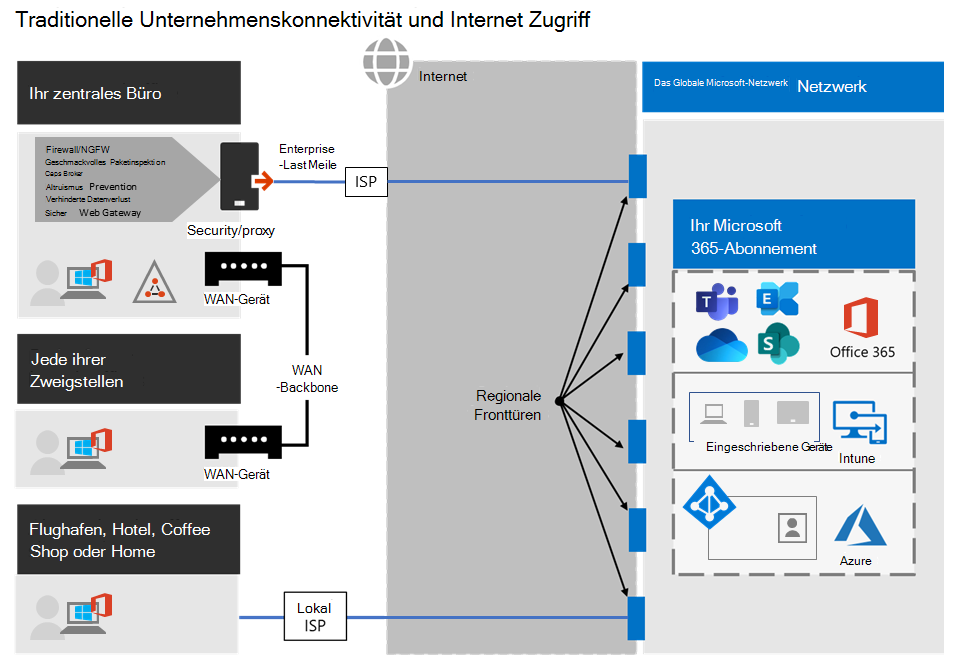
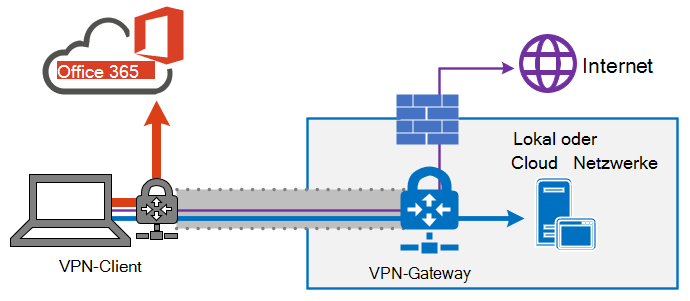
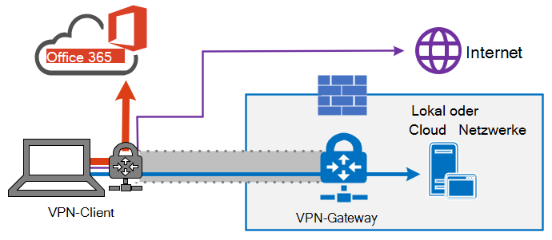
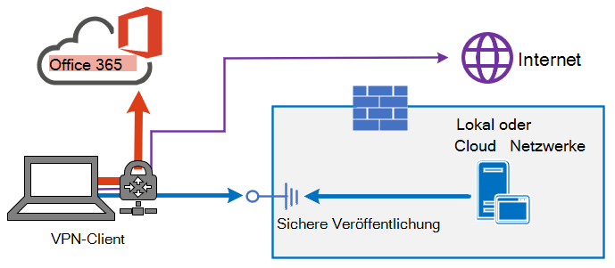

# <a name="implementing-vpn-split-tunneling-for-office-365"></a><span data-ttu-id="d53fa-103">Implementieren eines geteilten VPN-Tunnels für Office 365</span><span class="sxs-lookup"><span data-stu-id="d53fa-103">Implementing VPN split tunneling for Office 365</span></span>

>[!NOTE]
><span data-ttu-id="d53fa-104">Dieses Thema ist Teil einer Reihe von Themen, die sich mit der Optimierung von Office 365 für Remotebenutzer befassen.</span><span class="sxs-lookup"><span data-stu-id="d53fa-104">This topic is part of a set of topics that address Office 365 optimization for remote users.</span></span>
>- <span data-ttu-id="d53fa-105">Einen Überblick über die Verwendung von VPN-Split-Tunneling zum Optimieren der Office 365-Konnektivität für Remotebenutzer finden Sie unter [Übersicht: VPN-Split-Tunneling für Office 365](microsoft-365-vpn-split-tunnel.md).</span><span class="sxs-lookup"><span data-stu-id="d53fa-105">For an overview of using VPN split tunneling to optimize Office 365 connectivity for remote users, see [Overview: VPN split tunneling for Office 365](microsoft-365-vpn-split-tunnel.md).</span></span>
>- <span data-ttu-id="d53fa-106">Informationen zur Optimierung der weltweiten Mandantenleistung von Office 365 für Benutzer in China finden Sie unter Leistungsoptimierung von [Office 365 für Benutzer in China](microsoft-365-networking-china.md).</span><span class="sxs-lookup"><span data-stu-id="d53fa-106">For information about optimizing Office 365 worldwide tenant performance for users in China, see [Office 365 performance optimization for China users](microsoft-365-networking-china.md).</span></span>

<span data-ttu-id="d53fa-107">Seit vielen Jahren verwenden Unternehmen VPNs, um Remote-Erfahrungen für ihre Benutzer zu unterstützen.</span><span class="sxs-lookup"><span data-stu-id="d53fa-107">For many years, enterprises have been using VPNs to support remote experiences for their users.</span></span> <span data-ttu-id="d53fa-108">Während die wichtigsten Workloads weiterhin lokal bleiben, war ein VPN vom Remote-Client aus, das durch ein Rechenzentrum im Unternehmensnetzwerk geleitet wurde, die primäre Methode für Remotebenutzer, um auf Unternehmensressourcen zuzugreifen.</span><span class="sxs-lookup"><span data-stu-id="d53fa-108">Whilst core workloads remained on-premises, a VPN from the remote client routed through a datacenter on the corporate network was the primary method for remote users to access corporate resources.</span></span> <span data-ttu-id="d53fa-109">Um diese Verbindungen zu schützen, bauen Unternehmen entlang der VPN-Pfade Schichten von Netzwerksicherheitslösungen auf.</span><span class="sxs-lookup"><span data-stu-id="d53fa-109">To safeguard these connections, enterprises build layers of network security solutions along the VPN paths.</span></span> <span data-ttu-id="d53fa-110">Diese Sicherheit wurde entwickelt, um die interne Infrastruktur zu schützen und das mobile Browsen externer Websites zu schützen, indem Datenverkehr in das VPN umgeleitet und dann über den lokalen Internetperimeter gesendet wird.</span><span class="sxs-lookup"><span data-stu-id="d53fa-110">This security was built to protect internal infrastructure and to safeguard mobile browsing of external web sites by rerouting traffic into the VPN and then out through the on-premises Internet perimeter.</span></span> <span data-ttu-id="d53fa-111">VPNs, Netzwerkperimeter und die zugehörige Sicherheitsinfrastruktur wurden häufig speziell für ein definiertes Datenverkehrsvolumen erstellt und skaliert, in der Regel, da die meisten Verbindungen innerhalb des Unternehmensnetzwerks initiiert wurden und die meisten davon innerhalb der internen Netzwerkgrenzen bleiben.</span><span class="sxs-lookup"><span data-stu-id="d53fa-111">VPNs, network perimeters, and associated security infrastructure were often purpose-built and scaled for a defined volume of traffic, typically with most connectivity being initiated from within the corporate network, and most of it staying within the internal network boundaries.</span></span>

<span data-ttu-id="d53fa-112">Eine Zeit lang waren VPN-Modelle, bei denen alle Verbindungen vom Gerät des Remotebenutzers zurück in das firmeninterne Netzwerk geroutet werden (bekannt als **Tunnelerzwingung**), weitgehend tragfähig, solange die gleichzeitige Anzahl der Remotebenutzer gering war und das Datenverkehrsvolumen, welches das VPN durchquert, gering war.</span><span class="sxs-lookup"><span data-stu-id="d53fa-112">For quite some time, VPN models where all connections from the remote user device are routed back into the on-premises network (known as **forced tunneling**) were largely sustainable as long as the concurrent scale of remote users was modest and the traffic volumes traversing VPN were low.</span></span>  <span data-ttu-id="d53fa-113">Einige Kunden setzten VPN-Tunnelerzwingung weiterhin als Ist-Zustand ein, auch nachdem ihre Anwendungen von innerhalb des Unternehmensumfelds in öffentliche SaaS-Clouds umgezogen waren, wobei Office 365 ein Paradebeispiel ist.</span><span class="sxs-lookup"><span data-stu-id="d53fa-113">Some customers continued to use VPN force tunneling as the status quo even after their applications moved from inside the corporate perimeter to public SaaS clouds, Office 365 being a prime example.</span></span>

<span data-ttu-id="d53fa-114">Die Verwendung von erzwungenen Tunnel-VPNs für die Verbindung mit verteilten und leistungssensiblen Cloudanwendungen ist suboptimal, aber die negativen Auswirkungen wurden möglicherweise von einigen Unternehmen akzeptiert, um den Statusstatus aus Sicherheitsgründen beizubehalten.</span><span class="sxs-lookup"><span data-stu-id="d53fa-114">The use of forced tunneled VPNs for connecting to distributed and performance-sensitive cloud applications is suboptimal, but the negative effect of that may have been accepted by some enterprises so as to maintain the status quo from a security perspective.</span></span> <span data-ttu-id="d53fa-115">Ein Beispieldiagramm für dieses Szenario ist unten zu sehen:</span><span class="sxs-lookup"><span data-stu-id="d53fa-115">An example diagram of this scenario can be seen below:</span></span>



<span data-ttu-id="d53fa-117">Dieses Problem nimmt seit vielen Jahren zu, und viele Kunden melden eine erhebliche Verschiebung der Netzwerkdatenverkehrsmuster.</span><span class="sxs-lookup"><span data-stu-id="d53fa-117">This problem has been growing for many years, with many customers reporting a significant shift of network traffic patterns.</span></span> <span data-ttu-id="d53fa-118">Datenverkehr, der früher lokal war, stellt jetzt eine Verbindung mit externen Cloudendpunkten her.</span><span class="sxs-lookup"><span data-stu-id="d53fa-118">Traffic that used to stay on premises now connects to external cloud endpoints.</span></span> <span data-ttu-id="d53fa-119">Zahlreiche Microsoft-Kunden berichten, dass früher etwa 80 % ihres Netzwerkverkehrs auf eine interne Quelle entfielen (in der obigen Abbildung durch die gepunktete Linie dargestellt).</span><span class="sxs-lookup"><span data-stu-id="d53fa-119">Numerous Microsoft customers report that previously, around 80% of their network traffic was to some internal source (represented by the dotted line in the above diagram).</span></span> <span data-ttu-id="d53fa-120">Im Jahr 2020 liegt diese Zahl nun bei etwa 20 % oder weniger, da sie große Workloads in die Cloud verlagert haben, diese Trends sind bei anderen Unternehmen nicht ungewöhnlich.</span><span class="sxs-lookup"><span data-stu-id="d53fa-120">In 2020 that number is now around 20% or lower as they have shifted major workloads to the cloud, these trends are not uncommon with other enterprises.</span></span> <span data-ttu-id="d53fa-121">Im Laufe der Zeit wird das oben beschriebene Modell mit fortschreitender Cloud-Journey immer umständlicher und nicht mehr tragfähig, was ein Unternehmen daran hindert, auf dem Weg in eine „Cloud First World“ agil zu sein.</span><span class="sxs-lookup"><span data-stu-id="d53fa-121">Over time, as the cloud journey progresses, the above model becomes increasingly cumbersome and unsustainable, preventing an organization from being agile as they move into a cloud first world.</span></span>

<span data-ttu-id="d53fa-122">Durch die weltweite COVID-19-Krise hat sich dieses Problem so ausgeweitet, dass sofortige Abhilfe geschaffen werden muss.</span><span class="sxs-lookup"><span data-stu-id="d53fa-122">The worldwide COVID-19 crisis has escalated this problem to require immediate remediation.</span></span> <span data-ttu-id="d53fa-123">Die Notwendigkeit, die Sicherheit der Mitarbeiter zu gewährleisten, hat zu beispiellosen Anforderungen an die Unternehmens-IT geführt, um die Produktivität der Arbeit von zu Hause aus massiv zu unterstützen.</span><span class="sxs-lookup"><span data-stu-id="d53fa-123">The need to ensure employee safety has generated unprecedented demands on enterprise IT to support work-from-home productivity at a massive scale.</span></span> <span data-ttu-id="d53fa-124">Microsoft Office 365 ist gut positioniert, um Kunden bei der Erfüllung dieser Anforderungen zu unterstützen, aber eine hohe Parallelität von Benutzern, die von zu Hause aus arbeiten, generiert ein großes Volumen an Office 365 Datenverkehr, der, wenn er über tunnelerzwingte VPN- und lokale Netzwerkperimeter geleitet wird, eine schnelle Sättigung verursacht und die VPN-Infrastruktur außer Betrieb nimmt.</span><span class="sxs-lookup"><span data-stu-id="d53fa-124">Microsoft Office 365 is well positioned to help customers fulfill that demand, but high concurrency of users working from home generates a large volume of Office 365 traffic which, if routed through forced tunnel VPN and on-premises network perimeters, causes rapid saturation and runs VPN infrastructure out of capacity.</span></span> <span data-ttu-id="d53fa-125">In dieser neuen Realität ist die Verwendung von VPN für den Zugriff auf Office 365 nicht mehr nur ein Leistungshindernk, sondern eine feste Wand, die sich nicht nur auf Office 365, sondern auch auf kritische Geschäftsvorgänge auswirkt, die weiterhin auf das VPN angewiesen sind, um ausgeführt zu werden.</span><span class="sxs-lookup"><span data-stu-id="d53fa-125">In this new reality, using VPN to access Office 365 is no longer just a performance impediment, but a hard wall that not only impacts Office 365 but critical business operations that still have to rely on the VPN to operate.</span></span>

<span data-ttu-id="d53fa-126">Microsoft arbeitet seit vielen Jahren eng mit Kunden und der gesamten Branche zusammen, um effektive, moderne Lösungen für diese Probleme aus unseren eigenen Diensten heraus anzubieten und sich an den besten Praktiken der Branche auszurichten.</span><span class="sxs-lookup"><span data-stu-id="d53fa-126">Microsoft has been working closely with customers and the wider industry for many years to provide effective, modern solutions to these problems from within our own services, and to align with industry best practice.</span></span> <span data-ttu-id="d53fa-127">[Die Grundsätze der Konnektivität](./microsoft-365-network-connectivity-principles.md) für den Office 365-Dienst wurden so konzipiert, dass sie für Remotebenutzer effizient funktionieren und es einer Organisation dennoch ermöglichen, die Sicherheit und Kontrolle über ihre Konnektivität aufrechtzuerhalten.</span><span class="sxs-lookup"><span data-stu-id="d53fa-127">[Connectivity principles](./microsoft-365-network-connectivity-principles.md) for the Office 365 service have been designed to work efficiently for remote users whilst still allowing an organization to maintain security and control over their connectivity.</span></span> <span data-ttu-id="d53fa-128">Diese Lösungen können auch schnell mit begrenztem Aufwand implementiert werden, erzielen jedoch erhebliche positive Auswirkungen auf die oben beschriebenen Probleme.</span><span class="sxs-lookup"><span data-stu-id="d53fa-128">These solutions can also be implemented quickly with limited work yet achieve a significant positive impact on the problems outlined above.</span></span>

<span data-ttu-id="d53fa-129">Die von Microsoft empfohlene Strategie zur Optimierung der Konnektivität von Remote-Mitarbeitern konzentriert sich darauf, die Probleme mit dem traditionellen Ansatz schnell zu lindern und mit wenigen einfachen Schritten eine hohe Leistung zu erzielen.</span><span class="sxs-lookup"><span data-stu-id="d53fa-129">Microsoft's recommended strategy for optimizing remote worker's connectivity is focused on rapidly alleviating the problems with the traditional approach and also providing high performance with a few simple steps.</span></span> <span data-ttu-id="d53fa-130">Diese Schritte passen den Vpn-Ansatz der Vorversion für einige definierte Endpunkte an, die Engpässe bei VPN-Servern umgehen.</span><span class="sxs-lookup"><span data-stu-id="d53fa-130">These steps adjust the legacy VPN approach for a few defined endpoints that bypass bottlenecked VPN servers.</span></span> <span data-ttu-id="d53fa-131">Ein gleichwertiges oder sogar überlegenes Sicherheitsmodell kann auf verschiedenen Ebenen angewendet werden, um die Notwendigkeit zu beseitigen, den gesamten Datenverkehr am Ausgang des Unternehmensnetzwerks zu sichern.</span><span class="sxs-lookup"><span data-stu-id="d53fa-131">An equivalent or even superior security model can be applied at different layers to remove the need to secure all traffic at the egress of the corporate network.</span></span> <span data-ttu-id="d53fa-132">In den meisten Fällen kann dies innerhalb von Stunden effektiv erreicht werden und ist dann auf andere Arbeitslasten skalierbar, wenn die Anforderungen es erfordern und die Zeit es erlaubt.</span><span class="sxs-lookup"><span data-stu-id="d53fa-132">In most cases this can be effectively achieved within hours and is then scalable to other workloads as requirements demand and time allows.</span></span>

## <a name="common-vpn-scenarios"></a><span data-ttu-id="d53fa-133">Gängige VPN-Szenarien</span><span class="sxs-lookup"><span data-stu-id="d53fa-133">Common VPN scenarios</span></span>

<span data-ttu-id="d53fa-134">In der Liste unten sehen Sie die häufigsten VPN-Szenarien, die in Unternehmensumgebungen vorkommen.</span><span class="sxs-lookup"><span data-stu-id="d53fa-134">In the list below you'll see the most common VPN scenarios seen in enterprise environments.</span></span> <span data-ttu-id="d53fa-135">Die meisten Kunden arbeiten traditionell mit Modell 1 (VPN-Tunnelerzwingung).</span><span class="sxs-lookup"><span data-stu-id="d53fa-135">Most customers traditionally operate model 1 (VPN Forced Tunnel).</span></span> <span data-ttu-id="d53fa-136">Dieser Abschnitt hilft Ihnen beim schnellen und sicheren Übergang zu **Modell 2,** das mit relativ geringem Aufwand erreichbar ist und enorme Vorteile für die Netzwerkleistung und die Benutzererfahrung bietet.</span><span class="sxs-lookup"><span data-stu-id="d53fa-136">This section will help you to quickly and securely transition to **model 2**, which is achievable with relatively little effort, and has enormous benefits to network performance and user experience.</span></span>

| <span data-ttu-id="d53fa-137">Modell</span><span class="sxs-lookup"><span data-stu-id="d53fa-137">Model</span></span> | <span data-ttu-id="d53fa-138">Beschreibung</span><span class="sxs-lookup"><span data-stu-id="d53fa-138">Description</span></span> |
| --- | --- |
| [<span data-ttu-id="d53fa-139">1. VPN-Tunnelerzwingung</span><span class="sxs-lookup"><span data-stu-id="d53fa-139">1. VPN Forced Tunnel</span></span>](#1-vpn-forced-tunnel) | <span data-ttu-id="d53fa-140">100 % des Datenverkehrs werden in den VPN-Tunnel geleitet, einschließlich lokalem, Internet und O365/M365</span><span class="sxs-lookup"><span data-stu-id="d53fa-140">100% of traffic goes into VPN tunnel, including on-premise, Internet, and all O365/M365</span></span> |
| [<span data-ttu-id="d53fa-141">2. VPN-Tunnelerzwingung mit wenigen Ausnahmen</span><span class="sxs-lookup"><span data-stu-id="d53fa-141">2. VPN Forced Tunnel with few exceptions</span></span>](#2-vpn-forced-tunnel-with-a-small-number-of-trusted-exceptions) | <span data-ttu-id="d53fa-142">VPN-Tunnel wird standardmäßig verwendet (Standard-Route zeigt auf VPN), mit wenigen, wichtigsten Ausnahmeszenarien, die erlaubt sind, direkt zu gehen</span><span class="sxs-lookup"><span data-stu-id="d53fa-142">VPN tunnel is used by default (default route points to VPN), with few, most important exempt scenarios that are allowed to go direct</span></span> |
| [<span data-ttu-id="d53fa-143">3. VPN-Tunnelerzwingung mit breiten Ausnahmen</span><span class="sxs-lookup"><span data-stu-id="d53fa-143">3. VPN Forced Tunnel with broad exceptions</span></span>](#3-vpn-forced-tunnel-with-broad-exceptions) | <span data-ttu-id="d53fa-144">VPN-Tunnel wird standardmäßig verwendet (Standard-Route zeigt auf VPN), mit breiten Ausnahmen, die direkt gehen dürfen (z. B. alle Office 365, alle Salesforce, alle Zoom)</span><span class="sxs-lookup"><span data-stu-id="d53fa-144">VPN tunnel is used by default (default route points to VPN), with broad exceptions that are allowed to go direct (such as all Office 365, All Salesforce, All Zoom)</span></span> |
| [<span data-ttu-id="d53fa-145">4. Selektiver VPN-Tunnel</span><span class="sxs-lookup"><span data-stu-id="d53fa-145">4. VPN Selective Tunnel</span></span>](#4-vpn-selective-tunnel) | <span data-ttu-id="d53fa-146">VPN-Tunnel wird nur für unternehmensbasierte Dienste verwendet.</span><span class="sxs-lookup"><span data-stu-id="d53fa-146">VPN tunnel is used only for corpnet-based services.</span></span> <span data-ttu-id="d53fa-147">Die Standardroute (Internet und alle internetbasierten Dienste) wird direkt geleitet.</span><span class="sxs-lookup"><span data-stu-id="d53fa-147">Default route (Internet and all Internet-based services) goes direct.</span></span> |
| [<span data-ttu-id="d53fa-148">5. Kein VPN</span><span class="sxs-lookup"><span data-stu-id="d53fa-148">5. No VPN</span></span>](#5-no-vpn) | <span data-ttu-id="d53fa-149">Eine Variante von #2, bei der anstelle von Legacy-VPN alle Unternehmensnetzwerkdienste über moderne Sicherheitsansätze (z. B. Zscaler ZPA, Azure Active Directory (Azure AD) Proxy/MCAS usw.) veröffentlicht werden.</span><span class="sxs-lookup"><span data-stu-id="d53fa-149">A variation of #2, where instead of legacy VPN, all corpnet services are published through modern security approaches (like Zscaler ZPA, Azure Active Directory (Azure AD) Proxy/MCAS, etc.)</span></span> |

### <a name="1-vpn-forced-tunnel"></a><span data-ttu-id="d53fa-150">1. VPN-Tunnelerzwingung</span><span class="sxs-lookup"><span data-stu-id="d53fa-150">1. VPN Forced Tunnel</span></span>

<span data-ttu-id="d53fa-151">Dies ist das häufigste Startszenario für die meisten Unternehmenskunden.</span><span class="sxs-lookup"><span data-stu-id="d53fa-151">This is the most common starting scenario for most enterprise customers.</span></span> <span data-ttu-id="d53fa-152">Es wird ein erzwungenes VPN verwendet, was bedeutet, dass 100 % des Datenverkehrs in das Unternehmensnetzwerk geleitet werden, unabhängig davon, ob sich der Endpunkt im Unternehmensnetzwerk befindet oder nicht.</span><span class="sxs-lookup"><span data-stu-id="d53fa-152">A forced VPN is used, which means 100% of traffic is directed into the corporate network regardless of the fact the endpoint resides within the corporate network or not.</span></span> <span data-ttu-id="d53fa-153">Jeder externe (Internet)-gebundene Datenverkehr, z. B. Office 365 oder Internetbrowsen, wird dann aus den lokalen Sicherheitsgeräten wie Proxys herausgeheftet.</span><span class="sxs-lookup"><span data-stu-id="d53fa-153">Any external (Internet) bound traffic such as Office 365 or Internet browsing is then hair-pinned back out of the on premises security equipment such as proxies.</span></span> <span data-ttu-id="d53fa-154">In der aktuellen Situation, in der fast 100 % der Benutzer remote arbeiten, belastet dieses Modell daher die VPN-Infrastruktur stark und beeinträchtigt wahrscheinlich die Leistung des gesamten Unternehmensdatenverkehrs und damit das effiziente Arbeiten des Unternehmens in Zeiten der Krise.</span><span class="sxs-lookup"><span data-stu-id="d53fa-154">In the current climate with nearly 100% of users working remotely, this model therefore puts high load on the VPN infrastructure and is likely to significantly hinder performance of all corporate traffic and thus the enterprise to operate efficiently at a time of crisis.</span></span>


### <a name="2-vpn-forced-tunnel-with-a-small-number-of-trusted-exceptions"></a><span data-ttu-id="d53fa-156">2. VPN-Tunnelerzwingung mit einer kleinen Anzahl von vertrauenswürdigen Ausnahmen</span><span class="sxs-lookup"><span data-stu-id="d53fa-156">2. VPN Forced Tunnel with a small number of trusted exceptions</span></span>

<span data-ttu-id="d53fa-157">Dieses Modell ist für ein Unternehmen wesentlich effizienter, da es einige kontrollierte und definierte Endpunkte zulässt, die sehr auslastungs- und latenzempfindlich sind, um den VPN-Tunnel zu umgehen und direkt zum Office 365-Dienst in diesem Beispiel zu wechseln.</span><span class="sxs-lookup"><span data-stu-id="d53fa-157">This model is significantly more efficient for an enterprise to operate under as it allows a few controlled and defined endpoints that are very high load and latency sensitive to bypass the VPN tunnel and go direct to the Office 365 service in this example.</span></span> <span data-ttu-id="d53fa-158">Dies verbessert die Leistung für die ausgelagerten Dienste erheblich und verringert auch die Last für die VPN-Infrastruktur, sodass Elemente, die dies weiterhin erfordern, mit geringerem Ressourcenkonflikt arbeiten können.</span><span class="sxs-lookup"><span data-stu-id="d53fa-158">This significantly improves the performance for the offloaded services, and also decreases the load on the VPN infrastructure, thus allowing elements that still require it to operate with lower contention for resources.</span></span> <span data-ttu-id="d53fa-159">In diesem Modell konzentriert sich dieser Artikel auf die Unterstützung beim Übergang zu, da einfache, definierte Aktionen schnell mit zahlreichen positiven Ergebnissen durchgeführt werden können.</span><span class="sxs-lookup"><span data-stu-id="d53fa-159">It is this model that this article concentrates on assisting with the transition to as it allows for simple, defined actions to be taken quickly with numerous positive outcomes.</span></span>


### <a name="3-vpn-forced-tunnel-with-broad-exceptions"></a><span data-ttu-id="d53fa-161">3. VPN-Tunnelerzwingung mit breiten Ausnahmen</span><span class="sxs-lookup"><span data-stu-id="d53fa-161">3. VPN Forced Tunnel with broad exceptions</span></span>

<span data-ttu-id="d53fa-162">Das dritte Modell erweitert den Bereich von Modell 2, da nicht nur eine kleine Gruppe definierter Endpunkte direkt gesendet wird, sondern der gesamte Datenverkehr direkt an vertrauenswürdige Dienste wie Office 365 und SalesForce gesendet wird.</span><span class="sxs-lookup"><span data-stu-id="d53fa-162">The third model broadens the scope of model two as rather than just sending a small group of defined endpoints direct, it instead sends all traffic directly to trusted services such Office 365 and SalesForce.</span></span> <span data-ttu-id="d53fa-163">Dadurch wird die Belastung der VPN-Infrastruktur des Unternehmens weiter reduziert und die Leistung der definierten Dienste verbessert.</span><span class="sxs-lookup"><span data-stu-id="d53fa-163">This further reduces the load on the corporate VPN infrastructure and improves the performance of the services defined.</span></span> <span data-ttu-id="d53fa-164">Da dieses Modell wahrscheinlich mehr Zeit in Anspruch nimmt, um die Machbarkeit zu bewerten und zu implementieren, ist es wahrscheinlich ein Schritt, der zu einem späteren Zeitpunkt iterativ ausgeführt werden kann, sobald Modell 2 erfolgreich implementiert wurde.</span><span class="sxs-lookup"><span data-stu-id="d53fa-164">As this model is likely to take more time to assess the feasibility of and implement, it is likely a step that can be taken iteratively at a later date once model two is successfully in place.</span></span>



### <a name="4-vpn-selective-tunnel"></a><span data-ttu-id="d53fa-166">4. Selektiver VPN-Tunnel</span><span class="sxs-lookup"><span data-stu-id="d53fa-166">4. VPN selective Tunnel</span></span>

<span data-ttu-id="d53fa-167">Dieses Modell kehrt das dritte Modell insofern um, als nur der Datenverkehr, der als mit einer Unternehmens-IP-Adresse identifiziert wurde, durch den VPN-Tunnel geleitet wird und somit der Internet-Pfad die Standardroute für alles andere ist.</span><span class="sxs-lookup"><span data-stu-id="d53fa-167">This model reverses the third model in that only traffic identified as having a corporate IP address is sent down the VPN tunnel and thus the Internet path is the default route for everything else.</span></span> <span data-ttu-id="d53fa-168">Dieses Modell setzt voraus, dass sich eine Organisation auf dem Weg zu [Zero Trust](https://www.microsoft.com/security/zero-trust?rtc=1) befindet, um dieses Modell sicher umsetzen zu können.</span><span class="sxs-lookup"><span data-stu-id="d53fa-168">This model requires an organization to be well on the path to [Zero Trust](https://www.microsoft.com/security/zero-trust?rtc=1) in able to safely implement this model.</span></span> <span data-ttu-id="d53fa-169">Es ist zu beachten, dass dieses Modell oder eine Variation davon im Laufe der Zeit wahrscheinlich zum notwendigen Standard werden wird, da sich immer mehr Dienste vom Unternehmensnetzwerk weg und in die Cloud verlagern.</span><span class="sxs-lookup"><span data-stu-id="d53fa-169">It should be noted that this model or some variation thereof will likely become the necessary default over time as more and more services move away from the corporate network and into the cloud.</span></span> <span data-ttu-id="d53fa-170">Microsoft verwendet dieses Modell intern; weitere Informationen über die Implementierung von VPN Split-Tunneling durch Microsoft finden Sie unter [Ausführen auf VPN: Wie Microsoft die Verbindung zu seinen Remote-Mitarbeitern aufrechterhält](https://www.microsoft.com/itshowcase/blog/running-on-vpn-how-microsoft-is-keeping-its-remote-workforce-connected/?elevate-lv).</span><span class="sxs-lookup"><span data-stu-id="d53fa-170">Microsoft uses this model internally; you can find more information on Microsoft's implementation of VPN split tunneling at [Running on VPN: How Microsoft is keeping its remote workforce connected](https://www.microsoft.com/itshowcase/blog/running-on-vpn-how-microsoft-is-keeping-its-remote-workforce-connected/?elevate-lv).</span></span>



### <a name="5-no-vpn"></a><span data-ttu-id="d53fa-172">5. Kein VPN</span><span class="sxs-lookup"><span data-stu-id="d53fa-172">5. No VPN</span></span>

<span data-ttu-id="d53fa-173">Eine erweiterte Version von Modell Nummer 2, bei der interne Dienste über einen modernen Sicherheitsansatz oder eine SDWAN-Lösung wie Azure AD Proxy, MCAS, Zscaler ZPA usw. veröffentlicht werden.</span><span class="sxs-lookup"><span data-stu-id="d53fa-173">A more advanced version of model number two, whereby any internal services are published through a modern security approach or SDWAN solution such as Azure AD Proxy, MCAS, Zscaler ZPA, etc.</span></span>



## <a name="implement-vpn-split-tunneling"></a><span data-ttu-id="d53fa-175">Implementierung von VPN-Split-Tunneling</span><span class="sxs-lookup"><span data-stu-id="d53fa-175">Implement VPN split tunneling</span></span>

<span data-ttu-id="d53fa-176">In diesem Abschnitt finden Sie die einfachen Schritte, die erforderlich sind, um Ihre VPN-Clientarchitektur von einem _VPN-Tunnel_ zu einem _VPN-tunnelerzwingten Tunnel mit einer kleinen Anzahl von vertrauenswürdigen Ausnahmen_ zu migrieren, einem [geteilten VPN-Tunnelmodell #2](#2-vpn-forced-tunnel-with-a-small-number-of-trusted-exceptions) in [allgemeinen VPN-Szenarien.](#common-vpn-scenarios)</span><span class="sxs-lookup"><span data-stu-id="d53fa-176">In this section, you'll find the simple steps required to migrate your VPN client architecture from a _VPN forced tunnel_ to a _VPN forced tunnel with a small number of trusted exceptions_, [VPN split tunnel model #2](#2-vpn-forced-tunnel-with-a-small-number-of-trusted-exceptions) in [Common VPN scenarios](#common-vpn-scenarios).</span></span>

<span data-ttu-id="d53fa-177">Das folgende Diagramm veranschaulicht, wie die empfohlene VPN-Split-Tunnellösung funktioniert:</span><span class="sxs-lookup"><span data-stu-id="d53fa-177">The diagram below illustrates how the recommended VPN split tunnel solution works:</span></span>


### <a name="1-identify-the-endpoints-to-optimize"></a><span data-ttu-id="d53fa-179">1. Ermitteln der zu optimierenden Endpunkte</span><span class="sxs-lookup"><span data-stu-id="d53fa-179">1. Identify the endpoints to optimize</span></span>

<span data-ttu-id="d53fa-180">Im Thema [Office 365 URLs und IP-Adressbereiche](urls-and-ip-address-ranges.md) identifiziert Microsoft klar die wichtigsten Endpunkte, die Sie zum Optimieren benötigen, und kategorisiert sie als **Optimieren**.</span><span class="sxs-lookup"><span data-stu-id="d53fa-180">In the [Office 365 URLs and IP address ranges](urls-and-ip-address-ranges.md) topic, Microsoft clearly identifies the key endpoints you need to optimize and categorizes them as **Optimize**.</span></span> <span data-ttu-id="d53fa-181">Derzeit gibt es nur vier URLS und 20 IP-Subnetze, die optimiert werden müssen.</span><span class="sxs-lookup"><span data-stu-id="d53fa-181">There are currently just four URLS and 20 IP subnets that need to be optimized.</span></span> <span data-ttu-id="d53fa-182">Diese kleine Gruppe von Endpunkten macht etwa 70 % bis 80 % des Verkehrsaufkommens des Office 365-Diensts aus, einschließlich der latenzempfindlichen Endpunkte wie die für die Teams-Medien.</span><span class="sxs-lookup"><span data-stu-id="d53fa-182">This small group of endpoints accounts for around 70% - 80% of the volume of traffic to the Office 365 service including the latency sensitive endpoints such as those for Teams media.</span></span> <span data-ttu-id="d53fa-183">Im Wesentlichen ist dies der Datenverkehr, um den wir uns besonders kümmern müssen, und es ist auch der Datenverkehr, der einen enormen Druck auf herkömmliche Netzwerkpfade und VPN-Infrastruktur ausüben wird.</span><span class="sxs-lookup"><span data-stu-id="d53fa-183">Essentially this is the traffic that we need to take special care of and is also the traffic that will put incredible pressure on traditional network paths and VPN infrastructure.</span></span>

<span data-ttu-id="d53fa-184">URLS in dieser Kategorie besitzen die folgenden Merkmale:</span><span class="sxs-lookup"><span data-stu-id="d53fa-184">URLs in this category have the following characteristics:</span></span>

- <span data-ttu-id="d53fa-185">Sind Endgeräte im Besitz Microsoft und Verwalteten Endpunkten, auf der Microsoft-Infrastruktur gehostet?</span><span class="sxs-lookup"><span data-stu-id="d53fa-185">Are Microsoft owned and managed endpoints, hosted on Microsoft infrastructure</span></span>
- <span data-ttu-id="d53fa-186">Lassen Sie IPs bereitstellen</span><span class="sxs-lookup"><span data-stu-id="d53fa-186">Have IPs provided</span></span>
- <span data-ttu-id="d53fa-187">Geringe Änderungsrate, und es wird erwartet, dass die Zahl klein ist (zurzeit 20 IP-Subnetze)</span><span class="sxs-lookup"><span data-stu-id="d53fa-187">Low rate of change and are expected to remain small in number (currently 20 IP subnets)</span></span>
- <span data-ttu-id="d53fa-188">Sind bandbreiten- und/oder latenzempfindlich</span><span class="sxs-lookup"><span data-stu-id="d53fa-188">Are bandwidth and/or latency sensitive</span></span>
- <span data-ttu-id="d53fa-189">Sind in der Lage, die erforderlichen Sicherheitselemente im Dienst und nicht inline im Netzwerk bereitzustellen</span><span class="sxs-lookup"><span data-stu-id="d53fa-189">Are able to have required security elements provided in the service rather than inline on the network</span></span>
- <span data-ttu-id="d53fa-190">Ungefähr 70 bis 80 % des Verkehrsaufkommens des Office 365-Diensts</span><span class="sxs-lookup"><span data-stu-id="d53fa-190">Account for around 70-80% of the volume of traffic to the Office 365 service</span></span>

<span data-ttu-id="d53fa-191">Weitere Informationen zu Office 365-Endpunkten und deren Kategorisierung und Verwaltung finden Sie im Artikel [Verwalten von Office 365-Endpunkten](managing-office-365-endpoints.md).</span><span class="sxs-lookup"><span data-stu-id="d53fa-191">For more information about Office 365 endpoints and how they are categorized and managed, see the article [Managing Office 365 endpoints](managing-office-365-endpoints.md).</span></span>

#### <a name="optimize-urls"></a><span data-ttu-id="d53fa-192">Optimieren der URLs</span><span class="sxs-lookup"><span data-stu-id="d53fa-192">Optimize URLs</span></span>

<span data-ttu-id="d53fa-193">Die aktuellen Optimieren-URLs finden Sie in der folgenden Tabelle.</span><span class="sxs-lookup"><span data-stu-id="d53fa-193">The current Optimize URLs can be found in the table below.</span></span> <span data-ttu-id="d53fa-194">In den meisten Fällen sollten Sie nur URL-Endpunkte in einer [Browser-PAC-Datei](managing-office-365-endpoints.md#use-a-pac-file-for-direct-routing-of-vital-office-365-traffic) verwenden müssen, wobei die Endpunkte so konfiguriert sind, dass sie nicht an den Proxy, sondern direkt gesendet werden.</span><span class="sxs-lookup"><span data-stu-id="d53fa-194">Under most circumstances, you should only need to use URL endpoints in a [browser PAC file](managing-office-365-endpoints.md#use-a-pac-file-for-direct-routing-of-vital-office-365-traffic) where the endpoints are configured to be sent direct, rather than to the proxy.</span></span>

| <span data-ttu-id="d53fa-195">Optimieren der URLs</span><span class="sxs-lookup"><span data-stu-id="d53fa-195">Optimize URLs</span></span> | <span data-ttu-id="d53fa-196">Port/Protokoll</span><span class="sxs-lookup"><span data-stu-id="d53fa-196">Port/Protocol</span></span> | <span data-ttu-id="d53fa-197">Zweck</span><span class="sxs-lookup"><span data-stu-id="d53fa-197">Purpose</span></span> |
| --- | --- | --- |
| <https://outlook.office365.com> | <span data-ttu-id="d53fa-198">TCP 443</span><span class="sxs-lookup"><span data-stu-id="d53fa-198">TCP 443</span></span> | <span data-ttu-id="d53fa-199">Dies ist eine der primären URLs, die Outlook für die Verbindung mit seinem Exchange Online-Server verwendet, und hat ein hohes Volumen an Bandbreitennutzung und Verbindungsanzahl.</span><span class="sxs-lookup"><span data-stu-id="d53fa-199">This is one of the primary URLs Outlook uses to connect to its Exchange Online server and has a high volume of bandwidth usage and connection count.</span></span> <span data-ttu-id="d53fa-200">Für Online-Funktionen wie Sofortsuche, andere Postfachkalender, freies/besetztes Nachschlagen, Verwaltung von Regeln und Warnungen, Exchange-Online-Archiv, E-Mails, die den Postausgang verlassen, ist eine geringe Netzwerklatenzzeit erforderlich.</span><span class="sxs-lookup"><span data-stu-id="d53fa-200">Low network latency is required for online features including: instant search, other mailbox calendars, free / busy lookup, manage rules and alerts, Exchange online archive, emails departing the outbox.</span></span> |
| <https://outlook.office.com> | <span data-ttu-id="d53fa-201">TCP 443</span><span class="sxs-lookup"><span data-stu-id="d53fa-201">TCP 443</span></span> | <span data-ttu-id="d53fa-202">Diese URL wird für Outlook Online Web Access verwendet, um eine Verbindung mit dem Exchange Online-Server herzustellen, und ist empfindlich für die Netzwerklatenz.</span><span class="sxs-lookup"><span data-stu-id="d53fa-202">This URL is used for Outlook Online Web Access to connect to Exchange Online server, and is sensitive to network latency.</span></span> <span data-ttu-id="d53fa-203">Konnektivität ist insbesondere für das Hoch- und Herunterladen großer Dateien mit SharePoint Online erforderlich.</span><span class="sxs-lookup"><span data-stu-id="d53fa-203">Connectivity is particularly required for large file upload and download with SharePoint Online.</span></span> |
| <span data-ttu-id="d53fa-204"> https:// \<tenant\> .sharepoint.com</span><span class="sxs-lookup"><span data-stu-id="d53fa-204">https://\<tenant\>.sharepoint.com</span></span> | <span data-ttu-id="d53fa-205">TCP 443</span><span class="sxs-lookup"><span data-stu-id="d53fa-205">TCP 443</span></span> | <span data-ttu-id="d53fa-206">Dies ist die primäre URL für SharePoint Online und hat eine Hohe Bandbreitenauslastung.</span><span class="sxs-lookup"><span data-stu-id="d53fa-206">This is the primary URL for SharePoint Online and has high-bandwidth usage.</span></span> |
| <span data-ttu-id="d53fa-207"> https:// \<tenant\> -my.sharepoint.com</span><span class="sxs-lookup"><span data-stu-id="d53fa-207">https://\<tenant\>-my.sharepoint.com</span></span> | <span data-ttu-id="d53fa-208">TCP 443</span><span class="sxs-lookup"><span data-stu-id="d53fa-208">TCP 443</span></span> | <span data-ttu-id="d53fa-209">Dies ist die primäre URL für OneDrive for Business und hat eine hohe Bandbreitennutzung und möglicherweise eine hohe Anzahl an Verbindungen vom OneDrive for Business Sync-Tool.</span><span class="sxs-lookup"><span data-stu-id="d53fa-209">This is the primary URL for OneDrive for Business and has high bandwidth usage and possibly high connection count from the OneDrive for Business Sync tool.</span></span> |
| <span data-ttu-id="d53fa-210">Teams Media IPs (keine URL)</span><span class="sxs-lookup"><span data-stu-id="d53fa-210">Teams Media IPs (no URL)</span></span> | <span data-ttu-id="d53fa-211">UDP 3478, 3479, 3480 und 3481</span><span class="sxs-lookup"><span data-stu-id="d53fa-211">UDP 3478, 3479, 3480, and 3481</span></span> | <span data-ttu-id="d53fa-212">Relay Discovery allocation and real-time traffic (3478), Audio (3479), Video (3480) and Video Screen Sharing (3481).</span><span class="sxs-lookup"><span data-stu-id="d53fa-212">Relay Discovery allocation and real-time traffic (3478), Audio (3479), Video (3480), and Video Screen Sharing (3481).</span></span> <span data-ttu-id="d53fa-213">Dies sind die Endpunkte, die für Skype for Business und Microsoft Teams Mediendatenverkehr (Anrufe, Besprechungen usw.) verwendet werden.</span><span class="sxs-lookup"><span data-stu-id="d53fa-213">These are the endpoints used for Skype for Business and Microsoft Teams Media traffic (calls, meetings, etc.).</span></span> <span data-ttu-id="d53fa-214">Die meisten Endpunkte werden bereitgestellt, wenn der Microsoft Teams-Client einen Anruf einleitet (und sind in den für den Dienst aufgelisteten erforderlichen IPs enthalten).</span><span class="sxs-lookup"><span data-stu-id="d53fa-214">Most endpoints are provided when the Microsoft Teams client establishes a call (and are contained within the required IPs listed for the service).</span></span> <span data-ttu-id="d53fa-215">Für eine optimale Medienqualität ist die Verwendung des UDP-Protokolls erforderlich.</span><span class="sxs-lookup"><span data-stu-id="d53fa-215">Use of the UDP protocol is required for optimal media quality.</span></span>   |

<span data-ttu-id="d53fa-216">In den obigen Beispielen sollte der **Mandant** durch den Namen Ihres Office 365-Mandanten ersetzt werden.</span><span class="sxs-lookup"><span data-stu-id="d53fa-216">In the above examples, **tenant** should be replaced with your Office 365 tenant name.</span></span> <span data-ttu-id="d53fa-217">Beispielsweise würde **contoso.onmicrosoft.com** _contoso.sharepoint.com_ und _constoso-my.sharepoint.com_ verwenden.</span><span class="sxs-lookup"><span data-stu-id="d53fa-217">For example, **contoso.onmicrosoft.com** would use _contoso.sharepoint.com_ and _constoso-my.sharepoint.com_.</span></span>

#### <a name="optimize-ip-address-ranges"></a><span data-ttu-id="d53fa-218">Optimieren der IP-Adressbereiche</span><span class="sxs-lookup"><span data-stu-id="d53fa-218">Optimize IP address ranges</span></span>

<span data-ttu-id="d53fa-219">Zum Zeitpunkt des Schreibens der IP-Bereiche, denen diese Endpunkte entsprechen, lautet dies wie folgt.</span><span class="sxs-lookup"><span data-stu-id="d53fa-219">At the time of writing the IP ranges that these endpoints correspond to are as follows.</span></span> <span data-ttu-id="d53fa-220">Es wird **dringend** empfohlen, ein [Skript wie dieses](https://github.com/microsoft/Office365NetworkTools/tree/master/Scripts/Display%20URL-IPs-Ports%20per%20Category) Beispiel, den Office 365 [IP- und URL-Webdienst](microsoft-365-ip-web-service.md) oder die [URL/IP-Seite](urls-and-ip-address-ranges.md) zu verwenden, um nach Updates zu suchen, wenn Sie die Konfiguration anwenden, und eine Richtlinie zu erstellen, um dies regelmäßig zu tun.</span><span class="sxs-lookup"><span data-stu-id="d53fa-220">It is **very strongly** advised you use a [script such as this](https://github.com/microsoft/Office365NetworkTools/tree/master/Scripts/Display%20URL-IPs-Ports%20per%20Category) example, the [Office 365 IP and URL web service](microsoft-365-ip-web-service.md) or the [URL/IP page](urls-and-ip-address-ranges.md) to check for any updates when applying the configuration, and put a policy in place to do so regularly.</span></span>

```
104.146.128.0/17
13.107.128.0/22
13.107.136.0/22
13.107.18.10/31
13.107.6.152/31
13.107.64.0/18
131.253.33.215/32
132.245.0.0/16
150.171.32.0/22
150.171.40.0/22
191.234.140.0/22
204.79.197.215/32
23.103.160.0/20
40.104.0.0/15
40.108.128.0/17
40.96.0.0/13
52.104.0.0/14
52.112.0.0/14
52.96.0.0/14
52.120.0.0/14
```

### <a name="2-optimize-access-to-these-endpoints-via-the-vpn"></a><span data-ttu-id="d53fa-221">2. Optimieren des Zugriffs auf diese Endpunkte über das VPN</span><span class="sxs-lookup"><span data-stu-id="d53fa-221">2. Optimize access to these endpoints via the VPN</span></span>

<span data-ttu-id="d53fa-222">Nun, da wir diese kritischen Endpunkte identifiziert haben, müssen wir sie vom VPN-Tunnel ablenken und ihnen erlauben, die lokale Internetverbindung des Benutzers zu nutzen, um sich direkt mit dem Dienst zu verbinden.</span><span class="sxs-lookup"><span data-stu-id="d53fa-222">Now that we have identified these critical endpoints, we need to divert them away from the VPN tunnel and allow them to use the user's local Internet connection to connect directly to the service.</span></span> <span data-ttu-id="d53fa-223">Die Art und Weise, wie dies erreicht wird, hängt vom verwendeten VPN-Produkt und der Maschinenplattform ab, aber die meisten VPN-Lösungen ermöglichen eine einfache Konfiguration der Richtlinien zur Anwendung dieser Logik.</span><span class="sxs-lookup"><span data-stu-id="d53fa-223">The manner in which this is accomplished will vary depending on the VPN product and machine platform used but most VPN solutions will allow some simple configuration of policy to apply this logic.</span></span> <span data-ttu-id="d53fa-224">Informationen zur plattformspezifischen Anleitung für geteilte Tunnel finden Sie in den [HOWTO-Leitfäden für gängige VPN-Plattformen](#howto-guides-for-common-vpn-platforms).</span><span class="sxs-lookup"><span data-stu-id="d53fa-224">For information VPN platform-specific split tunnel guidance, see [HOWTO guides for common VPN platforms](#howto-guides-for-common-vpn-platforms).</span></span>

<span data-ttu-id="d53fa-225">Wenn Sie die Lösung manuell testen möchten, können Sie das folgende PowerShell-Beispiel ausführen, um die Lösung auf der Ebene der Routingtabelle zu emulieren.</span><span class="sxs-lookup"><span data-stu-id="d53fa-225">If you wish to test the solution manually, you can execute the following PowerShell example to emulate the solution at the route table level.</span></span> <span data-ttu-id="d53fa-226">In diesem Beispiel wird eine Route für jedes Subnetz des Teams Media IP in die Routingtabelle eingefügt.</span><span class="sxs-lookup"><span data-stu-id="d53fa-226">This example adds a route for each of the Teams Media IP subnets into the route table.</span></span> <span data-ttu-id="d53fa-227">Sie können die Medienleistung des Teams vorher und nachher testen und die Unterschiede in den Routen für die angegebenen Endpunkte beobachten.</span><span class="sxs-lookup"><span data-stu-id="d53fa-227">You can test Teams media performance before and after, and observe the difference in routes for the specified endpoints.</span></span>

#### <a name="example-add-teams-media-ip-subnets-into-the-route-table"></a><span data-ttu-id="d53fa-228">Beispiel: Hinzufügen von Teams Medien-IP-Subnetzen in der Routingtabelle</span><span class="sxs-lookup"><span data-stu-id="d53fa-228">Example: Add Teams Media IP subnets into the route table</span></span>

```powershell
$intIndex = "" # index of the interface connected to the internet
$gateway = "" # default gateway of that interface
$destPrefix = "52.120.0.0/14", "52.112.0.0/14", "13.107.64.0/18" # Teams Media endpoints
# Add routes to the route table
foreach ($prefix in $destPrefix) {New-NetRoute -DestinationPrefix $prefix -InterfaceIndex $intIndex -NextHop $gateway}
```

<span data-ttu-id="d53fa-229">Im obigen Skript ist _$intIndex_ der Index der Schnittstelle, die mit dem Internet verbunden ist (Suche durch Ausführen von **get-netadapter** in PowerShell; suchen Sie nach dem Wert von _ifIndex_) und _$gateway_ ist das Standardgateway dieser Schnittstelle (Suche durch Ausführen von **ipconfig** in einer Befehlszeile oder **(Get-NetIPConfiguration | Foreach IPv4DefaultGateway).NextHop** in PowerShell).</span><span class="sxs-lookup"><span data-stu-id="d53fa-229">In the above script, _$intIndex_ is the index of the interface connected to the internet (find by running **get-netadapter** in PowerShell; look for the value of _ifIndex_) and _$gateway_ is the default gateway of that interface (find by running **ipconfig** in a command prompt or **(Get-NetIPConfiguration | Foreach IPv4DefaultGateway).NextHop** in PowerShell).</span></span>

<span data-ttu-id="d53fa-230">Nachdem Sie die Routen hinzugefügt haben, können Sie bestätigen, dass die Routentabelle korrekt ist, indem Sie den **Route Print** in einer Eingabeaufforderung oder in PowerShell ausführen.</span><span class="sxs-lookup"><span data-stu-id="d53fa-230">Once you have added the routes, you can confirm that the route table is correct by running **route print** in a command prompt or PowerShell.</span></span> <span data-ttu-id="d53fa-231">Die Ausgabe sollte die von Ihnen hinzugefügten Routen enthalten und den Schnittstellenindex (_22_ in diesem Beispiel) und das Gateway für diese Schnittstelle (_192.168.1.1_ in diesem Beispiel) anzeigen:</span><span class="sxs-lookup"><span data-stu-id="d53fa-231">The output should contain the routes you added, showing the interface index (_22_ in this example) and the gateway for that interface (_192.168.1.1_ in this example):</span></span>


<span data-ttu-id="d53fa-233">Um Routen für **alle** aktuellen IP-Adressbereiche in der Kategorie Optimieren hinzuzufügen, können Sie die folgende Skriptvariante verwenden, um den [Office 365 IP- und URL-Webdienst](microsoft-365-ip-web-service.md) für den aktuellen Satz von IP-Subnetzen der Kategorie Optimieren abzufragen und sie der Routingtabelle hinzuzufügen.</span><span class="sxs-lookup"><span data-stu-id="d53fa-233">To add routes for **all** current IP address ranges in the Optimize category, you can use the following script variation to query the [Office 365 IP and URL web service](microsoft-365-ip-web-service.md) for the current set of Optimize IP subnets and add them to the route table.</span></span>

#### <a name="example-add-all-optimize-subnets-into-the-route-table"></a><span data-ttu-id="d53fa-234">Beispiel: Hinzufügen aller Optimieren-Subnetze in die Routingtabelle</span><span class="sxs-lookup"><span data-stu-id="d53fa-234">Example: Add all Optimize subnets into the route table</span></span>

```powershell
$intIndex = "" # index of the interface connected to the internet
$gateway = "" # default gateway of that interface
# Query the web service for IPs in the Optimize category
$ep = Invoke-RestMethod ("https://endpoints.office.com/endpoints/worldwide?clientrequestid=" + ([GUID]::NewGuid()).Guid)
# Output only IPv4 Optimize IPs to $optimizeIps
$destPrefix = $ep | where {$_.category -eq "Optimize"} | Select-Object -ExpandProperty ips | Where-Object { $_ -like '*.*' }
# Add routes to the route table
foreach ($prefix in $destPrefix) {New-NetRoute -DestinationPrefix $prefix -InterfaceIndex $intIndex -NextHop $gateway}
```

<span data-ttu-id="d53fa-235">Wenn Sie versehentlich Routen mit falschen Parametern hinzugefügt haben oder einfach nur Ihre Änderungen rückgängig machen wollen, können Sie die soeben hinzugefügten Routen mit dem folgenden Befehl entfernen:</span><span class="sxs-lookup"><span data-stu-id="d53fa-235">If you inadvertently added routes with incorrect parameters or simply wish to revert your changes, you can remove the routes you just added with the following command:</span></span>

```powershell
foreach ($prefix in $destPrefix) {Remove-NetRoute -DestinationPrefix $prefix -InterfaceIndex $intIndex -NextHop $gateway}
```

<!--- remmed until we add more reliable interface selection logic
#### Example script to add Teams Media subnets to the route table

```powershell
$adapter = get-netadapter | ? {$_.Status -eq "Up"}
$adapterIndex = $adapter.ifIndex
$gateway = (Get-NetIPConfiguration | Foreach IPv4DefaultGateway).NextHop

$destPrefix = "52.120.0.0/14", "52.112.0.0/14", "13.107.64.0/18"
foreach ($prefix in $destPrefix) {New-NetRoute -DestinationPrefix $prefix -InterfaceIndex $intIndex -NextHop $gateway}
```
-->

<span data-ttu-id="d53fa-236">Der VPN-Client sollte so konfiguriert werden, dass der Datenverkehr zu den **Optimieren**-IPs auf diese Weise geleitet wird.</span><span class="sxs-lookup"><span data-stu-id="d53fa-236">The VPN client should be configured so that traffic to the **Optimize** IPs are routed in this way.</span></span> <span data-ttu-id="d53fa-237">Auf diese Weise kann der Datenverkehr lokale Microsoft-Ressourcen wie Office 365 Service-Front-Doors [wie die Azure-Front-Door](https://azure.microsoft.com/blog/azure-front-door-service-is-now-generally-available/) nutzen, die Office 365 Dienste und Konnektivitätsendpunkte so nah wie möglich bei Ihren Benutzern bereitstellen.</span><span class="sxs-lookup"><span data-stu-id="d53fa-237">This allows the traffic to utilize local Microsoft resources such as Office 365 Service Front Doors [such as the Azure Front Door](https://azure.microsoft.com/blog/azure-front-door-service-is-now-generally-available/) that deliver Office 365 services and connectivity endpoints as close to your users as possible.</span></span> <span data-ttu-id="d53fa-238">Dies ermöglicht es uns, Benutzern überall auf der Welt ein hohes Leistungsniveau zu bieten, und nutzt das erstklassige globale Netzwerk von [Microsoft,](https://azure.microsoft.com/blog/how-microsoft-builds-its-fast-and-reliable-global-network/)das wahrscheinlich innerhalb weniger Millisekunden des direkten Ausgangspunkts Ihrer Benutzer liegt.</span><span class="sxs-lookup"><span data-stu-id="d53fa-238">This allows us to deliver high performance levels to users wherever they are in the world and takes full advantage of [Microsoft's world class global network](https://azure.microsoft.com/blog/how-microsoft-builds-its-fast-and-reliable-global-network/), which is likely within a few milliseconds of your users' direct egress.</span></span>

## <a name="configuring-and-securing-teams-media-traffic"></a><span data-ttu-id="d53fa-239">Konfigurieren und Sichern von Teams-Mediendatenverkehr</span><span class="sxs-lookup"><span data-stu-id="d53fa-239">Configuring and securing Teams media traffic</span></span>

<span data-ttu-id="d53fa-240">Einige Administratoren benötigen möglicherweise detailliertere Informationen darüber, wie Anrufströme in Teams mit einem Split-Tunneling-Modell ablaufen und wie die Verbindungen gesichert werden.</span><span class="sxs-lookup"><span data-stu-id="d53fa-240">Some administrators may require more detailed information on how call flows operate in Teams using a split tunneling model and how connections are secured.</span></span>

### <a name="configuration"></a><span data-ttu-id="d53fa-241">Konfiguration</span><span class="sxs-lookup"><span data-stu-id="d53fa-241">Configuration</span></span>

<span data-ttu-id="d53fa-242">Solange die erforderlichen OPTIMIZE-IP-Subnetze für Teams Medien in der Routentabelle korrekt vorhanden sind, wird die lokale Schnittstelle für Microsoft-Ziele in den oben aufgeführten Microsoft-IP-Blöcken zurückgegeben, wenn Teams die [GetBestRoute-Funktion](/windows/win32/api/iphlpapi/nf-iphlpapi-getbestroute) aufruft, um zu bestimmen, welche lokale Schnittstelle der Route entspricht, die sie für ein bestimmtes Ziel verwenden soll.</span><span class="sxs-lookup"><span data-stu-id="d53fa-242">For both calls and meetings, as long as the required Optimize IP subnets for Teams media are correctly in place in the route table, when Teams calls the [GetBestRoute](/windows/win32/api/iphlpapi/nf-iphlpapi-getbestroute) function to determine which local interface corresponds to the route it should use for a particular destination, the local interface will be returned for Microsoft destinations in the Microsoft IP blocks listed above.</span></span>

<span data-ttu-id="d53fa-243">Einige VPN-Client-Software ermöglicht die Routing-Manipulation auf der Basis von URLs.</span><span class="sxs-lookup"><span data-stu-id="d53fa-243">Some VPN client software allows routing manipulation based on URL.</span></span> <span data-ttu-id="d53fa-244">Dem Medienverkehr des Teams ist jedoch keine URL zugeordnet, so dass die Steuerung des Routings für diesen Verkehr über IP-Subnetze erfolgen muss.</span><span class="sxs-lookup"><span data-stu-id="d53fa-244">However, Teams media traffic has no URL associated with it, so control of routing for this traffic must be done using IP subnets.</span></span>

<span data-ttu-id="d53fa-245">In bestimmten Szenarien, die häufig nichts mit der Client-Konfiguration des Teams zu tun haben, durchläuft der Medienverkehr den VPN-Tunnel auch dann noch, wenn die richtigen Routen vorhanden sind.</span><span class="sxs-lookup"><span data-stu-id="d53fa-245">In certain scenarios, often unrelated to Teams client configuration, media traffic still traverses the VPN tunnel even with the correct routes in place.</span></span> <span data-ttu-id="d53fa-246">Wenn dieses Szenario auftritt, sollte die Verwendung einer Firewallregel zum Blockieren der Teams IP-Subnetze oder Ports für die Verwendung des VPN ausreichend sein.</span><span class="sxs-lookup"><span data-stu-id="d53fa-246">If you encounter this scenario, then using a firewall rule to block the Teams IP subnets or ports from using the VPN should suffice.</span></span>

>[!IMPORTANT]
><span data-ttu-id="d53fa-247">Um sicherzustellen, dass Teams Mediendatenverkehr in allen VPN-Szenarien über die gewünschte Methode weitergeleitet wird, stellen Sie sicher, dass Benutzer Microsoft Teams Clientversion **1.3.00.13565** oder höher ausführen.</span><span class="sxs-lookup"><span data-stu-id="d53fa-247">To ensure Teams media traffic is routed via the desired method in all VPN scenarios, please ensure users are running Microsoft Teams client version **1.3.00.13565** or greater.</span></span> <span data-ttu-id="d53fa-248">Diese Version enthält Verbesserungen bei der Erkennung verfügbarer Netzwerkpfade durch den Client.</span><span class="sxs-lookup"><span data-stu-id="d53fa-248">This version includes improvements in how the client detects available network paths.</span></span>

<span data-ttu-id="d53fa-249">Der Signaldatenverkehr wird über HTTPS ausgeführt und ist nicht so latenzempfindlich wie der Mediendatenverkehr und wird in den URL-/IP-Daten als **zulassend** gekennzeichnet und kann daher bei Bedarf sicher über den VPN-Client weitergeleitet werden.</span><span class="sxs-lookup"><span data-stu-id="d53fa-249">Signaling traffic is performed over HTTPS and is not as latency sensitive as the media traffic and is marked as **Allow** in the URL/IP data and thus can safely be routed through the VPN client if desired.</span></span>

### <a name="security"></a><span data-ttu-id="d53fa-250">Sicherheit</span><span class="sxs-lookup"><span data-stu-id="d53fa-250">Security</span></span>

<span data-ttu-id="d53fa-251">Ein häufiges Argument für die Vermeidung von Split-Tunneln ist, dass dies weniger sicher ist, d. h.</span><span class="sxs-lookup"><span data-stu-id="d53fa-251">One common argument for avoiding split tunnels is that it is less secure to do so, i.e</span></span> <span data-ttu-id="d53fa-252">jeder Datenverkehr, der nicht durch den VPN-Tunnel geht, profitiert nicht von dem Verschlüsselungsschema, das auf den VPN-Tunnel angewendet wird, und ist daher weniger sicher.</span><span class="sxs-lookup"><span data-stu-id="d53fa-252">any traffic that does not go through the VPN tunnel will not benefit from whatever encryption scheme is applied to the VPN tunnel, and is therefore less secure.</span></span>

<span data-ttu-id="d53fa-253">Das wichtigste Gegenargument dazu ist, dass der Medienverkehr bereits über das _Secure Real-Time Transport Protocol (SRTP)_ verschlüsselt wird, ein Profil des Real-Time Transport Protocol (RTP), das dem RTP-Datenverkehr Vertraulichkeit, Authentifizierung und Schutz vor Replay-Angriffen bietet.</span><span class="sxs-lookup"><span data-stu-id="d53fa-253">The main counter-argument to this is that media traffic is already encrypted via _Secure Real-Time Transport Protocol (SRTP)_, a profile of Real-Time Transport Protocol (RTP) that provides confidentiality, authentication, and replay attack protection to RTP traffic.</span></span> <span data-ttu-id="d53fa-254">SRTP selbst stützt sich auf einen zufällig generierten Sitzungsschlüssel, der über den TLS-gesicherten Signalisierungskanal ausgetauscht wird.</span><span class="sxs-lookup"><span data-stu-id="d53fa-254">SRTP itself relies on a randomly generated session key, which is exchanged via the TLS secured signaling channel.</span></span> <span data-ttu-id="d53fa-255">Dies wird in [diesem Sicherheitsleitfaden](/skypeforbusiness/optimizing-your-network/security-guide-for-skype-for-business-online) sehr ausführlich behandelt, aber der wichtigste Abschnitt von Interesse ist die Medienverschlüsselung.</span><span class="sxs-lookup"><span data-stu-id="d53fa-255">This is covered in great detail within [this security guide](/skypeforbusiness/optimizing-your-network/security-guide-for-skype-for-business-online), but the primary section of interest is media encryption.</span></span>

<span data-ttu-id="d53fa-256">Der Medienverkehr wird mit SRTP verschlüsselt, das einen Sitzungsschlüssel verwendet, der von einem sicheren Zufallszahlengenerator generiert und über den TLS-Signalisierungskanal ausgetauscht wird.</span><span class="sxs-lookup"><span data-stu-id="d53fa-256">Media traffic is encrypted using SRTP, which uses a session key generated by a secure random number generator and exchanged using the signaling TLS channel.</span></span> <span data-ttu-id="d53fa-257">Darüber hinaus werden Medien, die in beide Richtungen zwischen dem Mediationsserver und seinem internen Next Hop fließen, ebenfalls mit SRTP verschlüsselt.</span><span class="sxs-lookup"><span data-stu-id="d53fa-257">In addition, media flowing in both directions between the Mediation Server and its internal next hop is also encrypted using SRTP.</span></span>

<span data-ttu-id="d53fa-258">Skype for Business Online generiert Benutzername/Passwörter für den sicheren Zugriff auf Medienrelais über _Traversal unter Verwendung von Relays um NAT (TURN)_.</span><span class="sxs-lookup"><span data-stu-id="d53fa-258">Skype for Business Online generates username/passwords for secure access to media relays over _Traversal Using Relays around NAT (TURN)_.</span></span> <span data-ttu-id="d53fa-259">Medienrelays tauschen den Benutzernamen/Kennwort über einen TLS-gesicherten SIP-Kanal aus.</span><span class="sxs-lookup"><span data-stu-id="d53fa-259">Media relays exchange the username/password over a TLS-secured SIP channel.</span></span> <span data-ttu-id="d53fa-260">Es ist erwähnenswert, dass ein VPN-Tunnel zwar zur Verbindung des Clients mit dem Unternehmensnetzwerk verwendet werden kann, der Datenverkehr aber dennoch in seiner SRTP-Form fließen muss, wenn er das Unternehmensnetzwerk verlässt, um den Dienst zu erreichen.</span><span class="sxs-lookup"><span data-stu-id="d53fa-260">It is worth noting that even though a VPN tunnel may be used to connect the client to the corporate network, the traffic still needs to flow in its SRTP form when it leaves the corporate network to reach the service.</span></span>

<span data-ttu-id="d53fa-261">Informationen dazu, wie Teams allgemeine Sicherheitsbedenken wie VoIP- oder _Session Traversal Utilities for NAT (STUN)-Verstärkungsangriffe_ entschärft, finden Sie in [5.1 Sicherheitsüberlegungen für Implementierer.](/openspecs/office_protocols/ms-ice2/69525351-8c68-4864-b8a6-04bfbc87785c)</span><span class="sxs-lookup"><span data-stu-id="d53fa-261">Information on how Teams mitigates common security concerns such as voice or _Session Traversal Utilities for NAT (STUN)_ amplification attacks can be found in [5.1 Security Considerations for Implementers](/openspecs/office_protocols/ms-ice2/69525351-8c68-4864-b8a6-04bfbc87785c).</span></span>

<span data-ttu-id="d53fa-262">Sie können auch über moderne Sicherheitskontrollen in entfernten Arbeitsszenarien lesen unter [Alternative Möglichkeiten für Sicherheitsexperten und IT, moderne Sicherheitskontrollen in den heutigen eindeutigen Remote arbeitsszenarios zu erreichen (Microsoft Security-Teamblog)](https://www.microsoft.com/security/blog/2020/03/26/alternative-security-professionals-it-achieve-modern-security-controls-todays-unique-remote-work-scenarios/).</span><span class="sxs-lookup"><span data-stu-id="d53fa-262">You can also read about modern security controls in remote work scenarios at [Alternative ways for security professionals and IT to achieve modern security controls in today's unique remote work scenarios (Microsoft Security Team blog)](https://www.microsoft.com/security/blog/2020/03/26/alternative-security-professionals-it-achieve-modern-security-controls-todays-unique-remote-work-scenarios/).</span></span>

## <a name="testing"></a><span data-ttu-id="d53fa-263">Testen</span><span class="sxs-lookup"><span data-stu-id="d53fa-263">Testing</span></span>

<span data-ttu-id="d53fa-264">Sobald die Richtlinie in Kraft ist, sollten Sie bestätigen, dass sie wie erwartet funktioniert.</span><span class="sxs-lookup"><span data-stu-id="d53fa-264">Once the policy is in place, you should confirm it is working as expected.</span></span> <span data-ttu-id="d53fa-265">Es gibt mehrere Möglichkeiten, um zu testen, ob der Pfad korrekt für die Nutzung der lokalen Internetverbindung eingestellt ist:</span><span class="sxs-lookup"><span data-stu-id="d53fa-265">There are multiple ways of testing the path is correctly set to use the local Internet connection:</span></span>

- <span data-ttu-id="d53fa-266">Führen Sie den [Microsoft 365 Konnektivitätstest](https://aka.ms/netonboard) aus, der Konnektivitätstests für Sie einschließlich Ablaufverfolgungsrouten wie oben ausgeführt.</span><span class="sxs-lookup"><span data-stu-id="d53fa-266">Run the [Microsoft 365 connectivity test](https://aka.ms/netonboard) that will run connectivity tests for you including trace routes as above.</span></span> <span data-ttu-id="d53fa-267">Wir fügen diese Tools auch in VPN-Tests hinzu, die auch zusätzliche Einblicke liefern sollten.</span><span class="sxs-lookup"><span data-stu-id="d53fa-267">We're also adding in VPN tests into this tooling that should also provide additional insights.</span></span>

- <span data-ttu-id="d53fa-268">Ein einfacher Tracert zu einem Endpunkt im Bereich des geteilten Tunnels sollte z. B. den eingeschlagenen Weg zeigen:</span><span class="sxs-lookup"><span data-stu-id="d53fa-268">A simple tracert to an endpoint within scope of the split tunnel should show the path taken, for example:</span></span>

  ```powershell
  tracert worldaz.tr.teams.microsoft.com
  ```

  <span data-ttu-id="d53fa-269">Anschließend sollte ein Pfad über den lokalen ISP zu diesem Endpunkt angezeigt werden, der in eine IP in den Teams Bereichen aufgelöst werden sollte, die wir für geteilte Tunnel konfiguriert haben.</span><span class="sxs-lookup"><span data-stu-id="d53fa-269">You should then see a path via the local ISP to this endpoint that should resolve to an IP in the Teams ranges we have configured for split tunneling.</span></span>

- <span data-ttu-id="d53fa-270">Nehmen Sie eine Netzwerkerfassung mit einem Tool wie Wireshark vor.</span><span class="sxs-lookup"><span data-stu-id="d53fa-270">Take a network capture using a tool such as Wireshark.</span></span> <span data-ttu-id="d53fa-271">Filtern Sie während eines Anrufs auf UDP und Sie sollten sehen, wie der Datenverkehr zu einer IP im Bereich **Optimieren** von Teams fließt.</span><span class="sxs-lookup"><span data-stu-id="d53fa-271">Filter on UDP during a call and you should see traffic flowing to an IP in the Teams **Optimize** range.</span></span> <span data-ttu-id="d53fa-272">Wenn der VPN-Tunnel für diesen Datenverkehr verwendet wird, ist der Mediendatenverkehr in der Verfolgung nicht sichtbar.</span><span class="sxs-lookup"><span data-stu-id="d53fa-272">If the VPN tunnel is being used for this traffic, then the media traffic will not be visible in the trace.</span></span>

### <a name="additional-support-logs"></a><span data-ttu-id="d53fa-273">Zusätzliche Supportprotokolle</span><span class="sxs-lookup"><span data-stu-id="d53fa-273">Additional support logs</span></span>

<span data-ttu-id="d53fa-274">Wenn Sie weitere Daten zur Fehlerbehebung benötigen oder Hilfe vom Microsoft-Support anfordern, sollten die folgenden Informationen es Ihnen ermöglichen, schneller eine Lösung zu finden.</span><span class="sxs-lookup"><span data-stu-id="d53fa-274">If you need further data to troubleshoot, or are requesting assistance from Microsoft support, obtaining the following information should allow you to expedite finding a solution.</span></span> <span data-ttu-id="d53fa-275">Das **TSS-Windows CMD-basierte universelle TroubleShooting Script-Toolset des Microsoft-Supports** kann Ihnen helfen, die relevanten Protokolle auf einfache Weise zu erfassen.</span><span class="sxs-lookup"><span data-stu-id="d53fa-275">Microsoft support's **TSS Windows CMD-based universal TroubleShooting Script toolset** can help you to collect the relevant logs in a simple manner.</span></span> <span data-ttu-id="d53fa-276">Das Tool und die Gebrauchsanweisung finden Sie unter <https://aka.ms/TssTools.></span><span class="sxs-lookup"><span data-stu-id="d53fa-276">The tool and instructions on use can be found at <https://aka.ms/TssTools.></span></span>

## <a name="howto-guides-for-common-vpn-platforms"></a><span data-ttu-id="d53fa-277">HOWTO-Leitfäden für gängige VPN-Plattformen</span><span class="sxs-lookup"><span data-stu-id="d53fa-277">HOWTO guides for common VPN platforms</span></span>

<span data-ttu-id="d53fa-278">Dieser Abschnitt enthält Links zu ausführlichen Leitfäden für die Implementierung von geteilten Tunneln für den Office 365-Datenverkehr von den gängigsten Partnern in diesem Raum.</span><span class="sxs-lookup"><span data-stu-id="d53fa-278">This section provides links to detailed guides for implementing split tunneling for Office 365 traffic from the most common partners in this space.</span></span> <span data-ttu-id="d53fa-279">Wir werden zusätzliche Leitfäden hinzufügen, sobald sie verfügbar sind.</span><span class="sxs-lookup"><span data-stu-id="d53fa-279">We'll add additional guides as they become available.</span></span>

- <span data-ttu-id="d53fa-280">**Windows 10-VPN-Client**: [Optimieren des Office 365-Datenverkehrs für Remotemitarbeiter mit dem nativen Windows 10-VPN-Client](/windows/security/identity-protection/vpn/vpn-office-365-optimization)</span><span class="sxs-lookup"><span data-stu-id="d53fa-280">**Windows 10 VPN client**: [Optimizing Office 365 traffic for remote workers with the native Windows 10 VPN client](/windows/security/identity-protection/vpn/vpn-office-365-optimization)</span></span>
- <span data-ttu-id="d53fa-281">**Cisco AnyConnect**: [Optimieren des AnyConnect-Split-Tunnels für Office365](https://www.cisco.com/c/en/us/support/docs/security/anyconnect-secure-mobility-client/215343-optimize-anyconnect-split-tunnel-for-off.html)</span><span class="sxs-lookup"><span data-stu-id="d53fa-281">**Cisco Anyconnect**: [Optimize Anyconnect Split Tunnel for Office365](https://www.cisco.com/c/en/us/support/docs/security/anyconnect-secure-mobility-client/215343-optimize-anyconnect-split-tunnel-for-off.html)</span></span>
- <span data-ttu-id="d53fa-282">**Palo Alto GlobalProtect**: [Optimieren des Office 365-Datenverkehrs über einen geteilten VPN-Tunnel mit Zugriffsausschlussroute](https://live.paloaltonetworks.com/t5/Prisma-Access-Articles/GlobalProtect-Optimizing-Office-365-Traffic/ta-p/319669)</span><span class="sxs-lookup"><span data-stu-id="d53fa-282">**Palo Alto GlobalProtect**: [Optimizing Office 365 Traffic via VPN Split Tunnel Exclude Access Route](https://live.paloaltonetworks.com/t5/Prisma-Access-Articles/GlobalProtect-Optimizing-Office-365-Traffic/ta-p/319669)</span></span>
- <span data-ttu-id="d53fa-283">**F5 Networks BIG-IP APM**: [Optimieren des Office 365-Datenverkehrs beim Remotezugriff über VPNs bei Verwendung von BIG-IP APM](https://devcentral.f5.com/s/articles/SSL-VPN-Split-Tunneling-and-Office-365)</span><span class="sxs-lookup"><span data-stu-id="d53fa-283">**F5 Networks BIG-IP APM**: [Optimizing Office 365 traffic on Remote Access through VPNs when using BIG-IP APM](https://devcentral.f5.com/s/articles/SSL-VPN-Split-Tunneling-and-Office-365)</span></span>
- <span data-ttu-id="d53fa-284">**Citrix Gateway**: [Optimiere Citrix Gateway VPN Split-Tunnel für Office365](https://docs.citrix.com/en-us/citrix-gateway/13/optimizing-citrix-gateway-vpn-split-tunnel-for-office365.html)</span><span class="sxs-lookup"><span data-stu-id="d53fa-284">**Citrix Gateway**: [Optimizing Citrix Gateway VPN split tunnel for Office365](https://docs.citrix.com/en-us/citrix-gateway/13/optimizing-citrix-gateway-vpn-split-tunnel-for-office365.html)</span></span>
- <span data-ttu-id="d53fa-285">**Pulse Secure**: [VPN-Tunneling: Konfigurieren von geteilten Tunneln zum Ausschließen von Office365-Anwendungen](https://kb.pulsesecure.net/articles/Pulse_Secure_Article/KB44417)</span><span class="sxs-lookup"><span data-stu-id="d53fa-285">**Pulse Secure**: [VPN Tunneling: How to configure split tunneling to exclude Office365 applications](https://kb.pulsesecure.net/articles/Pulse_Secure_Article/KB44417)</span></span>
- <span data-ttu-id="d53fa-286">**Check Point VPN:** [So konfigurieren Sie geteilte Tunnel für Office 365 und andere SaaS-Anwendungen](https://supportcenter.checkpoint.com/supportcenter/portal?eventSubmit_doGoviewsolutiondetails=&solutionid=sk167000)</span><span class="sxs-lookup"><span data-stu-id="d53fa-286">**Check Point VPN**: [How to configure Split Tunnel for Office 365 and other SaaS Applications](https://supportcenter.checkpoint.com/supportcenter/portal?eventSubmit_doGoviewsolutiondetails=&solutionid=sk167000)</span></span>

## <a name="faq"></a><span data-ttu-id="d53fa-287">Häufig gestellte Fragen</span><span class="sxs-lookup"><span data-stu-id="d53fa-287">FAQ</span></span>

<span data-ttu-id="d53fa-288">Das Microsoft Security Team hat [einen Artikel](https://www.microsoft.com/security/blog/2020/03/26/alternative-security-professionals-it-achieve-modern-security-controls-todays-unique-remote-work-scenarios/) veröffentlicht, in dem die wichtigsten Möglichkeiten für Sicherheitsexperten und it-Experten beschrieben werden, moderne Sicherheitskontrollen in den heutigen einzigartigen Remotearbeitsszenarien zu erreichen.</span><span class="sxs-lookup"><span data-stu-id="d53fa-288">The Microsoft Security Team has published [an article](https://www.microsoft.com/security/blog/2020/03/26/alternative-security-professionals-it-achieve-modern-security-controls-todays-unique-remote-work-scenarios/) that outlines key ways for security professionals and IT can achieve modern security controls in today's unique remote work scenarios.</span></span> <span data-ttu-id="d53fa-289">Darüber hinaus finden Sie im Folgenden einige der häufigsten Kundenfragen und Antworten zu diesem Thema.</span><span class="sxs-lookup"><span data-stu-id="d53fa-289">In addition, below are some of the common customer questions and answers on this subject.</span></span>

### <a name="how-do-i-stop-users-accessing-other-tenants-i-do-not-trust-where-they-could-exfiltrate-data"></a><span data-ttu-id="d53fa-290">Wie verhindere ich, dass Benutzer auf andere Mieter zugreifen, denen ich nicht traue, wo sie Daten exfiltrieren könnten?</span><span class="sxs-lookup"><span data-stu-id="d53fa-290">How do I stop users accessing other tenants I do not trust where they could exfiltrate data?</span></span>

<span data-ttu-id="d53fa-291">Die Antwort ist eine [Funktion namens Mandanteneinschränkungen](/azure/active-directory/manage-apps/tenant-restrictions).</span><span class="sxs-lookup"><span data-stu-id="d53fa-291">The answer is a [feature called tenant restrictions](/azure/active-directory/manage-apps/tenant-restrictions).</span></span> <span data-ttu-id="d53fa-292">Der Authentifizierungsdatenverkehr ist weder hochvolumig noch besonders latenzempfindlich und kann daher über die VPN-Lösung an den lokalen Proxy gesendet werden, wo die Funktion angewendet wird.</span><span class="sxs-lookup"><span data-stu-id="d53fa-292">Authentication traffic is not high volume nor especially latency sensitive so can be sent through the VPN solution to the on-premises proxy where the feature is applied.</span></span> <span data-ttu-id="d53fa-293">Hier wird eine Zulassungsliste der vertrauenswürdigen Mandanten verwaltet, und wenn der Client versucht, ein Token für einen Mandanten abzurufen, der nicht vertrauenswürdig ist, verweigert der Proxy einfach die Anforderung.</span><span class="sxs-lookup"><span data-stu-id="d53fa-293">An allow list of trusted tenants is maintained here and if the client attempts to obtain a token to a tenant that is not trusted, the proxy simply denies the request.</span></span> <span data-ttu-id="d53fa-294">Wenn der Mandant vertrauenswürdig ist, dann ist ein Token zugänglich, wenn der Benutzer die richtigen Anmeldedaten und Berechtigungen hat.</span><span class="sxs-lookup"><span data-stu-id="d53fa-294">If the tenant is trusted, then a token is accessible if the user has the right credentials and rights.</span></span>

<span data-ttu-id="d53fa-295">Obwohl ein Benutzer also eine TCP/UDP-Verbindung mit den oben markierten Endpunkten "Optimieren" herstellen kann, ohne ein gültiges Token für den Zugriff auf den betreffenden Mandanten, kann er sich einfach nicht anmelden und auf Daten zugreifen/diese verschieben.</span><span class="sxs-lookup"><span data-stu-id="d53fa-295">So even though a user can make a TCP/UDP connection to the Optimize marked endpoints above, without a valid token to access the tenant in question, they simply cannot log in and access/move any data.</span></span>

### <a name="does-this-model-allow-access-to-consumer-services-such-as-personal-onedrive-accounts"></a><span data-ttu-id="d53fa-296">Ermöglicht dieses Modell den Zugang zu Verbraucherdiensten wie z. B. privaten OneDrive-Konten?</span><span class="sxs-lookup"><span data-stu-id="d53fa-296">Does this model allow access to consumer services such as personal OneDrive accounts?</span></span>

<span data-ttu-id="d53fa-297">Nein, es ist nicht der Fall. Die Endpunkte des Office 365 sind nicht die gleichen wie die Verbraucherdienste (Onedrive.live.com als Beispiel), so dass der geteilte Tunnel einem Benutzer keinen direkten Zugang zu den Verbraucherdiensten ermöglicht.</span><span class="sxs-lookup"><span data-stu-id="d53fa-297">No, it does not, the Office 365 endpoints are not the same as the consumer services (Onedrive.live.com as an example) so the split tunnel will not allow a user to directly access consumer services.</span></span> <span data-ttu-id="d53fa-298">Der Datenverkehr zu Verbraucher-Endpunkten wird weiterhin den VPN-Tunnel nutzen, und die bestehenden Richtlinien gelten weiterhin.</span><span class="sxs-lookup"><span data-stu-id="d53fa-298">Traffic to consumer endpoints will continue to use the VPN tunnel and existing policies will continue to apply.</span></span>

### <a name="how-do-i-apply-dlp-and-protect-my-sensitive-data-when-the-traffic-no-longer-flows-through-my-on-premises-solution"></a><span data-ttu-id="d53fa-299">Wie wende ich DLP an und schütze meine sensiblen Daten, wenn der Datenverkehr nicht mehr durch meine firmeninterne Lösung fließt?</span><span class="sxs-lookup"><span data-stu-id="d53fa-299">How do I apply DLP and protect my sensitive data when the traffic no longer flows through my on-premises solution?</span></span>

<span data-ttu-id="d53fa-300">Um die versehentliche Offenlegung von vertraulichen Informationen zu verhindern, verfügt Office 365 über eine Reihe von [integrierten Tools](../compliance/information-protection.md).</span><span class="sxs-lookup"><span data-stu-id="d53fa-300">To help you prevent the accidental disclosure of sensitive information, Office 365 has a rich set of [built-in tools](../compliance/information-protection.md).</span></span> <span data-ttu-id="d53fa-301">Sie können die integrierten [DLP-Funktionen](../compliance/dlp-learn-about-dlp.md) von Teams und SharePoint nutzen, um unangemessen gespeicherte oder gemeinsam genutzte vertrauliche Informationen zu erkennen.</span><span class="sxs-lookup"><span data-stu-id="d53fa-301">You can use the built-in [DLP capabilities](../compliance/dlp-learn-about-dlp.md) of Teams and SharePoint to detect inappropriately stored or shared sensitive information.</span></span> <span data-ttu-id="d53fa-302">Wenn ein Teil Ihrer Remotearbeitsstrategie eine Bring-Your-Own-Device (BYOD)-Richtlinie umfasst, können Sie [app-basierten bedingten Zugriff](/azure/active-directory/conditional-access/app-based-conditional-access) verwenden, um zu verhindern, dass vertrauliche Daten auf die persönlichen Geräte der Benutzer heruntergeladen werden.</span><span class="sxs-lookup"><span data-stu-id="d53fa-302">If part of your remote work strategy involves a bring-your-own-device (BYOD) policy, you can use [app-based Conditional Access](/azure/active-directory/conditional-access/app-based-conditional-access) to prevent sensitive data from being downloaded to users' personal devices</span></span>

### <a name="how-do-i-evaluate-and-maintain-control-of-the-users-authentication-when-they-are-connecting-directly"></a><span data-ttu-id="d53fa-303">Wie bewerte und kontrolliere ich die Authentisierung des Benutzers, wenn er sich direkt verbindet?</span><span class="sxs-lookup"><span data-stu-id="d53fa-303">How do I evaluate and maintain control of the user's authentication when they are connecting directly?</span></span>

<span data-ttu-id="d53fa-304">Zusätzlich zu den in Q1 erwähnten Mandateneinschränkungen können [Richtlinien für den bedingten Zugriff](/azure/active-directory/conditional-access/overview) angewendet werden, um das Risiko einer Authentifizierungsanfrage dynamisch zu bewerten und angemessen zu reagieren.</span><span class="sxs-lookup"><span data-stu-id="d53fa-304">In addition to the tenant restrictions feature noted in Q1, [conditional access policies](/azure/active-directory/conditional-access/overview) can be applied to dynamically assess the risk of an authentication request and react appropriately.</span></span> <span data-ttu-id="d53fa-305">Microsoft empfiehlt, das Modell [Zero Trust](https://www.microsoft.com/security/zero-trust?rtc=1) im Laufe der Zeit zu implementieren, und wir können die Richtlinien für den bedingten Zugriff von Azure AD nutzen, um die Kontrolle in einer mobilen und Cloud First World zu behalten.</span><span class="sxs-lookup"><span data-stu-id="d53fa-305">Microsoft recommends the [Zero Trust model](https://www.microsoft.com/security/zero-trust?rtc=1) is implemented over time and we can use Azure AD conditional access policies to maintain control in a mobile and cloud first world.</span></span> <span data-ttu-id="d53fa-306">Richtlinien für den bedingten Zugriff können verwendet werden, um eine Echtzeit-Entscheidung darüber zu treffen, ob eine Authentifizierungsanfrage erfolgreich ist, basierend auf zahlreichen Faktoren wie z. B:</span><span class="sxs-lookup"><span data-stu-id="d53fa-306">Conditional access policies can be used to make a real-time decision on whether an authentication request is successful based on numerous factors such as:</span></span>

- <span data-ttu-id="d53fa-307">Gerät, ist das Gerät bekannt/vertraut/Domäne verbunden?</span><span class="sxs-lookup"><span data-stu-id="d53fa-307">Device, is the device known/trusted/Domain joined?</span></span>
- <span data-ttu-id="d53fa-308">IP – kommt die Authentifizierungsanfrage von einer bekannten Unternehmens-IP-Adresse?</span><span class="sxs-lookup"><span data-stu-id="d53fa-308">IP – is the authentication request coming from a known corporate IP address?</span></span> <span data-ttu-id="d53fa-309">Oder aus einem Land, dem wir nicht vertrauen?</span><span class="sxs-lookup"><span data-stu-id="d53fa-309">Or from a country we do not trust?</span></span>
- <span data-ttu-id="d53fa-310">Anwendung – ist der Benutzer zur Nutzung dieser Anwendung berechtigt?</span><span class="sxs-lookup"><span data-stu-id="d53fa-310">Application – Is the user authorized to use this application?</span></span>

<span data-ttu-id="d53fa-311">Wir können dann Richtlinien auslösen, wie z. B. die Genehmigung, die Auslösung von MFA oder die Blockierung der Authentifizierung auf der Grundlage dieser Richtlinien.</span><span class="sxs-lookup"><span data-stu-id="d53fa-311">We can then trigger policy such as approve, trigger MFA or block authentication based on these policies.</span></span>

### <a name="how-do-i-protect-against-viruses-and-malware"></a><span data-ttu-id="d53fa-312">Wie kann ich mich vor Viren und Schadsoftware schützen?</span><span class="sxs-lookup"><span data-stu-id="d53fa-312">How do I protect against viruses and malware?</span></span>

<span data-ttu-id="d53fa-313">Auch hier bietet Office 365 Schutz für die mit „Optimieren“ markierten Endpunkte in verschiedenen Ebenen des Diensts selbst, die [in diesem Dokument beschrieben werden](/office365/Enterprise/office-365-malware-and-ransomware-protection).</span><span class="sxs-lookup"><span data-stu-id="d53fa-313">Again, Office 365 provides protection for the Optimize marked endpoints in various layers in the service itself, [outlined in this document](/office365/Enterprise/office-365-malware-and-ransomware-protection).</span></span> <span data-ttu-id="d53fa-314">Wie bereits erwähnt, ist es wesentlich effizienter, diese Sicherheitselemente im Dienst selbst bereitzustellen, anstatt zu versuchen, dies in Übereinstimmung mit Geräten zu tun, die die Protokolle/den Datenverkehr möglicherweise nicht vollständig verstehen. Standardmäßig überprüft SharePoint Online [dateiuploads automatisch](../security/office-365-security/virus-detection-in-spo.md) auf bekannte Schadsoftware.</span><span class="sxs-lookup"><span data-stu-id="d53fa-314">As noted, it is vastly more efficient to provide these security elements in the service itself rather than try to do it in line with devices that may not fully understand the protocols/traffic.By default, SharePoint Online [automatically scans file uploads](../security/office-365-security/virus-detection-in-spo.md) for known malware</span></span>

<span data-ttu-id="d53fa-315">Für die oben aufgeführten Exchange Endpunkte bieten [Exchange Online Protection](/office365/servicedescriptions/exchange-online-protection-service-description/exchange-online-protection-service-description) und [Microsoft Defender für Office 365](/office365/servicedescriptions/office-365-advanced-threat-protection-service-description) eine hervorragende Sicherheit des Datenverkehrs für den Dienst.</span><span class="sxs-lookup"><span data-stu-id="d53fa-315">For the Exchange endpoints listed above, [Exchange Online Protection](/office365/servicedescriptions/exchange-online-protection-service-description/exchange-online-protection-service-description) and [Microsoft Defender for Office 365](/office365/servicedescriptions/office-365-advanced-threat-protection-service-description) do an excellent job of providing security of the traffic to the service.</span></span>

### <a name="can-i-send-more-than-just-the-optimize-traffic-direct"></a><span data-ttu-id="d53fa-316">Kann ich mehr als nur den „Optimieren“-Datenverkehr direkt senden?</span><span class="sxs-lookup"><span data-stu-id="d53fa-316">Can I send more than just the Optimize traffic direct?</span></span>

<span data-ttu-id="d53fa-317">Den mit **Optimieren** markierten Endpunkten sollte Vorrang eingeräumt werden, da diese bei einem geringen Arbeitsaufwand den maximalen Nutzen bringen.</span><span class="sxs-lookup"><span data-stu-id="d53fa-317">Priority should be given to the **Optimize** marked endpoints as these will give maximum benefit for a low level of work.</span></span> <span data-ttu-id="d53fa-318">Wenn Sie möchten, sind die mit "Zulassen" markierten Endpunkte erforderlich, damit der Dienst funktioniert, und es werden IP-Adressen für die Endpunkte bereitgestellt, die bei Bedarf verwendet werden können.</span><span class="sxs-lookup"><span data-stu-id="d53fa-318">However, if you wish, the Allow marked endpoints are required for the service to work and have IP addresses provided for the endpoints that can be used if necessary.</span></span>

<span data-ttu-id="d53fa-319">Es gibt auch verschiedene Anbieter, die cloudbasierte Proxy-/Sicherheitslösungen anbieten, die als _sichere Webgateways_ bezeichnet werden und eine zentrale Sicherheits-, Kontroll- und Unternehmensrichtlinienanwendung für das allgemeine Webbrowsen bereitstellen.</span><span class="sxs-lookup"><span data-stu-id="d53fa-319">There are also various vendors who offer cloud-based proxy/security solutions called _secure web gateways_ which provide central security, control, and corporate policy application for general web browsing.</span></span> <span data-ttu-id="d53fa-320">Diese Lösungen können in einer cloudorientierten Welt gut funktionieren, wenn sie hoch verfügbar, leistungsfähig und in der Nähe Ihrer Benutzer bereitgestellt werden, indem der sichere Internetzugriff von einem cloudbasierten Standort in der Nähe des Benutzers bereitgestellt werden kann.</span><span class="sxs-lookup"><span data-stu-id="d53fa-320">These solutions can work well in a cloud first world, if highly available, performant, and provisioned close to your users by allowing secure Internet access to be delivered from a cloud-based location close to the user.</span></span> <span data-ttu-id="d53fa-321">Dadurch entfällt die Notwendigkeit einer Haarnadelkurve durch das VPN/Unternehmensnetzwerk für den allgemeinen Browserverkehr, während die zentrale Sicherheitskontrolle weiterhin möglich ist.</span><span class="sxs-lookup"><span data-stu-id="d53fa-321">This removes the need for a hairpin through the VPN/corporate network for general browsing traffic, whilst still allowing central security control.</span></span>

<span data-ttu-id="d53fa-322">Selbst mit diesen Lösungen empfiehlt Microsoft jedoch nach wie vor dringend, den mit „Optimieren“ markierten Office-365-Datenverkehr direkt an den Dienst zu senden.</span><span class="sxs-lookup"><span data-stu-id="d53fa-322">Even with these solutions in place however, Microsoft still strongly recommends that Optimize marked Office 365 traffic is sent direct to the service.</span></span>

<span data-ttu-id="d53fa-323">Eine Anleitung für den direkten Zugang zu einem Azure Virtual Network finden Sie im Artikel [Remote-Arbeit mit Azure VPN Gateway Point-to-Site](/azure/vpn-gateway/work-remotely-support).</span><span class="sxs-lookup"><span data-stu-id="d53fa-323">For guidance on allowing direct access to an Azure Virtual Network, see the article [Remote work using Azure VPN Gateway Point-to-site](/azure/vpn-gateway/work-remotely-support).</span></span>

### <a name="why-is-port-80-required-is-traffic-sent-in-the-clear"></a><span data-ttu-id="d53fa-324">Warum ist Port 80 erforderlich?</span><span class="sxs-lookup"><span data-stu-id="d53fa-324">Why is port 80 required?</span></span> <span data-ttu-id="d53fa-325">Ist der gesendete Datenverkehr in Ordnung?</span><span class="sxs-lookup"><span data-stu-id="d53fa-325">Is traffic sent in the clear?</span></span>

<span data-ttu-id="d53fa-326">Port 80 wird nur für Dinge wie die Umleitung auf eine Port 443-Sitzung verwendet, es werden keine Kundendaten gesendet oder sind über Port 80 zugänglich.</span><span class="sxs-lookup"><span data-stu-id="d53fa-326">Port 80 is only used for things like redirect to a port 443 session, no customer data is sent or is accessible over port 80.</span></span> <span data-ttu-id="d53fa-327">[Verschlüsselung](../compliance/encryption.md) beschreibt die Verschlüsselung für Daten, die sich während der Übertragung und im Ruhezustand für Office 365 befindet, und [Die Arten von Datenverkehr](/microsoftteams/microsoft-teams-online-call-flows#types-of-traffic) beschreiben, wie srtp zum Schutz Teams Mediendatenverkehrs verwendet wird.</span><span class="sxs-lookup"><span data-stu-id="d53fa-327">[Encryption](../compliance/encryption.md) outlines encryption for data in transit and at rest for Office 365, and [Types of traffic](/microsoftteams/microsoft-teams-online-call-flows#types-of-traffic) outlines how we use SRTP to protect Teams media traffic.</span></span>

### <a name="does-this-advice-apply-to-users-in-china-using-a-worldwide-instance-of-office-365"></a><span data-ttu-id="d53fa-328">Gilt dieser Ratschlag für Benutzer in der VR China, die eine weltweite Instanz von Office 365 benutzen?</span><span class="sxs-lookup"><span data-stu-id="d53fa-328">Does this advice apply to users in China using a worldwide instance of Office 365?</span></span>

<span data-ttu-id="d53fa-329">**Nein**, es ist nicht der Fall.</span><span class="sxs-lookup"><span data-stu-id="d53fa-329">**No**, it does not.</span></span> <span data-ttu-id="d53fa-330">Der einzige Vorbehalt zu den obigen Ratschlägen sind Benutzer in der VR China, die eine Verbindung zu einer weltweiten Instanz von Office 365 herstellen.</span><span class="sxs-lookup"><span data-stu-id="d53fa-330">The one caveat to the above advice is users in the PRC who are connecting to a worldwide instance of Office 365.</span></span> <span data-ttu-id="d53fa-331">Aufgrund des häufigen Auftretens von grenzüberschreitenden Netzwerküberlastungen in der Region kann die Leistung des direkten Internetaustritts variabel sein.</span><span class="sxs-lookup"><span data-stu-id="d53fa-331">Due to the common occurrence of cross border network congestion in the region, direct Internet egress performance can be variable.</span></span> <span data-ttu-id="d53fa-332">Die meisten Kunden in der Region arbeiten mit einem VPN, um den Datenverkehr in das Unternehmensnetzwerk zu bringen und ihre autorisierte MPLS-Leitung oder einen ähnlichen Weg zum Ausgang außerhalb des Landes über einen optimierten Pfad zu nutzen.</span><span class="sxs-lookup"><span data-stu-id="d53fa-332">Most customers in the region operate using a VPN to bring the traffic into the corporate network and utilize their authorized MPLS circuit or similar to egress outside the country via an optimized path.</span></span> <span data-ttu-id="d53fa-333">Dies wird in dem Artikel [Office 365-Leistungsoptimierung für Benutzer in de VR China](microsoft-365-networking-china.md) näher erläutert.</span><span class="sxs-lookup"><span data-stu-id="d53fa-333">This is outlined further in the article [Office 365 performance optimization for China users](microsoft-365-networking-china.md).</span></span>

### <a name="does-split-tunnel-configuration-work-for-teams-running-in-a-browser"></a><span data-ttu-id="d53fa-334">Funktioniert die Konfiguration des geteilten Tunnels für Teams, die in einem Browser ausgeführt werden?</span><span class="sxs-lookup"><span data-stu-id="d53fa-334">Does split-tunnel configuration work for Teams running in a browser?</span></span>

<span data-ttu-id="d53fa-335">Ja, dies geschieht über unterstützte Browser, die unter ["Get clients for Microsoft Teams"](/microsoftteams/get-clients#web-client)aufgeführt sind.</span><span class="sxs-lookup"><span data-stu-id="d53fa-335">Yes it does, via supported browsers, which are listed in [Get clients for Microsoft Teams](/microsoftteams/get-clients#web-client).</span></span>

## <a name="related-topics"></a><span data-ttu-id="d53fa-336">Verwandte Themen</span><span class="sxs-lookup"><span data-stu-id="d53fa-336">Related topics</span></span>

[<span data-ttu-id="d53fa-337">Übersicht über geteiltes VPN-Tunneln für Office 365</span><span class="sxs-lookup"><span data-stu-id="d53fa-337">Overview: VPN split tunneling for Office 365</span></span>](microsoft-365-vpn-split-tunnel.md)

[<span data-ttu-id="d53fa-338">Office 365-Leistungsoptimierung für Benutzer in China</span><span class="sxs-lookup"><span data-stu-id="d53fa-338">Office 365 performance optimization for China users</span></span>](microsoft-365-networking-china.md)

[<span data-ttu-id="d53fa-339">Alternative Möglichkeiten für Sicherheitsexperten und IT-Mitarbeiter, moderne Sicherheitskontrollen in den heutigen einzigartigen Remotearbeitsszenarien zu erreichen (Blog des Microsoft Security Teams)</span><span class="sxs-lookup"><span data-stu-id="d53fa-339">Alternative ways for security professionals and IT to achieve modern security controls in today's unique remote work scenarios (Microsoft Security Team blog)</span></span>](https://www.microsoft.com/security/blog/2020/03/26/alternative-security-professionals-it-achieve-modern-security-controls-todays-unique-remote-work-scenarios/)

[<span data-ttu-id="d53fa-340">Verbessern der VPN-Leistung bei Microsoft: Verwenden von Windows 10-VPN-Profilen zur Aktivierung automatischer Verbindungen</span><span class="sxs-lookup"><span data-stu-id="d53fa-340">Enhancing VPN performance at Microsoft: using Windows 10 VPN profiles to allow auto-on connections</span></span>](https://www.microsoft.com/itshowcase/enhancing-remote-access-in-windows-10-with-an-automatic-vpn-profile)

[<span data-ttu-id="d53fa-341">Betrieb über VPN: Wie Microsoft seine Remotemitarbeitern in Verbindung hält</span><span class="sxs-lookup"><span data-stu-id="d53fa-341">Running on VPN: How Microsoft is keeping its remote workforce connected</span></span>](https://www.microsoft.com/itshowcase/blog/running-on-vpn-how-microsoft-is-keeping-its-remote-workforce-connected/?elevate-lv)

[<span data-ttu-id="d53fa-342">Prinzipien von Office 365-Netzwerkverbindungen</span><span class="sxs-lookup"><span data-stu-id="d53fa-342">Office 365 Network Connectivity Principles</span></span>](microsoft-365-network-connectivity-principles.md)

[<span data-ttu-id="d53fa-343">Bewerten der Office 365-Netzwerkkonnektivität</span><span class="sxs-lookup"><span data-stu-id="d53fa-343">Assessing Office 365 network connectivity</span></span>](assessing-network-connectivity.md)

[<span data-ttu-id="d53fa-344">Office 365-Netzwerk- und Leistungsoptimierung</span><span class="sxs-lookup"><span data-stu-id="d53fa-344">Office 365 network and performance tuning</span></span>](network-planning-and-performance.md)
