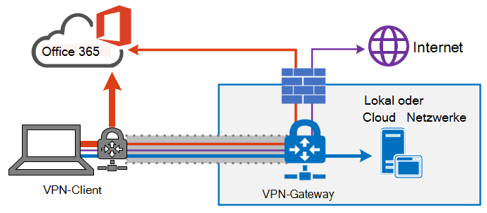
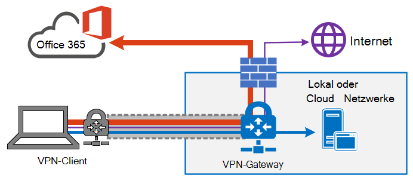

# Optimieren der Office 365-Konnektivität für Remotebenutzer mithilfe eines geteilten VPN-TunnelsOptimize Office 365 connectivity for remote users using VPN split tunneling
<!---
>[!NOTE]
>This topic is part of a set of topics that address Office 365 optimization for remote users.
>- For VPN split tunnel implementation guidance, see [Implementing VPN split tunneling for Office 365](microsoft-365-vpn-implement-split-tunnel.md).
>- For information about optimizing Office 365 worldwide tenant performance for users in China, see [Office 365 performance optimization for China users](microsoft-365-networking-china.md).
-->

Für Kunden, die Ihre Remotearbeitsgeräte mit dem Unternehmensnetzwerk oder der Cloudinfrastruktur über VPN verbinden, empfiehlt Microsoft, dass die wichtigsten Office 365-Szenarios **Microsoft Teams**, **SharePoint Online** und **Exchange Online** über eine _geteilte VPN-Tunnel_-Konfiguration umgeleitet werden.For customers who connect their remote worker devices to the corporate network or cloud infrastructure over VPN, Microsoft recommends that the key Office 365 scenarios **Microsoft Teams**, **SharePoint Online** and **Exchange Online** are routed over a _VPN split tunnel_ configuration. Dies wird besonders wichtig als Strategie zur Erleichterung der fortgesetzten Mitarbeiterproduktivität in Service und Produktion bei großmaßstäbiger Heimarbeit wie z. B. während der COVID-19-Krise.This becomes especially important as the first line strategy to facilitate continued employee productivity during large scale work-from-home events such as the COVID-19 crisis.

_Abbildung 1: eine geteilte VPN-Tunnellösung mit definierten Office 365-Ausnahmen, die direkt an den Dienst gesendet werden. Aller anderer Datenverkehr durchläuft den VPN-Tunnel unabhängig vom Ziel.__Figure 1: A VPN split tunnel solution with defined Office 365 exceptions sent directly to the service. All other traffic traverses the VPN tunnel regardless of destination._

Der Kern dieses Ansatzes besteht darin, Unternehmen eine einfache Methode bereitstellen, das Risiko einer Überlastung der VPN-Infrastruktur zu minimieren und die Leistung von Office 365 innerhalb kürzester Zeit erheblich zu verbessern.The essence of this approach is to provide a simple method for enterprises to mitigate the risk of VPN infrastructure saturation and dramatically improve Office 365 performance in the shortest timeframe possible. Wenn Sie VPN-Clients so konfigurieren, dass der kritischste und umfangreichste Office 365-Datenverkehr den VPN-Tunnel umgehen kann, werden die folgenden Vorteile erreicht:Configuring VPN clients to allow the most critical, high volume Office 365 traffic to bypass the VPN tunnel achieves the following benefits:

- Schwächt die Grundursache für die Mehrzahl der vom Kunden gemeldeten Probleme mit der Leistungs- und Netzwerkkapazität in Unternehmens-VPN-Architekturen mit Auswirkungen auf die Office 365-Benutzeroberfläche sofort abImmediately mitigates the root cause of a majority of customer-reported performance and network capacity issues in enterprise VPN architectures impacting Office 365 user experience
  
  Die empfohlene Lösung zielt speziell auf die im Thema [Office 365-URLs und -IP-Adressbereiche](https://aka.ms/o365ips) als **Optimize** kategorisierten Office 365-Dienstendpunkte ab.The recommended solution specifically targets Office 365 service endpoints categorized as **Optimize** in the topic [Office 365 URLs and IP address ranges](https://aka.ms/o365ips). Der Datenverkehr zu diesen Endpunkten ist in hohem Maße gegen Latenz und Bandbreiteneinschränkung empfindlich, und die Umgehung des VPN-Tunnels kann die Endbenutzererfahrung erheblich verbessern sowie die Netzwerklast des Unternehmens reduzieren.Traffic to these endpoints is highly sensitive to latency and bandwidth throttling, and enabling it to bypass the VPN tunnel can dramatically improve the end user experience as well as reduce the corporate network load. Office 365-Verbindungen, die nicht den größten Teil der Bandbreiten- oder der Benutzeroberflächenbasis bilden, können weiterhin mit dem restlichen Internet-gebundenen Datenverkehr durch den VPN-Tunnel geleitet werden.Office 365 connections that do not constitute the majority of bandwidth or user experience footprint can continue to be routed through the VPN tunnel along with the rest of the Internet-bound traffic. Weitere Informationen finden Sie unter [Die Strategie des geteilten VPN-Tunnels](#the-vpn-split-tunnel-strategy).For more information, see [The VPN split tunnel strategy](#the-vpn-split-tunnel-strategy).

- Kann von Kunden schnell konfiguriert, getestet und implementiert werden, ohne dass zusätzliche Infrastruktur- oder Anwendungsanforderungen erforderlich sindCan be configured, tested and implemented rapidly by customers and with no additional infrastructure or application requirements

  Je nach VPN-Plattform und Netzwerkarchitektur dauert die Implementierung nur wenige Stunden.Depending on the VPN platform and network architecture, implementation can take as little as a few hours. Weitere Informationen finden Sie unter [Implementieren eines geteilten VPN Tunnels](microsoft-365-vpn-implement-split-tunnel.md#implement-vpn-split-tunneling).For more information, see [Implement VPN split tunneling](microsoft-365-vpn-implement-split-tunnel.md#implement-vpn-split-tunneling).

- Bewahrt die Sicherheitsposition von Kunden-VPN-Implementierungen, indem nicht geändert wird, wie andere Verbindungen umgeleitet werden, einschließlich Datenverkehr zum InternetPreserves the security posture of customer VPN implementations by not changing how other connections are routed, including traffic to the Internet

  Die empfohlene Konfiguration folgt dem Prinzip der **minimalen Rechte** für Ausnahmen von VPN-Datenverkehr und ermöglicht Kunden, geteilte VPN-Tunnel zu implementieren, ohne die Benutzer oder die Infrastruktur weiteren Sicherheitsrisiken auszusetzen.The recommended configuration follows the **least privilege** principle for VPN traffic exceptions and allows customers to implement split tunnel VPN without exposing users or infrastructure to additional security risks. Der Netzwerkdatenverkehr, der direkt an Office 365-Endpunkte umgeleitet wird, wird für die Integrität durch die Office-Clientanwendungsstacks überprüft und auf IP-Adressen für Office 365-Dienste festgelegt, die sowohl auf Anwendungs- als auch auf Netzwerkebene verstärkt sind.Network traffic routed directly to Office 365 endpoints is encrypted, validated for integrity by Office client application stacks and scoped to IP addresses dedicated to Office 365 services which are hardened at both the application and network level. Weitere Informationen hierzu finden Sie unter [Alternative Möglichkeiten für Sicherheitsexperten und IT-Mitarbeiter, moderne Sicherheitskontrollen in den heutigen einzigartigen Remotearbeitsszenarios zu erreichen (Blog des Microsoft Security Teams)](https://www.microsoft.com/security/blog/2020/03/26/alternative-security-professionals-it-achieve-modern-security-controls-todays-unique-remote-work-scenarios/).For more information, see [Alternative ways for security professionals and IT to achieve modern security controls in today's unique remote work scenarios (Microsoft Security Team blog)](https://www.microsoft.com/security/blog/2020/03/26/alternative-security-professionals-it-achieve-modern-security-controls-todays-unique-remote-work-scenarios/).

- Wird von den meisten Unternehmens-VPN-Plattformen einheitlich unterstütztIs natively supported by most enterprise VPN platforms

  Microsoft arbeitet weiterhin mit Branchenpartnern an der Erstellung von kommerziellen VPN-Lösungen, um Partnern dabei zu helfen, gezielte Anleitungen und Konfigurationsvorlagen für ihre Lösungen in Übereinstimmung mit den oben aufgeführten Empfehlungen zu entwickeln.Microsoft continues to collaborate with industry partners producing commercial VPN solutions to help partners develop targeted guidance and configuration templates for their solutions in alignment with the above recommendations. Weitere Informationen finden Sie unter [HOWTO-Leitfäden für häufige VPN-Plattformen](microsoft-365-vpn-implement-split-tunnel.md#howto-guides-for-common-vpn-platforms).For more information, see [HOWTO guides for common VPN platforms](microsoft-365-vpn-implement-split-tunnel.md#howto-guides-for-common-vpn-platforms).

>[!TIP]
>Microsoft empfiehlt, die VPN-Konfiguration des geteilten Tunnels auf dokumentierte dedizierte IP-Bereiche für Office 365-Dienste zu konzentrieren.Microsoft recommends focusing split tunnel VPN configuration on documented dedicated IP ranges for Office 365 services. FQDN- oder AppID-basierte geteilte-Tunnel-Konfigurationen sind zwar auf bestimmten VPN-Clientplattformen möglich, decken jedoch möglicherweise wichtige Office 365-Szenarien nicht vollständig ab und können mit IP-basierten VPN-Routingregeln in Konflikt geraten.FQDN or AppID-based split tunnel configurations, while possible on certain VPN client platforms, may not fully cover key Office 365 scenarios and may conflict with IP based VPN routing rules. Aus diesem Grund empfiehlt Microsoft nicht die Verwendung von Office 365-FQDNs zum Konfigurieren des geteilten Tunnel-VPN.For this reason, Microsoft does not recommend using Office 365 FQDNs to configure split tunnel VPN. Die Verwendung der FQDN-Konfiguration kann in anderen verwandten Szenarien nützlich sein, z. B. bei der Anpassung von .PAC-Dateien oder bei der Implementierung der Proxyumgehung.The use of FQDN configuration may be useful in other related scenarios, such as .pac file customizations or to implement proxy bypass.

Vollständige Implementierungsanleitungen finden Sie unter [Implementierung eines geteilten VPN-Tunnels für Office 365](microsoft-365-vpn-implement-split-tunnel.md).For full implementation guidance, see [Implementing VPN split tunneling for Office 365](microsoft-365-vpn-implement-split-tunnel.md).

## Die Strategie des geteilten VPN-TunnelsThe VPN split tunnel strategy

Herkömmliche Unternehmensnetzwerke sind häufig so konzipiert, dass sie sicher für eine Pre-Cloudwelt arbeiten, in der die wichtigsten Daten, Dienste und Anwendungen lokal gehostet werden und direkt mit dem internen Unternehmensnetzwerk verbunden sind, ebenso wie die Mehrzahl der Benutzer.Traditional corporate networks are often designed to work securely for a pre-cloud world where most important data, services, applications are hosted on premises and are directly connected to the internal corporate network, as are the majority of users. Die Netzwerkinfrastruktur basiert also auf diesen Elementen, in denen Zweigniederlassungen über _Multiprotocol Label Switching(MPLS)_-Netzwerke mit dem Hauptsitz verbunden sind und Remotebenutzer über ein VPN eine Verbindung mit dem Unternehmensnetzwerk herstellen müssen, um auf lokale Endpunkte und das Internet zugreifen zu können.Thus network infrastructure is built around these elements in that branch offices are connected to the head office via _Multiprotocol Label Switching (MPLS)_ networks, and remote users must connect to the corporate network over a VPN to access both on premises endpoints and the Internet. Bei diesem Modell wird der gesamte Datenverkehr von Remotebenutzern durch das Unternehmensnetzwerk geleitet und über einen gemeinsamen Ausgangspunkt an den Clouddienst geleitet.In this model, all traffic from remote users traverses the corporate network and is routed to the cloud service through a common egress point.

_Abbildung 2: eine gemeinsame VPN-Lösung für Remotebenutzer, bei welcher der gesamte Datenverkehr unabhängig vom Bestimmungsort wieder in das Unternehmensnetzwerk gezwungen wird__Figure 2: A common VPN solution for remote users where all traffic is forced back into the corporate network regardless of destination_

Da Unternehmen Daten und Anwendungen in die Cloud verlagern, ist dieses Modell weniger effektiv geworden, da es schnell umständlich, kostspielig und nicht skalierbar wird, die Netzwerkleistung und -effizienz der Benutzer erheblich beeinträchtigt und die Möglichkeit der Organisation einschränkt, sich den ändernden Anforderungen anzupassen.As organizations move data and applications to the cloud, this model has begun to become less effective as it quickly becomes cumbersome, expensive and unscalable, significantly impacting network performance and efficiency of users and restricting the ability of the organization to adapt to changing needs. Zahlreiche Microsoft-Kunden haben berichtet, dass vor einigen Jahren 80 % des Netzwerkverkehrs an ein internes Ziel floss, aber im Jahr 2020 werden mehr als 80 % des Datenverkehrs mit einer externen cloudbasierten Ressource vernetzt.Numerous Microsoft customers have reported that a few years ago 80% of network traffic was to an internal destination, but in 2020 80% plus of traffic connects to an external cloud based resource.

Die COVID-19-Krise hat dieses Problem noch verschärft, so dass für die große Mehrheit der Organisationen sofortige Lösungen erforderlich sind.The COVID-19 crisis has aggravated this problem to require immediate solutions for the vast majority of organizations. Viele Kunden haben festgestellt, dass das erzwungene VPN-Modell für ein Szenario 100%iger Remotearbeit, wie es diese Krise erforderlich gemacht hat, nicht skalierbar oder performant genug ist.Many customers have found that the forced VPN model is not scalable or performant enough for 100% remote work scenarios such as that which this crisis has necessitated. Schnelle Lösungen sind erforderlich, damit diese Organisationen weiterhin effizient arbeiten können.Rapid solutions are required for these organization to continue to operate efficiently.

Für den Office 365-Dienst hat Microsoft die Konnektivitätsanforderungen für den Dienst genau auf dieses Problem ausgerichtet, wobei eine gezielte, streng kontrollierte und relativ statische Gruppe von Dienstendpunkten sehr einfach und schnell optimiert werden kann, um eine hohe Leistung für die Benutzer zu erzielen, die auf den Dienst zugreifen, und um die Belastung der VPN-Infrastruktur zu verringern, damit sie von dem Datenverkehr genutzt werden kann, der sie noch benötigt.For the Office 365 service, Microsoft has designed the connectivity requirements for the service with this problem squarely in mind, where a focused, tightly controlled and relatively static set of service endpoints can be optimized very simply and quickly so as to deliver high performance for users accessing the service, and reducing the burden on the VPN infrastructure so it can be used by traffic which still requires it.

In Office 365 werden die erforderlichen Endpunkte für Office 365 in drei Kategorien kategorisiert: **Optimize**, **Allow** und **Default**.Office 365 categorizes the required endpoints for Office 365 into three categories: **Optimize**, **Allow**, and **Default**. Die **Optimize**-Endpunkte stehen hier im Mittelpunkt und weisen die folgenden Merkmale auf:**Optimize** endpoints are our focus here and have the following characteristics:

- Sind Endgeräte im Besitz Microsoft und Verwalteten Endpunkten, auf der Microsoft-Infrastruktur gehostet?Are Microsoft owned and managed endpoints, hosted on Microsoft infrastructure
- Sind für die Kernworkloads von Office 365 wie Exchange Online, SharePoint Online, Skype for Business Online und Microsoft Teams vorgesehenAre dedicated to core Office 365 workloads such as Exchange Online, SharePoint Online, Skype for Business Online, and Microsoft Teams
- Lassen Sie IPs bereitstellenHave IPs provided
- Geringe Änderungsrate, und es wird erwartet, dass die Zahl klein ist (zurzeit 20 IP-Subnetze)Low rate of change and are expected to remain small in number (currently 20 IP subnets)
- sind empfindlich gegen hohe Volumen und/oder LatenzAre high volume and/or latency sensitive
- können die erforderlichen Sicherheitselemente im Dienst anstatt inline im Netzwerk bereitstellenAre able to have required security elements provided in the service rather than inline on the network
- machen ungefähr 70–80 % der Datenmenge des Office 365-Diensts ausAccount for around 70-80% of the volume of traffic to the Office 365 service

Die festgelegten Endpunkte können auf den erzwungenen VPN-Tunnel aufgeteilt werden und über die lokale Benutzeroberfläche direkt an den Office 365-Dienst gesendet werden.This tightly scoped set of endpoints can be split out of the forced VPN tunnel and sent securely and directly to the Office 365 service via the user's local interface. Dies wird als **geteilter Tunnel** bezeichnet.This is known as **split tunneling**.

Sicherheitselemente, wie z. B. DLP, AV-Schutz, Authentifizierung und Zugriffssteuerung, können für diese Endpunkte auf verschiedenen Ebenen innerhalb des Diensts wesentlich effizienter bereitgestellt werden.Security elements such as DLP, AV protection, authentication and access control can all be delivered much more efficiently against these endpoints at different layers within the service. Da auch der Großteil des Datenverkehrvolumens von der VPN-Lösung weggeleitet wird, setzt dies VPN-Kapazität für kritischen geschäftlichen Datenverkehr frei, der immer noch darauf angewiesen ist.As we also divert the bulk of the traffic volume away from the VPN solution, this frees the VPN capacity up for business critical traffic which still relies on it. Außerdem dürfte es in vielen Fällen nicht mehr notwendig sein, ein langwieriges und kostspieliges Aktualisierungsprogramm zu durchlaufen, um diese neue Arbeitsweise handhaben zu können.It also should remove the need in many cases to go through a lengthy and costly upgrade program to deal with this new way of operating.

_Abbildung 3: eine geteilte VPN-Tunnellösung mit definierten Office 365-Ausnahmen, die direkt an den Dienst gesendet werden. Aller anderer Datenverkehr wird unabhängig vom Ziel zurück in das Unternehmensnetzwerk gezwungen.__Figure 3: A VPN split tunnel solution with defined Office 365 exceptions sent direct to the service. All other traffic is forced back into the corporate network regardless of destination._

Aus der Sicherheitsperspektive verfügt Microsoft über eine Reihe von Sicherheitsfunktionen, die verwendet werden können, um eine ähnliche oder sogar verbesserte Sicherheit zu bieten als die, die durch eine Inline-Inspektion durch lokale Sicherheitsstapel erreicht wird.From a security perspective, Microsoft has an array of security features which can be used to provide similar, or even enhanced security than that delivered by inline inspection by on premises security stacks. Der Blogbeitrag des Microsoft Security-Teams [Alternative Möglichkeiten für Sicherheitsexperten und IT-Mitarbeiter, moderne Sicherheitskontrollen in den heutigen, einzigartigen Remotearbeitsszenarios zu erreichen](https://www.microsoft.com/security/blog/2020/03/26/alternative-security-professionals-it-achieve-modern-security-controls-todays-unique-remote-work-scenarios/) bietet eine klare Zusammenfassung der verfügbaren Funktionen. Ausführlichere Anleitungen finden Sie in diesem Artikel.The Microsoft Security team's blog post [Alternative ways for security professionals and IT to achieve modern security controls in today's unique remote work scenarios](https://www.microsoft.com/security/blog/2020/03/26/alternative-security-professionals-it-achieve-modern-security-controls-todays-unique-remote-work-scenarios/) has a clear summary of features available and you'll find more detailed guidance within this article. Über Microsofts Implementierung von geteilten VPN-Tunneling können Sie auch unter [Betrieb über VPN: Wie Microsoft seine Remotemitarbeiter in Verbindung hält](https://www.microsoft.com/itshowcase/blog/running-on-vpn-how-microsoft-is-keeping-its-remote-workforce-connected/?elevate-lv) lesen.You can also read about Microsoft's implementation of VPN split tunneling at [Running on VPN: How Microsoft is keeping its remote workforce connected](https://www.microsoft.com/itshowcase/blog/running-on-vpn-how-microsoft-is-keeping-its-remote-workforce-connected/?elevate-lv).

In vielen Fällen kann diese Umsetzung innerhalb weniger Stunden erreicht werden, was eine rasche Lösung eines der dringendsten Probleme ermöglicht, mit denen Organisationen konfrontiert sind, wenn sie schnell großmaßstäbig auf Remotearbeit umstellen.In many cases, this implementation can be achieved in a matter of hours, allowing rapid resolution to one of the most pressing problems facing organizations as they rapidly shift to full scale remote working. Implementierungsanleitungen für den geteilten VPN-Tunnel finden Sie unter [Implementierung des geteilten VPN-Tunnels für Office 365](microsoft-365-vpn-implement-split-tunnel.md).For VPN split tunnel implementation guidance, see [Implementing VPN split tunneling for Office 365](microsoft-365-vpn-implement-split-tunnel.md).

## Verwandte ThemenRelated topics

[Implementieren eines geteilten VPN-Tunnels für Office 365Implementing VPN split tunneling for Office 365](microsoft-365-vpn-implement-split-tunnel.md)

[Office 365-Leistungsoptimierung für Benutzer in ChinaOffice 365 performance optimization for China users](microsoft-365-networking-china.md)

[Alternative Möglichkeiten für Sicherheitsexperten und IT-Mitarbeiter, moderne Sicherheitskontrollen in den heutigen einzigartigen Remotearbeitsszenarien zu erreichen (Blog des Microsoft Security Teams)Alternative ways for security professionals and IT to achieve modern security controls in today's unique remote work scenarios (Microsoft Security Team blog)](https://www.microsoft.com/security/blog/2020/03/26/alternative-security-professionals-it-achieve-modern-security-controls-todays-unique-remote-work-scenarios/)

[Verbessern der VPN-Leistung bei Microsoft: Verwenden von Windows 10-VPN-Profilen zur Aktivierung automatischer VerbindungenEnhancing VPN performance at Microsoft: using Windows 10 VPN profiles to allow auto-on connections](https://www.microsoft.com/itshowcase/enhancing-remote-access-in-windows-10-with-an-automatic-vpn-profile)

[Betrieb über VPN: Wie Microsoft seine Remotemitarbeitern in Verbindung hältRunning on VPN: How Microsoft is keeping its remote workforce connected](https://www.microsoft.com/itshowcase/blog/running-on-vpn-how-microsoft-is-keeping-its-remote-workforce-connected/?elevate-lv)

[Prinzipien von Office 365-NetzwerkverbindungenOffice 365 Network Connectivity Principles](microsoft-365-network-connectivity-principles.md)

[Bewerten der Office 365-NetzwerkkonnektivitätAssessing Office 365 network connectivity](assessing-network-connectivity.md)

[Microsoft 365-KonnektivitätstestMicrosoft 365 connectivity test](https://aka.ms/netonboard)
