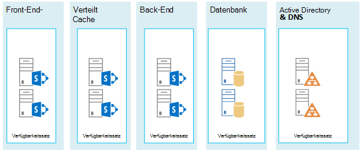

# Microsoft Azure-Architekturen für SharePoint 2013

Azure ist eine gut geeignete Umgebung für das Hosten einer SharePoint 2013-Lösung. In den meisten Fällen wird Microsoft 365 empfohlen, aber eine in Azure gehostete SharePoint Server-Farm kann eine gute Option für bestimmte Lösungen sein. In diesem Artikel wird beschrieben, wie SharePoint-Lösungen entworfen werden, damit sie sich für die Azure-Plattform eignen. Die folgenden beiden spezifischen Lösungen dienen als Beispiele:
  
- [SharePoint Server 2013 - Notfallwiederherstellung in Microsoft Azure](sharepoint-server-2013-disaster-recovery-in-microsoft-azure.md)
    
- [Internetwebsites in Microsoft Azure mit SharePoint Server 2013](internet-sites-in-microsoft-azure-using-sharepoint-server-2013.md)
    
## Empfohlene SharePoint-Lösungen für Azure-Infrastrukturdienste

Azure-Infrastrukturdienste sind eine überzeugende Option für das Hosting von SharePoint-Lösungen. Einige Lösungen sind für diese Plattform besser geeignet als andere. Die folgende Tabelle zeigt die empfohlene Lösungen.
  
|**Lösung**|**Warum diese Lösung für Azure empfohlen wird**|
|:-----|:-----|
|Entwicklungs- und Testumgebungen    |Es ist einfach, diese Umgebungen zu erstellen und zu verwalten.    |
|Notfallwiederherstellung lokaler SharePoint-Farmen in Azure    |**Gehostetes sekundäres Rechenzentrum** Verwenden Sie Azure, statt in ein sekundäres Rechenzentrum in einer anderen Region zu investieren.   **Kostengünstige Umgebungen für die Notfallwiederherstellung** Im Vergleich zu einer lokalen Umgebung für die Notfallwiederherstellung müssen Sie weniger Ressourcen vorhalten und bezahlen. Die Anzahl der Ressourcen hängt von der gewählten Umgebung für die Notfallwiederherstellung ab: verzögert betriebsbereit, betriebsbereit und unmittelbar betriebsbereit.  **Flexiblere Plattform** Bei einem Notfall können Sie Ihre SharePoint-Wiederherstellungsfarm problemlos horizontal skalieren, um die Lastanforderungen zu erfüllen. Skalieren Sie sie horizontal herunter, wenn Sie die Ressourcen nicht mehr benötigen.  Siehe [SharePoint Server 2013 - Notfallwiederherstellung in Microsoft Azure](sharepoint-server-2013-disaster-recovery-in-microsoft-azure.md).    |
|Mit dem Internet verbundene Websites, die Features und Skalierung verwenden, sind in Microsoft 365 nicht verfügbar    |**Konzentrieren Ihrer Bemühungen** Konzentrieren Sie sich auf das Erstellen einer großartigen Website anstatt auf das Erstellen einer Infrastruktur.   **Ausnutzen der Flexibilität in Azure** Wählen Sie die Größe der Farm den Anforderungen entsprechend durch Hinzufügen neuer Server aus, und zahlen Sie nur für Ressourcen, die Sie benötigen. Eine dynamische Zuordnung von Computern (automatische Skalierung) wird nicht unterstützt.  **Verwendung von Azure Active Directory (AD)** Nutzen Sie Azure AD für Kundenkonten.   **Hinzufügen von SharePoint-Funktionen, die in Microsoft 365 nicht verfügbar sind** Fügen Sie tiefe Berichte und Webanalysen hinzu.   Siehe [Internetwebsites in Microsoft Azure mit SharePoint Server 2013](internet-sites-in-microsoft-azure-using-sharepoint-server-2013.md).    |
|App-Farmen zur Unterstützung von Microsoft 365- oder lokalen Umgebungen    |**Erstellen, Testen und Hosten von Apps** in Azure zum Unterstützen von sowohl lokalen als auch von Cloud-Umgebungen.   **Hosten dieser Rolle** in Azure anstelle der Anschaffung neuer Hardware für lokale Umgebungen.   |
   
Berücksichtigen Sie für Intranet- und Zusammenarbeitslösungen und Arbeitslasten die folgenden Optionen:
  
- Ermitteln Sie, ob Microsoft 365 Ihre Geschäftlichen Anforderungen erfüllt oder Teil der Lösung sein kann. Microsoft 365 bietet einen reichhaltigen Funktionssatz, der immer auf dem neuesten Stand ist.
    
- Wenn Microsoft 365 nicht alle Geschäftlichen Anforderungen erfüllt, sollten Sie eine standardimplementierung von SharePoint 2013 lokal von Microsoft Consulting Services (MCS) in Betracht ziehen. Eine Standardarchitektur kann eine schnellere, kostengünstigere und einfachere Lösung für Sie sein als die Unterstützung einer angepassten Lösung. 
    
- Wenn eine Standardimplementierung Ihre geschäftlichen Anforderungen nicht erfüllt, erwägen Sie eine angepasste lokale Lösung.
    
- Wenn eine Cloudplattform für Ihre geschäftlichen Anforderungen wichtig ist, verwenden Sie eine standardmäßige oder benutzerdefinierte Implementierung von SharePoint 2013 (gehostet in Azure-Infrastrukturdiensten). SharePoint-Lösungen sind in Azure viel einfacher zu unterstützen als auf anderen nicht von Microsoft stammenden öffentlichen Cloudplattformen.
    
## Vor dem Entwerfen der Azure-Umgebung

Auch wenn in diesem Artikels Beispieltopologien für SharePoint verwendet werden, können Sie diese Entwurfskonzepte auf alle anderen SharePoint-Farmtopologien übertragen. Befolgen Sie vor dem Entwurf der Azure-Umgebung die folgenden Anleitungen zu Topologie, Architektur, Kapazität und Leistung, um die SharePoint-Farm zu entwerfen.
  
- [Technische Diagramme für SharePoint 2013](/SharePoint/technical-reference/technical-diagrams)
    
- [Plan for performance and capacity management in SharePoint Server 2013](/SharePoint/administration/performance-planning-in-sharepoint-server-2013)
    
## Bestimmen des Active Directory-Domänentyps

Jede SharePoint-Serverfarm verwendet Active Directory zum Bereitstellen von Administratorkonten für die Einrichtung einer Farm. Derzeit gibt zwei Optionen für SharePoint-Lösungen in Azure, die in der folgenden Tabelle beschrieben sind.
  
|**Option**|**Beschreibung**|
|:-----|:-----|
|Dedizierte Domäne    |Sie können eine dedizierte und isolierte Active Directory-Domäne in Azure zur Unterstützung der SharePoint-Farm bereitstellen. Dies ist eine gute Wahl für öffentlich zugängliche Internetwebsites.    |
|Erweitern der lokalen Domäne über eine standortübergreifende Verbindung    |Wenn Sie die lokale Domäne über eine standortübergreifende Verbindung erweitern, greifen Benutzer auf die SharePoint-Farm über Ihr Intranet genauso zu, als ob sie lokal gehostet würde. Sie können Ihre lokale Active Directory- und DNS-Implementierung nutzen.    Eine standortübergreifende Verbindung ist für die Erstellung einer Umgebung für die Notfallwiederherstellung in Azure erforderlich, in die ein Failover aus der lokalen Farm erfolgt.    |
   
Dieser Artikel enthält Entwurfskonzepte zum Erweitern der lokalen Domäne über eine standortübergreifende Verbindung. Wenn Ihre Lösung eine dedizierte Domäne verwendet, benötigen Sie keine standortübergreifende Verbindung.
  
## Entwerfen des virtuellen Netzwerks

Zunächst benötigen Sie ein virtuelles Netzwerk in Azure mit Subnetzen, in denen Sie Ihre virtuellen Computer platzieren. Das virtuelle Netzwerk benötigt einen privaten IP-Adressraum, von dem Sie Teile den Subnetzen zuweisen.
  
Wenn Sie Ihr lokales Netzwerk auf Azure über eine standortübergreifende Verbindung (für eine Notfallwiederherstellungsumgebung erforderlich) erweitern, müssen Sie einen privaten Adressraum auswählen, der nicht bereits an anderer Stelle im Netzwerk Ihrer Organisation verwendet wird, was die lokale Umgebung und andere virtuelle Azure-Netzwerke umfassen kann. 
  
**Abbildung 1: Lokale Umgebung mit einem virtuellen Netzwerk in Azure**

  
Inhalt dieses Diagramms:
  
- Ein virtuelles Netzwerk in Azure und die lokale Umgebung werden nebeneinander dargestellt. Die beiden Umgebungen sind noch nicht über eine standortübergreifende Verbindung verbunden. Dabei kann es sich um eine VPN-Verbindung oder ExpressRoute von Standort zu Standort handeln.
    
- An diesem Punkt umfasst das virtuelle Netzwerk nur die Subnetze und keine anderen Elemente der Architektur. Ein Subnetz hostet das Azure-Gateway, und andere Subnetze hosten die Ebenen der SharePoint-Farm, wobei ein weiteres für Active Directory und DNS verwendet wird.
    
## Hinzufügen von standortübergreifender Konnektivität

Der nächste Bereitstellungsschritt ist das Erstellen der standortübergreifenden Verbindung (falls dies für Ihre Lösung gilt). Bei standortübergreifende Verbindungen befindet sich ein Azure-Gateway in einem separaten Gatewaysubnetz, das Sie erstellen und dem Sie einen Adressraum zuweisen müssen. 
  
Bei der Planung für eine standortübergreifende Verbindung definieren und erstellen Sie ein Azure-Gateway und eine Verbindung mit einem lokalen Gatewaygerät.
  
**Abbildung 2: Verwenden eines Azure-Gateways und eines lokalen Gatewaygeräts zum Bereitstellen einer Standort-zu-Standort-Verbindung zwischen der lokalen Umgebung und Azure**

  
Inhalt dieses Diagramms:
  
- Als Ergänzung des vorherigen Diagramms wird die lokale Umgebung mit dem virtuellen Azure-Netzwerk durch eine standortübergreifende Verbindung verbunden. Dabei kann es sich um eine Standort-zu-Standort-VPN-Verbindung oder um ExpressRoute handeln.
    
- Ein Azure-Gateway befindet sich in einem Gateway-Subnetz.
    
- Die lokale Umgebung umfasst ein Gatewaygerät, z. B. einen Router oder einen VPN-Server.
    
Weitere Informationen zum Planen und Erstellen eines standortübergreifenden virtuellen Netzwerks finden Sie unter [Verbinden eines lokalen Netzwerks mit einem virtuellen Microsoft Azure-Netzwerk](connect-an-on-premises-network-to-a-microsoft-azure-virtual-network.md).
  
## Hinzufügen von Active Directory Domain Services (AD DS) und DNS

Für die Notfallwiederherstellung in Azure stellen Sie Windows Server AD und DNS in einem Hybridszenario bereit, wobei Windows Server AD sowohl lokal als auch auf virtuellen Azure-Computern bereitgestellt wird.
  
**Abbildung 3: Hybride Active Directory-Domänenkonfiguration**

  
Dieses Diagramm basiert auf den vorherigen Diagrammen und enthält zwei weitere virtuelle Computer für ein Windows Server AD- und DNS-Subnetz. Diese virtuellen Computer sind Replikat-Domänencontroller und DNS-Server. Sie dienen als Erweiterung der lokalen Windows Server AD-Umgebung. 
  
Die folgende Tabelle enthält Empfehlungen für diese virtuellen Computer in Azure. Befolgen Sie diese Empfehlungen als Ausgangspunkt für den Entwurf Ihrer eigenen Umgebung, auch für eine dedizierte Domäne, in der Ihre Azure-Umgebung nicht mit Ihrer lokalen Umgebung kommuniziert.
  
|**Element**|**Konfiguration**|
|:-----|:-----|
|Größe des virtuellen Computers in Azure    |A1- oder A2-Größe in der Standardebene    |
|Betriebssystem    |Windows Server 2012 R2    |
|Active Directory-Rolle    |Als globaler Katalogserver fungierender AD DS-Domänencontroller. Diese Konfiguration verringert den ausgehenden Datenverkehr über die standortübergreifende Verbindung.    Konfigurieren Sie in einer Umgebung mit mehreren Domänen mit hohen Änderungsraten (die es nicht häufig gibt) die lokalen Domänencontroller nicht für die Synchronisierung mit den globalen Katalogservern in Azure, um den Replikationsdatenverkehr zu reduzieren.    |
|DNS-Rolle    |Installieren und konfigurieren Sie den DNS-Serverdienst auf den Domänencontrollern.    |
|Datenträger    |Platzieren Sie die Active Directory-Datenbank, Protokolle und SYSVOL auf zusätzlichen Azure-Datenträgern. Platzieren Sie sie nicht auf dem Datenträger mit dem Betriebssystem oder den temporären Datenträgern, die von Azure bereitgestellt werden.    |
|IP-Adressen    |Verwenden Sie statische IP-Adressen und konfigurieren Sie das virtuelle Netzwerk, um diese Adressen den virtuellen Computern im virtuellen Netzwerk zuzuweisen, nachdem die Domänencontroller konfiguriert wurden.    |
   
> [!IMPORTANT]
> Lesen Sie vor der Bereitstellung von Active Directory in Azure die [Richtlinien für die Bereitstellung von Windows Server Active Directory auf virtuellen Computern in Azure](/windows-server/identity/ad-ds/introduction-to-active-directory-domain-services-ad-ds-virtualization-level-100). Diese Hilfedateien helfen Ihnen zu bestimmen, ob eine andere Architektur oder andere Konfigurationseinstellungen für Ihre Lösung erforderlich sind. 
  
## Hinzufügen der SharePoint-Farm

Platzieren Sie diese virtuellen Computer der SharePoint-Farm in Ebenen der entsprechenden Subnetze.
  
**Abbildung 4: Platzierung der virtuellen SharePoint-Computer**

  
Dieses Diagramm basiert auf den vorherigen Abbildungen und enthält die beiden SharePoint-Farmserverrollen in ihren entsprechenden Ebenen.
  
- Zwei virtuelle Datenbankcomputer mit SQL Server erstellen die Datenbankebene.
    
- Zwei virtuelle Computer mir SharePoint Server 2013 für jede der folgenden Ebenen: Front-End-Server, verteilte Cacheserver und Back-End-Server.
    
## Entwerfen und Optimieren von Serverrollen für Verfügbarkeitssätze und Fehlerdomänen

Eine Fehlerdomäne ist eine Gruppierung von Hardware, in der Rolleninstanzen ausgeführt werden. Virtuelle Computer in der gleichen Fehlerdomäne können von der Azure-Infrastruktur gleichzeitig aktualisiert werden. Oder sie können zur gleichen Zeit ausfallen, da sie ein Rack gemeinsam verwenden. Um das Risiko zu vermeiden, dass zwei virtuelle Computer zur selben Fehlerdomäne gehören, können Sie Ihre virtuellen Computer als Verfügbarkeitssatz konfigurieren, was sichergestellt, dass jeder virtuelle Computer in einer anderen Fehlerdomäne enthalten ist. Wenn drei virtuelle Computer als Verfügbarkeitssatz konfiguriert sind stellt Azure sicher, dass sich nicht mehr als zwei virtuelle Computer in derselben Fehlerdomäne befinden.
  
Konfigurieren Sie beim Entwerfen der Azure-Architektur einer SharePoint-Farm im Rahmen eines Verfügbarkeitssatzes identische Serverrollen. Dadurch wird sichergestellt, dass die virtuellen Computer auf mehrere Fehlerdomänen verteilt sind.
  
**Abbildung 5: Verwenden von Azure-Verfügbarkeitssätzen zum Bereitstellen hoher Verfügbarkeit für die SharePoint-Farmebenen**

  
Dieses Diagramm zeigt die Konfiguration der Verfügbarkeitssätze innerhalb der Azure-Infrastruktur. Jede der folgenden Rollen teilt sich einen eigenen Verfügbarkeitssatz:
  
- Active Directory und DNS
    
- Datenbank
    
- Back-End
    
- Verteilter Cache
    
- Front-End
    
Die SharePoint-Farm muss möglicherweise auf der Azure-Plattform optimiert werden. Um eine hohe Verfügbarkeit aller Komponenten sicherzustellen, vergewissern Sie sich, dass alle Serverrollen identisch konfiguriert sind.
  
Es folgt ein Beispiel einer Standardarchitektur von Internetwebsites, die bestimmte Kapazitäts- und Leistungsvorgaben erfüllt. Dieses Beispiel ist im folgenden Architekturmodell enthalten: [Architekturen für Internetwebsitesuche für SharePoint Server 2013](https://go.microsoft.com/fwlink/p/?LinkId=261519).
  
**Abbildung 6: Beispiel der Planung der Kapazitäts- und Leistungsziele in einer Farm mit drei Ebenen**

  
Inhalt dieses Diagramms:
  
- Eine Farm mit drei Ebenen – Webserver, Anwendungsserver und Datenbankserver – wird gezeigt.
    
- Die drei Webserver sind mit mehreren Komponenten identisch konfiguriert.
    
- Die beiden Datenbankserver sind identisch konfiguriert.
    
- Die drei Anwendungsserver sind nicht identisch konfiguriert. Diese Serverrollen benötigen in Azure eine Optimierung für Verfügbarkeitsätze.
    
Die Ebene der Anwendungsserver wollen wir uns genauer ansehen.
  
**Abbildung 7: Anwendungsserverebene vor der Optimierung**

  
Inhalt dieses Diagramms:
  
- Die Anwendungsebene enthält drei Server.
    
- Der erste Server umfasst vier Komponenten.
    
- Der zweite Server umfasst drei Komponenten.
    
- Der dritte Server umfasst zwei Komponenten.
    
Sie bestimmen die Anzahl der Komponenten anhand der Leistungs- und Kapazitätsvorgaben für die Farm. Für die Anpassung dieser Architektur an Azure werden die vier Komponenten auf alle drei Server repliziert. Dies erhöht die Anzahl der Komponenten über die Leistungs-und Kapazitätsvorgaben hinaus. Der Vorteil besteht darin, dass dieser Entwurf für Hochverfügbarkeit aller vier Komponenten auf der Azure-Plattform sorgt, wenn diese drei virtuelle Computer einem Verfügbarkeitssatz zugewiesen werden.
  
**Abbildung 8: Anwendungsserverebene nach der Optimierung**

  
Zeigt alle drei Anwendungsserver, die mit den gleichen vier Komponenten identisch konfiguriert sind.
  
Wenn wir den Ebenen der SharePoint-Farm Verfügbarkeitssätze hinzufügen, ist die Implementierung abgeschlossen.
  
**Abbildung 9: Die fertige SharePoint-Farm in Azure-Infrastrukturdiensten**

  
Dieses Diagramm zeigt die in Azure-Infrastrukturdiensten implementierte SharePoint-Farm mit Verfügbarkeitssätzen zum Bereitstellen von Fehlerdomänen für die Server in den einzelnen Ebenen.
  
## Siehe auch

[Microsoft 365-Lösungs- und Architekturcenter](../solutions/index.yml)
  
[Internetwebsites in Microsoft Azure mit SharePoint Server 2013](internet-sites-in-microsoft-azure-using-sharepoint-server-2013.md)
  
[SharePoint Server 2013 - Notfallwiederherstellung in Microsoft Azure](sharepoint-server-2013-disaster-recovery-in-microsoft-azure.md)