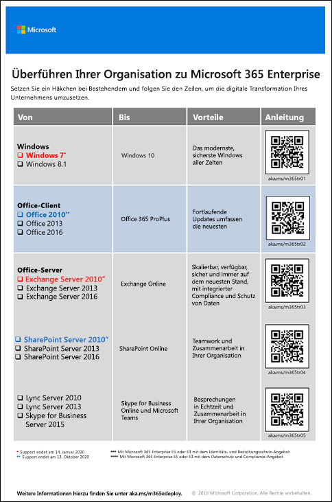

# Migration nach Microsoft 365 Enterprise

In den meisten Unternehmen gibt es eine heterogene Umgebung mit mehreren Versionen von Betriebssystemen, Clientsoftware und Serversoftware. Microsoft 365 Enterprise umfasst die sichersten Versionen dieser wichtigen Komponenten Ihrer IT-Infrastruktur und enthält Produktivitätsfeatures, die so konzipiert sind, dass Cloudtechnologien genutzt werden.

Um den Geschäftswert der integrierten Suite von Microsoft 365 Enterprise-Produkten zu maximieren, beginnen Sie mit der Planung und Implementierung einer Strategie zum Migrieren der Versionen von:

- Dem auf Ihren Computern installierten Office-Client nach Office 365 ProPlus
- Den auf Ihren Servern installierten Office-Servern nach deren entsprechenden Diensten in Office 365
- Windows 7 und Windows 8.1 auf Ihren Geräten nach Windows 10 Enterprise

>[!Note]
>Windows 7 erreicht am 14. Januar 2020 das Ende des Supports. Klicken Sie [hier](https://support.microsoft.com/help/4057281/windows-7-support-will-end-on-january-14-2020), um weitere Informationen zu erhalten.
>

Durch schrittweises Ausführen dieser Migrationen wird Ihre Organisation zunehmend ein [moderner Arbeitsplatz](https://www.microsoft.com/microsoft-365/blog/2018/04/27/making-it-simpler-with-a-modern-workplace/), eine sichere und integrierte Umgebung, die Teamarbeit und Kreativität in Ihrer Organisation fördert, die wiederum durch Microsoft 365 Enterprise ermöglicht und unterstützt wird.  

Hier finden Sie Informationen zur Migration von Benutzern und Daten für bestimmte Office 365-Workloads:

- Benutzerpostfächer von Exchange Server nach Exchange Online: siehe [Exchange Online-Workload](exchangeonline-workload.md).
- SharePoint-Daten von SharePoint Server nach SharePoint Online: siehe [SharePoint Online-Workload](sharepoint-online-onedrive-workload.md).
- Skype for Business Online nach Microsoft Teams: siehe [Microsoft Teams-Workload](teams-workload.md).

## Migration für Microsoft Office-Clientprodukte

In vielen großen und kleinen Organisationen wird vielleicht eine Kombination älterer Versionen der Office-Clientprodukte verwendet, z. B. Word, Excel und PowerPoint. Diese älteren Versionen:

- Können mit den neuesten Sicherheitsupdates und Supportfixes [aktualisiert](https://support.office.com/article/install-office-updates-2ab296f3-7f03-43a2-8e50-46de917611c5) werden, der Prozess erfolgt aber manchmal manuell und ist vielleicht in Ihrer Organisation nicht skalierbar.
- Sind nicht optimal geeignet, um die Cloudtechnologien von Microsoft auszuschöpfen und Sie bei der digitalen Transformation Ihres Unternehmens zu unterstützen.
 
Microsoft 365 Enterprise umfasst Office 365 ProPlus, eine Version der Office-Clientprodukte, die mit einer Microsoft 365 Enterprise-Lizenz verfügbar sind und aus der Microsoft-Cloud installiert und aktualisiert werden. Weitere Informationen finden Sie unter [Informationen zu Office 365 ProPlus im Unternehmen](https://docs.microsoft.com/deployoffice/about-office-365-proplus-in-the-enterprise).

### Office 2007

Für Versionen von Office in Office 2007 wurde die Unterstützung bereits eingestellt. Weitere Informationen finden Sie unter [Ende der Unterstützung für Office 2007 – Roadmap](https://docs.microsoft.com/deployoffice/office-2007-end-support-roadmap).

Anstatt Ihre Computer, auf denen Office 2007 ausgeführt wird, mit Office 2010, Office 2013 oder Office 2016 zu aktualisieren, sollten Sie Folgendes in Betracht ziehen: 

1. Abrufen und Zuweisen einer Microsoft 365-Lizenz für Ihre Benutzer.
2. Deinstallieren von Office 2007 auf deren Computern.
3. Installieren von Office 365 ProPlus, entweder einzeln oder in Verbindung mit einem IT-Rollout. Weitere Informationen finden Sie unter [Phase 4: Office 365 ProPlus](office365proplus-infrastructure.md).

Office 365 ProPlus installiert Updates automatisch und nutzt cloudbasierte Dienste in Office 365 für verbesserte Sicherheit und Produktivität.

### Office 2010

Für Versionen von Office in Office 2010 wird der Support am 13. Oktober 2020 eingestellt. Weitere Informationen finden Sie unter [Ende der Unterstützung für Office 2010 – Roadmap](https://docs.microsoft.com/deployoffice/office-2010-end-support-roadmap).

Anstatt Ihre Computer, auf denen Office 2010 ausgeführt wird, mit Office 2013 oder Office 2016 zu aktualisieren (beide müssen manuell aktualisiert werden), sollten Sie Folgendes in Betracht ziehen:  

1. Abrufen und Zuweisen einer Microsoft 365-Lizenz für Ihre Benutzer.
2. Deinstallieren von Office 2010 auf deren Computern.
3. Installieren von Office 365 ProPlus, entweder einzeln oder in Verbindung mit einem IT-Rollout. Weitere Informationen finden Sie unter [Phase 4: Office 365 ProPlus](office365proplus-infrastructure.md).

Office 365 ProPlus installiert Updates automatisch und nutzt cloudbasierte Dienste in Office 365 für verbesserte Sicherheit und Produktivität.

### Office 2013 und Office 2016

Die Roadmap für das Ende der Unterstützung für die Office 2013- und Office 2016-Versionen von Office wurde noch nicht festgelegt. Wie bei Office 2010 müssen Sie aber weiterhin [Updates installieren](https://support.office.com/article/install-office-updates-2ab296f3-7f03-43a2-8e50-46de917611c5), was je nach der Größe Ihrer Organisation möglicherweise nicht gut skalierbar ist. Anstatt Ihre Computer ständig mit den neuesten Updates für Office 2013 oder Office 2016 oder Ihre Computer von Office 2013 auf Office 2016 zu aktualisieren, sollten Sie Folgendes in Betracht ziehen:

1. Abrufen und Zuweisen einer Microsoft 365-Lizenz für Ihre Benutzer.
2. Deinstallieren von Office 2013 oder Office 2016 auf deren Computern.
3. Installieren von Office 365 ProPlus, entweder einzeln oder in Verbindung mit einem IT-Rollout. Weitere Informationen finden Sie unter [Phase 4: Office 365 ProPlus](office365proplus-infrastructure.md).

Office 365 ProPlus installiert Updates automatisch und nutzt cloudbasierte Dienste in Office 365 für verbesserte Sicherheit und Produktivität.

## Migration für Microsoft Office-Serverprodukte

In vielen großen und kleinen Organisationen wird vielleicht eine Kombination älterer Versionen der Office-Serverprodukte verwendet, z. B. Exchange Server und SharePoint Server. Diese älteren Versionen:

- Sollten mit den neuesten Sicherheitsupdates und Supportfixes aktualisiert werden. In einigen Fällen werden diese Updates monatlich veröffentlicht.
- Sind nicht optimal geeignet, um die Cloudtechnologien von Microsoft auszuschöpfen und Sie bei der digitalen Transformation Ihres Unternehmens zu unterstützen.
- Umfassen keine neuen Produktivitätsanwendungen, z. B. Microsoft Teams.
- Umfassen nicht die neuesten Sicherheitsfeatures wie Exchange Advanced Threat Protection.

Microsoft 365 Enterprise umfasst Office 365, das cloudbasierte Versionen von Office-Serverdiensten enthält, die einige gleiche Tools wie lokale Versionen von Office-Serversoftware enthalten, z. B. Webbrowser und den Outlook-Client. Diese Dienste werden ständig ohne Beteiligung der IT aktualisiert, sodass Sie die Zeit sparen, die das Warten und Aktualisieren von lokalen Servern dauert. Diese Dienste weisen auch Verbesserungen auf, die in der Office-Serversoftware nicht vorhanden sind. 

### Office Server 2007

Für Serverprodukte in Office 2007 wurde die Unterstützung bereits eingestellt. In den folgenden Artikeln finden Sie weitere Informationen:

- [Ende der Unterstützung für Exchange 2007 – Roadmap](https://docs.microsoft.com/office365/enterprise/exchange-2007-end-of-support)
- [Ende der Unterstützung für SharePoint Server 2007 – Roadmap](https://docs.microsoft.com/office365/enterprise/sharepoint-2007-end-of-support)
- [Ende der Unterstützung für Project Server 2007 – Roadmap](https://docs.microsoft.com/office365/enterprise/project-server-2007-end-of-support)
- [Ende der Unterstützung für Office Communications Server – Roadmap](https://docs.microsoft.com/skypeforbusiness/plan-your-deployment/upgrade)
- [Ende der Unterstützung für PerformancePoint Server 2007 – Roadmap](https://docs.microsoft.com/office365/enterprise/pps-2007-end-of-support)

Anstatt Ihre Serverprodukte in Office 2007 durch Serverprodukte in Office 2010, Office 2013 oder Office 2016 zu aktualisieren, sollten Sie Folgendes in Betracht ziehen:

1. Migrieren der Daten auf Ihren Office 2007-Servern nach Office 365. Wenden Sie sich hierfür an einen Microsoft-Partner.
2. Einführen der neuen Funktionen und Arbeitsprozesse bei Ihren Benutzern.
3. Außerbetriebsetzung der lokalen Server mit Office 2007-Serverprodukten, wenn diese nicht mehr benötigt werden.

### Office Server 2010

Für Serverprodukte in Office 2010 wurde das Ende der Unterstützung für Folgendes festgelegt:

- [Exchange Server 2010](https://docs.microsoft.com/office365/enterprise/exchange-2010-end-of-support)
- [SharePoint Server 2010](https://docs.microsoft.com/office365/enterprise/upgrade-from-sharepoint-2010)

Anstatt Ihre Serverprodukte in Office 2010 durch Serverupdates in Office 2013 oder Office 2016 zu aktualisieren, sollten Sie Folgendes in Betracht ziehen:

1. Migrieren der Daten auf Ihren Office 2010-Servern nach Office 365. Lesen Sie hierfür den Artikel [FastTrack für Microsoft 365](https://fasttrack.microsoft.com/microsoft365), oder wenden Sie sich an einen Microsoft-Partner.
2. Einführen der neuen Funktionen und Arbeitsprozesse bei Ihren Benutzern.
3. Außerbetriebsetzung der lokalen Server mit Office 2010-Serverprodukten, wenn diese nicht mehr benötigt werden.

### Office Server 2013

Das Ende der Unterstützung für Serverprodukte in Office 2013 wurde noch nicht festgelegt. Anstatt Ihre Serverprodukte in Office 2013 mit Serverprodukten in Office 2016 zu aktualisieren, sollten Sie Folgendes in Betracht ziehen:

1. Migrieren der Daten auf Ihren Office 2013-Servern nach Office 365. Lesen Sie hierfür den Artikel [FastTrack für Microsoft 365](https://fasttrack.microsoft.com/microsoft365), oder wenden Sie sich an einen Microsoft-Partner.
2. Einführen der neuen Funktionen und Arbeitsprozesse bei Ihren Benutzern.
3. Außerbetriebsetzung der lokalen Server mit Office 2013-Serverprodukten, wenn diese nicht mehr benötigt werden.

### Office Server 2016

Das Ende der Unterstützung für Serverprodukte in Office 2016 wurde noch nicht festgelegt. Um den cloudbasierten Dienst und Verbesserungen zum digitalen Transformieren Ihres Unternehmens zu nutzen, sollten Sie Folgendes in Betracht ziehen:

1. Migrieren der Daten auf Ihren Office 2016-Servern nach Office 365. Lesen Sie hierfür den Artikel [FastTrack für Microsoft 365](https://fasttrack.microsoft.com/microsoft365), oder wenden Sie sich an einen Microsoft-Partner.
2. Einführen der neuen Funktionen und Arbeitsprozesse bei Ihren Benutzern.
3. Außerbetriebsetzung der lokalen Server mit Office 2016-Serverprodukten, wenn diese nicht mehr benötigt werden.

## Migration für Microsoft Windows

Um Ihre Geräte mit Windows 7 oder Windows 8.1 zu migrieren, können Sie ein [direktes Upgrade](https://docs.microsoft.com/microsoft-365/enterprise/windows10-deploy-inplaceupgrade) durchführen. 

Informationen zu weiteren Methoden finden Sie unter [Bereitstellungsszenarien für Windows 10](https://docs.microsoft.com/windows/deployment/windows-10-deployment-scenarios). Sie können [die Bereitstellung von Windows 10](https://aka.ms/planforwin10deployment) auch selbst planen.

## Funktionsweise von Microsoft 365 Enterprise bei Microsoft

Erfahren Sie anhand der folgenden Ressourcen, wie IT-Experten bei Microsoft die Migration des Unternehmens nach Microsoft 365 Enterprise ausführten: 

- [Bereitstellen und Aktualisieren von Microsoft Office 365 ProPlus](https://www.microsoft.com/itshowcase/Article/Content/757/Deploying-and-updating-Microsoft-Office-365-ProPlus)
- [Microsoft migriert 150.000 Postfächer nach Exchange Online](https://www.microsoft.com/itshowcase/Article/Content/577/Microsoft-migrates-150000-mailboxes-to-Exchange-Online)
- [SharePoint in der Cloud: Erfahren Sie, wie Microsoft seine eigene Migration ausführte](https://www.microsoft.com/itshowcase/Article/Content/691/SharePoint-to-the-cloud-Learn-how-Microsoft-ran-its-own-migration)
- [Bereitstellung von Windows 10 bei Microsoft als direktes Upgrade](https://www.microsoft.com/itshowcase/Article/Content/668/Deploying-Windows-10-at-Microsoft-as-an-inplace-upgrade)
- [Bereitstellung von Windows 10: Tipps und Tricks von der Microsoft-IT](https://www.microsoft.com/itshowcase/Article/Content/951/Windows-10-deployment-tips-and-tricks-from-Microsoft-IT) (Video)

## Umstellung Ihrer gesamten Organisation

Um einen besseren Überblick zu erhalten, wie Sie Ihre gesamte Organisation auf Microsoft 365 Enterprise umstellen können, laden Sie das [Poster zur Umstellung](https://github.com/MicrosoftDocs/microsoft-365-docs/raw/public/microsoft-365/enterprise/media/deploy-microsoft-365-enterprise/transitionorgtom365.pdf) herunter.

Dieses zweiseitige Poster ist eine schnelle Methode, um eine Aufstellung Ihrer vorhandenen Infrastruktur zu erstellen und die Anweisungen für den Wechsel zum entsprechenden Produkt oder Dienst in Microsoft 365 Enterprise zu finden. Es enthält die in diesem Artikel beschriebenen Produkte sowie weitere Infrastruktur- und Sicherheitselemente wie Geräteverwaltung, sowie Identitäts-, Daten- und Bedrohungsschutz.

Sie können dieses Poster in den Formaten "Brief", "Legal" oder "Tabloid (27,94 x 43,18 cm)" drucken.

## Ergebnis

In Ihrer Organisation wurden ältere Versionen von Microsoft Office, Office-Servern und Windows nach Microsoft 365 Enterprise migriert.
