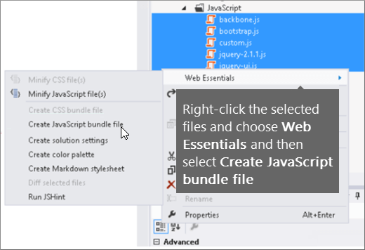
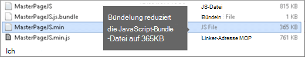

# Minimierung und Bündelung in SharePoint Online

In diesem Artikel wird beschrieben, wie Sie Minimierungs-und Kopplungstechniken mit WebEssentials verwenden, um die Anzahl der HTTP-Anforderungen zu reduzieren und die Zeit zu reduzieren, die zum Laden von Seiten in SharePoint Online benötigt wird.
  
Wenn Sie Ihre Website anpassen, können Sie am Ende eine große Anzahl zusätzlicher Dateien auf dem Server hinzufügen, um die Anpassung zu unterstützen. Durch Hinzufügen von zusätzlichen JavaScript-, CSS-und Bilddateien wird die Anzahl der HTTP-Anforderungen an den Server erhöht, was wiederum die Zeit für die Anzeige einer Webseite erhöht. Wenn Sie mehrere Dateien desselben Typs haben, können Sie diese Dateien bündeln, damit diese Dateien schneller heruntergeladen werden.
  
Bei JavaScript-und CSS-Dateien können Sie auch einen Ansatz namens "Minimierungs" verwenden, bei dem Sie die Gesamtgröße von Dateien verringern, indem Sie Leerzeichen und andere nicht benötigte Zeichen entfernen.
  
## Minimierungs und Bündelung von JavaScript-und CSS-Dateien mit WebEssentials

Sie können Drittanbietersoftware wie WebEssentials verwenden, um CSS-und JavaScript-Dateien zu bündeln.
  
> [!IMPORTANT]
> WebEssentials ist ein Open-Source-Projekt von Drittanbietern, das auf communitybasis basiert. Die Software ist eine Erweiterung für Visual Studio 2012 und Visual Studio 2013 und wird von Microsoft nicht unterstützt. Um Web Essentials herunterzuladen, besuchen Sie die Website unter [https://vswebessentials.com/download](https://go.microsoft.com/fwlink/p/?LinkId=525629) . 
  
WebEssentials bietet zwei Formen der Bündelung:
  
- . Bundle: für CSS-und JavaScript-Dateien
    
- . Sprite: für Bilder (nur in Visual Studio 2013 verfügbar)
    
Sie können WebEssentials verwenden, wenn Sie ein vorhandenes Feature mit einigen Branding-Elementen haben, auf die in einer benutzerdefinierten Gestaltungsvorlage verwiesen wird, beispielsweise:
  

  
 **So erstellen Sie ein TE000127218-und CSS-Bundle in WebEssentials**
  
1. Wählen Sie in Visual Studio im Projektmappen-Explorer die Dateien aus, die Sie in das Bundle einschließen möchten.
    
2. Klicken Sie mit der rechten Maustaste auf die ausgewählten Dateien, und wählen Sie dann im Kontextmenü die Option **WebEssentials** \> **Create JavaScript Bundle File** aus. Beispiel: 
    
    
  
## Anzeigen der Ergebnisse der Bündelung von JavaScript-und CSS-Dateien

Wenn Sie ein JavaScript-und CSS-Bundle erstellen, erstellt WebEssentials eine XML-Datei namens "Rezept Datei", in der die JavaScript-und CSS-Dateien sowie einige andere Konfigurationsinformationen identifiziert werden: 
  

  
Wenn das minimieren-Flag in der Kopplungs Rezeptur auf true festgelegt ist, werden die Dateien zudem sowohl in der Größe als auch in der zusammengefassten Form reduziert. Dies bedeutet, dass neue, minimierte Versionen der JavaScript-Dateien erstellt wurden, auf die Sie in ihrer Gestaltungsvorlage verweisen können.
  

  
Wenn Sie eine Seite von Ihrer Website laden, können Sie die Entwicklertools aus Ihrem Webbrowser wie Internet Explorer 11 verwenden, um zu sehen, wie viele Anforderungen an den Server gesendet wurden und wie lange die einzelnen Dateien zum Laden benötigt wurden.
  
Die folgende Abbildung ist das Ergebnis des Ladens der JavaScript-und CSS-Dateien vor Minimierungs.
  

  
Nachdem die CSS-und JavaScript-Dateien zusammen gebündelt wurden, wurde die Anzahl der Anforderungen auf 74 und jede Datei dauerte nur geringfügig länger als die ursprünglichen Dateien einzeln heruntergeladen werden:
  

  
Nach dem bündeln wird die JavaScript-Bundle-Datei erheblich von 815KB auf 365KB reduziert:
  

  
## Bilder bündeln, indem Sie ein Bild Sprite erstellen

Ähnlich wie Sie JavaScript-und CSS-Dateien bündeln, können Sie viele kleine Symbole und andere allgemeine Bilder in ein größeres Sprite-Blatt kombinieren und dann mit CSS die einzelnen Bilder aufdecken. Anstatt jedes einzelne Bild herunterzuladen, downloadet der Webbrowser des Benutzers das Sprite-Blatt einmal und speichert es dann auf dem lokalen Computer zwischen. Dadurch wird die Seiten Ladeleistung verbessert, indem die Anzahl der Downloads und Roundtrips auf dem Webserver reduziert werden.
  
 **So erstellen Sie ein Image-Sprite in WebEssentials**
  
1. Wählen Sie in Visual Studio im Projektmappen-Explorer die Dateien aus, die Sie in das Bundle einschließen möchten.
    
2. Klicken Sie mit der rechten Maustaste auf die ausgewählten Dateien, und wählen Sie dann im Kontextmenü die Option **WebEssentials** \> **Create Image Sprite** aus. Beispiel: 
    
    
  
3. Wählen Sie einen Speicherort aus, um die Sprite-Datei zu speichern. Die Sprite-Datei ist eine XML-Datei, in der die Einstellungen und Dateien im Sprite beschrieben werden. Die folgenden Abbildungen zeigen ein Beispiel für eine Sprite-PNG-Datei und die zugehörige Sprite-XML-Datei.
    
    
  
    
  

