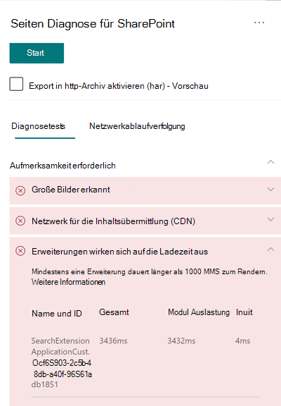

# Optimieren der Leistung benutzerdefinierter Erweiterungen in modernen SharePoint Online-Webseiten

In diesem Artikel erfahren Sie, wie Sie die Auswirkungen benutzerdefinierter Erweiterungen auf die vom Benutzer empfundene Latenz bestimmen und häufig auftretende Probleme beheben können.

## Verwenden Sie das Tool „Seitendiagnose für SharePoint“, um benutzerdefinierte Erweiterungen zu analysieren

Das Tool "Seitendiagnose für SharePoint" ist eine Browsererweiterung für den neuen Microsoft Edge (https://www.microsoft.com/edge) und Chrome, mit denen Sie SharePoint Online-Seiten sowohl in modernen Portal- als auch in klassischen Veröffentlichungs-Websites analysieren können. Das Tool stellt für jede analysierte Seite einen Bericht bereit, in dem die Leistung der Seite anhand einer definierten Gruppe von Leistungskriterien dargestellt wird. Wenn Sie das Tool "Seitendiagnose für SharePoint" installieren und mehr darüber erfahren möchten, besuchen Sie [Verwenden des Seitendiagnose-Tools für SharePoint Online](page-diagnostics-for-spo.md).

>[!NOTE]
>Das Seitendiagnose-Tool funktioniert nur für SharePoint Online und kann nicht auf einer SharePoint-Systemseite verwendet werden.

Wenn Sie eine Seite einer SharePoint-Website mit dem Tool "Seitendiagnose für SharePoint" analysieren, werden im Ergebnis **Erweiterungen, die sich auf die Ladezeit auswirken** und/oder **Zu viele Erweiterungen verwendet** im Bereich _Diagnosetests_ Informationen über benutzerdefinierte Erweiterungen angezeigt, die die Baselinemetrik überschreiten. 

Mögliche Ergebnisse sind:

- **Handlungsbedarf** (rot): eine _benutzerdefinierte_ Erweiterung, bei der der Ladevorgang länger als **eine** Sekunde dauert. Die in den Testergebnissen angezeigte Gesamtladezeit wird nach "Modul laden" und "Initialisieren" unterteilt. Außerdem können sich zu viele Erweiterungen auf einer Seite auf die Ladezeit der Seite auswirken. Dies wird hervorgehoben, wenn **Sieben** oder mehr Erweiterungen auf der Seite verwendet werden.
- **Verbesserungsmöglichkeiten** (gelb) Werden **fünf** oder mehr Erweiterungen verwendet, werden sie in diesem Abschnitt als Warnung hervorgehoben. Sobald sieben oder mehr verwendet werden, werden diese dann unter "Aktion erforderlich" hervorgehoben.
- **Keine Aktion erforderlich** (grün): Keine Erweiterung benötigt länger als eine Sekunde zum Laden.

Wenn sich eine Erweiterung auf die Seitenladezeit auswirken oder die Seite  zu viele Erweiterungen enthält, wird das Ergebnis im Abschnitt "Achtung" der Ergebnisse angezeigt. Klicken Sie auf das Ergebnis, um Einzelheiten anzuzeigen, wenn Erweiterungen langsam geladen oder zu viele Erweiterungen hervorgehoben werden. Zukünftige Updates des Tools "Seitendiagnose für SharePoint" können Aktualisierungen der Analyseregeln enthalten. Stellen Sie daher sicher, dass Sie immer über die neueste Version des Tools verfügen.

Die verfügbaren Informationen in den Ergebnissen umfassen:

- **Name und ID** zeigt identifizierende Informationen an, die Ihnen beim Auffinden der Erweiterung auf der Seite helfen können.
- **Total** shows the total time for the extension to module load and initialize. Dies ist die gesamt relative Zeit, die die Erweiterung für die Ausführung auf der Seite vom Anfang bis zum Ende auf sich genommen hat.
- **Module Load** zeigt die Zeit an, die zum Herunterladen, Auswerten und Laden der Erweiterungen JavaScript- und CSS-Dateien. Anschließend wird der Vorgang "Init" gestartet.
- **"Initialisieren"** zeigt die Zeit an, die die Erweiterung zum Initialisieren der Daten auf sich genommen hat.
    Es handelt sich um einen asynchronen Aufruf, und die Initzeit ist die Berechnung der Zeit für die onInit-Funktion, wenn die zurückgegebene Zusage aufgelöst wird.

Diese Informationen dienen Designern und Entwicklern zum Beheben von Problemen. Diese Informationen sollten Ihrem Entwurfs- und Entwicklungsteam bereitgestellt werden.

## Übersicht über Erweiterungen

Mit SharePoint-Framework(SPFx)-Erweiterungen können Sie die SharePoint-Benutzeroberfläche erweitern. Mit SharePoint-Framework-Erweiterungen können Sie weitere Facetten der SharePoint-Benutzeroberfläche anpassen, u. a. Benachrichtigungsbereiche, Symbolleisten und Listendatenansichten.

Erweiterungen können sich auf die Leistung einer SharePoint-Seite negativ auswirken, da außerdem CPU- und Netzwerkressourcen arbeiten müssen.

Es gibt vier Typen von Erweiterungen:

- **Anwendungscustomizer** fügen der Seite Skripts hinzu, greifen auf bekannte HTML-Element-Platzhalter zu und erweitern sie um benutzerdefinierte Renderings.
- **Feldcustomizer** stellen modifizierte Datenansichten für Felder in einer Liste bereit.
- **Befehlssätze** erweitern die SharePoint-Befehlsoberfläche um neue Aktionen und stellen clientseitigen Code bereit, mit dessen Hilfe Sie Verhaltensweisen implementieren können.
- **Suchabfrage-Modifizierer (nur Vorschau)** werden unmittelbar vor der Suchabfrage aufgerufen.

## Beheben von Problemen mit der Leistung von Erweiterungen

Befolgen Sie die Anweisungen in diesem Abschnitt, um Leistungsprobleme mit Erweiterungen zu erkennen und zu beheben, die in den Ergebnissen **Erweiterungen, die sich auf die Seitenladezeit auswirken** aufgelistet werden.

>[!NOTE]
>Anwendungscustomizer können in der Frühphase des Lebenszyklus einer Seite ausgeführt werden und die Leistung anderer Erweiterungen auf der Seite beeinflussen.

Die Überwachungsergebnisse im Seitendiagnosetool zeigen zwei Phasen der Ausführung einer Erweiterung an, um die potenziellen Auswirkungen auf die Leistung zu erkennen.

- **Modul laden** ist die Dauer des Ladens der Erweiterung, was von der Größe einer Erweiterung beeinflusst wird. Deshalb empfiehlt es sich, nur die erforderlichen Bibliotheken in der Erweiterung zu bündeln und auch kleinere Bibliotheken auszuwählen.
- **Initialisieren** ist die Initialisierungszeit der Erweiterung, und Erweiterungsentwickler sollten überlegen, ob die Erweiterung unnötig arbeitet oder während der Initialisierungsphase zu viele Befehle ausführt.

Seitenautoren können das Überwachungsergebnis auch verwenden, um festzustellen, ob eine Seite zu viele Erweiterungen hat, da sich dies negativ auf die Leistung einer Seite auswirkt.

- **Erweiterungsgröße und Abhängigkeiten**
  - Die Verwendung von Office 365 CDN ist für den optimalen statischen Ressourcendownload erforderlich. Öffentliche CDN-Quellen sind für _js/css_-Dateien vorzuziehen. Weitere Informationen zur Verwendung von Office 365 CDN finden Sie unter [Verwendung von Office 365 Content Delivery Network (CDN) mit SharePoint Online](use-microsoft-365-cdn-with-spo.md).
  - Verwenden Sie Frameworks wie _React_ und _Fabric-Importe_, die Bestandteil des SharePoint-Frameworks (SPFx) sind. Weitere Informationen finden Sie unter [Übersicht über das SharePoint-Framework](https://docs.microsoft.com/sharepoint/dev/spfx/sharepoint-framework-overview).
  - Stellen Sie sicher, dass Sie die neueste Version des SharePoint-Frameworks verwenden, und führen Sie stets Aktualisierungen auf neue Versionen durch, sobald diese verfügbar sind.
- **Datenabruf/-zwischenspeicherung**
  - Wenn sich die Erweiterung auf zusätzliche Serveraufrufe stützt, um Daten für die Anzeige abzurufen, stellen Sie sicher, dass diese Server-APIs schnell sind und/oder clientseitige Zwischenspeicherung implementieren (z. B. die Verwendung von _localStorage_ oder _IndexDB_ für größere Sets).
  - Wenn zum Rendern wichtiger Daten mehrere Aufrufe erforderlich sind, sollten Sie die Batchverarbeitung auf dem Server oder andere Methoden zum Konsolidieren von Anforderungen in einen einzigen Anruf erwägen.
  - Wenn bestimmte Datenelemente eine langsamere API benötigen, für das anfängliche Rendern aber nicht kritisch sind, entkoppeln Sie diese mit einem separaten Aufruf, der nach dem Rendern kritischer Daten ausgeführt wird.
  - Wenn mehrere Webparts dieselben Daten nutzen, verwenden Sie eine gemeinsame Datenschicht, um doppelte Aufrufe zu vermeiden.
- **Renderingzeit**
  - Alle Medienquellen wie Bilder und Videos sollten an die Grenzen des Containers, Geräts und/oder Netzwerks angepasst sein, um das Herunterladen unnötig großer Anlagen zu vermeiden. Weitere Informationen zu Inhaltsabhängigkeiten finden Sie unter [Verwendung von Office 365 Content Delivery Network (CDN) mit SharePoint Online](use-microsoft-365-cdn-with-spo.md).
  - Vermeiden Sie API-Aufrufe, die einen Umbruch, komplexe CSS-Regeln oder komplizierte Animationen verursachen. Weitere Informationen finden Sie unter [Minimizing browser reflow](https://developers.google.com/speed/docs/insights/browser-reflow) (Minimieren von Browserumbrüchen).
  - Vermeiden Sie die Verwendung von verketteten Aufgaben mit langen Ausführungszeiten. Verteilen Sie Aufgaben mit langen Ausführungszeiten stattdessen auf separate Warteschlangen. Weitere Informationen finden Sie unter [Optimize JavaScript Execution](https://developers.google.com/web/fundamentals/performance/rendering/optimize-javascript-execution) (Optimieren der JavaScript-Ausführung).
  - Reservieren Sie entsprechenden Speicherplatz für asynchrones Rendern von Medien oder visuellen Elementen, um übersprungene Frames und Stottern zu vermeiden (auch als _Jank_ bezeichnet).
  - Wenn ein bestimmter Browser ein für das Rendern verwendetes Feature nicht unterstützt, laden Sie ein Polyfill, oder schließen Sie die Ausführung von abhängigem Code aus. Wenn das Feature nicht kritisch ist, entfernen Sie Ressourcen wie Ereignishandler, um Speicherlecks zu vermeiden.

Bevor Sie Seitenrevisionen zur Behebung von Leistungsproblemen durchführen, notieren Sie sich die Ladezeit der Seite in den Analyseergebnissen. Führen Sie das Tool nach Ihrer Revision erneut aus, um zu sehen, ob das neue Ergebnis innerhalb des Grenzwertes liegt, und überprüfen Sie die Ladezeit der neuen Seite, um festzustellen, ob eine Verbesserung vorliegt.

>[!NOTE]
>Die Seitenladezeit kann aufgrund einer Vielzahl von Faktoren wie Netzwerklast, Tageszeit und anderen vorübergehenden Schwierigkeiten variieren. Sie sollten die Seitenladezeit einige Male vor und nach der Durchführung von Änderungen testen, um einen Mittelwert zu berechnen.

## Verwandte Themen

[Optimieren der Leistung von SharePoint Online](tune-sharepoint-online-performance.md)

[Optimieren der Leistung von Office 365](tune-microsoft-365-performance.md)

[Leistung in der modernen SharePoint-Oberfläche](https://docs.microsoft.com/sharepoint/modern-experience-performance)

[Netzwerke für die Inhaltsübermittlung](content-delivery-networks.md)

[Verwenden des Office 365 Content Delivery Network (CDN) mit SharePoint Online](use-microsoft-365-cdn-with-spo.md)
