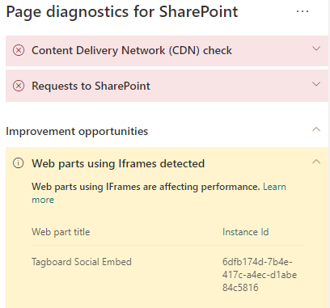

# Optimieren Sie iFrames für moderne und klassische Veröffentlichungswebsiteseiten von SharePoint Online

iFrames können hilfreich sein, wenn Sie umfangreiche Inhalte wie Videos oder andere Medien anzeigen. Da iFrames jedoch eine separate Seite innerhalb der SharePoint-Websiteseite laden, können in den iFrame geladene Inhalte große Bilder, Videos oder andere Elemente enthalten, die zur Gesamtladezeit der Seite beitragen können und die Sie nicht auf der Seite steuern können. In diesem Artikel erfahren Sie, wie Sie die Auswirkungen von iFrames auf Ihren Seiten auf die vom Benutzer empfundene Latenz bestimmen und häufig auftretende Probleme beheben können.

>[!NOTE]
>Weitere Informationen zur Leistung in modernen SharePoint Online-Websites finden Sie unter [Leistung in der modernen SharePoint-Umgebung](https://docs.microsoft.com/sharepoint/modern-experience-performance).

## Verwenden des Tools "Seitendiagnose für SharePoint" zum Analysieren von Webparts mithilfe von iFrames

Das Tool "Seitendiagnose für SharePoint" ist eine Browsererweiterung für das neue Microsoft Edge (https://www.microsoft.com/edge) und Chrome, mit der Sie SharePoint-Seiten sowohl in modernen Portal- als auch in klassischen Veröffentlichungs-Websites analysieren können. Das Tool stellt für jede analysierte Seite einen Bericht bereit, in dem die Leistung der Seite anhand einer definierten Gruppe von Leistungskriterien dargestellt wird. Wenn Sie das Tool "Seitendiagnose für SharePoint" installieren und mehr darüber erfahren möchten, besuchen Sie [Verwenden des Seitendiagnose-Tools für SharePoint Online](page-diagnostics-for-spo.md).

>[!NOTE]
>Das Seitendiagnose-Tool funktioniert nur für SharePoint Online und kann nicht auf einer SharePoint-Systemseite verwendet werden.

Wenn Sie eine SharePoint-Websiteseite mit dem Tool für die Seitendiagnose für SharePoint analysieren, sehen Sie Informationen über die Webparts mit iFrames im Bereich _Diagnosetests_. Die Baseline-Metrik ist für moderne und klassische Websites identisch.

Mögliche Ergebnisse sind:

- **Aufmerksamkeit erforderlich** (rot): Die Seite enthält **drei oder mehr** Webparts mit iFrames
- **Verbesserungsmöglichkeiten** (gelb): Die Seite enthält **ein oder zwei** Webparts mit iFrames
- **Keine Aktion erforderlich** (grün): Die Seite enthält keine Webparts mit iFrames

Wenn das Ergebnis **Webparts mit iFrames erkannt** entweder im Abschnitt **Verbesserungsmöglichkeiten** oder **Aufmerksamkeit erforderlich** der Ergebnisse erscheint, können Sie auf das Ergebnis klicken, um die Webparts anzuzeigen, die iFrames enthalten.

## Beheben von Problemen mit der Leistung von iFrame

Verwenden Sie das Ergebnis **Webparts mit iFrames erkannt** im Tool "Seitendiagnose", um festzustellen, welche Webparts iFrames enthalten und möglicherweise zu langsameren Seitenladezeiten beitragen.

iFrames sind von Natur aus langsam, da sie eine separate externe Seite laden, die alle zugehörigen Inhalte wie Javascript, CSS und Framework-Elemente enthält, was den Overhead der Seiten um den Faktor zwei oder mehr erhöhen kann.

Folgen Sie den nachstehenden Anleitungen, um die optimale Verwendung von iFrames zu gewährleisten.

- Verwenden Sie nach Möglichkeit Bilder anstelle von iFrames, wenn die Vorschau zunächst klein oder nicht interaktiv ist.
- Wenn iFrames verwendet werden müssen, minimieren Sie die Anzahl und/oder verschieben Sie diese aus dem Ansichtsfenster.
- Eingebettete Office-Dateien wie Word, Excel und PowerPoint, sind interaktiv, aber werden nur langsam geladen. Bildminiaturansichten mit einem Link zum vollständigen Dokument werden häufig besser ausgeführt.
- Eingebettete YouTube-Videos und Twitter-Feeds sind in der Regel besser in iFrames, aber verwenden Sie diese Arten von Einbettungen mit Bedacht.
- Isolierte Webparts sind eine vernünftige Ausnahme, verringern aber deren Anzahl und Position im Ansichtsbereich.
- Wenn sich ein iFrame außerhalb des Ansichtsfensters befindet, sollten Sie einen _IntersectionObserver_ verwenden, um das Rendern des iFrame zu verzögern, bis er in Sicht kommt.

Bevor Sie Seitenrevisionen zur Behebung von Leistungsproblemen durchführen, notieren Sie sich die Ladezeit der Seite in den Analyseergebnissen. Führen Sie das Tool nach Ihrer Revision erneut aus, um zu sehen, ob das neue Ergebnis innerhalb des Grenzwertes liegt, und überprüfen Sie die Ladezeit der neuen Seite, um festzustellen, ob eine Verbesserung vorliegt.

>[!NOTE]
>Die Seitenladezeit kann aufgrund einer Vielzahl von Faktoren wie Netzwerklast, Tageszeit und anderen vorübergehenden Schwierigkeiten variieren. Sie sollten die Seitenladezeit einige Male vor und nach der Durchführung von Änderungen testen, um einen Mittelwert zu berechnen.

## Verwandte Themen

[Optimieren der Leistung von SharePoint Online](tune-sharepoint-online-performance.md)

[Optimieren der Leistung von Office 365](tune-microsoft-365-performance.md)

[Leistung in der modernen SharePoint-Oberfläche](https://docs.microsoft.com/sharepoint/modern-experience-performance)
