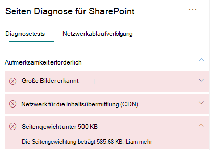

# Optimieren Sie die Seitenstärke von modernen Websiteseiten in SharePoint OnlineOptimize page weight in SharePoint Online modern site pages

Die modernen Websiteseiten von SharePoint Online enthalten serialisierten Code, der erforderlich ist, um den Seiteninhalt der Seite darzustellen, einschließlich Bilder, Text, Objekte im Inhaltsbereich unter der Navigations-/Befehlsleiste und anderen HTML-Code, der den Rahmen der Seite bildet.SharePoint Online modern site pages contain serialized code that is required to render page content of the page, including images, text, objects in the content area underneath navigation/command bars and other HTML code that forms the framework of the page. Die Seitenstärke ist eine Maßeinheit für diesen HTML-Code und sollte begrenzt sein, um optimale Seitenladezeiten sicherzustellen.Page weight is a measurement of this HTML code, and should be limited to ensure optimal page load times.

Dieser Artikel wird Ihnen helfen zu verstehen, wie Sie die Seitenstärke in Ihren modernen Websiteseiten reduzieren können.This article will help you understand how to reduce page weight in your modern site pages.

>[!NOTE]
>Weitere Informationen zur Leistung in modernen SharePoint Online-Portalen finden Sie unter [Leistung in der modernen SharePoint-Umgebung](https://docs.microsoft.com/sharepoint/modern-experience-performance).For more information about performance in SharePoint Online modern portals, see [Performance in the modern SharePoint experience](https://docs.microsoft.com/sharepoint/modern-experience-performance).

## Verwenden Sie das Tool „Seitendiagnose für SharePoint“, um die Seitenstärke zu analysierenUse the Page Diagnostics for SharePoint tool to analyze page weight

Das Tool "Seitendiagnose für SharePoint" ist eine Browsererweiterung für das neue Microsoft Edge (https://www.microsoft.com/edge) und Chrome, mit der Sie SharePoint-Seiten sowohl in modernen Portal- als auch in klassischen Veröffentlichungs-Websites analysieren können.The Page Diagnostics for SharePoint tool is a browser extension for the new Microsoft Edge (https://www.microsoft.com/edge) and Chrome browsers that analyzes both SharePoint Online modern portal and classic publishing site pages. Das Tool stellt für jede analysierte Seite einen Bericht bereit, in dem die Leistung der Seite anhand einer definierten Gruppe von Leistungskriterien dargestellt wird.The tool provides a report for each analyzed page showing how the page performs against a defined set of performance criteria. Wenn Sie das Tool "Seitendiagnose für SharePoint" installieren und mehr darüber erfahren möchten, besuchen Sie [Verwenden des Seitendiagnose-Tools für SharePoint Online](page-diagnostics-for-spo.md).To install and learn about the Page Diagnostics for SharePoint tool, visit [Use the Page Diagnostics tool for SharePoint Online](page-diagnostics-for-spo.md).

>[!NOTE]
>Das Seitendiagnose-Tool funktioniert nur für SharePoint Online und kann nicht auf einer SharePoint-Systemseite verwendet werden.The Page Diagnostics tool only works for SharePoint Online, and cannot be used on a SharePoint system page.

Wenn Sie eine SharePoint-Websiteseite mit dem Tool für die Seitendiagnose für SharePoint analysieren, sehen Sie Informationen über die Seite im Ergebnis **Seitenstärke unter 500 KB** des Bereichs _Diagnosetests_.When you analyze a SharePoint site page with the Page Diagnostics for SharePoint tool, you can see information about page in the **Page weight under 500KB** result of the _Diagnostic tests_ pane. Das Ergebnis wird grün angezeigt, wenn die Seitenstärke unter dem Basiswert liegt, und rot, wenn die Seitenstärke den Basiswert überschreitet.The result will appear in green if the page weight is under the baseline value, and red if the page weight exceeds the baseline value.

Mögliche Ergebnisse beinhalten:Possible results include:

- **Aufmerksamkeit erforderlich** (rot): Die Seitenstärke überschreitet 500 KB**Attention required** (red): Page weight exceeds 500KB
- **Keine Aktion erforderlich** (grün): Die Seitenstärke liegt unter 500 KB**No action required** (green): Page weight is under 500KB

Wenn das Ergebnis **Seitenstärke unter 500 KB** im Abschnitt **Aufmerksamkeit erforderlich** angezeigt wird, können Sie auf das Ergebnis klicken, um Details anzuzeigen.If the **Page weight under 500KB** result appears in the **Attention required** section, you can click the result for details.

## Beheben von Problemen mit der SeitenstärkeRemediate page weight issues

Wenn die Seitenstärke 500 KB überschreitet, können Sie die Gesamtladezeit der Seite verbessern, indem Sie die Anzahl der Webparts reduzieren und den Seiteninhalt auf ein angemessenes Maß beschränken.If page weight exceeds 500KB, you can improve overall page load time by reducing the number of web parts and limiting page content to an appropriate degree.

Allgemeine Anleitungen zum Reduzieren der Seitenstärke umfassen:General guidance for reducing page weight includes:

- Beschränken Sie den Seiteninhalt auf eine angemessene Menge und verwenden Sie mehrere Seiten für verwandte Inhalte.Limit the page content to a reasonable amount and use multiple pages for related content.
- Minimieren Sie den Einsatz von Webparts mit großen Eigenschaftenbehälter.Minimize the use of web parts that have large property bags.
- Verwenden Sie nach Möglichkeit nicht interaktive Rollup-Ansichten.Use non-interactive rollup views when possible.
- Optimieren Sie die Bildgrößen, indem Sie die Bilder entsprechend dimensionieren, komprimierte Bildformate verwenden und sicherstellen, dass sie von einem CDN heruntergeladen werden.Optimize image sizes by sizing images appropriately, using compressed image formats and ensuring that they are downloaded from a CDN.

Weitere Anleitungen zum Einschränken der Seitenstärke finden Sie im folgenden Artikel:You can find additional guidance for limiting page weight in the following article:

- [Optimieren der Seitenleistung in SharePointOptimize page performance in SharePoint](https://docs.microsoft.com/sharepoint/dev/general-development/optimize-page-performance-in-sharepoint)

Bevor Sie Seitenrevisionen zur Behebung von Leistungsproblemen durchführen, notieren Sie sich die Ladezeit der Seite in den Analyseergebnissen.Before you make page revisions to remediate performance issues, make a note of the page load time in the analysis results. Führen Sie das Tool nach Ihrer Revision erneut aus, um zu sehen, ob das neue Ergebnis innerhalb des Grenzwertes liegt, und überprüfen Sie die Ladezeit der neuen Seite, um festzustellen, ob eine Verbesserung vorliegt.Run the tool again after your revision to see if the new result is within the baseline standard, and check the new page load time to see if there was an improvement.

>[!NOTE]
>Die Seitenladezeit kann aufgrund einer Vielzahl von Faktoren wie Netzwerklast, Tageszeit und anderen vorübergehenden Schwierigkeiten variieren.Page load time can vary based on a variety of factors such as network load, time of day, and other transient conditions. Sie sollten die Seitenladezeit einige Male vor und nach der Durchführung von Änderungen testen, um einen Mittelwert zu berechnen.You should test page load time a few times before and after making changes to help you average the results.

## Verwandte ThemenRelated topics

[Optimieren der Leistung von SharePoint OnlineTune SharePoint Online performance](tune-sharepoint-online-performance.md)

[Optimieren der Leistung von Office 365Tune Office 365 performance](tune-microsoft-365-performance.md)

[Leistung in der modernen SharePoint-OberflächePerformance in the modern SharePoint experience](https://docs.microsoft.com/sharepoint/modern-experience-performance)

[Netzwerke für die InhaltsübermittlungContent delivery networks](content-delivery-networks.md)

[Verwenden des Office 365 Content Delivery Network (CDN) mit SharePoint OnlineUse the Office 365 Content Delivery Network (CDN) with SharePoint Online](use-microsoft-365-cdn-with-spo.md)
