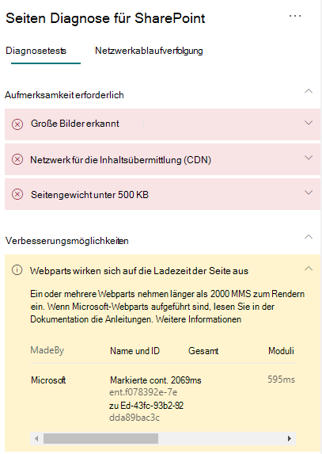

# Optimieren der Leistung von Webparts in modernen SharePoint Online-Websites

Die Seiten von modernen SharePoint Online-Website enthalten Webparts, die sich auf die allgemeinen Seitenladezeiten auswirken können. In diesem Artikel erfahren Sie, wie Sie die Auswirkungen von Webparts auf Ihren Seiten auf die vom Benutzer empfundene Latenz bestimmen und häufig auftretende Probleme beheben können.

>[!NOTE]
>Weitere Informationen zur Leistung in modernen SharePoint Online-Portalen finden Sie unter [Leistung in der modernen SharePoint-Umgebung](https://docs.microsoft.com/sharepoint/modern-experience-performance).

## Verwenden des Tools "Seitendiagnose für SharePoint" zum Analysieren von Webparts

Das Tool "Seitendiagnose für SharePoint" ist eine Browsererweiterung für neue Microsoft Edge- (https://www.microsoft.com/edge) und Chrome-Browser, mit der Sie SharePoint Online-Seiten sowohl in modernen Portal- als auch in klassischen Veröffentlichungs-Websites analysieren können. Das Tool stellt für jede analysierte Seite einen Bericht bereit, in dem die Leistung der Seite anhand einer definierten Gruppe von Leistungskriterien dargestellt wird. Wenn Sie das Tool "Seitendiagnose für SharePoint" installieren und mehr darüber erfahren möchten, besuchen Sie [Verwenden des Seitendiagnose-Tools für SharePoint Online](page-diagnostics-for-spo.md).

>[!NOTE]
>Das Seitendiagnose-Tool funktioniert nur für SharePoint Online und kann nicht auf einer SharePoint-Systemseite verwendet werden.

Wenn Sie eine Seite einer SharePoint-Website mit dem Tool "Seitendiagnose für SharePoint" analysieren, werden im Ergebnis **Webparts, die sich auf die Seitenladezeit auswirken** im Bereich _Diagnosetests_ Informationen über Webparts angezeigt, die die Baselinemetrik überschreiten.

Mögliche Ergebnisse sind:

- **Handlungsbedarf** (rot): alle _benutzerdefinierten_-Webparts, die im Ansichtsfenster (dem sichtbaren Bereich des Bildschirms, der zuerst geladen wird) sichtbar sind und zum Laden länger als **zwei** Sekunden benötigen. Alle _benutzerdefinierten_ Webparts außerhalb des Ansichtsfensters, die zum Laden länger als **vier** Sekunden benötigen. Die Gesamtladezeit wird in den Testergebnissen angezeigt und nach "Modul laden", "Lazy Load", "Initialisieren" und "Rendern" unterteilt.
- **Verbesserung möglich** (gelb): Elemente, die sich möglicherweise auf die Seitenladezeit auswirken, werden in diesem Abschnitt angezeigt und sollten überprüft und überwacht werden. Dazu können Microsoft-"Out-of-Box"-Webparts (OOTB) gehören. Die Ergebnisse für alle in diesem Abschnitt angezeigten Microsoft-Webparts werden automatisch an Microsoft gemeldet, daher **sind keine Maßnahmen erforderlich**. Sie sollten nur dann ein Supportticket für die Untersuchung öffnen, wenn die Leistung auf der Seite sehr schlecht ist und **alle Microsoft-Webparts** auf der Seite in den Ergebnissen im Abschnitt **Verbesserung möglich** angezeigt werden. Beachten Sie, dass die Ergebnisse in einem künftigen Update der Seitendiagnose für SharePoint auf Grundlage der spezifischen Konfiguration des Microsoft-Webparts weiter aufgeschlüsselt werden.
- **Keine Aktion erforderlich** (grün): Kein Webpart braucht länger als **zwei** Sekunden, um Daten zurückzugeben.

Wenn das Ergebnis **Webparts, die sich auf die Seitenladezeit auswirken** entweder im Abschnitt **Handlungsbedarf** oder im Abschnitt **Verbesserung möglich** angezeigt wird, klicken Sie auf das Ergebnis, um Details zu den Webparts anzuzeigen, die langsam geladen werden. Zukünftige Updates des Tools "Seitendiagnose für SharePoint" können Aktualisierungen der Analyseregeln enthalten. Stellen Sie daher sicher, dass Sie immer über die neueste Version des Tools verfügen.

Die verfügbaren Informationen in den Ergebnissen umfassen:

- **Erstellt von** zeigt an, ob es sich bei dem Webpart um ein benutzerdefiniertes oder ein Microsoft-OOTB-Webpart handelt.
- **Name und ID** zeigt identifizierende Informationen an, die Ihnen beim Auffinden des Webparts auf der Seite helfen können.
- **Gesamt** zeigt die Gesamtzeit für das Laden des Webparts an.
- **Modul laden** zeigt die Zeit an, die zum Abrufen und Laden der Webpartkomponenten benötigt wird.
- **Lazy Load** zeigt die Zeit für das verzögerte Laden von Webparts an, die im Hauptabschnitt der Seite nicht angezeigt werden.
- **Initialisieren** zeigt die Zeit an, die für das Initialisieren eines Webparts benötigt wird.
- **Rendern** zeigt die Zeit an, die das Webpart zum Abrufen und Rendern von Ergebnissen benötigt.

Diese Informationen dienen Designern und Entwicklern zum Beheben von Problemen. Diese Informationen sollten Ihrem Entwurfs- und Entwicklungsteam bereitgestellt werden.

## Beheben von Problemen mit der Leistung von Webparts

Befolgen Sie die Anweisungen in diesem Abschnitt, um Leistungsprobleme mit Webparts zu erkennen und zu beheben, die in den Ergebnissen **Webparts, die sich auf die Seitenladezeit auswirken** angezeigt werden.

Es gibt drei Kategorien möglicher Ursachen für eine schlechte Webpartleistung. Verwenden Sie die folgenden Informationen, um zu bestimmen, welche Probleme auf Ihr Szenario zutreffen, und um diese zu beheben.

- Skriptgröße und Abhängigkeiten von Webparts
  - Optimieren des anfänglichen Skripts, mit dem das Hauptszenario für _Nur Ansichtsmodus_ gerendert wird.
  - Verschieben Sie die weniger häufigen Szenarien und den Code für den Bearbeitungsmodus (z. B. den Eigenschaftenbereich) mithilfe der _import()_-Anweisung in separate Abschnitte.
  - Überprüfen Sie die Abhängigkeiten der Datei _package.json_, um sämtlichen ungenutzten Code vollständig zu entfernen. Verschieben Sie alle nur auf Test/Build-Versionen bezogenen Abhängigkeiten nach "devDependencies".
  - Die Verwendung von Office 365 CDN ist für den optimalen statischen Ressourcendownload erforderlich. Öffentliche CDN-Quellen sind für _js/css_-Dateien vorzuziehen. Weitere Informationen zur Verwendung von Office 365 CDN finden Sie unter [Verwendung von Office 365 Content Delivery Network (CDN) mit SharePoint Online](use-microsoft-365-cdn-with-spo.md).
  - Verwenden Sie Frameworks wie _React_ und _Fabric-Importe_, die Bestandteil des SharePoint-Frameworks (SPFx) sind. Weitere Informationen finden Sie unter [Übersicht über das SharePoint-Framework](https://docs.microsoft.com/sharepoint/dev/spfx/sharepoint-framework-overview).
  - Stellen Sie sicher, dass Sie die neueste Version des SharePoint-Frameworks verwenden, und führen Sie stets Aktualisierungen auf neue Versionen durch, sobald diese verfügbar sind.
- Datenabruf/-zwischenspeicherung
  - Wenn sich das Webpart auf zusätzliche Serveraufrufe stützt, um Daten für die Anzeige abzurufen, stellen Sie sicher, dass diese Server-APIs schnell sind und/oder clientseitige Zwischenspeicherung implementieren ( z. B. die Verwendung von _localStorage_ oder _IndexDB_ für größere Datenmengen).
  - Wenn zum Rendern wichtiger Daten mehrere Aufrufe erforderlich sind, sollten Sie die Batchverarbeitung auf dem Server oder andere Methoden zum Konsolidieren von Anforderungen in einen einzigen Anruf erwägen.
  - Wenn bestimmte Datenelemente eine langsamere API benötigen, für das anfängliche Rendern aber nicht kritisch sind, entkoppeln Sie diese mit einem separaten Aufruf, der nach dem Rendern kritischer Daten ausgeführt wird.
  - Wenn mehrere Webparts dieselben Daten nutzen, verwenden Sie eine gemeinsame Datenschicht, um doppelte Aufrufe zu vermeiden.
- Renderingzeit
  - Alle Medienquellen wie Bilder und Videos sollten an die Grenzen des Containers, Geräts und/oder Netzwerks angepasst sein, um das Herunterladen unnötig großer Anlagen zu vermeiden. Weitere Informationen zu Inhaltsabhängigkeiten finden Sie unter [Verwendung von Office 365 Content Delivery Network (CDN) mit SharePoint Online](use-microsoft-365-cdn-with-spo.md).
  - Vermeiden Sie API-Aufrufe, die einen Umbruch, komplexe CSS-Regeln oder komplizierte Animationen verursachen. Weitere Informationen finden Sie unter [Minimizing browser reflow](https://developers.google.com/speed/docs/insights/browser-reflow) (Minimieren von Browserumbrüchen).
  - Vermeiden Sie die Verwendung von verketteten Aufgaben mit langen Ausführungszeiten. Verteilen Sie Aufgaben mit langen Ausführungszeiten stattdessen auf separate Warteschlangen. Weitere Informationen finden Sie unter [Optimize JavaScript Execution](https://developers.google.com/web/fundamentals/performance/rendering/optimize-javascript-execution) (Optimieren der JavaScript-Ausführung).
  - Reservieren Sie entsprechenden Speicherplatz für asynchrones Rendern von Medien oder visuellen Elementen, um übersprungene Frames und Stottern zu vermeiden (auch als _Jank_ bezeichnet).
  - Wenn ein bestimmter Browser ein für das Rendern verwendetes Feature nicht unterstützt, laden Sie ein Polyfill, oder schließen Sie die Ausführung von abhängigem Code aus. Wenn das Feature nicht kritisch ist, entfernen Sie Ressourcen wie Ereignishandler, um Speicherlecks zu vermeiden.

Bevor Sie Seitenrevisionen zur Behebung von Leistungsproblemen durchführen, notieren Sie sich die Ladezeit der Seite in den Analyseergebnissen. Führen Sie das Tool nach Ihrer Revision erneut aus, um zu sehen, ob das neue Ergebnis innerhalb des Grenzwertes liegt, und überprüfen Sie die Ladezeit der neuen Seite, um festzustellen, ob eine Verbesserung vorliegt.

>[!NOTE]
>Die Seitenladezeit kann aufgrund einer Vielzahl von Faktoren wie Netzwerklast, Tageszeit und anderen vorübergehenden Schwierigkeiten variieren. Sie sollten die Seitenladezeit einige Male vor und nach der Durchführung von Änderungen testen, um einen Mittelwert zu berechnen.

## Verwandte Themen

[Optimieren der Leistung von SharePoint Online](tune-sharepoint-online-performance.md)

[Optimieren der Leistung von Office 365](tune-microsoft-365-performance.md)

[Leistung in der modernen SharePoint-Oberfläche](https://docs.microsoft.com/sharepoint/modern-experience-performance)

[Netzwerke für die Inhaltsübermittlung](content-delivery-networks.md)

[Verwenden des Office 365 Content Delivery Network (CDN) mit SharePoint Online](use-microsoft-365-cdn-with-spo.md)
